# Décembre 2022

> Journal de l'[expérience 3](../README.md) · **décision au 2022-11-30** · **exécution au 2022-12-01**
> Portefeuille au 2022-12-30 : **9 764,22 €** (base 97,64) · TR39 89,82 · alpha du mois **+3,00 pt** · depuis janvier **+7,82 pt**

---

## 1. Les actualités du mois précédent

**Novembre 2022.** Le rebond se confirme et s'élargit. L'inflation américaine
d'octobre, publiée le 10 novembre, ressort enfin en dessous des attentes, et le
marché conclut au ralentissement du rythme des hausses de taux. Les indices
européens gagnent encore plusieurs points ; les bancaires, l'aéronautique et le
luxe mènent la reprise.

La Chine assouplit sa politique « zéro Covid » après des manifestations
inhabituelles, ce que les valeurs du luxe et des matières premières accueillent
favorablement. L'euro repasse au-dessus de 1,03 dollar. Le pétrole, lui, recule
sous ses niveaux de février : la crainte de la récession l'emporte désormais sur
celle de la pénurie.

## 2. Le dépouillement des thèses écrites au 2022-10-31

> Piste **S4**. Ces énoncés ont été écrits le mois dernier, avant de connaître ce mois-ci. Aucun n'a été retouché ; le verdict est calculé.

| Valeur | Thèse | Énoncé | Constaté | Verdict |
|---|---|---|---|---|
| `ACA.PA` | Canal | clôture entre 6,05 € et 6,60 € au 2022-11-30 | 7,17 € | démentie |
| `ACA.PA` | Reflexive | AUCUNE SEQUENCE : écart contre TR39 dans ± 6,43 pt (σ̂), au 2022-11-30 | -1,26 pt | **confirmée** |
| `AI.PA` | Canal | clôture entre 83,74 € et 99,72 € au 2022-11-30 | 106,02 € | démentie |
| `AIR.PA` | Canal | clôture entre 79,05 € et 101,76 € au 2022-11-30 | 101,62 € | **confirmée** |
| `ALO.PA` | Canal | clôture entre 12,86 € et 19,25 € au 2022-11-30 | 24,64 € | démentie |
| `ALO.PA` | Reflexive | AUCUNE SEQUENCE : écart contre TR39 dans ± 9,38 pt (σ̂), au 2022-11-30 | 13,30 pt | démentie |
| `BN.PA` | Canal | clôture entre 39,91 € et 42,44 € au 2022-11-30 | 43,88 € | démentie |
| `BNP.PA` | Canal | clôture entre 32,46 € et 35,24 € au 2022-11-30 | 41,30 € | démentie |
| `BNP.PA` | Reflexive | AUCUNE SEQUENCE : écart contre TR39 dans ± 7,09 pt (σ̂), au 2022-11-30 | 6,62 pt | **confirmée** |
| `CA.PA` | Canal | clôture entre 9,64 € et 12,19 € au 2022-11-30 | 12,88 € | démentie |
| `CAP.PA` | Canal | clôture entre 137,83 € et 152,80 € au 2022-11-30 | 156,03 € | démentie |
| `CS.PA` | Canal | clôture entre 18,04 € et 19,58 € au 2022-11-30 | 21,45 € | démentie |
| `CS.PA` | Reflexive | AUTO-RENFORCEMENT : écart contre TR39 au-dessus de +2,99 pt (0,5 σ̂), au 2022-11-30 | 2,21 pt | *zone morte* |
| `DG.PA` | Canal | clôture entre 68,21 € et 77,89 € au 2022-11-30 | 83,37 € | démentie |
| `DSY.PA` | Canal | clôture entre 30,85 € et 32,27 € au 2022-11-30 | 33,97 € | démentie |
| `EL.PA` | Canal | clôture entre 126,62 € et 151,60 € au 2022-11-30 | 160,54 € | démentie |
| `EN.PA` | Canal | clôture entre 20,31 € et 22,71 € au 2022-11-30 | 24,10 € | démentie |
| `ENGI.PA` | Canal | clôture entre 8,69 € et 9,58 € au 2022-11-30 | 10,56 € | démentie |
| `ERF.PA` | Canal | clôture entre 48,09 € et 57,58 € au 2022-11-30 | 63,08 € | démentie |
| `ERF.PA` | Reflexive | AUCUNE SEQUENCE : écart contre TR39 dans ± 7,74 pt (σ̂), au 2022-11-30 | -3,34 pt | **confirmée** |
| `GLE.PA` | Canal | clôture entre 17,20 € et 20,46 € au 2022-11-30 | 20,52 € | démentie |
| `GLE.PA` | Reflexive | AUCUNE SEQUENCE : écart contre TR39 dans ± 8,60 pt (σ̂), au 2022-11-30 | -2,58 pt | **confirmée** |
| `HO.PA` | Canal | clôture entre 98,88 € et 120,23 € au 2022-11-30 | 112,93 € | **confirmée** |
| `KER.PA` | Canal | clôture entre 378,30 € et 385,44 € au 2022-11-30 | 507,30 € | démentie |
| `LR.PA` | Canal | clôture entre 57,83 € et 71,62 € au 2022-11-30 | 71,63 € | démentie |
| `MC.PA` | Canal | clôture entre 571,14 € et 591,51 € au 2022-11-30 | 679,83 € | démentie |
| `ML.PA` | Canal | clôture entre 17,37 € et 21,30 € au 2022-11-30 | 22,65 € | démentie |
| `MT.AS` | Canal | clôture entre 17,38 € et 20,28 € au 2022-11-30 | 24,16 € | démentie |
| `MT.AS` | Reflexive | AUCUNE SEQUENCE : écart contre TR39 dans ± 9,87 pt (σ̂), au 2022-11-30 | 8,05 pt | **confirmée** |
| `OR.PA` | Canal | clôture entre 285,39 € et 319,88 € au 2022-11-30 | 331,92 € | démentie |
| `ORA.PA` | Canal | clôture entre 6,72 € et 7,20 € au 2022-11-30 | 7,64 € | démentie |
| `PUB.PA` | Canal | clôture entre 43,03 € et 51,26 € au 2022-11-30 | 53,29 € | démentie |
| `RI.PA` | Canal | clôture entre 145,59 € et 171,79 € au 2022-11-30 | 161,28 € | **confirmée** |
| `RMS.PA` | Canal | clôture entre 1 235,51 € et 1 299,17 € au 2022-11-30 | 1 484,37 € | démentie |
| `RNO.PA` | Canal | clôture entre 25,79 € et 29,17 € au 2022-11-30 | 29,47 € | démentie |
| `SAF.PA` | Canal | clôture entre 86,59 € et 110,22 € au 2022-11-30 | 112,56 € | démentie |
| `SAN.PA` | Canal | clôture entre 65,35 € et 70,40 € au 2022-11-30 | 72,61 € | démentie |
| `SGO.PA` | Canal | clôture entre 28,81 € et 34,41 € au 2022-11-30 | 38,98 € | démentie |
| `STLAP.PA` | Canal | clôture entre 9,63 € et 10,34 € au 2022-11-30 | 11,71 € | démentie |
| `STMPA.PA` | Canal | clôture entre 30,00 € et 31,96 € au 2022-11-30 | 34,69 € | démentie |
| `SU.PA` | Canal | clôture entre 104,51 € et 122,92 € au 2022-11-30 | 129,76 € | démentie |
| `TEP.PA` | Canal | clôture entre 198,81 € et 216,30 € au 2022-11-30 | 182,44 € | démentie |
| `TEP.PA` | Reflexive | AUCUNE SEQUENCE : écart contre TR39 dans ± 6,18 pt (σ̂), au 2022-11-30 | -26,48 pt | démentie |
| `TTE.PA` | Canal | clôture entre 37,87 € et 44,98 € au 2022-11-30 | 48,64 € | démentie |
| `VIE.PA` | Canal | clôture entre 14,52 € et 18,25 € au 2022-11-30 | 20,72 € | démentie |
| `VIV.PA` | Canal | clôture entre 6,28 € et 7,15 € au 2022-11-30 | 8,00 € | démentie |
| `VIV.PA` | Reflexive | AUCUNE SEQUENCE : écart contre TR39 dans ± 4,78 pt (σ̂), au 2022-11-30 | -2,30 pt | **confirmée** |
| `WLN.PA` | Canal | clôture entre 450,81 € et 462,91 € au 2022-11-30 | 464,47 € | démentie |
| `WLN.PA` | Reflexive | AUTO-RENFORCEMENT : écart contre TR39 au-dessus de +5,49 pt (0,5 σ̂), au 2022-11-30 | -4,45 pt | *zone morte* |

## 3. L'exposition héritée au 2022-11-30

| Valeur | Achetée le | Prix d'achat | +/− value | Alpha du mois | Alpha global |
|---|---|---|---|---|---|
| `HO.PA` Thales | 2022-04-01 | 103,16 € | **+9,47 %** | -10,93 pt | +8,81 pt |
| `RMS.PA` Hermès International | 2022-09-01 | 1 226,95 € | **+20,98 %** | +11,83 pt | +11,49 pt |
| `TTE.PA` TotalEnergies | 2022-06-01 | 43,30 € | **+12,32 %** | +3,58 pt | +10,59 pt |

## 4. Le portefeuille depuis le 2022-01-03

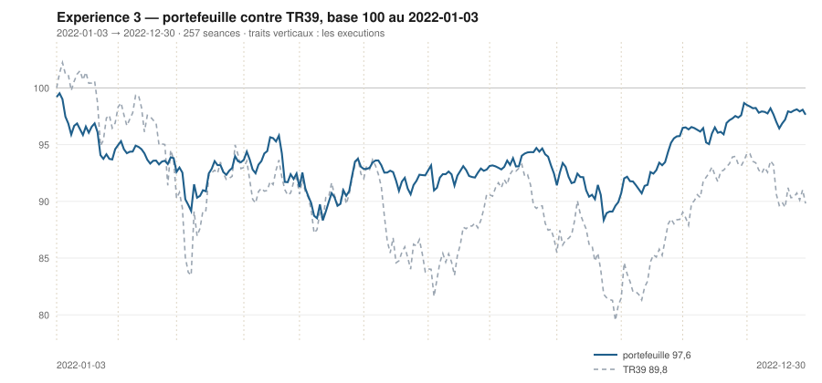

| | |
|---|---|
| Dotation initiale | 10 000,00 € au 2022-01-03 |
| Titres au 2022-12-30 | 3 872,33 € |
| Espèces | 5 891,89 € |
| **Total** | **9 764,22 €** |
| Base 100 | **97,64** |
| TR39, même base | 89,82 |
| Écart depuis janvier | **+7,82 pt** |

### Toutes les positions depuis le début de l'expérience

> Closes comme ouvertes. Une position encore ouverte laisse les deux dernières colonnes vides. Aucune séance postérieure au 2022-12-30 n'entre dans ce tableau.

| Société | Prix d'achat | Date d'achat | Prix de vente | Date de vente |
|---|---|---|---|---|
| `CAP.PA` Capgemini | 194,20 € | 2022-01-03 | 182,68 € | 2022-04-01 |
| `DSY.PA` Dassault Systèmes | 50,13 € | 2022-01-03 | 41,05 € | 2022-02-01 |
| `KER.PA` Kering | 558,25 € | 2022-03-01 | 454,99 € | 2022-06-01 |
| `HO.PA` Thales | 103,16 € | 2022-04-01 | 112,75 € | 2022-12-01 |
| `MT.AS` ArcelorMittal | 26,84 € | 2022-04-01 | 28,27 € | 2022-06-01 |
| `TTE.PA` TotalEnergies | 43,30 € | 2022-06-01 |  |  |
| `BN.PA` Danone | 46,97 € | 2022-08-01 | 45,67 € | 2022-09-01 |
| `RMS.PA` Hermès International | 1 226,95 € | 2022-09-01 | 1 493,52 € | 2022-12-01 |
| `DG.PA` Vinci | 83,75 € | 2022-12-01 |  |  |

*9 positions depuis le début, dont 2 encore ouvertes : les deux dernières colonnes restent vides.*

## 5. L'étude chartiste au 2022-11-30

> Notes rédigées sans aucune séance postérieure au 2022-11-30, par l'agent `chartiste`. Cinq lignes au plus par société, **chacune sous la figure de décision qui la justifie** — celle que la règle a lue ce jour-là, portant les cinq critères, les vetos et le verdict.

### 1. `ENGI.PA` — Engie

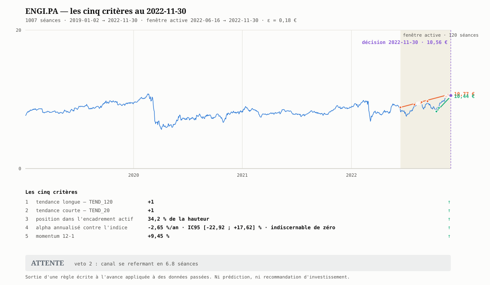

- Canal 10,44 – 10,77 €, large de 0,3 %, clôture à 10,56 € à 34,2 % — juste sous le seuil bas.
- Support +0,065 contre résistance +0,016 €/séance : **le canal se referme en 7 séances**, veto 2.
- Trois contacts bas, cinq hauts : figure étayée, canal de 33 centimes de haut.
- Momentum +9,4 %, alpha −2,6 %/an.

### 2. `CS.PA` — AXA

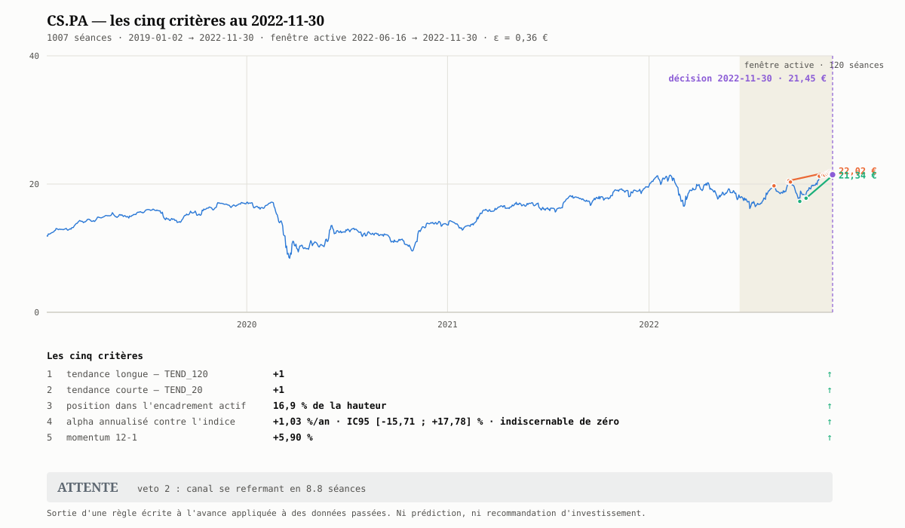

- Canal 21,34 – 22,02 €, d'une largeur de 0,7 %, clôture à 21,45 € à 16,9 % de la hauteur.
- Support +0,104 contre résistance +0,027 €/séance : **le canal se referme en 9 séances**, veto 2.
- Trois contacts bas, quatre hauts : la figure est étayée, la géométrie ne passera pas la semaine.
- Momentum +5,9 %, alpha +1,0 %/an. Meilleur score de la date.

### 3. `PUB.PA` — Publicis

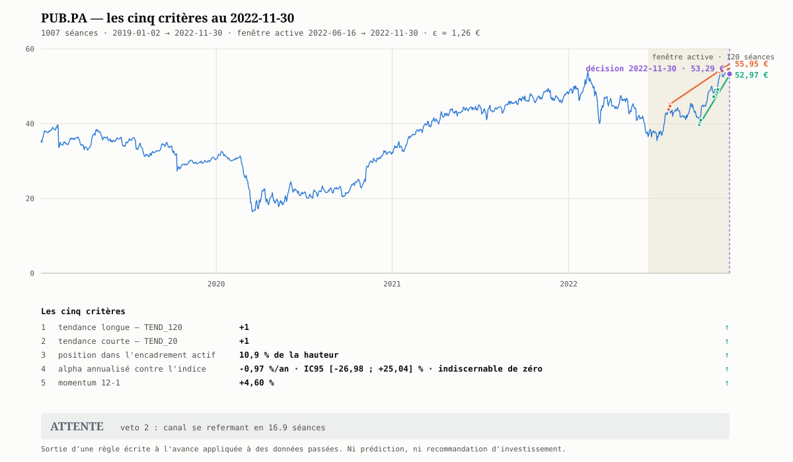

- Canal 52,97 – 55,95 €, clôture à 53,29 € à 10,9 % de la hauteur.
- Support +0,300 contre résistance +0,123 €/séance : **le canal se referme en 17 séances**, veto 2.
- Quatre contacts bas, trois hauts : figure bien étayée, géométrie périmée.
- Momentum +4,6 %, alpha −1,0 %/an.

### 4. `TTE.PA` — TotalEnergies

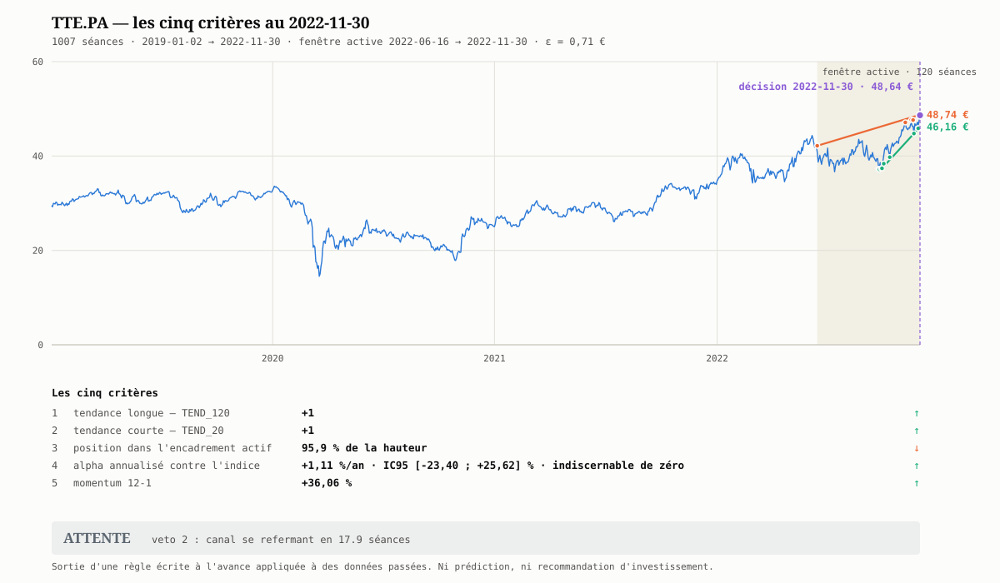

- Canal 46,16 – 48,74 €, clôture à 48,64 € à 95,9 % : contre le plafond.
- Support +0,199 contre résistance +0,055 €/séance : **le canal se referme en 18 séances**, veto 2.
- Quatre contacts de chaque côté : figure très étayée, géométrie périmée.
- **Momentum +36,1 %, le deuxième de la date** ; alpha +1,1 %/an.

### 5. `DG.PA` — Vinci

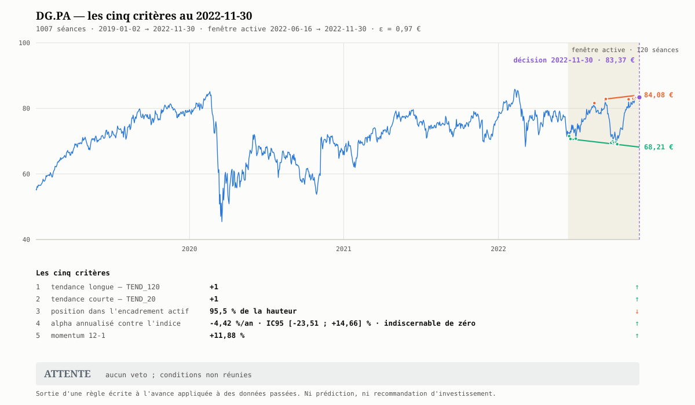

- Canal 68,21 – 84,08 €, clôture à 83,37 € à 95,5 % de la hauteur.
- Pentes −0,021 et +0,022 €/séance : ouverture, τ infini.
- **Cinq contacts de chaque côté** : **aucun veto**, la figure la mieux étayée de la date.
- Momentum +11,9 %, alpha −4,4 %/an.

### 6. `AIR.PA` — Airbus

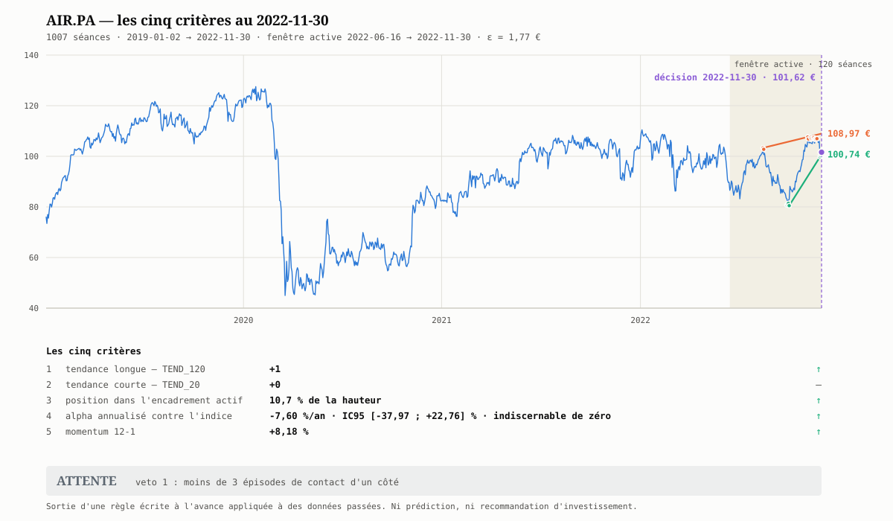

- Canal 100,74 – 108,97 €, clôture à 101,62 € à 10,7 % : contre le support.
- Support +0,482 contre résistance +0,074 €/séance, τ de 20 séances — au seuil exact du veto 2, qui ne se déclenche pas.
- Deux contacts en support : veto 1.
- Momentum +8,2 %, alpha −7,6 %/an.

### 7. `SAF.PA` — Safran

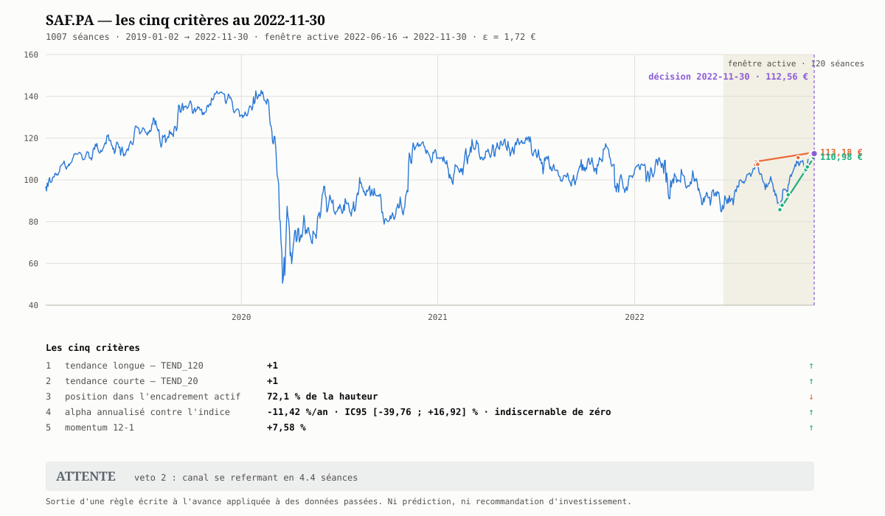

- Canal 110,98 – 113,18 €, d'une largeur de 2,2 %, clôture à 112,56 € à 72,1 %.
- Support +0,561 contre résistance +0,058 €/séance : **le canal se referme en 4,4 séances**, veto 2 — le plus court de la date.
- Quatre contacts bas, trois hauts : figure étayée, canal évanescent.
- Momentum +7,6 %, alpha −11,4 %/an.

### 8. `RNO.PA` — Renault

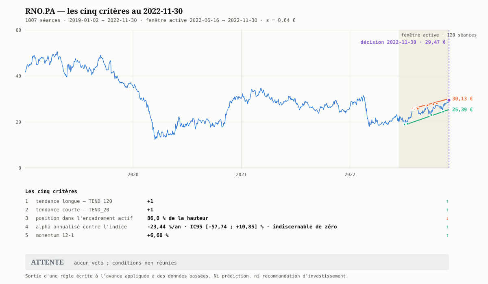

- Canal 25,39 – 30,13 €, clôture à 29,47 € à 86,0 % de la hauteur.
- Pentes +0,064 et +0,050 €/séance, τ de 347 séances.
- Quatre contacts bas, cinq hauts : **aucun veto**.
- Momentum +6,6 %, alpha −23,4 %/an.

### 9. `GLE.PA` — Société Générale

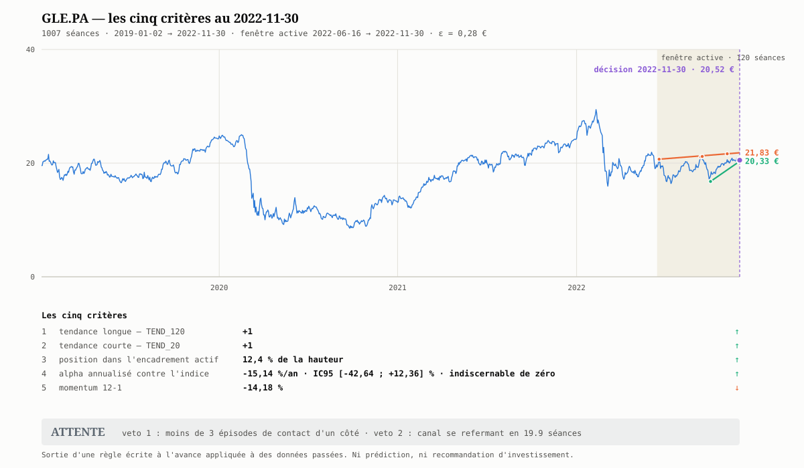

- Canal 20,33 – 21,83 €, clôture à 20,52 € à 12,4 % de la hauteur.
- Support +0,085 contre résistance +0,010 €/séance : **le canal se referme en 20 séances**, veto 2.
- Deux contacts en support : veto 1 également.
- Momentum −14,2 %, alpha −15,1 %/an.

### 10. `HO.PA` — Thales

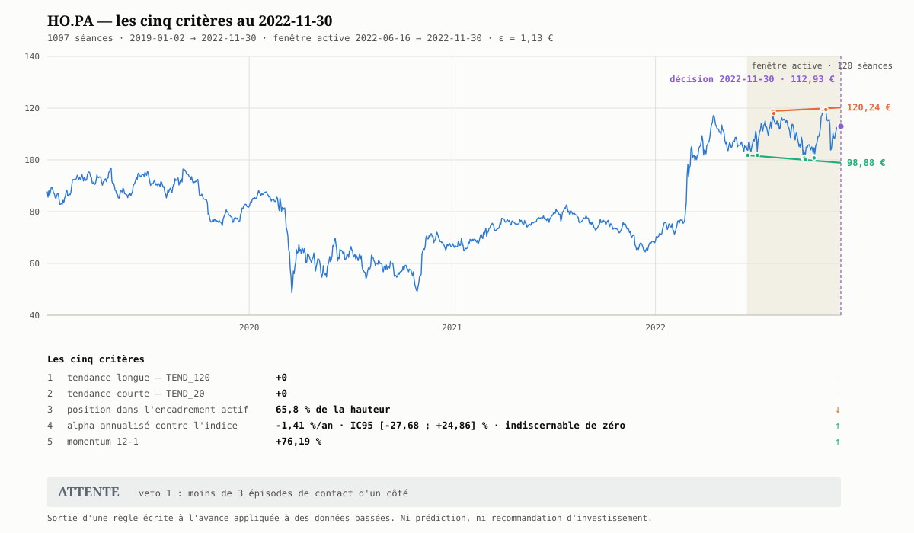

- Canal 98,88 – 120,24 €, clôture à 112,93 € à 65,8 % — à peine au-dessus du seuil haut.
- Pentes −0,025 et +0,016 €/séance : ouverture, τ infini.
- Quatre contacts bas, deux hauts : veto 1.
- **Momentum +76,2 %, le plus fort de toute l'année** ; alpha −1,4 %/an.

### 11. `AI.PA` — Air Liquide

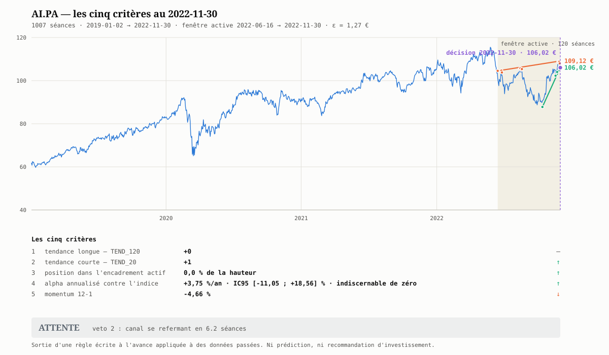

- Canal 106,02 – 109,12 €, clôture à 106,02 € : **exactement sur le support**, 0,0 % de la hauteur.
- Support +0,536 contre résistance +0,038 €/séance : **le canal se referme en 6 séances**, veto 2.
- Quatre contacts de chaque côté : figure très étayée, géométrie sans lendemain.
- Momentum −4,7 %, alpha +3,8 %/an.

### 12. `MC.PA` — LVMH

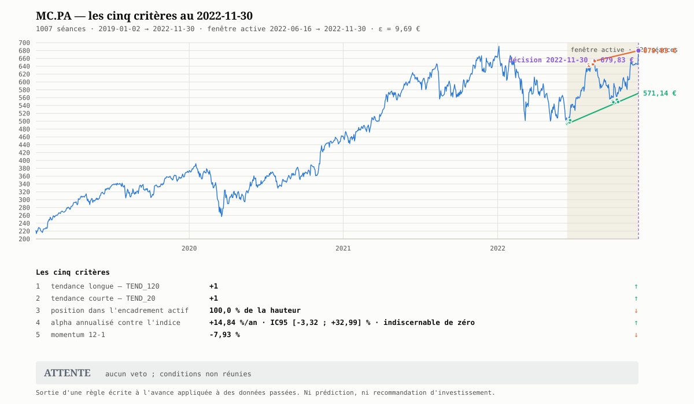

- Canal 571,14 – 679,83 €, clôture à 679,83 € : **exactement sur la résistance**, 100,0 %.
- Pentes +0,654 et +0,360 €/séance, τ de 370 séances.
- Trois contacts de chaque côté : **aucun veto**.
- Momentum −7,9 %, alpha +14,8 %/an.

### 13. `STLAP.PA` — Stellantis

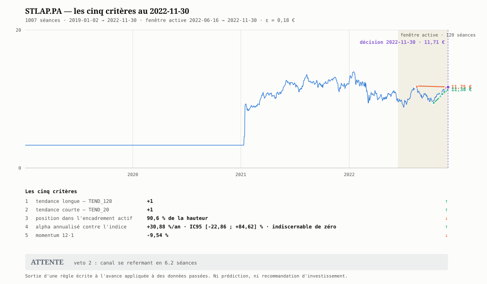

- Canal 11,38 – 11,75 €, large de 0,4 %, clôture à 11,71 € à 90,6 % de la hauteur.
- Support +0,057 contre résistance −0,002 €/séance : **le canal se referme en 6 séances**, veto 2.
- Quatre contacts bas, trois hauts : figure étayée, canal de trente-sept centimes.
- Momentum −9,5 %, alpha +30,9 %/an sur un IC95 de 108 points.

### 14. `WLN.PA` — Worldline

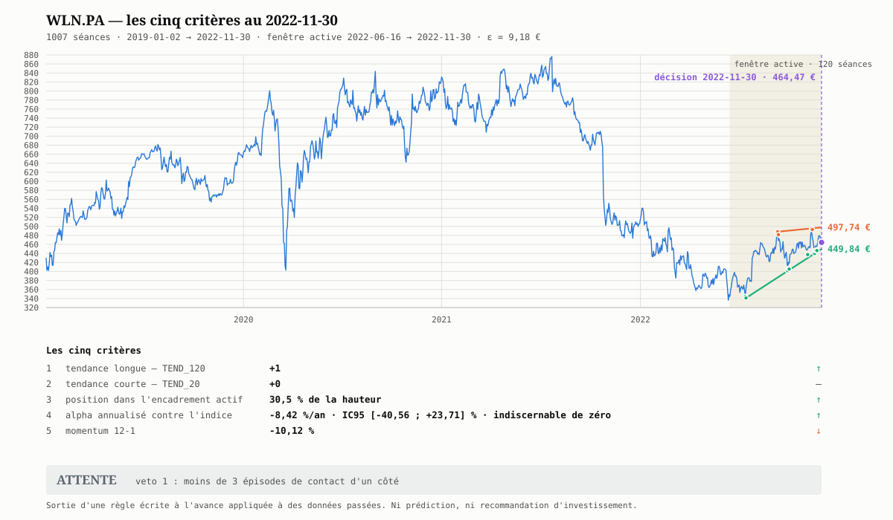

- Canal 449,84 – 497,74 €, clôture à 464,47 € à 30,5 %.
- Support +1,108 contre résistance +0,167 €/séance, τ de 51 séances.
- Deux contacts en résistance : veto 1.
- Momentum −10,1 %, alpha −8,4 %/an. Premier score positif de Worldline depuis le début de l'année.

### 15. `BNP.PA` — BNP Paribas

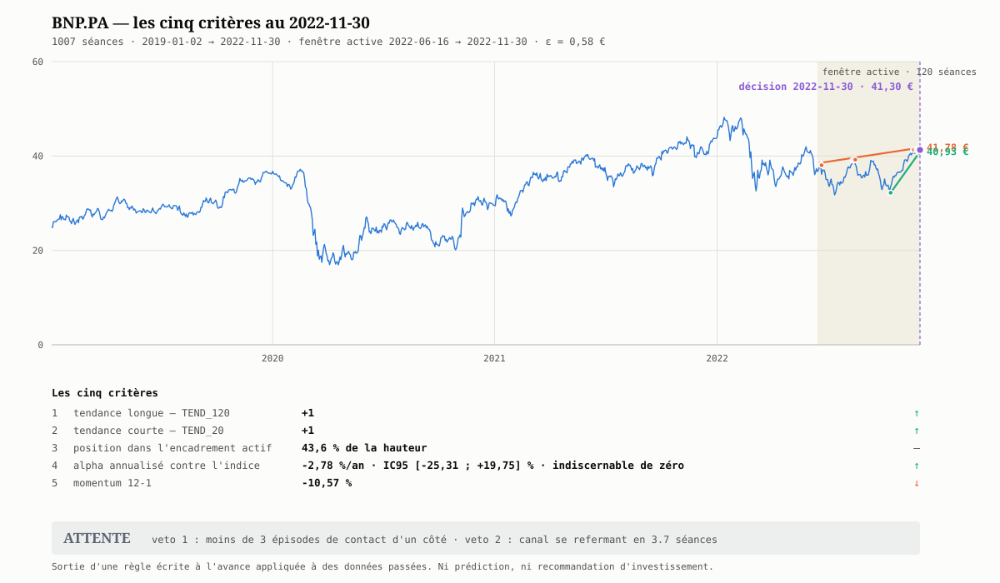

- Canal 40,93 – 41,78 €, large de 0,8 %, clôture à 41,30 € à 43,6 % : le milieu.
- Support +0,256 contre résistance +0,028 €/séance : **le canal se referme en 3,7 séances**, veto 2.
- Deux contacts en support : veto 1 également.
- Momentum −10,6 %, alpha −2,8 %/an.

### 16. `ACA.PA` — Crédit Agricole

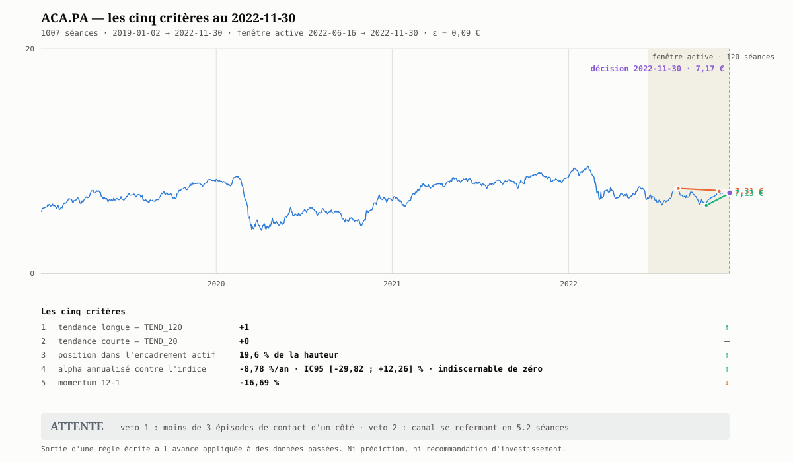

- Canal 7,13 – 7,31 €, d'une largeur de 0,2 % — la figure la plus mince de la date —, clôture à 7,17 € à 19,6 %.
- Support +0,032 contre résistance −0,003 €/séance : **le canal se referme en 5 séances**, veto 2.
- Deux contacts en support : veto 1 également. Dix-huit centimes de haut ne mesurent rien.
- Momentum −16,7 %, alpha −8,8 %/an.

### 17. `ORA.PA` — Orange

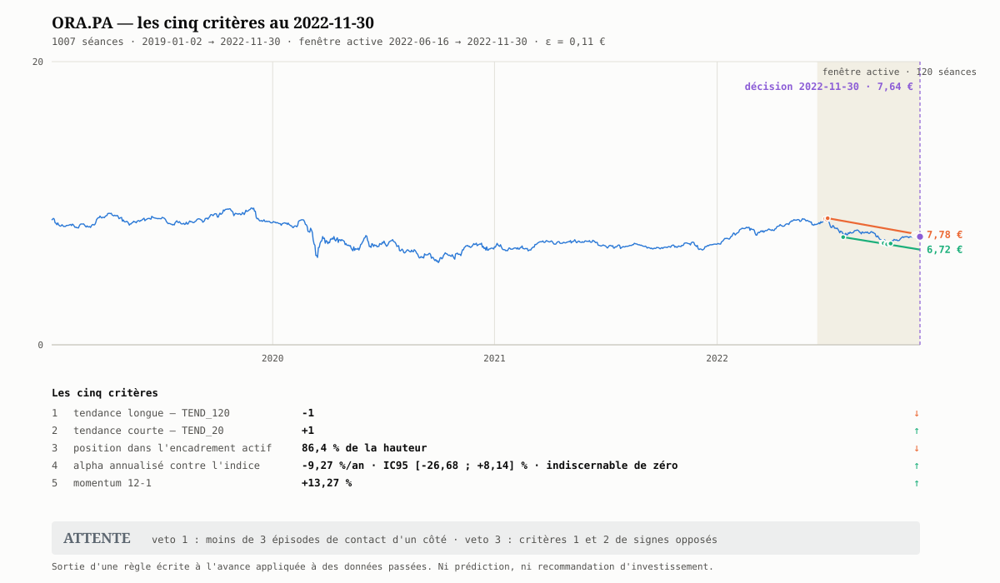

- Canal 6,72 – 7,78 €, clôture à 7,64 € à 86,4 % de la hauteur.
- Pentes −0,010 et −0,011 €/séance, quasi identiques : τ de 1 119 séances.
- Deux contacts en résistance : veto 1 ; tendances opposées : veto 3.
- Momentum +13,3 %, alpha −9,3 %/an.

### 18. `MT.AS` — ArcelorMittal

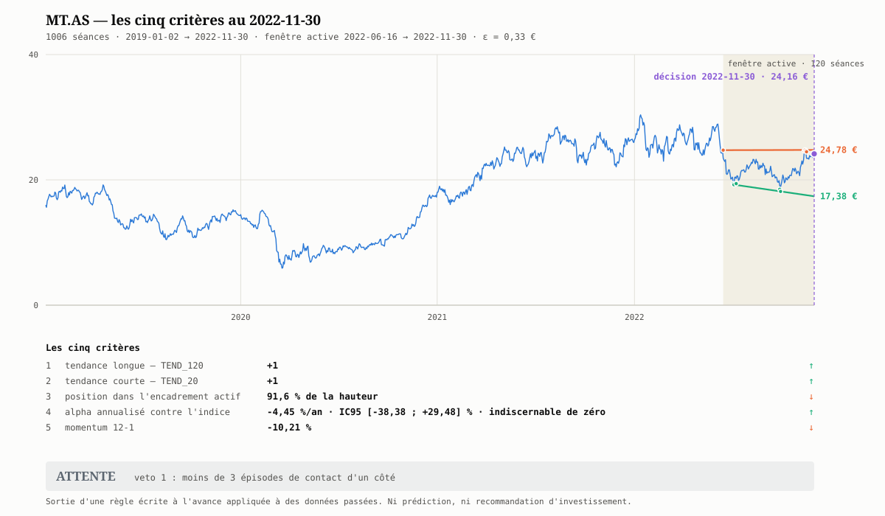

- Canal 17,38 – 24,78 €, clôture à 24,16 € à 91,6 %.
- Pentes −0,018 et +0,000 €/séance : ouverture, τ infini.
- Deux contacts en résistance : veto 1.
- Momentum −10,2 %, alpha −4,5 %/an.

### 19. `EL.PA` — EssilorLuxottica

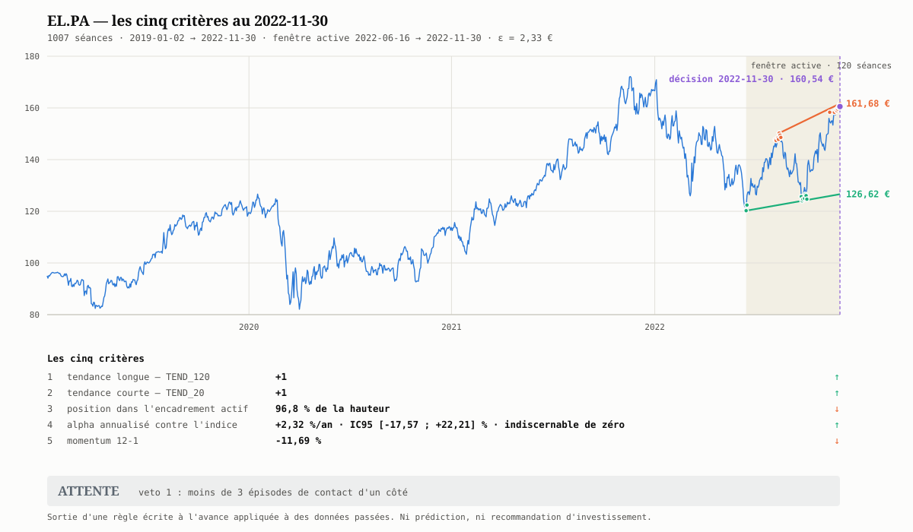

- Canal 126,62 – 161,68 €, large de 35,0 %, clôture à 160,54 € à 96,8 % de la hauteur.
- Pentes +0,054 et +0,148 €/séance : ouverture, τ infini.
- Deux contacts en support : veto 1.
- Momentum −11,7 %, alpha +2,3 %/an.

### 20. `RI.PA` — Pernod Ricard

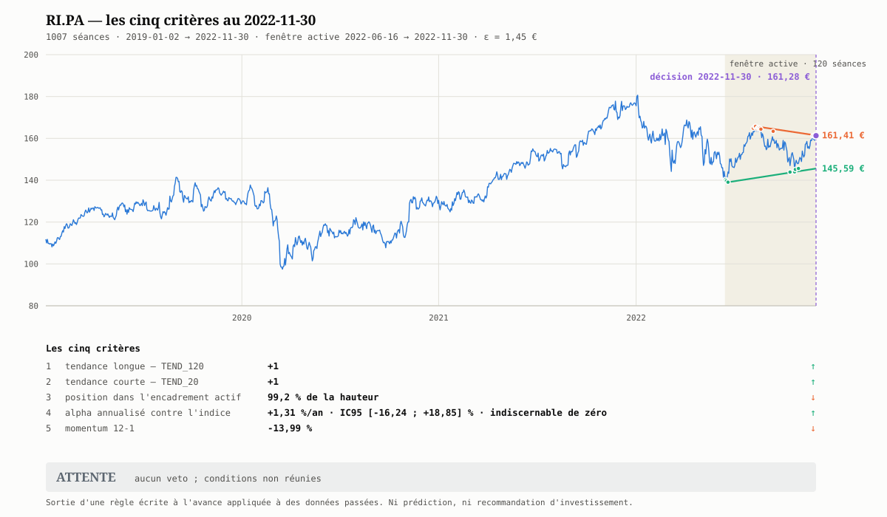

- Canal 145,59 – 161,41 €, clôture à 161,28 € à 99,2 % : à treize centimes du plafond.
- Pentes +0,057 et −0,055 €/séance, τ de 142 séances.
- Quatre contacts bas, trois hauts : **aucun veto**.
- Momentum −14,0 %, alpha +1,3 %/an.

### 21. `RMS.PA` — Hermès International

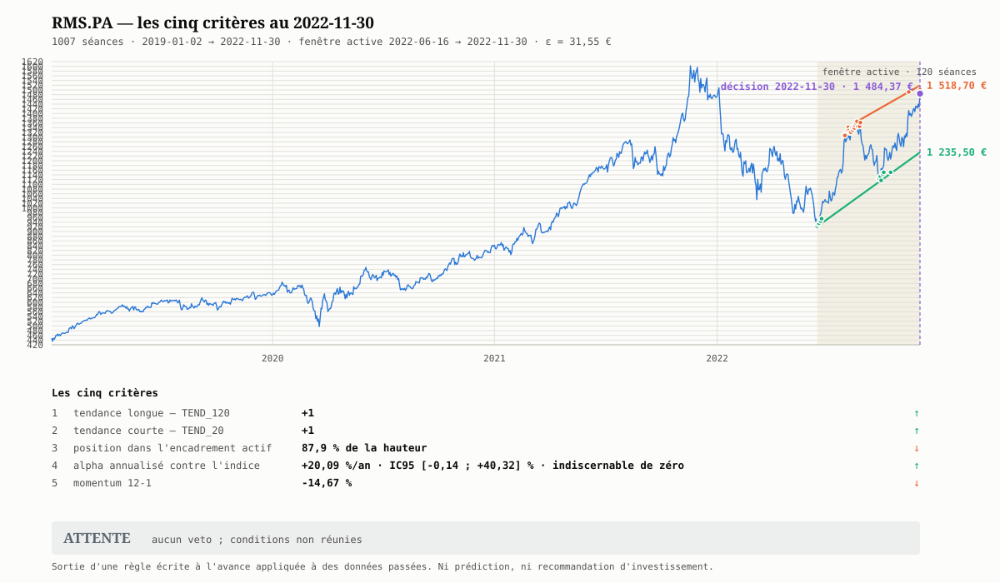

- Canal 1 235,50 – 1 518,70 €, d'une largeur de 283 €, clôture à 1 484,37 € à 87,9 % de la hauteur.
- Pentes +2,639 et +2,085 €/séance, τ de 512 séances.
- Trois contacts bas, quatre hauts : **aucun veto**.
- Momentum −14,7 %, **alpha +20,1 %/an, IC95 de −0,1 à +40,3** — à un dixième de point d'être significativement positif, le plus près de toute l'année.

### 22. `SU.PA` — Schneider Electric

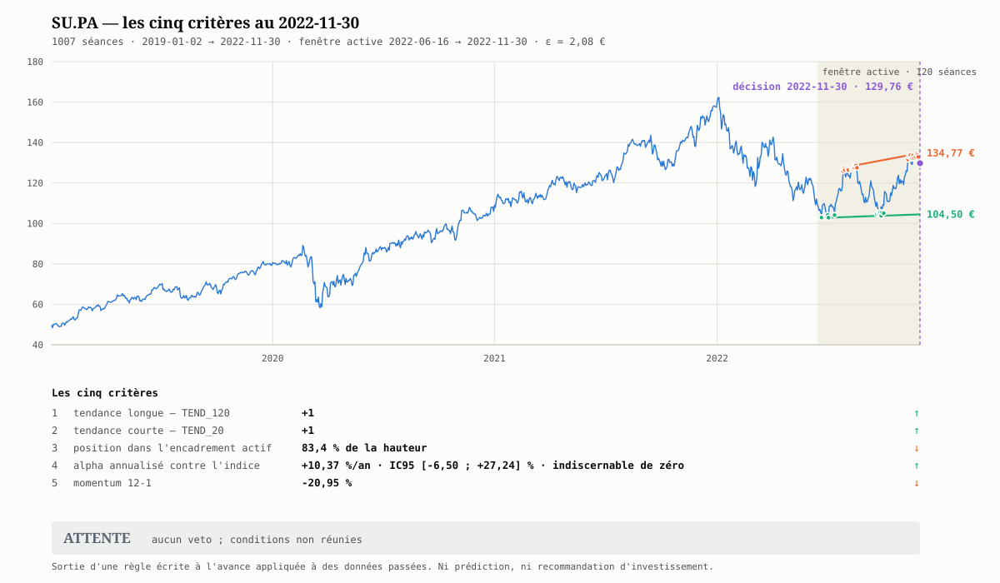

- Canal 104,50 – 134,77 €, large de 30,3 %, clôture à 129,76 € à 83,4 % de la hauteur.
- Pentes +0,015 et +0,081 €/séance : ouverture, τ infini.
- Quatre contacts de chaque côté : **aucun veto**, figure bien étayée.
- Momentum −20,9 %, alpha +10,4 %/an.

### 23. `VIE.PA` — Veolia

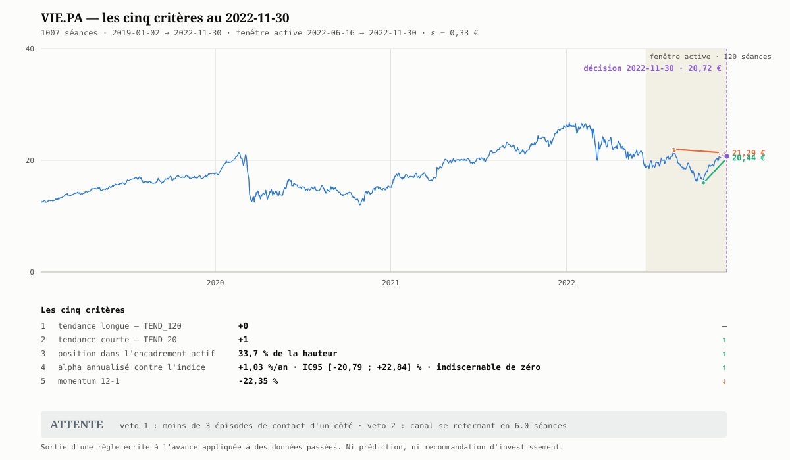

- Canal 20,44 – 21,29 €, large de 0,8 %, clôture à 20,72 € à 33,7 % — sous le seuil bas.
- Support +0,131 contre résistance −0,009 €/séance : **le canal se referme en 6 séances**, veto 2.
- Deux contacts de chaque côté : veto 1 également.
- Momentum −22,4 %, alpha +1,0 %/an.

### 24. `STMPA.PA` — STMicroelectronics

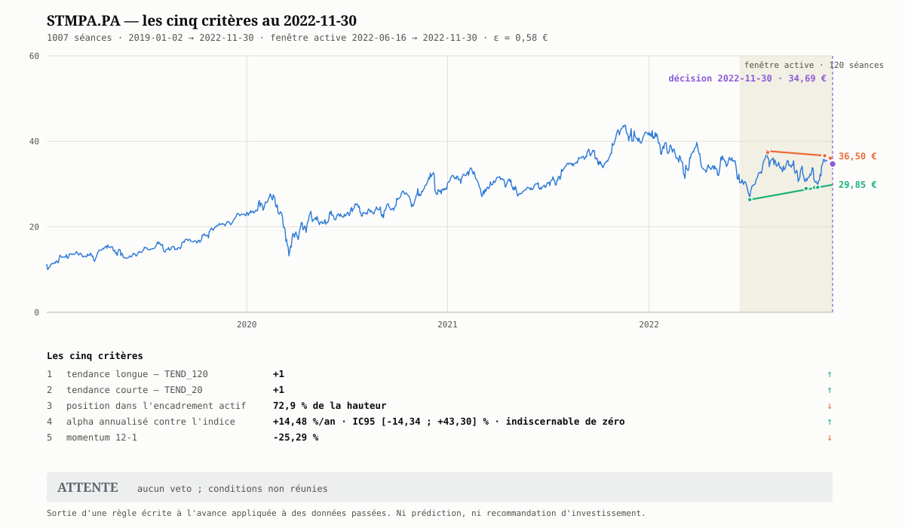

- Canal 29,85 – 36,50 €, clôture à 34,69 € à 72,9 %.
- Pentes +0,033 et −0,015 €/séance, τ de 139 séances.
- Quatre contacts bas, trois hauts : **aucun veto**.
- Momentum −25,3 %, alpha +14,5 %/an.

### 25. `CA.PA` — Carrefour

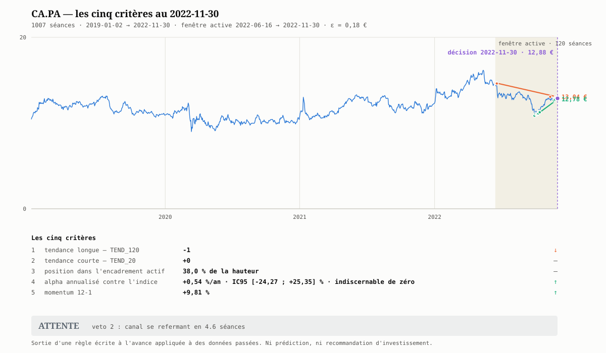

- Canal 12,78 – 13,04 €, d'une largeur de 0,3 %, clôture à 12,88 € à 38,0 %.
- Support +0,045 contre résistance −0,014 €/séance : **le canal se referme en 4,6 séances**, veto 2.
- Trois contacts de chaque côté : figure étayée, vingt-six centimes de haut.
- Momentum +9,8 %, alpha +0,5 %/an.

### 26. `BN.PA` — Danone

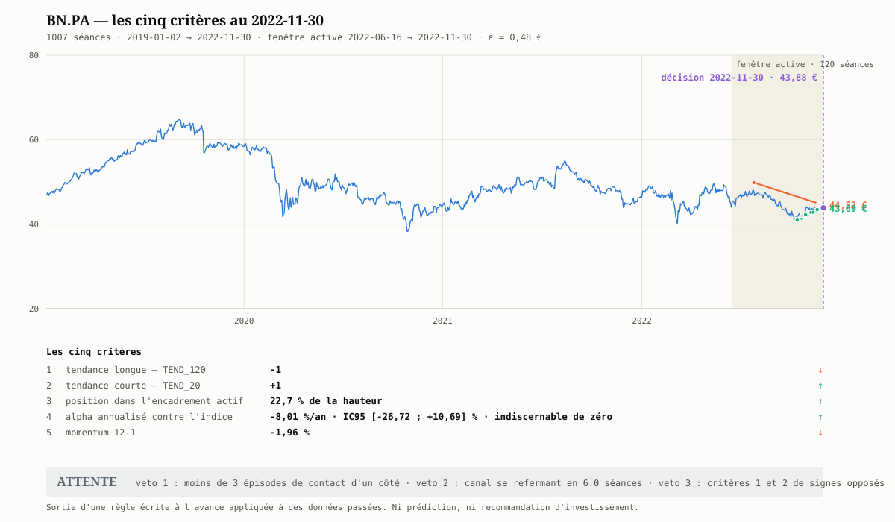

- Canal 43,69 – 44,52 €, large de 0,8 %, clôture à 43,88 € à 22,7 % de la hauteur.
- Support +0,080 contre résistance −0,059 €/séance : **le canal se referme en 6 séances**, veto 2.
- **Sept contacts en support** contre deux en résistance : veto 1 ; tendances opposées : veto 3. **Les trois vetos à la fois.**
- Momentum −2,0 %, alpha −8,0 %/an.

### 27. `SAN.PA` — Sanofi

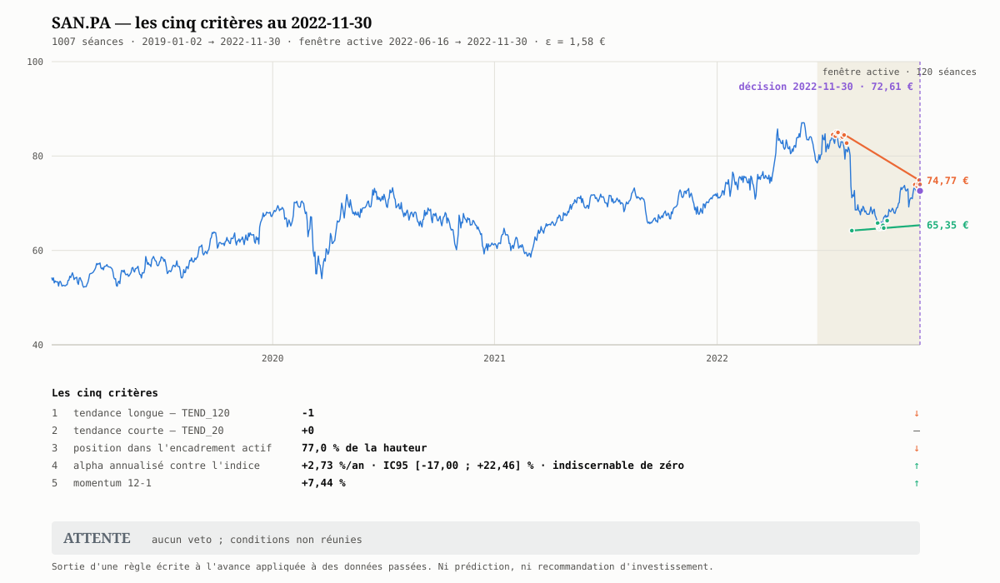

- Canal 65,35 – 74,77 €, clôture à 72,61 € à 77,0 % de la hauteur.
- Pentes +0,015 et −0,112 €/séance, τ de 75 séances.
- Trois contacts bas, **six en résistance** : **aucun veto**.
- Momentum +7,4 %, alpha +2,7 %/an.

### 28. `EN.PA` — Bouygues

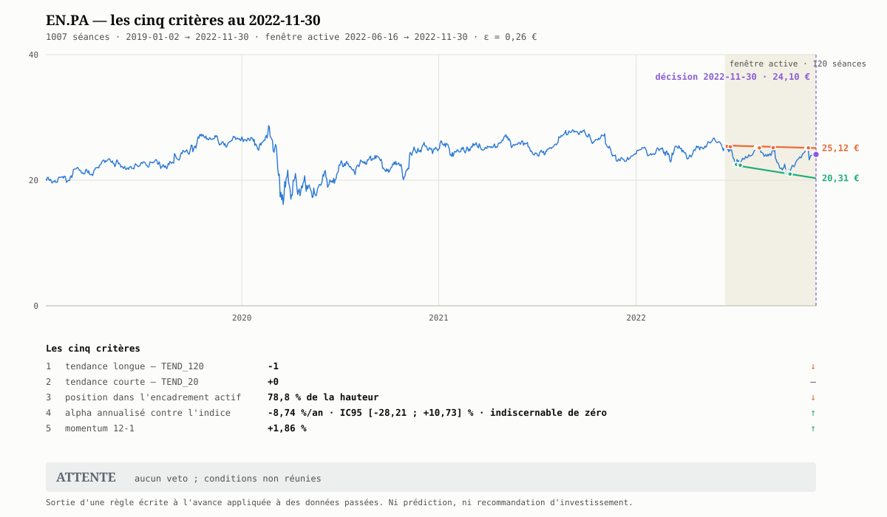

- Canal 20,31 – 25,12 €, clôture à 24,10 € à 78,8 % de la hauteur.
- Pentes −0,020 et −0,003 €/séance : ouverture, τ infini.
- Trois contacts bas, cinq hauts : **aucun veto**.
- Momentum +1,9 %, alpha −8,7 %/an.

### 29. `CAP.PA` — Capgemini

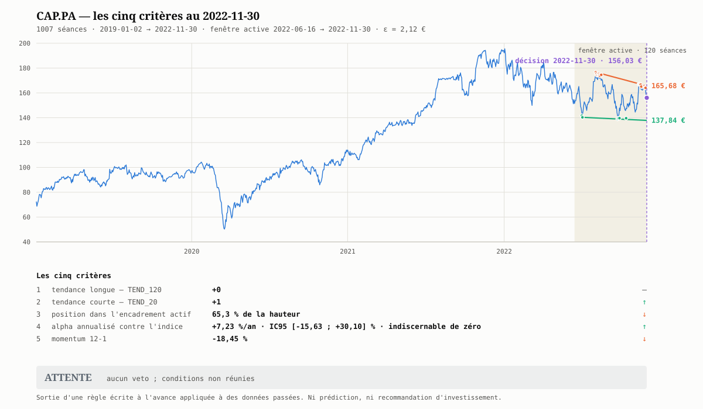

- Canal 137,84 – 165,68 €, clôture à 156,03 € à 65,3 % — trois dixièmes au-dessus du seuil haut.
- Pentes −0,024 et −0,131 €/séance, τ de 260 séances.
- Trois contacts de chaque côté : **aucun veto**.
- Momentum −18,4 %, alpha +7,2 %/an.

### 30. `LR.PA` — Legrand

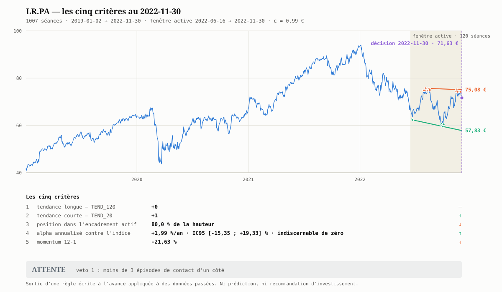

- Canal 57,83 – 75,08 €, clôture à 71,63 € à 80,0 % de la hauteur.
- Pentes −0,040 et −0,008 €/séance : ouverture, τ infini.
- Deux contacts en support : veto 1.
- Momentum −21,6 %, alpha +2,0 %/an.

### 31. `OR.PA` — L'Oréal

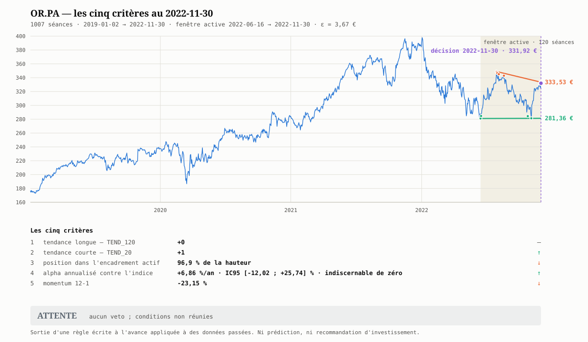

- Canal 281,36 – 333,53 €, clôture à 331,92 € à 96,9 % : contre le plafond.
- Pentes +0,002 et −0,175 €/séance, τ de 294 séances.
- Trois contacts bas, quatre hauts : **aucun veto**.
- Momentum −23,1 %, alpha +6,9 %/an.

### 32. `SGO.PA` — Saint-Gobain

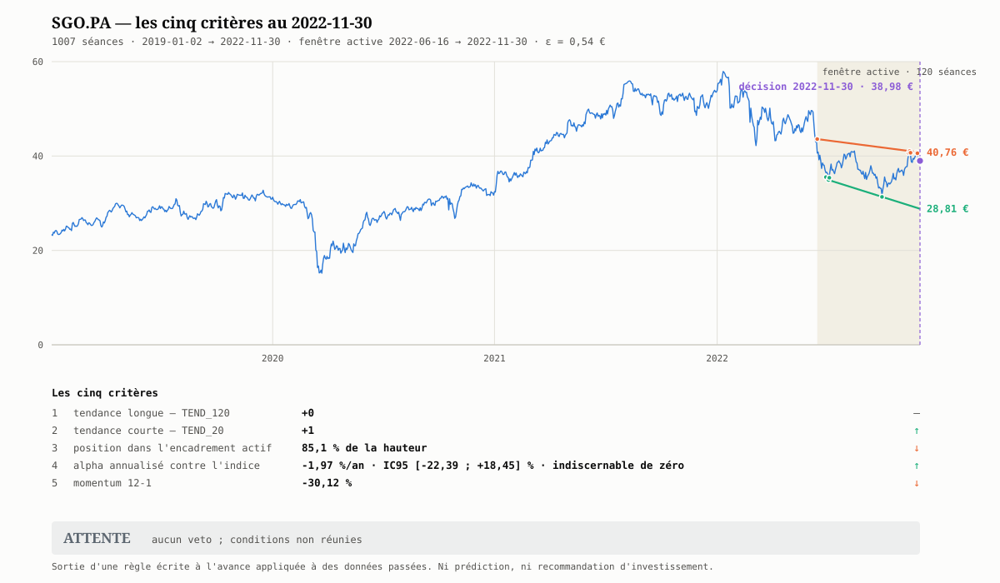

- Canal 28,81 – 40,76 €, clôture à 38,98 € à 85,1 %.
- Pentes −0,058 et −0,024 €/séance : ouverture, τ infini.
- Trois contacts de chaque côté : **aucun veto**.
- Momentum −30,1 %, alpha −2,0 %/an.

### 33. `KER.PA` — Kering

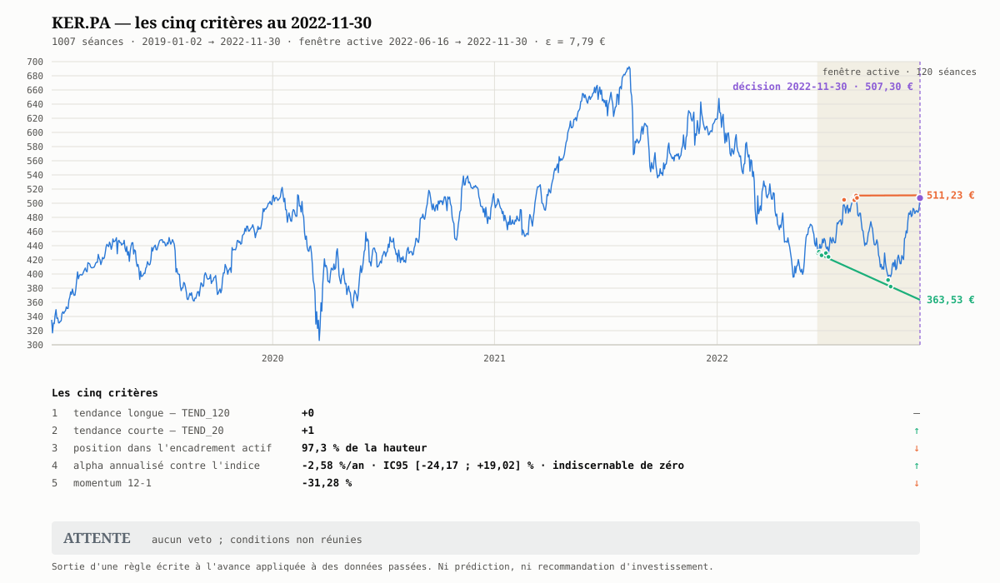

- Canal 363,53 – 511,23 €, d'une largeur de 148 €, clôture à 507,30 € à 97,3 %.
- Support −0,551 contre résistance +0,006 €/séance : ouverture, τ infini.
- Cinq contacts bas, trois hauts : **aucun veto**.
- Momentum −31,3 %, alpha −2,6 %/an.

### 34. `ML.PA` — Michelin

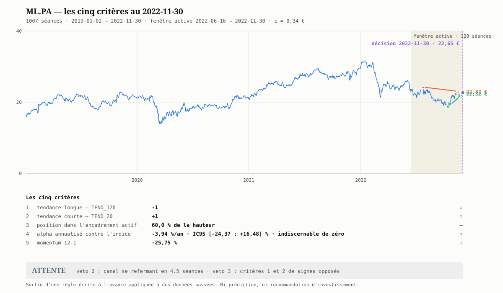

- Canal 22,32 – 22,87 €, d'une largeur de 0,6 %, clôture à 22,65 € à 60,0 % de la hauteur.
- Support +0,106 contre résistance −0,015 €/séance : **le canal se referme en 4,5 séances**, veto 2 ; tendances opposées : veto 3.
- Quatre contacts bas, trois hauts : figure étayée, cinquante-cinq centimes de haut.
- Momentum −25,8 %, alpha −3,9 %/an.

### 35. `VIV.PA` — Vivendi

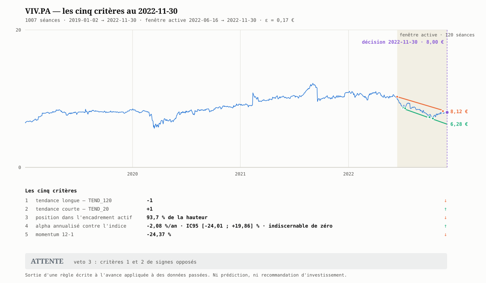

- Canal 6,28 – 8,12 €, clôture à 8,00 € à 93,7 %.
- Pentes −0,022 et −0,018 €/séance : ouverture, τ infini.
- Quatre contacts bas, trois hauts : figure lisible ; seul le veto 3 mord.
- Momentum −24,4 %, alpha −2,1 %/an.

### 36. `ALO.PA` — Alstom

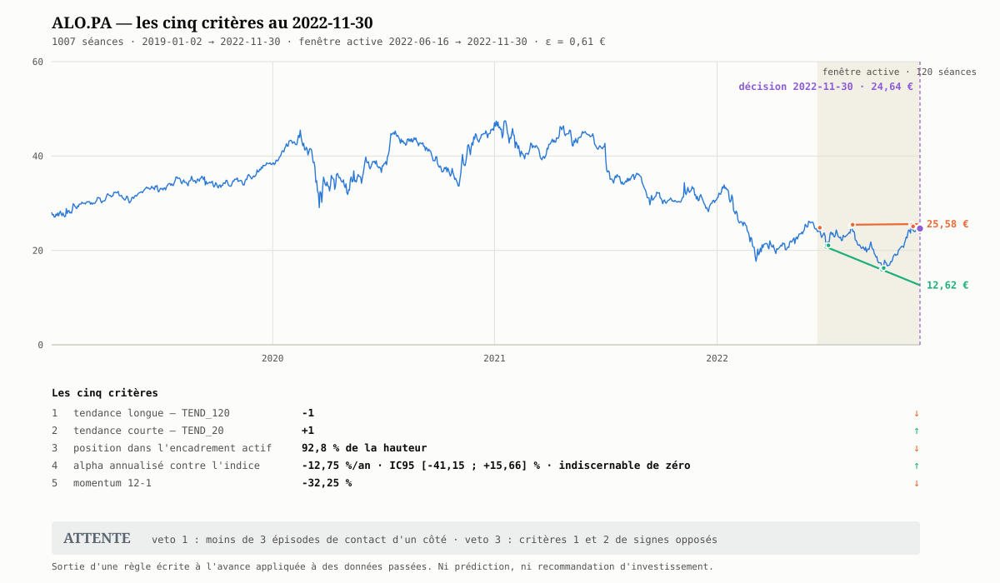

- Canal 12,62 – 25,58 €, d'une largeur de 13,0 %, clôture à 24,64 € à 92,8 %.
- Support −0,075 contre résistance +0,002 €/séance : ouverture franche, τ infini.
- Deux contacts en support : veto 1 ; tendances opposées : veto 3.
- Momentum −32,2 %, alpha −12,8 %/an.

### 37. `DSY.PA` — Dassault Systèmes

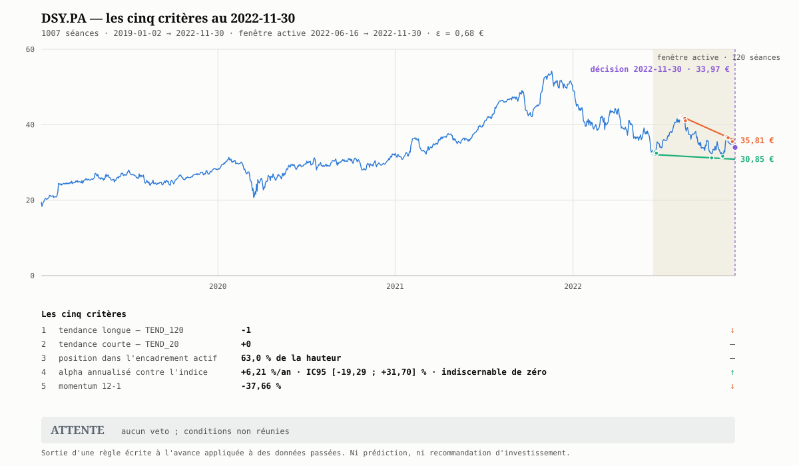

- Canal 30,85 – 35,81 €, clôture à 33,97 € à 63,0 % de la hauteur.
- Pentes −0,011 et −0,082 €/séance, τ de 70 séances.
- Trois contacts de chaque côté : **aucun veto**.
- **Momentum −37,7 %** ; alpha +6,2 %/an.

### 38. `TEP.PA` — Teleperformance

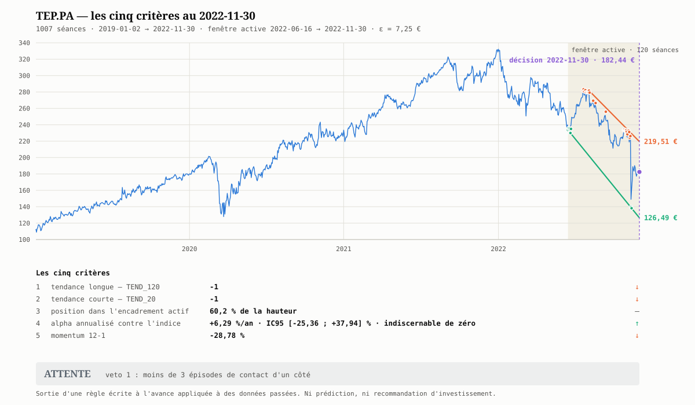

- Canal 126,49 – 219,51 €, d'une largeur de 93,0 % — la figure la plus étirée de la date, après l'effondrement d'octobre —, clôture à 182,44 € à 60,2 %.
- Pentes −0,900 et −0,741 €/séance : ouverture, τ infini.
- Deux contacts en support contre cinq en résistance : veto 1.
- Momentum −28,8 %, alpha +6,3 %/an. Score −5, le plus bas de la date avec Eurofins.

### 39. `ERF.PA` — Eurofins Scientific

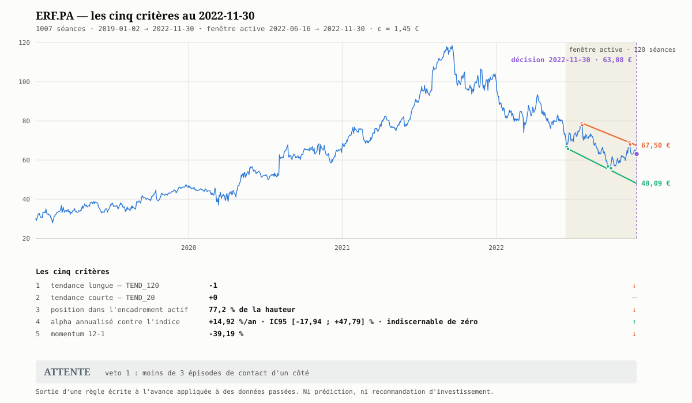

- Canal 48,09 – 67,50 €, large de 19,4 %, clôture à 63,08 € à 77,2 % de la hauteur.
- Pentes −0,153 et −0,124 €/séance : ouverture, τ infini.
- Deux contacts de chaque côté : veto 1.
- **Momentum −39,2 %** ; alpha +14,9 %/an. Score −5.

## 6. Le classement au 2022-11-30

> De la valeur la plus intéressante à détenir à celle qu'il faut fuir. La colonne **τ** donne la date de péremption du canal en séances, la colonne **Vetos** les numéros déclenchés. Une valeur sous veto ne peut pas être achetée.

| Rang | Valeur | `s1` | `s2` | `s3` | `s4` | `s5` | Score | Position | Momentum | τ | Vetos |
|---|---|---|---|---|---|---|---|---|---|---|---|
| 1 | `ENGI.PA` Engie | +2 | +1 | +1 | +1 | +0 | **+5** | 34,2 % | +9,4 % | 6,8 | 2 |
| 2 | `CS.PA` AXA | +2 | +1 | +1 | +1 | +0 | **+5** | 16,9 % | +5,9 % | 8,8 | 2 |
| 3 | `PUB.PA` Publicis | +2 | +1 | +1 | +1 | +0 | **+5** | 10,9 % | +4,6 % | 16,9 | 2 |
| 4 | `TTE.PA` TotalEnergies | +2 | +1 | -1 | +2 | +0 | **+4** | 95,9 % | +36,1 % | 17,9 | 2 |
| 5 | `DG.PA` Vinci | +2 | +1 | -1 | +2 | +0 | **+4** | 95,5 % | +11,9 % | ∞ | — |
| 6 | `AIR.PA` Airbus | +2 | +0 | +1 | +1 | +0 | **+4** | 10,7 % | +8,2 % | 20,2 | 1 |
| 7 | `SAF.PA` Safran | +2 | +1 | -1 | +1 | +0 | **+3** | 72,1 % | +7,6 % | 4,4 | 2 |
| 8 | `RNO.PA` Renault | +2 | +1 | -1 | +1 | +0 | **+3** | 86,0 % | +6,6 % | 346,7 | — |
| 9 | `GLE.PA` Société Générale | +2 | +1 | +1 | -2 | +0 | **+2** | 12,4 % | -14,2 % | 19,9 | 1 2 |
| 10 | `HO.PA` Thales | +0 | +0 | -1 | +2 | +0 | **+1** | 65,8 % | +76,2 % | ∞ | 1 |
| 11 | `AI.PA` Air Liquide | +0 | +1 | +1 | -1 | +0 | **+1** | 0,0 % | -4,7 % | 6,2 | 2 |
| 12 | `MC.PA` LVMH | +2 | +1 | -1 | -1 | +0 | **+1** | 100,0 % | -7,9 % | 369,7 | — |
| 13 | `STLAP.PA` Stellantis | +2 | +1 | -1 | -1 | +0 | **+1** | 90,6 % | -9,5 % | 6,2 | 2 |
| 14 | `WLN.PA` Worldline | +2 | +0 | +1 | -2 | +0 | **+1** | 30,5 % | -10,1 % | 50,9 | 1 |
| 15 | `BNP.PA` BNP Paribas | +2 | +1 | +0 | -2 | +0 | **+1** | 43,6 % | -10,6 % | 3,7 | 1 2 |
| 16 | `ACA.PA` Crédit Agricole | +2 | +0 | +1 | -2 | +0 | **+1** | 19,6 % | -16,7 % | 5,2 | 1 2 |
| 17 | `ORA.PA` Orange | -2 | +1 | -1 | +2 | +0 | **+0** | 86,4 % | +13,3 % | 1 118,8 | 1 3 |
| 18 | `MT.AS` ArcelorMittal | +2 | +1 | -1 | -2 | +0 | **+0** | 91,6 % | -10,2 % | ∞ | 1 |
| 19 | `EL.PA` EssilorLuxottica | +2 | +1 | -1 | -2 | +0 | **+0** | 96,8 % | -11,7 % | ∞ | 1 |
| 20 | `RI.PA` Pernod Ricard | +2 | +1 | -1 | -2 | +0 | **+0** | 99,2 % | -14,0 % | 141,9 | — |
| 21 | `RMS.PA` Hermès International | +2 | +1 | -1 | -2 | +0 | **+0** | 87,9 % | -14,7 % | 511,6 | — |
| 22 | `SU.PA` Schneider Electric | +2 | +1 | -1 | -2 | +0 | **+0** | 83,4 % | -20,9 % | ∞ | — |
| 23 | `VIE.PA` Veolia | +0 | +1 | +1 | -2 | +0 | **+0** | 33,7 % | -22,4 % | 6,0 | 1 2 |
| 24 | `STMPA.PA` STMicroelectronics | +2 | +1 | -1 | -2 | +0 | **+0** | 72,9 % | -25,3 % | 139,2 | — |
| 25 | `CA.PA` Carrefour | -2 | +0 | +0 | +1 | +0 | **-1** | 38,0 % | +9,8 % | 4,6 | 2 |
| 26 | `BN.PA` Danone | -2 | +1 | +1 | -1 | +0 | **-1** | 22,7 % | -2,0 % | 6,0 | 1 2 3 |
| 27 | `SAN.PA` Sanofi | -2 | +0 | -1 | +1 | +0 | **-2** | 77,0 % | +7,4 % | 74,7 | — |
| 28 | `EN.PA` Bouygues | -2 | +0 | -1 | +1 | +0 | **-2** | 78,8 % | +1,9 % | ∞ | — |
| 29 | `CAP.PA` Capgemini | +0 | +1 | -1 | -2 | +0 | **-2** | 65,3 % | -18,4 % | 260,2 | — |
| 30 | `LR.PA` Legrand | +0 | +1 | -1 | -2 | +0 | **-2** | 80,0 % | -21,6 % | ∞ | 1 |
| 31 | `OR.PA` L'Oréal | +0 | +1 | -1 | -2 | +0 | **-2** | 96,9 % | -23,1 % | 293,7 | — |
| 32 | `SGO.PA` Saint-Gobain | +0 | +1 | -1 | -2 | +0 | **-2** | 85,1 % | -30,1 % | ∞ | — |
| 33 | `KER.PA` Kering | +0 | +1 | -1 | -2 | +0 | **-2** | 97,3 % | -31,3 % | ∞ | — |
| 34 | `ML.PA` Michelin | -2 | +1 | +0 | -2 | +0 | **-3** | 60,0 % | -25,8 % | 4,5 | 2 3 |
| 35 | `VIV.PA` Vivendi | -2 | +1 | -1 | -2 | +0 | **-4** | 93,7 % | -24,4 % | ∞ | 3 |
| 36 | `ALO.PA` Alstom | -2 | +1 | -1 | -2 | +0 | **-4** | 92,8 % | -32,2 % | ∞ | 1 3 |
| 37 | `DSY.PA` Dassault Systèmes | -2 | +0 | +0 | -2 | +0 | **-4** | 63,0 % | -37,7 % | 69,6 | — |
| 38 | `TEP.PA` Teleperformance | -2 | -1 | +0 | -2 | +0 | **-5** | 60,2 % | -28,8 % | ∞ | 1 |
| 39 | `ERF.PA` Eurofins Scientific | -2 | +0 | -1 | -2 | +0 | **-5** | 77,2 % | -39,2 % | ∞ | 1 |

## 7. Les ordres exécutés au 2022-12-01

> À l'**ouverture** de la séance, jamais à la clôture du 2022-11-30.

| Sens | Valeur | Quantité | Prix d'exécution | Brut | Frais | Motif |
|---|---|---|---|---|---|---|
| **Vente** | `HO.PA` Thales | 18 | 112,75 € | 2 029,46 € | 2,33 € | rang 10 au-dela de 7 |
| **Vente** | `RMS.PA` Hermès International | 1 | 1 493,52 € | 1 493,52 € | 1,72 € | rang 21 au-dela de 7 |
| **Achat** | `DG.PA` Vinci | 23 | 83,75 € | 1 926,18 € | 7,99 € | rang 5, score +4, aucun veto |

## 8. La lecture du mois

Sur le mois, la meilleure contribution vient de `RMS.PA` (Hermès International) pour **+7,42 €**, la moins bonne de `DG.PA` (Vinci) pour **-82,81 €**. Les 3 ordres du mois ont coûté **12,05 €** de frais, soit 0,120 % de la dotation initiale. Le portefeuille termine le mois **devant TR39** de 3,00 point. Sur les 47 thèses du mois précédent qui ont pu être tranchées, **9 sont confirmées** — 19,1 %.

## 9. Les thèses écrites au 2022-11-30

> Elles seront dépouillées à la prochaine date de décision, dans le fichier du mois suivant. Elles sont engendrées mécaniquement par les règles du [protocole](../README.md#le-registre-des-thèses-réfutables) — aucune n'est rédigée à la main.

| Valeur | Thèse | Énoncé, à dépouiller au mois suivant |
|---|---|---|
| `ACA.PA` | Canal | encadrement ferme avant le 2022-12-30 : les bornes prolongees se croisent, la thèse est inconfirmable à l'écriture |
| `ACA.PA` | Reflexive | AUCUNE SEQUENCE : écart contre TR39 dans ± 6,13 pt (σ̂), au 2022-12-30 |
| `AI.PA` | Canal | encadrement ferme avant le 2022-12-30 : les bornes prolongees se croisent, la thèse est inconfirmable à l'écriture |
| `AIR.PA` | Canal | encadrement ferme avant le 2022-12-30 : les bornes prolongees se croisent, la thèse est inconfirmable à l'écriture |
| `ALO.PA` | Canal | clôture entre 11,05 € et 25,62 € au 2022-12-30 |
| `ALO.PA` | Reflexive | AUCUNE SEQUENCE : écart contre TR39 dans ± 10,61 pt (σ̂), au 2022-12-30 |
| `BN.PA` | Canal | encadrement ferme avant le 2022-12-30 : les bornes prolongees se croisent, la thèse est inconfirmable à l'écriture |
| `BNP.PA` | Canal | encadrement ferme avant le 2022-12-30 : les bornes prolongees se croisent, la thèse est inconfirmable à l'écriture |
| `BNP.PA` | Reflexive | AUCUNE SEQUENCE : écart contre TR39 dans ± 7,09 pt (σ̂), au 2022-12-30 |
| `CA.PA` | Canal | encadrement ferme avant le 2022-12-30 : les bornes prolongees se croisent, la thèse est inconfirmable à l'écriture |
| `CAP.PA` | Canal | clôture entre 137,34 € et 162,94 € au 2022-12-30 |
| `CS.PA` | Canal | encadrement ferme avant le 2022-12-30 : les bornes prolongees se croisent, la thèse est inconfirmable à l'écriture |
| `CS.PA` | Reflexive | AUCUNE SEQUENCE : écart contre TR39 dans ± 5,98 pt (σ̂), au 2022-12-30 |
| `DG.PA` | Canal | clôture entre 67,76 € et 84,54 € au 2022-12-30 |
| `DSY.PA` | Canal | clôture entre 30,63 € et 34,09 € au 2022-12-30 |
| `EL.PA` | Canal | clôture entre 127,75 € et 164,79 € au 2022-12-30 |
| `EN.PA` | Canal | clôture entre 19,90 € et 25,05 € au 2022-12-30 |
| `ENGI.PA` | Canal | encadrement ferme avant le 2022-12-30 : les bornes prolongees se croisent, la thèse est inconfirmable à l'écriture |
| `ERF.PA` | Canal | clôture entre 44,87 € et 64,90 € au 2022-12-30 |
| `ERF.PA` | Reflexive | AUCUNE SEQUENCE : écart contre TR39 dans ± 7,30 pt (σ̂), au 2022-12-30 |
| `GLE.PA` | Canal | encadrement ferme avant le 2022-12-30 : les bornes prolongees se croisent, la thèse est inconfirmable à l'écriture |
| `GLE.PA` | Reflexive | AUCUNE SEQUENCE : écart contre TR39 dans ± 8,67 pt (σ̂), au 2022-12-30 |
| `HO.PA` | Canal | clôture entre 98,36 € et 120,58 € au 2022-12-30 |
| `KER.PA` | Canal | clôture entre 351,96 € et 511,36 € au 2022-12-30 |
| `LR.PA` | Canal | clôture entre 57,00 € et 74,92 € au 2022-12-30 |
| `MC.PA` | Canal | clôture entre 584,88 € et 687,39 € au 2022-12-30 |
| `ML.PA` | Canal | encadrement ferme avant le 2022-12-30 : les bornes prolongees se croisent, la thèse est inconfirmable à l'écriture |
| `MT.AS` | Canal | clôture entre 17,01 € et 24,79 € au 2022-12-30 |
| `MT.AS` | Reflexive | AUTO-RENFORCEMENT : écart contre TR39 au-dessus de +4,80 pt (0,5 σ̂), au 2022-12-30 |
| `OR.PA` | Canal | clôture entre 281,41 € et 329,85 € au 2022-12-30 |
| `ORA.PA` | Canal | clôture entre 6,51 € et 7,55 € au 2022-12-30 |
| `PUB.PA` | Canal | encadrement ferme avant le 2022-12-30 : les bornes prolongees se croisent, la thèse est inconfirmable à l'écriture |
| `RI.PA` | Canal | clôture entre 146,78 € et 160,26 € au 2022-12-30 |
| `RMS.PA` | Canal | clôture entre 1 290,91 € et 1 562,49 € au 2022-12-30 |
| `RNO.PA` | Canal | clôture entre 26,73 € et 31,18 € au 2022-12-30 |
| `SAF.PA` | Canal | encadrement ferme avant le 2022-12-30 : les bornes prolongees se croisent, la thèse est inconfirmable à l'écriture |
| `SAN.PA` | Canal | clôture entre 65,66 € et 72,43 € au 2022-12-30 |
| `SGO.PA` | Canal | clôture entre 27,60 € et 40,26 € au 2022-12-30 |
| `STLAP.PA` | Canal | encadrement ferme avant le 2022-12-30 : les bornes prolongees se croisent, la thèse est inconfirmable à l'écriture |
| `STMPA.PA` | Canal | clôture entre 30,55 € et 36,19 € au 2022-12-30 |
| `SU.PA` | Canal | clôture entre 104,82 € et 136,47 € au 2022-12-30 |
| `TEP.PA` | Canal | clôture entre 107,60 € et 203,96 € au 2022-12-30 |
| `TEP.PA` | Reflexive | AUCUNE SEQUENCE : écart contre TR39 dans ± 6,21 pt (σ̂), au 2022-12-30 |
| `TTE.PA` | Canal | encadrement ferme avant le 2022-12-30 : les bornes prolongees se croisent, la thèse est inconfirmable à l'écriture |
| `VIE.PA` | Canal | encadrement ferme avant le 2022-12-30 : les bornes prolongees se croisent, la thèse est inconfirmable à l'écriture |
| `VIV.PA` | Canal | clôture entre 5,82 € et 7,74 € au 2022-12-30 |
| `VIV.PA` | Reflexive | AUCUNE SEQUENCE : écart contre TR39 dans ± 4,93 pt (σ̂), au 2022-12-30 |
| `WLN.PA` | Canal | clôture entre 473,10 € et 501,24 € au 2022-12-30 |
| `WLN.PA` | Reflexive | AUCUNE SEQUENCE : écart contre TR39 dans ± 7,69 pt (σ̂), au 2022-12-30 |

---

L'expérience s'arrête ici. Le compte complet de l'année, les audits et la confrontation du dimensionnement sont dans le **[bilan de l'année](../bilan-2022.md)**.

---

[← Novembre](2022-11.md) · [Protocole](../README.md)
