# Janvier 2022

> Journal de l'[expérience 4](../README.md) · exécutions du 2022-01-03 au 2022-01-31 · **5 ordres**
> Portefeuille au 2022-01-31 : **9 534,89 €** (base 95,35) · TR39 96,91 · alpha du mois **-1,56 pt** · depuis janvier **-1,56 pt**

---

## 1. Les actualités du mois précédent

**Décembre 2021.** L'année se termine sur des indices proches de leurs records :
le CAC 40 gagne près de 29 % sur 2021, sa meilleure année depuis 1999. Le variant
Omicron, identifié fin novembre, s'avère plus contagieux mais moins sévère, et le
marché passe rapidement de la peur au soulagement.

Le tournant est ailleurs, et il est monétaire. La Réserve fédérale double le
rythme de réduction de ses achats d'actifs et ses membres projettent désormais
trois hausses de taux en 2022. Le mot « transitoire » disparaît du vocabulaire
officiel après une inflation américaine à 6,8 % sur un an, la plus forte depuis
1982. La BCE, elle, maintient que les taux ne bougeront pas en 2022.

Le luxe, la technologie et les valeurs de croissance ont mené la hausse de
l'année ; les bancaires ont profité de la perspective de taux plus élevés.

## 2. L'exposition héritée

*Aucune ligne : le portefeuille est intégralement en espèces.*

## 3. Le portefeuille depuis le 2022-01-03

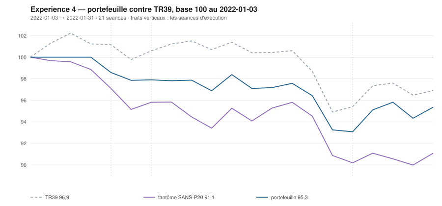

| | |
|---|---|
| Dotation initiale | 10 000,00 € au 2022-01-03 |
| Titres au 2022-01-31 | 9 531,56 € |
| Espèces | 3,34 € |
| Lignes détenues | 5 |
| **Total** | **9 534,89 €** |
| Base 100 | **95,35** |
| Fantôme `SANS-P20`, même base | 91,07 |
| TR39, même base | 96,91 |
| Écart depuis janvier | **-1,56 pt** |

### Toutes les positions depuis le début de l'expérience

> Closes comme ouvertes. Aucune séance postérieure au 2022-01-31 n'entre dans ce tableau.

| Société | Prix d'achat | Date d'achat | Prix de vente | Date de vente |
|---|---|---|---|---|
| `CAP.PA` Capgemini | 182,86 € | 2022-01-07 |  |  |
| `EL.PA` EssilorLuxottica | 162,03 € | 2022-01-07 |  |  |
| `RI.PA` Pernod Ricard | 173,52 € | 2022-01-07 |  |  |
| `STMPA.PA` STMicroelectronics | 41,80 € | 2022-01-11 |  |  |
| `BNP.PA` BNP Paribas | 43,84 € | 2022-01-25 |  |  |

*5 positions depuis le début, dont 5 encore ouvertes : les deux dernières colonnes restent vides.*

## 4. L'étude chartiste au 2022-01-31

> Une entrée par société de l'univers, sous la figure de canal lue à la clôture du 2022-01-31. La ligne en retrait est **calculée** ; la note qui suit est celle de l'agent `chartiste`, rédigée sans aucune séance postérieure.

### 1. `TTE.PA` — TotalEnergies

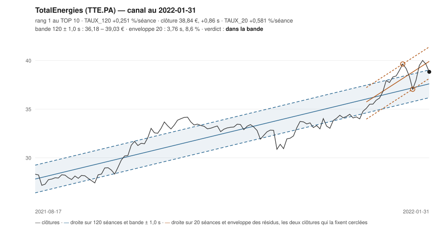

> Rang 1 · TAUX_120 +0,251 %/séance · clôture 38,84 € · bande 36,18 – 39,03 € · écart +0,86 s · TAUX_20 +0,581 %/séance · enveloppe 20 : 3,76 s, 8,6 % · **dans la bande**

- Clôture 38,84 € à +0,86 s, sous le bord haut de 39,03 € (bord bas 36,18 €).
- 1re pente longue de l'univers (0,251 %/séance) depuis le 14 janvier, pente courte positive (0,581 %/séance) sur les 20 dernières séances.
- Enveloppe de 3,76 s (8,6 %), conforme aux ~3,7 s, entre 39,64 € le 19 janvier et 37,05 € le 24.
- Au-dessus du bord haut du 11 au 21 janvier puis du 26 au 28, la clôture est rentrée dans la bande ce 31 janvier.
- Verdict : dans la bande.

### 2. `GLE.PA` — Société Générale

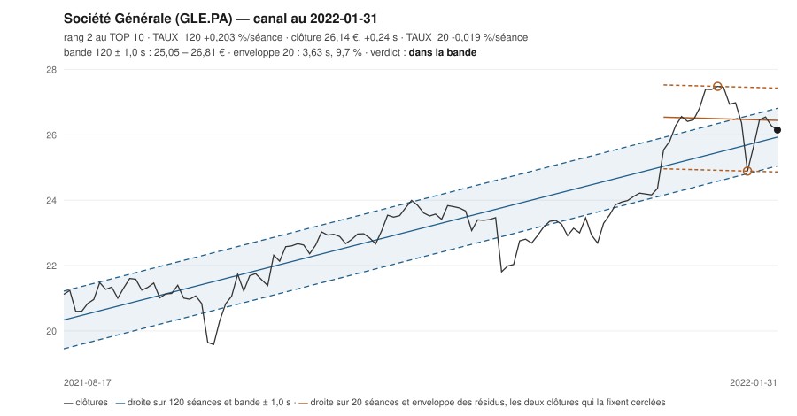

> Rang 2 · TAUX_120 +0,203 %/séance · clôture 26,14 € · bande 25,05 – 26,81 € · écart +0,24 s · TAUX_20 -0,019 %/séance · enveloppe 20 : 3,63 s, 9,7 % · **dans la bande**

- Clôture 26,14 € à +0,24 s, bande 25,05 – 26,81 €.
- 2e pente longue de l'univers (0,203 %/séance, TOP 10), mais pente courte tout juste négative (−0,019 %/séance) pour la première séance.
- Enveloppe de 3,63 s (9,7 %), proche des ~3,7 s, entre 27,48 € le 17 janvier et 24,89 € le 24.
- Au-dessus du bord haut du 4 au 20 janvier (jusqu'à +3,06 s le 13), puis descente à −0,65 s le 24 sans franchir le bord bas ; dans la bande depuis 7 séances.
- Verdict : dans la bande.

### 3. `BNP.PA` — BNP Paribas

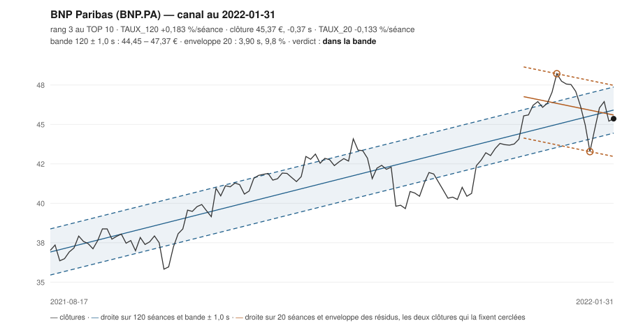

> Rang 3 · TAUX_120 +0,183 %/séance · clôture 45,37 € · bande 44,45 – 47,37 € · écart -0,37 s · TAUX_20 -0,133 %/séance · enveloppe 20 : 3,90 s, 9,8 % · **dans la bande**

- Clôture 45,37 € à −0,37 s, bande 44,45 – 47,37 €.
- Troisième pente longue de l'univers (0,183 %/séance, TOP 10), mais pente courte négative (−0,133 %/séance) depuis deux séances : désaccord entre les fenêtres.
- Enveloppe de 3,90 s (9,8 %), légèrement au-dessus de la référence, entre 48,22 € le 13 janvier et 43,28 € le 24.
- Au-dessus du bord haut du 4 au 19 janvier, la clôture a chuté sous le bord bas le seul 24 janvier (−1,48 s, séance où la valeur était candidate) avant de revenir dans la bande le 25.
- Verdict : dans la bande.

### 4. `RMS.PA` — Hermès International

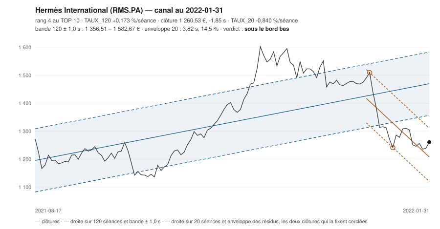

> Rang 4 · TAUX_120 +0,173 %/séance · clôture 1 260,53 € · bande 1 356,51 – 1 582,67 € · écart -1,85 s · TAUX_20 -0,840 %/séance · enveloppe 20 : 3,82 s, 14,5 % · **sous le bord bas**

- Clôture 1 260,53 € à −1,85 s, sous une bande 1 356,51 – 1 582,67 €.
- 4e pente longue (0,173 %/séance, TOP 10), 1re jusqu'au 13 janvier ; pente courte négative (−0,840 %/séance) sur chacune des 20 dernières séances.
- Enveloppe de 3,82 s (14,5 %), entre 1 509,10 € le 5 janvier et 1 241,41 € le 14, deux points de la première moitié.
- Sous le bord bas depuis le 7 janvier, soit 17 séances d'affilée.
- Verdict : sous le bord bas, non candidate — dans le TOP 10, mais pente courte négative.

### 5. `VIE.PA` — Veolia

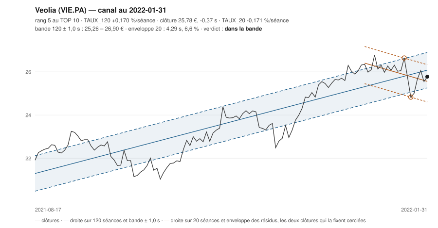

> Rang 5 · TAUX_120 +0,170 %/séance · clôture 25,78 € · bande 25,26 – 26,90 € · écart -0,37 s · TAUX_20 -0,171 %/séance · enveloppe 20 : 4,29 s, 6,6 % · **dans la bande**

- Clôture 25,78 € à −0,37 s, bande 25,26 – 26,90 €.
- 5e pente longue (0,170 %/séance, TOP 10), mais pente courte négative (−0,171 %/séance) depuis le 24 janvier.
- Enveloppe de 4,29 s (6,6 %), au-dessus de la référence, entre 26,64 € le 20 janvier et 24,83 € le 24.
- Sous le bord bas les 24 et 25 janvier (−1,30 et −1,10 s), sans être candidate, la pente courte venant de passer sous zéro ; dans la bande depuis 4 séances.
- Verdict : dans la bande.

### 6. `CS.PA` — AXA

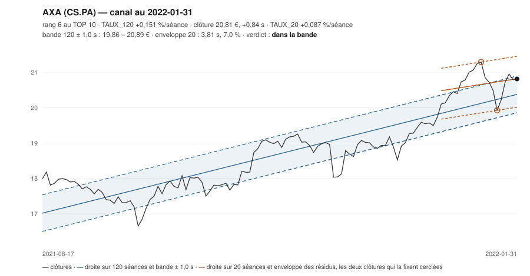

> Rang 6 · TAUX_120 +0,151 %/séance · clôture 20,81 € · bande 19,86 – 20,89 € · écart +0,84 s · TAUX_20 +0,087 %/séance · enveloppe 20 : 3,81 s, 7,0 % · **dans la bande**

- Clôture 20,81 € à +0,84 s, contre un bord haut de 20,89 € et un bord bas de 19,86 €.
- Pente longue de 0,151 %/séance (6e, TOP 10) et pente courte positive (0,087 %/séance) : les deux fenêtres montent.
- Enveloppe de 3,81 s (7,0 %), conforme aux ~3,7 s attendues, entre 21,29 € le 18 janvier et 19,92 € le 24.
- Au-dessus du bord haut du 4 au 20 janvier puis le 27, la clôture est dans la bande depuis 2 séances ; le rang est passé de 13 à 6 sur le mois.
- Verdict : dans la bande.

### 7. `STMPA.PA` — STMicroelectronics

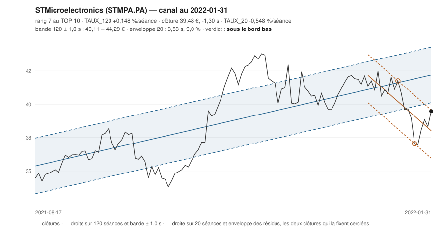

> Rang 7 · TAUX_120 +0,148 %/séance · clôture 39,48 € · bande 40,11 – 44,29 € · écart -1,30 s · TAUX_20 -0,548 %/séance · enveloppe 20 : 3,53 s, 9,0 % · **sous le bord bas**

- Clôture 39,48 € à −1,30 s, sous le bord bas de 40,11 € (bord haut 44,29 €).
- 7e pente longue (0,148 %/séance, TOP 10), mais pente courte négative (−0,548 %/séance) depuis le 18 janvier.
- Enveloppe de 3,53 s (9,0 %), entre 41,76 € le 17 janvier et 37,04 € le 24.
- Sous le bord bas depuis le 18 janvier (10 séances), creux à −2,91 s le 24 ; candidate les 10 et 12 janvier, quand la pente courte était encore positive.
- Verdict : sous le bord bas, non candidate — dans le TOP 10, mais pente courte négative.

### 8. `ENGI.PA` — Engie

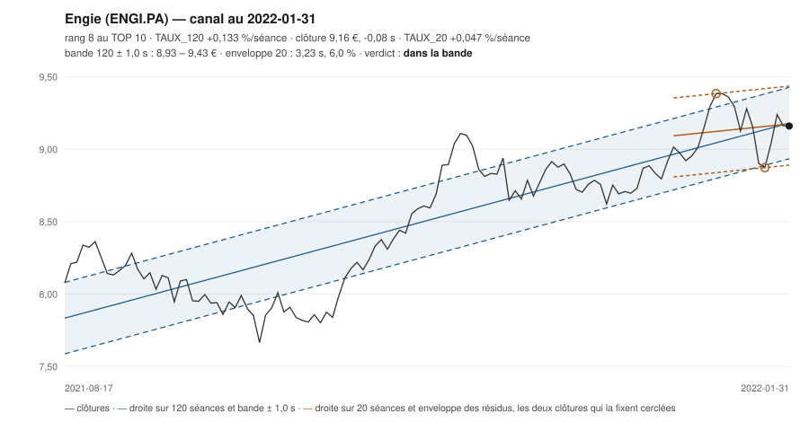

> Rang 8 · TAUX_120 +0,133 %/séance · clôture 9,16 € · bande 8,93 – 9,43 € · écart -0,08 s · TAUX_20 +0,047 %/séance · enveloppe 20 : 3,23 s, 6,0 % · **dans la bande**

- Clôture 9,16 € à −0,08 s, pratiquement sur la droite ajustée, bande 8,93 – 9,43 €.
- 8e pente longue (0,133 %/séance, TOP 10) et pente courte positive (0,047 %/séance) sur chacune des 20 dernières séances.
- Enveloppe de 3,23 s (6,0 %), un peu sous la référence, entre 9,38 € le 13 janvier et 8,87 € le 25.
- Sous le bord bas le seul 25 janvier (−1,01 s, candidate ce jour-là), la clôture est revenue dans la bande dès le 26.
- Verdict : dans la bande.

### 9. `MC.PA` — LVMH

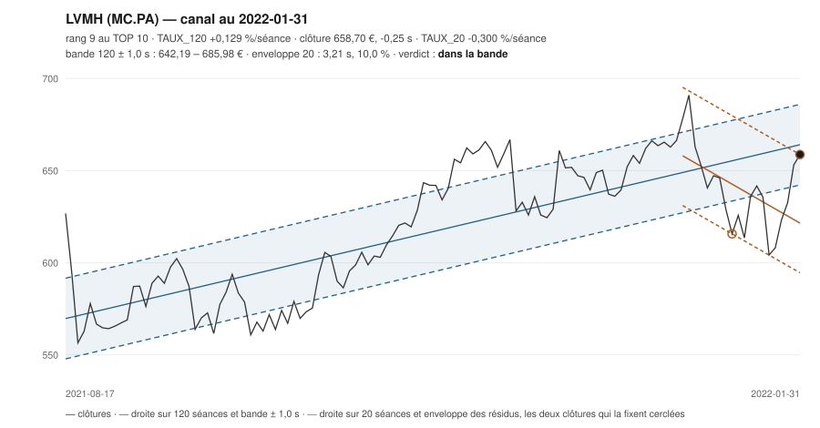

> Rang 9 · TAUX_120 +0,129 %/séance · clôture 658,70 € · bande 642,19 – 685,98 € · écart -0,25 s · TAUX_20 -0,300 %/séance · enveloppe 20 : 3,21 s, 10,0 % · **dans la bande**

- Clôture 658,70 € à −0,25 s, dans une bande 642,19 – 685,98 €.
- 9e pente longue (0,129 %/séance), entrée au TOP 10 le 25 janvier ; pente courte négative (−0,300 %/séance) depuis le 14 janvier.
- Enveloppe de 3,21 s (10,0 %), sous la référence ; bord bas fixé le 14 janvier (615,68 €), bord haut par la clôture du jour.
- Sous le bord bas du 13 au 18 puis du 24 au 27 janvier (−2,19 s le 24), sans être candidate faute de pente courte positive ; dans la bande depuis 2 séances.
- Verdict : dans la bande.

### 10. `RI.PA` — Pernod Ricard

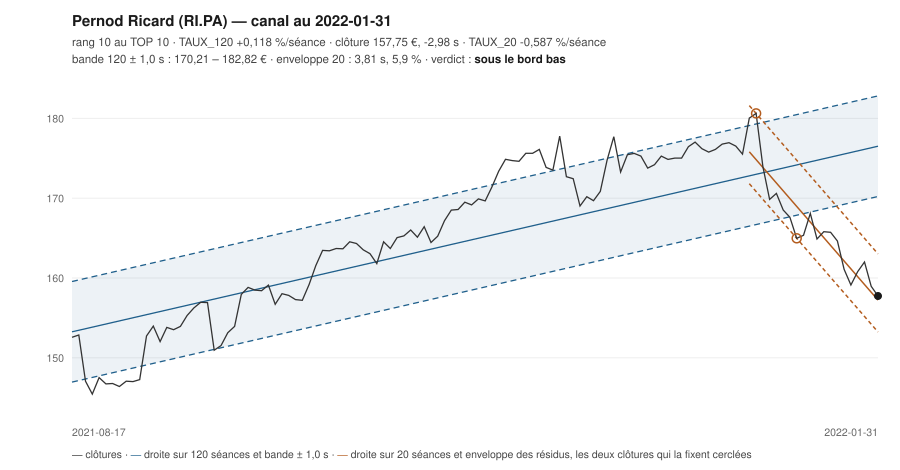

> Rang 10 · TAUX_120 +0,118 %/séance · clôture 157,75 € · bande 170,21 – 182,82 € · écart -2,98 s · TAUX_20 -0,587 %/séance · enveloppe 20 : 3,81 s, 5,9 % · **sous le bord bas**

- Clôture 157,75 € à −2,98 s, contre un bord bas à 170,21 € (bord haut 182,82 €).
- 10e et dernière pente du TOP 10 (0,118 %/séance), 4e début janvier ; pente courte négative (−0,587 %/séance) depuis le 10 janvier.
- Enveloppe de 3,81 s (5,9 %), fixée par deux clôtures du début de fenêtre, 180,62 € le 5 janvier et 164,97 € le 13.
- Sous le bord bas depuis le 6 janvier (18 séances), avec un creux à −3,57 s le 13 ; candidate les 6 et 7 janvier seulement.
- Verdict : sous le bord bas, non candidate — dans le TOP 10, mais pente courte négative.

### 11. `SU.PA` — Schneider Electric

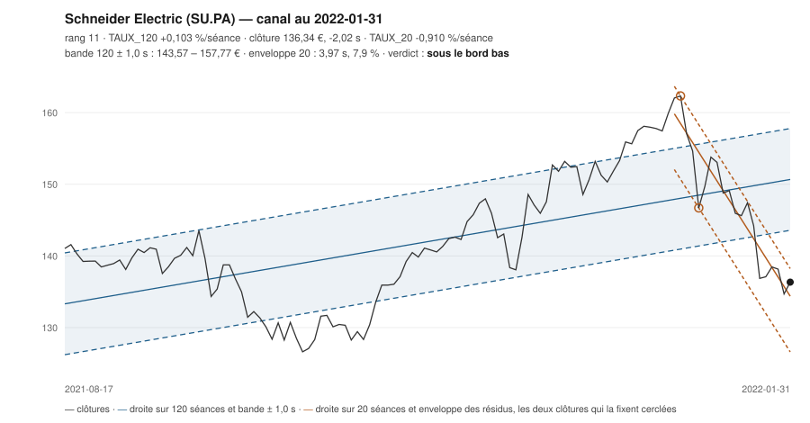

> Rang 11 · TAUX_120 +0,103 %/séance · clôture 136,34 € · bande 143,57 – 157,77 € · écart -2,02 s · TAUX_20 -0,910 %/séance · enveloppe 20 : 3,97 s, 7,9 % · **sous le bord bas**

- Clôture 136,34 € à −2,02 s ; bande 143,57 – 157,77 €.
- Pente longue de 0,103 %/séance, 11e, hors TOP 10 depuis le 25 janvier ; pente courte négative (−0,910 %/séance).
- Enveloppe de 3,97 s (7,9 %), un peu au-dessus de la référence, fixée par deux clôtures anciennes : 162,32 € le 5 janvier et 146,69 € le 10.
- Sous le bord bas le 19 janvier, puis sans interruption depuis le 21 (7 séances).
- Verdict : sous le bord bas, non candidate — hors TOP 10 (rang 11) et pente courte négative.

### 12. `CAP.PA` — Capgemini

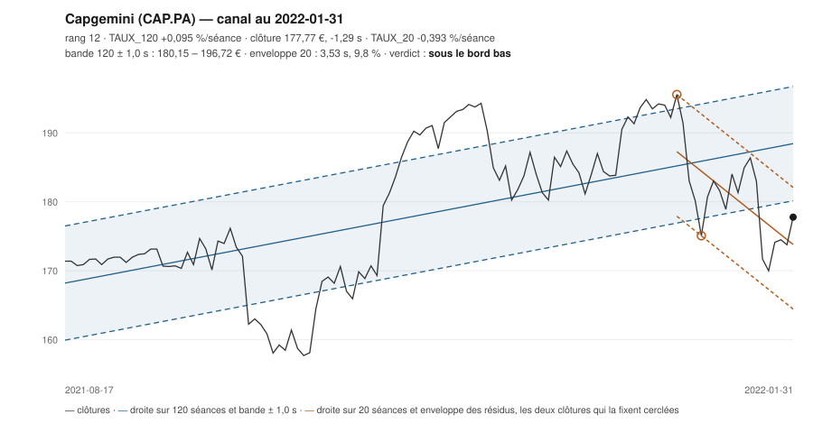

> Rang 12 · TAUX_120 +0,095 %/séance · clôture 177,77 € · bande 180,15 – 196,72 € · écart -1,29 s · TAUX_20 -0,393 %/séance · enveloppe 20 : 3,53 s, 9,8 % · **sous le bord bas**

- Clôture 177,77 € sous le bord bas de 180,15 € (bord haut 196,72 €), à −1,29 s.
- Pente longue positive (0,095 %/séance) mais 12e, sortie du TOP 10 le 11 janvier ; pente courte négative (−0,393 %/séance) depuis le 11 janvier également.
- Enveloppe de 3,53 s (9,8 %), proche de la référence, fixée par deux clôtures du début de fenêtre : 195,55 € le 4 janvier et 175,07 € le 10.
- La clôture a oscillé autour du bord bas depuis le 6 janvier (candidate les 6, 7 et 10 janvier) et se tient dessous depuis le 24, soit 6 séances.
- Verdict : sous le bord bas, non candidate — hors TOP 10 (rang 12) et pente courte négative.

### 13. `ML.PA` — Michelin

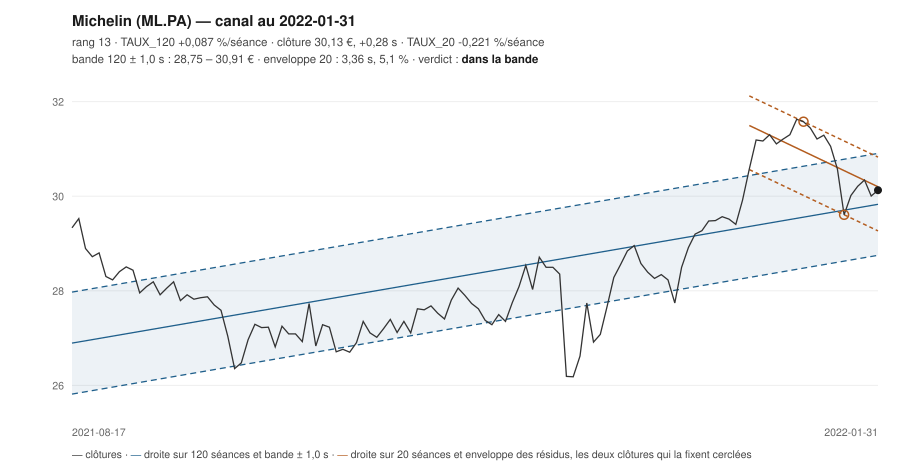

> Rang 13 · TAUX_120 +0,087 %/séance · clôture 30,13 € · bande 28,75 – 30,91 € · écart +0,28 s · TAUX_20 -0,221 %/séance · enveloppe 20 : 3,36 s, 5,1 % · **dans la bande**

- Clôture 30,13 € à +0,28 s, bande 28,75 – 30,91 €.
- Pente longue de 0,087 %/séance (13e, hors TOP 10), pente courte négative (−0,221 %/séance).
- Enveloppe de 3,36 s (5,1 %), entre 31,58 € le 14 janvier et 29,61 € le 24.
- Au-dessus du bord haut jusqu'au 20 janvier (+3,29 s le 5), la clôture est dans la bande depuis le 21, soit 7 séances.
- Verdict : dans la bande.

### 14. `EL.PA` — EssilorLuxottica

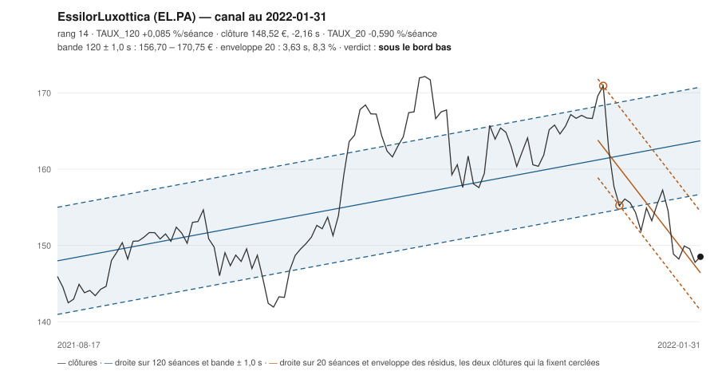

> Rang 14 · TAUX_120 +0,085 %/séance · clôture 148,52 € · bande 156,70 – 170,75 € · écart -2,16 s · TAUX_20 -0,590 %/séance · enveloppe 20 : 3,63 s, 8,3 % · **sous le bord bas**

- Clôture 148,52 € à −2,16 s ; la bande s'étend de 156,70 à 170,75 €.
- Pente longue positive (0,085 %/séance) mais 14e, sortie du TOP 10 le 17 janvier ; pente courte négative (−0,590 %/séance) : discordance.
- L'enveloppe de 3,63 s (8,3 %) tient à deux clôtures du début de fenêtre, 170,92 € le 5 janvier et 155,23 € le 10.
- Sous le bord bas depuis le 6 janvier (18 séances), creux à −2,71 s le 24 ; candidate les 6, 7 et 10 janvier, avant le retournement de la pente courte.
- Verdict : sous le bord bas, non candidate — hors TOP 10 (rang 14) et pente courte négative.

### 15. `ACA.PA` — Crédit Agricole

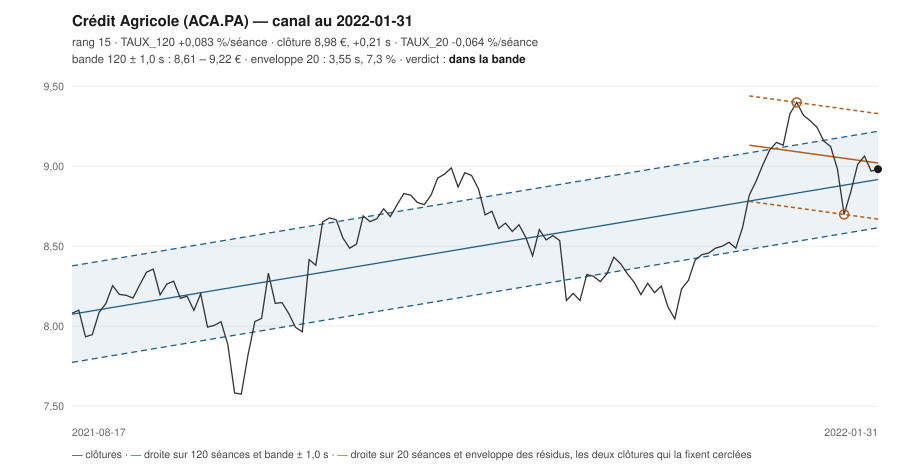

> Rang 15 · TAUX_120 +0,083 %/séance · clôture 8,98 € · bande 8,61 – 9,22 € · écart +0,21 s · TAUX_20 -0,064 %/séance · enveloppe 20 : 3,55 s, 7,3 % · **dans la bande**

- Clôture 8,98 € à +0,21 s, dans une bande 8,61 – 9,22 €.
- Pente longue positive (0,083 %/séance) mais au 15e rang seulement ; la pente courte vient de passer sous zéro (−0,064 %/séance) après 19 séances positives.
- Enveloppe de 3,55 s (7,3 %), proche des ~3,7 s attendues, bornée au milieu de la fenêtre par 9,40 € le 13 janvier et 8,70 € le 24.
- Le cours a passé le bord haut du 5 au 19 janvier, avec un sommet à +2,28 s le 13, avant de réintégrer la bande le 20.
- Verdict : dans la bande.

### 16. `PUB.PA` — Publicis

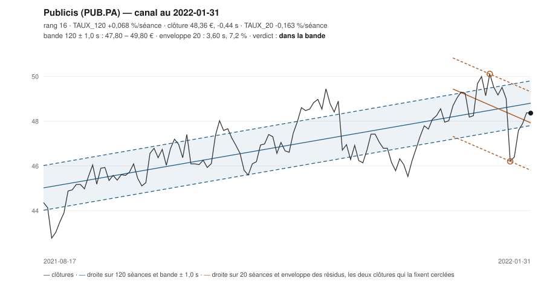

> Rang 16 · TAUX_120 +0,068 %/séance · clôture 48,36 € · bande 47,80 – 49,80 € · écart -0,44 s · TAUX_20 -0,163 %/séance · enveloppe 20 : 3,60 s, 7,2 % · **dans la bande**

- Clôture 48,36 € à −0,44 s, bande 47,80 – 49,80 €.
- Pente longue positive (0,068 %/séance, 16e) et pente courte négative (−0,163 %/séance).
- Enveloppe de 3,60 s (7,2 %), proche de la référence, entre 50,11 € le 17 janvier et 46,21 € le 24.
- L'écart est tombé de +0,09 s le 21 à −2,74 s le 24 ; sous le bord bas du 24 au 26, la clôture est dans la bande depuis 3 séances.
- Verdict : dans la bande.

### 17. `CA.PA` — Carrefour

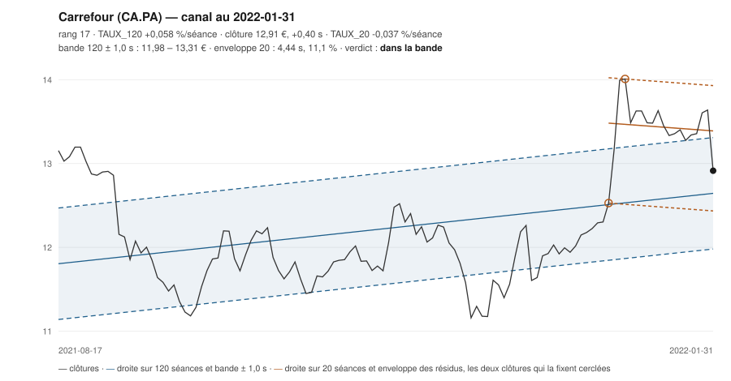

> Rang 17 · TAUX_120 +0,058 %/séance · clôture 12,91 € · bande 11,98 – 13,31 € · écart +0,40 s · TAUX_20 -0,037 %/séance · enveloppe 20 : 4,44 s, 11,1 % · **dans la bande**

- Clôture 12,91 € à +0,40 s, dans une bande 11,98 – 13,31 €.
- Pente longue positive (0,058 %/séance, 17e rang, hors TOP 10) contre une pente courte à peine négative (−0,037 %/séance).
- L'enveloppe atteint 4,44 s (11,1 %), nettement au-dessus des ~3,7 s, et ses deux points d'appui sont anciens : 12,53 € le 4 janvier en bas, 14,01 € le 7 en haut.
- La clôture est restée au-dessus du bord haut du 3 au 28 janvier (pic à +4,29 s le 6) ; elle n'est rentrée dans la bande que ce 31 janvier.
- Verdict : dans la bande.

### 18. `RNO.PA` — Renault

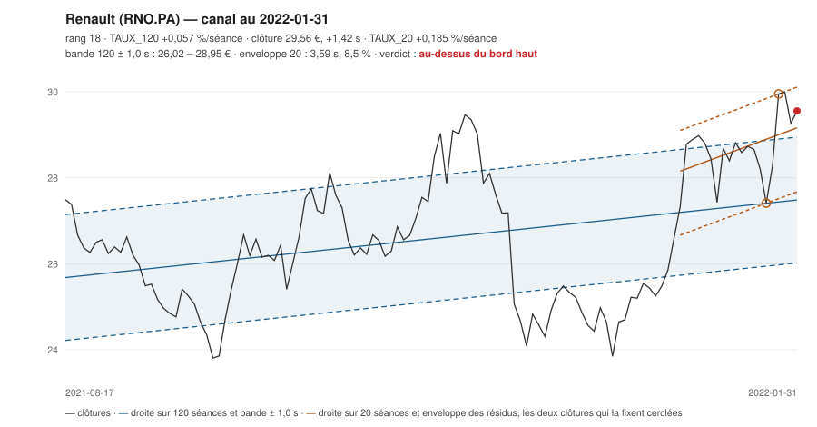

> Rang 18 · TAUX_120 +0,057 %/séance · clôture 29,56 € · bande 26,02 – 28,95 € · écart +1,42 s · TAUX_20 +0,185 %/séance · enveloppe 20 : 3,59 s, 8,5 % · **au-dessus du bord haut**

- Clôture 29,56 € à +1,42 s, au-dessus du bord haut de 28,95 € (bord bas 26,02 €).
- Pente longue positive (0,057 %/séance, 18e) et pente courte positive (0,185 %/séance) : concordance.
- Enveloppe de 3,59 s (8,5 %), dont les deux appuis sont récents, 27,41 € le 24 janvier et 29,95 € le 26.
- Au-dessus du bord haut sur la plupart des séances de janvier, sauf les 3 et 12 et du 21 au 25 ; dessus depuis le 26 (4 séances).
- Verdict : au-dessus du bord haut.

### 19. `ORA.PA` — Orange

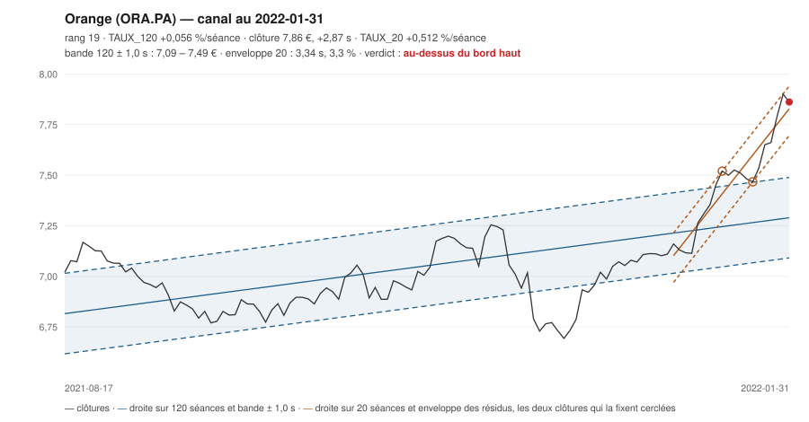

> Rang 19 · TAUX_120 +0,056 %/séance · clôture 7,86 € · bande 7,09 – 7,49 € · écart +2,87 s · TAUX_20 +0,512 %/séance · enveloppe 20 : 3,34 s, 3,3 % · **au-dessus du bord haut**

- Clôture 7,86 € à +2,87 s, très au-dessus d'une bande 7,09 – 7,49 €.
- Les deux pentes montent, 0,056 %/séance sur 120 séances (19e) et 0,512 %/séance sur 20.
- Enveloppe de 3,34 s pour seulement 3,3 % de la moyenne, entre 7,52 € le 14 janvier et 7,47 € le 21.
- Au-dessus du bord haut sans interruption depuis le 10 janvier (16 séances), jusqu'à +3,31 s le 28.
- Verdict : au-dessus du bord haut.

### 20. `AI.PA` — Air Liquide

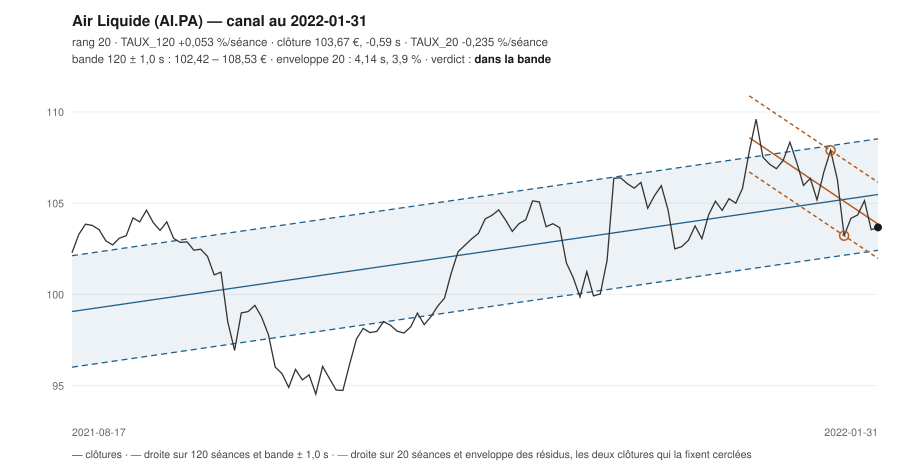

> Rang 20 · TAUX_120 +0,053 %/séance · clôture 103,67 € · bande 102,42 – 108,53 € · écart -0,59 s · TAUX_20 -0,235 %/séance · enveloppe 20 : 4,14 s, 3,9 % · **dans la bande**

- Clôture 103,67 € à −0,59 s de la droite des 120 séances, dans une bande qui va de 102,42 à 108,53 €.
- Pente longue faiblement positive (0,053 %/séance, 20e rang, hors TOP 10), pente courte négative (−0,235 %/séance) : les deux canaux divergent.
- Enveloppe des 20 résidus de 4,14 s (3,9 % de la moyenne sur 20 séances), un peu plus large que les ~3,7 s attendues ; elle est fixée par deux clôtures de la seconde moitié de la fenêtre, 107,89 € le 20 janvier en haut et 103,22 € le 24 en bas.
- Au-dessus du bord haut jusqu'au 7 janvier puis les 11 et 12, la clôture est dans la bande depuis 13 séances.
- Verdict : dans la bande.

### 21. `SAN.PA` — Sanofi

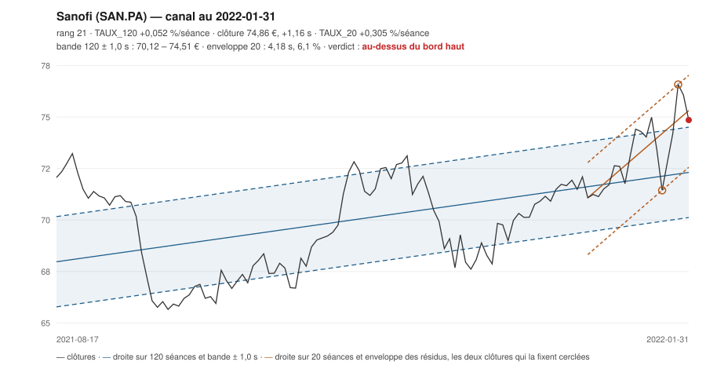

> Rang 21 · TAUX_120 +0,052 %/séance · clôture 74,86 € · bande 70,12 – 74,51 € · écart +1,16 s · TAUX_20 +0,305 %/séance · enveloppe 20 : 4,18 s, 6,1 % · **au-dessus du bord haut**

- Clôture 74,86 € à +1,16 s, au-dessus du bord haut de 74,51 € (bord bas 70,12 €).
- Pente longue de 0,052 %/séance (21e) et pente courte de 0,305 %/séance : les deux fenêtres montent.
- Enveloppe de 4,18 s (6,1 %), au-dessus des ~3,7 s, portée par deux clôtures récentes : 71,44 € le 24 janvier, 76,58 € le 27.
- Six changements de zone en janvier entre la bande et le dessus du bord haut ; dessus depuis le 26 (4 séances), +2,13 s le 27.
- Verdict : au-dessus du bord haut.

### 22. `KER.PA` — Kering

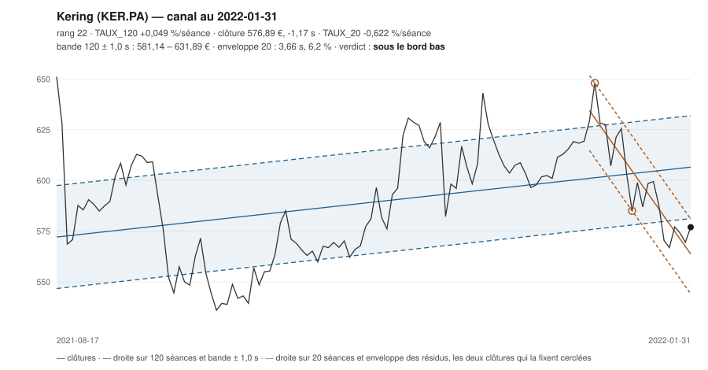

> Rang 22 · TAUX_120 +0,049 %/séance · clôture 576,89 € · bande 581,14 – 631,89 € · écart -1,17 s · TAUX_20 -0,622 %/séance · enveloppe 20 : 3,66 s, 6,2 % · **sous le bord bas**

- Clôture 576,89 € à −1,17 s, sous le bord bas de 581,14 € (bord haut 631,89 €).
- Pente longue faible (0,049 %/séance, 22e) contre une pente courte négative (−0,622 %/séance).
- L'enveloppe de 3,66 s (6,2 %) est fixée par deux clôtures anciennes, 647,97 € le 5 janvier et 584,97 € le 14.
- Passée sous le bord bas le 25, remontée le 26, la clôture est dessous depuis le 27 janvier (3 séances).
- Verdict : sous le bord bas, non candidate — hors TOP 10 (rang 22) et pente courte négative.

### 23. `DG.PA` — Vinci

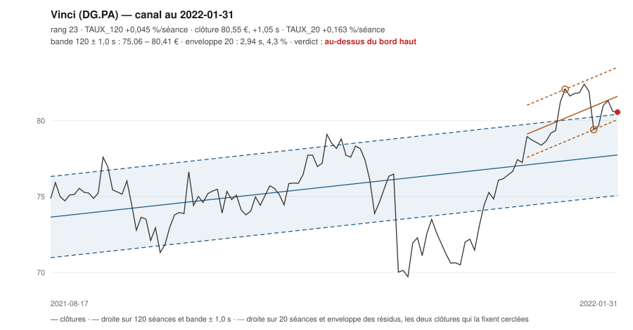

> Rang 23 · TAUX_120 +0,045 %/séance · clôture 80,55 € · bande 75,06 – 80,41 € · écart +1,05 s · TAUX_20 +0,163 %/séance · enveloppe 20 : 2,94 s, 4,3 % · **au-dessus du bord haut**

- Clôture 80,55 € contre un bord haut de 80,41 € : +1,05 s (bord bas 75,06 €).
- Pentes positives sur les deux fenêtres, 0,045 %/séance sur 120 séances (23e) et 0,163 %/séance sur 20.
- Enveloppe resserrée à 2,94 s (4,3 %), sous la référence de ~3,7 s, entre 82,06 € le 14 janvier et 79,40 € le 24.
- Au-dessus du bord haut sur toutes les séances de janvier sauf les 24 et 25, et à nouveau depuis le 26 (4 séances).
- Verdict : au-dessus du bord haut.

### 24. `OR.PA` — L'Oréal

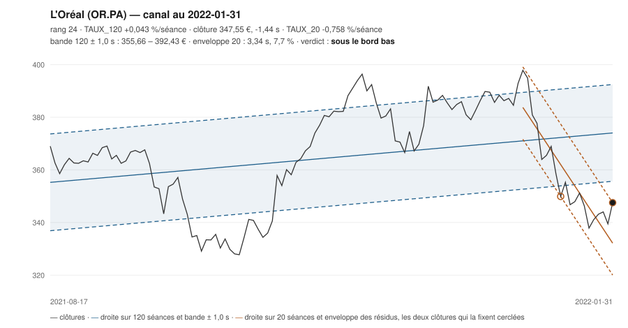

> Rang 24 · TAUX_120 +0,043 %/séance · clôture 347,55 € · bande 355,66 – 392,43 € · écart -1,44 s · TAUX_20 -0,758 %/séance · enveloppe 20 : 3,34 s, 7,7 % · **sous le bord bas**

- Clôture 347,55 € à −1,44 s ; bande 355,66 – 392,43 €.
- Pente longue de 0,043 %/séance, 24e, alors qu'elle était 16e début janvier ; pente courte négative (−0,758 %/séance).
- Enveloppe de 3,34 s (7,7 %) : le bord bas passe par la clôture du 14 janvier (349,90 €), le bord haut par celle du jour.
- Sous le bord bas depuis le 13 janvier (13 séances), après un premier passage les 10 et 11 ; creux à −2,27 s le 24.
- Verdict : sous le bord bas, non candidate — hors TOP 10 (rang 24) et pente courte négative.

### 25. `MT.AS` — ArcelorMittal

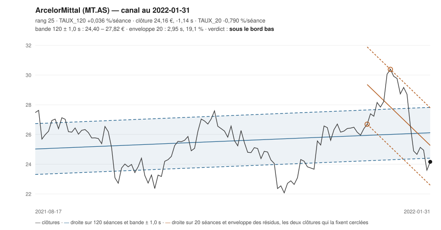

> Rang 25 · TAUX_120 +0,036 %/séance · clôture 24,16 € · bande 24,40 – 27,82 € · écart -1,14 s · TAUX_20 -0,790 %/séance · enveloppe 20 : 2,95 s, 19,1 % · **sous le bord bas**

- Clôture 24,16 € à −1,14 s, sous le bord bas de 24,40 € (bord haut 27,82 €).
- Pente longue faible (0,036 %/séance, 25e), pente courte négative (−0,790 %/séance) : discordance.
- Enveloppe de 2,95 s, sous la référence en unités de s, mais 19,1 % de la moyenne en niveau ; bornes au 4 janvier (26,69 €) et au 13 (30,38 €), toutes deux anciennes.
- Au-dessus du bord haut jusqu'au 20 janvier (+3,07 s le 12), sous le bord bas depuis le 28 : la bande traversée de haut en bas en six séances.
- Verdict : sous le bord bas, non candidate — hors TOP 10 (rang 25) et pente courte négative.

### 26. `STLAP.PA` — Stellantis

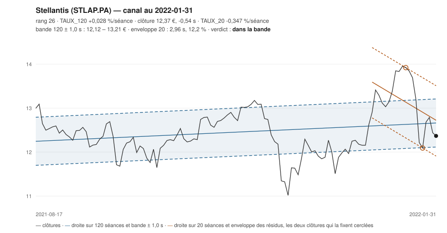

> Rang 26 · TAUX_120 +0,028 %/séance · clôture 12,37 € · bande 12,12 – 13,21 € · écart -0,54 s · TAUX_20 -0,347 %/séance · enveloppe 20 : 2,96 s, 12,2 % · **dans la bande**

- Clôture 12,37 € à −0,54 s, bande 12,12 – 13,21 €.
- Pente longue de 0,028 %/séance (26e), pente courte négative (−0,347 %/séance).
- Enveloppe de 2,96 s pour 12,2 % de la moyenne, entre 13,92 € le 18 janvier et 12,09 € le 25.
- Au-dessus du bord haut du 4 au 21 janvier (+2,92 s le 13), dans la bande depuis le 24 (6 séances), sans descendre sous −0,85 s.
- Verdict : dans la bande.

### 27. `LR.PA` — Legrand

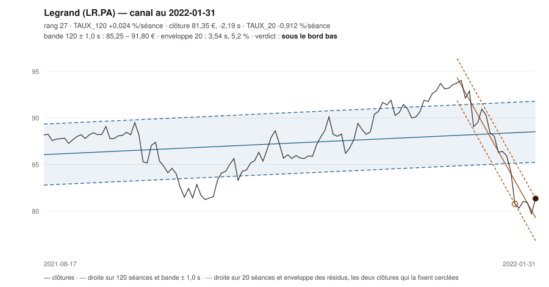

> Rang 27 · TAUX_120 +0,024 %/séance · clôture 81,35 € · bande 85,25 – 91,80 € · écart -2,19 s · TAUX_20 -0,912 %/séance · enveloppe 20 : 3,54 s, 5,2 % · **sous le bord bas**

- Clôture 81,35 € à −2,19 s, sous une bande 85,25 – 91,80 €.
- Pente longue presque plate (0,024 %/séance, 27e), pente courte en forte baisse (−0,912 %/séance).
- Enveloppe de 3,54 s (5,2 %) ; bord bas fixé par 80,79 € le 24 janvier, bord haut par la clôture du jour — deux points récents.
- Au-dessus du bord haut encore le 7 janvier, la clôture est sous le bord bas depuis le 18 (10 séances), avec un creux à −3,14 s le 24.
- Verdict : sous le bord bas, non candidate — hors TOP 10 (rang 27) et pente courte négative.

### 28. `DSY.PA` — Dassault Systèmes

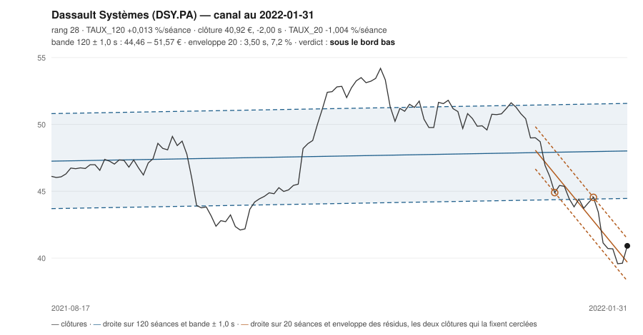

> Rang 28 · TAUX_120 +0,013 %/séance · clôture 40,92 € · bande 44,46 – 51,57 € · écart -2,00 s · TAUX_20 -1,004 %/séance · enveloppe 20 : 3,50 s, 7,2 % · **sous le bord bas**

- Clôture 40,92 € à −2,00 s, loin sous une bande 44,46 – 51,57 €.
- Pente longue presque nulle (0,013 %/séance, 28e), pente courte fortement négative (−1,004 %/séance) : la baisse récente écrase la pente longue.
- Enveloppe de 3,50 s (7,2 %), bornée par 44,90 € le 10 janvier et 44,54 € le 20, deux clôtures du milieu de fenêtre.
- Sous le bord bas sur les 21 séances de janvier, jusqu'à −2,65 s le 24, pendant que le rang glissait du 10e au 28e.
- Verdict : sous le bord bas, non candidate — hors TOP 10 (rang 28) et pente courte négative.

### 29. `SGO.PA` — Saint-Gobain

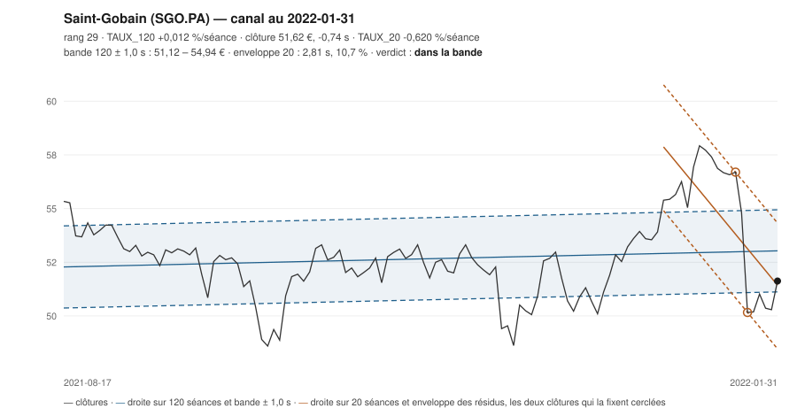

> Rang 29 · TAUX_120 +0,012 %/séance · clôture 51,62 € · bande 51,12 – 54,94 € · écart -0,74 s · TAUX_20 -0,620 %/séance · enveloppe 20 : 2,81 s, 10,7 % · **dans la bande**

- Clôture 51,62 € à −0,74 s, dans une bande 51,12 – 54,94 €.
- Pente longue presque nulle (0,012 %/séance, 29e), pente courte négative (−0,620 %/séance).
- Enveloppe de 2,81 s (10,7 %), sous la référence, entre 56,70 € le 20 janvier et 50,16 € le 24.
- La clôture est passée de +0,83 s le 21 à −1,51 s le 24, est restée sous le bord bas jusqu'au 28 et a réintégré la bande le 31.
- Verdict : dans la bande.

### 30. `SAF.PA` — Safran

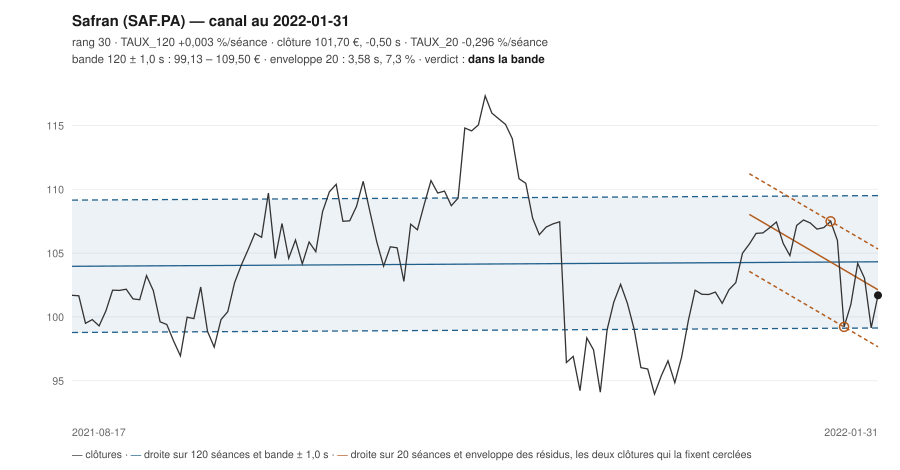

> Rang 30 · TAUX_120 +0,003 %/séance · clôture 101,70 € · bande 99,13 – 109,50 € · écart -0,50 s · TAUX_20 -0,296 %/séance · enveloppe 20 : 3,58 s, 7,3 % · **dans la bande**

- Clôture 101,70 € à −0,50 s, bande 99,13 – 109,50 €.
- Pente longue quasi nulle (0,003 %/séance, 30e et dernier rang positif) ; pente courte négative (−0,296 %/séance).
- Enveloppe de 3,58 s (7,3 %), entre 107,50 € le 20 janvier et 99,22 € le 24.
- Sous le bord bas les 24 et 28 janvier (−1,07 et −1,02 s), la clôture est revenue dans la bande le 31.
- Verdict : dans la bande.

### `TEP.PA` — Teleperformance

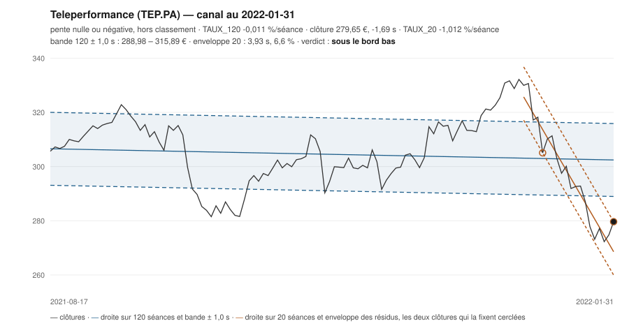

> Hors classement · TAUX_120 -0,011 %/séance · clôture 279,65 € · bande 288,98 – 315,89 € · écart -1,69 s · TAUX_20 -1,012 %/séance · enveloppe 20 : 3,93 s, 6,6 % · **sous le bord bas**

- Clôture 279,65 € à −1,69 s, sous une bande 288,98 – 315,89 €.
- Pente longue devenue négative (−0,011 %/séance), hors classement depuis le 27 janvier ; pente courte à −1,012 %/séance : concordance à la baisse.
- Enveloppe de 3,93 s (6,6 %) ; son bord haut passe par la clôture du jour, son bord bas par celle du 10 janvier (305,07 €).
- Sous le bord bas depuis le 18 janvier (10 séances), avec −2,68 s le 25.
- Verdict : sous le bord bas, non candidate — pente longue négative, donc hors TOP 10, et pente courte négative.

### `AIR.PA` — Airbus

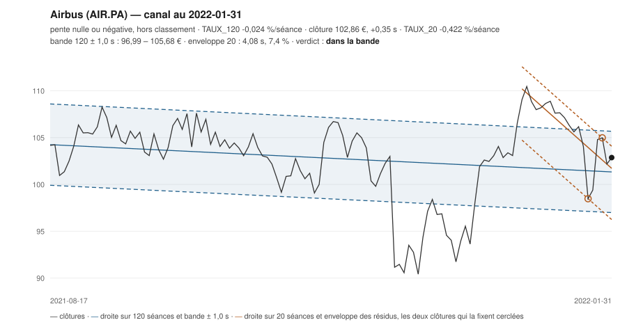

> Hors classement · TAUX_120 -0,024 %/séance · clôture 102,86 € · bande 96,99 – 105,68 € · écart +0,35 s · TAUX_20 -0,422 %/séance · enveloppe 20 : 4,08 s, 7,4 % · **dans la bande**

- Clôture 102,86 €, à +0,35 s, au milieu d'une bande 96,99 – 105,68 €.
- Les deux pentes sont négatives, la longue de peu (−0,024 %/séance, hors classement), la courte nettement (−0,422 %/séance) : elles concordent.
- L'enveloppe mesure 4,08 s (7,4 %), au-dessus des ~3,7 s de référence, et ses deux points d'appui sont récents : 98,48 € le 24 janvier en bas, 104,97 € le 27 en haut.
- Au-dessus du bord haut jusqu'au 20 janvier (+3,05 s le 5), la clôture est redescendue dans la bande le 21 et y reste depuis 7 séances.
- Verdict : dans la bande.

### `VIV.PA` — Vivendi

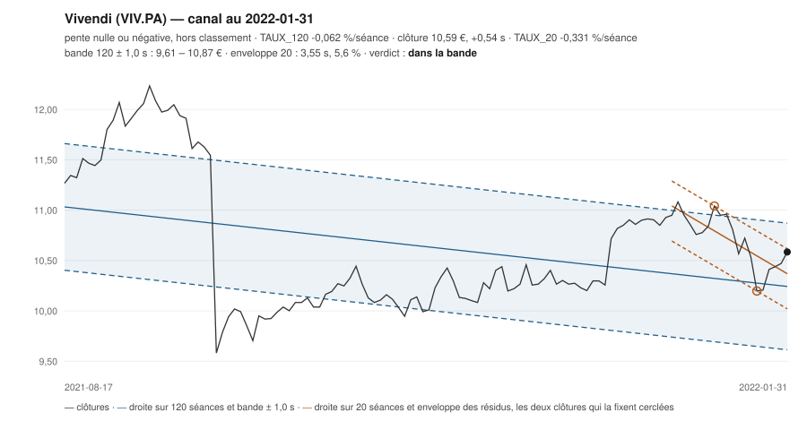

> Hors classement · TAUX_120 -0,062 %/séance · clôture 10,59 € · bande 9,61 – 10,87 € · écart +0,54 s · TAUX_20 -0,331 %/séance · enveloppe 20 : 3,55 s, 5,6 % · **dans la bande**

- Clôture 10,59 € à +0,54 s, bande 9,61 – 10,87 €.
- Pente longue négative (−0,062 %/séance) et pente courte négative (−0,331 %/séance).
- Enveloppe de 3,55 s (5,6 %), entre 11,04 € le 13 janvier et 10,20 € le 24.
- Au-dessus du bord haut du 13 au 17 janvier, dans la bande depuis le 18 (10 séances).
- Verdict : dans la bande.

### `ALO.PA` — Alstom

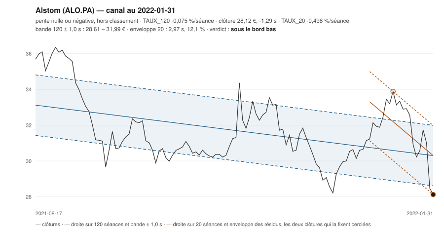

> Hors classement · TAUX_120 -0,075 %/séance · clôture 28,12 € · bande 28,61 – 31,99 € · écart -1,29 s · TAUX_20 -0,498 %/séance · enveloppe 20 : 2,97 s, 12,1 % · **sous le bord bas**

- Clôture 28,12 € sous le bord bas de 28,61 € (bande jusqu'à 31,99 €), soit −1,29 s.
- Pente longue négative (−0,075 %/séance) et pente courte plus raide encore (−0,498 %/séance) : la baisse est lue sur les deux fenêtres.
- Enveloppe étroite en s, 2,97 s, mais large en niveau (12,1 % de la moyenne) ; son bord bas passe par la clôture du jour, son bord haut par celle du 13 janvier à 33,89 €.
- Au-dessus du bord haut jusqu'au 20 janvier, sous le bord bas dès le 28 : la bande a été traversée de haut en bas en six séances.
- Verdict : sous le bord bas, non candidate — pente longue négative, donc hors TOP 10, et pente courte négative.

### `HO.PA` — Thales

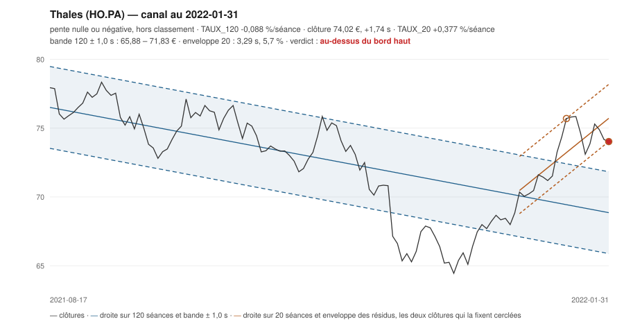

> Hors classement · TAUX_120 -0,088 %/séance · clôture 74,02 € · bande 65,88 – 71,83 € · écart +1,74 s · TAUX_20 +0,377 %/séance · enveloppe 20 : 3,29 s, 5,7 % · **au-dessus du bord haut**

- Clôture 74,02 € à +1,74 s, au-dessus d'une bande 65,88 – 71,83 €.
- Pente longue négative (−0,088 %/séance), pente courte nettement positive (0,377 %/séance) : les deux canaux vont en sens contraire.
- Enveloppe de 3,29 s (5,7 %), sous la référence ; la clôture du jour en fixe le bord bas, celle du 18 janvier (75,70 €) le bord haut.
- Au-dessus du bord haut sur toutes les séances de janvier, avec un maximum de +3,47 s le 18.
- Verdict : au-dessus du bord haut.

### `BN.PA` — Danone

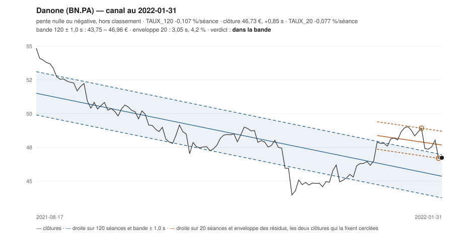

> Hors classement · TAUX_120 -0,107 %/séance · clôture 46,73 € · bande 43,75 – 46,96 € · écart +0,85 s · TAUX_20 -0,077 %/séance · enveloppe 20 : 3,05 s, 4,2 % · **dans la bande**

- Clôture 46,73 € à +0,85 s, juste sous le bord haut de 46,96 € (bord bas 43,75 €).
- Deux pentes négatives, −0,107 %/séance sur 120 séances et −0,077 %/séance sur 20 : elles concordent.
- L'enveloppe ne fait que 3,05 s (4,2 %), sous la référence de ~3,7 s ; elle tient à deux clôtures récentes, 48,92 € le 21 janvier et 46,69 € le 28.
- La clôture était au-dessus du bord haut sur chaque séance du 3 au 27 janvier (sommet +3,01 s le 14) ; elle est dans la bande depuis 2 séances.
- Verdict : dans la bande.

### `EN.PA` — Bouygues

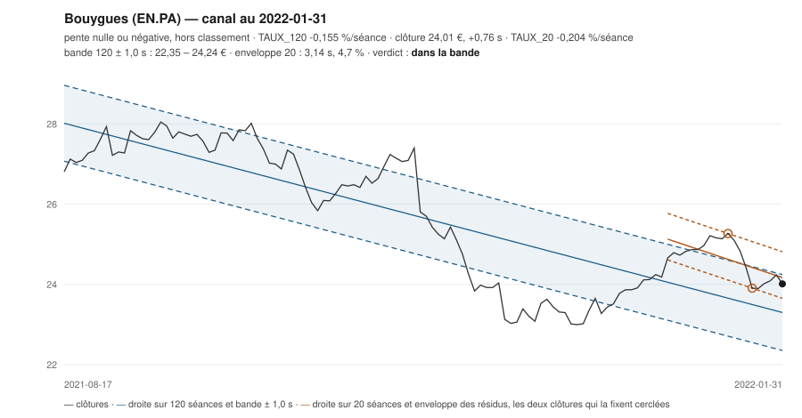

> Hors classement · TAUX_120 -0,155 %/séance · clôture 24,01 € · bande 22,35 – 24,24 € · écart +0,76 s · TAUX_20 -0,204 %/séance · enveloppe 20 : 3,14 s, 4,7 % · **dans la bande**

- Clôture 24,01 € à +0,76 s, dans une bande 22,35 – 24,24 €.
- Pente longue négative (−0,155 %/séance) et pente courte négative (−0,204 %/séance) : concordance à la baisse.
- Enveloppe de 3,14 s (4,7 %), en dessous des ~3,7 s, entre 25,27 € le 18 janvier et 23,90 € le 24.
- Passage au-dessus du bord haut du 13 au 20 janvier (sommet +1,45 s le 18), puis 7 séances dans la bande.
- Verdict : dans la bande.

### `ERF.PA` — Eurofins Scientific

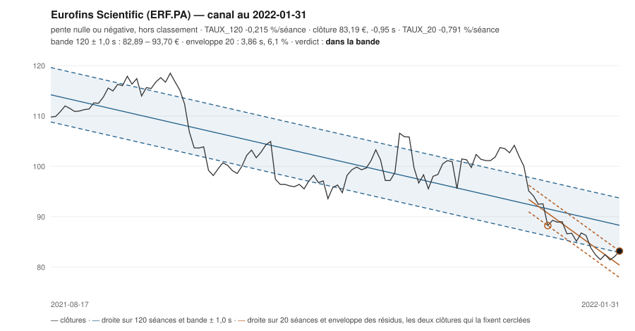

> Hors classement · TAUX_120 -0,215 %/séance · clôture 83,19 € · bande 82,89 – 93,70 € · écart -0,95 s · TAUX_20 -0,791 %/séance · enveloppe 20 : 3,86 s, 6,1 % · **dans la bande**

- Clôture 83,19 € à −0,95 s, juste au-dessus du bord bas de 82,89 € (bord haut 93,70 €).
- Pente longue négative (−0,215 %/séance) et pente courte négative (−0,791 %/séance) : les deux fenêtres baissent.
- Enveloppe de 3,86 s (6,1 %) ; son bord haut passe par la clôture du jour, son bord bas par celle du 10 janvier à 88,24 €.
- Sous le bord bas du 10 au 28 janvier (−1,67 s le 25), la clôture a réintégré la bande ce 31 janvier.
- Verdict : dans la bande.

### `WLN.PA` — Worldline

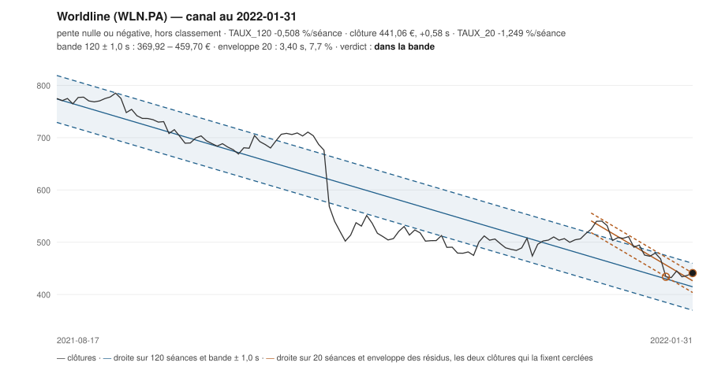

> Hors classement · TAUX_120 -0,508 %/séance · clôture 441,06 € · bande 369,92 – 459,70 € · écart +0,58 s · TAUX_20 -1,249 %/séance · enveloppe 20 : 3,40 s, 7,7 % · **dans la bande**

- Clôture 441,06 € à +0,58 s, dans une bande large, de 369,92 à 459,70 €.
- Pente longue la plus négative de l'univers (−0,508 %/séance) et pente courte à −1,249 %/séance : concordance à la baisse.
- Enveloppe de 3,40 s (7,7 %) ; le bord bas passe par la clôture du 24 janvier (433,98 €), le bord haut par celle du jour.
- Au-dessus du bord haut jusqu'au 17 janvier et le 20, la clôture est dans la bande depuis le 21 (7 séances).
- Verdict : dans la bande.

### Les figures des ordres du mois

#### 2022-01-07 — Achat `RI.PA` Pernod Ricard, décision au 2022-01-06

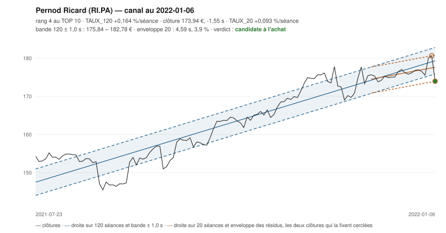

> Rang 4 · TAUX_120 +0,164 %/séance · clôture 173,94 € · bande 175,84 – 182,78 € · écart -1,55 s · TAUX_20 +0,093 %/séance · enveloppe 20 : 4,59 s, 3,9 % · **candidate à l'achat**

#### 2022-01-07 — Achat `EL.PA` EssilorLuxottica, décision au 2022-01-06

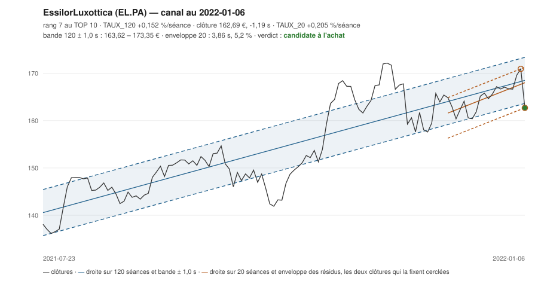

> Rang 7 · TAUX_120 +0,152 %/séance · clôture 162,69 € · bande 163,62 – 173,35 € · écart -1,19 s · TAUX_20 +0,205 %/séance · enveloppe 20 : 3,86 s, 5,2 % · **candidate à l'achat**

#### 2022-01-07 — Achat `CAP.PA` Capgemini, décision au 2022-01-06

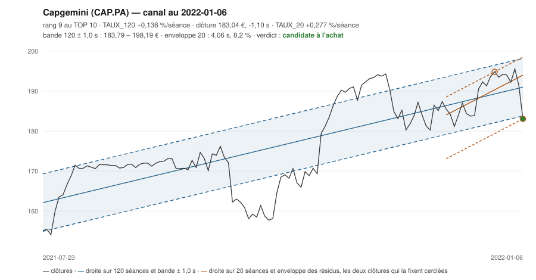

> Rang 9 · TAUX_120 +0,138 %/séance · clôture 183,04 € · bande 183,79 – 198,19 € · écart -1,10 s · TAUX_20 +0,277 %/séance · enveloppe 20 : 4,06 s, 8,2 % · **candidate à l'achat**

#### 2022-01-11 — Achat `STMPA.PA` STMicroelectronics, décision au 2022-01-10

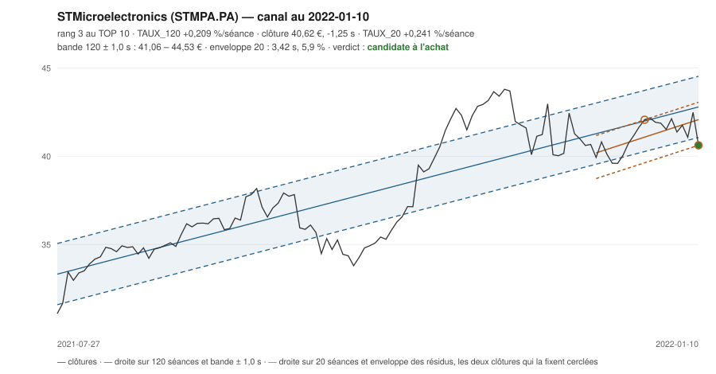

> Rang 3 · TAUX_120 +0,209 %/séance · clôture 40,62 € · bande 41,06 – 44,53 € · écart -1,25 s · TAUX_20 +0,241 %/séance · enveloppe 20 : 3,42 s, 5,9 % · **candidate à l'achat**

#### 2022-01-25 — Achat `BNP.PA` BNP Paribas, décision au 2022-01-24

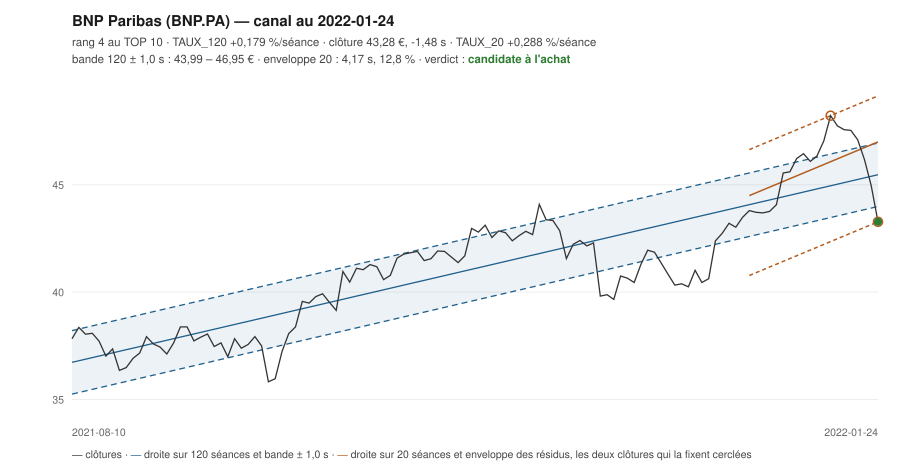

> Rang 4 · TAUX_120 +0,179 %/séance · clôture 43,28 € · bande 43,99 – 46,95 € · écart -1,48 s · TAUX_20 +0,288 %/séance · enveloppe 20 : 4,17 s, 12,8 % · **candidate à l'achat**

## 5. Le TOP 10 au 2022-01-31

| Rang | Valeur | TAUX_120 | Écart | TAUX_20 | Verdict |
|---|---|---|---|---|---|
| 1 | `TTE.PA` TotalEnergies | +0,251 %/séance | +0,86 s | +0,581 %/séance | dans la bande |
| 2 | `GLE.PA` Société Générale | +0,203 %/séance | +0,24 s | -0,019 %/séance | dans la bande |
| 3 | `BNP.PA` BNP Paribas | +0,183 %/séance | -0,37 s | -0,133 %/séance | dans la bande |
| 4 | `RMS.PA` Hermès International | +0,173 %/séance | -1,85 s | -0,840 %/séance | sous le bord bas |
| 5 | `VIE.PA` Veolia | +0,170 %/séance | -0,37 s | -0,171 %/séance | dans la bande |
| 6 | `CS.PA` AXA | +0,151 %/séance | +0,84 s | +0,087 %/séance | dans la bande |
| 7 | `STMPA.PA` STMicroelectronics | +0,148 %/séance | -1,30 s | -0,548 %/séance | sous le bord bas |
| 8 | `ENGI.PA` Engie | +0,133 %/séance | -0,08 s | +0,047 %/séance | dans la bande |
| 9 | `MC.PA` LVMH | +0,129 %/séance | -0,25 s | -0,300 %/séance | dans la bande |
| 10 | `RI.PA` Pernod Ricard | +0,118 %/séance | -2,98 s | -0,587 %/séance | sous le bord bas |

**Entrées et sorties du TOP 10 au fil du mois**

| Séance | Entrées | Sorties |
|---|---|---|
| 2022-01-05 | `SU.PA` | `DSY.PA` |
| 2022-01-11 | `ENGI.PA` | `CAP.PA` |
| 2022-01-17 | `CS.PA` | `EL.PA` |
| 2022-01-25 | `MC.PA` | `SU.PA` |

## 6. Les ordres exécutés

> À l'**ouverture** de la séance qui suit la décision, jamais à la clôture qui l'a déclenchée. L'écart d'ouverture est subi, et publié.

| Exécution | Sens | Valeur | Quantité | Prix | Brut | Frais | Écart d'ouverture | Motif |
|---|---|---|---|---|---|---|---|---|
| 2022-01-07 | **Achat** | `RI.PA` Pernod Ricard | 11 | 173,52 € | 1 908,77 € | 7,92 € | -0,24 % | décision au 2022-01-06 : clôture 173,94 € sous le bord bas 175,84 € (-1,55 s), rang 4, TAUX_120 +0,164 %/séance, TAUX_20 +0,093 %/séance |
| 2022-01-07 | **Achat** | `EL.PA` EssilorLuxottica | 12 | 162,03 € | 1 944,37 € | 8,07 € | -0,40 % | décision au 2022-01-06 : clôture 162,69 € sous le bord bas 163,62 € (-1,19 s), rang 7, TAUX_120 +0,152 %/séance, TAUX_20 +0,205 %/séance |
| 2022-01-07 | **Achat** | `CAP.PA` Capgemini | 10 | 182,86 € | 1 828,57 € | 7,59 € | -0,10 % | décision au 2022-01-06 : clôture 183,04 € sous le bord bas 183,79 € (-1,10 s), rang 9, TAUX_120 +0,138 %/séance, TAUX_20 +0,277 %/séance |
| 2022-01-11 | **Achat** | `STMPA.PA` STMicroelectronics | 51 | 41,80 € | 2 131,87 € | 2,45 € | +2,91 % | décision au 2022-01-10 : clôture 40,62 € sous le bord bas 41,06 € (-1,25 s), rang 3, TAUX_120 +0,209 %/séance, TAUX_20 +0,241 %/séance |
| 2022-01-25 | **Achat** | `BNP.PA` BNP Paribas | 49 | 43,84 € | 2 148,14 € | 8,91 € | +1,30 % | décision au 2022-01-24 : clôture 43,28 € sous le bord bas 43,99 € (-1,48 s), rang 4, TAUX_120 +0,179 %/séance, TAUX_20 +0,288 %/séance |

## 7. Les signaux non exécutés

| Décision | Valeur | Rang | Écart | TAUX_20 | Sort |
|---|---|---|---|---|---|
| 2022-01-25 | `ENGI.PA` Engie | 9 | -1,01 s | +0,179 %/séance | FAUTE DE CRENEAU |

## 8. La lecture du mois

Sur le mois, la meilleure contribution vient de `BNP.PA` (BNP Paribas) pour **+65,89 €**, la moins bonne de `RI.PA` (Pernod Ricard) pour **-181,45 €**. Les 5 ordres du mois ont coûté **34,95 €** de frais, soit 0,349 % de la dotation. Le portefeuille termine le mois **derrière TR39** de 1,56 point. Sur 1 séance de décision, un candidat n'a pas pu être acheté faute de créneau.

---

[Protocole](../README.md) · [Février →](2022-02.md)
