# Mai 2022

> Journal de l'[expérience 4](../README.md) · exécutions du 2022-05-02 au 2022-05-31 · **3 ordres**
> Portefeuille au 2022-05-31 : **9 894,19 €** (base 98,94) · TR39 92,44 · alpha du mois **-0,45 pt** · depuis janvier **+6,50 pt**

---

## 1. Les actualités du mois précédent

**Avril 2022.** Le rebond de mars ne tient pas. L'inflation américaine atteint
8,5 % sur un an, l'européenne 7,4 %, et le marché intègre des hausses de taux
d'un demi-point. Le Nasdaq perd plus de 13 % sur le mois, sa pire performance
depuis 2008.

La Chine confine Shanghai pendant plusieurs semaines au nom de la politique
« zéro Covid », désorganisant les chaînes d'approvisionnement et pesant sur le
luxe, très exposé à la clientèle chinoise. En France, l'élection présidentielle
se joue le 24 avril. L'euro glisse sous 1,06 dollar.

## 2. L'exposition héritée au 2022-04-29

| Valeur | Achetée le | Prix d'achat | Cours | +/− value | Alpha depuis l'achat |
|---|---|---|---|---|---|
| `MC.PA` LVMH | 2022-02-11 | 633,54 € | 571,21 € | **-9,84 %** | -3,52 pt |
| `TTE.PA` TotalEnergies | 2022-03-30 | 36,38 € | 37,05 € | **+1,85 %** | +4,01 pt |
| `DG.PA` Vinci | 2022-04-06 | 73,34 € | 79,26 € | **+8,07 %** | +5,97 pt |

## 3. Le portefeuille depuis le 2022-01-03

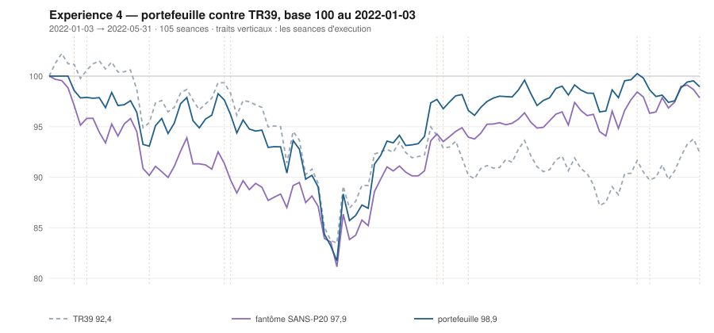

| | |
|---|---|
| Dotation initiale | 10 000,00 € au 2022-01-03 |
| Titres au 2022-05-31 | 4 042,58 € |
| Espèces | 5 851,61 € |
| Lignes détenues | 2 |
| **Total** | **9 894,19 €** |
| Base 100 | **98,94** |
| Fantôme `SANS-P20`, même base | 97,86 |
| TR39, même base | 92,44 |
| Écart depuis janvier | **+6,50 pt** |

### Toutes les positions depuis le début de l'expérience

> Closes comme ouvertes. Aucune séance postérieure au 2022-05-31 n'entre dans ce tableau.

| Société | Prix d'achat | Date d'achat | Prix de vente | Date de vente |
|---|---|---|---|---|
| `CAP.PA` Capgemini | 182,86 € | 2022-01-07 | 181,51 € | 2022-03-30 |
| `EL.PA` EssilorLuxottica | 162,03 € | 2022-01-07 | 153,11 € | 2022-03-30 |
| `RI.PA` Pernod Ricard | 173,52 € | 2022-01-07 | 164,76 € | 2022-03-31 |
| `STMPA.PA` STMicroelectronics | 41,80 € | 2022-01-11 | 39,65 € | 2022-03-30 |
| `BNP.PA` BNP Paribas | 43,84 € | 2022-01-25 | 48,20 € | 2022-02-10 |
| `MC.PA` LVMH | 633,54 € | 2022-02-11 | 558,12 € | 2022-05-31 |
| `SAN.PA` Sanofi | 74,66 € | 2022-03-30 | 77,80 € | 2022-04-06 |
| `TTE.PA` TotalEnergies | 36,38 € | 2022-03-30 | 40,80 € | 2022-05-17 |
| `DG.PA` Vinci | 73,34 € | 2022-04-06 |  |  |
| `CA.PA` Carrefour | 15,17 € | 2022-05-19 |  |  |

*10 positions depuis le début, dont 2 encore ouvertes : les deux dernières colonnes restent vides.*

## 4. L'étude chartiste au 2022-05-31

> Une entrée par société de l'univers, sous la figure de canal lue à la clôture du 2022-05-31. La ligne en retrait est **calculée** ; la note qui suit est celle de l'agent `chartiste`, rédigée sans aucune séance postérieure.

### 1. `HO.PA` — Thales

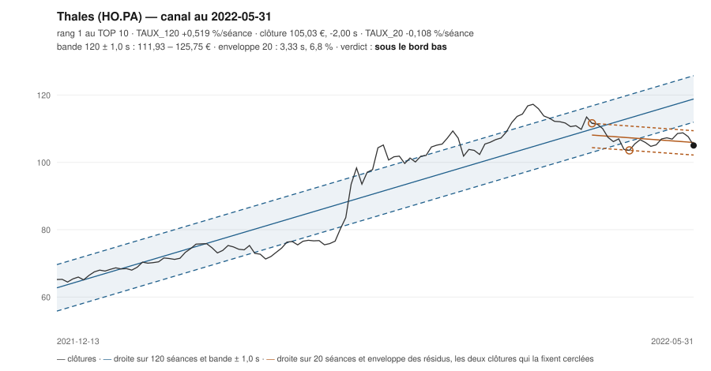

> Rang 1 · TAUX_120 +0,519 %/séance · clôture 105,03 € · bande 111,93 – 125,75 € · écart -2,00 s · TAUX_20 -0,108 %/séance · enveloppe 20 : 3,33 s, 6,8 % · **sous le bord bas**

- Clôture 105,03 €, −2,00 s, sous une bande de 111,93 à 125,75 €.
- Pentes discordantes : TAUX_120 +0,519 %/séance, rang 1 du TOP 10 depuis 60 séances ; TAUX_20 −0,108 %/séance, négatif depuis 18 séances.
- Enveloppe de 3,33 s. Deux bornes anciennes : haut à la première séance, le 4 mai (111,62 €), bas le 13 mai (103,57 €).
- Sous le bord bas de son canal du jour depuis 17 séances. La pente courte était négative à chacune d'elles, et l'écart du jour est le plus bas de la période.
- Verdict : sous le bord bas, sans être candidate. La valeur est au TOP 10, mais la pente courte est négative.

### 2. `CA.PA` — Carrefour

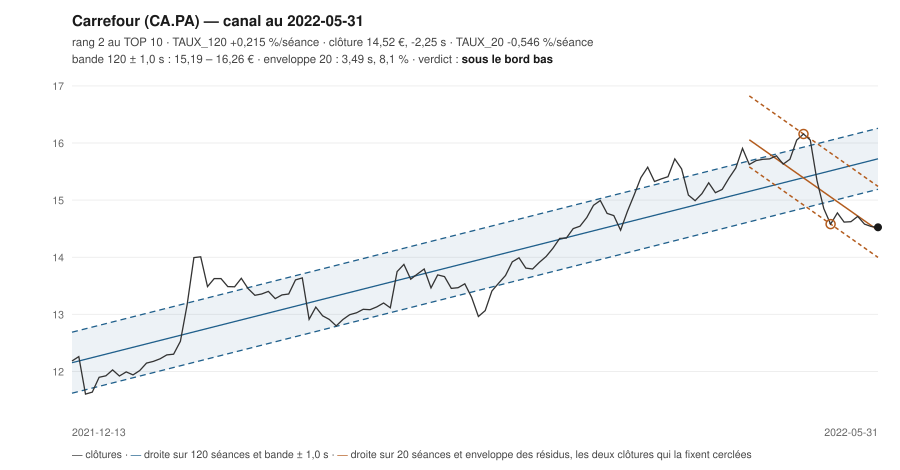

> Rang 2 · TAUX_120 +0,215 %/séance · clôture 14,52 € · bande 15,19 – 16,26 € · écart -2,25 s · TAUX_20 -0,546 %/séance · enveloppe 20 : 3,49 s, 8,1 % · **sous le bord bas**

- Clôture 14,52 €, −2,25 s, sous une bande de 15,19 à 16,26 €.
- Pentes discordantes : TAUX_120 +0,215 %/séance, rang 2 du TOP 10 depuis 76 séances ; TAUX_20 −0,546 %/séance, négatif depuis 7 séances.
- Enveloppe de 3,49 s. Ses deux bornes sont à quatre séances d'écart : 16,16 € le 16 mai, 14,58 € le 20 mai.
- La bande a été traversée de haut en bas en 11 séances : +1,31 s le 3 mai, sous le bord bas depuis le 18 mai, jusqu'à −2,65 s le 20 mai. La valeur a été candidate les 18, 19 et 20 mai, tant que la pente courte était positive.
- Verdict : sous le bord bas, sans être candidate. La valeur est au TOP 10, mais la pente courte est négative.

### 3. `ORA.PA` — Orange

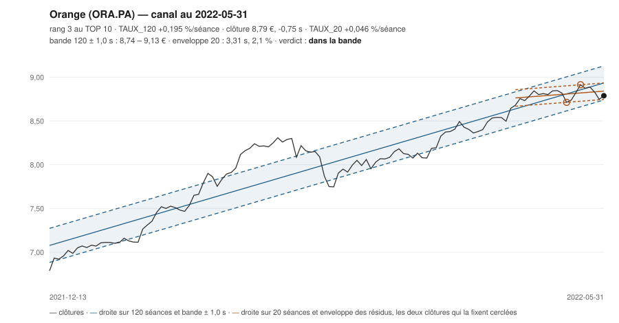

> Rang 3 · TAUX_120 +0,195 %/séance · clôture 8,79 € · bande 8,74 – 9,13 € · écart -0,75 s · TAUX_20 +0,046 %/séance · enveloppe 20 : 3,31 s, 2,1 % · **dans la bande**

- Clôture 8,79 € à −0,75 s, dans une bande très étroite de 8,74 à 9,13 €.
- Pentes concordantes à la hausse : TAUX_120 +0,195 %/séance, rang 3, stable ; TAUX_20 +0,046 %/séance, positif depuis 46 séances.
- Enveloppe de 3,31 s, soit 2,1 % de E_20. Ses deux bornes sont récentes, à trois séances d'écart : 8,71 € le 19 mai, 8,91 € le 24 mai.
- Dans la bande depuis 65 séances. L'écart le plus bas des 20 dernières est −0,92 s, le 30 mai.
- Verdict : dans la bande.

### 4. `SAN.PA` — Sanofi

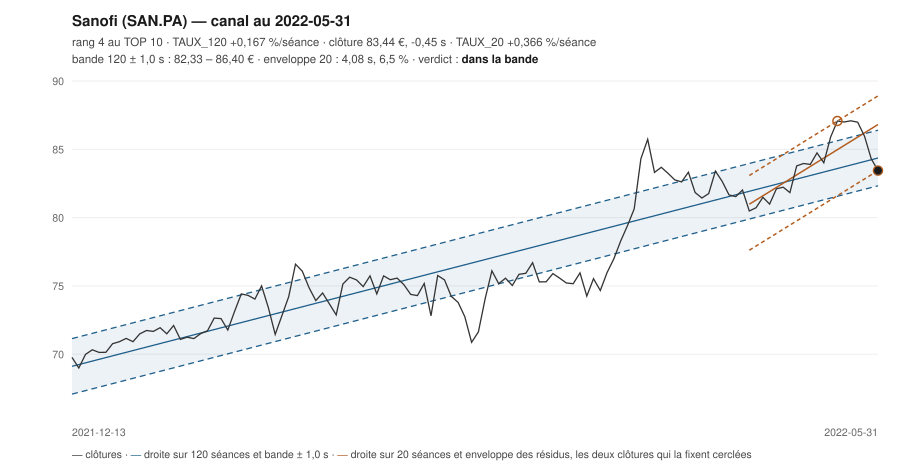

> Rang 4 · TAUX_120 +0,167 %/séance · clôture 83,44 € · bande 82,33 – 86,40 € · écart -0,45 s · TAUX_20 +0,366 %/séance · enveloppe 20 : 4,08 s, 6,5 % · **dans la bande**

- Clôture 83,44 € à −0,45 s, bande de 82,33 à 86,40 €.
- Pentes concordantes à la hausse : TAUX_120 +0,167 %/séance, rang 4 ; TAUX_20 +0,366 %/séance depuis 11 séances.
- Enveloppe de 4,08 s, plus large que l'attendu. Son bas est la clôture du jour, son haut celle du 23 mai (87,07 €).
- Six clôtures au-dessus du bord haut en 20 séances, jusqu'à +1,94 s le 23 mai. L'écart est tombé de +1,49 s le 26 mai à −0,45 s en trois séances.
- Verdict : dans la bande.

### 5. `TTE.PA` — TotalEnergies

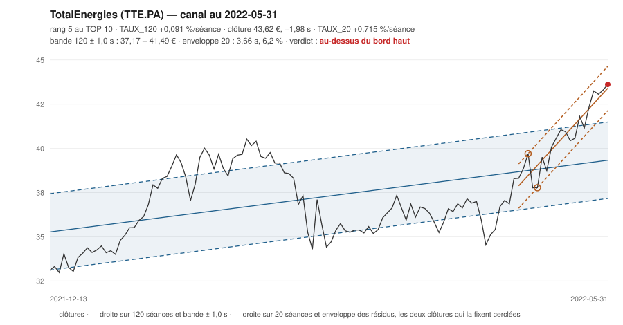

> Rang 5 · TAUX_120 +0,091 %/séance · clôture 43,62 € · bande 37,17 – 41,49 € · écart +1,98 s · TAUX_20 +0,715 %/séance · enveloppe 20 : 3,66 s, 6,2 % · **au-dessus du bord haut**

- Clôture 43,62 €, +1,98 s, au-dessus d'une bande de 37,17 à 41,49 €.
- Pentes concordantes à la hausse : TAUX_120 +0,091 %/séance, rang 5, stable ; TAUX_20 +0,715 %/séance, positif depuis 21 séances.
- Enveloppe de 3,66 s, conforme à l'attendu. Deux bornes anciennes : haut le 6 mai (39,70 €), bas le 10 mai (37,78 €).
- La bande a été traversée de bas en haut en 17 séances. Clôture sous le bord bas le 27 avril (−1,20 s), au-dessus du bord haut depuis le 20 mai, jusqu'à +2,10 s le 26 mai.
- Verdict : au-dessus du bord haut.

### 6. `AI.PA` — Air Liquide

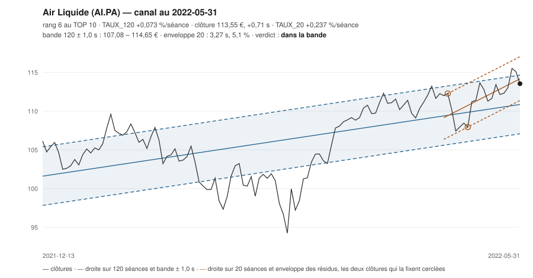

> Rang 6 · TAUX_120 +0,073 %/séance · clôture 113,55 € · bande 107,08 – 114,65 € · écart +0,71 s · TAUX_20 +0,237 %/séance · enveloppe 20 : 3,27 s, 5,1 % · **dans la bande**

- Clôture 113,55 € à +0,71 s, bande de 107,08 à 114,65 €.
- Pentes concordantes à la hausse : TAUX_120 +0,073 %/séance, rang 6 d'un TOP 10 qui ne compte que 8 valeurs ; TAUX_20 +0,237 %/séance depuis 10 séances.
- Enveloppe de 3,27 s, fixée en début de fenêtre : haut le 5 mai (112,27 €), bas le 12 mai (107,94 €).
- Six clôtures au-dessus du bord haut en 20 séances, jusqu'à +1,36 s le 27 mai. La clôture du jour revient dans la bande, après +1,18 s hier.
- Verdict : dans la bande.

### 7. `EN.PA` — Bouygues

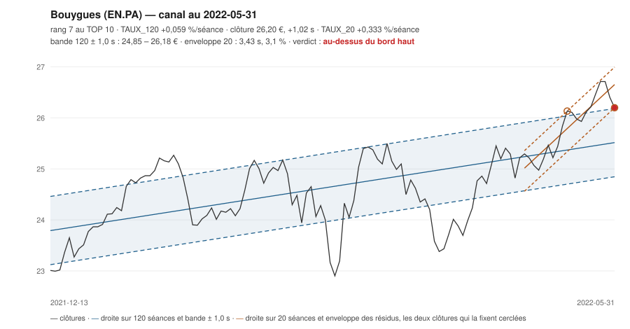

> Rang 7 · TAUX_120 +0,059 %/séance · clôture 26,20 € · bande 24,85 – 26,18 € · écart +1,02 s · TAUX_20 +0,333 %/séance · enveloppe 20 : 3,43 s, 3,1 % · **au-dessus du bord haut**

- Clôture 26,20 €, +1,02 s, soit 0,02 € au-dessus du bord haut d'une bande étroite de 24,85 à 26,18 €.
- Pentes concordantes à la hausse : TAUX_120 +0,059 %/séance, rang 7 sur les 8 valeurs du TOP 10 ; TAUX_20 +0,333 %/séance depuis 27 séances.
- Enveloppe de 3,43 s (3,1 % de E_20). Son bas est la clôture du jour, son haut celle du 17 mai (26,13 €).
- Au-dessus du bord haut depuis 12 séances. L'écart est redescendu de +2,01 s le 26 mai à +1,02 s en trois séances.
- Verdict : au-dessus du bord haut.

### 8. `BN.PA` — Danone

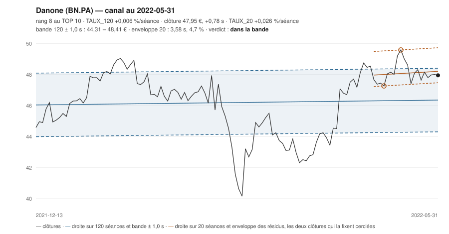

> Rang 8 · TAUX_120 +0,006 %/séance · clôture 47,95 € · bande 44,31 – 48,41 € · écart +0,78 s · TAUX_20 +0,026 %/séance · enveloppe 20 : 3,58 s, 4,7 % · **dans la bande**

- Clôture 47,95 € à +0,78 s, bande de 44,31 à 48,41 €.
- Deux pentes positives mais presque nulles : TAUX_120 +0,006 %/séance, rang 8, dernière place d'un TOP 10 réduit à 8 valeurs, où elle est entrée il y a 10 séances ; TAUX_20 +0,026 %/séance.
- Enveloppe de 3,58 s. Bas le 9 mai (47,27 €), haut le 16 mai (49,59 €).
- Douze clôtures au-dessus du bord haut en 20 séances, au plus +1,89 s le 16 mai. Dans la bande depuis 6 séances, à +0,8 s environ sur les cinq dernières.
- Verdict : dans la bande.

### `DG.PA` — Vinci

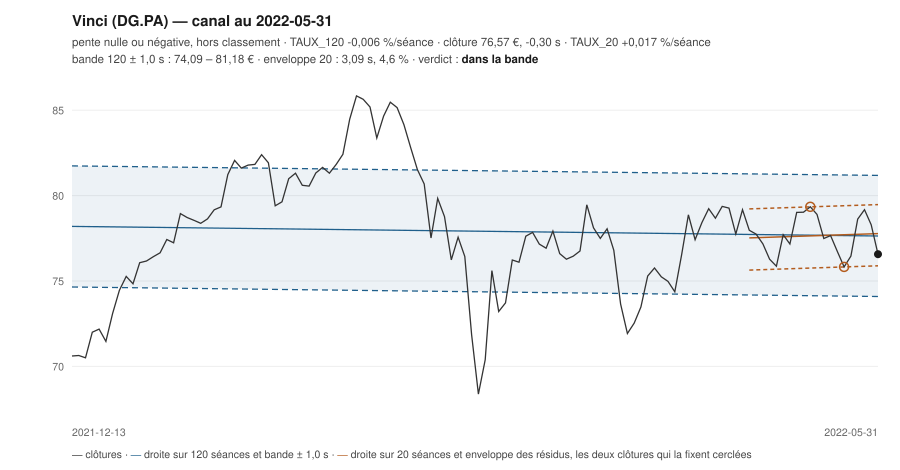

> Hors classement · TAUX_120 -0,006 %/séance · clôture 76,57 € · bande 74,09 – 81,18 € · écart -0,30 s · TAUX_20 +0,017 %/séance · enveloppe 20 : 3,09 s, 4,6 % · **dans la bande**

- Clôture 76,57 € à −0,30 s, bande de 74,09 à 81,18 €.
- Deux pentes presque nulles, de signes opposés. TAUX_120 est passé en négatif, −0,006 %/séance : la valeur est hors du TOP 10 depuis 2 séances, alors qu'elle était au rang 9 vingt séances plus tôt. TAUX_20 est à +0,017 %/séance.
- Enveloppe étroite, 3,09 s. Haut le 17 mai (79,34 €), bas le 24 mai (75,82 €).
- Dans la bande depuis 35 séances, avec un écart entre −0,72 et +0,36 s sur les 20 dernières.
- Verdict : dans la bande.

### `MT.AS` — ArcelorMittal

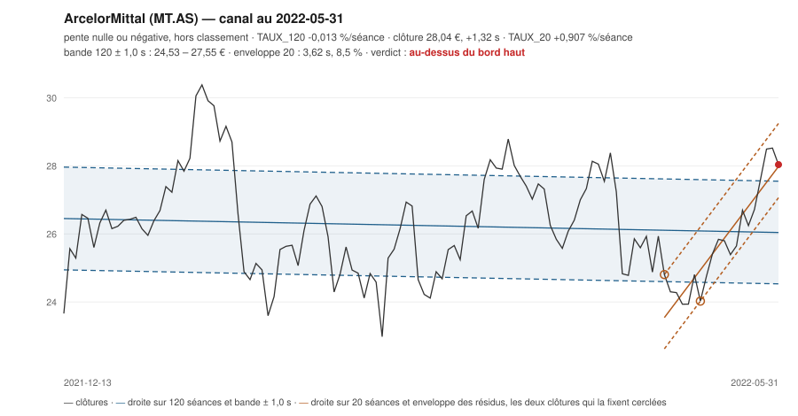

> Hors classement · TAUX_120 -0,013 %/séance · clôture 28,04 € · bande 24,53 – 27,55 € · écart +1,32 s · TAUX_20 +0,907 %/séance · enveloppe 20 : 3,62 s, 8,5 % · **au-dessus du bord haut**

- Clôture 28,04 €, +1,32 s, au-dessus d'une bande de 24,53 à 27,55 €.
- Pentes discordantes. TAUX_120 est passé en négatif, −0,013 %/séance : la valeur est hors du TOP 10 depuis 7 séances, alors qu'elle y était au rang 6 vingt séances plus tôt. TAUX_20 est à +0,907 %/séance.
- Enveloppe de 3,62 s. Haut à la première séance, le 4 mai (24,81 €), bas le 12 mai (24,03 €).
- La bande a été traversée de bas en haut en 10 séances. Six clôtures sous le bord bas, jusqu'à −1,61 s le 9 mai et pour la dernière fois le 12 mai. Au-dessus du bord haut depuis le 26 mai.
- Verdict : au-dessus du bord haut.

### `VIV.PA` — Vivendi

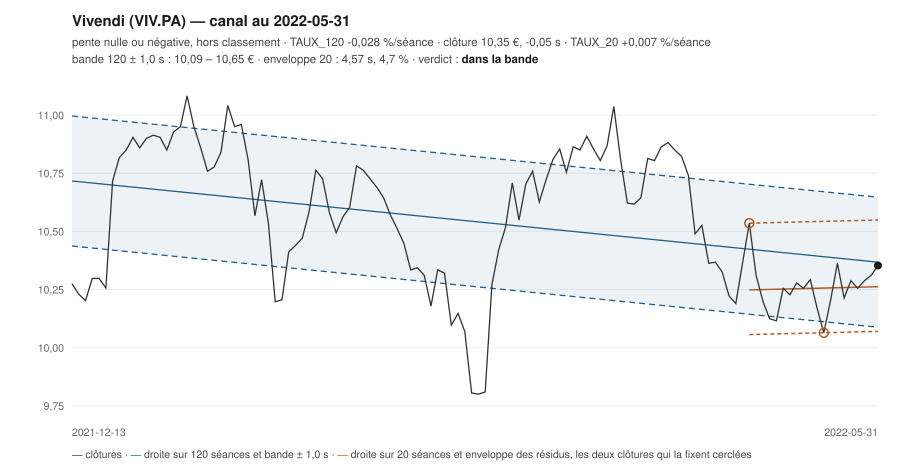

> Hors classement · TAUX_120 -0,028 %/séance · clôture 10,35 € · bande 10,09 – 10,65 € · écart -0,05 s · TAUX_20 +0,007 %/séance · enveloppe 20 : 4,57 s, 4,7 % · **dans la bande**

- Clôture 10,35 € sur la droite longue (−0,05 s), bande étroite de 10,09 à 10,65 €.
- Pentes toutes deux proches de zéro. TAUX_120 est à −0,028 %/séance : la valeur est hors du TOP 10 depuis 14 séances, alors qu'elle était au rang 10 vingt séances plus tôt. TAUX_20 est à +0,007 %/séance, positif de ce jour.
- Enveloppe de 4,57 s, nettement plus large que les ~3,7 s attendues. Haut à la première séance, le 4 mai (10,54 €), bas le 19 mai (10,06 €).
- Huit clôtures sous le bord bas en 20 séances, jusqu'à −1,60 s le 9 mai. Dans la bande depuis 8 séances, l'écart est remonté jusqu'à −0,05 s, son plus haut de la période.
- Verdict : dans la bande.

### `AIR.PA` — Airbus

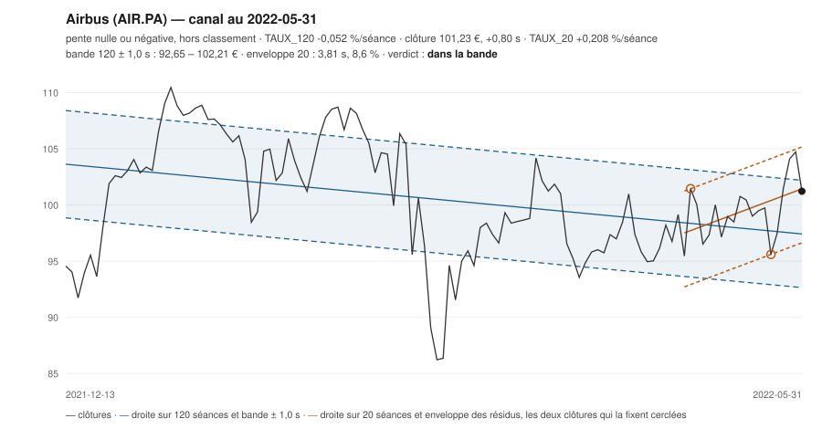

> Hors classement · TAUX_120 -0,052 %/séance · clôture 101,23 € · bande 92,65 – 102,21 € · écart +0,80 s · TAUX_20 +0,208 %/séance · enveloppe 20 : 3,81 s, 8,6 % · **dans la bande**

- Clôture 101,23 € à +0,80 s, bande de 92,65 à 102,21 €.
- Pentes discordantes : TAUX_120 −0,052 %/séance, hors classement ; TAUX_20 +0,208 %/séance, positif depuis 21 séances.
- Enveloppe de 3,81 s. Haut le 5 mai (101,45 €), bas récent le 24 mai (95,61 €).
- Au-dessus du bord haut le 27 et le 30 mai (+1,51 s), après −0,4 s le 24 mai. Revenue dans la bande aujourd'hui.
- Verdict : dans la bande.

### `CS.PA` — AXA

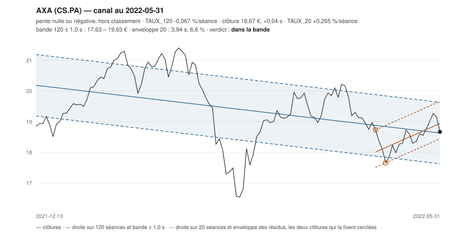

> Hors classement · TAUX_120 -0,067 %/séance · clôture 18,67 € · bande 17,63 – 19,63 € · écart +0,04 s · TAUX_20 +0,265 %/séance · enveloppe 20 : 3,94 s, 6,6 % · **dans la bande**

- Clôture 18,67 € à +0,04 s, bande de 17,63 à 19,63 €.
- Pentes discordantes. TAUX_120 est à −0,067 %/séance : la valeur est hors du TOP 10 depuis 26 séances. TAUX_20 est à +0,265 %/séance depuis 4 séances.
- Enveloppe de 3,94 s, un peu plus large que l'attendu. Deux bornes anciennes : haut le 4 mai (18,73 €), bas le 9 mai (17,66 €).
- Quatre clôtures sous le bord bas en 20 séances, jusqu'à −1,50 s le 9 mai. Dans la bande depuis 13 séances.
- Verdict : dans la bande.

### `ENGI.PA` — Engie

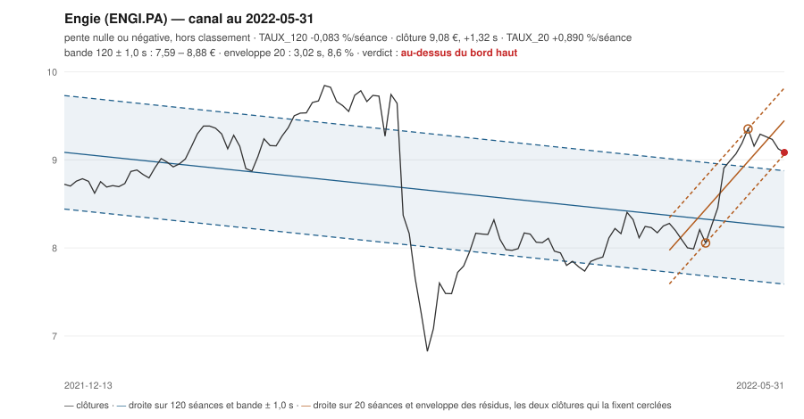

> Hors classement · TAUX_120 -0,083 %/séance · clôture 9,08 € · bande 7,59 – 8,88 € · écart +1,32 s · TAUX_20 +0,890 %/séance · enveloppe 20 : 3,02 s, 8,6 % · **au-dessus du bord haut**

- Clôture 9,08 €, +1,32 s, au-dessus d'une bande de 7,59 à 8,88 €.
- Pentes discordantes : TAUX_120 −0,083 %/séance, hors classement ; TAUX_20 +0,890 %/séance, positif depuis 27 séances.
- Enveloppe de 3,02 s, étroite. Bas le 12 mai (8,06 €), haut le 23 mai (9,35 €).
- Au-dessus du bord haut depuis 11 séances, avec un maximum de +2,06 s le 23 mai ; l'écart était de +0,22 s vingt séances plus tôt.
- Verdict : au-dessus du bord haut.

### `SAF.PA` — Safran

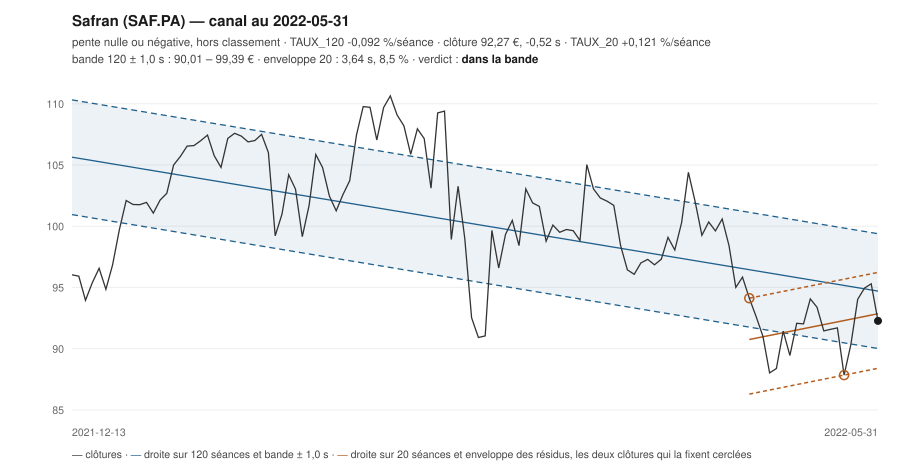

> Hors classement · TAUX_120 -0,092 %/séance · clôture 92,27 € · bande 90,01 – 99,39 € · écart -0,52 s · TAUX_20 +0,121 %/séance · enveloppe 20 : 3,64 s, 8,5 % · **dans la bande**

- Clôture 92,27 € à −0,52 s, bande de 90,01 à 99,39 €.
- Pentes discordantes. TAUX_120 est à −0,092 %/séance : la valeur est hors du TOP 10 depuis 333 séances. TAUX_20 est à +0,121 %/séance depuis 2 séances.
- Enveloppe de 3,64 s. Haut à la première séance, le 4 mai (94,12 €), bas le 24 mai (87,84 €).
- Treize des 20 dernières clôtures étaient sous le bord bas, jusqu'à −2,37 s le 9 mai. Dans la bande depuis 4 séances.
- Verdict : dans la bande.

### `RI.PA` — Pernod Ricard

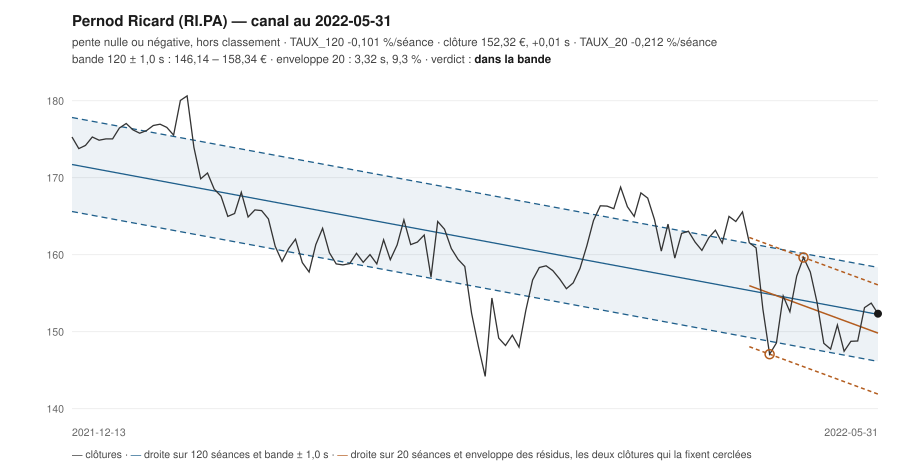

> Hors classement · TAUX_120 -0,101 %/séance · clôture 152,32 € · bande 146,14 – 158,34 € · écart +0,01 s · TAUX_20 -0,212 %/séance · enveloppe 20 : 3,32 s, 9,3 % · **dans la bande**

- Clôture 152,32 € sur la droite longue (+0,01 s), bande de 146,14 à 158,34 €.
- Deux pentes négatives : TAUX_120 −0,101 %/séance, hors classement, et TAUX_20 −0,212 %/séance, depuis 27 séances.
- Enveloppe de 3,32 s. Bas le 9 mai (147,07 €), haut le 16 mai (159,63 €).
- L'écart était à +1,59 s le 3 mai et à −1,40 s le 9 mai. Dans la bande depuis 15 séances.
- Verdict : dans la bande.

### `PUB.PA` — Publicis

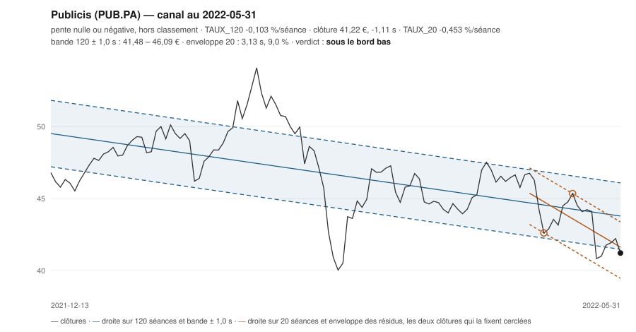

> Hors classement · TAUX_120 -0,103 %/séance · clôture 41,22 € · bande 41,48 – 46,09 € · écart -1,11 s · TAUX_20 -0,453 %/séance · enveloppe 20 : 3,13 s, 9,0 % · **sous le bord bas**

- Clôture 41,22 €, −1,11 s, sous une bande de 41,48 à 46,09 €.
- Deux pentes négatives : TAUX_120 −0,103 %/séance, hors classement, TAUX_20 −0,453 %/séance depuis 16 séances.
- Enveloppe de 3,13 s. Bas le 9 mai (42,61 €), haut le 17 mai (45,35 €).
- Première clôture sous le bord bas depuis le 24 mai, où l'écart atteignait −1,65 s ; hier, il était de −0,75 s. Six clôtures sous le bord bas en 20 séances.
- Verdict : sous le bord bas, sans être candidate. La pente longue est négative, donc la valeur est hors TOP 10, et la pente courte l'est aussi.

### `CAP.PA` — Capgemini

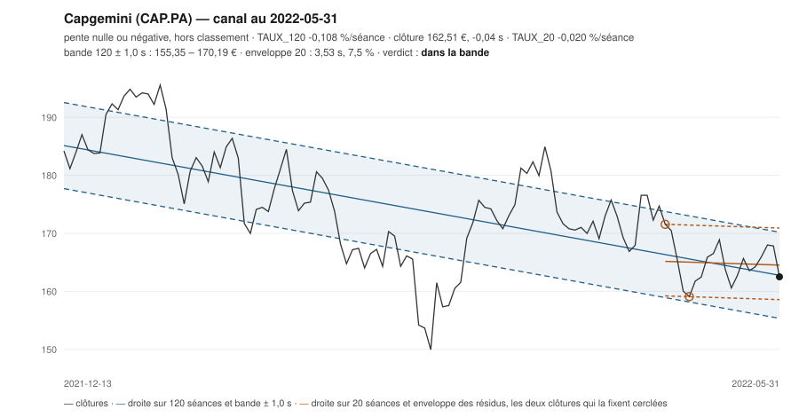

> Hors classement · TAUX_120 -0,108 %/séance · clôture 162,51 € · bande 155,35 – 170,19 € · écart -0,04 s · TAUX_20 -0,020 %/séance · enveloppe 20 : 3,53 s, 7,5 % · **dans la bande**

- Clôture 162,51 € sur la droite longue (−0,04 s), bande de 155,35 à 170,19 €.
- Deux pentes négatives, la courte presque plate : TAUX_120 −0,108 %/séance, hors classement, TAUX_20 −0,020 %/séance.
- Enveloppe de 3,53 s, fixée en début de fenêtre : haut le 4 mai (171,56 €), bas le 10 mai (159,09 €).
- Dans la bande depuis 20 séances, après +1,13 s le 3 mai. Écart entre −0,88 et +0,70 s depuis.
- Verdict : dans la bande.

### `TEP.PA` — Teleperformance

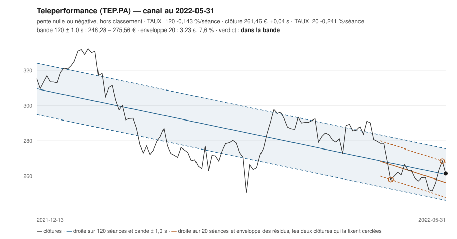

> Hors classement · TAUX_120 -0,143 %/séance · clôture 261,46 € · bande 246,28 – 275,56 € · écart +0,04 s · TAUX_20 -0,241 %/séance · enveloppe 20 : 3,23 s, 7,6 % · **dans la bande**

- Clôture 261,46 € sur la droite longue (+0,04 s), bande de 246,28 à 275,56 €.
- Pentes concordantes à la baisse : TAUX_120 −0,143 %/séance, hors classement, TAUX_20 −0,241 %/séance depuis 18 séances.
- Enveloppe de 3,23 s. Bas le 9 mai (258,07 €), haut le 30 mai (268,58 €).
- Dans la bande depuis 22 séances, avec un écart entre −0,91 et +0,50 s sur les 20 dernières.
- Verdict : dans la bande.

### `ERF.PA` — Eurofins Scientific

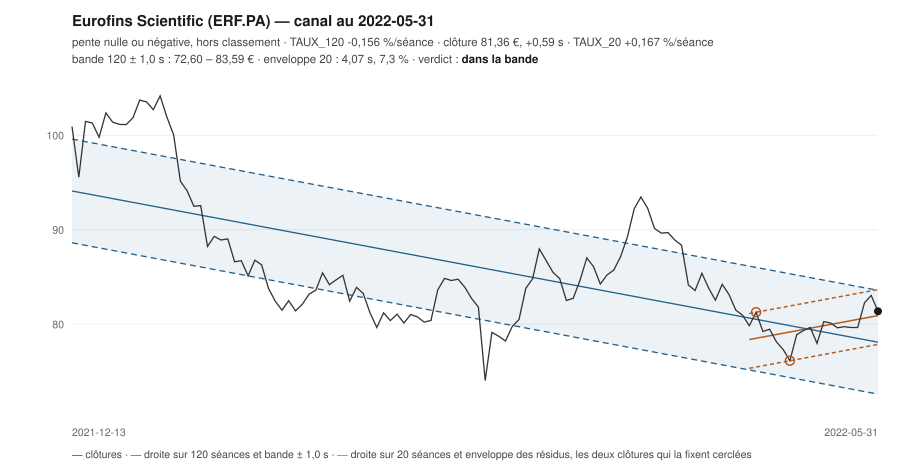

> Hors classement · TAUX_120 -0,156 %/séance · clôture 81,36 € · bande 72,60 – 83,59 € · écart +0,59 s · TAUX_20 +0,167 %/séance · enveloppe 20 : 4,07 s, 7,3 % · **dans la bande**

- Clôture 81,36 € à +0,59 s, bande de 72,60 à 83,59 €.
- Pentes discordantes : TAUX_120 −0,156 %/séance, hors classement ; TAUX_20 +0,167 %/séance, depuis 3 séances.
- Enveloppe de 4,07 s, plus large que l'attendu. Deux bornes anciennes : haut le 5 mai (81,27 €), bas le 12 mai (76,13 €).
- Dans la bande depuis 29 séances, avec un écart entre −0,38 et +0,91 s sur les 20 dernières.
- Verdict : dans la bande.

### `SGO.PA` — Saint-Gobain

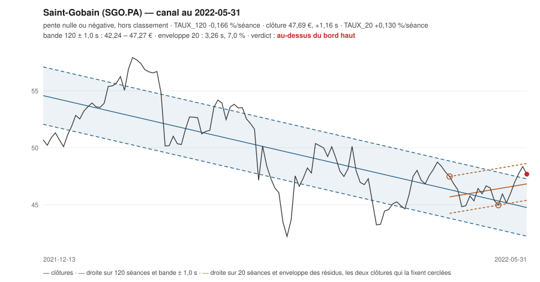

> Hors classement · TAUX_120 -0,166 %/séance · clôture 47,69 € · bande 42,24 – 47,27 € · écart +1,16 s · TAUX_20 +0,130 %/séance · enveloppe 20 : 3,26 s, 7,0 % · **au-dessus du bord haut**

- Clôture 47,69 €, +1,16 s, au-dessus d'une bande de 42,24 à 47,27 €.
- Pentes discordantes : TAUX_120 −0,166 %/séance, hors classement ; TAUX_20 +0,130 %/séance, depuis 2 séances.
- Enveloppe de 3,26 s. Haut à la première séance, le 4 mai (47,48 €), bas le 20 mai (44,97 €).
- Au-dessus du bord haut depuis 3 séances, jusqu'à +1,42 s le 30 mai.
- Verdict : au-dessus du bord haut.

### `EL.PA` — EssilorLuxottica

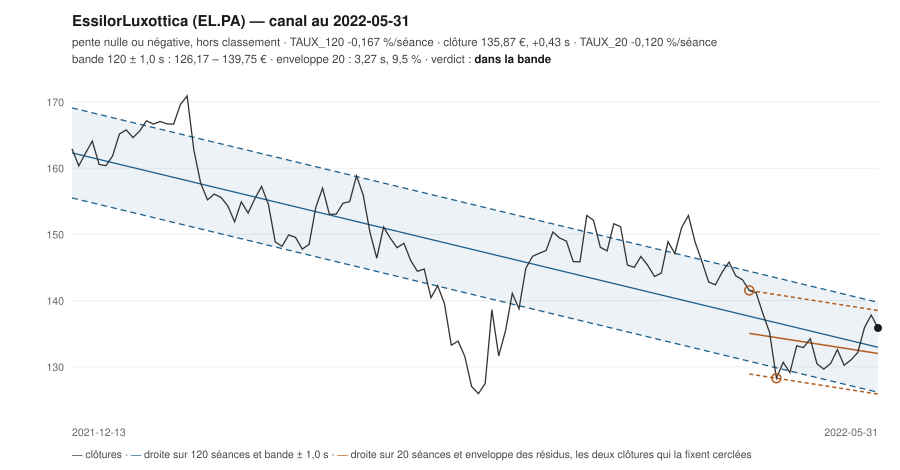

> Hors classement · TAUX_120 -0,167 %/séance · clôture 135,87 € · bande 126,17 – 139,75 € · écart +0,43 s · TAUX_20 -0,120 %/séance · enveloppe 20 : 3,27 s, 9,5 % · **dans la bande**

- Clôture 135,87 € à +0,43 s, bande de 126,17 à 139,75 €.
- Deux pentes négatives : TAUX_120 −0,167 %/séance, hors classement, et TAUX_20 −0,120 %/séance, depuis 34 séances.
- Enveloppe de 3,27 s, fixée en début de fenêtre : haut le 4 mai (141,55 €), bas le 10 mai (128,29 €).
- Trois clôtures sous le bord bas, jusqu'à −1,44 s le 10 mai. Dans la bande depuis 13 séances, l'écart est remonté jusqu'à +0,70 s le 30 mai.
- Verdict : dans la bande.

### `STMPA.PA` — STMicroelectronics

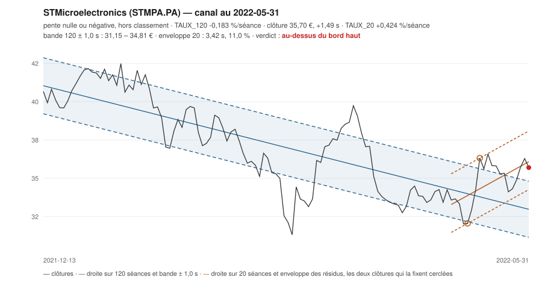

> Hors classement · TAUX_120 -0,183 %/séance · clôture 35,70 € · bande 31,15 – 34,81 € · écart +1,49 s · TAUX_20 +0,424 %/séance · enveloppe 20 : 3,42 s, 11,0 % · **au-dessus du bord haut**

- Clôture 35,70 €, +1,49 s, au-dessus d'une bande de 31,15 à 34,81 €.
- Pentes discordantes : TAUX_120 −0,183 %/séance, hors classement ; TAUX_20 +0,424 %/séance depuis 13 séances.
- Enveloppe de 3,42 s (11,0 % de E_20), fixée en trois séances : 32,05 € le 10 mai, 36,32 € le 13 mai.
- Onze clôtures au-dessus du bord haut en 20 séances, jusqu'à +2,11 s le 17 mai. Après un passage dans la bande, au-dessus de nouveau depuis 4 séances.
- Verdict : au-dessus du bord haut.

### `MC.PA` — LVMH

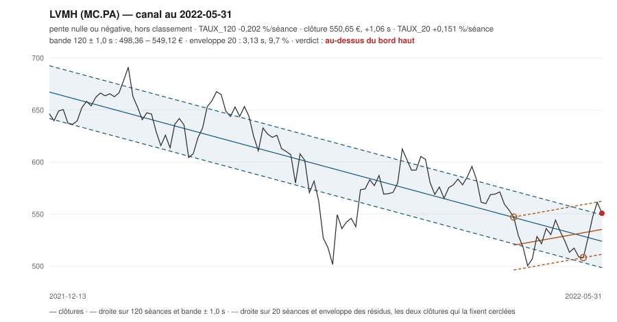

> Hors classement · TAUX_120 -0,202 %/séance · clôture 550,65 € · bande 498,36 – 549,12 € · écart +1,06 s · TAUX_20 +0,151 %/séance · enveloppe 20 : 3,13 s, 9,7 % · **au-dessus du bord haut**

- Clôture 550,65 €, +1,06 s, au-dessus d'une bande de 498,36 à 549,12 €.
- Pentes discordantes : TAUX_120 −0,202 %/séance, hors classement ; TAUX_20 +0,151 %/séance, depuis 2 séances.
- Enveloppe de 3,13 s. Haut à la première séance, le 4 mai (547,06 €), bas le 25 mai (508,05 €).
- La bande a été traversée de bas en haut en 14 séances : −1,96 s le 9 mai, dernière clôture sous le bord bas le 10 mai, au-dessus du bord haut depuis le 30 mai.
- Verdict : au-dessus du bord haut.

### `BNP.PA` — BNP Paribas

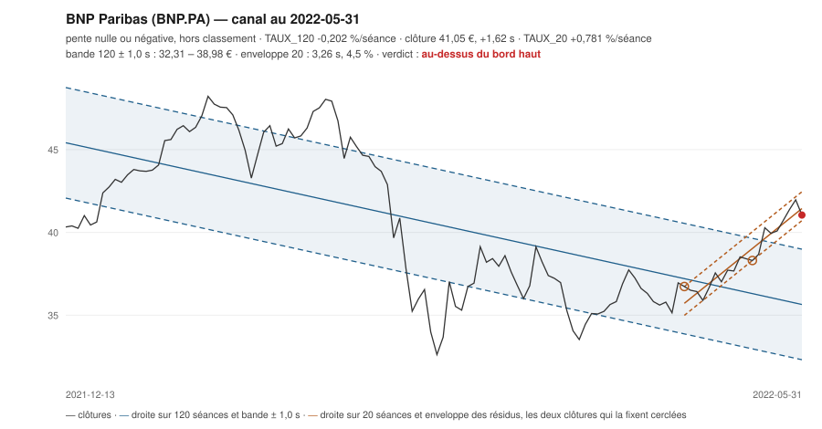

> Hors classement · TAUX_120 -0,202 %/séance · clôture 41,05 € · bande 32,31 – 38,98 € · écart +1,62 s · TAUX_20 +0,781 %/séance · enveloppe 20 : 3,26 s, 4,5 % · **au-dessus du bord haut**

- Clôture 41,05 €, +1,62 s, au-dessus d'une bande de 32,31 à 38,98 €.
- Pentes discordantes : TAUX_120 −0,202 %/séance, hors classement ; TAUX_20 +0,781 %/séance, positif depuis 23 séances.
- Enveloppe de 3,26 s (4,5 % de E_20). Haut à la première séance, le 4 mai (36,73 €), bas le 19 mai (38,30 €).
- Au-dessus du bord haut depuis 7 séances, jusqu'à +1,91 s le 30 mai. L'écart était de +0,07 s vingt séances plus tôt.
- Verdict : au-dessus du bord haut.

### `VIE.PA` — Veolia

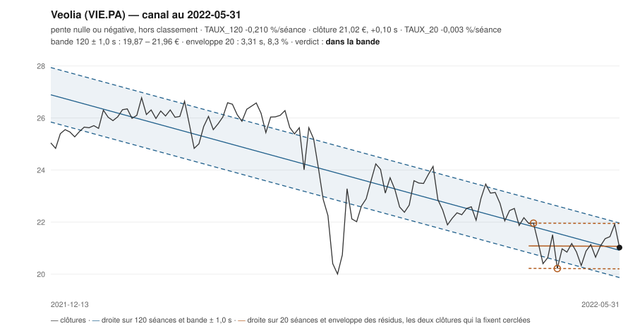

> Hors classement · TAUX_120 -0,210 %/séance · clôture 21,02 € · bande 19,87 – 21,96 € · écart +0,10 s · TAUX_20 -0,003 %/séance · enveloppe 20 : 3,31 s, 8,3 % · **dans la bande**

- Clôture 21,02 € à +0,10 s, bande de 19,87 à 21,96 €.
- Deux pentes négatives, la courte presque nulle : TAUX_120 −0,210 %/séance, hors classement, et TAUX_20 −0,003 %/séance, négatif depuis 37 séances.
- Enveloppe de 3,31 s, fixée en début de fenêtre : haut le 5 mai (21,96 €), bas le 12 mai (20,21 €).
- Cinq clôtures sous le bord bas, jusqu'à −1,57 s le 9 mai. Dans la bande depuis 8 séances.
- Verdict : dans la bande.

### `OR.PA` — L'Oréal

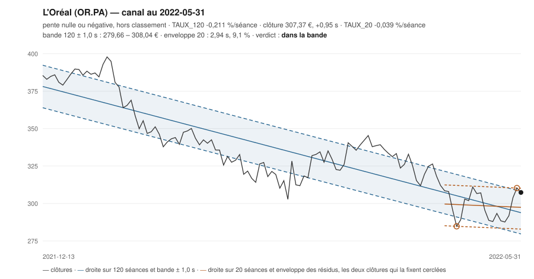

> Hors classement · TAUX_120 -0,211 %/séance · clôture 307,37 € · bande 279,66 – 308,04 € · écart +0,95 s · TAUX_20 -0,039 %/séance · enveloppe 20 : 2,94 s, 9,1 % · **dans la bande**

- Clôture 307,37 € à +0,95 s, à 0,67 € sous le bord haut d'une bande de 279,66 à 308,04 €.
- Deux pentes négatives : TAUX_120 −0,211 %/séance, hors classement, et TAUX_20 −0,039 %/séance, depuis 28 séances.
- Enveloppe étroite, 2,94 s. Bas le 9 mai (284,77 €), haut récent le 30 mai (310,31 €).
- L'écart est monté de −1,54 s le 9 mai à +1,16 s le 30 mai, seule clôture au-dessus du bord haut de la période. La clôture du jour revient dans la bande.
- Verdict : dans la bande.

### `LR.PA` — Legrand

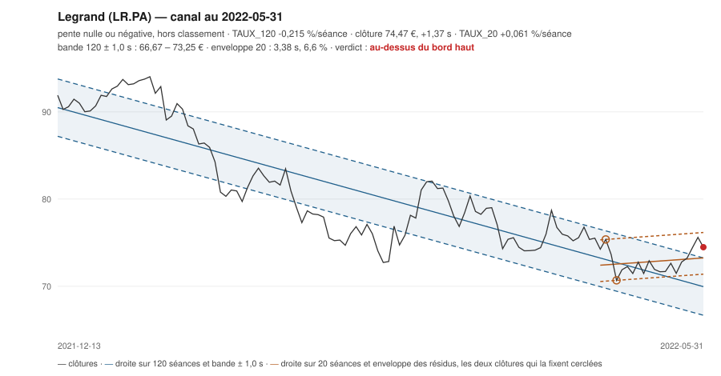

> Hors classement · TAUX_120 -0,215 %/séance · clôture 74,47 € · bande 66,67 – 73,25 € · écart +1,37 s · TAUX_20 +0,061 %/séance · enveloppe 20 : 3,38 s, 6,6 % · **au-dessus du bord haut**

- Clôture 74,47 €, +1,37 s, au-dessus d'une bande de 66,67 à 73,25 €.
- Pentes discordantes : TAUX_120 −0,215 %/séance, hors classement ; TAUX_20 +0,061 %/séance, positif de ce jour seulement.
- Enveloppe de 3,38 s, fixée tôt dans la fenêtre : haut le 5 mai (75,37 €), bas le 9 mai (70,68 €).
- Au-dessus du bord haut depuis 4 séances, jusqu'à +1,73 s le 30 mai.
- Verdict : au-dessus du bord haut.

### `STLAP.PA` — Stellantis

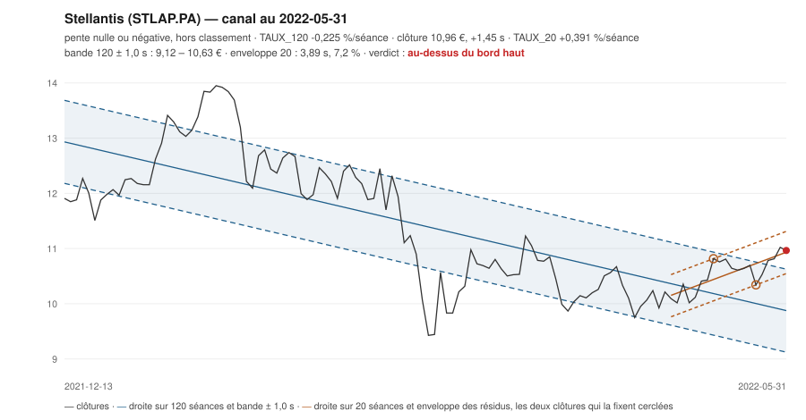

> Hors classement · TAUX_120 -0,225 %/séance · clôture 10,96 € · bande 9,12 – 10,63 € · écart +1,45 s · TAUX_20 +0,391 %/séance · enveloppe 20 : 3,89 s, 7,2 % · **au-dessus du bord haut**

- Clôture 10,96 €, +1,45 s, au-dessus d'une bande de 9,12 à 10,63 €.
- Pentes discordantes : TAUX_120 −0,225 %/séance, hors classement ; TAUX_20 +0,391 %/séance depuis 13 séances.
- Enveloppe de 3,89 s. Haut le 13 mai (10,82 €), bas le 24 mai (10,34 €).
- Au-dessus du bord haut depuis 4 séances, jusqu'à +1,52 s le 30 mai.
- Verdict : au-dessus du bord haut.

### `DSY.PA` — Dassault Systèmes

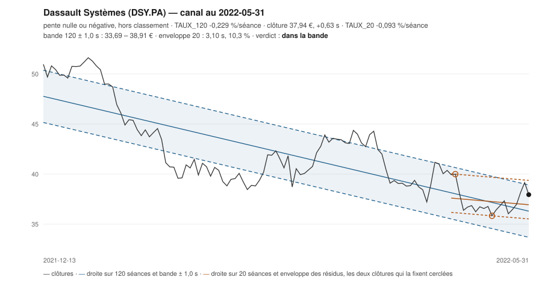

> Hors classement · TAUX_120 -0,229 %/séance · clôture 37,94 € · bande 33,69 – 38,91 € · écart +0,63 s · TAUX_20 -0,093 %/séance · enveloppe 20 : 3,10 s, 10,3 % · **dans la bande**

- Clôture 37,94 € à +0,63 s, bande de 33,69 à 38,91 €.
- Pentes concordantes à la baisse : TAUX_120 −0,229 %/séance, hors classement, et TAUX_20 −0,093 %/séance, négatif depuis 35 séances.
- Enveloppe de 3,10 s. Haut le 5 mai (39,99 €), bas le 18 mai (35,83 €).
- Une seule clôture au-dessus du bord haut en 20 séances, le 30 mai à +1,09 s. Revenue dans la bande aujourd'hui.
- Verdict : dans la bande.

### `SU.PA` — Schneider Electric

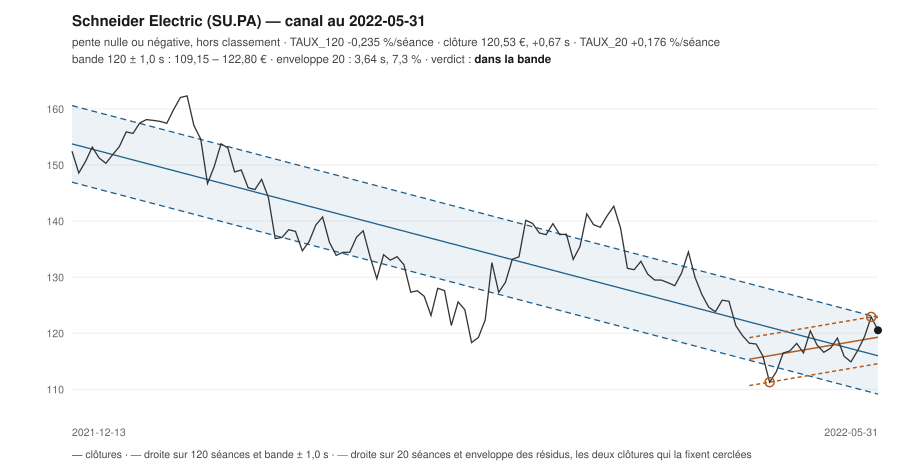

> Hors classement · TAUX_120 -0,235 %/séance · clôture 120,53 € · bande 109,15 – 122,80 € · écart +0,67 s · TAUX_20 +0,176 %/séance · enveloppe 20 : 3,64 s, 7,3 % · **dans la bande**

- Clôture 120,53 € à +0,67 s, bande de 109,15 à 122,80 €.
- Pentes discordantes : TAUX_120 −0,235 %/séance, hors classement ; TAUX_20 +0,176 %/séance, depuis 2 séances.
- Enveloppe de 3,64 s. Bas le 9 mai (111,28 €), haut récent le 30 mai (122,91 €).
- Trois clôtures sous le bord bas, jusqu'à −1,64 s le 9 mai. Dans la bande depuis 15 séances, avec un écart monté jusqu'à +0,99 s le 30 mai.
- Verdict : dans la bande.

### `ML.PA` — Michelin

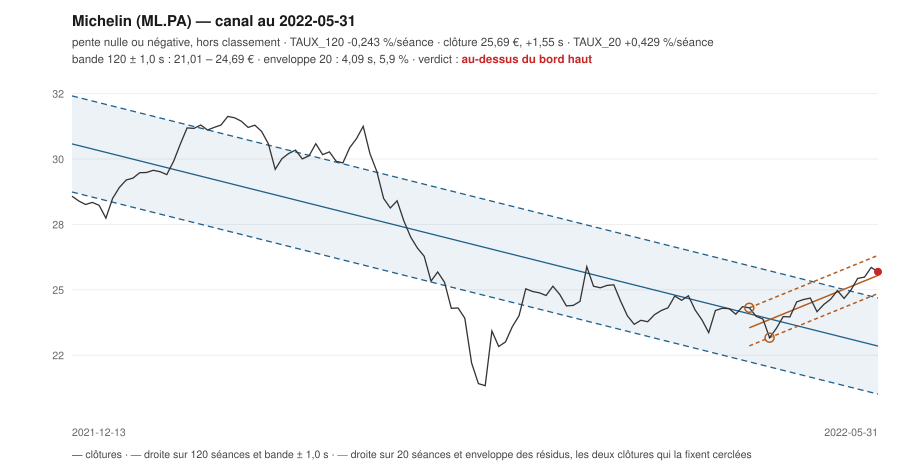

> Hors classement · TAUX_120 -0,243 %/séance · clôture 25,69 € · bande 21,01 – 24,69 € · écart +1,55 s · TAUX_20 +0,429 %/séance · enveloppe 20 : 4,09 s, 5,9 % · **au-dessus du bord haut**

- Clôture 25,69 €, +1,55 s, au-dessus d'une bande de 21,01 à 24,69 €.
- Pentes discordantes : TAUX_120 −0,243 %/séance, hors classement ; TAUX_20 +0,429 %/séance depuis 10 séances.
- Enveloppe de 4,09 s, plus large que l'attendu. Deux bornes anciennes : haut le 4 mai (24,31 €), bas le 9 mai (23,17 €).
- Au-dessus du bord haut depuis 5 séances, jusqu'à +1,65 s le 30 mai.
- Verdict : au-dessus du bord haut.

### `ACA.PA` — Crédit Agricole

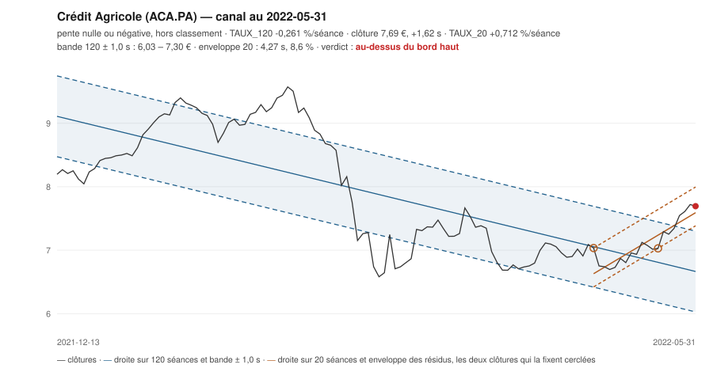

> Hors classement · TAUX_120 -0,261 %/séance · clôture 7,69 € · bande 6,03 – 7,30 € · écart +1,62 s · TAUX_20 +0,712 %/séance · enveloppe 20 : 4,27 s, 8,6 % · **au-dessus du bord haut**

- Clôture 7,69 €, +1,62 s, au-dessus d'une bande de 6,03 à 7,30 €.
- Pentes discordantes : canal long en baisse, TAUX_120 −0,261 %/séance, hors classement ; canal court en forte hausse, TAUX_20 +0,712 %/séance depuis 8 séances.
- Enveloppe de 4,27 s, plus large que les ~3,7 s attendues. Ses deux bornes sont deux clôtures identiques, 7,03 €, l'une à la première séance (4 mai, haut) et l'autre le 20 mai (bas) : c'est la droite courte qui a monté entre les deux.
- Au-dessus du bord haut depuis 5 séances, jusqu'à +1,66 s le 30 mai. Vingt séances plus tôt, l'écart était nul.
- Verdict : au-dessus du bord haut.

### `WLN.PA` — Worldline

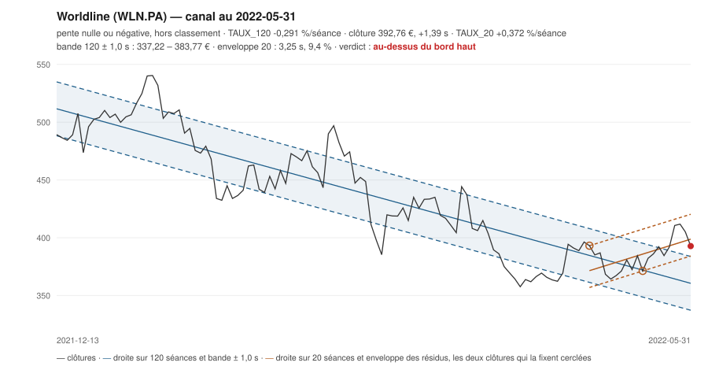

> Hors classement · TAUX_120 -0,291 %/séance · clôture 392,76 € · bande 337,22 – 383,77 € · écart +1,39 s · TAUX_20 +0,372 %/séance · enveloppe 20 : 3,25 s, 9,4 % · **au-dessus du bord haut**

- Clôture 392,76 €, +1,39 s, au-dessus d'une bande de 337,22 à 383,77 €.
- Pentes discordantes. TAUX_120 est à −0,291 %/séance : la valeur n'a été classée à aucune des 364 séances évaluées. TAUX_20 est à +0,372 %/séance depuis 4 séances.
- Enveloppe de 3,25 s. Haut à la première séance, le 4 mai (393,07 €), bas le 18 mai (371,26 €).
- Au-dessus du bord haut depuis 8 séances, jusqu'à +2,24 s le 26 mai. La dernière clôture sous le bord bas date du 26 avril.
- Verdict : au-dessus du bord haut.

### `RMS.PA` — Hermès International

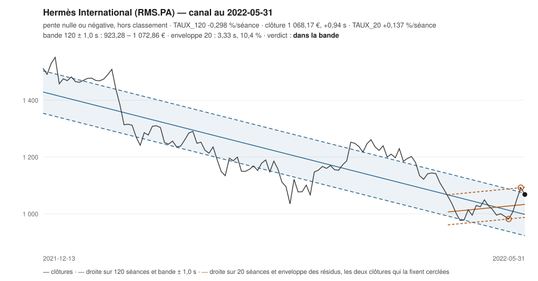

> Hors classement · TAUX_120 -0,298 %/séance · clôture 1 068,17 € · bande 923,28 – 1 072,86 € · écart +0,94 s · TAUX_20 +0,137 %/séance · enveloppe 20 : 3,33 s, 10,4 % · **dans la bande**

- Clôture 1 068,17 € à +0,94 s, bande de 923,28 à 1 072,86 €.
- Pentes discordantes : TAUX_120 −0,298 %/séance, hors classement ; TAUX_20 +0,137 %/séance, positif de ce jour.
- Enveloppe de 3,33 s, fixée par deux clôtures récentes : bas le 25 mai (982,04 €), haut le 30 mai (1 092,23 €).
- Au-dessus du bord haut le 30 mai seulement (+1,26 s). Revenue dans la bande aujourd'hui.
- Verdict : dans la bande.

### `GLE.PA` — Société Générale

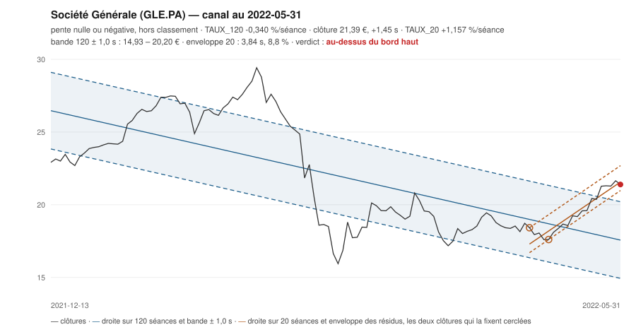

> Hors classement · TAUX_120 -0,340 %/séance · clôture 21,39 € · bande 14,93 – 20,20 € · écart +1,45 s · TAUX_20 +1,157 %/séance · enveloppe 20 : 3,84 s, 8,8 % · **au-dessus du bord haut**

- Clôture 21,39 €, +1,45 s, au-dessus d'une bande de 14,93 à 20,20 €.
- Pentes opposées : canal long en baisse marquée, TAUX_120 −0,340 %/séance, hors classement ; canal court en hausse plus marquée encore, TAUX_20 +1,157 %/séance.
- Enveloppe de 3,84 s, fixée en début de fenêtre : haut le 4 mai (18,41 €), bas le 10 mai (17,60 €).
- Au-dessus du bord haut depuis 7 séances, jusqu'à +1,55 s le 30 mai. L'écart était de −0,15 s vingt séances plus tôt.
- Verdict : au-dessus du bord haut.

### `KER.PA` — Kering

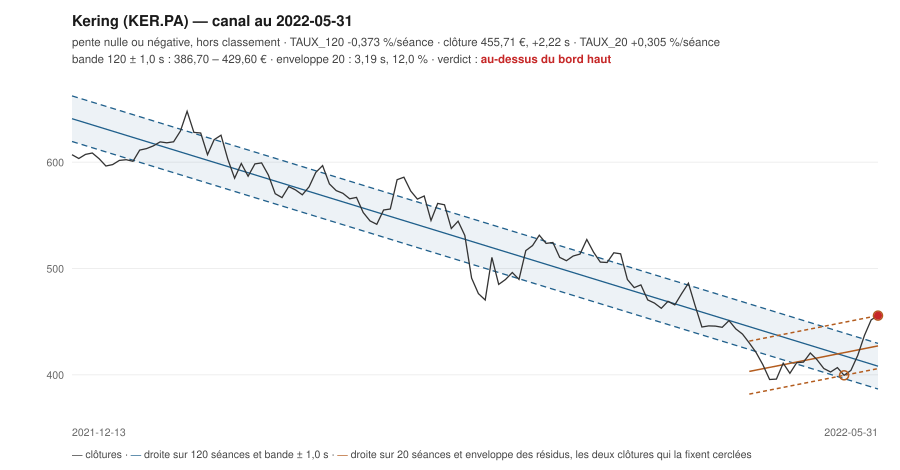

> Hors classement · TAUX_120 -0,373 %/séance · clôture 455,71 € · bande 386,70 – 429,60 € · écart +2,22 s · TAUX_20 +0,305 %/séance · enveloppe 20 : 3,19 s, 12,0 % · **au-dessus du bord haut**

- Clôture 455,71 €, +2,22 s, au-dessus d'une bande de 386,70 à 429,60 €.
- Pentes discordantes : TAUX_120 −0,373 %/séance, hors classement ; TAUX_20 +0,305 %/séance, positif depuis 2 séances.
- Enveloppe de 3,19 s (12,0 % de E_20). Son haut est la clôture du jour, son bas celle du 24 mai (399,56 €).
- La bande a été traversée de bas en haut en 10 séances. L'écart était de −2,45 s le 9 mai, la dernière clôture sous le bord bas date du 13 mai, et la valeur est au-dessus du bord haut depuis le 27 mai.
- Verdict : au-dessus du bord haut.

### `RNO.PA` — Renault

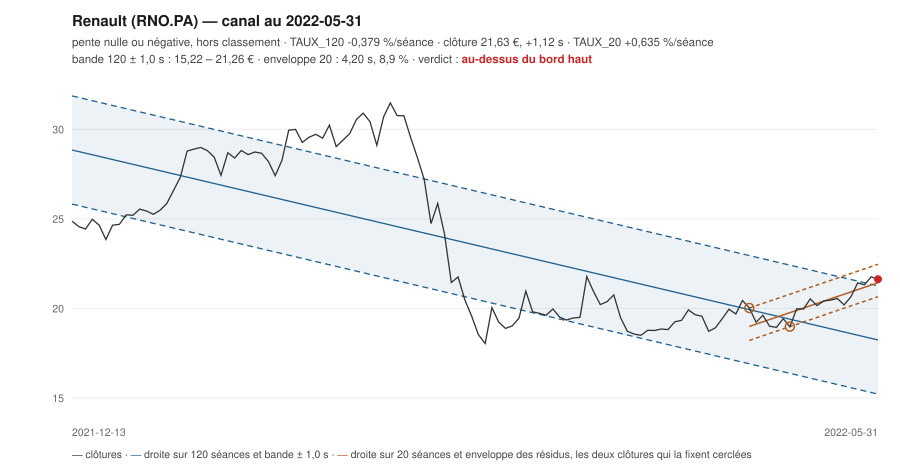

> Hors classement · TAUX_120 -0,379 %/séance · clôture 21,63 € · bande 15,22 – 21,26 € · écart +1,12 s · TAUX_20 +0,635 %/séance · enveloppe 20 : 4,20 s, 8,9 % · **au-dessus du bord haut**

- Clôture 21,63 €, +1,12 s, au-dessus d'une bande large de 15,22 à 21,26 €.
- Pentes opposées : TAUX_120 −0,379 %/séance, hors classement ; TAUX_20 +0,635 %/séance, positif depuis 22 séances.
- Enveloppe de 4,20 s, plus large que l'attendu. Deux bornes anciennes : haut le 4 mai (20,02 €), bas le 12 mai (18,98 €).
- Au-dessus du bord haut depuis 2 séances. Sur dix séances, l'écart est monté régulièrement de +0,4 à +1,12 s.
- Verdict : au-dessus du bord haut.

### `ALO.PA` — Alstom

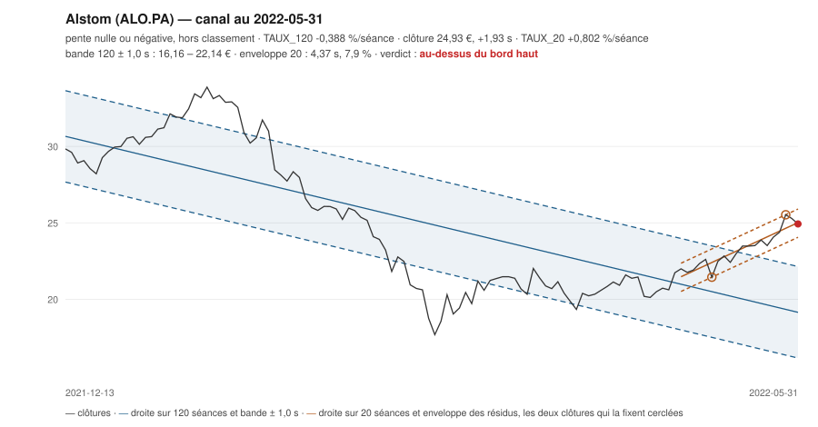

> Hors classement · TAUX_120 -0,388 %/séance · clôture 24,93 € · bande 16,16 – 22,14 € · écart +1,93 s · TAUX_20 +0,802 %/séance · enveloppe 20 : 4,37 s, 7,9 % · **au-dessus du bord haut**

- Clôture 24,93 €, +1,93 s, bien au-dessus d'une bande de 16,16 à 22,14 €.
- Pentes opposées. Le canal long baisse, TAUX_120 −0,388 %/séance, et la valeur n'a été classée à aucune des 364 séances évaluées. Le canal court monte, TAUX_20 +0,802 %/séance, depuis 24 séances.
- Enveloppe de 4,37 s, large. Bas le 11 mai (21,45 €), haut récent le 27 mai (25,53 €).
- Toutes les clôtures des 20 dernières séances sont au-dessus du bord haut de leur canal du jour, entre +1,27 et +2,28 s. Cela dure depuis 21 séances.
- Verdict : au-dessus du bord haut.

### Les figures des ordres du mois

#### 2022-05-17 — Vente `TTE.PA` TotalEnergies, décision au 2022-05-16

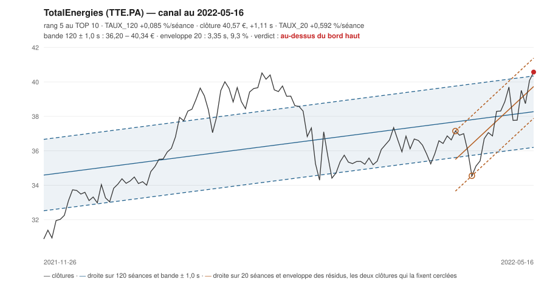

> Rang 5 · TAUX_120 +0,085 %/séance · clôture 40,57 € · bande 36,20 – 40,34 € · écart +1,11 s · TAUX_20 +0,592 %/séance · enveloppe 20 : 3,35 s, 9,3 % · **au-dessus du bord haut**

#### 2022-05-19 — Achat `CA.PA` Carrefour, décision au 2022-05-18

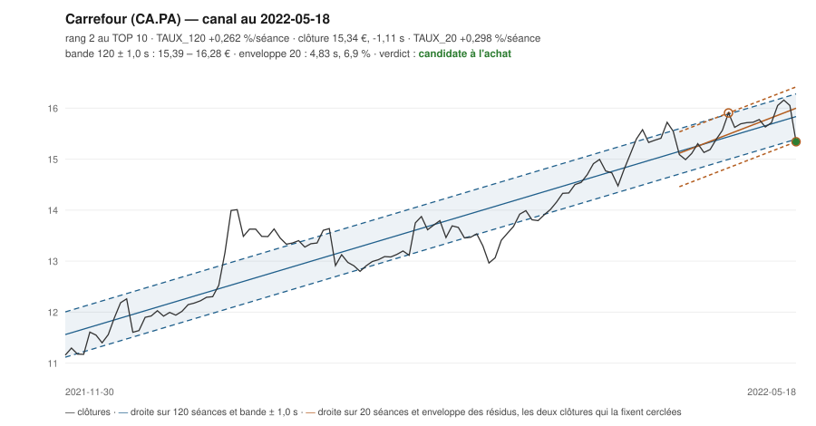

> Rang 2 · TAUX_120 +0,262 %/séance · clôture 15,34 € · bande 15,39 – 16,28 € · écart -1,11 s · TAUX_20 +0,298 %/séance · enveloppe 20 : 4,83 s, 6,9 % · **candidate à l'achat**

#### 2022-05-31 — Vente `MC.PA` LVMH, décision au 2022-05-30

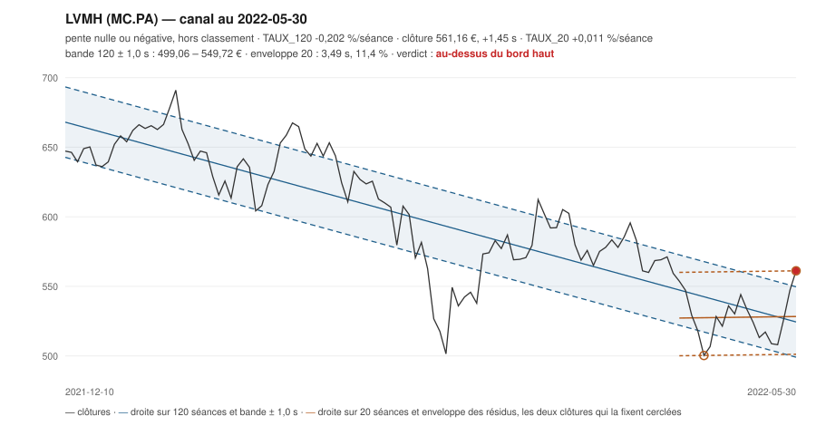

> Hors classement · TAUX_120 -0,202 %/séance · clôture 561,16 € · bande 499,06 – 549,72 € · écart +1,45 s · TAUX_20 +0,011 %/séance · enveloppe 20 : 3,49 s, 11,4 % · **au-dessus du bord haut**

## 5. Le TOP 10 au 2022-05-31

| Rang | Valeur | TAUX_120 | Écart | TAUX_20 | Verdict |
|---|---|---|---|---|---|
| 1 | `HO.PA` Thales | +0,519 %/séance | -2,00 s | -0,108 %/séance | sous le bord bas |
| 2 | `CA.PA` Carrefour | +0,215 %/séance | -2,25 s | -0,546 %/séance | sous le bord bas |
| 3 | `ORA.PA` Orange | +0,195 %/séance | -0,75 s | +0,046 %/séance | dans la bande |
| 4 | `SAN.PA` Sanofi | +0,167 %/séance | -0,45 s | +0,366 %/séance | dans la bande |
| 5 | `TTE.PA` TotalEnergies | +0,091 %/séance | +1,98 s | +0,715 %/séance | au-dessus du bord haut |
| 6 | `AI.PA` Air Liquide | +0,073 %/séance | +0,71 s | +0,237 %/séance | dans la bande |
| 7 | `EN.PA` Bouygues | +0,059 %/séance | +1,02 s | +0,333 %/séance | au-dessus du bord haut |
| 8 | `BN.PA` Danone | +0,006 %/séance | +0,78 s | +0,026 %/séance | dans la bande |

*Le TOP ne compte que 8 valeurs : moins de 10 pentes sont strictement positives ce jour-là.*

**Entrées et sorties du TOP 10 au fil du mois**

| Séance | Entrées | Sorties |
|---|---|---|
| 2022-05-12 | — | `VIV.PA` |
| 2022-05-18 | `BN.PA` | — |
| 2022-05-23 | — | `MT.AS` |
| 2022-05-30 | — | `DG.PA` |

## 6. Les ordres exécutés

> À l'**ouverture** de la séance qui suit la décision, jamais à la clôture qui l'a déclenchée. L'écart d'ouverture est subi, et publié.

| Exécution | Sens | Valeur | Quantité | Prix | Brut | Frais | Écart d'ouverture | Motif |
|---|---|---|---|---|---|---|---|---|
| 2022-05-17 | **Vente** | `TTE.PA` TotalEnergies | 55 | 40,80 € | 2 244,06 € | 2,58 € | +0,56 % | décision au 2022-05-16 : clôture 40,57 € au-dessus du bord haut 40,34 € (+1,11 s) |
| 2022-05-19 | **Achat** | `CA.PA` Carrefour | 136 | 15,17 € | 2 062,49 € | 8,56 € | -1,14 % | décision au 2022-05-18 : clôture 15,34 € sous le bord bas 15,39 € (-1,11 s), rang 2, TAUX_120 +0,262 %/séance, TAUX_20 +0,298 %/séance |
| 2022-05-31 | **Vente** | `MC.PA` LVMH | 3 | 558,12 € | 1 674,36 € | 1,93 € | -0,54 % | décision au 2022-05-30 : clôture 561,16 € au-dessus du bord haut 549,72 € (+1,45 s) |

## 7. Les signaux non exécutés

*Aucun : chaque candidat du mois a été acheté.*

## 8. La lecture du mois

Sur le mois, la meilleure contribution vient de `TTE.PA` (TotalEnergies) pour **+203,49 €**, la moins bonne de `CA.PA` (Carrefour) pour **-95,75 €**. Les 3 ordres du mois ont coûté **13,07 €** de frais, soit 0,131 % de la dotation. Le portefeuille termine le mois **derrière TR39** de 0,45 point.

---

[← Avril](2022-04.md) · [Protocole](../README.md) · [Juin →](2022-06.md)
