# Septembre 2022

> Journal de l'[expérience 4](../README.md) · exécutions du 2022-09-01 au 2022-09-30 · **3 ordres**
> Portefeuille au 2022-09-30 : **9 244,11 €** (base 92,44) · TR39 80,85 · alpha du mois **+3,48 pt** · depuis janvier **+11,59 pt**

---

## 1. Les actualités du mois précédent

**Août 2022.** Le rebond se prolonge trois semaines, puis s'interrompt net le
26 août : à Jackson Hole, Jerome Powell déclare que la lutte contre l'inflation
imposera « une certaine douleur » aux ménages et aux entreprises. Les indices
effacent en quelques séances la totalité de leur avance du mois.

Le gaz européen atteint ses plus hauts historiques fin août avant de refluer, la
perspective d'un arrêt complet de Nord Stream dominant les échanges. L'inflation
de la zone euro dépasse 9 %. Les valeurs les plus sensibles aux taux — luxe,
technologie, immobilier — reprennent leur baisse.

## 2. L'exposition héritée au 2022-08-31

| Valeur | Achetée le | Prix d'achat | Cours | +/− value | Alpha depuis l'achat |
|---|---|---|---|---|---|
| `CA.PA` Carrefour | 2022-05-19 | 15,17 € | 13,05 € | **-13,98 %** | -10,66 pt |
| `HO.PA` Thales | 2022-06-06 | 105,72 € | 111,08 € | **+5,07 %** | +12,48 pt |
| `SAN.PA` Sanofi | 2022-07-04 | 82,42 € | 69,00 € | **-16,29 %** | -19,53 pt |
| `ORA.PA` Orange | 2022-07-07 | 8,65 € | 7,89 € | **-8,73 %** | -11,25 pt |

## 3. Le portefeuille depuis le 2022-01-03

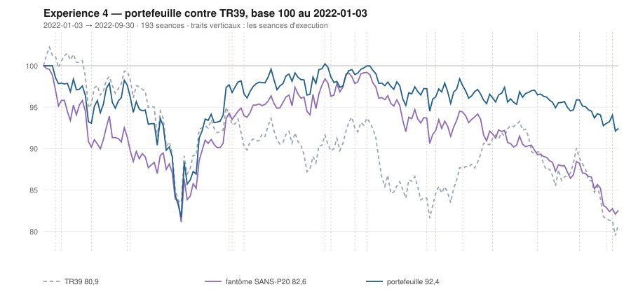

| | |
|---|---|
| Dotation initiale | 10 000,00 € au 2022-01-03 |
| Titres au 2022-09-30 | 9 242,14 € |
| Espèces | 1,97 € |
| Lignes détenues | 5 |
| **Total** | **9 244,11 €** |
| Base 100 | **92,44** |
| Fantôme `SANS-P20`, même base | 82,56 |
| TR39, même base | 80,85 |
| Écart depuis janvier | **+11,59 pt** |

### Toutes les positions depuis le début de l'expérience

> Closes comme ouvertes. Aucune séance postérieure au 2022-09-30 n'entre dans ce tableau.

| Société | Prix d'achat | Date d'achat | Prix de vente | Date de vente |
|---|---|---|---|---|
| `CAP.PA` Capgemini | 182,86 € | 2022-01-07 | 181,51 € | 2022-03-30 |
| `EL.PA` EssilorLuxottica | 162,03 € | 2022-01-07 | 153,11 € | 2022-03-30 |
| `RI.PA` Pernod Ricard | 173,52 € | 2022-01-07 | 164,76 € | 2022-03-31 |
| `STMPA.PA` STMicroelectronics | 41,80 € | 2022-01-11 | 39,65 € | 2022-03-30 |
| `BNP.PA` BNP Paribas | 43,84 € | 2022-01-25 | 48,20 € | 2022-02-10 |
| `MC.PA` LVMH | 633,54 € | 2022-02-11 | 558,12 € | 2022-05-31 |
| `SAN.PA` Sanofi | 74,66 € | 2022-03-30 | 77,80 € | 2022-04-06 |
| `TTE.PA` TotalEnergies | 36,38 € | 2022-03-30 | 40,80 € | 2022-05-17 |
| `DG.PA` Vinci | 73,34 € | 2022-04-06 | 77,14 € | 2022-07-20 |
| `CA.PA` Carrefour | 15,17 € | 2022-05-19 | 13,26 € | 2022-09-13 |
| `HO.PA` Thales | 105,72 € | 2022-06-06 |  |  |
| `SAN.PA` Sanofi | 82,42 € | 2022-07-04 |  |  |
| `ORA.PA` Orange | 8,65 € | 2022-07-07 |  |  |
| `TTE.PA` TotalEnergies | 38,39 € | 2022-08-03 | 43,55 € | 2022-08-24 |
| `RNO.PA` Renault | 23,21 € | 2022-09-26 |  |  |
| `ENGI.PA` Engie | 8,69 € | 2022-09-28 |  |  |

*16 positions depuis le début, dont 5 encore ouvertes : les deux dernières colonnes restent vides.*

## 4. L'étude chartiste au 2022-09-30

> Une entrée par société de l'univers, sous la figure de canal lue à la clôture du 2022-09-30. La ligne en retrait est **calculée** ; la note qui suit est celle de l'agent `chartiste`, rédigée sans aucune séance postérieure.

### 1. `RNO.PA` — Renault

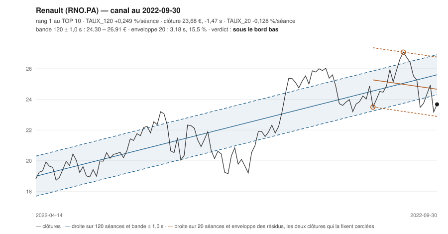

> Rang 1 · TAUX_120 +0,249 %/séance · clôture 23,68 € · bande 24,30 – 26,91 € · écart -1,47 s · TAUX_20 -0,128 %/séance · enveloppe 20 : 3,18 s, 15,5 % · **sous le bord bas**

- Clôture 23,68 €, à −1,47 s, sous le bord bas de 24,30 € (bande 24,30 à 26,91 €) depuis 2 séances ; creux à −1,89 s le 2022-09-29.
- Chemin heurté : +1,49 s le 2022-09-16, déjà −1,69 s le 2022-09-23, 4 séances sous le bord bas et 3 au-dessus du bord haut dans la fenêtre.
- Rang 1 du TOP 10, pente longue +0,249 %/séance, la plus forte de l'univers, au TOP 10 depuis 41 séances ; pente courte −0,128 %/séance depuis 2 séances : désaccord.
- Enveloppe de 3,18 s, mais 15,5 % du niveau moyen ; résidu bas le 2022-09-05, résidu haut le 2022-09-16.
- Verdict : sous le bord bas, non candidate — la pente courte est négative.

### 2. `WLN.PA` — Worldline

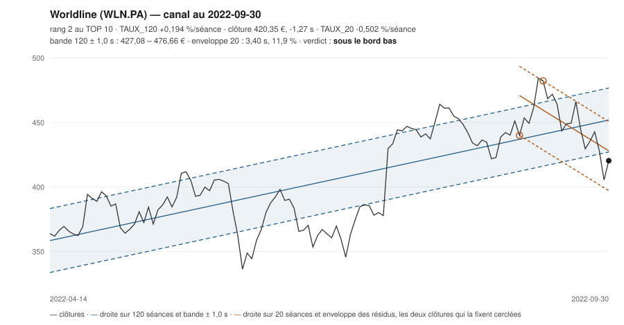

> Rang 2 · TAUX_120 +0,194 %/séance · clôture 420,35 € · bande 427,08 – 476,66 € · écart -1,27 s · TAUX_20 -0,502 %/séance · enveloppe 20 : 3,40 s, 11,9 % · **sous le bord bas**

- Clôture 420,35 €, à −1,27 s, sous le bord bas de 427,08 € (bande 427,08 à 476,66 €) depuis 3 séances.
- Traversée complète de la bande dans la fenêtre : +1,90 s le 2022-09-09, 6 séances au-dessus du bord haut, puis −1,90 s le 2022-09-29.
- Rang 2 du TOP 10, pente longue +0,194 %/séance, au TOP 10 depuis 31 séances ; pente courte −0,502 %/séance depuis 5 séances : désaccord.
- Enveloppe de 3,40 s (11,9 % du niveau moyen) ; bornes anciennes, 2022-09-05 (bas) et 2022-09-12 (haut).
- Verdict : sous le bord bas, non candidate — la pente courte est négative.

### 3. `RMS.PA` — Hermès International

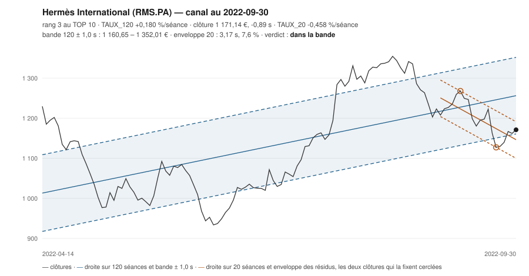

> Rang 3 · TAUX_120 +0,180 %/séance · clôture 1 171,14 € · bande 1 160,65 – 1 352,01 € · écart -0,89 s · TAUX_20 -0,458 %/séance · enveloppe 20 : 3,17 s, 7,6 % · **dans la bande**

- Clôture 1 171,14 €, à −0,89 s, dans la bande de 1 160,65 à 1 352,01 €, rentrée le 2022-09-28 après 3 séances sous le bord bas (−1,17 s le 2022-09-26).
- Rang 3 du TOP 10, pente longue +0,180 %/séance, au TOP 10 depuis 34 séances ; pente courte −0,458 %/séance depuis 24 séances : désaccord.
- Enveloppe de 3,17 s (7,6 % du niveau moyen) ; résidu haut le 2022-09-12, résidu bas le 2022-09-23.
- Verdict : dans la bande.

### 4. `MC.PA` — LVMH

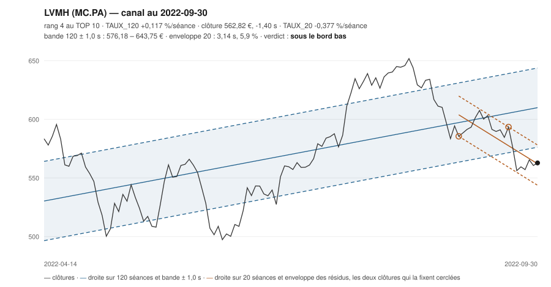

> Rang 4 · TAUX_120 +0,117 %/séance · clôture 562,82 € · bande 576,18 – 643,75 € · écart -1,40 s · TAUX_20 -0,377 %/séance · enveloppe 20 : 3,14 s, 5,9 % · **sous le bord bas**

- Clôture 562,82 €, à −1,40 s, sous le bord bas de 576,18 € (bande 576,18 à 643,75 €) depuis 7 séances, creux à −1,65 s le 2022-09-23.
- Rang 4 du TOP 10, pente longue +0,117 %/séance, au TOP 10 depuis 39 séances ; pente courte −0,377 %/séance depuis 26 séances : désaccord.
- Enveloppe de 3,14 s (5,9 % du niveau moyen) ; résidu bas le 2022-09-05, résidu haut le 2022-09-21.
- Verdict : sous le bord bas, non candidate — la pente courte est négative.

### 5. `ENGI.PA` — Engie

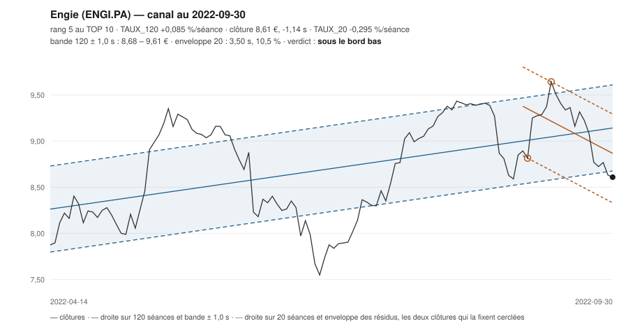

> Rang 5 · TAUX_120 +0,085 %/séance · clôture 8,61 € · bande 8,68 – 9,61 € · écart -1,14 s · TAUX_20 -0,295 %/séance · enveloppe 20 : 3,50 s, 10,5 % · **sous le bord bas**

- Clôture 8,61 €, à −1,14 s, sous le bord bas de 8,68 € (bande 8,68 à 9,61 €) depuis 2 séances ; écart le plus bas des 20 séances.
- La fenêtre contient aussi une clôture au-dessus du bord haut, +1,16 s le 2022-09-13.
- Rang 5 du TOP 10, pente longue +0,085 %/séance, au TOP 10 depuis 43 séances ; pente courte −0,295 %/séance depuis 2 séances : désaccord.
- Enveloppe de 3,50 s (10,5 % du niveau moyen) ; bornes anciennes, 2022-09-06 (bas) et 2022-09-13 (haut).
- Verdict : sous le bord bas, non candidate — la pente courte est négative.

### 6. `OR.PA` — L'Oréal

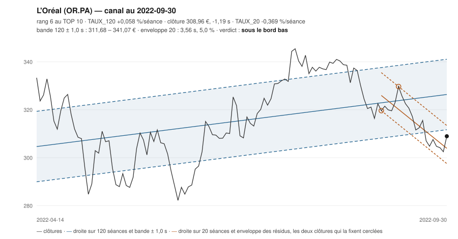

> Rang 6 · TAUX_120 +0,058 %/séance · clôture 308,96 € · bande 311,68 – 341,07 € · écart -1,19 s · TAUX_20 -0,369 %/séance · enveloppe 20 : 3,56 s, 5,0 % · **sous le bord bas**

- Clôture 308,96 €, à −1,19 s, sous le bord bas de 311,68 € (bande 311,68 à 341,07 €) depuis 7 séances ; creux à −1,61 s le 2022-09-29.
- Rang 6 du TOP 10, pente longue +0,058 %/séance, au TOP 10 depuis 11 séances ; pente courte −0,369 %/séance depuis 29 séances : désaccord.
- Enveloppe de 3,56 s (5,0 % du niveau moyen) ; bornes anciennes, 2022-09-05 (bas) et 2022-09-12 (haut).
- Verdict : sous le bord bas, non candidate — la pente courte est négative.

### 7. `KER.PA` — Kering

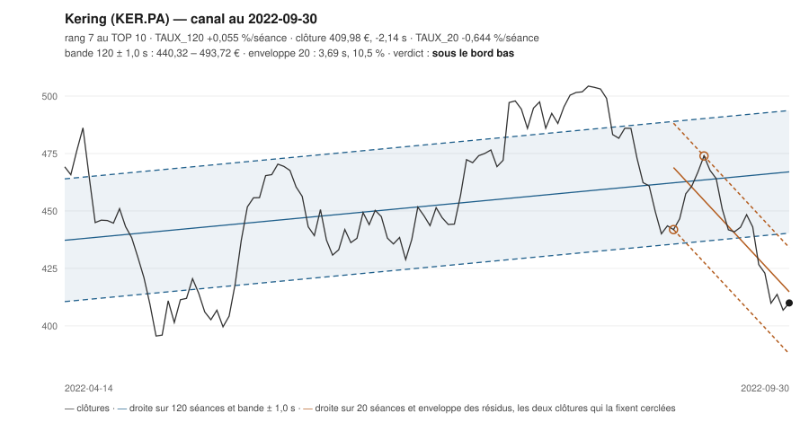

> Rang 7 · TAUX_120 +0,055 %/séance · clôture 409,98 € · bande 440,32 – 493,72 € · écart -2,14 s · TAUX_20 -0,644 %/séance · enveloppe 20 : 3,69 s, 10,5 % · **sous le bord bas**

- Clôture 409,98 €, à −2,14 s, sous le bord bas de 440,32 € (bande 440,32 à 493,72 €) depuis 7 séances ; creux à −2,38 s le 2022-09-27.
- Rang 7 du TOP 10, pente longue +0,055 %/séance, au TOP 10 depuis 13 séances ; pente courte −0,644 %/séance, négative depuis 28 séances : désaccord.
- Enveloppe de 3,69 s (10,5 % du niveau moyen), au niveau attendu ; bornes anciennes, 2022-09-05 (bas) et 2022-09-12 (haut).
- Verdict : sous le bord bas, non candidate — la pente courte est négative.

### 8. `SAF.PA` — Safran

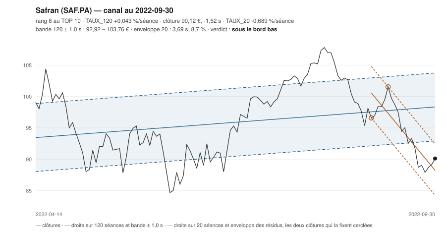

> Rang 8 · TAUX_120 +0,043 %/séance · clôture 90,12 € · bande 92,92 – 103,76 € · écart -1,52 s · TAUX_20 -0,689 %/séance · enveloppe 20 : 3,69 s, 8,7 % · **sous le bord bas**

- Clôture 90,12 €, à −1,52 s, sous le bord bas de 92,92 € (bande 92,92 à 103,76 €) depuis 9 séances ; creux à −2,11 s le 2022-09-23.
- Rang 8 du TOP 10, pente longue +0,043 %/séance, au TOP 10 depuis 24 séances ; pente courte −0,689 %/séance depuis 25 séances : désaccord.
- Enveloppe de 3,69 s (8,7 % du niveau moyen), conforme aux ~3,7 s ; bornes anciennes, 2022-09-05 (bas) et 2022-09-12 (haut).
- Verdict : sous le bord bas, non candidate — la pente courte est négative.

### 9. `STLAP.PA` — Stellantis

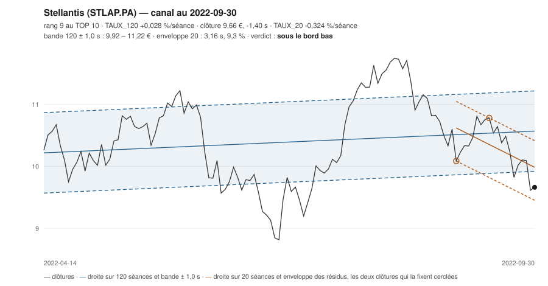

> Rang 9 · TAUX_120 +0,028 %/séance · clôture 9,66 € · bande 9,92 – 11,22 € · écart -1,40 s · TAUX_20 -0,324 %/séance · enveloppe 20 : 3,16 s, 9,3 % · **sous le bord bas**

- Clôture 9,66 €, à −1,40 s, sous le bord bas de 9,92 € (bande 9,92 à 11,22 €) depuis 2 séances ; déjà −1,36 s le 2022-09-23, creux à −1,52 s le 2022-09-29.
- Rang 9 du TOP 10, pente longue +0,028 %/séance, au TOP 10 depuis 18 séances ; pente courte −0,324 %/séance depuis 26 séances : désaccord.
- Enveloppe de 3,16 s (9,3 % du niveau moyen) ; résidu bas le 2022-09-05, résidu haut le 2022-09-15.
- Verdict : sous le bord bas, non candidate — la pente courte est négative.

### 10. `RI.PA` — Pernod Ricard

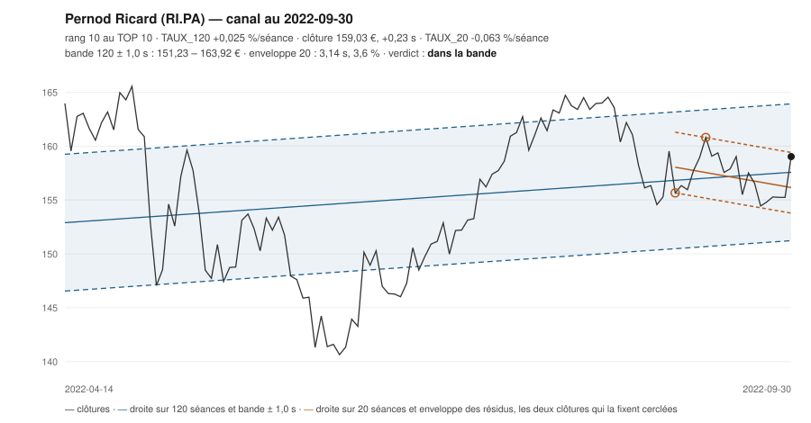

> Rang 10 · TAUX_120 +0,025 %/séance · clôture 159,03 € · bande 151,23 – 163,92 € · écart +0,23 s · TAUX_20 -0,063 %/séance · enveloppe 20 : 3,14 s, 3,6 % · **dans la bande**

- Clôture 159,03 €, à +0,23 s, dans la bande de 151,23 à 163,92 € depuis 29 séances ; c'est l'écart le plus haut de l'univers ce jour.
- Rang 10, entrée au TOP 10 ce jour, pente longue +0,025 %/séance ; pente courte −0,063 %/séance depuis 5 séances, la moins négative de l'univers : aucune pente courte n'est positive ce jour.
- Enveloppe de 3,14 s pour 3,6 % du niveau moyen ; bornes anciennes, 2022-09-05 (bas) et 2022-09-12 (haut).
- Verdict : dans la bande.

### 11. `TTE.PA` — TotalEnergies

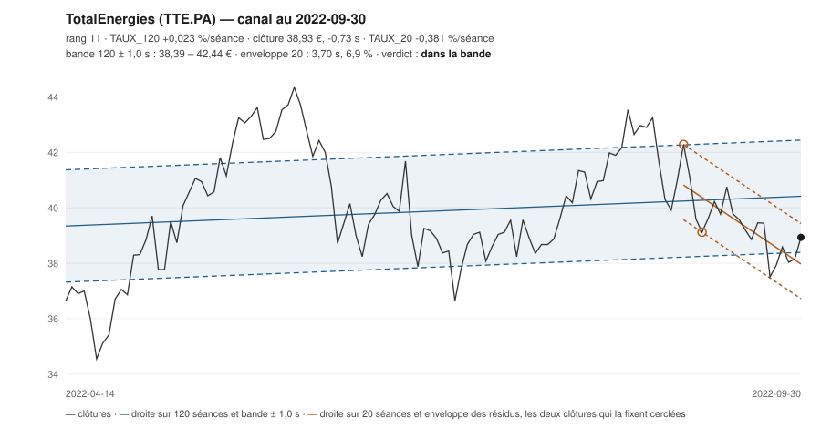

> Rang 11 · TAUX_120 +0,023 %/séance · clôture 38,93 € · bande 38,39 – 42,44 € · écart -0,73 s · TAUX_20 -0,381 %/séance · enveloppe 20 : 3,70 s, 6,9 % · **dans la bande**

- Clôture 38,93 €, à −0,73 s, dans la bande de 38,39 à 42,44 €, rentrée ce jour après 9 séances sous le bord bas dans la fenêtre (−1,69 s le 2022-09-23).
- Pente longue +0,023 %/séance, rang 11 : sortie du TOP 10 ce jour ; pente courte −0,381 %/séance depuis 18 séances.
- Enveloppe de 3,70 s (6,9 % du niveau moyen) ; ses deux bornes sont en tout début de fenêtre, 2022-09-05 (haut) et 2022-09-08 (bas).
- Verdict : dans la bande.

### 12. `CS.PA` — AXA

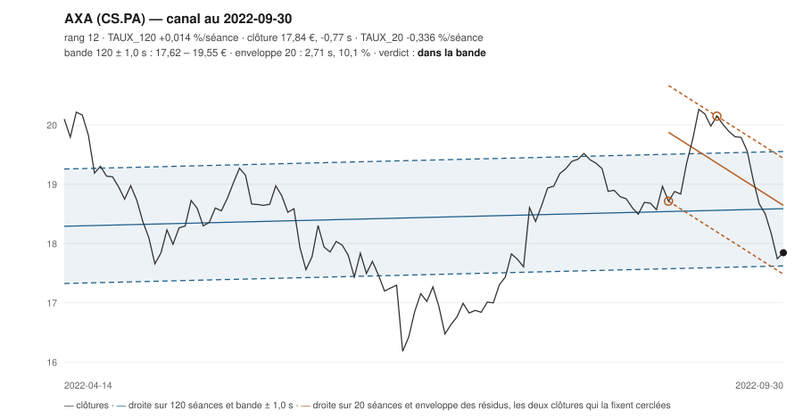

> Rang 12 · TAUX_120 +0,014 %/séance · clôture 17,84 € · bande 17,62 – 19,55 € · écart -0,77 s · TAUX_20 -0,336 %/séance · enveloppe 20 : 2,71 s, 10,1 % · **dans la bande**

- Clôture 17,84 €, à −0,77 s, dans la bande de 17,62 à 19,55 €, rentrée par le haut le 2022-09-23.
- 14 des 20 séances de la fenêtre au-dessus du bord haut, jusqu'à +2,45 s le 2022-09-12, puis −0,87 s le 2022-09-29.
- Pente longue +0,014 %/séance, rang 12, hors TOP 10 ; pente courte −0,336 %/séance depuis 3 séances : désaccord.
- Enveloppe de 2,71 s (10,1 % du niveau moyen), la plus étroite de l'univers en unités de s ; bornes au 2022-09-05 (bas) et au 2022-09-15 (haut).
- Verdict : dans la bande.

### 13. `HO.PA` — Thales

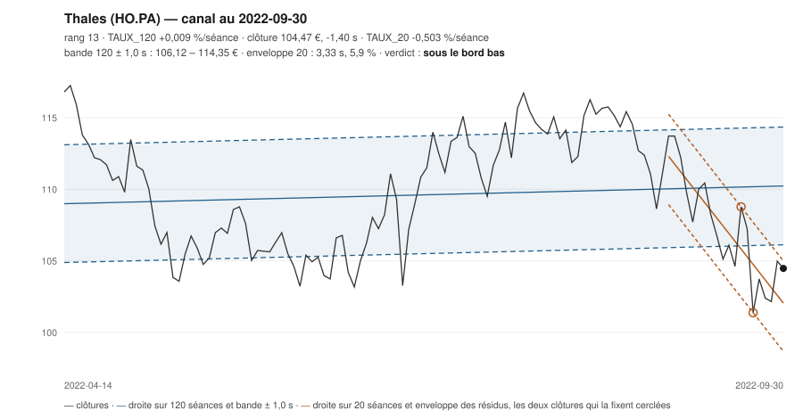

> Rang 13 · TAUX_120 +0,009 %/séance · clôture 104,47 € · bande 106,12 – 114,35 € · écart -1,40 s · TAUX_20 -0,503 %/séance · enveloppe 20 : 3,33 s, 5,9 % · **sous le bord bas**

- Clôture 104,47 €, à −1,40 s, sous le bord bas de 106,12 € (bande 106,12 à 114,35 €) depuis 7 séances.
- 13 des 20 séances de la fenêtre sous le bord bas, creux à −2,50 s le 2022-09-23 ; la plus haute clôture relative, +0,17 s, est la première (2022-09-05).
- Pente longue +0,009 %/séance, rang 13, sortie du TOP 10 depuis 11 séances ; pente courte −0,503 %/séance depuis 26 séances.
- Enveloppe de 3,33 s (5,9 % du niveau moyen) ; bornes au milieu de la fenêtre, 2022-09-21 (haut) et 2022-09-23 (bas).
- Verdict : sous le bord bas, non candidate — hors TOP 10 et pente courte négative.

### 14. `DG.PA` — Vinci

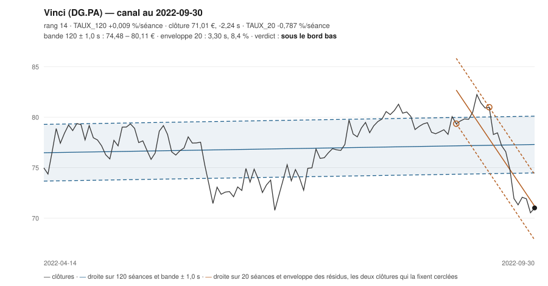

> Rang 14 · TAUX_120 +0,009 %/séance · clôture 71,01 € · bande 74,48 – 80,11 € · écart -2,24 s · TAUX_20 -0,787 %/séance · enveloppe 20 : 3,30 s, 8,4 % · **sous le bord bas**

- Clôture 71,01 €, à −2,24 s, sous le bord bas de 74,48 € (bande 74,48 à 80,11 €) : écart le plus bas de l'univers ce jour.
- Encore à +1,63 s le 2022-09-12, sous le bord bas depuis le 2022-09-22, au plus bas à −2,67 s le 2022-09-26.
- Pente longue positive, +0,009 %/séance, mais rang 14, hors TOP 10 depuis 31 séances ; pente courte −0,787 %/séance depuis 8 séances.
- Enveloppe de 3,30 s (8,4 % du niveau moyen) ; résidu bas le 2022-09-05, résidu haut le 2022-09-15.
- Verdict : sous le bord bas, non candidate — hors TOP 10 et pente courte négative.

### 15. `STMPA.PA` — STMicroelectronics

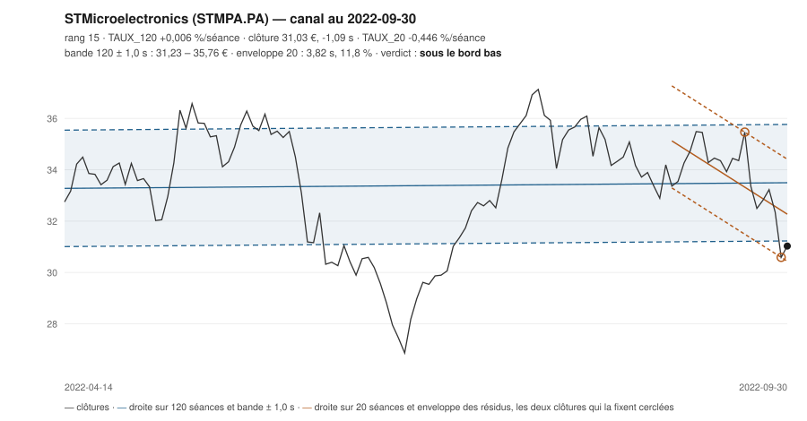

> Rang 15 · TAUX_120 +0,006 %/séance · clôture 31,03 € · bande 31,23 – 35,76 € · écart -1,09 s · TAUX_20 -0,446 %/séance · enveloppe 20 : 3,82 s, 11,8 % · **sous le bord bas**

- Clôture 31,03 €, à −1,09 s, sous le bord bas de 31,23 € (bande 31,23 à 35,76 €) depuis 2 séances.
- La fenêtre a vu 2 clôtures au-dessus du bord haut (+1,06 s le 2022-09-09) et 2 sous le bord bas (−1,32 s le 2022-09-29).
- Pente longue +0,006 %/séance, rang 15, hors TOP 10 ; pente courte −0,446 %/séance depuis 5 séances.
- Enveloppe de 3,82 s (11,8 % du niveau moyen) ; bornes récentes, 2022-09-21 (haut) et 2022-09-29 (bas).
- Verdict : sous le bord bas, non candidate — hors TOP 10 et pente courte négative.

### 16. `GLE.PA` — Société Générale

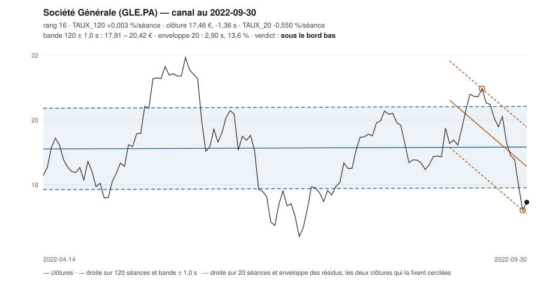

> Rang 16 · TAUX_120 +0,003 %/séance · clôture 17,46 € · bande 17,91 – 20,42 € · écart -1,36 s · TAUX_20 -0,550 %/séance · enveloppe 20 : 2,90 s, 13,6 % · **sous le bord bas**

- Clôture 17,46 €, à −1,36 s, sous le bord bas de 17,91 € (bande 17,91 à 20,42 €) depuis 3 séances.
- Traversée de haut en bas : 5 séances au-dessus du bord haut dans la fenêtre (+1,40 s le 2022-09-12), puis −1,62 s le 2022-09-29.
- Pente longue à peine positive, +0,003 %/séance, rang 16, hors TOP 10 ; pente courte −0,550 %/séance depuis 3 séances.
- Enveloppe de 2,90 s (13,6 % du niveau moyen), sous les ~3,7 s ; bornes récentes, 2022-09-15 (haut) et 2022-09-29 (bas).
- Verdict : sous le bord bas, non candidate — hors TOP 10 et pente courte négative.

### `EL.PA` — EssilorLuxottica

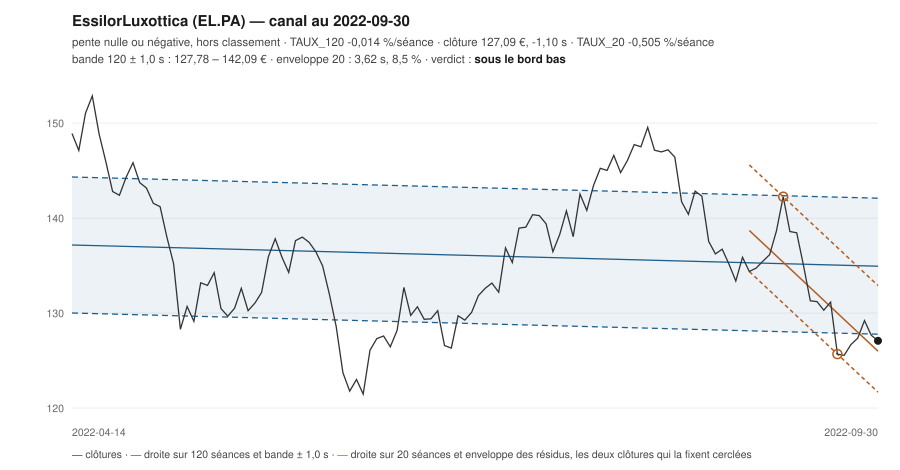

> Hors classement · TAUX_120 -0,014 %/séance · clôture 127,09 € · bande 127,78 – 142,09 € · écart -1,10 s · TAUX_20 -0,505 %/séance · enveloppe 20 : 3,62 s, 8,5 % · **sous le bord bas**

- Clôture 127,09 €, à −1,10 s, sous le bord bas de 127,78 € (bande 127,78 à 142,09 €) depuis 2 séances.
- Second passage sous le bord bas dans la fenêtre : 6 séances au total, dont un creux à −1,44 s le 2022-09-22.
- Pente longue −0,014 %/séance, hors classement ; pente courte −0,505 %/séance depuis 26 séances.
- Enveloppe de 3,62 s (8,5 % du niveau moyen) ; résidu haut le 2022-09-12, résidu bas le 2022-09-22.
- Verdict : sous le bord bas, non candidate — hors TOP 10 et pente courte négative.

### `DSY.PA` — Dassault Systèmes

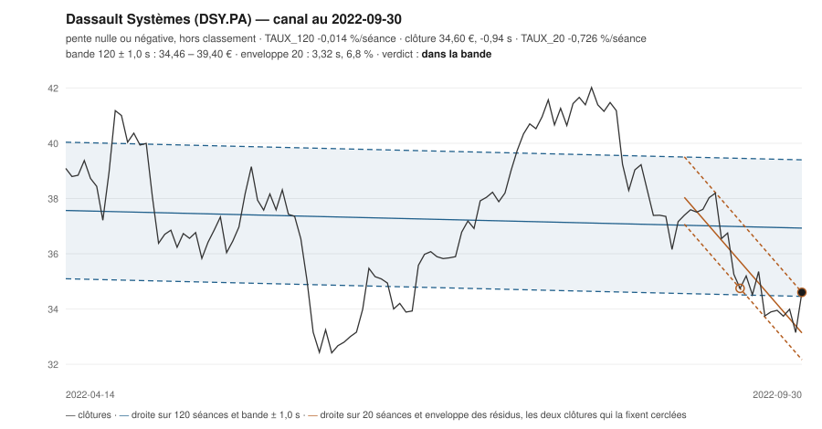

> Hors classement · TAUX_120 -0,014 %/séance · clôture 34,60 € · bande 34,46 – 39,40 € · écart -0,94 s · TAUX_20 -0,726 %/séance · enveloppe 20 : 3,32 s, 6,8 % · **dans la bande**

- Clôture 34,60 €, à −0,94 s, dans la bande de 34,46 à 39,40 €, rentrée ce jour après −1,56 s la veille ; 7 séances sous le bord bas dans la fenêtre.
- Pente longue −0,014 %/séance ; pente courte −0,726 %/séance, négative depuis 28 séances : concordance.
- Enveloppe de 3,32 s (6,8 % du niveau moyen) ; le résidu haut est la clôture du jour, le résidu bas celle du 2022-09-16.
- Verdict : dans la bande.

### `PUB.PA` — Publicis

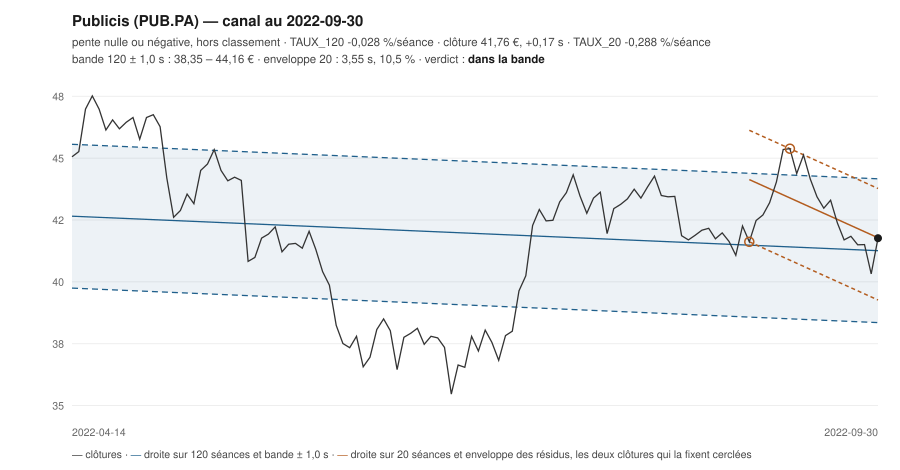

> Hors classement · TAUX_120 -0,028 %/séance · clôture 41,76 € · bande 38,35 – 44,16 € · écart +0,17 s · TAUX_20 -0,288 %/séance · enveloppe 20 : 3,55 s, 10,5 % · **dans la bande**

- Clôture 41,76 €, à +0,17 s, dans la bande de 38,35 à 44,16 €, rentrée par le haut le 2022-09-19 ; 8 séances au-dessus du bord haut dans la fenêtre (+1,79 s le 2022-09-12).
- Pente longue −0,028 %/séance ; pente courte −0,288 %/séance depuis 3 séances : les deux négatives.
- Enveloppe de 3,55 s (10,5 % du niveau moyen) ; résidu bas le 2022-09-05, résidu haut le 2022-09-13.
- Verdict : dans la bande.

### `ACA.PA` — Crédit Agricole

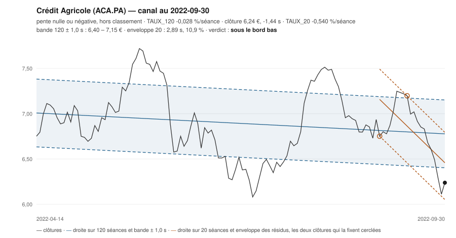

> Hors classement · TAUX_120 -0,028 %/séance · clôture 6,24 € · bande 6,40 – 7,15 € · écart -1,44 s · TAUX_20 -0,540 %/séance · enveloppe 20 : 2,89 s, 10,9 % · **sous le bord bas**

- Clôture 6,24 €, à −1,44 s, sous le bord bas de 6,40 € (bande 6,40 à 7,15 €) depuis 3 séances.
- Traversée de la bande de haut en bas dans la fenêtre : +1,18 s le 2022-09-12, 3 clôtures au-dessus du bord haut, puis −1,86 s le 2022-09-29.
- Pente longue −0,028 %/séance, hors classement ; pente courte −0,540 %/séance, négative depuis 5 séances : concordance à la baisse.
- Enveloppe de 2,89 s (10,9 % du niveau moyen), sous les ~3,7 s ; résidu bas à la 1re séance de la fenêtre (2022-09-05), résidu haut le 2022-09-15.
- Verdict : sous le bord bas, non candidate — hors TOP 10 et pente courte négative.

### `BNP.PA` — BNP Paribas

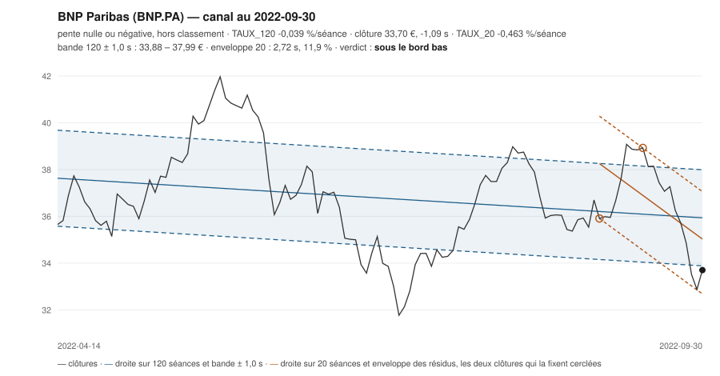

> Hors classement · TAUX_120 -0,039 %/séance · clôture 33,70 € · bande 33,88 – 37,99 € · écart -1,09 s · TAUX_20 -0,463 %/séance · enveloppe 20 : 2,72 s, 11,9 % · **sous le bord bas**

- Clôture 33,70 €, à −1,09 s, sous le bord bas de 33,88 € (bande 33,88 à 37,99 €) depuis 3 séances.
- Traversée complète : 4 séances au-dessus du bord haut en début de fenêtre (+1,39 s le 2022-09-12), puis passage sous le bord bas le 2022-09-28 et −1,55 s le 2022-09-29.
- Pente longue −0,039 %/séance, hors classement ; pente courte −0,463 %/séance depuis 3 séances.
- Enveloppe étroite, 2,72 s (11,9 % du niveau moyen), bien sous les ~3,7 s ; bornes au 2022-09-05 (bas) et au 2022-09-15 (haut).
- Verdict : sous le bord bas, non candidate — hors TOP 10 et pente courte négative.

### `SU.PA` — Schneider Electric

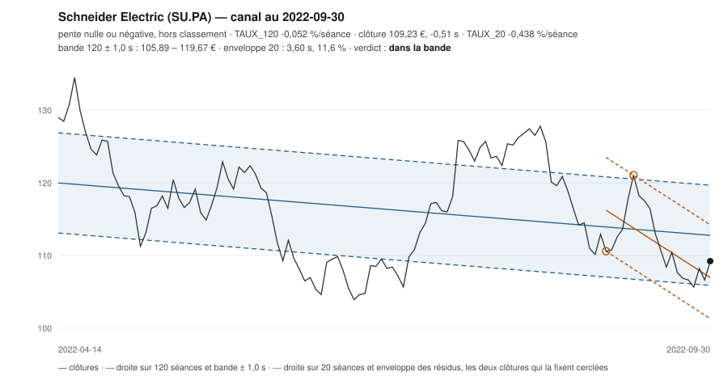

> Hors classement · TAUX_120 -0,052 %/séance · clôture 109,23 € · bande 105,89 – 119,67 € · écart -0,51 s · TAUX_20 -0,438 %/séance · enveloppe 20 : 3,60 s, 11,6 % · **dans la bande**

- Clôture 109,23 €, à −0,51 s, dans la bande de 105,89 à 119,67 €, rentrée le 2022-09-28 après une seule clôture sous le bord bas (−1,04 s le 2022-09-27) ; une seule aussi au-dessus du bord haut, +1,10 s le 2022-09-12.
- Pente longue −0,052 %/séance ; pente courte −0,438 %/séance depuis 28 séances : concordance.
- Enveloppe de 3,60 s (11,6 % du niveau moyen) ; bornes anciennes, 2022-09-05 (bas) et 2022-09-12 (haut).
- Verdict : dans la bande.

### `CAP.PA` — Capgemini

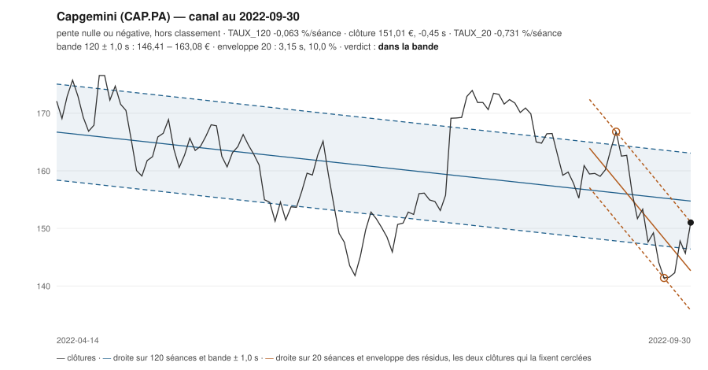

> Hors classement · TAUX_120 -0,063 %/séance · clôture 151,01 € · bande 146,41 – 163,08 € · écart -0,45 s · TAUX_20 -0,731 %/séance · enveloppe 20 : 3,15 s, 10,0 % · **dans la bande**

- Clôture 151,01 €, à −0,45 s, dans la bande de 146,41 à 163,08 €, rentrée ce jour.
- 7 séances sous le bord bas dans la fenêtre, avec un creux à −1,87 s le 2022-09-23 ; en début de fenêtre, une clôture au-dessus du bord haut (+1,13 s le 2022-09-12).
- Pente longue −0,063 %/séance ; pente courte −0,731 %/séance depuis 27 séances : les deux descendent.
- Enveloppe de 3,15 s (10,0 % du niveau moyen) ; résidu haut le 2022-09-12, résidu bas le 2022-09-23.
- Verdict : dans la bande.

### `BN.PA` — Danone

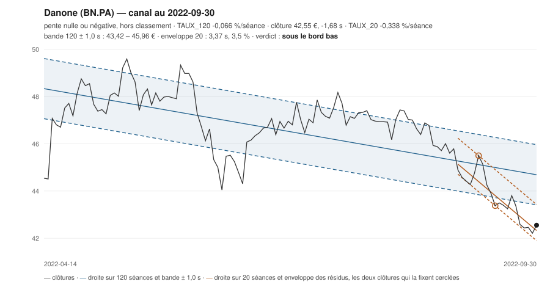

> Hors classement · TAUX_120 -0,066 %/séance · clôture 42,55 € · bande 43,42 – 45,96 € · écart -1,68 s · TAUX_20 -0,338 %/séance · enveloppe 20 : 3,37 s, 3,5 % · **sous le bord bas**

- Clôture 42,55 €, à −1,68 s, sous le bord bas de 43,42 € (bande 43,42 à 45,96 €) depuis 14 séances.
- 19 des 20 dernières séances ont clos sous le bord bas ; l'unique exception est le 2022-09-12, à −0,88 s, et le creux date du 2022-09-27, à −2,02 s.
- Pente longue −0,066 %/séance, hors TOP 10 depuis 18 séances ; pente courte −0,338 %/séance, négative depuis 38 séances : concordance.
- Enveloppe de 3,37 s (3,5 % du niveau moyen) ; résidu haut le 2022-09-12, résidu bas le 2022-09-16.
- Verdict : sous le bord bas, non candidate — hors TOP 10 et pente courte négative.

### `AIR.PA` — Airbus

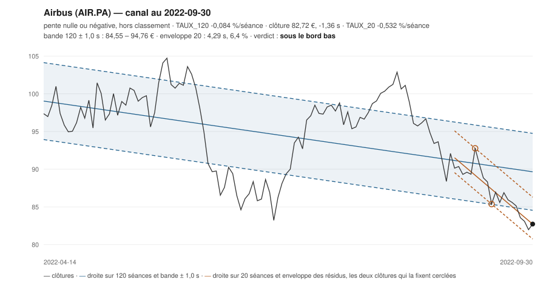

> Hors classement · TAUX_120 -0,084 %/séance · clôture 82,72 € · bande 84,55 – 94,76 € · écart -1,36 s · TAUX_20 -0,532 %/séance · enveloppe 20 : 4,29 s, 6,4 % · **sous le bord bas**

- Clôture 82,72 €, à −1,36 s, sous le bord bas de 84,55 € (bande 84,55 à 94,76 €) depuis 11 séances, depuis le 2022-09-16.
- Les 20 dernières clôtures sont toutes restées sous la droite de leur canal, entre −0,10 s (2022-09-12) et −1,59 s (2022-09-29).
- Pente longue −0,084 %/séance, hors classement ; pente courte −0,532 %/séance depuis 26 séances : les deux baissent.
- Enveloppe de 4,29 s (6,4 % du niveau moyen), au-dessus des ~3,7 s ; résidu haut le 2022-09-12, résidu bas le 2022-09-16.
- Verdict : sous le bord bas, non candidate — hors TOP 10 et pente courte négative.

### `EN.PA` — Bouygues

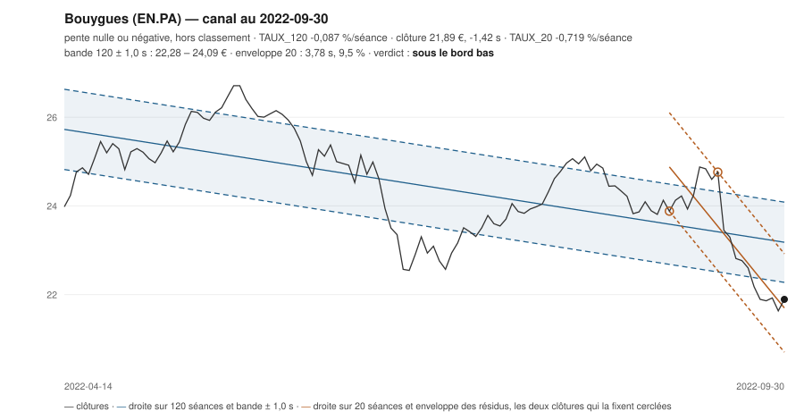

> Hors classement · TAUX_120 -0,087 %/séance · clôture 21,89 € · bande 22,28 – 24,09 € · écart -1,42 s · TAUX_20 -0,719 %/séance · enveloppe 20 : 3,78 s, 9,5 % · **sous le bord bas**

- Clôture 21,89 €, à −1,42 s, sous le bord bas de 22,28 € (bande 22,28 à 24,09 €) depuis 9 séances, depuis le 2022-09-20.
- L'écart était à +0,90 s le 2022-09-12 et touchait −1,83 s le 2022-09-26.
- Pente longue −0,087 %/séance ; pente courte −0,719 %/séance depuis 9 séances : concordance.
- Enveloppe de 3,78 s (9,5 % du niveau moyen) ; résidu bas le 2022-09-05, résidu haut le 2022-09-15.
- Verdict : sous le bord bas, non candidate — hors TOP 10 et pente courte négative.

### `LR.PA` — Legrand

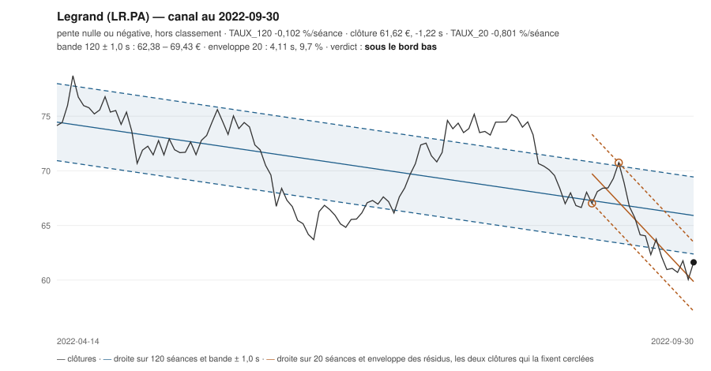

> Hors classement · TAUX_120 -0,102 %/séance · clôture 61,62 € · bande 62,38 – 69,43 € · écart -1,22 s · TAUX_20 -0,801 %/séance · enveloppe 20 : 4,11 s, 9,7 % · **sous le bord bas**

- Clôture 61,62 €, à −1,22 s, sous le bord bas de 62,38 € (bande 62,38 à 69,43 €) depuis 11 séances.
- Écart passé de +0,77 s le 2022-09-12 à −1,84 s le 2022-09-23.
- Pente longue −0,102 %/séance ; pente courte −0,801 %/séance depuis 29 séances : les deux baissent.
- Enveloppe de 4,11 s (9,7 % du niveau moyen), au-dessus des ~3,7 s ; résidu bas le 2022-09-05, résidu haut le 2022-09-12.
- Verdict : sous le bord bas, non candidate — hors TOP 10 et pente courte négative.

### `TEP.PA` — Teleperformance

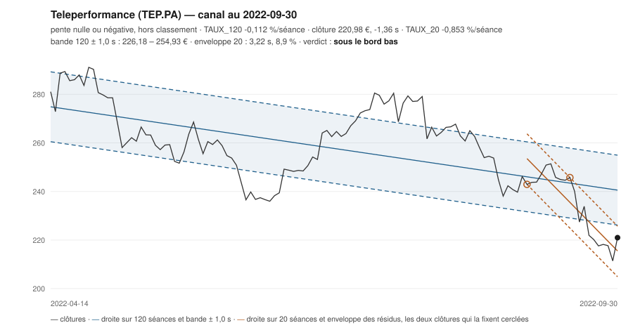

> Hors classement · TAUX_120 -0,112 %/séance · clôture 220,98 € · bande 226,18 – 254,93 € · écart -1,36 s · TAUX_20 -0,853 %/séance · enveloppe 20 : 3,22 s, 8,9 % · **sous le bord bas**

- Clôture 220,98 €, à −1,36 s, sous le bord bas de 226,18 € (bande 226,18 à 254,93 €) depuis 9 séances ; creux à −2,10 s le 2022-09-29.
- Pente longue −0,112 %/séance ; pente courte −0,853 %/séance, négative depuis 39 séances : les deux baissent.
- Enveloppe de 3,22 s (8,9 % du niveau moyen) ; résidu bas le 2022-09-05, résidu haut le 2022-09-16.
- Verdict : sous le bord bas, non candidate — hors TOP 10 et pente courte négative.

### `ORA.PA` — Orange

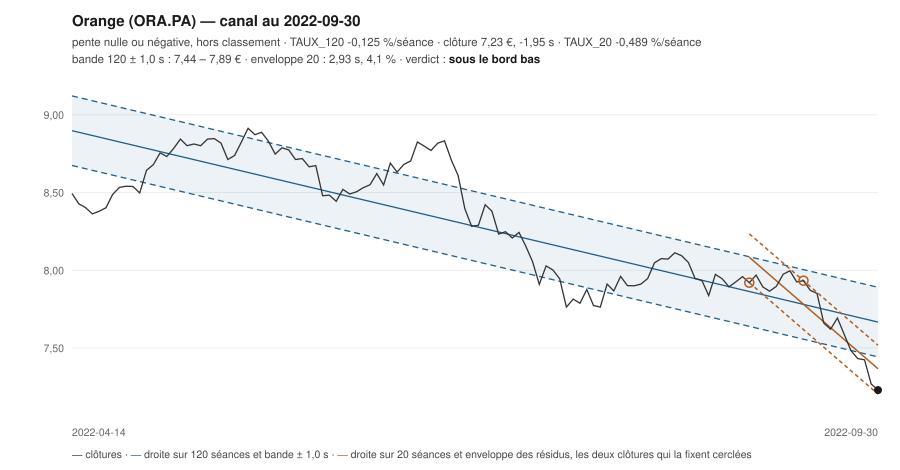

> Hors classement · TAUX_120 -0,125 %/séance · clôture 7,23 € · bande 7,44 – 7,89 € · écart -1,95 s · TAUX_20 -0,489 %/séance · enveloppe 20 : 2,93 s, 4,1 % · **sous le bord bas**

- Clôture 7,23 €, à −1,95 s, sous le bord bas de 7,44 € (bande 7,44 à 7,89 €) depuis 5 séances ; écart le plus bas de la fenêtre.
- Aucune séance de la fenêtre n'a clos au-dessus de la droite : le plus haut est −0,00 s le 2022-09-13.
- Pente longue −0,125 %/séance ; pente courte −0,489 %/séance, négative depuis 21 séances : concordance.
- Enveloppe de 2,93 s (4,1 % du niveau moyen), sous les ~3,7 s ; bornes au 2022-09-05 (bas) et au 2022-09-15 (haut).
- Verdict : sous le bord bas, non candidate — hors TOP 10 et pente courte négative.

### `ALO.PA` — Alstom

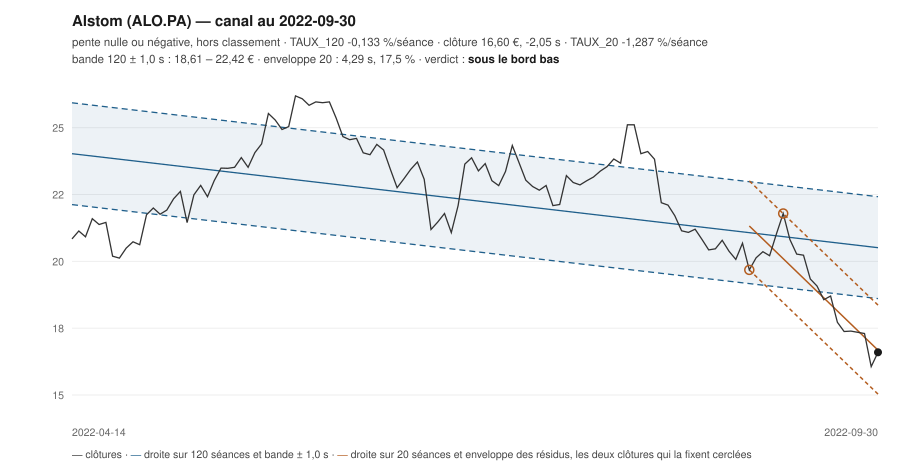

> Hors classement · TAUX_120 -0,133 %/séance · clôture 16,60 € · bande 18,61 – 22,42 € · écart -2,05 s · TAUX_20 -1,287 %/séance · enveloppe 20 : 4,29 s, 17,5 % · **sous le bord bas**

- Clôture 16,60 €, à −2,05 s, sous le bord bas de 18,61 € (bande 18,61 à 22,42 €) depuis 14 séances ; 19 des 20 dernières séances y ont clos, au plus bas à −2,46 s le 2022-09-29.
- Pente longue devenue négative, −0,133 %/séance, hors TOP 10 depuis 16 séances ; pente courte −1,287 %/séance, la plus négative de l'univers, depuis 30 séances.
- Enveloppe de 4,29 s, soit 17,5 % du niveau moyen, la plus large de l'univers en valeur relative ; bornes anciennes, 2022-09-05 (bas) et 2022-09-12 (haut).
- Verdict : sous le bord bas, non candidate — hors TOP 10 et pente courte négative.

### `VIE.PA` — Veolia

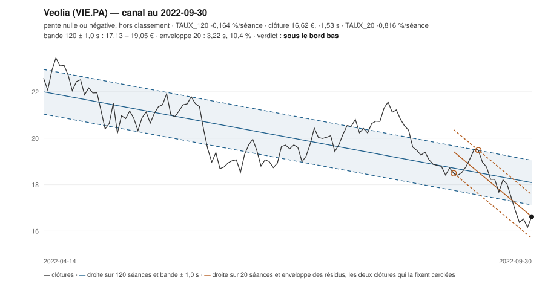

> Hors classement · TAUX_120 -0,164 %/séance · clôture 16,62 € · bande 17,13 – 19,05 € · écart -1,53 s · TAUX_20 -0,816 %/séance · enveloppe 20 : 3,22 s, 10,4 % · **sous le bord bas**

- Clôture 16,62 €, à −1,53 s, sous le bord bas de 17,13 € (bande 17,13 à 19,05 €) depuis 6 séances ; creux à −2,14 s le 2022-09-27, après +0,83 s le 2022-09-12.
- Pente longue −0,164 %/séance ; pente courte −0,816 %/séance depuis 28 séances : concordance.
- Enveloppe de 3,22 s (10,4 % du niveau moyen) ; résidu bas le 2022-09-05, résidu haut le 2022-09-13.
- Verdict : sous le bord bas, non candidate — hors TOP 10 et pente courte négative.

### `AI.PA` — Air Liquide

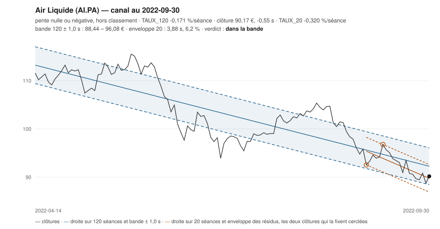

> Hors classement · TAUX_120 -0,171 %/séance · clôture 90,17 € · bande 88,44 – 96,08 € · écart -0,55 s · TAUX_20 -0,320 %/séance · enveloppe 20 : 3,88 s, 6,2 % · **dans la bande**

- Clôture 90,17 €, à −0,55 s, dans la bande de 88,44 à 96,08 €, rentrée le 2022-09-27 ; la fenêtre partait de −1,35 s et n'a jamais dépassé +0,08 s (2022-09-12).
- Pente longue −0,171 %/séance ; pente courte −0,320 %/séance, négative depuis 26 séances : concordance.
- Enveloppe de 3,88 s (6,2 % du niveau moyen), un peu au-dessus des ~3,7 s ; bornes anciennes, 2022-09-05 (bas) et 2022-09-12 (haut).
- Verdict : dans la bande.

### `ML.PA` — Michelin

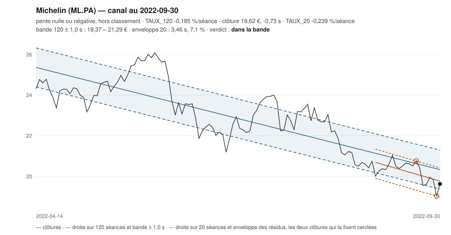

> Hors classement · TAUX_120 -0,185 %/séance · clôture 19,62 € · bande 19,37 – 21,29 € · écart -0,73 s · TAUX_20 -0,239 %/séance · enveloppe 20 : 3,46 s, 7,1 % · **dans la bande**

- Clôture 19,62 €, à −0,73 s, dans la bande de 19,37 à 21,29 €, rentrée ce jour.
- Toute la fenêtre est sous la droite : de −1,80 s au 2022-09-05 à −0,21 s au mieux (2022-09-21), avec 7 séances sous le bord bas.
- Pente longue −0,185 %/séance ; pente courte −0,239 %/séance depuis 6 séances : concordance.
- Enveloppe de 3,46 s (7,1 % du niveau moyen) ; bornes récentes, 2022-09-21 (haut) et 2022-09-29 (bas).
- Verdict : dans la bande.

### `SAN.PA` — Sanofi

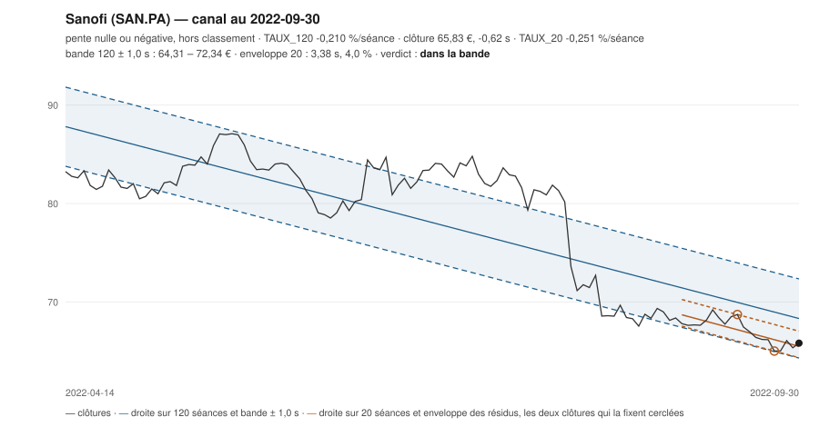

> Hors classement · TAUX_120 -0,210 %/séance · clôture 65,83 € · bande 64,31 – 72,34 € · écart -0,62 s · TAUX_20 -0,251 %/séance · enveloppe 20 : 3,38 s, 4,0 % · **dans la bande**

- Clôture 65,83 €, à −0,62 s, dans la bande de 64,31 à 72,34 €, rentrée le 2022-09-28 ; l'écart du jour est le plus haut de la fenêtre.
- 14 des 20 dernières séances ont clos sous le bord bas, depuis −1,73 s le 2022-09-05.
- Pente longue −0,210 %/séance ; pente courte −0,251 %/séance, négative depuis 46 séances : concordance.
- Enveloppe de 3,38 s (4,0 % du niveau moyen) ; résidu haut le 2022-09-16, résidu bas le 2022-09-26.
- Verdict : dans la bande.

### `CA.PA` — Carrefour

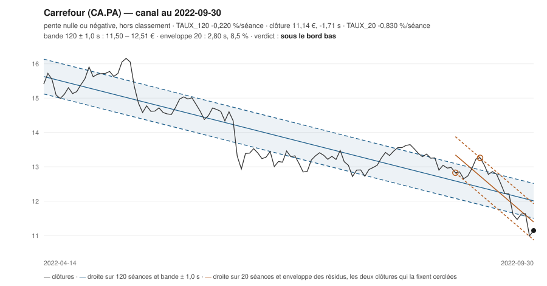

> Hors classement · TAUX_120 -0,220 %/séance · clôture 11,14 € · bande 11,50 – 12,51 € · écart -1,71 s · TAUX_20 -0,830 %/séance · enveloppe 20 : 2,80 s, 8,5 % · **sous le bord bas**

- Clôture 11,14 €, à −1,71 s, sous le bord bas de 11,50 € (bande 11,50 à 12,51 €) depuis 6 séances.
- De +1,18 s le 2022-09-13 à −2,17 s le 2022-09-29 : la bande a été traversée en entier dans la fenêtre.
- Pente longue −0,220 %/séance ; pente courte −0,830 %/séance, négative depuis 22 séances : concordance.
- Enveloppe de 2,80 s (8,5 % du niveau moyen), sous les ~3,7 s ; bornes anciennes, 2022-09-05 (bas) et 2022-09-13 (haut).
- Verdict : sous le bord bas, non candidate — hors TOP 10 et pente courte négative.

### `MT.AS` — ArcelorMittal

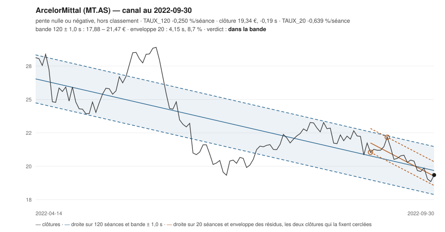

> Hors classement · TAUX_120 -0,250 %/séance · clôture 19,34 € · bande 17,88 – 21,47 € · écart -0,19 s · TAUX_20 -0,639 %/séance · enveloppe 20 : 4,15 s, 8,7 % · **dans la bande**

- Clôture 19,34 €, à −0,19 s, dans la bande de 17,88 à 21,47 € depuis 54 séances, depuis le 2022-07-19 ; sur 20 séances l'écart est resté entre −0,49 s et +0,96 s.
- Pente longue −0,250 %/séance ; pente courte −0,639 %/séance, négative depuis 27 séances : concordance.
- Enveloppe de 4,15 s (8,7 % du niveau moyen), au-dessus des ~3,7 s ; bornes anciennes, 2022-09-05 (bas) et 2022-09-12 (haut).
- Verdict : dans la bande.

### `ERF.PA` — Eurofins Scientific

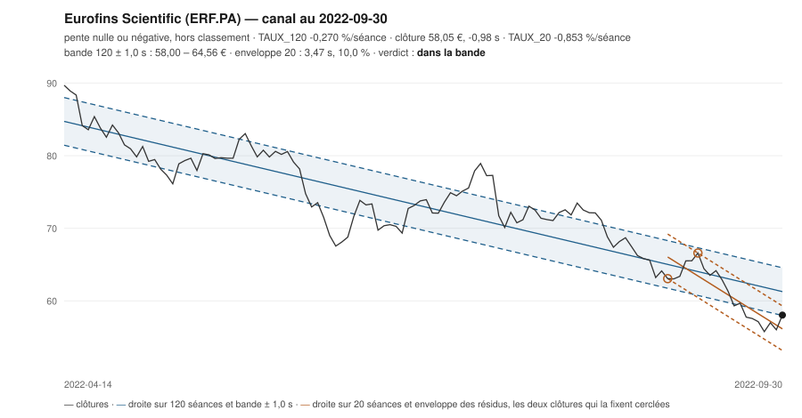

> Hors classement · TAUX_120 -0,270 %/séance · clôture 58,05 € · bande 58,00 – 64,56 € · écart -0,98 s · TAUX_20 -0,853 %/séance · enveloppe 20 : 3,47 s, 10,0 % · **dans la bande**

- Clôture 58,05 €, à −0,98 s, dans la bande de 58,00 à 64,56 €, à la lisière du bord bas ; rentrée ce jour.
- 9 séances de la fenêtre sous le bord bas, dont −1,90 s le 2022-09-27 ; la plus haute, +0,39 s le 2022-09-12.
- Pente longue −0,270 %/séance ; pente courte −0,853 %/séance, négative depuis 44 séances : concordance durable.
- Enveloppe de 3,47 s (10,0 % du niveau moyen) ; bornes anciennes, 2022-09-05 (bas) et 2022-09-12 (haut).
- Verdict : dans la bande.

### `VIV.PA` — Vivendi

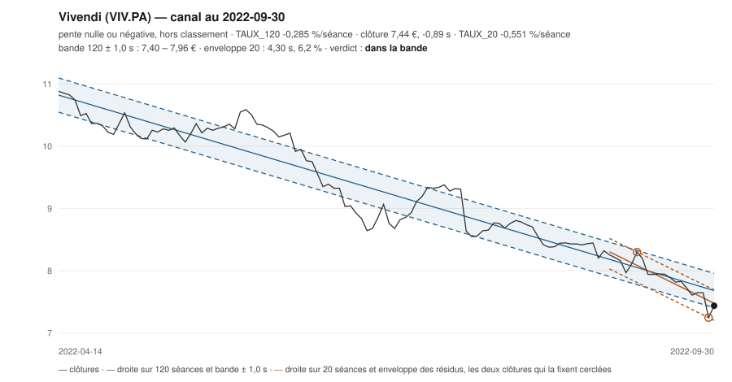

> Hors classement · TAUX_120 -0,285 %/séance · clôture 7,44 € · bande 7,40 – 7,96 € · écart -0,89 s · TAUX_20 -0,551 %/séance · enveloppe 20 : 4,30 s, 6,2 % · **dans la bande**

- Clôture 7,44 €, à −0,89 s, dans la bande de 7,40 à 7,96 €, rentrée ce jour après une unique clôture sous le bord bas la veille (−1,71 s).
- Pente longue −0,285 %/séance ; pente courte −0,551 %/séance, négative depuis 43 séances : concordance.
- Enveloppe de 4,30 s (6,2 % du niveau moyen), la plus large de l'univers en unités de s ; résidu haut le 2022-09-12, résidu bas le 2022-09-29.
- Verdict : dans la bande.

### `SGO.PA` — Saint-Gobain

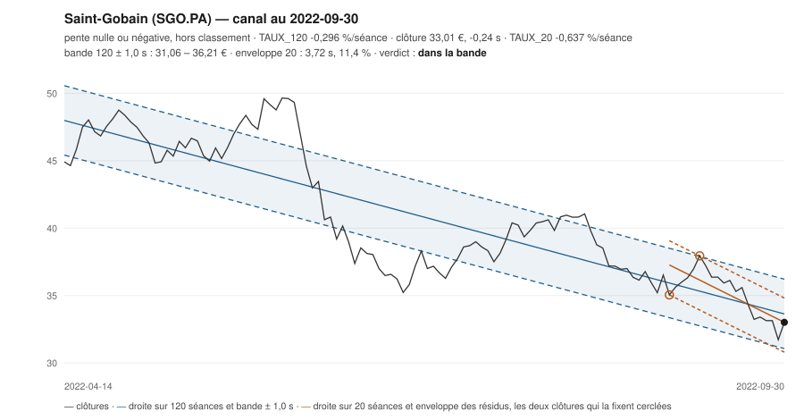

> Hors classement · TAUX_120 -0,296 %/séance · clôture 33,01 € · bande 31,06 – 36,21 € · écart -0,24 s · TAUX_20 -0,637 %/séance · enveloppe 20 : 3,72 s, 11,4 % · **dans la bande**

- Clôture 33,01 €, à −0,24 s, dans la bande de 31,06 à 36,21 € depuis 56 séances ; écart compris entre −0,81 s et +0,81 s sur 20 séances.
- Pente longue −0,296 %/séance, la plus négative de l'univers ; pente courte −0,637 %/séance depuis 29 séances : concordance.
- Enveloppe de 3,72 s (11,4 % du niveau moyen), au niveau attendu ; bornes anciennes, 2022-09-05 (bas) et 2022-09-12 (haut).
- Verdict : dans la bande.

### Les figures des ordres du mois

#### 2022-09-13 — Vente `CA.PA` Carrefour, décision au 2022-09-12

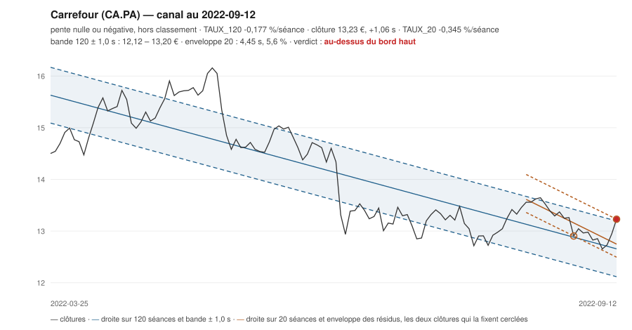

> Hors classement · TAUX_120 -0,177 %/séance · clôture 13,23 € · bande 12,12 – 13,20 € · écart +1,06 s · TAUX_20 -0,345 %/séance · enveloppe 20 : 4,45 s, 5,6 % · **au-dessus du bord haut**

#### 2022-09-26 — Achat `RNO.PA` Renault, décision au 2022-09-23

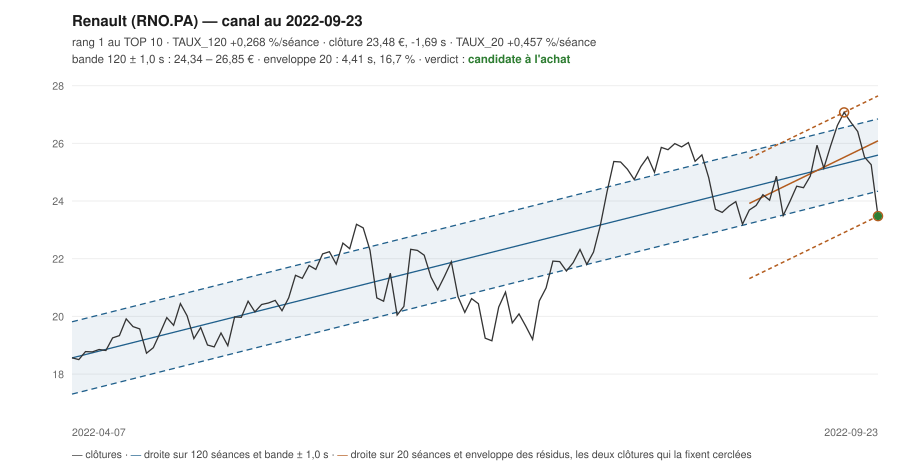

> Rang 1 · TAUX_120 +0,268 %/séance · clôture 23,48 € · bande 24,34 – 26,85 € · écart -1,69 s · TAUX_20 +0,457 %/séance · enveloppe 20 : 4,41 s, 16,7 % · **candidate à l'achat**

#### 2022-09-28 — Achat `ENGI.PA` Engie, décision au 2022-09-27

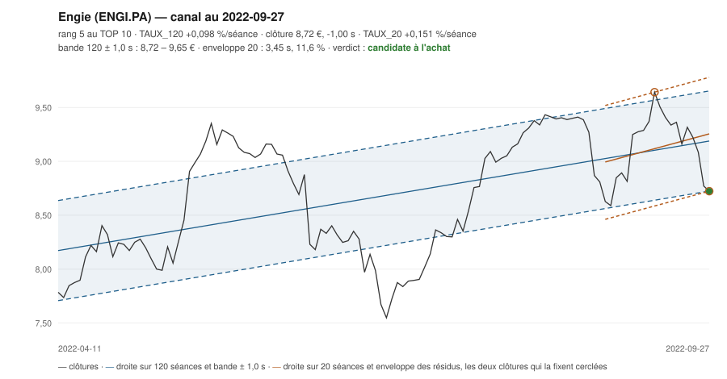

> Rang 5 · TAUX_120 +0,098 %/séance · clôture 8,72 € · bande 8,72 – 9,65 € · écart -1,00 s · TAUX_20 +0,151 %/séance · enveloppe 20 : 3,45 s, 11,6 % · **candidate à l'achat**

## 5. Le TOP 10 au 2022-09-30

| Rang | Valeur | TAUX_120 | Écart | TAUX_20 | Verdict |
|---|---|---|---|---|---|
| 1 | `RNO.PA` Renault | +0,249 %/séance | -1,47 s | -0,128 %/séance | sous le bord bas |
| 2 | `WLN.PA` Worldline | +0,194 %/séance | -1,27 s | -0,502 %/séance | sous le bord bas |
| 3 | `RMS.PA` Hermès International | +0,180 %/séance | -0,89 s | -0,458 %/séance | dans la bande |
| 4 | `MC.PA` LVMH | +0,117 %/séance | -1,40 s | -0,377 %/séance | sous le bord bas |
| 5 | `ENGI.PA` Engie | +0,085 %/séance | -1,14 s | -0,295 %/séance | sous le bord bas |
| 6 | `OR.PA` L'Oréal | +0,058 %/séance | -1,19 s | -0,369 %/séance | sous le bord bas |
| 7 | `KER.PA` Kering | +0,055 %/séance | -2,14 s | -0,644 %/séance | sous le bord bas |
| 8 | `SAF.PA` Safran | +0,043 %/séance | -1,52 s | -0,689 %/séance | sous le bord bas |
| 9 | `STLAP.PA` Stellantis | +0,028 %/séance | -1,40 s | -0,324 %/séance | sous le bord bas |
| 10 | `RI.PA` Pernod Ricard | +0,025 %/séance | +0,23 s | -0,063 %/séance | dans la bande |

**Entrées et sorties du TOP 10 au fil du mois**

| Séance | Entrées | Sorties |
|---|---|---|
| 2022-09-07 | `STLAP.PA` | `BN.PA` |
| 2022-09-09 | `OR.PA` | `ALO.PA` |
| 2022-09-14 | `KER.PA` | `OR.PA` |
| 2022-09-16 | `OR.PA` | `HO.PA` |
| 2022-09-30 | `RI.PA` | `TTE.PA` |

## 6. Les ordres exécutés

> À l'**ouverture** de la séance qui suit la décision, jamais à la clôture qui l'a déclenchée. L'écart d'ouverture est subi, et publié.

| Exécution | Sens | Valeur | Quantité | Prix | Brut | Frais | Écart d'ouverture | Motif |
|---|---|---|---|---|---|---|---|---|
| 2022-09-13 | **Vente** | `CA.PA` Carrefour | 136 | 13,26 € | 1 803,03 € | 2,07 € | +0,21 % | décision au 2022-09-12 : clôture 13,23 € au-dessus du bord haut 13,20 € (+1,06 s) |
| 2022-09-26 | **Achat** | `RNO.PA` Renault | 89 | 23,21 € | 2 065,45 € | 8,57 € | -1,15 % | décision au 2022-09-23 : clôture 23,48 € sous le bord bas 24,34 € (-1,69 s), rang 1, TAUX_120 +0,268 %/séance, TAUX_20 +0,457 %/séance |
| 2022-09-28 | **Achat** | `ENGI.PA` Engie | 238 | 8,69 € | 2 069,20 € | 8,59 € | -0,33 % | décision au 2022-09-27 : clôture 8,72 € sous le bord bas 8,72 € (-1,00 s), rang 5, TAUX_120 +0,098 %/séance, TAUX_20 +0,151 %/séance |

## 7. Les signaux non exécutés

*Aucun : chaque candidat du mois a été acheté.*

## 8. La lecture du mois

Sur le mois, la meilleure contribution vient de `RNO.PA` (Renault) pour **+33,24 €**, la moins bonne de `ORA.PA` (Orange) pour **-155,48 €**. Les 3 ordres du mois ont coûté **19,23 €** de frais, soit 0,192 % de la dotation. Le portefeuille termine le mois **devant TR39** de 3,48 point.

---

[← Août](2022-08.md) · [Protocole](../README.md) · [Octobre →](2022-10.md)
