# Octobre 2022

> Journal de l'[expérience 4](../README.md) · exécutions du 2022-10-03 au 2022-10-31 · **4 ordres**
> Portefeuille au 2022-10-31 : **10 043,18 €** (base 100,43) · TR39 88,42 · alpha du mois **-0,71 pt** · depuis janvier **+12,02 pt**

---

## 1. Les actualités du mois précédent

**Septembre 2022.** Un mois de capitulation. L'inflation américaine d'août,
publiée le 13 septembre, déçoit à nouveau et provoque la pire séance de Wall
Street depuis 2020. La Réserve fédérale relève ses taux de trois quarts de point
pour la troisième fois consécutive, la BCE de trois quarts de point également —
sa plus forte hausse depuis la création de l'euro.

Au Royaume-Uni, le budget non financé du gouvernement Truss provoque une crise
obligataire et l'intervention d'urgence de la Banque d'Angleterre. Nord Stream
est saboté le 26 septembre. Le CAC 40 touche son plus bas de l'année à la fin
du mois.

## 2. L'exposition héritée au 2022-09-30

| Valeur | Achetée le | Prix d'achat | Cours | +/− value | Alpha depuis l'achat |
|---|---|---|---|---|---|
| `HO.PA` Thales | 2022-06-06 | 105,72 € | 104,47 € | **-1,18 %** | +12,51 pt |
| `SAN.PA` Sanofi | 2022-07-04 | 82,42 € | 65,83 € | **-20,14 %** | -16,38 pt |
| `ORA.PA` Orange | 2022-07-07 | 8,65 € | 7,23 € | **-16,41 %** | -11,98 pt |
| `RNO.PA` Renault | 2022-09-26 | 23,21 € | 23,68 € | **+2,02 %** | +2,83 pt |
| `ENGI.PA` Engie | 2022-09-28 | 8,69 € | 8,61 € | **-0,99 %** | -0,47 pt |

## 3. Le portefeuille depuis le 2022-01-03

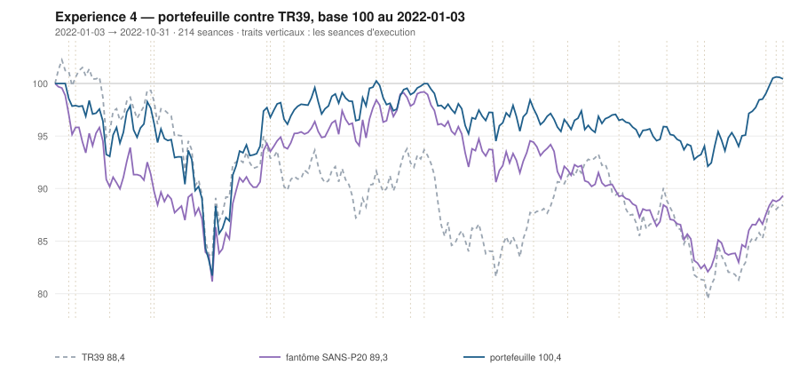

| | |
|---|---|
| Dotation initiale | 10 000,00 € au 2022-01-03 |
| Titres au 2022-10-31 | 2 348,35 € |
| Espèces | 7 694,82 € |
| Lignes détenues | 1 |
| **Total** | **10 043,18 €** |
| Base 100 | **100,43** |
| Fantôme `SANS-P20`, même base | 89,32 |
| TR39, même base | 88,42 |
| Écart depuis janvier | **+12,02 pt** |

### Toutes les positions depuis le début de l'expérience

> Closes comme ouvertes. Aucune séance postérieure au 2022-10-31 n'entre dans ce tableau.

| Société | Prix d'achat | Date d'achat | Prix de vente | Date de vente |
|---|---|---|---|---|
| `CAP.PA` Capgemini | 182,86 € | 2022-01-07 | 181,51 € | 2022-03-30 |
| `EL.PA` EssilorLuxottica | 162,03 € | 2022-01-07 | 153,11 € | 2022-03-30 |
| `RI.PA` Pernod Ricard | 173,52 € | 2022-01-07 | 164,76 € | 2022-03-31 |
| `STMPA.PA` STMicroelectronics | 41,80 € | 2022-01-11 | 39,65 € | 2022-03-30 |
| `BNP.PA` BNP Paribas | 43,84 € | 2022-01-25 | 48,20 € | 2022-02-10 |
| `MC.PA` LVMH | 633,54 € | 2022-02-11 | 558,12 € | 2022-05-31 |
| `SAN.PA` Sanofi | 74,66 € | 2022-03-30 | 77,80 € | 2022-04-06 |
| `TTE.PA` TotalEnergies | 36,38 € | 2022-03-30 | 40,80 € | 2022-05-17 |
| `DG.PA` Vinci | 73,34 € | 2022-04-06 | 77,14 € | 2022-07-20 |
| `CA.PA` Carrefour | 15,17 € | 2022-05-19 | 13,26 € | 2022-09-13 |
| `HO.PA` Thales | 105,72 € | 2022-06-06 | 117,32 € | 2022-10-27 |
| `SAN.PA` Sanofi | 82,42 € | 2022-07-04 | 68,65 € | 2022-10-24 |
| `ORA.PA` Orange | 8,65 € | 2022-07-07 | 7,49 € | 2022-10-31 |
| `TTE.PA` TotalEnergies | 38,39 € | 2022-08-03 | 43,55 € | 2022-08-24 |
| `RNO.PA` Renault | 23,21 € | 2022-09-26 |  |  |
| `ENGI.PA` Engie | 8,69 € | 2022-09-28 | 9,49 € | 2022-10-31 |

*16 positions depuis le début, dont 1 encore ouverte : les deux dernières colonnes restent vides.*

## 4. L'étude chartiste au 2022-10-31

> Une entrée par société de l'univers, sous la figure de canal lue à la clôture du 2022-10-31. La ligne en retrait est **calculée** ; la note qui suit est celle de l'agent `chartiste`, rédigée sans aucune séance postérieure.

### 1. `RNO.PA` — Renault

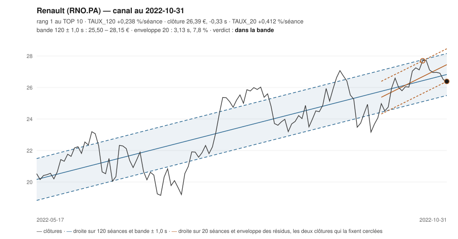

> Rang 1 · TAUX_120 +0,238 %/séance · clôture 26,39 € · bande 25,50 – 28,15 € · écart -0,33 s · TAUX_20 +0,412 %/séance · enveloppe 20 : 3,13 s, 7,8 % · **dans la bande**

- Clôture 26,39 €, à −0,33 s, dans la bande [25,50 ; 28,15] €.
- TAUX_120 +0,238 %/séance, 1re du TOP 10 aux 20 séances ; TAUX_20 +0,412 %/séance. Concordance.
- Enveloppe de 3,13 s (7,8 % de E_20), sous les ~3,7 s attendues. La clôture du jour fixe elle-même la borne basse (20e séance) ; la borne haute est le 20 octobre (13e).
- Dans la bande aux 20 séances de la fenêtre. L'écart a reculé à chacune des sept séances depuis le 20 octobre, de +0,96 s à −0,33 s.
- Verdict : dans la bande.

### 2. `RMS.PA` — Hermès International

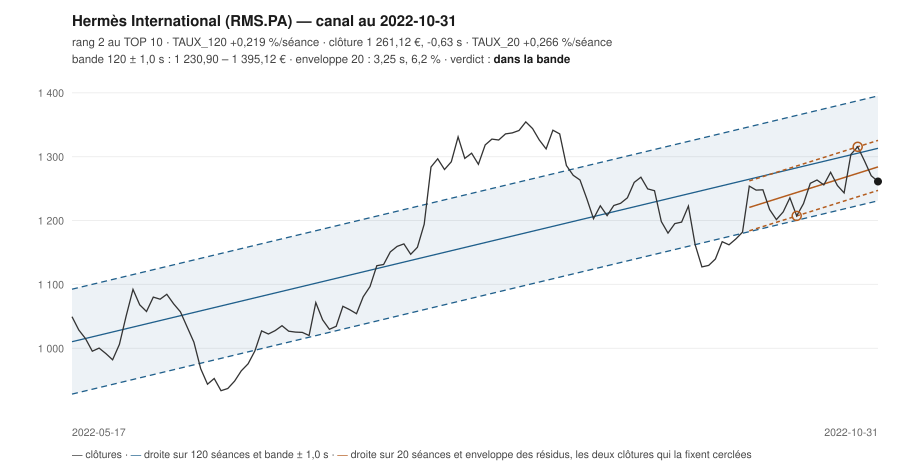

> Rang 2 · TAUX_120 +0,219 %/séance · clôture 1 261,12 € · bande 1 230,90 – 1 395,12 € · écart -0,63 s · TAUX_20 +0,266 %/séance · enveloppe 20 : 3,25 s, 6,2 % · **dans la bande**

- Clôture 1 261,12 € à −0,63 s, dans la bande [1 230,90 ; 1 395,12] €.
- TAUX_120 +0,219 %/séance, 2e du TOP 10 à chacune des 20 séances ; TAUX_20 +0,266 %/séance. Les deux pentes concordent.
- Enveloppe : 3,25 s (6,2 % de E_20), sous les ~3,7 s attendues. Résidu bas le 13 octobre (8e séance), résidu haut le 26 octobre (17e, récent).
- Dans la bande depuis 24 séances. L'écart est resté sur la fenêtre entre −0,95 s (13 octobre) et +0,09 s (26 octobre), toujours dans la moitié basse de la bande à une séance près.
- Verdict : dans la bande.

### 3. `WLN.PA` — Worldline

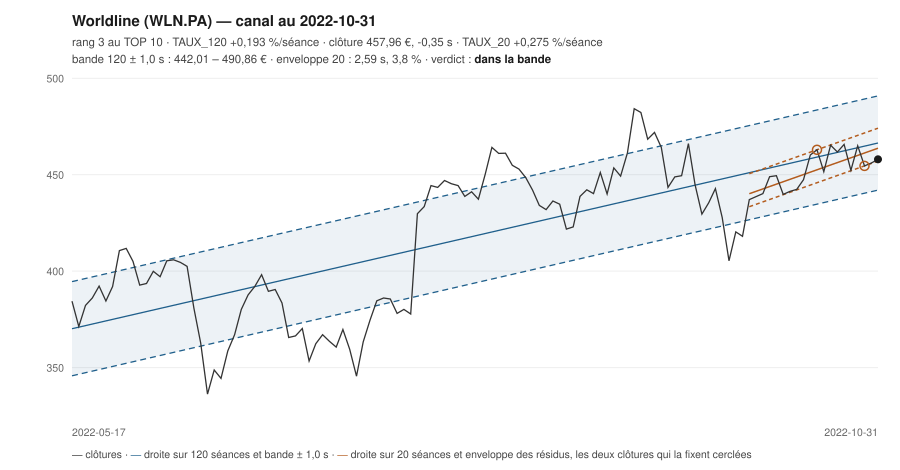

> Rang 3 · TAUX_120 +0,193 %/séance · clôture 457,96 € · bande 442,01 – 490,86 € · écart -0,35 s · TAUX_20 +0,275 %/séance · enveloppe 20 : 2,59 s, 3,8 % · **dans la bande**

- Clôture 457,96 €, à −0,35 s, dans la bande [442,01 ; 490,86] €.
- TAUX_120 +0,193 %/séance, 3e du TOP 10 aux 20 séances ; TAUX_20 +0,275 %/séance. Concordance.
- Enveloppe de 2,59 s (3,8 % de E_20), la plus étroite de l'univers ce jour, loin sous les ~3,7 s attendues. Résidu haut le 18 octobre (11e séance), résidu bas le 27 octobre (18e, récent).
- Dans la bande aux 20 séances ; l'écart n'a pas quitté l'intervalle [−0,59 ; +0,16] s.
- Verdict : dans la bande.

### 4. `PUB.PA` — Publicis

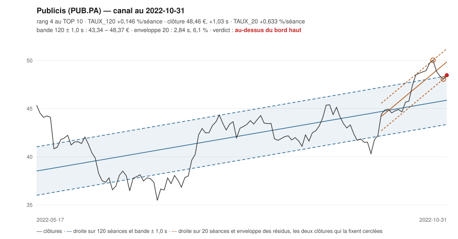

> Rang 4 · TAUX_120 +0,146 %/séance · clôture 48,46 € · bande 43,34 – 48,37 € · écart +1,03 s · TAUX_20 +0,633 %/séance · enveloppe 20 : 2,84 s, 6,1 % · **au-dessus du bord haut**

- Clôture 48,46 €, à +1,03 s : 9 centimes au-dessus du bord haut de la bande [43,34 ; 48,37] €.
- TAUX_120 +0,146 %/séance, 4e du TOP 10 ; TAUX_20 +0,633 %/séance. Concordance à la hausse.
- Enveloppe de 2,84 s (6,1 % de E_20), bien sous les ~3,7 s attendues. Ses deux bornes sont récentes : résidu haut le 25 octobre (16e séance), résidu bas le 28 octobre (19e).
- Au-dessus du bord haut du 13 au 27 octobre (+1,95 s le 24), une séance dans la bande le 28, de nouveau au-dessus ce jour. Pente longue positive depuis le 7 octobre, entrée au TOP 10 le 13, 4e depuis le 25.
- Verdict : au-dessus du bord haut.

### 5. `MC.PA` — LVMH

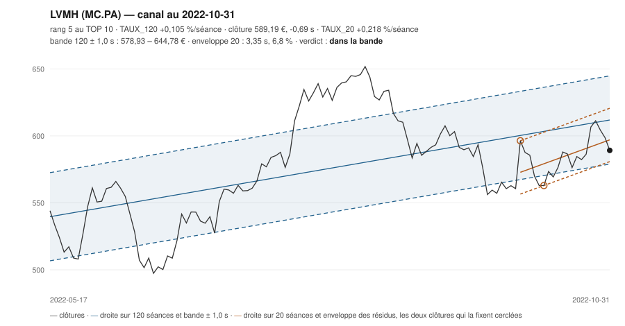

> Rang 5 · TAUX_120 +0,105 %/séance · clôture 589,19 € · bande 578,93 – 644,78 € · écart -0,69 s · TAUX_20 +0,218 %/séance · enveloppe 20 : 3,35 s, 6,8 % · **dans la bande**

- Clôture 589,19 €, à −0,69 s, dans la bande [578,93 ; 644,78] €.
- TAUX_120 +0,105 %/séance, 5e du TOP 10 (4e jusqu'au 24 octobre) ; TAUX_20 +0,218 %/séance. Les pentes concordent.
- Enveloppe de 3,35 s (6,8 % de E_20), sous les ~3,7 s attendues. Deux clôtures anciennes la fixent : 4 octobre (1re séance, haut) et 11 octobre (6e, bas).
- Sous le bord bas du 7 au 14 octobre, puis le 19. Ce jour-là, elle était candidate : −1,11 s, rang 4, pente courte positive. Dans la bande depuis 8 séances, son écart est revenu de −0,02 s (26 octobre) à −0,69 s.
- Verdict : dans la bande.

### 6. `SAF.PA` — Safran

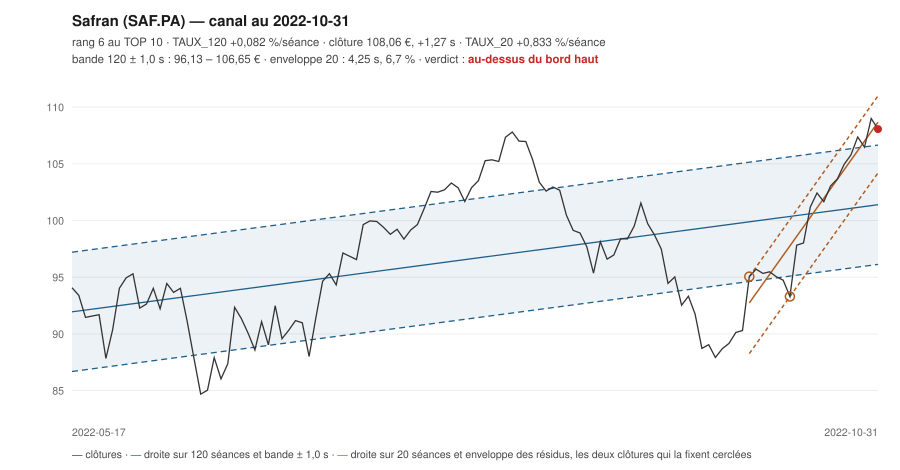

> Rang 6 · TAUX_120 +0,082 %/séance · clôture 108,06 € · bande 96,13 – 106,65 € · écart +1,27 s · TAUX_20 +0,833 %/séance · enveloppe 20 : 4,25 s, 6,7 % · **au-dessus du bord haut**

- Clôture 108,06 €, à +1,27 s, au-dessus de la bande [96,13 ; 106,65] €.
- TAUX_120 +0,082 %/séance, 6e du TOP 10, et TAUX_20 +0,833 %/séance : les deux pentes montent.
- Enveloppe de 4,25 s (6,7 % de E_20), au-dessus des ~3,7 s attendues, fixée par les clôtures anciennes du 4 octobre (1re séance, haut) et du 12 octobre (7e, bas).
- Le 12 octobre, seule séance de la fenêtre sous le bord bas (−1,03 s), elle était candidate. La bande a ensuite été traversée en 8 séances ; au-dessus du bord haut depuis le 25 octobre (5 séances).
- Verdict : au-dessus du bord haut.

### 7. `CS.PA` — AXA

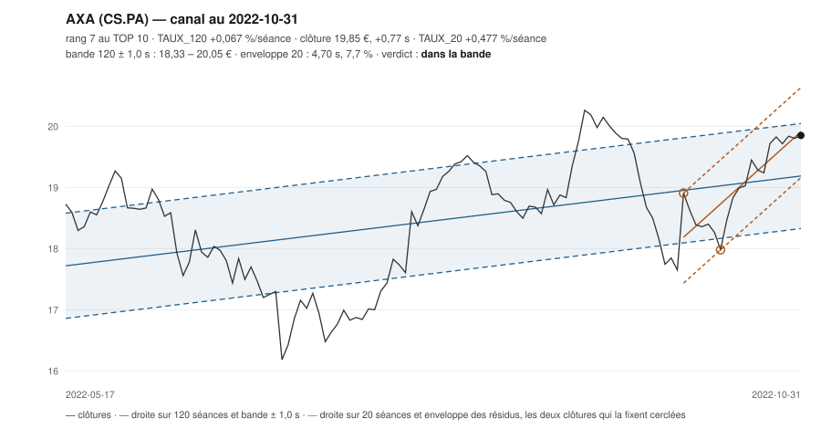

> Rang 7 · TAUX_120 +0,067 %/séance · clôture 19,85 € · bande 18,33 – 20,05 € · écart +0,77 s · TAUX_20 +0,477 %/séance · enveloppe 20 : 4,70 s, 7,7 % · **dans la bande**

- Clôture 19,85 €, à +0,77 s, dans la bande [18,33 ; 20,05] €.
- TAUX_120 +0,067 %/séance, 7e du TOP 10, et TAUX_20 +0,477 %/séance : les deux pentes concordent à la hausse.
- Enveloppe de 4,70 s (7,7 % de E_20), la plus large de l'univers ce jour en unités de s, au-dessus des ~3,7 s attendues. Deux clôtures anciennes la fixent : le 4 octobre (1re séance, haut) et le 12 octobre (7e, bas).
- Dans la bande depuis 27 séances, écart compris entre −0,88 et +0,94 s sur la fenêtre. Entrée dans le TOP 10 le 5 octobre (rang 10), elle est 7e depuis le 21.
- Verdict : dans la bande.

### 8. `EL.PA` — EssilorLuxottica

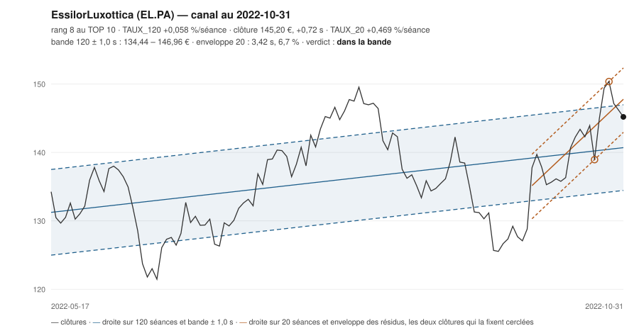

> Rang 8 · TAUX_120 +0,058 %/séance · clôture 145,20 € · bande 134,44 – 146,96 € · écart +0,72 s · TAUX_20 +0,469 %/séance · enveloppe 20 : 3,42 s, 6,7 % · **dans la bande**

- Clôture 145,20 €, à +0,72 s, dans la bande [134,44 ; 146,96] €.
- TAUX_120 +0,058 %/séance, 8e du TOP 10 ; TAUX_20 +0,469 %/séance. Les deux pentes concordent.
- Enveloppe de 3,42 s (6,7 % de E_20), un peu sous les ~3,7 s attendues. Fait rare, ses deux bornes sont récentes : résidu bas le 21 octobre (14e séance), résidu haut le 26 octobre (17e).
- Au-dessus du bord haut du 25 au 27 octobre (+1,69 s le 26), elle est revenue dans la bande depuis 2 séances. Sa pente longue est positive depuis le 6 octobre, et elle est entrée dans le TOP 10 le 21.
- Verdict : dans la bande.

### 9. `ENGI.PA` — Engie

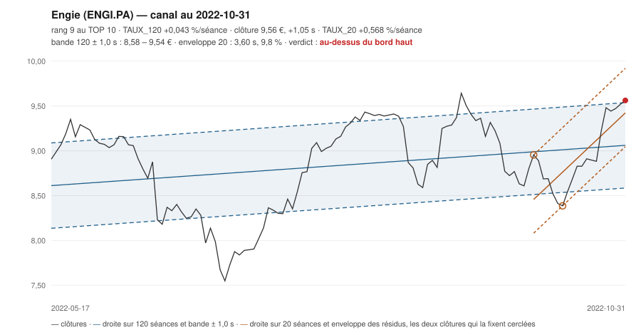

> Rang 9 · TAUX_120 +0,043 %/séance · clôture 9,56 € · bande 8,58 – 9,54 € · écart +1,05 s · TAUX_20 +0,568 %/séance · enveloppe 20 : 3,60 s, 9,8 % · **au-dessus du bord haut**

- Clôture 9,56 €, à +1,05 s, au-dessus du bord haut de la bande [8,58 ; 9,54] €.
- TAUX_120 +0,043 %/séance, 9e du TOP 10, et TAUX_20 +0,568 %/séance : concordance à la hausse.
- Enveloppe de 3,60 s (9,8 % de E_20), proche des ~3,7 s attendues. Ses bornes sont les deux clôtures anciennes du 4 octobre (1re séance, haut) et du 12 octobre (7e, bas).
- Sous le bord bas du 10 au 13 octobre, alors qu'elle était 5e à 7e du classement, mais avec une pente courte encore négative. L'écart a gagné de −1,39 s (11 octobre) à +1,05 s, au-dessus du bord haut depuis 2 séances.
- Verdict : au-dessus du bord haut.

### 10. `RI.PA` — Pernod Ricard

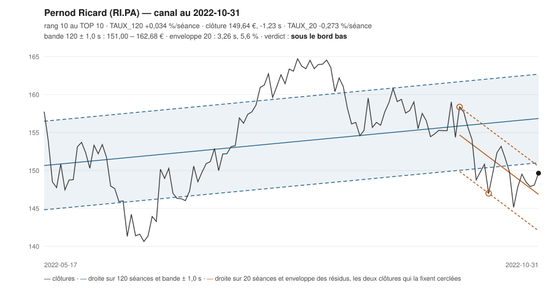

> Rang 10 · TAUX_120 +0,034 %/séance · clôture 149,64 € · bande 151,00 – 162,68 € · écart -1,23 s · TAUX_20 -0,273 %/séance · enveloppe 20 : 3,26 s, 5,6 % · **sous le bord bas**

- Clôture 149,64 €, à −1,23 s, sous le bord bas de la bande [151,00 ; 162,68] €.
- TAUX_120 +0,034 %/séance, 10e et dernière place du TOP 10 ; TAUX_20 −0,273 %/séance. Les pentes s'opposent, et la pente courte est négative aux 20 séances de la fenêtre.
- Enveloppe de 3,26 s (5,6 % de E_20), sous les ~3,7 s attendues ; bornes anciennes, 4 octobre (1re séance, haut) et 13 octobre (8e, bas).
- Sous le bord bas de son canal du jour depuis le 19 octobre (9 séances), après un premier passage du 10 au 17 ; −2,29 s au plus bas le 21. Son rang a oscillé entre 8 et 11.
- Verdict : sous le bord bas sans être candidate, pente courte ≤ 0 (rang 10, dans le TOP 10).

### 11. `OR.PA` — L'Oréal

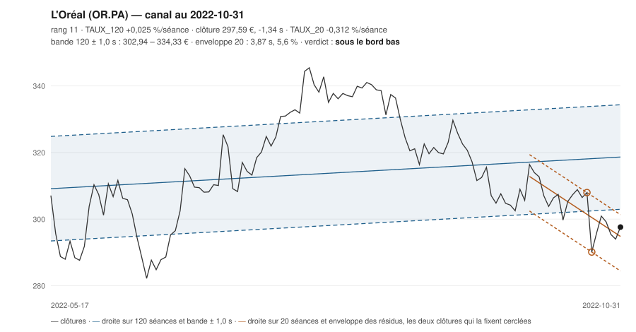

> Rang 11 · TAUX_120 +0,025 %/séance · clôture 297,59 € · bande 302,94 – 334,33 € · écart -1,34 s · TAUX_20 -0,312 %/séance · enveloppe 20 : 3,87 s, 5,6 % · **sous le bord bas**

- Clôture 297,59 €, à −1,34 s, sous le bord bas de la bande [302,94 ; 334,33] €.
- Pente longue positive (TAUX_120 +0,025 %/séance) mais au rang 11, sortie du TOP 10 le 26 octobre ; pente courte négative (TAUX_20 −0,312 %/séance). Les deux pentes divergent.
- Enveloppe de 3,87 s (5,6 % de E_20), proche des ~3,7 s attendues. Ses deux bornes sont deux séances consécutives au milieu de la fenêtre : résidu haut le 20 octobre (13e), résidu bas le 21 (14e).
- Sous le bord bas de son canal du jour depuis le 7 octobre, soit 17 séances, avec −2,23 s le 21. Elle a été candidate le 20 octobre, seule séance de la fenêtre où sa pente courte était positive.
- Verdict : sous le bord bas sans être candidate, hors TOP 10 (rang 11) et pente courte ≤ 0.

### 12. `HO.PA` — Thales

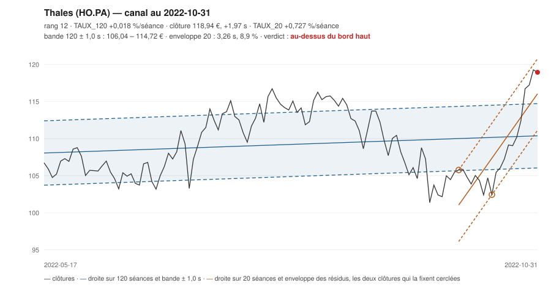

> Rang 12 · TAUX_120 +0,018 %/séance · clôture 118,94 € · bande 106,04 – 114,72 € · écart +1,97 s · TAUX_20 +0,727 %/séance · enveloppe 20 : 3,26 s, 8,9 % · **au-dessus du bord haut**

- Clôture 118,94 €, à +1,97 s, au-dessus de la bande [106,04 ; 114,72] €.
- Pente longue positive mais faible (TAUX_120 +0,018 %/séance), rang 12, donc hors TOP 10 ; pente courte +0,727 %/séance. Les signes concordent.
- Enveloppe de 3,26 s (8,9 % de E_20), sous les ~3,7 s attendues. Résidu haut le 4 octobre (1re séance), résidu bas le 14 octobre (9e).
- Sous le bord bas jusqu'au 14 octobre (−1,78 s le 12), au rang 13, elle a traversé la bande en 7 séances et se tient au-dessus du bord haut depuis le 26 octobre (4 séances).
- Verdict : au-dessus du bord haut.

### 13. `SU.PA` — Schneider Electric

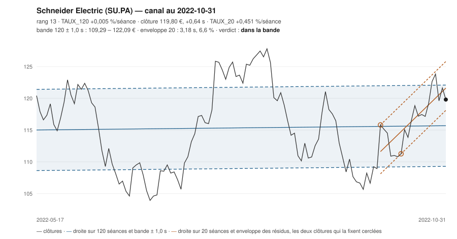

> Rang 13 · TAUX_120 +0,005 %/séance · clôture 119,80 € · bande 109,29 – 122,09 € · écart +0,64 s · TAUX_20 +0,451 %/séance · enveloppe 20 : 3,18 s, 6,6 % · **dans la bande**

- Clôture 119,80 €, à +0,64 s, dans la bande [109,29 ; 122,09] €.
- TAUX_120 +0,005 %/séance, positive depuis le 28 octobre, rang 13 ; TAUX_20 +0,451 %/séance. Signes concordants, pente longue presque nulle.
- Enveloppe de 3,18 s (6,6 % de E_20), sous les ~3,7 s attendues ; bornes anciennes, 4 octobre (1re séance, haut) et 12 octobre (7e, bas).
- Au-dessus du bord haut les 25 et 26 octobre (+1,37 s le 26), dans la bande depuis 3 séances. Aucune clôture sous le bord bas sur la fenêtre (−0,42 s au plus bas).
- Verdict : dans la bande.

### 14. `TTE.PA` — TotalEnergies

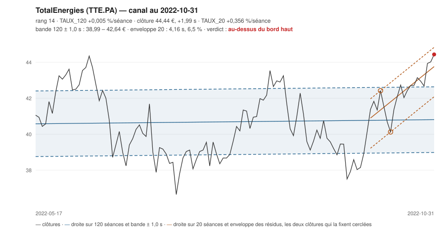

> Rang 14 · TAUX_120 +0,005 %/séance · clôture 44,44 € · bande 38,99 – 42,64 € · écart +1,99 s · TAUX_20 +0,356 %/séance · enveloppe 20 : 4,16 s, 6,5 % · **au-dessus du bord haut**

- Clôture 44,44 €, à +1,99 s, au-dessus de la bande [38,99 ; 42,64] €.
- TAUX_120 +0,005 %/séance, rang 14 : pente longue négative du 12 au 27 octobre, redevenue positive le 28. TAUX_20 +0,356 %/séance. Signes concordants.
- Enveloppe : 4,16 s (6,5 % de E_20), au-dessus des ~3,7 s attendues. Ses deux bornes sont anciennes : résidu haut le 7 octobre (4e séance), résidu bas le 12 octobre (7e).
- Au-dessus du bord haut de son canal du jour depuis le 14 octobre, soit 12 séances. L'écart du jour est le maximum de la fenêtre.
- Verdict : au-dessus du bord haut.

### 15. `STLAP.PA` — Stellantis

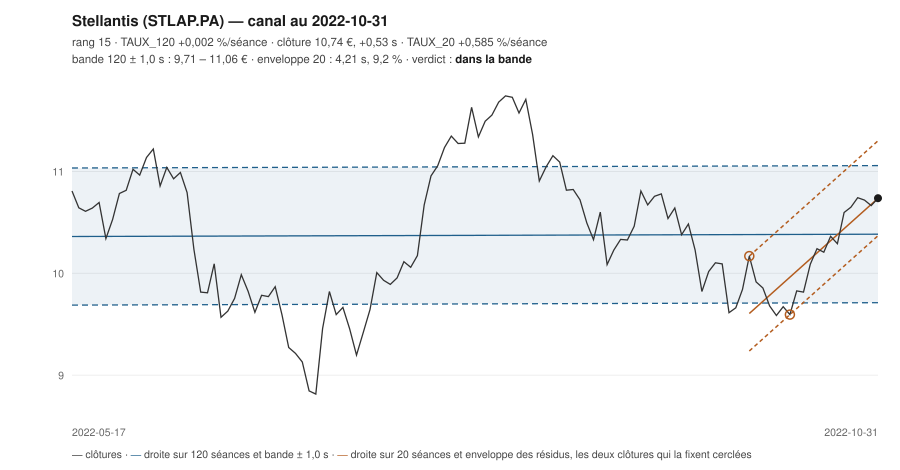

> Rang 15 · TAUX_120 +0,002 %/séance · clôture 10,74 € · bande 9,71 – 11,06 € · écart +0,53 s · TAUX_20 +0,585 %/séance · enveloppe 20 : 4,21 s, 9,2 % · **dans la bande**

- Clôture 10,74 € à +0,53 s, dans la bande [9,71 ; 11,06] €.
- Pente longue à peine positive (TAUX_120 +0,002 %/séance), rang 15, hors TOP 10. Elle a été négative du 17 au 28 octobre et 10e le 4 octobre. Pente courte +0,585 %/séance : les signes concordent.
- Enveloppe de 4,21 s (9,2 % de E_20), au-dessus des ~3,7 s attendues ; ses bornes sont anciennes, 4 octobre (1re séance, haut) et 12 octobre (7e, bas).
- Sous le bord bas de son canal du jour du 6 au 12 octobre (−1,32 s le 10), au rang 11 à 14. Dans la bande depuis 13 séances.
- Verdict : dans la bande.

### `DG.PA` — Vinci

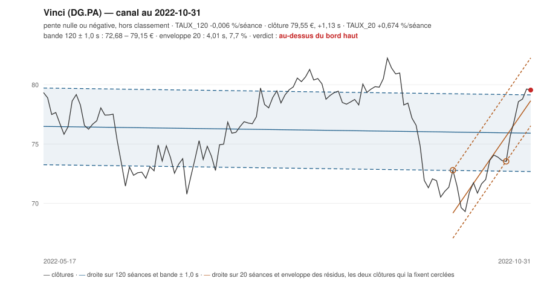

> Hors classement · TAUX_120 -0,006 %/séance · clôture 79,55 € · bande 72,68 – 79,15 € · écart +1,13 s · TAUX_20 +0,674 %/séance · enveloppe 20 : 4,01 s, 7,7 % · **au-dessus du bord haut**

- Clôture 79,55 €, à +1,13 s, au-dessus de la bande à 120 séances [72,68 ; 79,15] €.
- Pente longue quasi nulle mais négative (TAUX_120 −0,006 %/séance), hors classement depuis le 5 octobre ; pente courte positive (+0,674 %/séance). Pas de concordance.
- Enveloppe de 4,01 s (7,7 % de E_20), au-dessus des ~3,7 s attendues. Sa borne haute est la 1re séance (4 octobre), sa borne basse le 21 octobre (14e séance).
- La bande a été traversée en 9 séances : sous le bord bas jusqu'au 14 octobre (−2,31 s le 6), dans la bande du 17 au 27, au-dessus depuis le 28 (2 séances).
- Verdict : au-dessus du bord haut.

### `STMPA.PA` — STMicroelectronics

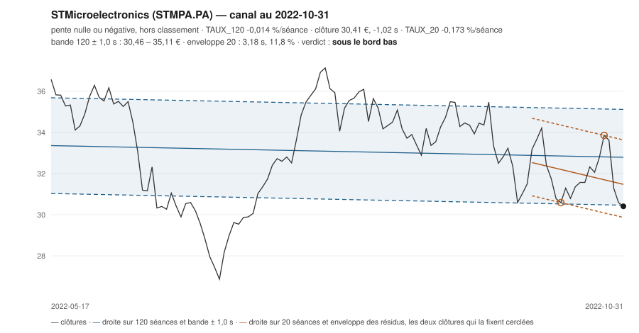

> Hors classement · TAUX_120 -0,014 %/séance · clôture 30,41 € · bande 30,46 – 35,11 € · écart -1,02 s · TAUX_20 -0,173 %/séance · enveloppe 20 : 3,18 s, 11,8 % · **sous le bord bas**

- Clôture 30,41 €, à −1,02 s, 5 centimes sous le bord bas de la bande [30,46 ; 35,11] €.
- Pente longue négative depuis le 12 octobre (TAUX_120 −0,014 %/séance, hors classement), pente courte négative (TAUX_20 −0,173 %/séance) : concordance à la baisse.
- Enveloppe de 3,18 s (11,8 % de E_20), sous les ~3,7 s attendues. Résidu bas le 12 octobre (7e séance), résidu haut le 25 octobre (16e).
- L'écart est passé de +0,41 s le 25 octobre à −1,02 s ce jour, en quatre séances. Aucune clôture sous le bord bas depuis le 14 octobre ; elle y avait déjà été les 11 et 12.
- Verdict : sous le bord bas sans être candidate, hors TOP 10 (pente longue négative) et pente courte ≤ 0.

### `GLE.PA` — Société Générale

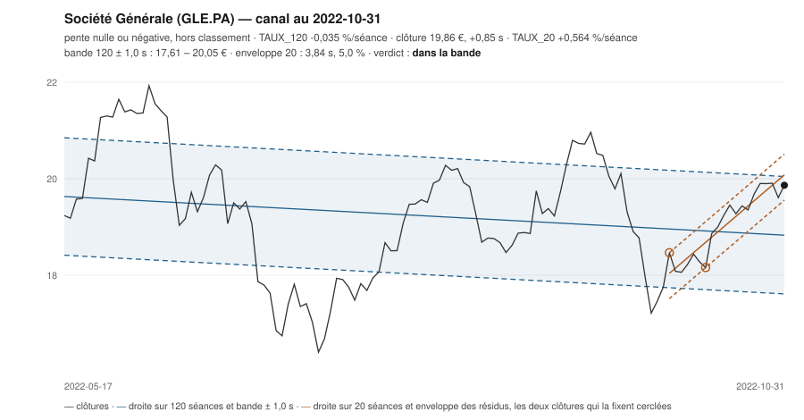

> Hors classement · TAUX_120 -0,035 %/séance · clôture 19,86 € · bande 17,61 – 20,05 € · écart +0,85 s · TAUX_20 +0,564 %/séance · enveloppe 20 : 3,84 s, 5,0 % · **dans la bande**

- Clôture 19,86 €, à +0,85 s, dans la bande [17,61 ; 20,05] €.
- TAUX_120 −0,035 %/séance (hors classement) contre TAUX_20 +0,564 %/séance : pentes de signes opposés.
- Enveloppe de 3,84 s (5,0 % de E_20), conforme aux ~3,7 s attendues. Ses deux bornes sont anciennes : 4 octobre (1re séance, haut), 12 octobre (7e, bas).
- Dans la bande aux 20 séances de la fenêtre. L'écart est allé de −0,76 s (5 octobre) à +0,90 s (25 au 27 octobre).
- Verdict : dans la bande.

### `KER.PA` — Kering

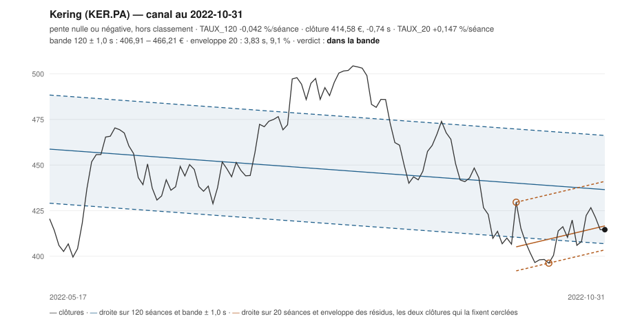

> Hors classement · TAUX_120 -0,042 %/séance · clôture 414,58 € · bande 406,91 – 466,21 € · écart -0,74 s · TAUX_20 +0,147 %/séance · enveloppe 20 : 3,83 s, 9,1 % · **dans la bande**

- Clôture 414,58 € à −0,74 s, dans la bande [406,91 ; 466,21] €.
- TAUX_120 −0,042 %/séance : pente longue négative depuis le 21 octobre, hors classement. TAUX_20 +0,147 %/séance, positive depuis 5 séances. Les deux horizons divergent.
- Enveloppe : 3,83 s (9,1 % de E_20), proche des ~3,7 s attendues ; bornes anciennes, 4 octobre (1re séance, en haut) et 13 octobre (8e, en bas).
- Sous le bord bas de son canal du jour presque tout le mois (−2,24 s le 10 octobre), au rang 7 à 12 puis hors classement, avec une pente courte négative jusqu'au 24. Dans la bande depuis le 25 octobre (5 séances).
- Verdict : dans la bande.

### `DSY.PA` — Dassault Systèmes

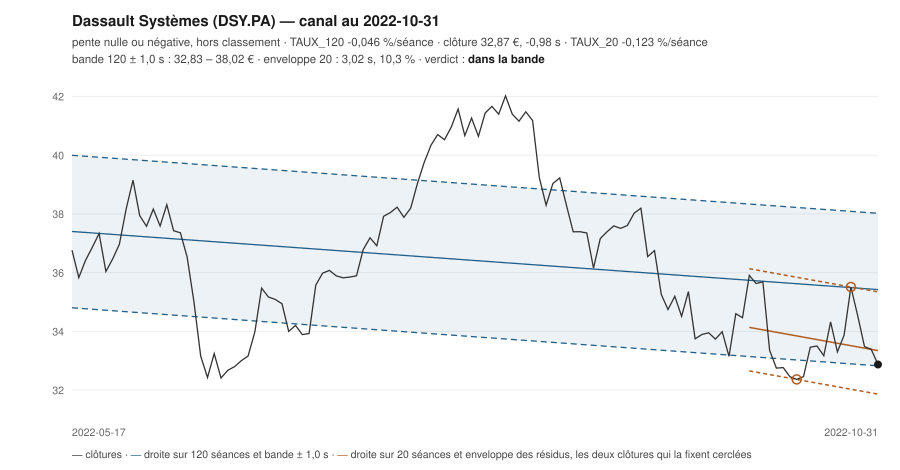

> Hors classement · TAUX_120 -0,046 %/séance · clôture 32,87 € · bande 32,83 – 38,02 € · écart -0,98 s · TAUX_20 -0,123 %/séance · enveloppe 20 : 3,02 s, 10,3 % · **dans la bande**

- Clôture 32,87 €, à −0,98 s : dans la bande [32,83 ; 38,02] €, à 4 centimes du bord bas.
- Pente longue négative (TAUX_120 −0,046 %/séance, hors classement), pente courte négative (TAUX_20 −0,123 %/séance) : les deux concordent à la baisse. La pente courte est négative aux 20 séances de la fenêtre.
- Enveloppe de 3,02 s (10,3 % de E_20), sous les ~3,7 s attendues. Résidu bas le 13 octobre (8e séance), résidu haut le 25 octobre (16e), récent.
- Sous le bord bas de son canal du jour du 7 au 19 octobre, puis le 21, elle est dans la bande depuis 6 séances, sans jamais dépasser −0,11 s sur la fenêtre.
- Verdict : dans la bande.

### `CAP.PA` — Capgemini

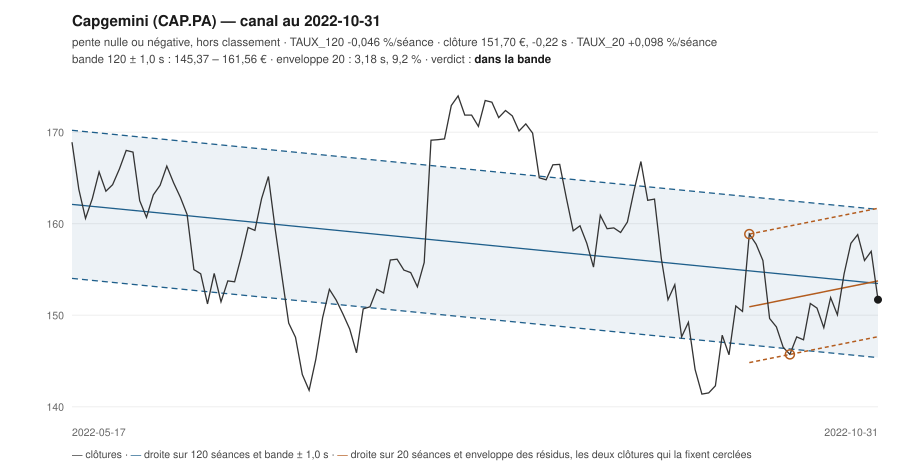

> Hors classement · TAUX_120 -0,046 %/séance · clôture 151,70 € · bande 145,37 – 161,56 € · écart -0,22 s · TAUX_20 +0,098 %/séance · enveloppe 20 : 3,18 s, 9,2 % · **dans la bande**

- Clôture 151,70 € à −0,22 s, au cœur de la bande [145,37 ; 161,56] €.
- TAUX_120 −0,046 %/séance (hors classement) contre TAUX_20 +0,098 %/séance : deux pentes proches de zéro, de signes opposés.
- L'enveloppe mesure 3,18 s (9,2 % de E_20), sous les ~3,7 s attendues. Ses bornes sont anciennes : le 4 octobre (1re séance, en haut) et le 12 octobre (7e, en bas).
- Dans la bande depuis 22 séances. Sur la fenêtre, l'écart a oscillé entre −0,99 s (12 octobre) et +0,67 s (26 octobre) sans toucher aucun des deux bords.
- Verdict : dans la bande.

### `AIR.PA` — Airbus

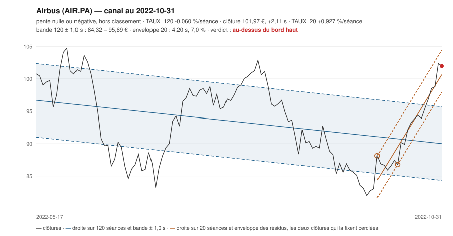

> Hors classement · TAUX_120 -0,060 %/séance · clôture 101,97 € · bande 84,32 – 95,69 € · écart +2,11 s · TAUX_20 +0,927 %/séance · enveloppe 20 : 4,20 s, 7,0 % · **au-dessus du bord haut**

- Clôture 101,97 €, à +2,11 s de la droite longue, au-dessus de la bande [84,32 ; 95,69] €.
- Pente longue légèrement négative (TAUX_120 −0,060 %/séance, hors classement), pente courte vigoureuse (TAUX_20 +0,927 %/séance) : elles ne concordent pas.
- Enveloppe de 4,20 s (7,0 % de E_20), au-dessus des ~3,7 s attendues, fixée par deux clôtures anciennes : le 4 octobre (1re séance, résidu haut) et le 12 octobre (7e, résidu bas).
- L'écart est monté de −0,54 s le 7 octobre à +2,28 s le 28. La clôture est au-dessus du bord haut de son canal du jour depuis le 18 octobre, soit 10 séances consécutives.
- Verdict : au-dessus du bord haut.

### `ACA.PA` — Crédit Agricole

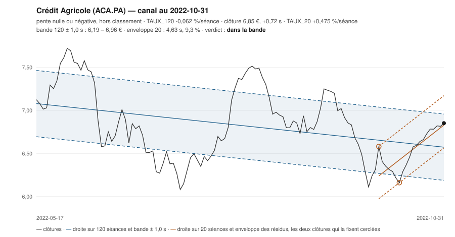

> Hors classement · TAUX_120 -0,062 %/séance · clôture 6,85 € · bande 6,19 – 6,96 € · écart +0,72 s · TAUX_20 +0,475 %/séance · enveloppe 20 : 4,63 s, 9,3 % · **dans la bande**

- Clôture 6,85 € à +0,72 s de la droite ajustée sur 120 séances, dans la bande [6,19 ; 6,96] €.
- Pente longue négative (TAUX_120 −0,062 %/séance), donc hors classement ; la pente courte monte, à +0,475 %/séance. Les deux canaux sont de signe opposé.
- Enveloppe des 20 résidus : 4,63 s (9,3 % de E_20), nettement au-dessus des ~3,7 s attendues. Deux clôtures anciennes la fixent : le 4 octobre (1re séance, résidu haut) et le 12 octobre (7e, résidu bas).
- Sous le bord bas de son canal du jour du 7 au 12 octobre (−1,25 s le 12), elle est dans la bande depuis 13 séances. Son écart est passé de −1,25 s à +0,72 s, le plus haut de la fenêtre.
- Verdict : dans la bande.

### `LR.PA` — Legrand

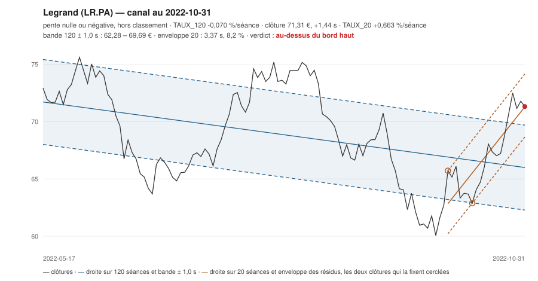

> Hors classement · TAUX_120 -0,070 %/séance · clôture 71,31 € · bande 62,28 – 69,69 € · écart +1,44 s · TAUX_20 +0,663 %/séance · enveloppe 20 : 3,37 s, 8,2 % · **au-dessus du bord haut**

- Clôture 71,31 €, à +1,44 s, au-dessus de la bande à 120 séances [62,28 ; 69,69] €.
- Pente longue négative (TAUX_120 −0,070 %/séance, hors classement) ; pente courte positive (+0,663 %/séance). Pas de concordance.
- Enveloppe de 3,37 s (8,2 % de E_20), sous les ~3,7 s attendues, fixée par le 4 octobre (1re séance, haut) et le 12 octobre (7e, bas).
- Aucune clôture sous le bord bas sur la fenêtre (−0,66 s au plus bas). Au-dessus du bord haut depuis 5 séances, avec un maximum de +1,92 s le 26 octobre.
- Verdict : au-dessus du bord haut.

### `BNP.PA` — BNP Paribas

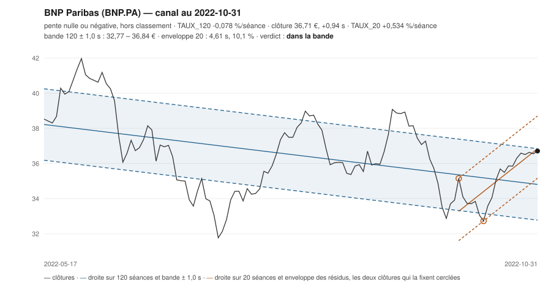

> Hors classement · TAUX_120 -0,078 %/séance · clôture 36,71 € · bande 32,77 – 36,84 € · écart +0,94 s · TAUX_20 +0,534 %/séance · enveloppe 20 : 4,61 s, 10,1 % · **dans la bande**

- Clôture 36,71 €, à +0,94 s, dans la bande [32,77 ; 36,84] €, à 13 centimes du bord haut.
- TAUX_120 −0,078 %/séance, pente longue négative et hors classement ; TAUX_20 +0,534 %/séance. Les deux pentes s'opposent.
- Enveloppe : 4,61 s (10,1 % de E_20), au-dessus des ~3,7 s attendues. Elle tient à deux clôtures anciennes, le 4 octobre (1re séance, haut) et le 12 octobre (7e, bas).
- Sous le bord bas les 11 et 12 octobre (−1,16 s au plus bas), elle est dans la bande depuis le 13. Depuis le 25 octobre, l'écart se maintient entre +0,87 et +0,94 s.
- Verdict : dans la bande.

### `BN.PA` — Danone

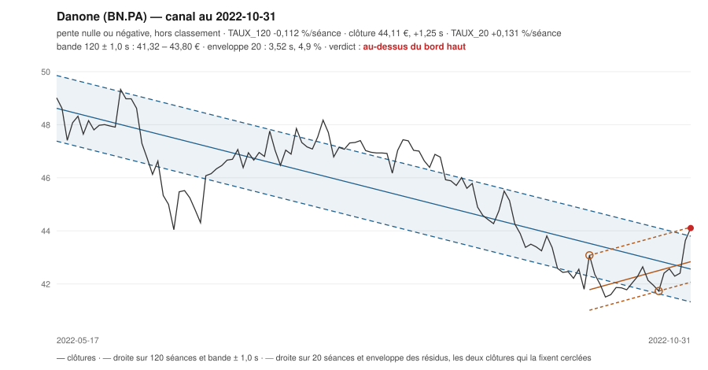

> Hors classement · TAUX_120 -0,112 %/séance · clôture 44,11 € · bande 41,32 – 43,80 € · écart +1,25 s · TAUX_20 +0,131 %/séance · enveloppe 20 : 3,52 s, 4,9 % · **au-dessus du bord haut**

- Clôture 44,11 € à +1,25 s, juste au-dessus du bord haut (bande [41,32 ; 43,80] €).
- Pente longue négative (TAUX_120 −0,112 %/séance, hors classement) ; pente courte faiblement positive (+0,131 %/séance), et positive depuis 4 séances seulement. Pas de concordance.
- Enveloppe de 3,52 s (4,9 % de E_20), un peu sous les ~3,7 s attendues. Sa borne haute est la 1re séance (4 octobre), sa borne basse le 21 octobre (14e), dans le dernier tiers de la fenêtre.
- Sous le bord bas de son canal du jour jusqu'au 14 octobre (−2,00 s le 7), dans la bande du 17 au 28, elle passe au-dessus du bord haut ce 31 octobre pour la première fois de la fenêtre.
- Verdict : au-dessus du bord haut.

### `EN.PA` — Bouygues

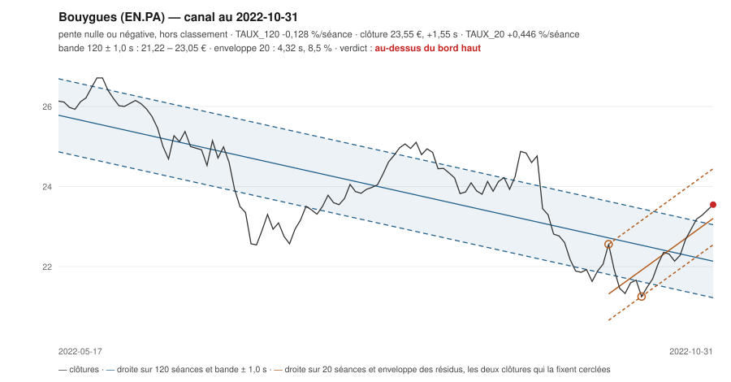

> Hors classement · TAUX_120 -0,128 %/séance · clôture 23,55 € · bande 21,22 – 23,05 € · écart +1,55 s · TAUX_20 +0,446 %/séance · enveloppe 20 : 4,32 s, 8,5 % · **au-dessus du bord haut**

- Clôture 23,55 € à +1,55 s, au-dessus de la bande à 120 séances [21,22 ; 23,05] €.
- Pente longue négative (TAUX_120 −0,128 %/séance), hors classement ; pente courte positive (+0,446 %/séance). Elles divergent.
- Enveloppe : 4,32 s (8,5 % de E_20), au-dessus des ~3,7 s attendues ; bornes anciennes, 4 octobre (1re séance, haut) et 12 octobre (7e, bas).
- Sous le bord bas du 5 au 13 octobre (−1,61 s le 7), 8 séances dans la bande, puis au-dessus depuis le 26. L'écart a progressé à chacune des sept séances depuis le 20 octobre (−0,08 s), jusqu'à +1,55 s ce jour.
- Verdict : au-dessus du bord haut.

### `TEP.PA` — Teleperformance

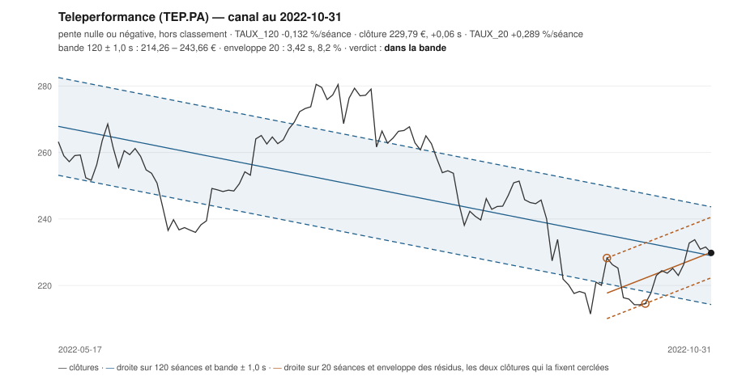

> Hors classement · TAUX_120 -0,132 %/séance · clôture 229,79 € · bande 214,26 – 243,66 € · écart +0,06 s · TAUX_20 +0,289 %/séance · enveloppe 20 : 3,42 s, 8,2 % · **dans la bande**

- Clôture 229,79 €, à +0,06 s, pratiquement sur la droite ajustée ; bande [214,26 ; 243,66] €.
- Pente longue négative (TAUX_120 −0,132 %/séance, hors classement), pente courte positive (+0,289 %/séance) : les deux horizons s'opposent.
- Enveloppe de 3,42 s (8,2 % de E_20), sous les ~3,7 s attendues. Résidu haut le 4 octobre (1re séance), résidu bas le 13 octobre (8e).
- Sous le bord bas de son canal du jour du 7 au 14 octobre (−1,46 s le 11), dans la bande depuis 11 séances. Depuis le 25 octobre, l'écart se tient entre +0,06 et +0,25 s.
- Verdict : dans la bande.

### `VIE.PA` — Veolia

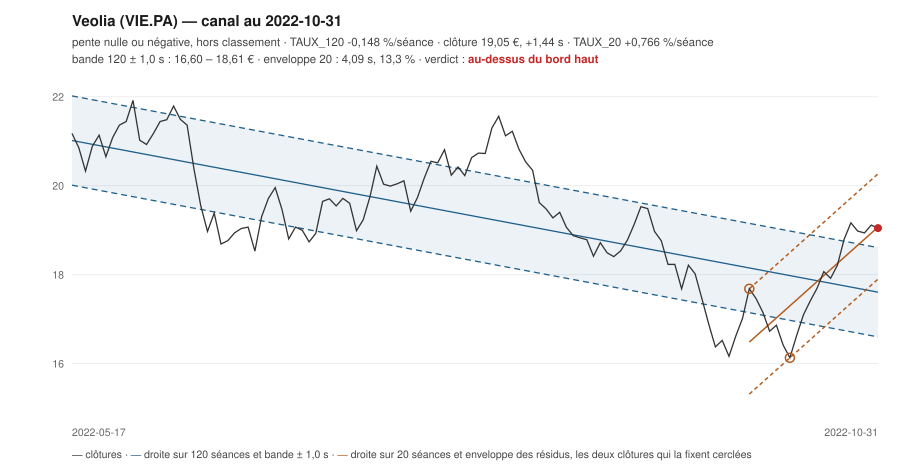

> Hors classement · TAUX_120 -0,148 %/séance · clôture 19,05 € · bande 16,60 – 18,61 € · écart +1,44 s · TAUX_20 +0,766 %/séance · enveloppe 20 : 4,09 s, 13,3 % · **au-dessus du bord haut**

- Clôture 19,05 €, à +1,44 s de la droite longue ; bande [16,60 ; 18,61] €.
- TAUX_120 −0,148 %/séance (hors classement) contre TAUX_20 +0,766 %/séance : pas de concordance.
- Enveloppe de 4,09 s, au-dessus des ~3,7 s attendues, soit 13,3 % de E_20, la plus large de l'univers ce jour en pourcentage. Bornes anciennes : 4 octobre (1re séance, haut), 12 octobre (7e, bas).
- La bande a été traversée en 6 séances : sous le bord bas du 7 au 13 octobre (−1,63 s le 12), dans la bande du 14 au 21, au-dessus du bord haut depuis le 24 (6 séances).
- Verdict : au-dessus du bord haut.

### `AI.PA` — Air Liquide

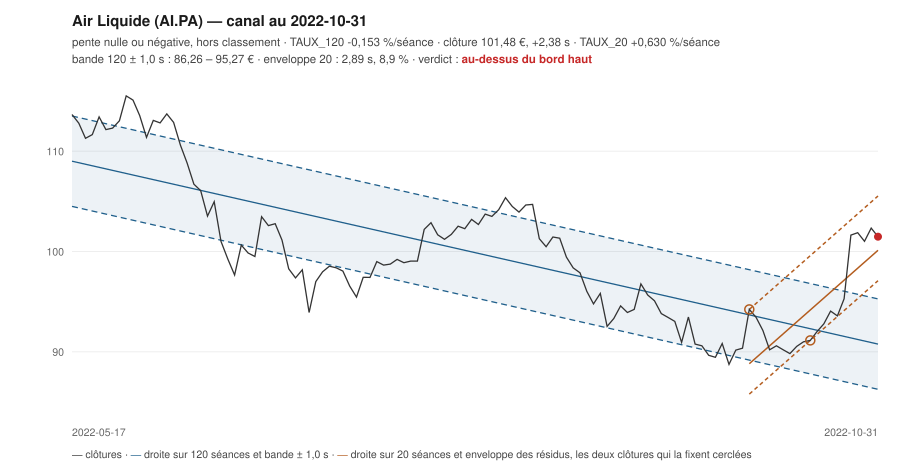

> Hors classement · TAUX_120 -0,153 %/séance · clôture 101,48 € · bande 86,26 – 95,27 € · écart +2,38 s · TAUX_20 +0,630 %/séance · enveloppe 20 : 2,89 s, 8,9 % · **au-dessus du bord haut**

- Clôture 101,48 €, à +2,38 s : au-dessus de la bande à 120 séances [86,26 ; 95,27] €.
- TAUX_120 −0,153 %/séance, pente longue négative et hors classement, contre une pente courte de +0,630 %/séance : désaccord complet des deux horizons.
- L'enveloppe ne mesure que 2,89 s (8,9 % de E_20), bien en deçà des ~3,7 s attendues. Elle est bornée par le 4 octobre (1re séance, en haut) et le 17 octobre (10e, en bas), deux clôtures de la première moitié de la fenêtre.
- Écart négatif du 7 au 12 octobre, une première séance au-dessus du bord haut le 20, puis au-dessus sans interruption depuis le 24 octobre (6 séances), avec un sommet à +2,93 s le 25.
- Verdict : au-dessus du bord haut.

### `ORA.PA` — Orange

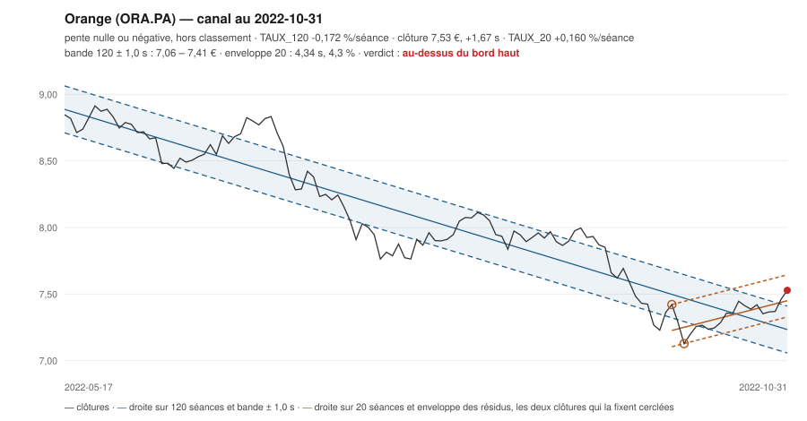

> Hors classement · TAUX_120 -0,172 %/séance · clôture 7,53 € · bande 7,06 – 7,41 € · écart +1,67 s · TAUX_20 +0,160 %/séance · enveloppe 20 : 4,34 s, 4,3 % · **au-dessus du bord haut**

- Clôture 7,53 €, à +1,67 s de la droite longue ; bande [7,06 ; 7,41] €.
- TAUX_120 −0,172 %/séance (hors classement), TAUX_20 +0,160 %/séance : pentes de signes opposés.
- Enveloppe de 4,34 s (4,3 % de E_20), au-dessus des ~3,7 s attendues. Ses deux bornes sont au tout début de la fenêtre : le 4 octobre (1re séance, haut) et le 6 octobre (3e, bas).
- Sous le bord bas du 5 au 12 octobre, avec une séance de répit le 11 (−1,98 s le 6), 11 séances dans la bande, puis au-dessus du bord haut depuis le 28 (2 séances).
- Verdict : au-dessus du bord haut.

### `CA.PA` — Carrefour

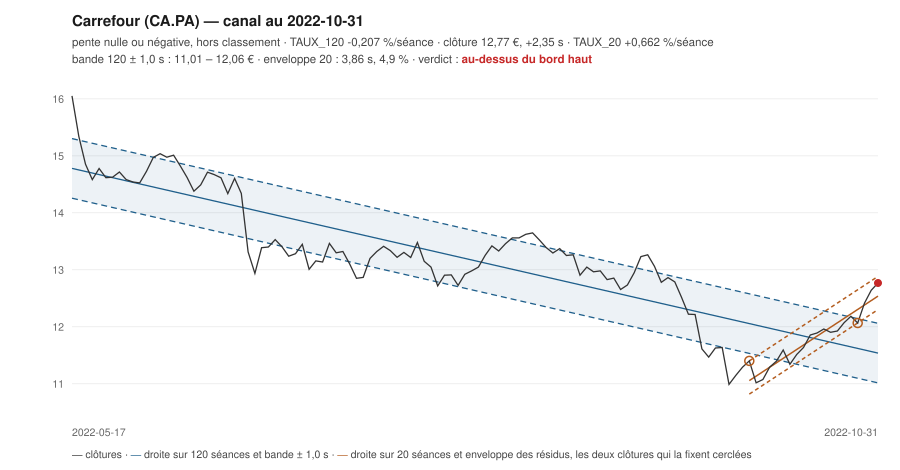

> Hors classement · TAUX_120 -0,207 %/séance · clôture 12,77 € · bande 11,01 – 12,06 € · écart +2,35 s · TAUX_20 +0,662 %/séance · enveloppe 20 : 3,86 s, 4,9 % · **au-dessus du bord haut**

- Clôture 12,77 €, à +2,35 s de la droite longue, au-dessus de la bande [11,01 ; 12,06] €.
- Pente longue négative (TAUX_120 −0,207 %/séance, hors classement), pente courte positive (TAUX_20 +0,662 %/séance) : désaccord.
- Enveloppe de 3,86 s (4,9 % de E_20), voisine des ~3,7 s attendues. Ses deux bornes sont aux extrémités opposées de la fenêtre : résidu haut le 4 octobre (1re séance), résidu bas le 26 octobre (17e), récent.
- Sous le bord bas les 5 et 6 octobre (−1,60 s le 5), l'écart atteint ce jour son maximum de la fenêtre, +2,35 s. Elle est au-dessus du bord haut de son canal du jour depuis 6 séances.
- Verdict : au-dessus du bord haut.

### `MT.AS` — ArcelorMittal

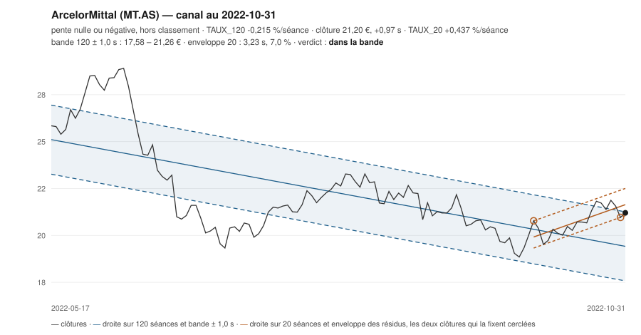

> Hors classement · TAUX_120 -0,215 %/séance · clôture 21,20 € · bande 17,58 – 21,26 € · écart +0,97 s · TAUX_20 +0,437 %/séance · enveloppe 20 : 3,23 s, 7,0 % · **dans la bande**

- Clôture 21,20 €, à +0,97 s, dans la bande [17,58 ; 21,26] €, à 6 centimes du bord haut.
- Pente longue négative (TAUX_120 −0,215 %/séance, hors classement), pente courte positive (+0,437 %/séance) : elles s'opposent.
- Enveloppe : 3,23 s (7,0 % de E_20), sous les ~3,7 s attendues. Sa borne basse est récente, le 28 octobre (19e séance) ; sa borne haute est la 1re séance, le 4 octobre.
- Au-dessus du bord haut du 20 au 27 octobre (+1,36 s les 21 et 26), dans la bande depuis 2 séances. Son écart n'est jamais descendu sous −0,06 s sur la fenêtre.
- Verdict : dans la bande.

### `ML.PA` — Michelin

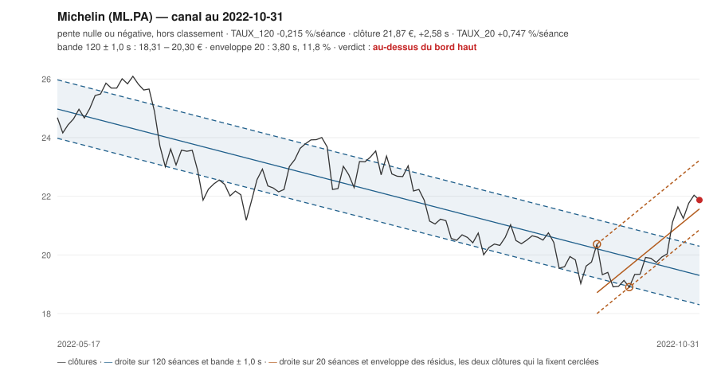

> Hors classement · TAUX_120 -0,215 %/séance · clôture 21,87 € · bande 18,31 – 20,30 € · écart +2,58 s · TAUX_20 +0,747 %/séance · enveloppe 20 : 3,80 s, 11,8 % · **au-dessus du bord haut**

- Clôture 21,87 €, à +2,58 s, au-dessus de la bande [18,31 ; 20,30] €.
- TAUX_120 −0,215 %/séance, pente longue négative et hors classement ; TAUX_20 +0,747 %/séance. Désaccord des deux pentes.
- Enveloppe de 3,80 s (11,8 % de E_20), en ligne avec les ~3,7 s attendues ; bornes anciennes, le 4 octobre (1re séance, en haut) et le 12 octobre (7e, en bas).
- L'écart a sauté de +0,89 s le 21 octobre à +2,14 s le 24. La clôture est au-dessus du bord haut de son canal du jour depuis ce jour-là, soit 6 séances, avec un sommet à +2,86 s le 28.
- Verdict : au-dessus du bord haut.

### `SAN.PA` — Sanofi

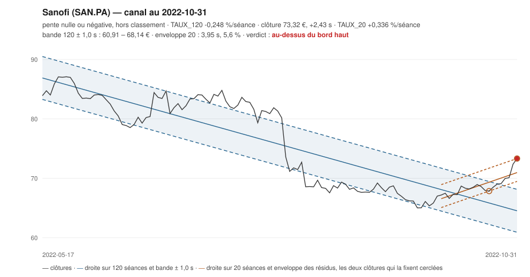

> Hors classement · TAUX_120 -0,248 %/séance · clôture 73,32 € · bande 60,91 – 68,14 € · écart +2,43 s · TAUX_20 +0,336 %/séance · enveloppe 20 : 3,95 s, 5,6 % · **au-dessus du bord haut**

- Clôture 73,32 €, à +2,43 s, au-dessus de la bande [60,91 ; 68,14] €.
- Pente longue nettement négative (TAUX_120 −0,248 %/séance, hors classement), pente courte positive (+0,336 %/séance) : désaccord.
- Enveloppe de 3,95 s (5,6 % de E_20), un peu au-dessus des ~3,7 s attendues. La clôture du jour fixe la borne haute (20e séance), la borne basse est le 20 octobre (13e) : deux bornes récentes.
- Au-dessus du bord haut de son canal du jour depuis le 21 octobre (7 séances). L'écart du jour est le plus haut de la fenêtre, qui ne descend pas sous −0,16 s.
- Verdict : au-dessus du bord haut.

### `SGO.PA` — Saint-Gobain

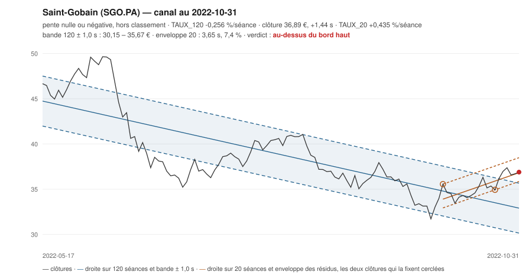

> Hors classement · TAUX_120 -0,256 %/séance · clôture 36,89 € · bande 30,15 – 35,67 € · écart +1,44 s · TAUX_20 +0,435 %/séance · enveloppe 20 : 3,65 s, 7,4 % · **au-dessus du bord haut**

- Clôture 36,89 €, à +1,44 s ; la bande à 120 séances est [30,15 ; 35,67] €.
- TAUX_120 −0,256 %/séance, hors classement ; TAUX_20 +0,435 %/séance. Les deux pentes sont de signes contraires.
- Enveloppe : 3,65 s (7,4 % de E_20), conforme aux ~3,7 s attendues. Résidu haut le 4 octobre (1re séance), résidu bas le 21 octobre (14e).
- Écart positif aux 20 séances de la fenêtre (+0,15 s au plus bas, le 7 octobre). Après des passages au-dessus du bord haut les 17, 18 et 20 octobre, elle y est sans interruption depuis le 24 (6 séances).
- Verdict : au-dessus du bord haut.

### `ERF.PA` — Eurofins Scientific

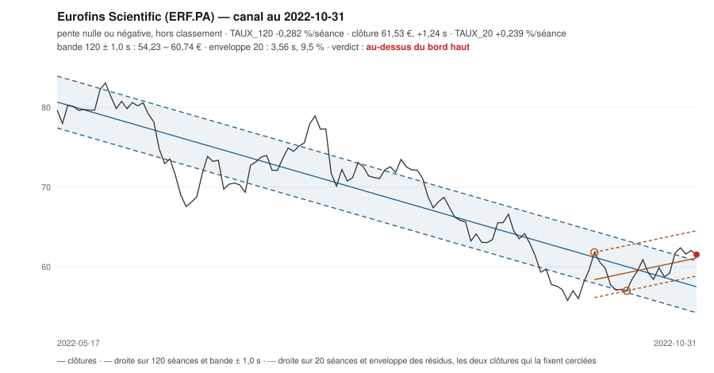

> Hors classement · TAUX_120 -0,282 %/séance · clôture 61,53 € · bande 54,23 – 60,74 € · écart +1,24 s · TAUX_20 +0,239 %/séance · enveloppe 20 : 3,56 s, 9,5 % · **au-dessus du bord haut**

- Clôture 61,53 €, à +1,24 s de la droite longue ; la bande est [54,23 ; 60,74] €.
- Pente longue nettement négative (TAUX_120 −0,282 %/séance, hors classement), pente courte positive (+0,239 %/séance) : désaccord.
- Enveloppe de 3,56 s (9,5 % de E_20), légèrement sous les ~3,7 s attendues ; fixée par le 4 octobre (1re séance, en haut) et le 12 octobre (7e, en bas).
- Aucune clôture sous le bord bas sur la fenêtre (−0,95 s au plus bas, le 10 octobre). Au-dessus du bord haut de son canal du jour depuis le 25 octobre, soit 5 séances.
- Verdict : au-dessus du bord haut.

### `ALO.PA` — Alstom

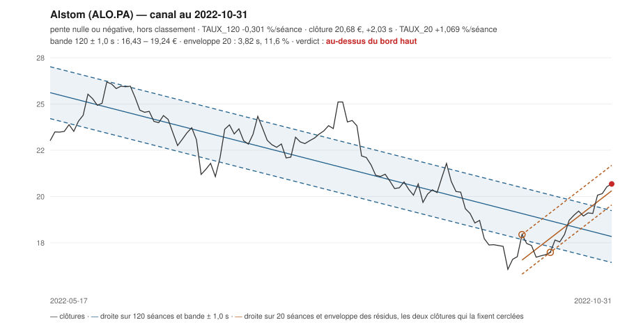

> Hors classement · TAUX_120 -0,301 %/séance · clôture 20,68 € · bande 16,43 – 19,24 € · écart +2,03 s · TAUX_20 +1,069 %/séance · enveloppe 20 : 3,82 s, 11,6 % · **au-dessus du bord haut**

- Clôture 20,68 €, à +2,03 s, au-dessus de la bande à 120 séances [16,43 ; 19,24] €.
- TAUX_120 −0,301 %/séance : pente longue négative, hors classement. TAUX_20 +1,069 %/séance : le canal court monte fortement. Les deux pentes divergent.
- Enveloppe des 20 résidus : 3,82 s (11,6 % de E_20), proche des ~3,7 s attendues ; ses deux bornes sont anciennes, le 4 octobre (1re séance, en haut) et le 12 octobre (7e, en bas).
- La bande a été traversée de bas en haut en 9 séances : dernière clôture sous le bord bas le 12 octobre, première au-dessus du bord haut le 26. Elle y est depuis 4 séances, et l'écart du jour est le plus haut de la fenêtre.
- Verdict : au-dessus du bord haut.

### `VIV.PA` — Vivendi

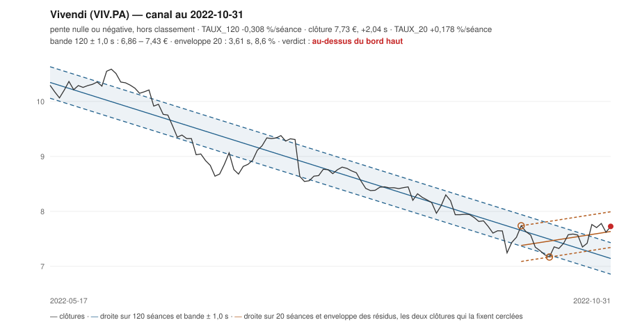

> Hors classement · TAUX_120 -0,308 %/séance · clôture 7,73 € · bande 6,86 – 7,43 € · écart +2,04 s · TAUX_20 +0,178 %/séance · enveloppe 20 : 3,61 s, 8,6 % · **au-dessus du bord haut**

- Clôture 7,73 €, à +2,04 s, au-dessus de la bande [6,86 ; 7,43] €.
- TAUX_120 −0,308 %/séance, la pente longue la plus négative de l'univers ce jour ; TAUX_20 +0,178 %/séance. Les deux pentes divergent.
- Enveloppe de 3,61 s (8,6 % de E_20), proche des ~3,7 s attendues, fixée par le 4 octobre (1re séance, en haut) et le 12 octobre (7e, en bas).
- Au-dessus du bord haut du 18 au 20 octobre, puis depuis le 25 (5 séances), avec +2,20 s le 27. Aucune clôture sous le bord bas sur la fenêtre (−0,93 s au plus bas).
- Verdict : au-dessus du bord haut.

### Les figures des ordres du mois

#### 2022-10-24 — Vente `SAN.PA` Sanofi, décision au 2022-10-21

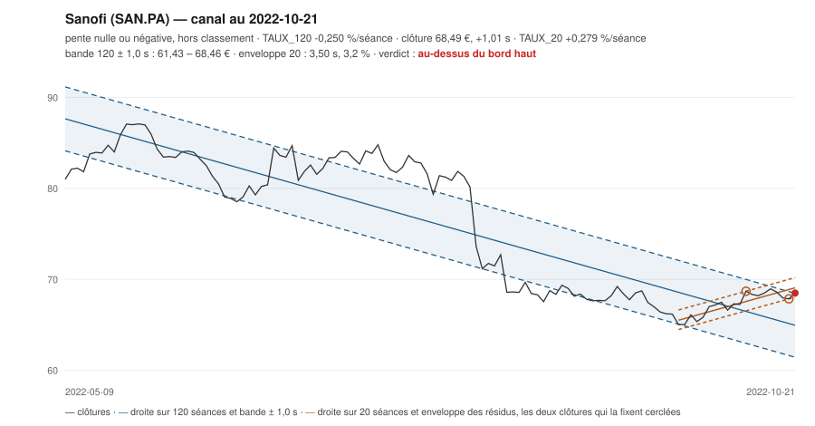

> Hors classement · TAUX_120 -0,250 %/séance · clôture 68,49 € · bande 61,43 – 68,46 € · écart +1,01 s · TAUX_20 +0,279 %/séance · enveloppe 20 : 3,50 s, 3,2 % · **au-dessus du bord haut**

#### 2022-10-27 — Vente `HO.PA` Thales, décision au 2022-10-26

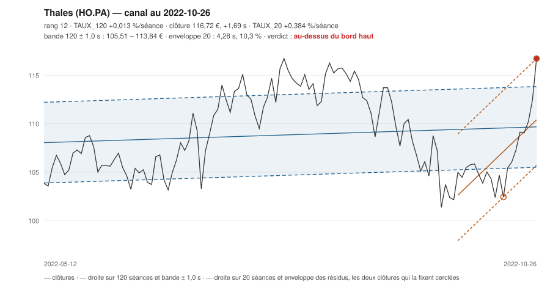

> Rang 12 · TAUX_120 +0,013 %/séance · clôture 116,72 € · bande 105,51 – 113,84 € · écart +1,69 s · TAUX_20 +0,384 %/séance · enveloppe 20 : 4,28 s, 10,3 % · **au-dessus du bord haut**

#### 2022-10-31 — Vente `ENGI.PA` Engie, décision au 2022-10-28

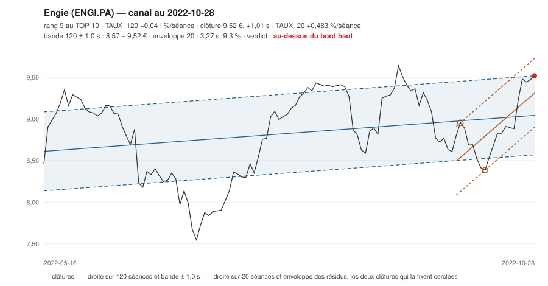

> Rang 9 · TAUX_120 +0,041 %/séance · clôture 9,52 € · bande 8,57 – 9,52 € · écart +1,01 s · TAUX_20 +0,483 %/séance · enveloppe 20 : 3,27 s, 9,3 % · **au-dessus du bord haut**

#### 2022-10-31 — Vente `ORA.PA` Orange, décision au 2022-10-28

> Hors classement · TAUX_120 -0,173 %/séance · clôture 7,46 € · bande 7,06 – 7,41 € · écart +1,28 s · TAUX_20 +0,115 %/séance · enveloppe 20 : 4,07 s, 4,2 % · **au-dessus du bord haut**

## 5. Le TOP 10 au 2022-10-31

| Rang | Valeur | TAUX_120 | Écart | TAUX_20 | Verdict |
|---|---|---|---|---|---|
| 1 | `RNO.PA` Renault | +0,238 %/séance | -0,33 s | +0,412 %/séance | dans la bande |
| 2 | `RMS.PA` Hermès International | +0,219 %/séance | -0,63 s | +0,266 %/séance | dans la bande |
| 3 | `WLN.PA` Worldline | +0,193 %/séance | -0,35 s | +0,275 %/séance | dans la bande |
| 4 | `PUB.PA` Publicis | +0,146 %/séance | +1,03 s | +0,633 %/séance | au-dessus du bord haut |
| 5 | `MC.PA` LVMH | +0,105 %/séance | -0,69 s | +0,218 %/séance | dans la bande |
| 6 | `SAF.PA` Safran | +0,082 %/séance | +1,27 s | +0,833 %/séance | au-dessus du bord haut |
| 7 | `CS.PA` AXA | +0,067 %/séance | +0,77 s | +0,477 %/séance | dans la bande |
| 8 | `EL.PA` EssilorLuxottica | +0,058 %/séance | +0,72 s | +0,469 %/séance | dans la bande |
| 9 | `ENGI.PA` Engie | +0,043 %/séance | +1,05 s | +0,568 %/séance | au-dessus du bord haut |
| 10 | `RI.PA` Pernod Ricard | +0,034 %/séance | -1,23 s | -0,273 %/séance | sous le bord bas |

**Entrées et sorties du TOP 10 au fil du mois**

| Séance | Entrées | Sorties |
|---|---|---|
| 2022-10-05 | `CS.PA` | `STLAP.PA` |
| 2022-10-13 | `PUB.PA` | `KER.PA` |
| 2022-10-21 | `EL.PA` | `ENGI.PA` |
| 2022-10-24 | `ENGI.PA` | `RI.PA` |
| 2022-10-26 | `RI.PA` | `OR.PA` |

## 6. Les ordres exécutés

> À l'**ouverture** de la séance qui suit la décision, jamais à la clôture qui l'a déclenchée. L'écart d'ouverture est subi, et publié.

| Exécution | Sens | Valeur | Quantité | Prix | Brut | Frais | Écart d'ouverture | Motif |
|---|---|---|---|---|---|---|---|---|
| 2022-10-24 | **Vente** | `SAN.PA` Sanofi | 23 | 68,65 € | 1 579,06 € | 1,82 € | +0,25 % | décision au 2022-10-21 : clôture 68,49 € au-dessus du bord haut 68,46 € (+1,01 s) |
| 2022-10-27 | **Vente** | `HO.PA` Thales | 18 | 117,32 € | 2 111,84 € | 2,43 € | +0,51 % | décision au 2022-10-26 : clôture 116,72 € au-dessus du bord haut 113,84 € (+1,69 s) |
| 2022-10-31 | **Vente** | `ENGI.PA` Engie | 238 | 9,49 € | 2 258,13 € | 2,60 € | -0,34 % | décision au 2022-10-28 : clôture 9,52 € au-dessus du bord haut 9,52 € (+1,01 s) |
| 2022-10-31 | **Vente** | `ORA.PA` Orange | 234 | 7,49 € | 1 752,69 € | 2,02 € | +0,38 % | décision au 2022-10-28 : clôture 7,46 € au-dessus du bord haut 7,41 € (+1,28 s) |

## 7. Les signaux non exécutés

| Décision | Valeur | Rang | Écart | TAUX_20 | Sort |
|---|---|---|---|---|---|
| 2022-10-12 | `SAF.PA` Safran | 7 | -1,03 s | +0,064 %/séance | FAUTE DE CRENEAU |
| 2022-10-19 | `MC.PA` LVMH | 4 | -1,11 s | +0,169 %/séance | FAUTE DE CRENEAU |
| 2022-10-20 | `OR.PA` L'Oréal | 7 | -1,13 s | +0,004 %/séance | FAUTE DE CRENEAU |

## 8. La lecture du mois

Sur le mois, la meilleure contribution vient de `RNO.PA` (Renault) pour **+241,09 €**, la moins bonne de `ORA.PA` (Orange) pour **+59,08 €**. Les 4 ordres du mois ont coûté **8,86 €** de frais, soit 0,089 % de la dotation. Le portefeuille termine le mois **derrière TR39** de 0,71 point. Sur 3 séances de décision, un candidat n'a pas pu être acheté faute de créneau.

---

[← Septembre](2022-09.md) · [Protocole](../README.md) · [Novembre →](2022-11.md)
