# Novembre 2022

> Journal de l'[expérience 4](../README.md) · exécutions du 2022-11-01 au 2022-11-30 · **0 ordre**
> Portefeuille au 2022-11-30 : **10 317,41 €** (base 103,17) · TR39 93,61 · alpha du mois **-3,14 pt** · depuis janvier **+9,56 pt**

---

## 1. Les actualités du mois précédent

**Octobre 2022.** Renversement. Les indices européens signent l'un de leurs
meilleurs mois de la décennie, le CAC 40 reprenant environ 9 %. Deux raisons
avancées par le marché : des résultats trimestriels moins mauvais que craint, et
l'idée que le pic de resserrement monétaire approche.

Le gaz européen s'effondre par rapport à ses sommets d'août, les stockages
étant remplis plus vite que prévu et l'automne restant doux. Au Royaume-Uni, le
gouvernement Truss démissionne après quarante-cinq jours. La BCE relève encore
ses taux de trois quarts de point le 27 octobre. Teleperformance chute lourdement
après la révélation d'une enquête sur ses conditions de travail en Colombie.

## 2. L'exposition héritée au 2022-10-31

| Valeur | Achetée le | Prix d'achat | Cours | +/− value | Alpha depuis l'achat |
|---|---|---|---|---|---|
| `RNO.PA` Renault | 2022-09-26 | 23,21 € | 26,39 € | **+13,70 %** | +5,22 pt |

## 3. Le portefeuille depuis le 2022-01-03

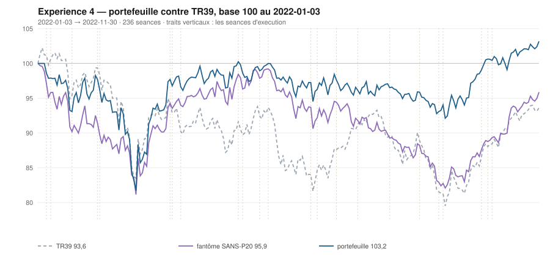

| | |
|---|---|
| Dotation initiale | 10 000,00 € au 2022-01-03 |
| Titres au 2022-11-30 | 2 622,59 € |
| Espèces | 7 694,82 € |
| Lignes détenues | 1 |
| **Total** | **10 317,41 €** |
| Base 100 | **103,17** |
| Fantôme `SANS-P20`, même base | 95,87 |
| TR39, même base | 93,61 |
| Écart depuis janvier | **+9,56 pt** |

### Toutes les positions depuis le début de l'expérience

> Closes comme ouvertes. Aucune séance postérieure au 2022-11-30 n'entre dans ce tableau.

| Société | Prix d'achat | Date d'achat | Prix de vente | Date de vente |
|---|---|---|---|---|
| `CAP.PA` Capgemini | 182,86 € | 2022-01-07 | 181,51 € | 2022-03-30 |
| `EL.PA` EssilorLuxottica | 162,03 € | 2022-01-07 | 153,11 € | 2022-03-30 |
| `RI.PA` Pernod Ricard | 173,52 € | 2022-01-07 | 164,76 € | 2022-03-31 |
| `STMPA.PA` STMicroelectronics | 41,80 € | 2022-01-11 | 39,65 € | 2022-03-30 |
| `BNP.PA` BNP Paribas | 43,84 € | 2022-01-25 | 48,20 € | 2022-02-10 |
| `MC.PA` LVMH | 633,54 € | 2022-02-11 | 558,12 € | 2022-05-31 |
| `SAN.PA` Sanofi | 74,66 € | 2022-03-30 | 77,80 € | 2022-04-06 |
| `TTE.PA` TotalEnergies | 36,38 € | 2022-03-30 | 40,80 € | 2022-05-17 |
| `DG.PA` Vinci | 73,34 € | 2022-04-06 | 77,14 € | 2022-07-20 |
| `CA.PA` Carrefour | 15,17 € | 2022-05-19 | 13,26 € | 2022-09-13 |
| `HO.PA` Thales | 105,72 € | 2022-06-06 | 117,32 € | 2022-10-27 |
| `SAN.PA` Sanofi | 82,42 € | 2022-07-04 | 68,65 € | 2022-10-24 |
| `ORA.PA` Orange | 8,65 € | 2022-07-07 | 7,49 € | 2022-10-31 |
| `TTE.PA` TotalEnergies | 38,39 € | 2022-08-03 | 43,55 € | 2022-08-24 |
| `RNO.PA` Renault | 23,21 € | 2022-09-26 |  |  |
| `ENGI.PA` Engie | 8,69 € | 2022-09-28 | 9,49 € | 2022-10-31 |

*16 positions depuis le début, dont 1 encore ouverte : les deux dernières colonnes restent vides.*

## 4. L'étude chartiste au 2022-11-30

> Une entrée par société de l'univers, sous la figure de canal lue à la clôture du 2022-11-30. La ligne en retrait est **calculée** ; la note qui suit est celle de l'agent `chartiste`, rédigée sans aucune séance postérieure.

### 1. `PUB.PA` — Publicis

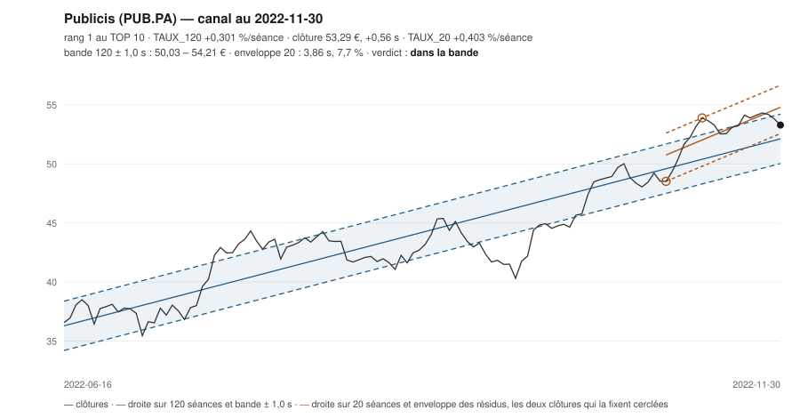

> Rang 1 · TAUX_120 +0,301 %/séance · clôture 53,29 € · bande 50,03 – 54,21 € · écart +0,56 s · TAUX_20 +0,403 %/séance · enveloppe 20 : 3,86 s, 7,7 % · **dans la bande**

- Clôture 53,29 €, à +0,56 s, dans la bande [50,03 ; 54,21] €.
- TAUX_120 +0,301 %/séance, 1re du TOP 10 depuis le 14 novembre ; TAUX_20 +0,403 %/séance. Les deux pentes concordent.
- Enveloppe : 3,86 s (7,7 % de E_20), proche des ~3,7 s attendues. Résidu bas le 3 novembre (1re séance), résidu haut le 11 novembre (7e).
- Au-dessus du bord haut du 4 au 28 novembre (+2,40 s le 11), dans la bande depuis le 29 (2 séances). L'écart du jour est le plus bas de la fenêtre.
- Verdict : dans la bande.

### 2. `RNO.PA` — Renault

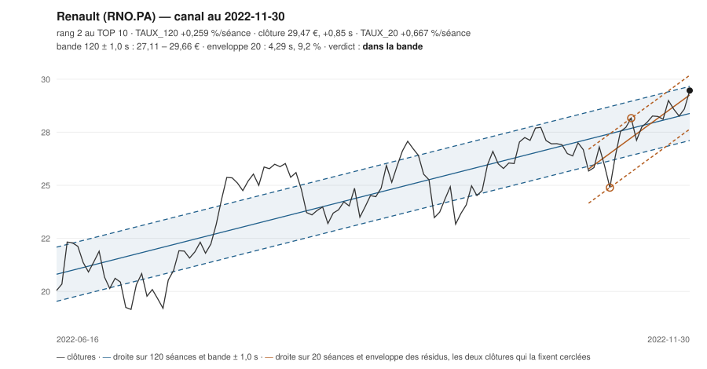

> Rang 2 · TAUX_120 +0,259 %/séance · clôture 29,47 € · bande 27,11 – 29,66 € · écart +0,85 s · TAUX_20 +0,667 %/séance · enveloppe 20 : 4,29 s, 9,2 % · **dans la bande**

- Clôture 29,47 €, à +0,85 s, dans la bande [27,11 ; 29,66] €.
- TAUX_120 +0,259 %/séance, 2e du TOP 10 depuis le 14 novembre ; TAUX_20 +0,667 %/séance, positive depuis le 17. Les deux pentes concordent.
- Enveloppe de 4,29 s (9,2 % de E_20), au-dessus des ~3,7 s attendues. Résidu bas le 9 novembre (5e séance), résidu haut le 15 novembre (9e).
- Le 9 novembre, sous le bord bas (−1,57 s) au rang 1, mais avec une pente courte négative. Dans la bande depuis le 10 (15 séances), avec ce jour l'écart le plus haut de la fenêtre.
- Verdict : dans la bande.

### 3. `RMS.PA` — Hermès International

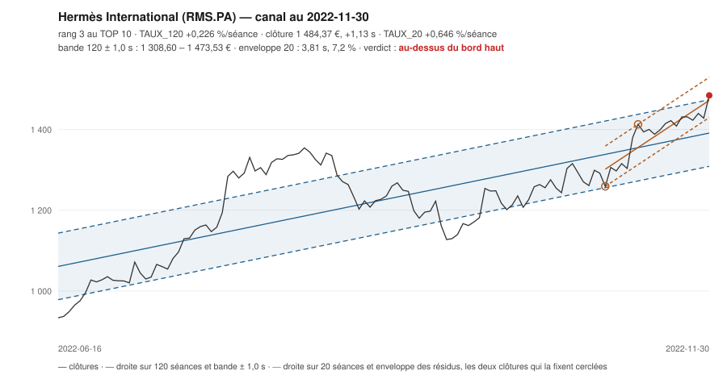

> Rang 3 · TAUX_120 +0,226 %/séance · clôture 1 484,37 € · bande 1 308,60 – 1 473,53 € · écart +1,13 s · TAUX_20 +0,646 %/séance · enveloppe 20 : 3,81 s, 7,2 % · **au-dessus du bord haut**

- Clôture 1 484,37 €, à +1,13 s, au-dessus de la bande [1 308,60 ; 1 473,53] €.
- TAUX_120 +0,226 %/séance, 3e du TOP 10 ; TAUX_20 +0,646 %/séance. Concordance.
- Enveloppe de 3,81 s (7,2 % de E_20), en ligne avec les ~3,7 s attendues. Résidu bas le 3 novembre (1re séance), résidu haut le 11 novembre (7e).
- Première clôture de la fenêtre au-dessus du bord haut. L'écart plafonnait jusque-là à +0,97 s (11 novembre) et avait commencé la fenêtre à −0,72 s.
- Verdict : au-dessus du bord haut.

### 4. `WLN.PA` — Worldline

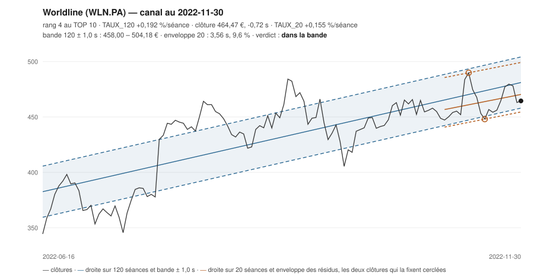

> Rang 4 · TAUX_120 +0,192 %/séance · clôture 464,47 € · bande 458,00 – 504,18 € · écart -0,72 s · TAUX_20 +0,155 %/séance · enveloppe 20 : 3,56 s, 9,6 % · **dans la bande**

- Clôture 464,47 €, à −0,72 s, dans la bande [458,00 ; 504,18] €.
- TAUX_120 +0,192 %/séance, 4e du TOP 10 ; TAUX_20 +0,155 %/séance. Concordance.
- Enveloppe : 3,56 s (9,6 % de E_20), légèrement sous les ~3,7 s attendues. Résidu haut le 11 novembre (7e séance), résidu bas le 17 novembre (11e).
- Le 17 novembre, seule séance de la fenêtre sous le bord bas (−1,19 s), elle était candidate : rang 4, pente courte positive. Dans la bande depuis le 18 (9 séances).
- Verdict : dans la bande.

### 5. `ENGI.PA` — Engie

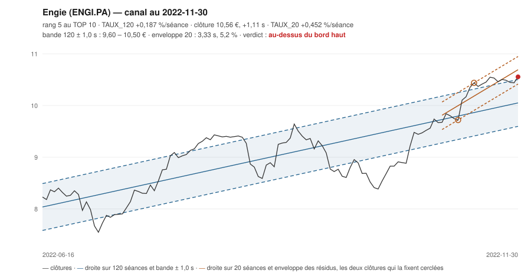

> Rang 5 · TAUX_120 +0,187 %/séance · clôture 10,56 € · bande 9,60 – 10,50 € · écart +1,11 s · TAUX_20 +0,452 %/séance · enveloppe 20 : 3,33 s, 5,2 % · **au-dessus du bord haut**

- Clôture 10,56 €, à +1,11 s, au-dessus de la bande [9,60 ; 10,50] €.
- TAUX_120 +0,187 %/séance, 5e du TOP 10 (9e au début de la fenêtre) ; TAUX_20 +0,452 %/séance. Les deux pentes concordent.
- Enveloppe de 3,33 s (5,2 % de E_20), sous les ~3,7 s attendues. Résidu bas le 9 novembre (5e séance), résidu haut le 15 novembre (9e).
- Au-dessus du bord haut de son canal du jour à 18 des 20 séances, sauf le 9 et le 29 novembre. Elle y revient ce jour après la séance du 29 (+0,95 s).
- Verdict : au-dessus du bord haut.

### 6. `CS.PA` — AXA

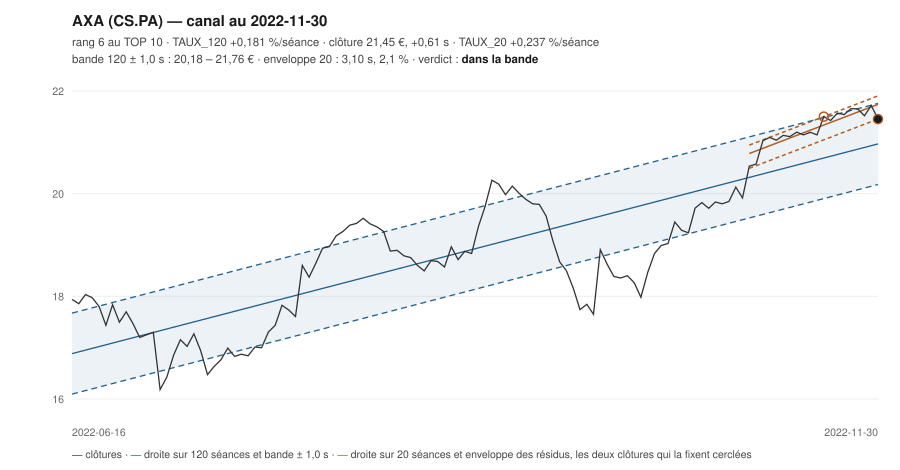

> Rang 6 · TAUX_120 +0,181 %/séance · clôture 21,45 € · bande 20,18 – 21,76 € · écart +0,61 s · TAUX_20 +0,237 %/séance · enveloppe 20 : 3,10 s, 2,1 % · **dans la bande**

- Clôture 21,45 €, à +0,61 s, dans la bande [20,18 ; 21,76] €.
- TAUX_120 +0,181 %/séance, 6e du TOP 10, et TAUX_20 +0,237 %/séance : concordance.
- Enveloppe de 3,10 s (2,1 % de E_20), sous les ~3,7 s attendues. La clôture du jour fixe la borne basse (20e séance), la borne haute est le 18 novembre (12e).
- Au-dessus du bord haut de son canal du jour à 18 des 20 séances de la fenêtre, elle repasse dans la bande ce jour avec l'écart le plus bas du mois (+0,61 s).
- Verdict : dans la bande.

### 7. `TTE.PA` — TotalEnergies

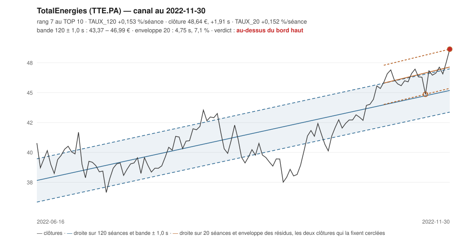

> Rang 7 · TAUX_120 +0,153 %/séance · clôture 48,64 € · bande 43,37 – 46,99 € · écart +1,91 s · TAUX_20 +0,152 %/séance · enveloppe 20 : 4,75 s, 7,1 % · **au-dessus du bord haut**

- Clôture 48,64 €, à +1,91 s, au-dessus de la bande [43,37 ; 46,99] €.
- TAUX_120 +0,153 %/séance, 7e du TOP 10 (entrée le 7 novembre) ; TAUX_20 +0,152 %/séance. Les deux pentes concordent, à un niveau voisin.
- Enveloppe de 4,75 s (7,1 % de E_20), la plus large de l'univers ce jour en unités de s. Résidu bas le 21 novembre (13e séance), résidu haut ce jour (20e) : deux bornes récentes.
- Au-dessus du bord haut sur presque toute la fenêtre (+2,53 s le 4 novembre), avec des retours dans la bande les 21 et 28. Au-dessus depuis 2 séances.
- Verdict : au-dessus du bord haut.

### 8. `EL.PA` — EssilorLuxottica

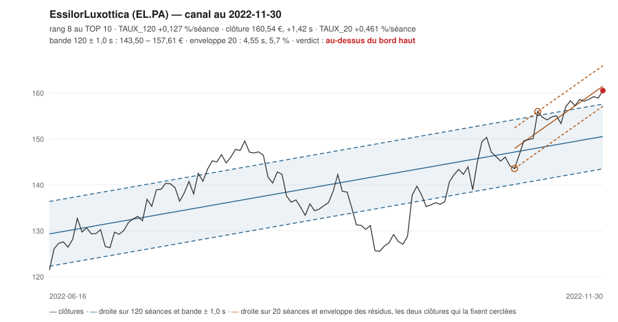

> Rang 8 · TAUX_120 +0,127 %/séance · clôture 160,54 € · bande 143,50 – 157,61 € · écart +1,42 s · TAUX_20 +0,461 %/séance · enveloppe 20 : 4,55 s, 5,7 % · **au-dessus du bord haut**

- Clôture 160,54 €, à +1,42 s, au-dessus de la bande [143,50 ; 157,61] €.
- TAUX_120 +0,127 %/séance, 8e du TOP 10 ; TAUX_20 +0,461 %/séance. Concordance à la hausse.
- Enveloppe de 4,55 s (5,7 % de E_20), au-dessus des ~3,7 s attendues. Ses bornes sont anciennes : 3 novembre (1re séance, bas) et 10 novembre (6e, haut).
- Au-dessus du bord haut de son canal du jour depuis le 7 novembre (18 séances), écart compris entre +1,11 et +1,97 s sur cette période.
- Verdict : au-dessus du bord haut.

### 9. `SAF.PA` — Safran

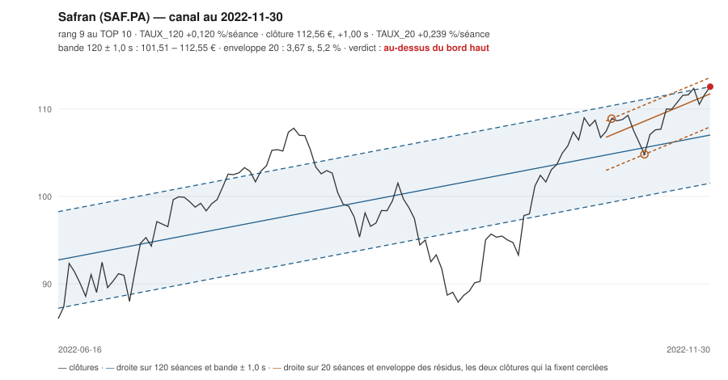

> Rang 9 · TAUX_120 +0,120 %/séance · clôture 112,56 € · bande 101,51 – 112,55 € · écart +1,00 s · TAUX_20 +0,239 %/séance · enveloppe 20 : 3,67 s, 5,2 % · **au-dessus du bord haut**

- Clôture 112,56 €, à +1,003 s : au-dessus du bord haut de la bande [101,51 ; 112,55] € de moins de deux centimes.
- TAUX_120 +0,120 %/séance, 9e du TOP 10 ; TAUX_20 +0,239 %/séance. Les pentes concordent.
- Enveloppe : 3,67 s (5,2 % de E_20), conforme aux ~3,7 s attendues. Résidu haut le 4 novembre (2e séance), résidu bas le 14 novembre (8e).
- Sept bascules autour du bord haut sur la fenêtre, écart compris entre +0,14 et +1,18 s. Au-dessus ce jour après deux séances dans la bande, les 28 et 29.
- Verdict : au-dessus du bord haut.

### 10. `SU.PA` — Schneider Electric

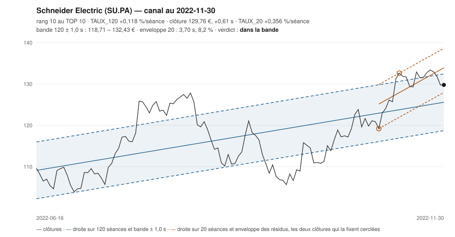

> Rang 10 · TAUX_120 +0,118 %/séance · clôture 129,76 € · bande 118,71 – 132,43 € · écart +0,61 s · TAUX_20 +0,356 %/séance · enveloppe 20 : 3,70 s, 8,2 % · **dans la bande**

- Clôture 129,76 €, à +0,61 s, dans la bande [118,71 ; 132,43] €.
- TAUX_120 +0,118 %/séance, 10e du TOP 10, entrée le 25 novembre ; TAUX_20 +0,356 %/séance. Concordance.
- Enveloppe de 3,70 s (8,2 % de E_20), égale aux ~3,7 s attendues. Résidu bas le 3 novembre (1re séance), résidu haut le 11 novembre (7e).
- Au-dessus du bord haut de son canal du jour du 7 au 25 novembre (+2,05 s le 11), dans la bande depuis le 28 (3 séances).
- Verdict : dans la bande.

### 11. `MC.PA` — LVMH

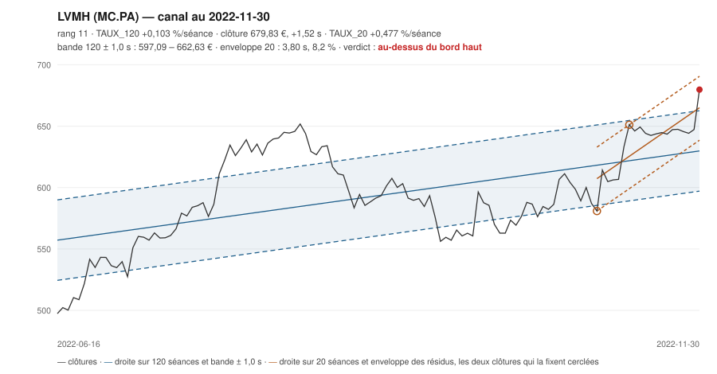

> Rang 11 · TAUX_120 +0,103 %/séance · clôture 679,83 € · bande 597,09 – 662,63 € · écart +1,52 s · TAUX_20 +0,477 %/séance · enveloppe 20 : 3,80 s, 8,2 % · **au-dessus du bord haut**

- Clôture 679,83 €, à +1,52 s, au-dessus de la bande [597,09 ; 662,63] €.
- TAUX_120 +0,103 %/séance, rang 11 : sortie du TOP 10 le 25 novembre, après un rang 5 le 3. TAUX_20 +0,477 %/séance. Les deux pentes concordent.
- Enveloppe : 3,80 s (8,2 % de E_20), proche des ~3,7 s attendues ; résidu bas le 3 novembre (1re séance), résidu haut le 11 novembre (7e).
- L'écart a bondi de +0,58 s le 29 novembre à +1,52 s ce jour. C'est la deuxième séance de la fenêtre au-dessus du bord haut, après le 11 novembre.
- Verdict : au-dessus du bord haut.

### 12. `AIR.PA` — Airbus

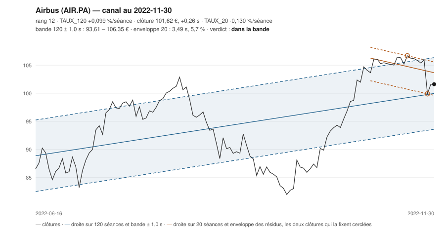

> Rang 12 · TAUX_120 +0,099 %/séance · clôture 101,62 € · bande 93,61 – 106,35 € · écart +0,26 s · TAUX_20 -0,130 %/séance · enveloppe 20 : 3,49 s, 5,7 % · **dans la bande**

- Clôture 101,62 €, à +0,26 s, dans la bande [93,61 ; 106,35] €.
- Pente longue positive depuis le 10 novembre (TAUX_120 +0,099 %/séance), rang 12, hors TOP 10. Pente courte négative depuis 3 séances (TAUX_20 −0,130 %/séance). Les deux pentes divergent.
- Enveloppe de 3,49 s (5,7 % de E_20), un peu sous les ~3,7 s attendues. Résidu haut le 18 novembre (12e séance), résidu bas le 28 novembre (18e) : deux bornes de la seconde moitié.
- Au-dessus du bord haut du 3 au 25 novembre, sauf le 24. L'écart est tombé de +1,01 s le 25 à +0,04 s le 28 ; dans la bande depuis 3 séances.
- Verdict : dans la bande.

### 13. `STLAP.PA` — Stellantis

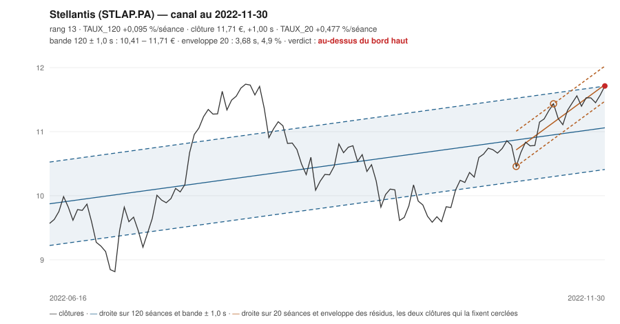

> Rang 13 · TAUX_120 +0,095 %/séance · clôture 11,71 € · bande 10,41 – 11,71 € · écart +1,00 s · TAUX_20 +0,477 %/séance · enveloppe 20 : 3,68 s, 4,9 % · **au-dessus du bord haut**

- Clôture 11,71 €, à +1,003 s, sur le bord haut de la bande [10,41 ; 11,71] € à l'arrondi près, au-dessus en toute rigueur.
- TAUX_120 +0,095 %/séance, rang 13 (entre 12 et 14 sur toute la fenêtre) ; TAUX_20 +0,477 %/séance. Concordance.
- Enveloppe : 3,68 s (4,9 % de E_20), conforme aux ~3,7 s attendues. Résidu bas le 3 novembre (1re séance), résidu haut le 15 novembre (9e).
- Brefs passages au-dessus du bord haut les 14, 15 et 22 novembre ; l'écart est monté de +0,04 s (3 novembre) à ce franchissement.
- Verdict : au-dessus du bord haut.

### 14. `GLE.PA` — Société Générale

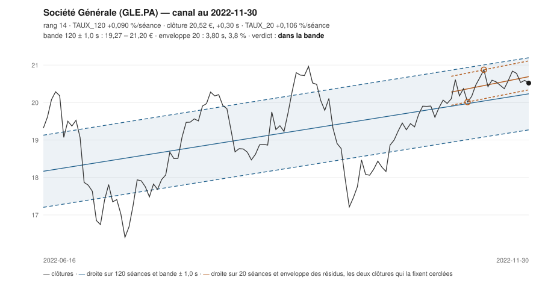

> Rang 14 · TAUX_120 +0,090 %/séance · clôture 20,52 € · bande 19,27 – 21,20 € · écart +0,30 s · TAUX_20 +0,106 %/séance · enveloppe 20 : 3,80 s, 3,8 % · **dans la bande**

- Clôture 20,52 € à +0,30 s, dans la bande [19,27 ; 21,20] €.
- TAUX_120 +0,090 %/séance, positive depuis le 11 novembre, rang 14 ; TAUX_20 +0,106 %/séance. Signes concordants.
- Enveloppe : 3,80 s (3,8 % de E_20), en ligne avec les ~3,7 s attendues. Résidu bas le 9 novembre (5e séance), résidu haut le 15 novembre (9e).
- Brefs passages au-dessus du bord haut les 4, 8, 14 et 15 novembre, puis dans la bande depuis le 16 (11 séances). L'écart du jour est le plus bas de la fenêtre.
- Verdict : dans la bande.

### 15. `BNP.PA` — BNP Paribas

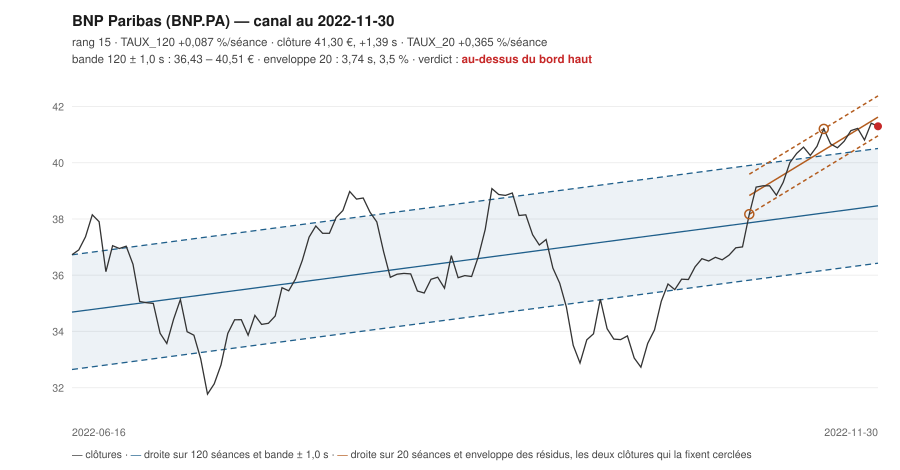

> Rang 15 · TAUX_120 +0,087 %/séance · clôture 41,30 € · bande 36,43 – 40,51 € · écart +1,39 s · TAUX_20 +0,365 %/séance · enveloppe 20 : 3,74 s, 3,5 % · **au-dessus du bord haut**

- Clôture 41,30 €, à +1,39 s, au-dessus de la bande [36,43 ; 40,51] €.
- TAUX_120 +0,087 %/séance, positive depuis le 16 novembre, rang 15 ; TAUX_20 +0,365 %/séance. Les deux pentes concordent.
- Enveloppe : 3,74 s (3,5 % de E_20), au niveau des ~3,7 s attendues. Résidu bas le 3 novembre (1re séance), résidu haut le 18 novembre (12e).
- Au-dessus du bord haut de son canal du jour depuis le 1er novembre, soit 22 séances. L'écart est resté entre +1,32 s (28 novembre) et +2,00 s (18 novembre).
- Verdict : au-dessus du bord haut.

### 16. `STMPA.PA` — STMicroelectronics

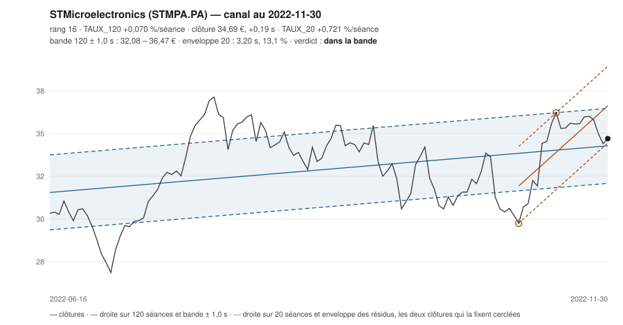

> Rang 16 · TAUX_120 +0,070 %/séance · clôture 34,69 € · bande 32,08 – 36,47 € · écart +0,19 s · TAUX_20 +0,721 %/séance · enveloppe 20 : 3,20 s, 13,1 % · **dans la bande**

- Clôture 34,69 €, à +0,19 s, dans la bande [32,08 ; 36,47] €.
- TAUX_120 +0,070 %/séance, positive depuis le 14 novembre, rang 16 ; TAUX_20 +0,721 %/séance. Signes concordants.
- Enveloppe de 3,20 s, sous les ~3,7 s attendues, mais 13,1 % de E_20. Résidu bas le 3 novembre (1re séance), résidu haut le 15 novembre (9e).
- La bande a été traversée de bas en haut en 6 séances : −1,26 s le 3 novembre, au-dessus du bord haut les 14 et 15 (+1,36 s). Dans la bande depuis le 16, l'écart a reflué jusqu'à +0,08 s le 29.
- Verdict : dans la bande.

### 17. `DG.PA` — Vinci

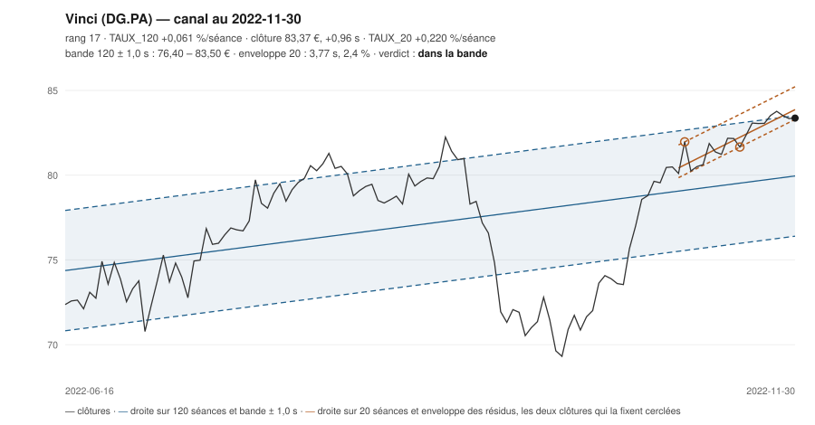

> Rang 17 · TAUX_120 +0,061 %/séance · clôture 83,37 € · bande 76,40 – 83,50 € · écart +0,96 s · TAUX_20 +0,220 %/séance · enveloppe 20 : 3,77 s, 2,4 % · **dans la bande**

- Clôture 83,37 €, à +0,96 s, dans la bande [76,40 ; 83,50] €, à 13 centimes du bord haut.
- TAUX_120 +0,061 %/séance, rang 17 ; TAUX_20 +0,220 %/séance. Les deux pentes montent.
- Enveloppe : 3,77 s (2,4 % de E_20), conforme aux ~3,7 s attendues. Résidu haut le 4 novembre (2e séance), résidu bas le 17 novembre (11e).
- Au-dessus du bord haut aux 18 premières séances de la fenêtre, parfois de très peu (+1,0006 s le 17 novembre), elle est dans la bande depuis le 29 (2 séances). L'écart n'a pas quitté [+0,96 ; +1,60] s.
- Verdict : dans la bande.

### 18. `ACA.PA` — Crédit Agricole

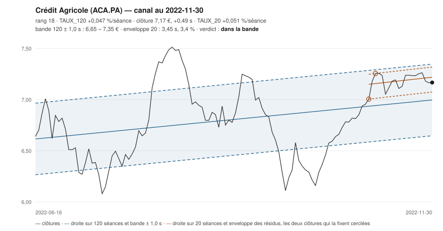

> Rang 18 · TAUX_120 +0,047 %/séance · clôture 7,17 € · bande 6,65 – 7,35 € · écart +0,49 s · TAUX_20 +0,051 %/séance · enveloppe 20 : 3,45 s, 3,4 % · **dans la bande**

- Clôture 7,17 € à +0,49 s, dans la bande [6,65 ; 7,35] €.
- Pente longue positive depuis le 17 novembre (TAUX_120 +0,047 %/séance), rang 18, hors TOP 10 ; pente courte +0,051 %/séance. Deux pentes faibles, de même signe.
- Enveloppe de 3,45 s (3,4 % de E_20), sous les ~3,7 s attendues. Ses deux bornes sont anciennes : résidu bas le 3 novembre (1re séance), résidu haut le 7 novembre (3e).
- Elle a oscillé autour du bord haut de son canal du jour jusqu'au 18 novembre (+1,56 s le 7), puis est dans la bande depuis 8 séances. L'écart du jour est le plus bas de la fenêtre.
- Verdict : dans la bande.

### 19. `MT.AS` — ArcelorMittal

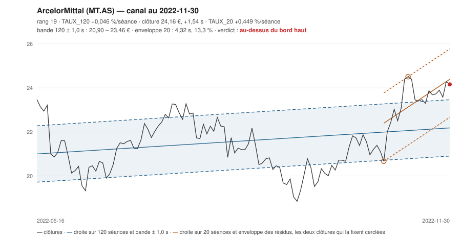

> Rang 19 · TAUX_120 +0,046 %/séance · clôture 24,16 € · bande 20,90 – 23,46 € · écart +1,54 s · TAUX_20 +0,449 %/séance · enveloppe 20 : 4,32 s, 13,3 % · **au-dessus du bord haut**

- Clôture 24,16 €, à +1,54 s, au-dessus de la bande [20,90 ; 23,46] €.
- TAUX_120 +0,046 %/séance, positive depuis le 24 novembre, rang 19 ; TAUX_20 +0,449 %/séance. Concordance.
- Enveloppe de 4,32 s, au-dessus des ~3,7 s attendues (13,3 % de E_20). Résidu bas le 3 novembre (1re séance), résidu haut le 14 novembre (8e).
- Au-dessus du bord haut depuis le 4 novembre (19 séances), avec +2,26 s le 11.
- Verdict : au-dessus du bord haut.

### 20. `LR.PA` — Legrand

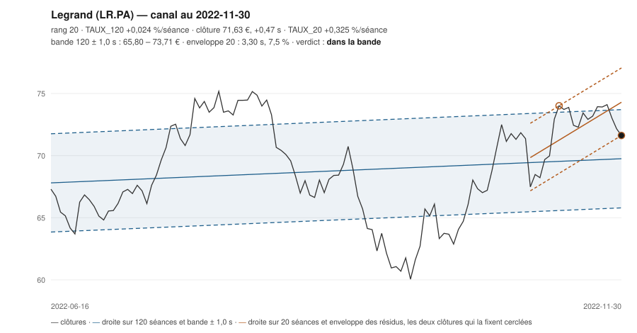

> Rang 20 · TAUX_120 +0,024 %/séance · clôture 71,63 € · bande 65,80 – 73,71 € · écart +0,47 s · TAUX_20 +0,325 %/séance · enveloppe 20 : 3,30 s, 7,5 % · **dans la bande**

- Clôture 71,63 €, à +0,47 s, dans la bande [65,80 ; 73,71] €.
- TAUX_120 +0,024 %/séance, positive depuis le 22 novembre, rang 20 ; TAUX_20 +0,325 %/séance. Signes concordants.
- Enveloppe de 3,30 s (7,5 % de E_20), sous les ~3,7 s attendues. La clôture du jour fixe la borne basse (20e séance), la borne haute est le 11 novembre (7e).
- Au-dessus du bord haut du 10 au 25 novembre (+1,80 s le 11), dans la bande depuis le 28 (3 séances), écart en recul à chacune d'elles.
- Verdict : dans la bande.

### 21. `RI.PA` — Pernod Ricard

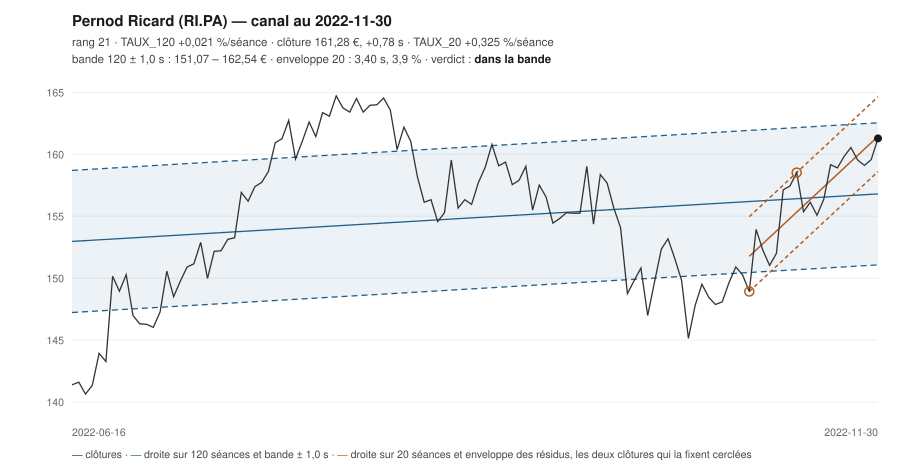

> Rang 21 · TAUX_120 +0,021 %/séance · clôture 161,28 € · bande 151,07 – 162,54 € · écart +0,78 s · TAUX_20 +0,325 %/séance · enveloppe 20 : 3,40 s, 3,9 % · **dans la bande**

- Clôture 161,28 €, à +0,78 s, dans la bande [151,07 ; 162,54] €.
- TAUX_120 +0,021 %/séance, rang 21 : 10e le 3 novembre, hors TOP 10 depuis le 7. TAUX_20 +0,325 %/séance. Signes concordants.
- Enveloppe de 3,40 s (3,9 % de E_20), sous les ~3,7 s attendues. Résidu bas le 3 novembre (1re séance), résidu haut le 14 novembre (8e).
- Le 3 novembre, sous le bord bas (−1,28 s) au rang 10, mais pente courte négative ce jour-là. Dans la bande depuis le 4 (19 séances) ; l'écart du jour est le plus haut de la fenêtre.
- Verdict : dans la bande.

### 22. `AI.PA` — Air Liquide

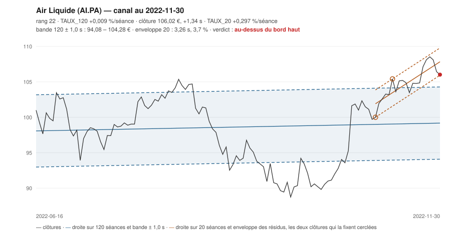

> Rang 22 · TAUX_120 +0,009 %/séance · clôture 106,02 € · bande 94,08 – 104,28 € · écart +1,34 s · TAUX_20 +0,297 %/séance · enveloppe 20 : 3,26 s, 3,7 % · **au-dessus du bord haut**

- Clôture 106,02 €, à +1,34 s, au-dessus de la bande [94,08 ; 104,28] €.
- TAUX_120 +0,009 %/séance, redevenu positif le 29 novembre, rang 22 ; TAUX_20 +0,297 %/séance. Signes concordants, pente longue presque nulle.
- Enveloppe : 3,26 s (3,7 % de E_20), sous les ~3,7 s attendues. Bornes anciennes : résidu bas le 3 novembre (1re séance), résidu haut le 10 novembre (6e).
- Au-dessus du bord haut de son canal du jour depuis le 24 octobre, soit 28 séances. Sur la fenêtre, l'écart va de +2,41 s (10 novembre) à +1,34 s ce jour, son plus bas.
- Verdict : au-dessus du bord haut.

### 23. `HO.PA` — Thales

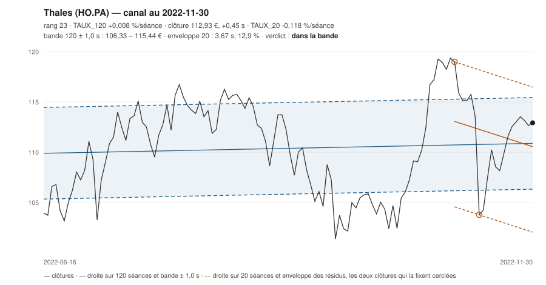

> Rang 23 · TAUX_120 +0,008 %/séance · clôture 112,93 € · bande 106,33 – 115,44 € · écart +0,45 s · TAUX_20 -0,118 %/séance · enveloppe 20 : 3,67 s, 12,9 % · **dans la bande**

- Clôture 112,93 €, à +0,45 s, dans la bande [106,33 ; 115,44] €.
- TAUX_120 +0,008 %/séance, rang 23, après un rang 11 le 3 novembre et une glissade continue depuis. Pente courte négative depuis le 15 novembre (TAUX_20 −0,118 %/séance). Les deux pentes divergent.
- Enveloppe de 3,67 s, conforme aux ~3,7 s attendues, mais 12,9 % de E_20. Résidu haut le 3 novembre (1re séance), résidu bas le 11 novembre (7e) : deux bornes anciennes.
- La bande a été traversée de haut en bas : au-dessus du bord haut les 3 et 4 novembre, 4 séances dans la bande, puis −1,69 s le 11 novembre, au rang 13. Dans la bande depuis le 15 (12 séances).
- Verdict : dans la bande.

### `CAP.PA` — Capgemini

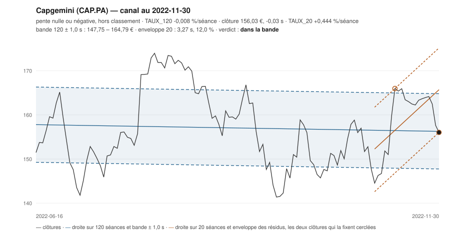

> Hors classement · TAUX_120 -0,008 %/séance · clôture 156,03 € · bande 147,75 – 164,79 € · écart -0,03 s · TAUX_20 +0,444 %/séance · enveloppe 20 : 3,27 s, 12,0 % · **dans la bande**

- Clôture 156,03 € à −0,03 s, sur la droite ajustée, au milieu de la bande [147,75 ; 164,79] €.
- TAUX_120 −0,008 %/séance (hors classement), TAUX_20 +0,444 %/séance : pente longue plate et légèrement négative, pente courte montante.
- Enveloppe de 3,27 s (12,0 % de E_20), sous les ~3,7 s attendues. La clôture du jour fixe la borne basse (20e séance) ; la borne haute est le 11 novembre (7e).
- Sous le bord bas le 3 novembre (−1,03 s), au-dessus du bord haut du 11 au 17 (+1,58 s le 11) : la bande traversée dans les deux sens en un mois. L'écart a perdu de +0,71 s le 28 à −0,03 s ; dans la bande depuis 9 séances.
- Verdict : dans la bande.

### `VIE.PA` — Veolia

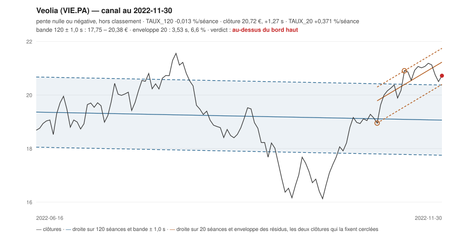

> Hors classement · TAUX_120 -0,013 %/séance · clôture 20,72 € · bande 17,75 – 20,38 € · écart +1,27 s · TAUX_20 +0,371 %/séance · enveloppe 20 : 3,53 s, 6,6 % · **au-dessus du bord haut**

- Clôture 20,72 €, à +1,27 s ; bande [17,75 ; 20,38] €.
- Pente longue négative (TAUX_120 −0,013 %/séance, hors classement), pente courte positive (+0,371 %/séance) : désaccord.
- Enveloppe de 3,53 s (6,6 % de E_20), un peu sous les ~3,7 s attendues. Résidu bas le 3 novembre (1re séance), résidu haut le 15 novembre (9e).
- Au-dessus du bord haut de son canal du jour depuis le 24 octobre (28 séances) ; l'écart a varié entre +1,15 s (29 novembre) et +2,33 s (15 novembre).
- Verdict : au-dessus du bord haut.

### `KER.PA` — Kering

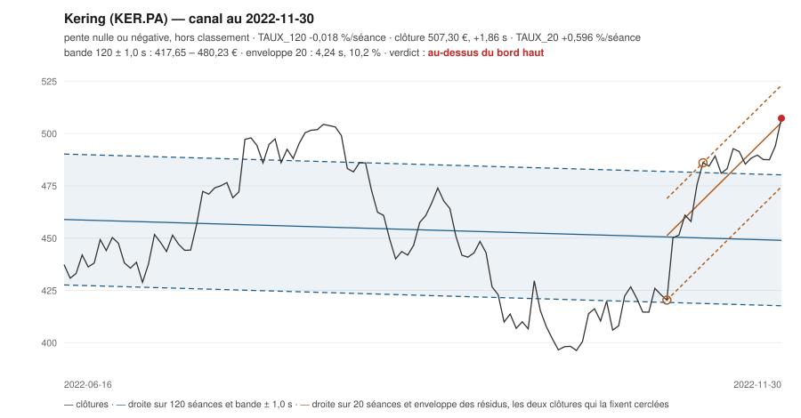

> Hors classement · TAUX_120 -0,018 %/séance · clôture 507,30 € · bande 417,65 – 480,23 € · écart +1,86 s · TAUX_20 +0,596 %/séance · enveloppe 20 : 4,24 s, 10,2 % · **au-dessus du bord haut**

- Clôture 507,30 €, à +1,86 s, au-dessus de la bande [417,65 ; 480,23] €.
- TAUX_120 −0,018 %/séance, hors classement ; TAUX_20 +0,596 %/séance. Pentes de signes opposés.
- Enveloppe de 4,24 s (10,2 % de E_20), au-dessus des ~3,7 s attendues. Résidu bas le 3 novembre (1re séance), résidu haut le 11 novembre (7e).
- L'écart est passé de −0,42 s le 3 novembre à +1,11 s le 8. Au-dessus du bord haut de son canal du jour depuis ce 8 novembre (17 séances), avec +2,03 s le 11.
- Verdict : au-dessus du bord haut.

### `OR.PA` — L'Oréal

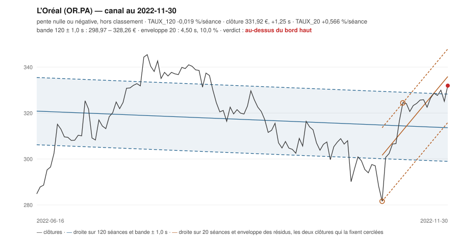

> Hors classement · TAUX_120 -0,019 %/séance · clôture 331,92 € · bande 298,97 – 328,26 € · écart +1,25 s · TAUX_20 +0,566 %/séance · enveloppe 20 : 4,50 s, 10,0 % · **au-dessus du bord haut**

- Clôture 331,92 €, à +1,25 s, au-dessus de la bande [298,97 ; 328,26] €.
- Pente longue négative depuis le 7 novembre (TAUX_120 −0,019 %/séance), hors classement ; pente courte +0,566 %/séance. Les deux pentes divergent.
- Enveloppe de 4,50 s (10,0 % de E_20), au-dessus des ~3,7 s attendues. Résidu bas le 3 novembre (1re séance), résidu haut le 11 novembre (7e).
- La bande a été traversée de bas en haut : −2,09 s le 3 novembre, 16 séances dans la bande, premier passage au-dessus du bord haut le 28. De nouveau au-dessus ce jour, après le +0,77 s du 29.
- Verdict : au-dessus du bord haut.

### `SGO.PA` — Saint-Gobain

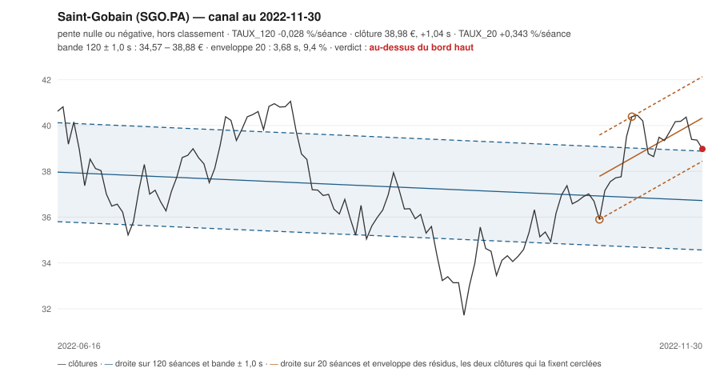

> Hors classement · TAUX_120 -0,028 %/séance · clôture 38,98 € · bande 34,57 – 38,88 € · écart +1,04 s · TAUX_20 +0,343 %/séance · enveloppe 20 : 3,68 s, 9,4 % · **au-dessus du bord haut**

- Clôture 38,98 €, à +1,04 s ; bande [34,57 ; 38,88] €.
- TAUX_120 −0,028 %/séance, hors classement ; TAUX_20 +0,343 %/séance. Signes opposés.
- Enveloppe de 3,68 s (9,4 % de E_20), conforme aux ~3,7 s attendues. Résidu bas le 3 novembre (1re séance), résidu haut le 11 novembre (7e).
- Au-dessus du bord haut de son canal du jour depuis le 24 octobre (28 séances). L'écart est descendu de +1,81 s le 25 novembre à +1,04 s ce jour, son plus bas de la période.
- Verdict : au-dessus du bord haut.

### `EN.PA` — Bouygues

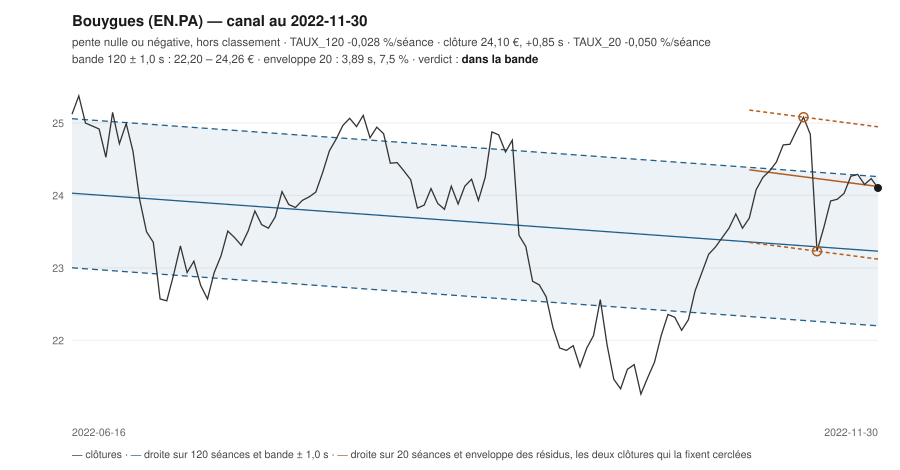

> Hors classement · TAUX_120 -0,028 %/séance · clôture 24,10 € · bande 22,20 – 24,26 € · écart +0,85 s · TAUX_20 -0,050 %/séance · enveloppe 20 : 3,89 s, 7,5 % · **dans la bande**

- Clôture 24,10 €, à +0,85 s, dans la bande [22,20 ; 24,26] €.
- Pente longue négative (TAUX_120 −0,028 %/séance, hors classement) et pente courte négative depuis 2 séances (TAUX_20 −0,050 %/séance) : concordance à la baisse, sur deux pentes faibles.
- Enveloppe de 3,89 s (7,5 % de E_20), un peu au-dessus des ~3,7 s attendues. Ses bornes sont au milieu de la fenêtre et à deux séances d'écart : résidu haut le 15 novembre (9e), résidu bas le 17 (11e).
- Au-dessus du bord haut jusqu'au 16 novembre (+2,23 s le 15), l'écart tombe à +0,38 s le 17. Deux nouveaux passages au-dessus du bord haut suivent, les 24 et 25 puis le 29 ; dans la bande ce jour.
- Verdict : dans la bande.

### `ML.PA` — Michelin

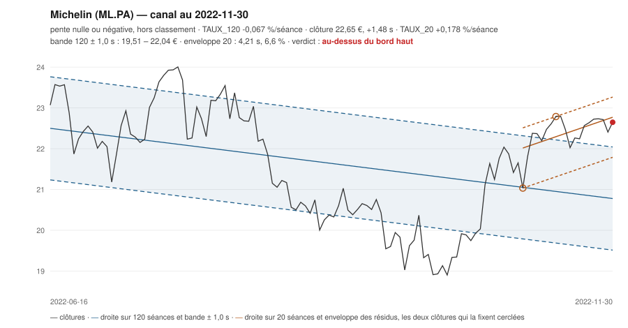

> Hors classement · TAUX_120 -0,067 %/séance · clôture 22,65 € · bande 19,51 – 22,04 € · écart +1,48 s · TAUX_20 +0,178 %/séance · enveloppe 20 : 4,21 s, 6,6 % · **au-dessus du bord haut**

- Clôture 22,65 €, à +1,48 s ; bande à 120 séances [19,51 ; 22,04] €.
- Pente longue négative (TAUX_120 −0,067 %/séance, hors classement), pente courte positive (+0,178 %/séance) : désaccord.
- Enveloppe de 4,21 s (6,6 % de E_20), au-dessus des ~3,7 s attendues. Résidu bas le 3 novembre (1re séance), résidu haut le 14 novembre (8e).
- Au-dessus du bord haut de son canal du jour depuis le 24 octobre, soit 28 séances. L'écart culmine à +2,66 s le 7 novembre et touche +1,35 s le 29.
- Verdict : au-dessus du bord haut.

### `DSY.PA` — Dassault Systèmes

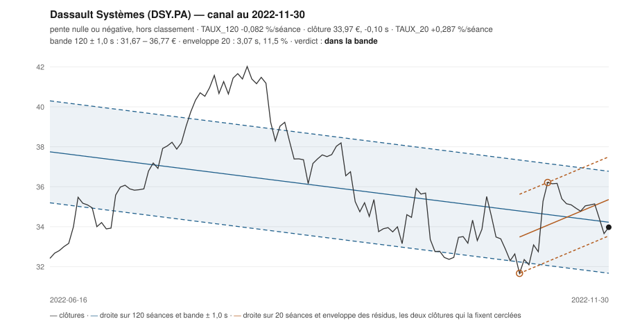

> Hors classement · TAUX_120 -0,082 %/séance · clôture 33,97 € · bande 31,67 – 36,77 € · écart -0,10 s · TAUX_20 +0,287 %/séance · enveloppe 20 : 3,07 s, 11,5 % · **dans la bande**

- Clôture 33,97 €, à −0,10 s, dans la bande [31,67 ; 36,77] €.
- Pente longue négative (TAUX_120 −0,082 %/séance, hors classement), pente courte positive (+0,287 %/séance) : désaccord.
- Enveloppe de 3,07 s (11,5 % de E_20), sous les ~3,7 s attendues. Bornes anciennes : résidu bas le 3 novembre (1re séance), résidu haut le 11 novembre (7e).
- Sous le bord bas les 3 et 7 novembre (−1,27 s le 3), dans la bande depuis le 8 (17 séances). Depuis le 16 novembre, l'écart se tient entre −0,26 et +0,28 s.
- Verdict : dans la bande.

### `ALO.PA` — Alstom

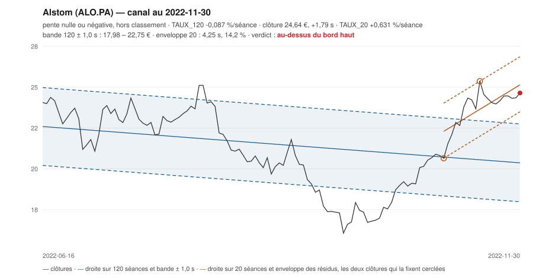

> Hors classement · TAUX_120 -0,087 %/séance · clôture 24,64 € · bande 17,98 – 22,75 € · écart +1,79 s · TAUX_20 +0,631 %/séance · enveloppe 20 : 4,25 s, 14,2 % · **au-dessus du bord haut**

- Clôture 24,64 €, à +1,79 s de la droite longue ; bande [17,98 ; 22,75] €.
- TAUX_120 −0,087 %/séance, hors classement ; TAUX_20 +0,631 %/séance. Désaccord des deux pentes.
- Enveloppe de 4,25 s (14,2 % de E_20), au-dessus des ~3,7 s attendues. Résidu bas le 3 novembre (1re séance), résidu haut le 16 novembre (10e).
- Au-dessus du bord haut de son canal du jour depuis le 26 octobre (26 séances), avec +3,35 s le 11 novembre. L'écart reste sous +2 s depuis le 25.
- Verdict : au-dessus du bord haut.

### `BN.PA` — Danone

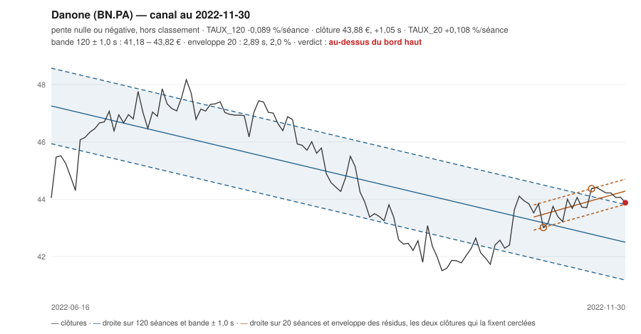

> Hors classement · TAUX_120 -0,089 %/séance · clôture 43,88 € · bande 41,18 – 43,82 € · écart +1,05 s · TAUX_20 +0,108 %/séance · enveloppe 20 : 2,89 s, 2,0 % · **au-dessus du bord haut**

- Clôture 43,88 € à +1,05 s, environ 6 centimes au-dessus du bord haut de la bande [41,18 ; 43,82] €.
- Pente longue négative (TAUX_120 −0,089 %/séance, hors classement), pente courte positive (+0,108 %/séance) : elles ne concordent pas.
- Enveloppe de 2,89 s (2,0 % de E_20), bien sous les ~3,7 s attendues. Résidu bas le 7 novembre (3e séance), résidu haut le 21 novembre (13e).
- Sept bascules autour du bord haut sur la fenêtre, l'écart restant entre +0,42 et +1,45 s. Au-dessus depuis le 21 novembre (8 séances).
- Verdict : au-dessus du bord haut.

### `CA.PA` — Carrefour

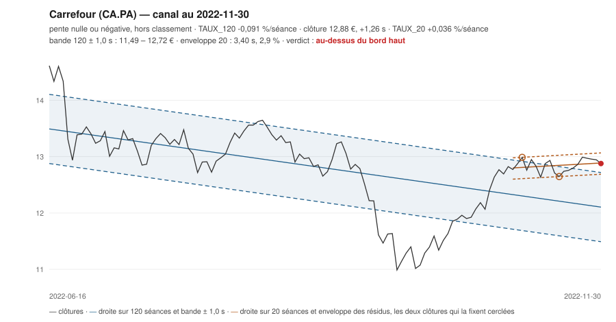

> Hors classement · TAUX_120 -0,091 %/séance · clôture 12,88 € · bande 11,49 – 12,72 € · écart +1,26 s · TAUX_20 +0,036 %/séance · enveloppe 20 : 3,40 s, 2,9 % · **au-dessus du bord haut**

- Clôture 12,88 €, à +1,26 s ; bande à 120 séances [11,49 ; 12,72] €.
- Pente longue négative (TAUX_120 −0,091 %/séance, hors classement), pente courte à peine positive (+0,036 %/séance) : signes opposés.
- Enveloppe de 3,40 s (2,9 % de E_20), sous les ~3,7 s attendues. Résidu haut le 7 novembre (3e séance), résidu bas le 17 novembre (11e).
- Au-dessus du bord haut depuis le 24 octobre (28 séances). L'écart s'est érodé de +2,35 s (7 novembre) à +1,26 s ce jour, son plus bas de la fenêtre.
- Verdict : au-dessus du bord haut.

### `ORA.PA` — Orange

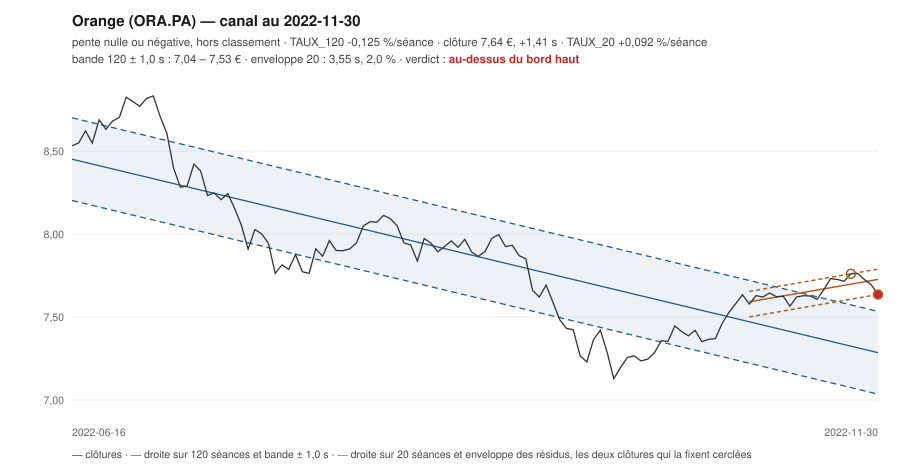

> Hors classement · TAUX_120 -0,125 %/séance · clôture 7,64 € · bande 7,04 – 7,53 € · écart +1,41 s · TAUX_20 +0,092 %/séance · enveloppe 20 : 3,55 s, 2,0 % · **au-dessus du bord haut**

- Clôture 7,64 €, à +1,41 s ; bande [7,04 ; 7,53] €.
- TAUX_120 −0,125 %/séance (hors classement), TAUX_20 +0,092 %/séance : pentes de signes opposés.
- Enveloppe de 3,55 s (2,0 % de E_20), légèrement sous les ~3,7 s attendues. Ses deux bornes sont récentes : résidu haut le 24 novembre (16e séance), résidu bas ce jour (20e).
- Au-dessus du bord haut de son canal du jour depuis le 28 octobre (24 séances). L'écart du jour est le plus bas de la fenêtre.
- Verdict : au-dessus du bord haut.

### `SAN.PA` — Sanofi

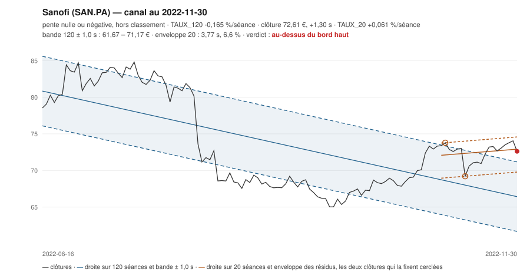

> Hors classement · TAUX_120 -0,165 %/séance · clôture 72,61 € · bande 61,67 – 71,17 € · écart +1,30 s · TAUX_20 +0,061 %/séance · enveloppe 20 : 3,77 s, 6,6 % · **au-dessus du bord haut**

- Clôture 72,61 €, à +1,30 s, au-dessus de la bande [61,67 ; 71,17] €.
- Pente longue négative (TAUX_120 −0,165 %/séance, hors classement) ; pente courte faiblement positive (+0,061 %/séance), négative du 23 au 25 novembre. Pas de concordance.
- Enveloppe de 3,77 s (6,6 % de E_20), proche des ~3,7 s attendues. Résidu haut le 4 novembre (2e séance), résidu bas le 11 novembre (7e).
- Une seule séance dans la bande sur la fenêtre, le 11 novembre (+0,93 s) ; au-dessus du bord haut depuis le 14 (13 séances).
- Verdict : au-dessus du bord haut.

### `ERF.PA` — Eurofins Scientific

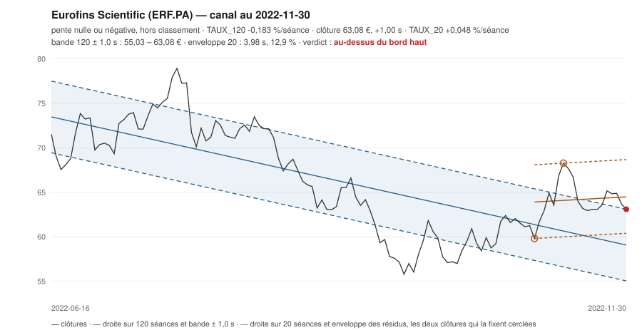

> Hors classement · TAUX_120 -0,183 %/séance · clôture 63,08 € · bande 55,03 – 63,08 € · écart +1,00 s · TAUX_20 +0,048 %/séance · enveloppe 20 : 3,98 s, 12,9 % · **au-dessus du bord haut**

- Clôture 63,08 €, à +1,0005 s : le bord haut de la bande [55,03 ; 63,08] € est franchi d'une fraction de centime.
- Pente longue négative (TAUX_120 −0,183 %/séance, hors classement), pente courte à peine positive (+0,048 %/séance) : désaccord.
- Enveloppe de 3,98 s (12,9 % de E_20), au-dessus des ~3,7 s attendues. Résidu bas le 3 novembre (1re séance), résidu haut le 11 novembre (7e).
- Au-dessus du bord haut depuis le 4 novembre (19 séances), avec +2,85 s le 11. L'écart a reculé depuis le 24 (+1,62 s) jusqu'à la limite de ce jour.
- Verdict : au-dessus du bord haut.

### `VIV.PA` — Vivendi

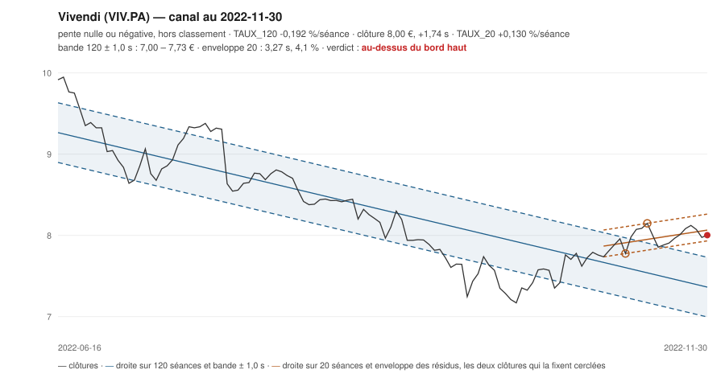

> Hors classement · TAUX_120 -0,192 %/séance · clôture 8,00 € · bande 7,00 – 7,73 € · écart +1,74 s · TAUX_20 +0,130 %/séance · enveloppe 20 : 3,27 s, 4,1 % · **au-dessus du bord haut**

- Clôture 8,00 €, à +1,74 s, au-dessus de la bande [7,00 ; 7,73] €.
- TAUX_120 −0,192 %/séance, hors classement ; TAUX_20 +0,130 %/séance. Les deux pentes divergent.
- Enveloppe de 3,27 s (4,1 % de E_20), sous les ~3,7 s attendues. Résidu bas le 9 novembre (5e séance), résidu haut le 15 novembre (9e).
- Au-dessus du bord haut depuis le 25 octobre (27 séances), l'écart ne descendant pas sous +1,70 s sur la fenêtre (+2,65 s le 11 novembre).
- Verdict : au-dessus du bord haut.

### `TEP.PA` — Teleperformance

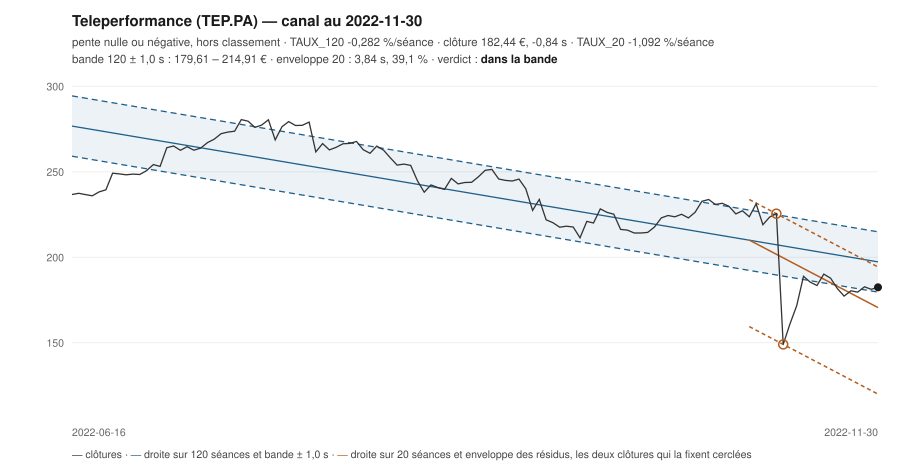

> Hors classement · TAUX_120 -0,282 %/séance · clôture 182,44 € · bande 179,61 – 214,91 € · écart -0,84 s · TAUX_20 -1,092 %/séance · enveloppe 20 : 3,84 s, 39,1 % · **dans la bande**

- Clôture 182,44 €, à −0,84 s, dans la bande [179,61 ; 214,91] €.
- Pente longue négative (TAUX_120 −0,282 %/séance, hors classement), pente courte très négative depuis le 10 novembre (TAUX_20 −1,092 %/séance) : concordance à la baisse.
- L'enveloppe vaut 3,84 s, un nombre ordinaire en unités de s, mais 39,1 % de E_20. Ses deux bornes sont deux séances consécutives : la clôture de 225,47 € le 9 novembre (5e, résidu haut) et celle de 149,03 € le 10 (6e, résidu bas). Une seule rupture fixe toute la largeur.
- Le 10 novembre, l'écart est passé de +0,04 s à −4,56 s. Il est resté sous le bord bas du canal du jour pendant 13 séances, puis est rentré dans la bande le 29 novembre (2 séances).
- Verdict : dans la bande.

### Les figures des ordres du mois

*Aucun ordre ce mois-ci.*

## 5. Le TOP 10 au 2022-11-30

| Rang | Valeur | TAUX_120 | Écart | TAUX_20 | Verdict |
|---|---|---|---|---|---|
| 1 | `PUB.PA` Publicis | +0,301 %/séance | +0,56 s | +0,403 %/séance | dans la bande |
| 2 | `RNO.PA` Renault | +0,259 %/séance | +0,85 s | +0,667 %/séance | dans la bande |
| 3 | `RMS.PA` Hermès International | +0,226 %/séance | +1,13 s | +0,646 %/séance | au-dessus du bord haut |
| 4 | `WLN.PA` Worldline | +0,192 %/séance | -0,72 s | +0,155 %/séance | dans la bande |
| 5 | `ENGI.PA` Engie | +0,187 %/séance | +1,11 s | +0,452 %/séance | au-dessus du bord haut |
| 6 | `CS.PA` AXA | +0,181 %/séance | +0,61 s | +0,237 %/séance | dans la bande |
| 7 | `TTE.PA` TotalEnergies | +0,153 %/séance | +1,91 s | +0,152 %/séance | au-dessus du bord haut |
| 8 | `EL.PA` EssilorLuxottica | +0,127 %/séance | +1,42 s | +0,461 %/séance | au-dessus du bord haut |
| 9 | `SAF.PA` Safran | +0,120 %/séance | +1,00 s | +0,239 %/séance | au-dessus du bord haut |
| 10 | `SU.PA` Schneider Electric | +0,118 %/séance | +0,61 s | +0,356 %/séance | dans la bande |

**Entrées et sorties du TOP 10 au fil du mois**

| Séance | Entrées | Sorties |
|---|---|---|
| 2022-11-07 | `TTE.PA` | `RI.PA` |
| 2022-11-25 | `SU.PA` | `MC.PA` |

## 6. Les ordres exécutés

> À l'**ouverture** de la séance qui suit la décision, jamais à la clôture qui l'a déclenchée. L'écart d'ouverture est subi, et publié.

*Aucun ordre : aucune valeur n'a franchi un bord de sa bande.*

## 7. Les signaux non exécutés

| Décision | Valeur | Rang | Écart | TAUX_20 | Sort |
|---|---|---|---|---|---|
| 2022-11-17 | `WLN.PA` Worldline | 4 | -1,19 s | +0,082 %/séance | REFUSE DIVISION |

## 8. La lecture du mois

Sur le mois, la meilleure contribution vient de `RNO.PA` (Renault) pour **+274,24 €**, la moins bonne de `RNO.PA` (Renault) pour **+274,24 €**. Aucun ordre, donc aucun frais. Le portefeuille termine le mois **derrière TR39** de 3,14 point.

---

[← Octobre](2022-10.md) · [Protocole](../README.md) · [Décembre →](2022-12.md)
