# Décembre 2022

> Journal de l'[expérience 4](../README.md) · exécutions du 2022-12-01 au 2022-12-30 · **0 ordre**
> Portefeuille au 2022-12-30 : **10 051,09 €** (base 100,51) · TR39 89,82 · alpha du mois **+1,46 pt** · depuis janvier **+10,69 pt**

---

## 1. Les actualités du mois précédent

**Novembre 2022.** Le rebond se confirme et s'élargit. L'inflation américaine
d'octobre, publiée le 10 novembre, ressort enfin en dessous des attentes, et le
marché conclut au ralentissement du rythme des hausses de taux. Les indices
européens gagnent encore plusieurs points ; les bancaires, l'aéronautique et le
luxe mènent la reprise.

La Chine assouplit sa politique « zéro Covid » après des manifestations
inhabituelles, ce que les valeurs du luxe et des matières premières accueillent
favorablement. L'euro repasse au-dessus de 1,03 dollar. Le pétrole, lui, recule
sous ses niveaux de février : la crainte de la récession l'emporte désormais sur
celle de la pénurie.

## 2. L'exposition héritée au 2022-11-30

| Valeur | Achetée le | Prix d'achat | Cours | +/− value | Alpha depuis l'achat |
|---|---|---|---|---|---|
| `RNO.PA` Renault | 2022-09-26 | 23,21 € | 29,47 € | **+26,97 %** | +12,13 pt |

## 3. Le portefeuille depuis le 2022-01-03

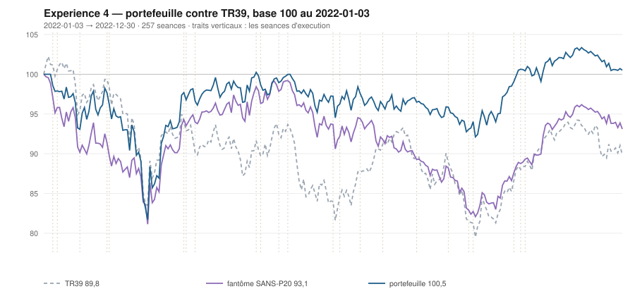

| | |
|---|---|
| Dotation initiale | 10 000,00 € au 2022-01-03 |
| Titres au 2022-12-30 | 2 356,26 € |
| Espèces | 7 694,82 € |
| Lignes détenues | 1 |
| **Total** | **10 051,09 €** |
| Base 100 | **100,51** |
| Fantôme `SANS-P20`, même base | 93,10 |
| TR39, même base | 89,82 |
| Écart depuis janvier | **+10,69 pt** |

### Toutes les positions depuis le début de l'expérience

> Closes comme ouvertes. Aucune séance postérieure au 2022-12-30 n'entre dans ce tableau.

| Société | Prix d'achat | Date d'achat | Prix de vente | Date de vente |
|---|---|---|---|---|
| `CAP.PA` Capgemini | 182,86 € | 2022-01-07 | 181,51 € | 2022-03-30 |
| `EL.PA` EssilorLuxottica | 162,03 € | 2022-01-07 | 153,11 € | 2022-03-30 |
| `RI.PA` Pernod Ricard | 173,52 € | 2022-01-07 | 164,76 € | 2022-03-31 |
| `STMPA.PA` STMicroelectronics | 41,80 € | 2022-01-11 | 39,65 € | 2022-03-30 |
| `BNP.PA` BNP Paribas | 43,84 € | 2022-01-25 | 48,20 € | 2022-02-10 |
| `MC.PA` LVMH | 633,54 € | 2022-02-11 | 558,12 € | 2022-05-31 |
| `SAN.PA` Sanofi | 74,66 € | 2022-03-30 | 77,80 € | 2022-04-06 |
| `TTE.PA` TotalEnergies | 36,38 € | 2022-03-30 | 40,80 € | 2022-05-17 |
| `DG.PA` Vinci | 73,34 € | 2022-04-06 | 77,14 € | 2022-07-20 |
| `CA.PA` Carrefour | 15,17 € | 2022-05-19 | 13,26 € | 2022-09-13 |
| `HO.PA` Thales | 105,72 € | 2022-06-06 | 117,32 € | 2022-10-27 |
| `SAN.PA` Sanofi | 82,42 € | 2022-07-04 | 68,65 € | 2022-10-24 |
| `ORA.PA` Orange | 8,65 € | 2022-07-07 | 7,49 € | 2022-10-31 |
| `TTE.PA` TotalEnergies | 38,39 € | 2022-08-03 | 43,55 € | 2022-08-24 |
| `RNO.PA` Renault | 23,21 € | 2022-09-26 |  |  |
| `ENGI.PA` Engie | 8,69 € | 2022-09-28 | 9,49 € | 2022-10-31 |

*16 positions depuis le début, dont 1 encore ouverte : les deux dernières colonnes restent vides.*

## 4. L'étude chartiste au 2022-12-30

> Une entrée par société de l'univers, sous la figure de canal lue à la clôture du 2022-12-30. La ligne en retrait est **calculée** ; la note qui suit est celle de l'agent `chartiste`, rédigée sans aucune séance postérieure.

### 1. `PUB.PA` — Publicis

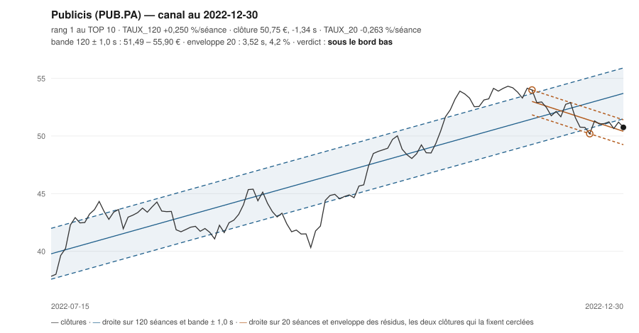

> Rang 1 · TAUX_120 +0,250 %/séance · clôture 50,75 € · bande 51,49 – 55,90 € · écart -1,34 s · TAUX_20 -0,263 %/séance · enveloppe 20 : 3,52 s, 4,2 % · **sous le bord bas**

- Clôture 50,75 €, à −1,34 s, sous le bord bas de la bande [51,49 ; 55,90] €.
- TAUX_120 +0,250 %/séance, 1re du TOP 10 aux 20 séances ; TAUX_20 −0,263 %/séance, négative depuis le 8 décembre. Les deux pentes s'opposent.
- Enveloppe de 3,52 s (4,2 % de E_20), un peu sous les ~3,7 s attendues. Résidu haut le 2 décembre (1re séance), résidu bas le 20 (13e).
- Sous le bord bas de son canal du jour depuis le 16 décembre (10 séances), avec −1,61 s le 20. Sa pente courte était déjà négative quand l'écart a franchi −1.
- Verdict selon la règle (dernière séance, aucune décision) : sous le bord bas sans être candidate, pente courte ≤ 0 (rang 1, dans le TOP 10).

### 2. `TTE.PA` — TotalEnergies

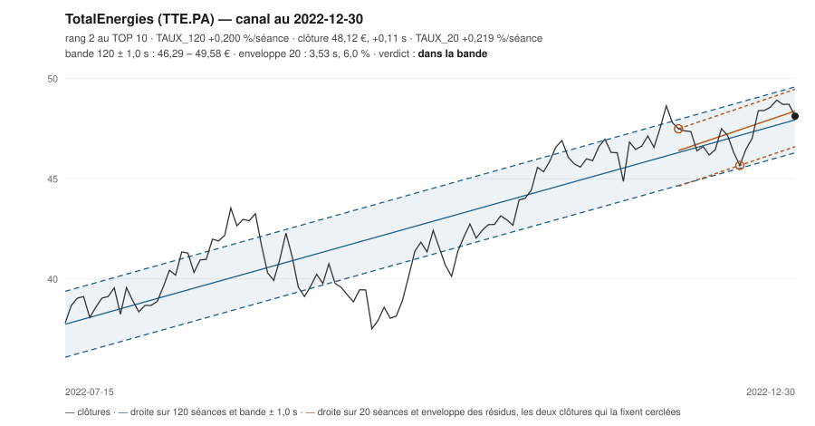

> Rang 2 · TAUX_120 +0,200 %/séance · clôture 48,12 € · bande 46,29 – 49,58 € · écart +0,11 s · TAUX_20 +0,219 %/séance · enveloppe 20 : 3,53 s, 6,0 % · **dans la bande**

- Clôture 48,12 €, à +0,11 s, dans la bande [46,29 ; 49,58] €.
- TAUX_120 +0,200 %/séance, 2e du TOP 10 depuis le 29 décembre (7e le 2) ; TAUX_20 +0,219 %/séance, redevenue positive le 23. Concordance.
- Enveloppe : 3,53 s (6,0 % de E_20), un peu sous les ~3,7 s attendues. Résidu haut le 2 décembre (1re séance), résidu bas le 16 (11e).
- Dans la bande depuis le 5 décembre (19 séances), écart entre −0,65 s (16 décembre) et +0,94 s.
- Verdict selon la règle, sans décision ce jour : dans la bande.

### 3. `RNO.PA` — Renault

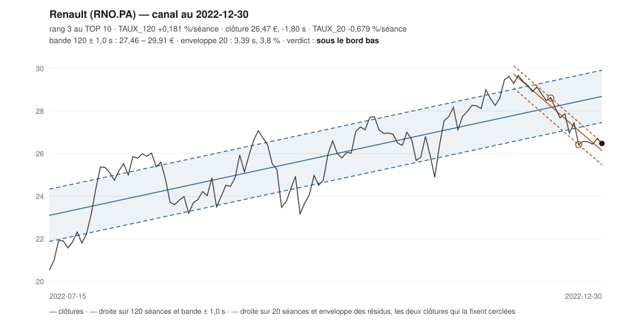

> Rang 3 · TAUX_120 +0,181 %/séance · clôture 26,47 € · bande 27,46 – 29,91 € · écart -1,80 s · TAUX_20 -0,679 %/séance · enveloppe 20 : 3,39 s, 3,8 % · **sous le bord bas**

- Clôture 26,47 €, à −1,80 s, sous le bord bas de la bande [27,46 ; 29,91] €.
- TAUX_120 +0,181 %/séance, 3e du TOP 10 (2e jusqu'au 28 décembre) ; TAUX_20 −0,679 %/séance. Les deux pentes s'opposent nettement.
- Enveloppe de 3,39 s (3,8 % de E_20), sous les ~3,7 s attendues. Résidu haut le 14 décembre (9e séance), résidu bas le 22 (15e).
- Sous le bord bas de son canal du jour depuis le 16 décembre, soit 10 séances, avec −2,07 s le 22. La pente courte est devenue négative le même 16 décembre.
- Verdict selon la règle (dernière séance, sans décision) : sous le bord bas sans être candidate, pente courte ≤ 0 (rang 3, dans le TOP 10).

### 4. `CS.PA` — AXA

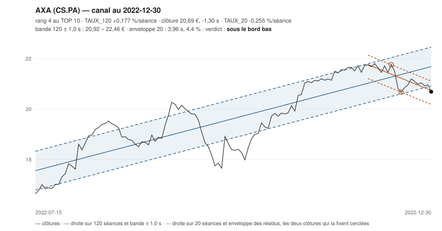

> Rang 4 · TAUX_120 +0,177 %/séance · clôture 20,69 € · bande 20,92 – 22,46 € · écart -1,30 s · TAUX_20 -0,255 %/séance · enveloppe 20 : 3,96 s, 4,4 % · **sous le bord bas**

- Clôture 20,69 €, à −1,30 s, sous le bord bas de la bande [20,92 ; 22,46] €.
- TAUX_120 +0,177 %/séance, 4e du TOP 10 ; TAUX_20 −0,255 %/séance, négative depuis le 15 décembre. Les deux pentes divergent.
- Enveloppe : 3,96 s (4,4 % de E_20), au-dessus des ~3,7 s attendues. Résidu haut le 13 décembre (8e séance), résidu bas le 16 (11e).
- Sous le bord bas du 15 au 19 décembre, puis le 28, et de nouveau ce jour, avec l'écart le plus bas de la fenêtre. Chacun de ces passages a coïncidé avec une pente courte négative.
- Verdict selon la règle, sans décision ce jour : sous le bord bas sans être candidate, pente courte ≤ 0 (rang 4, dans le TOP 10).

### 5. `RMS.PA` — Hermès International

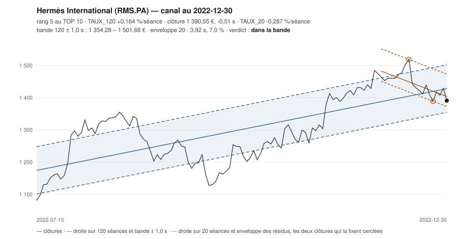

> Rang 5 · TAUX_120 +0,164 %/séance · clôture 1 390,55 € · bande 1 354,28 – 1 501,68 € · écart -0,51 s · TAUX_20 -0,287 %/séance · enveloppe 20 : 3,92 s, 7,0 % · **dans la bande**

- Clôture 1 390,55 €, à −0,51 s, dans la bande [1 354,28 ; 1 501,68] €.
- TAUX_120 +0,164 %/séance, 5e du TOP 10 (3e jusqu'au 15 décembre) ; TAUX_20 −0,287 %/séance, négative depuis le 22. Les pentes divergent.
- Enveloppe de 3,92 s (7,0 % de E_20), un peu au-dessus des ~3,7 s attendues. Résidu haut le 14 décembre (9e séance), résidu bas le 23 (16e).
- Au-dessus du bord haut les 13 et 14 décembre (+1,20 s), dans la bande depuis le 15 (11 séances), avec −0,52 s au plus bas le 23.
- Verdict selon la règle, sans décision à cette dernière séance : dans la bande.

### 6. `ENGI.PA` — Engie

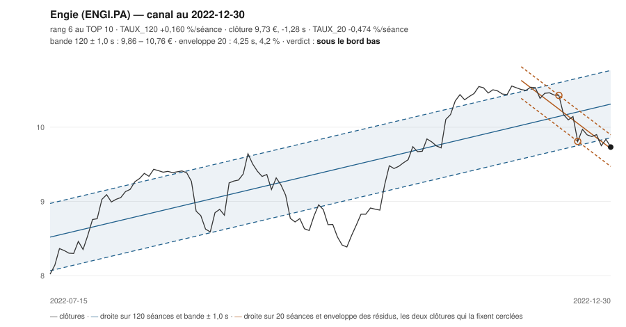

> Rang 6 · TAUX_120 +0,160 %/séance · clôture 9,73 € · bande 9,86 – 10,76 € · écart -1,28 s · TAUX_20 -0,474 %/séance · enveloppe 20 : 4,25 s, 4,2 % · **sous le bord bas**

- Clôture 9,73 €, à −1,28 s, sous le bord bas de la bande [9,86 ; 10,76] €.
- TAUX_120 +0,160 %/séance, 6e du TOP 10 ; TAUX_20 −0,474 %/séance, négative depuis le 14 décembre. Les deux pentes s'opposent.
- Enveloppe de 4,25 s (4,2 % de E_20), au-dessus des ~3,7 s attendues. Résidu haut le 14 décembre (9e séance), résidu bas le 20 (13e).
- Six des huit dernières séances sous le bord bas de leur canal du jour, dont les trois dernières (−1,29 s le 28). L'écart valait +0,85 s le 2 décembre.
- Verdict selon la règle, sans décision à cette dernière séance : sous le bord bas sans être candidate, pente courte ≤ 0 (rang 6, dans le TOP 10).

### 7. `BNP.PA` — BNP Paribas

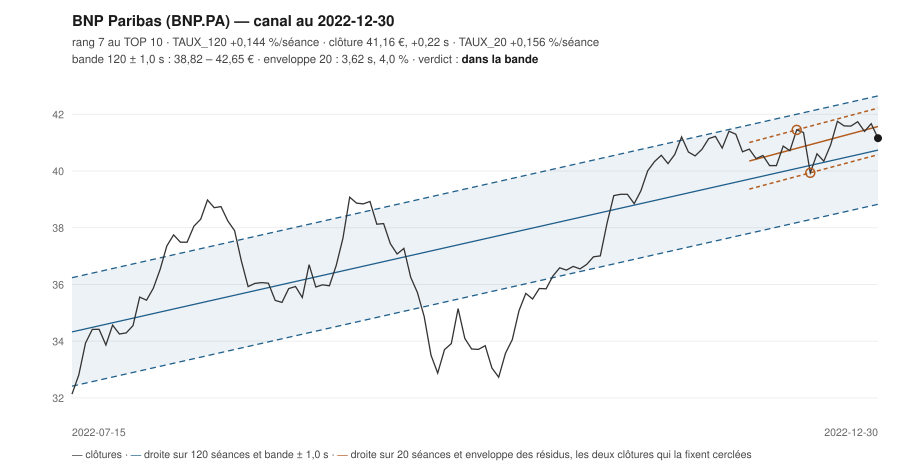

> Rang 7 · TAUX_120 +0,144 %/séance · clôture 41,16 € · bande 38,82 – 42,65 € · écart +0,22 s · TAUX_20 +0,156 %/séance · enveloppe 20 : 3,62 s, 4,0 % · **dans la bande**

- Clôture 41,16 €, à +0,22 s, dans la bande [38,82 ; 42,65] €.
- TAUX_120 +0,144 %/séance, 7e du TOP 10 (entrée le 9 décembre) ; TAUX_20 +0,156 %/séance, positive depuis le 22 après deux épisodes négatifs. Les pentes concordent.
- Enveloppe de 3,62 s (4,0 % de E_20), proche des ~3,7 s attendues. Résidu haut le 13 décembre (8e séance), résidu bas le 15 (10e).
- Dans la bande aux 20 séances de la fenêtre, avec un écart entre +0,01 s (15 décembre) et +0,99 s (2 décembre).
- Verdict selon la règle (dernière séance, aucune décision) : dans la bande.

### 8. `EL.PA` — EssilorLuxottica

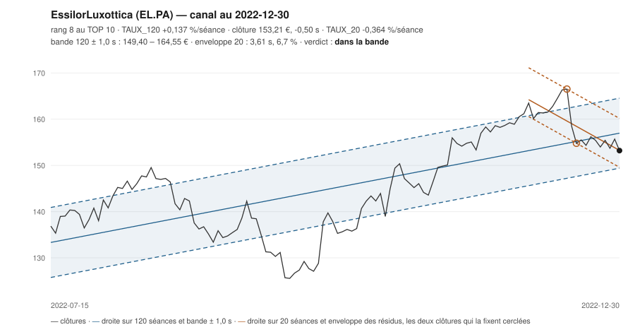

> Rang 8 · TAUX_120 +0,137 %/séance · clôture 153,21 € · bande 149,40 – 164,55 € · écart -0,50 s · TAUX_20 -0,364 %/séance · enveloppe 20 : 3,61 s, 6,7 % · **dans la bande**

- Clôture 153,21 €, à −0,50 s, dans la bande [149,40 ; 164,55] €.
- TAUX_120 +0,137 %/séance, 8e du TOP 10 ; TAUX_20 −0,364 %/séance, négative depuis le 20 décembre. Les pentes divergent.
- Enveloppe de 3,61 s (6,7 % de E_20), proche des ~3,7 s attendues. Ses bornes sont à deux séances d'écart : résidu haut le 14 décembre (9e), résidu bas le 16 (11e).
- Au-dessus du bord haut jusqu'au 14 décembre, série ouverte le 7 novembre. L'écart est passé de +1,46 s à +0,35 s le 15 ; dans la bande depuis 11 séances, avec ce jour le plus bas de la fenêtre.
- Verdict selon la règle (dernière séance, sans décision) : dans la bande.

### 9. `SAF.PA` — Safran

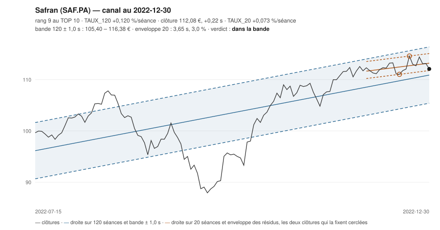

> Rang 9 · TAUX_120 +0,120 %/séance · clôture 112,08 € · bande 105,40 – 116,38 € · écart +0,22 s · TAUX_20 +0,073 %/séance · enveloppe 20 : 3,65 s, 3,0 % · **dans la bande**

- Clôture 112,08 €, à +0,22 s, dans la bande [105,40 ; 116,38] €.
- TAUX_120 +0,120 %/séance, 9e du TOP 10 ; TAUX_20 +0,073 %/séance, positive aux 20 séances. Les deux pentes concordent.
- Enveloppe : 3,65 s (3,0 % de E_20), conforme aux ~3,7 s attendues. Résidu bas le 16 décembre (11e séance), résidu haut le 21 (14e).
- Dans la bande depuis le 1er décembre (21 séances). L'écart du jour est le plus bas de la fenêtre, dont le maximum est +0,91 s le 21.
- Verdict selon la règle, sans décision ce jour : dans la bande.

### 10. `AIR.PA` — Airbus

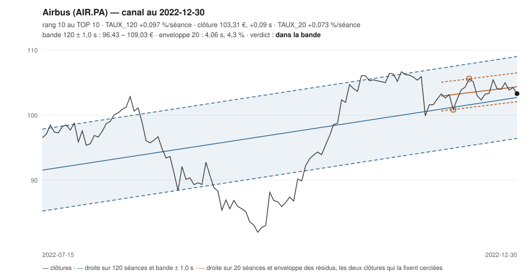

> Rang 10 · TAUX_120 +0,097 %/séance · clôture 103,31 € · bande 96,43 – 109,03 € · écart +0,09 s · TAUX_20 +0,073 %/séance · enveloppe 20 : 4,06 s, 4,3 % · **dans la bande**

- Clôture 103,31 €, à +0,09 s, sur la droite ajustée ; bande [96,43 ; 109,03] €.
- TAUX_120 +0,097 %/séance, 10e du TOP 10, entrée le 27 décembre ; TAUX_20 +0,073 %/séance, positive depuis le 21. Concordance.
- Enveloppe de 4,06 s (4,3 % de E_20), au-dessus des ~3,7 s attendues. Résidu bas le 7 décembre (4e séance), résidu haut le 13 décembre (8e).
- Dans la bande depuis le 28 novembre (24 séances), écart jamais sorti de [+0,03 ; +0,68] s sur la fenêtre.
- Verdict selon la règle, la séance ne portant pas de décision : dans la bande.

### 11. `MT.AS` — ArcelorMittal

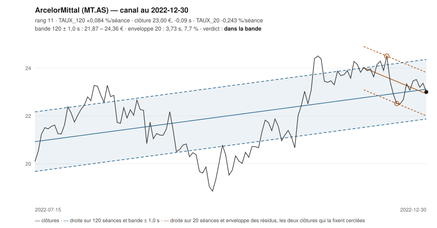

> Rang 11 · TAUX_120 +0,084 %/séance · clôture 23,00 € · bande 21,87 – 24,36 € · écart -0,09 s · TAUX_20 -0,243 %/séance · enveloppe 20 : 3,73 s, 7,7 % · **dans la bande**

- Clôture 23,00 €, à −0,09 s, dans la bande [21,87 ; 24,36] €.
- TAUX_120 +0,084 %/séance, rang 11, remonté depuis le rang 18 du 2 décembre ; TAUX_20 −0,243 %/séance, négative depuis le 16. Les pentes divergent.
- Enveloppe de 3,73 s (7,7 % de E_20), conforme aux ~3,7 s attendues. Résidu haut le 13 décembre (8e séance), résidu bas le 16 (11e).
- Au-dessus du bord haut par intermittence jusqu'au 13 décembre, dans la bande depuis le 14 (12 séances), écart entre −0,40 et +0,36 s depuis.
- Verdict selon la règle (dernière séance, sans décision) : dans la bande.

### 12. `SU.PA` — Schneider Electric

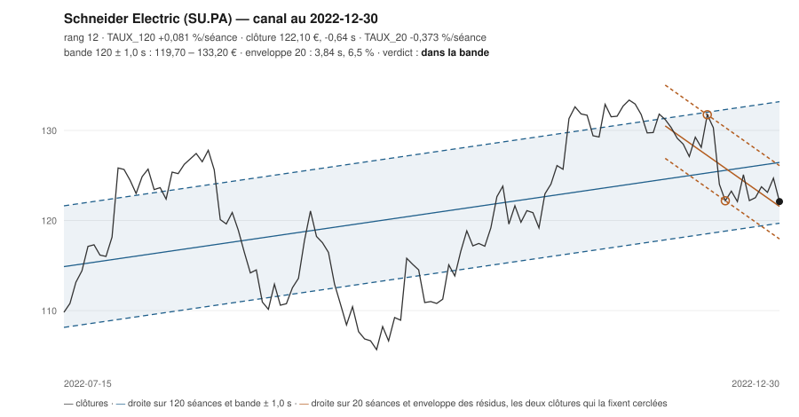

> Rang 12 · TAUX_120 +0,081 %/séance · clôture 122,10 € · bande 119,70 – 133,20 € · écart -0,64 s · TAUX_20 -0,373 %/séance · enveloppe 20 : 3,84 s, 6,5 % · **dans la bande**

- Clôture 122,10 €, à −0,64 s, dans la bande [119,70 ; 133,20] €.
- TAUX_120 +0,081 %/séance, rang 12, sortie du TOP 10 le 27 décembre ; TAUX_20 −0,373 %/séance, négative depuis le 7. Divergence.
- Enveloppe de 3,84 s (6,5 % de E_20), proche des ~3,7 s attendues. Résidu haut le 13 décembre (8e séance), résidu bas le 16 (11e).
- Dans la bande depuis le 28 novembre (24 séances) ; l'écart a varié entre −0,76 et +0,73 s sur la fenêtre.
- Verdict selon la règle, sans décision à cette dernière séance : dans la bande.

### 13. `GLE.PA` — Société Générale

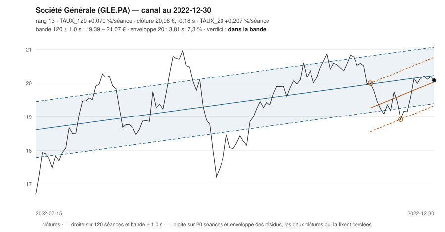

> Rang 13 · TAUX_120 +0,070 %/séance · clôture 20,08 € · bande 19,39 – 21,07 € · écart -0,18 s · TAUX_20 +0,207 %/séance · enveloppe 20 : 3,81 s, 7,3 % · **dans la bande**

- Clôture 20,08 €, à −0,18 s, dans la bande [19,39 ; 21,07] €.
- TAUX_120 +0,070 %/séance, rang 13 (12 à 15 sur la fenêtre) ; TAUX_20 +0,207 %/séance, positive depuis le 28 décembre. Signes concordants.
- Enveloppe de 3,81 s (7,3 % de E_20), en ligne avec les ~3,7 s attendues. Résidu haut le 2 décembre (1re séance), résidu bas le 15 (10e).
- Sous le bord bas de son canal du jour du 7 au 12 puis du 14 au 19 décembre (−1,63 s le 15), hors TOP 10 et avec une pente courte négative. Dans la bande depuis le 20 (8 séances).
- Verdict selon la règle, sans décision ce jour : dans la bande.

### 14. `MC.PA` — LVMH

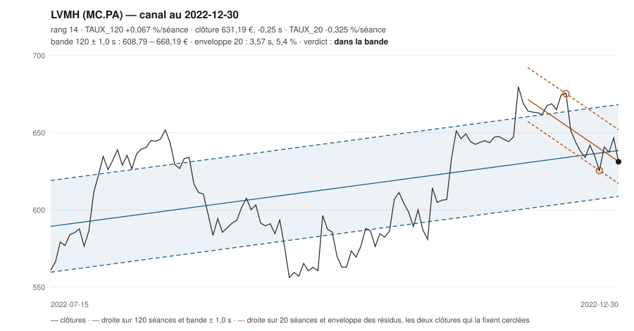

> Rang 14 · TAUX_120 +0,067 %/séance · clôture 631,19 € · bande 608,79 – 668,19 € · écart -0,25 s · TAUX_20 -0,325 %/séance · enveloppe 20 : 3,57 s, 5,4 % · **dans la bande**

- Clôture 631,19 €, à −0,25 s, dans la bande [608,79 ; 668,19] €.
- TAUX_120 +0,067 %/séance, rang 14 ; TAUX_20 −0,325 %/séance, négative depuis le 20 décembre. Divergence.
- Enveloppe : 3,57 s (5,4 % de E_20), un peu sous les ~3,7 s attendues. Résidu haut le 14 décembre (9e séance), résidu bas le 23 (16e).
- Cinq séances au-dessus du bord haut de leur canal du jour jusqu'au 14 décembre, puis dans la bande depuis le 15 (11 séances), avec −0,43 s au plus bas le 23.
- Verdict selon la règle (dernière séance, aucune décision) : dans la bande.

### 15. `DG.PA` — Vinci

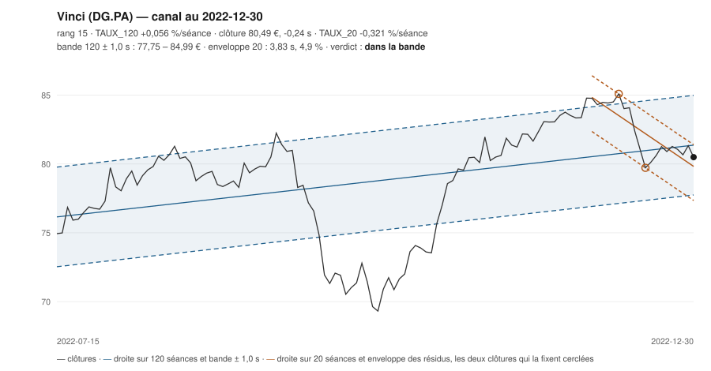

> Rang 15 · TAUX_120 +0,056 %/séance · clôture 80,49 € · bande 77,75 – 84,99 € · écart -0,24 s · TAUX_20 -0,321 %/séance · enveloppe 20 : 3,83 s, 4,9 % · **dans la bande**

- Clôture 80,49 €, à −0,24 s, dans la bande [77,75 ; 84,99] €.
- TAUX_120 +0,056 %/séance, rang 15 ; TAUX_20 −0,321 %/séance, négative depuis le 16 décembre. Divergence.
- Enveloppe de 3,83 s (4,9 % de E_20), proche des ~3,7 s attendues. Résidu haut le 9 décembre (6e séance), résidu bas le 16 décembre (11e).
- Au-dessus du bord haut jusqu'au 9 décembre, sauf le 8, dans la bande depuis le 12 (14 séances). Depuis le 15, l'écart se tient entre −0,46 et −0,02 s.
- Verdict selon la règle (dernière séance, aucune décision) : dans la bande.

### 16. `AI.PA` — Air Liquide

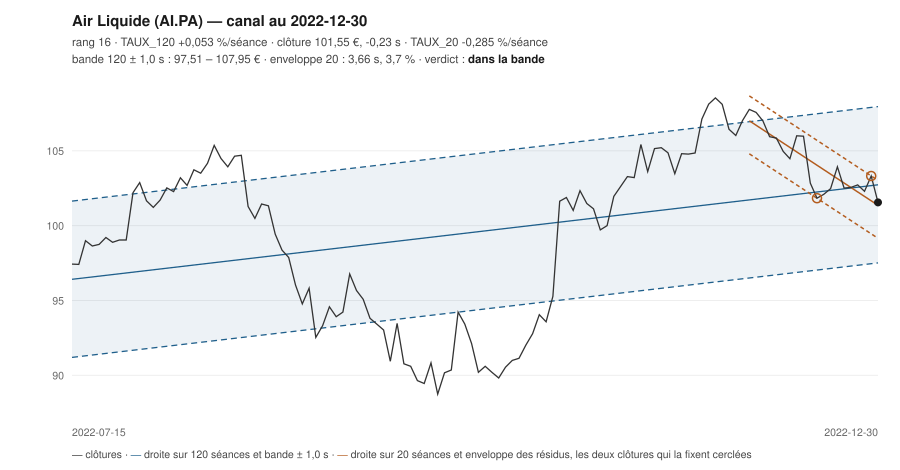

> Rang 16 · TAUX_120 +0,053 %/séance · clôture 101,55 € · bande 97,51 – 107,95 € · écart -0,23 s · TAUX_20 -0,285 %/séance · enveloppe 20 : 3,66 s, 3,7 % · **dans la bande**

- Clôture 101,55 €, à −0,23 s, dans la bande [97,51 ; 107,95] €.
- TAUX_120 +0,053 %/séance, rang 16 ; TAUX_20 −0,285 %/séance, négative depuis le 15 décembre. Les pentes divergent.
- Enveloppe : 3,66 s (3,7 % de E_20), conforme aux ~3,7 s attendues. Deux bornes récentes : résidu bas le 16 décembre (11e séance), résidu haut le 29 décembre (19e).
- Au-dessus du bord haut jusqu'au 7 décembre, dans la bande depuis le 8 (16 séances). L'écart du jour est le plus bas de la fenêtre.
- Verdict selon la règle (dernière séance, aucune décision) : dans la bande.

### 17. `ACA.PA` — Crédit Agricole

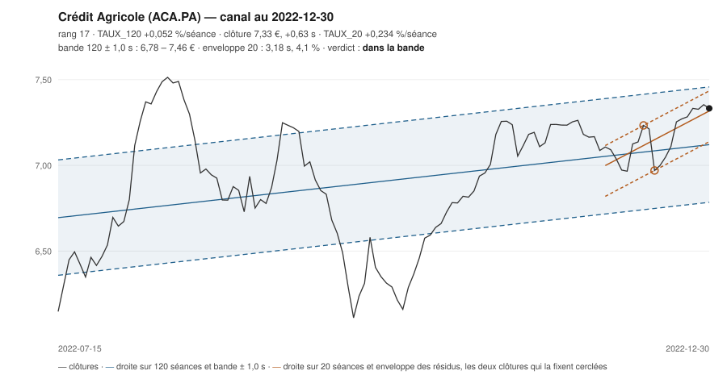

> Rang 17 · TAUX_120 +0,052 %/séance · clôture 7,33 € · bande 6,78 – 7,46 € · écart +0,63 s · TAUX_20 +0,234 %/séance · enveloppe 20 : 3,18 s, 4,1 % · **dans la bande**

- Clôture 7,33 €, à +0,63 s, dans la bande [6,78 ; 7,46] €.
- TAUX_120 +0,052 %/séance, rang 17 ; TAUX_20 +0,234 %/séance, redevenue positive le 23 décembre. Les deux pentes concordent.
- Enveloppe de 3,18 s (4,1 % de E_20), sous les ~3,7 s attendues. Ses bornes sont au milieu de la fenêtre : résidu haut le 13 décembre (8e séance), résidu bas le 15 (10e).
- Dans la bande depuis le 21 novembre, soit 29 séances ; sur la fenêtre, écart entre −0,33 et +0,69 s.
- Verdict selon la règle, sans décision à cette dernière séance : dans la bande.

### 18. `SGO.PA` — Saint-Gobain

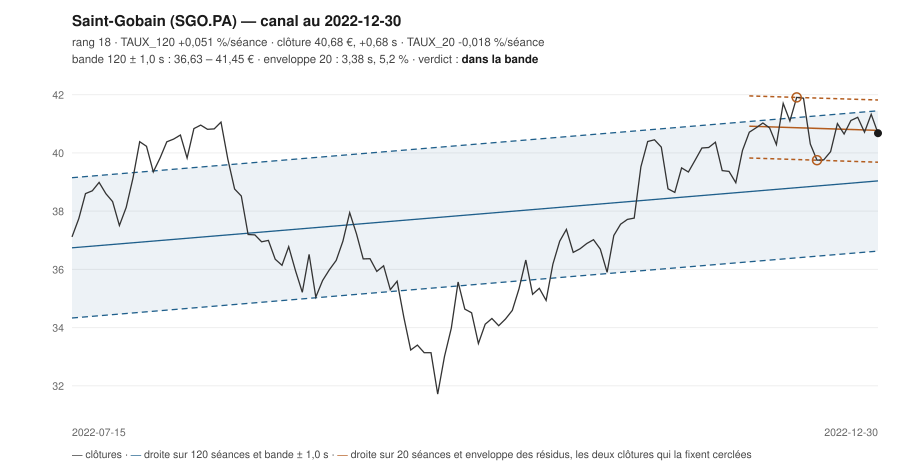

> Rang 18 · TAUX_120 +0,051 %/séance · clôture 40,68 € · bande 36,63 – 41,45 € · écart +0,68 s · TAUX_20 -0,018 %/séance · enveloppe 20 : 3,38 s, 5,2 % · **dans la bande**

- Clôture 40,68 €, à +0,68 s, dans la bande [36,63 ; 41,45] €.
- TAUX_120 +0,051 %/séance, positive depuis le 7 décembre, rang 18 ; TAUX_20 −0,018 %/séance, négative ce jour seulement. Signes opposés.
- Enveloppe de 3,38 s (5,2 % de E_20), sous les ~3,7 s attendues. Résidu haut le 13 décembre (8e séance), résidu bas le 16 (11e).
- Au-dessus du bord haut du 2 au 14 décembre, puis les 21, 23 et 27. Dans la bande depuis le 28 (3 séances).
- Verdict selon la règle, la séance ne portant pas de décision : dans la bande.

### 19. `ALO.PA` — Alstom

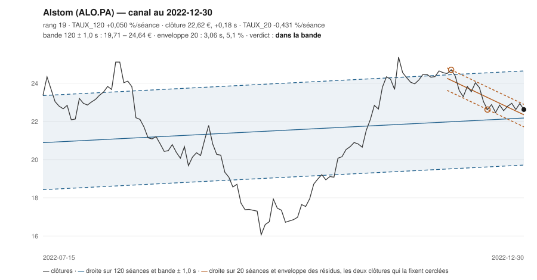

> Rang 19 · TAUX_120 +0,050 %/séance · clôture 22,62 € · bande 19,71 – 24,64 € · écart +0,18 s · TAUX_20 -0,431 %/séance · enveloppe 20 : 3,06 s, 5,1 % · **dans la bande**

- Clôture 22,62 €, à +0,18 s, dans la bande [19,71 ; 24,64] €.
- TAUX_120 +0,050 %/séance, positive depuis le 14 décembre, rang 19 ; TAUX_20 −0,431 %/séance, négative depuis le 8. Les deux pentes s'opposent.
- Enveloppe de 3,06 s (5,1 % de E_20), sous les ~3,7 s attendues. Résidu haut le 5 décembre (2e séance), résidu bas le 16 décembre (11e).
- Plusieurs allers-retours au-dessus du bord haut jusqu'au 13 décembre, puis dans la bande depuis le 14 (12 séances). L'écart a glissé de +1,59 s (5 décembre) à +0,18 s, son plus bas de la fenêtre.
- Verdict selon la règle (dernière séance, sans décision) : dans la bande.

### 20. `VIE.PA` — Veolia

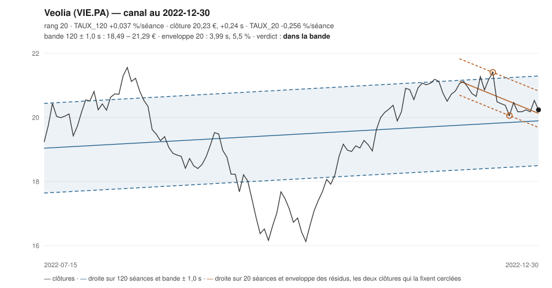

> Rang 20 · TAUX_120 +0,037 %/séance · clôture 20,23 € · bande 18,49 – 21,29 € · écart +0,24 s · TAUX_20 -0,256 %/séance · enveloppe 20 : 3,99 s, 5,5 % · **dans la bande**

- Clôture 20,23 €, à +0,24 s, dans la bande [18,49 ; 21,29] €.
- TAUX_120 +0,037 %/séance, positive depuis le 7 décembre, rang 20 ; TAUX_20 −0,256 %/séance, négative depuis le 15. Les pentes divergent.
- Enveloppe de 3,99 s (5,5 % de E_20), au-dessus des ~3,7 s attendues. Résidu haut le 14 décembre (9e séance), résidu bas le 20 (13e).
- Au-dessus du bord haut jusqu'au 14 décembre, sauf le 8, dans la bande depuis le 15 (11 séances), écart entre +0,24 et +0,61 s depuis.
- Verdict selon la règle, la séance ne portant pas de décision : dans la bande.

### 21. `STLAP.PA` — Stellantis

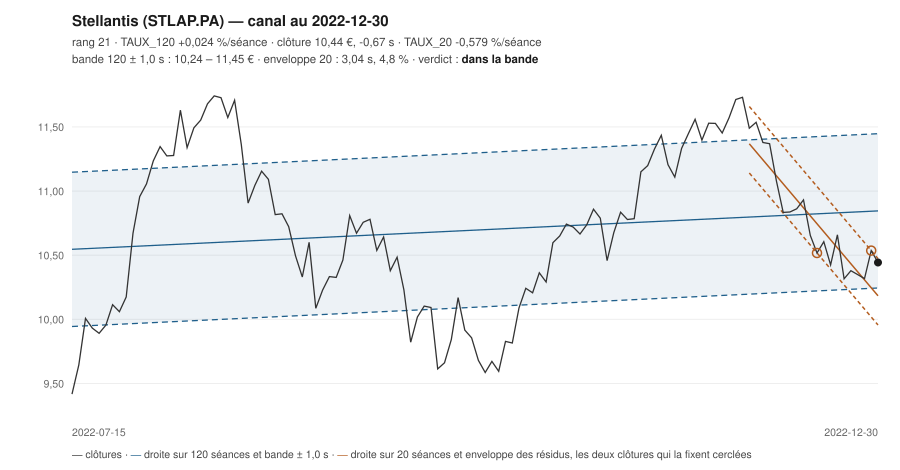

> Rang 21 · TAUX_120 +0,024 %/séance · clôture 10,44 € · bande 10,24 – 11,45 € · écart -0,67 s · TAUX_20 -0,579 %/séance · enveloppe 20 : 3,04 s, 4,8 % · **dans la bande**

- Clôture 10,44 €, à −0,67 s, dans la bande [10,24 ; 11,45] €.
- TAUX_120 +0,024 %/séance, rang 21 (13e le 2 décembre) ; TAUX_20 −0,579 %/séance, négative depuis le 9. Les pentes divergent.
- Enveloppe de 3,04 s (4,8 % de E_20), sous les ~3,7 s attendues. Résidu bas le 16 décembre (11e séance), résidu haut le 29 (19e).
- Une seule séance sous le bord bas sur la fenêtre, le 22 décembre (−1,07 s), au rang 19 ; dans la bande depuis le 23 (5 séances).
- Verdict selon la règle, sans décision possible ce jour : dans la bande.

### 22. `LR.PA` — Legrand

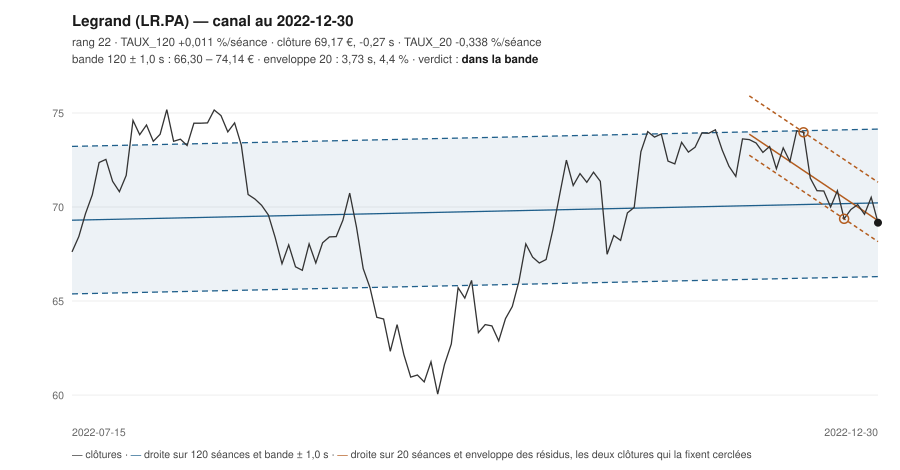

> Rang 22 · TAUX_120 +0,011 %/séance · clôture 69,17 € · bande 66,30 – 74,14 € · écart -0,27 s · TAUX_20 -0,338 %/séance · enveloppe 20 : 3,73 s, 4,4 % · **dans la bande**

- Clôture 69,17 €, à −0,27 s, dans la bande [66,30 ; 74,14] €.
- TAUX_120 +0,011 %/séance, rang 22 ; TAUX_20 −0,338 %/séance. Les deux pentes divergent.
- Enveloppe de 3,73 s (4,4 % de E_20), égale aux ~3,7 s attendues. Résidu haut le 14 décembre (9e séance), résidu bas le 22 (15e).
- Dans la bande depuis le 28 novembre (24 séances). L'écart a décru de +0,90 s le 2 décembre à −0,27 s ce jour, le plus bas de la fenêtre.
- Verdict selon la règle, sans décision possible ce jour : dans la bande.

### 23. `WLN.PA` — Worldline

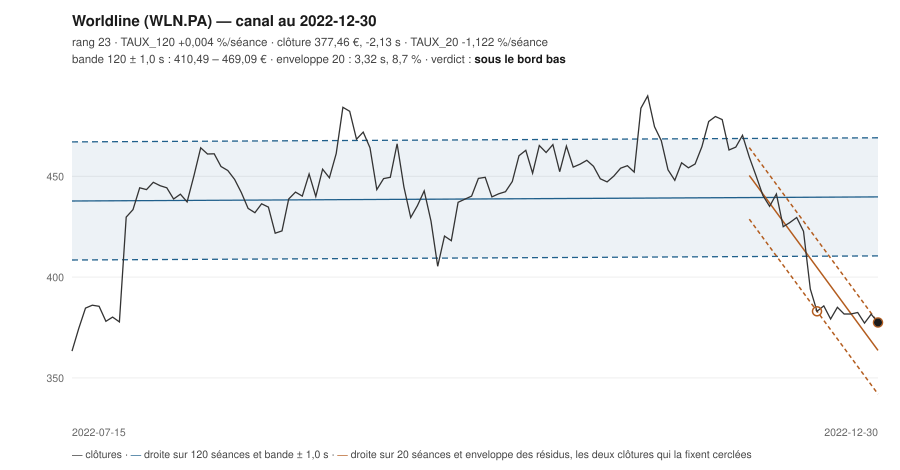

> Rang 23 · TAUX_120 +0,004 %/séance · clôture 377,46 € · bande 410,49 – 469,09 € · écart -2,13 s · TAUX_20 -1,122 %/séance · enveloppe 20 : 3,32 s, 8,7 % · **sous le bord bas**

- Clôture 377,46 €, à −2,13 s, sous le bord bas de la bande [410,49 ; 469,09] €.
- TAUX_120 +0,004 %/séance, rang 23, après un rang 6 le 2 décembre ; TAUX_20 −1,122 %/séance, négative depuis le 5. Les deux pentes divergent.
- Enveloppe de 3,32 s (8,7 % de E_20), sous les ~3,7 s attendues. La clôture du jour fixe la borne haute (20e séance) alors qu'elle est inférieure à celle du 16 décembre (383,04 €), qui fixe la borne basse (11e) : la droite courte descend plus vite que le cours.
- Sous le bord bas de son canal du jour depuis le 5 décembre, soit 19 séances, avec −3,13 s le 16. Son rang a glissé de 6 à 23 pendant ce passage, la pente courte étant négative dès le premier jour.
- Verdict selon la règle, sans décision à cette dernière séance : sous le bord bas sans être candidate, hors TOP 10 (rang 23) et pente courte ≤ 0.

### 24. `ML.PA` — Michelin

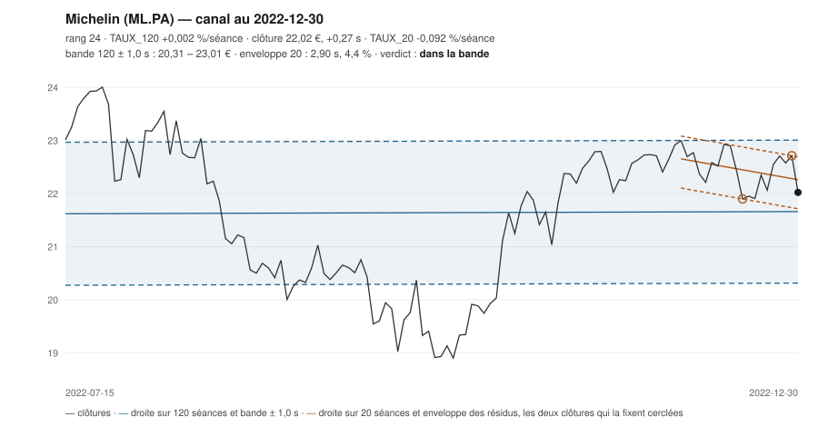

> Rang 24 · TAUX_120 +0,002 %/séance · clôture 22,02 € · bande 20,31 – 23,01 € · écart +0,27 s · TAUX_20 -0,092 %/séance · enveloppe 20 : 2,90 s, 4,4 % · **dans la bande**

- Clôture 22,02 €, à +0,27 s, dans la bande [20,31 ; 23,01] €.
- TAUX_120 +0,002 %/séance, positive ce jour seulement, 24e et dernière des pentes positives ; TAUX_20 −0,092 %/séance. Les signes s'opposent.
- Enveloppe de 2,90 s (4,4 % de E_20), bien sous les ~3,7 s attendues. Résidu bas le 16 décembre (11e séance), résidu haut le 29 (19e).
- Allers-retours au-dessus du bord haut jusqu'au 14 décembre, dans la bande depuis le 15 (11 séances). L'écart du jour est le plus bas de la fenêtre.
- Verdict selon la règle, sans décision à cette dernière séance : dans la bande.

### `HO.PA` — Thales

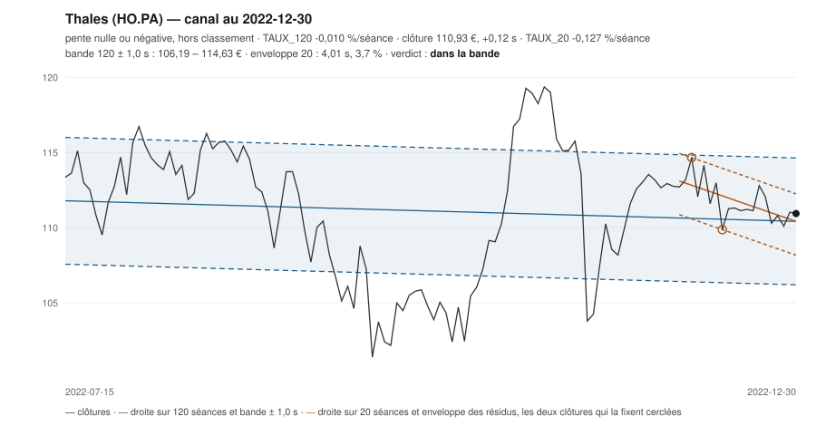

> Hors classement · TAUX_120 -0,010 %/séance · clôture 110,93 € · bande 106,19 – 114,63 € · écart +0,12 s · TAUX_20 -0,127 %/séance · enveloppe 20 : 4,01 s, 3,7 % · **dans la bande**

- Clôture 110,93 €, à +0,12 s, dans la bande [106,19 ; 114,63] €.
- Pente longue négative depuis le 9 décembre (TAUX_120 −0,010 %/séance, hors classement), pente courte négative depuis le 16 (TAUX_20 −0,127 %/séance) : concordance à la baisse.
- Enveloppe : 4,01 s (3,7 % de E_20), au-dessus des ~3,7 s attendues. Résidu haut le 6 décembre (3e séance), résidu bas le 13 (8e).
- Dans la bande depuis le 15 novembre, soit 33 séances ; écart entre −0,19 et +0,84 s sur la fenêtre.
- Verdict selon la règle, la séance ne portant pas de décision : dans la bande.

### `STMPA.PA` — STMicroelectronics

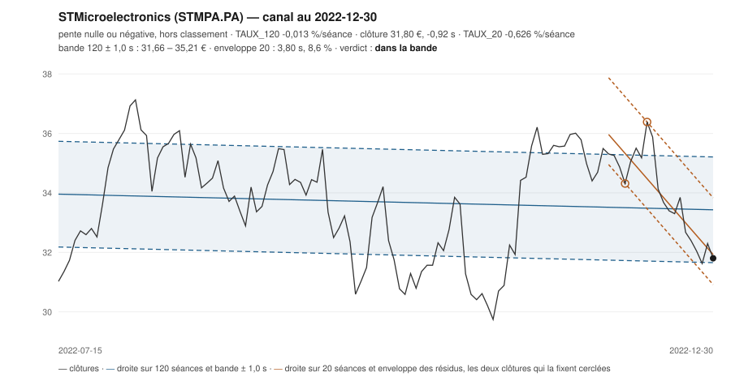

> Hors classement · TAUX_120 -0,013 %/séance · clôture 31,80 € · bande 31,66 – 35,21 € · écart -0,92 s · TAUX_20 -0,626 %/séance · enveloppe 20 : 3,80 s, 8,6 % · **dans la bande**

- Clôture 31,80 €, à −0,92 s, dans la bande [31,66 ; 35,21] €, à 14 centimes du bord bas.
- Pente longue négative depuis le 29 décembre (TAUX_120 −0,013 %/séance, hors classement), pente courte négative depuis le 7 (TAUX_20 −0,626 %/séance) : concordance à la baisse.
- Enveloppe : 3,80 s (8,6 % de E_20), proche des ~3,7 s attendues. Résidu bas le 7 décembre (4e séance), résidu haut le 13 (8e) : deux bornes anciennes.
- L'écart a reculé de +0,86 s le 13 décembre à −1,11 s le 28, seule séance sous le bord bas, au rang 24. Dans la bande depuis le 29.
- Verdict selon la règle (dernière séance, sans décision) : dans la bande.

### `RI.PA` — Pernod Ricard

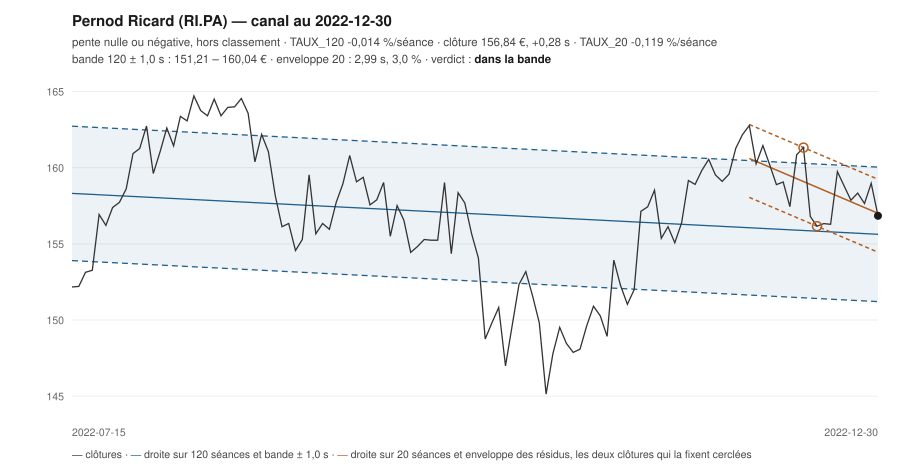

> Hors classement · TAUX_120 -0,014 %/séance · clôture 156,84 € · bande 151,21 – 160,04 € · écart +0,28 s · TAUX_20 -0,119 %/séance · enveloppe 20 : 2,99 s, 3,0 % · **dans la bande**

- Clôture 156,84 €, à +0,28 s, dans la bande [151,21 ; 160,04] €.
- Pente longue négative depuis le 16 décembre (TAUX_120 −0,014 %/séance, hors classement), pente courte négative depuis la même date (TAUX_20 −0,119 %/séance) : concordance à la baisse.
- Enveloppe : 2,99 s (3,0 % de E_20), nettement sous les ~3,7 s attendues. Ses bornes sont à deux séances d'écart : résidu haut le 14 décembre (9e), résidu bas le 16 (11e).
- Au-dessus du bord haut le 2 décembre, dans la bande depuis le 5 (19 séances), écart entre −0,03 et +0,93 s depuis.
- Verdict selon la règle, sans décision possible ce jour : dans la bande.

### `EN.PA` — Bouygues

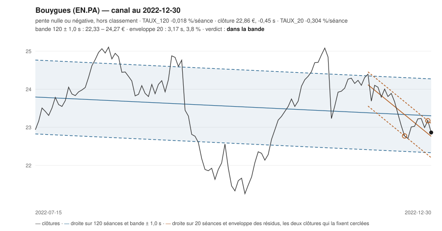

> Hors classement · TAUX_120 -0,018 %/séance · clôture 22,86 € · bande 22,33 – 24,27 € · écart -0,45 s · TAUX_20 -0,304 %/séance · enveloppe 20 : 3,17 s, 3,8 % · **dans la bande**

- Clôture 22,86 €, à −0,45 s, dans la bande [22,33 ; 24,27] €.
- Pente longue négative (TAUX_120 −0,018 %/séance, hors classement), pente courte négative (TAUX_20 −0,304 %/séance) : concordance à la baisse.
- Enveloppe : 3,17 s (3,8 % de E_20), sous les ~3,7 s attendues. Résidu bas le 19 décembre (12e séance), résidu haut le 29 décembre (19e).
- Dans la bande depuis le 5 décembre (19 séances), écart compris entre −0,79 s (20 décembre) et +0,69 s. Sur la fenêtre, la pente longue n'a été positive que du 14 au 16 décembre (rangs 25 et 26).
- Verdict selon la règle, sans décision possible ce jour : dans la bande.

### `SAN.PA` — Sanofi

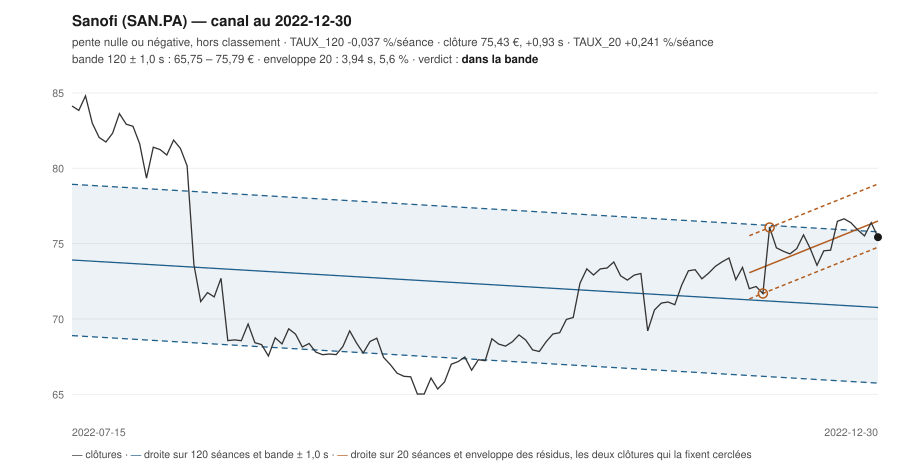

> Hors classement · TAUX_120 -0,037 %/séance · clôture 75,43 € · bande 65,75 – 75,79 € · écart +0,93 s · TAUX_20 +0,241 %/séance · enveloppe 20 : 3,94 s, 5,6 % · **dans la bande**

- Clôture 75,43 €, à +0,93 s, dans la bande [65,75 ; 75,79] €, à 36 centimes du bord haut.
- Pente longue négative (TAUX_120 −0,037 %/séance, hors classement), pente courte positive (+0,241 %/séance) : désaccord.
- Enveloppe de 3,94 s (5,6 % de E_20), un peu au-dessus des ~3,7 s attendues. Ses deux bornes sont deux séances consécutives du début de fenêtre : résidu bas le 6 décembre (3e), résidu haut le 7 (4e).
- Au-dessus du bord haut de son canal du jour aux 19 premières séances de la fenêtre (+1,87 s le 7 décembre), elle rentre dans la bande ce jour, avec l'écart le plus bas de la fenêtre.
- Verdict selon la règle (dernière séance, aucune décision) : dans la bande.

### `OR.PA` — L'Oréal

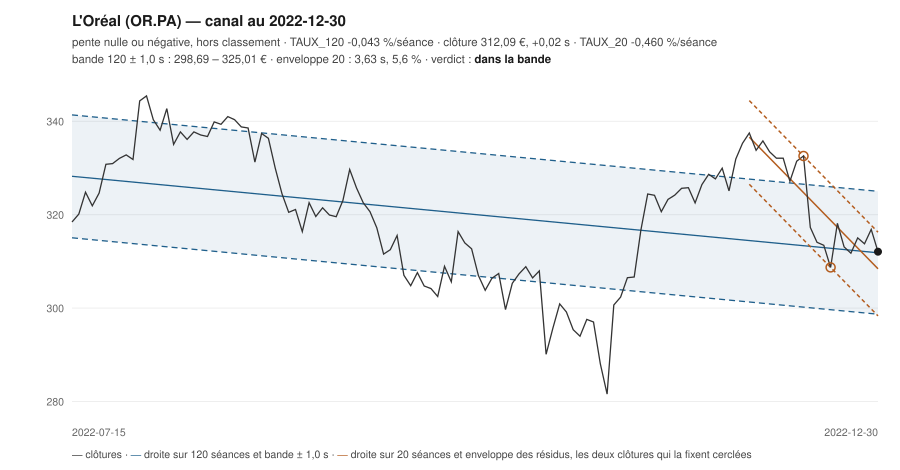

> Hors classement · TAUX_120 -0,043 %/séance · clôture 312,09 € · bande 298,69 – 325,01 € · écart +0,02 s · TAUX_20 -0,460 %/séance · enveloppe 20 : 3,63 s, 5,6 % · **dans la bande**

- Clôture 312,09 €, à +0,02 s, sur la droite ajustée ; bande [298,69 ; 325,01] €.
- TAUX_120 −0,043 %/séance (hors classement), TAUX_20 −0,460 %/séance, négative depuis le 16 décembre : concordance à la baisse.
- Enveloppe : 3,63 s (5,6 % de E_20), proche des ~3,7 s attendues. Résidu haut le 14 décembre (9e séance), résidu bas le 20 (13e).
- Au-dessus du bord haut jusqu'au 14 décembre, sauf le 12 ; l'écart est tombé de +1,25 s à +0,17 s le 15. Dans la bande depuis 11 séances.
- Verdict selon la règle, sans décision ce jour : dans la bande.

### `CA.PA` — Carrefour

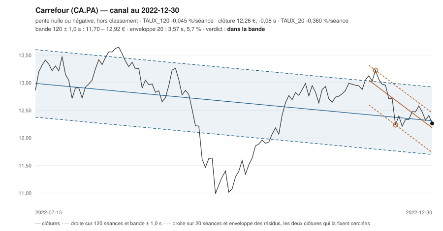

> Hors classement · TAUX_120 -0,045 %/séance · clôture 12,26 € · bande 11,70 – 12,92 € · écart -0,08 s · TAUX_20 -0,360 %/séance · enveloppe 20 : 3,57 s, 5,7 % · **dans la bande**

- Clôture 12,26 €, à −0,08 s, dans la bande [11,70 ; 12,92] €.
- Pente longue négative (TAUX_120 −0,045 %/séance, hors classement) ; pente courte négative depuis le 14 décembre (TAUX_20 −0,360 %/séance). Concordance à la baisse.
- Enveloppe de 3,57 s (5,7 % de E_20), légèrement sous les ~3,7 s attendues. Résidu haut le 6 décembre (3e séance), résidu bas le 14 (9e).
- Au-dessus du bord haut jusqu'au 9 décembre, série commencée le 24 octobre ; dans la bande depuis le 12 (14 séances). L'écart oscille autour de zéro depuis le 14.
- Verdict selon la règle, sans décision à cette dernière séance : dans la bande.

### `KER.PA` — Kering

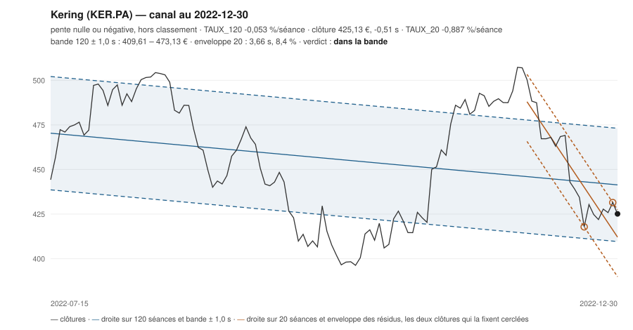

> Hors classement · TAUX_120 -0,053 %/séance · clôture 425,13 € · bande 409,61 – 473,13 € · écart -0,51 s · TAUX_20 -0,887 %/séance · enveloppe 20 : 3,66 s, 8,4 % · **dans la bande**

- Clôture 425,13 €, à −0,51 s, dans la bande [409,61 ; 473,13] €.
- TAUX_120 −0,053 %/séance (hors classement), TAUX_20 −0,887 %/séance : les deux pentes descendent, la courte nettement.
- Enveloppe de 3,66 s (8,4 % de E_20), conforme aux ~3,7 s attendues. Deux bornes récentes : résidu bas le 20 décembre (13e séance), résidu haut le 29 (19e).
- Au-dessus du bord haut jusqu'au 6 décembre, série commencée le 8 novembre ; dans la bande depuis le 7 (17 séances), avec −0,99 s au plus bas le 20.
- Verdict selon la règle (dernière séance, sans décision) : dans la bande.

### `ORA.PA` — Orange

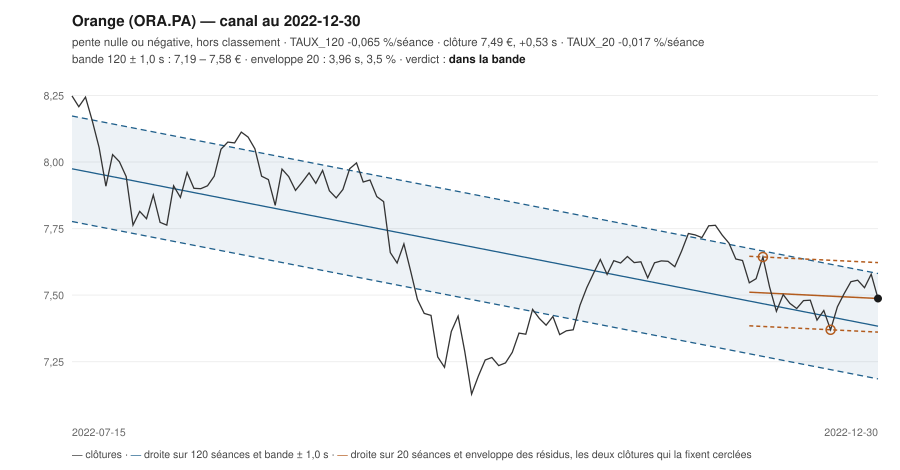

> Hors classement · TAUX_120 -0,065 %/séance · clôture 7,49 € · bande 7,19 – 7,58 € · écart +0,53 s · TAUX_20 -0,017 %/séance · enveloppe 20 : 3,96 s, 3,5 % · **dans la bande**

- Clôture 7,49 €, à +0,53 s, dans la bande [7,19 ; 7,58] €.
- TAUX_120 −0,065 %/séance (hors classement), TAUX_20 −0,017 %/séance, négative depuis le 7 décembre : les deux pentes sont négatives.
- Enveloppe de 3,96 s (3,5 % de E_20), au-dessus des ~3,7 s attendues. Résidu haut le 6 décembre (3e séance), résidu bas le 20 (13e).
- Au-dessus du bord haut de son canal du jour du 28 octobre au 6 décembre, dans la bande depuis le 7 (17 séances), écart entre +0,11 et +0,99 s depuis.
- Verdict selon la règle, la séance ne portant pas de décision : dans la bande.

### `CAP.PA` — Capgemini

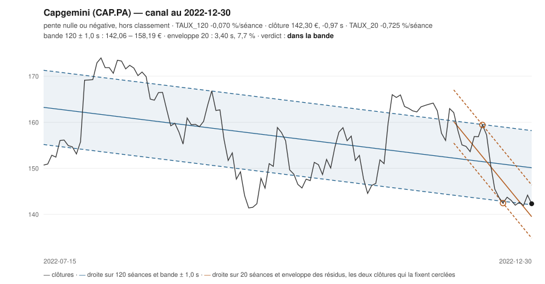

> Hors classement · TAUX_120 -0,070 %/séance · clôture 142,30 € · bande 142,06 – 158,19 € · écart -0,97 s · TAUX_20 -0,725 %/séance · enveloppe 20 : 3,40 s, 7,7 % · **dans la bande**

- Clôture 142,30 €, à −0,97 s : dans la bande [142,06 ; 158,19] €, à 24 centimes du bord bas.
- TAUX_120 −0,070 %/séance (hors classement), TAUX_20 −0,725 %/séance : les deux pentes descendent.
- Enveloppe de 3,40 s (7,7 % de E_20), sous les ~3,7 s attendues. Résidu haut le 13 décembre (8e séance), résidu bas le 20 décembre (13e).
- Sous le bord bas de son canal du jour pendant 8 séances, du 16 au 28 décembre (−1,42 s le 20). Dans la bande depuis le 29. Sa pente longue négative excluait de toute façon une candidature.
- Verdict selon la règle (dernière séance, sans décision) : dans la bande.

### `BN.PA` — Danone

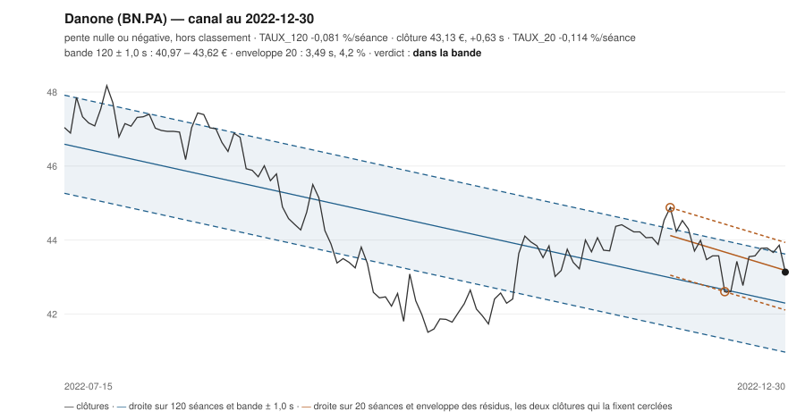

> Hors classement · TAUX_120 -0,081 %/séance · clôture 43,13 € · bande 40,97 – 43,62 € · écart +0,63 s · TAUX_20 -0,114 %/séance · enveloppe 20 : 3,49 s, 4,2 % · **dans la bande**

- Clôture 43,13 €, à +0,63 s, dans la bande [40,97 ; 43,62] €.
- Pente longue négative (TAUX_120 −0,081 %/séance, hors classement), pente courte négative depuis le 13 décembre (TAUX_20 −0,114 %/séance) : concordance à la baisse.
- Enveloppe : 3,49 s (4,2 % de E_20), un peu sous les ~3,7 s attendues. Résidu haut le 2 décembre (1re séance), résidu bas le 15 décembre (10e).
- Au-dessus du bord haut de son canal du jour du 21 au 29 décembre, elle rentre ce jour dans la bande (+0,63 s contre +1,18 s la veille).
- Verdict selon la règle, sans décision possible ce jour : dans la bande.

### `VIV.PA` — Vivendi

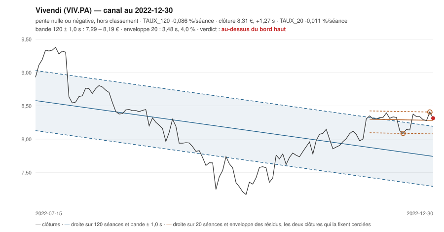

> Hors classement · TAUX_120 -0,086 %/séance · clôture 8,31 € · bande 7,29 – 8,19 € · écart +1,27 s · TAUX_20 -0,011 %/séance · enveloppe 20 : 3,48 s, 4,0 % · **au-dessus du bord haut**

- Clôture 8,31 €, à +1,27 s, au-dessus de la bande [7,29 ; 8,19] €.
- TAUX_120 −0,086 %/séance (hors classement), TAUX_20 −0,011 %/séance, négative depuis le 29 décembre : les deux pentes sont négatives.
- Enveloppe de 3,48 s (4,0 % de E_20), un peu sous les ~3,7 s attendues. Deux bornes de la seconde moitié : résidu bas le 16 décembre (11e séance), résidu haut le 29 (19e).
- Au-dessus du bord haut de son canal du jour depuis le 25 octobre, soit 48 séances consécutives. Sur la fenêtre, l'écart n'est pas descendu sous +1,12 s.
- Verdict selon la règle (dernière séance, sans décision) : au-dessus du bord haut.

### `ERF.PA` — Eurofins Scientific

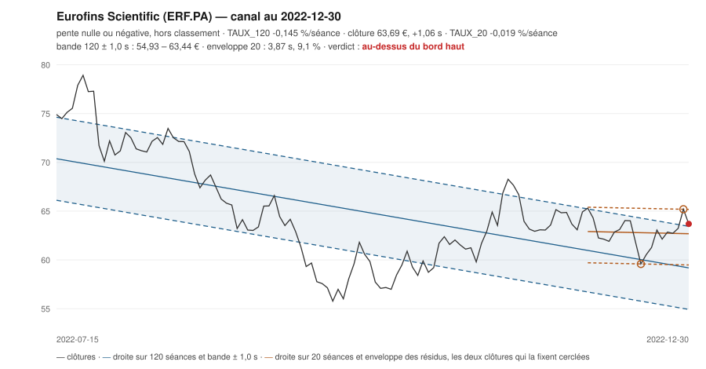

> Hors classement · TAUX_120 -0,145 %/séance · clôture 63,69 € · bande 54,93 – 63,44 € · écart +1,06 s · TAUX_20 -0,019 %/séance · enveloppe 20 : 3,87 s, 9,1 % · **au-dessus du bord haut**

- Clôture 63,69 €, à +1,06 s, au-dessus de la bande [54,93 ; 63,44] €.
- TAUX_120 −0,145 %/séance (hors classement), TAUX_20 −0,019 %/séance, négative aux 20 séances : les deux pentes concordent à la baisse.
- Enveloppe de 3,87 s (9,1 % de E_20), un peu au-dessus des ~3,7 s attendues. Résidu bas le 16 décembre (11e séance), résidu haut le 29 décembre (19e).
- Six bascules autour du bord haut sur la fenêtre, écart entre +0,18 et +1,52 s. Au-dessus depuis le 28 décembre (3 séances), avec +1,44 s le 29.
- Verdict selon la règle (dernière séance, aucune décision) : au-dessus du bord haut.

### `DSY.PA` — Dassault Systèmes

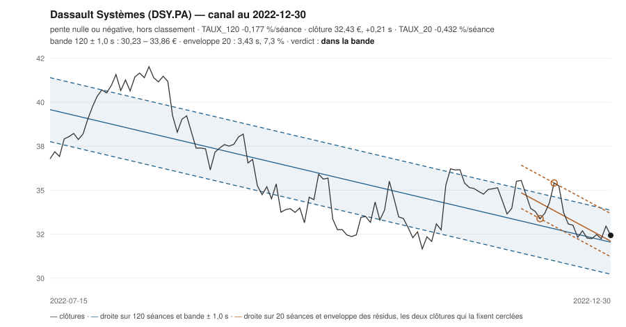

> Hors classement · TAUX_120 -0,177 %/séance · clôture 32,43 € · bande 30,23 – 33,86 € · écart +0,21 s · TAUX_20 -0,432 %/séance · enveloppe 20 : 3,43 s, 7,3 % · **dans la bande**

- Clôture 32,43 €, à +0,21 s, dans la bande [30,23 ; 33,86] €.
- TAUX_120 −0,177 %/séance (hors classement), TAUX_20 −0,432 %/séance, négative depuis le 6 décembre : concordance à la baisse.
- Enveloppe de 3,43 s (7,3 % de E_20), sous les ~3,7 s attendues. Résidu bas le 8 décembre (5e séance), résidu haut le 13 (8e).
- Dans la bande depuis le 8 novembre, soit 38 séances ; sur la fenêtre, écart entre −0,26 et +0,89 s.
- Verdict selon la règle, la séance ne portant pas de décision : dans la bande.

### `TEP.PA` — Teleperformance

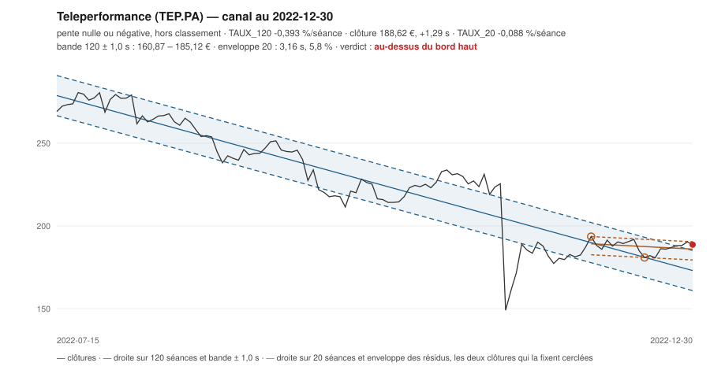

> Hors classement · TAUX_120 -0,393 %/séance · clôture 188,62 € · bande 160,87 – 185,12 € · écart +1,29 s · TAUX_20 -0,088 %/séance · enveloppe 20 : 3,16 s, 5,8 % · **au-dessus du bord haut**

- Clôture 188,62 €, à +1,29 s, au-dessus de la bande [160,87 ; 185,12] €.
- TAUX_120 −0,393 %/séance, la pente longue la plus négative de l'univers ce jour ; TAUX_20 −0,088 %/séance, négative depuis le 23 décembre. Les deux pentes concordent à la baisse.
- Enveloppe de 3,16 s (5,8 % de E_20), sous les ~3,7 s attendues. La fenêtre commence le 2 décembre et ne contient plus la rupture du 10 novembre. Résidu haut le 2 décembre (1re séance), résidu bas le 16 (11e).
- L'écart est monté de −0,33 s le 6 décembre à +1,38 s le 29. Au-dessus du bord haut de la bande descendante de son canal du jour depuis le 27 (4 séances).
- Verdict selon la règle (dernière séance, aucune décision) : au-dessus du bord haut.

### Les figures des ordres du mois

*Aucun ordre ce mois-ci.*

## 5. Le TOP 10 au 2022-12-30

| Rang | Valeur | TAUX_120 | Écart | TAUX_20 | Verdict |
|---|---|---|---|---|---|
| 1 | `PUB.PA` Publicis | +0,250 %/séance | -1,34 s | -0,263 %/séance | sous le bord bas |
| 2 | `TTE.PA` TotalEnergies | +0,200 %/séance | +0,11 s | +0,219 %/séance | dans la bande |
| 3 | `RNO.PA` Renault | +0,181 %/séance | -1,80 s | -0,679 %/séance | sous le bord bas |
| 4 | `CS.PA` AXA | +0,177 %/séance | -1,30 s | -0,255 %/séance | sous le bord bas |
| 5 | `RMS.PA` Hermès International | +0,164 %/séance | -0,51 s | -0,287 %/séance | dans la bande |
| 6 | `ENGI.PA` Engie | +0,160 %/séance | -1,28 s | -0,474 %/séance | sous le bord bas |
| 7 | `BNP.PA` BNP Paribas | +0,144 %/séance | +0,22 s | +0,156 %/séance | dans la bande |
| 8 | `EL.PA` EssilorLuxottica | +0,137 %/séance | -0,50 s | -0,364 %/séance | dans la bande |
| 9 | `SAF.PA` Safran | +0,120 %/séance | +0,22 s | +0,073 %/séance | dans la bande |
| 10 | `AIR.PA` Airbus | +0,097 %/séance | +0,09 s | +0,073 %/séance | dans la bande |

**Entrées et sorties du TOP 10 au fil du mois**

| Séance | Entrées | Sorties |
|---|---|---|
| 2022-12-09 | `BNP.PA` | `SU.PA` |
| 2022-12-12 | `SU.PA` | `SAF.PA` |
| 2022-12-15 | `SAF.PA` | `SU.PA` |
| 2022-12-19 | `SU.PA` | `WLN.PA` |
| 2022-12-27 | `AIR.PA` | `SU.PA` |

## 6. Les ordres exécutés

> À l'**ouverture** de la séance qui suit la décision, jamais à la clôture qui l'a déclenchée. L'écart d'ouverture est subi, et publié.

*Aucun ordre : aucune valeur n'a franchi un bord de sa bande.*

## 7. Les signaux non exécutés

*Aucun : chaque candidat du mois a été acheté.*

## 8. La lecture du mois

Sur le mois, la meilleure contribution vient de `RNO.PA` (Renault) pour **-266,33 €**, la moins bonne de `RNO.PA` (Renault) pour **-266,33 €**. Aucun ordre, donc aucun frais. Le portefeuille termine le mois **devant TR39** de 1,46 point.

---

L'expérience s'arrête ici. Le compte de l'année, les issues et le dimensionnement confronté sont dans le **[bilan](../bilan-2022.md)**.

---

[← Novembre](2022-11.md) · [Protocole](../README.md)
