# Juin 2022

> Journal de l'[expérience 5](../README.md) · exécutions du 2022-06-01 au 2022-06-30 · **1 ordre**
> Portefeuille au 2022-06-30 : **9 647,49 €** (base 96,47) · TR39 83,80 · alpha du mois **+6,85 pt** · depuis janvier **+12,67 pt**

---

## 1. Les actualités du mois précédent

**Mai 2022.** Un mois heurté, sans direction nette. Les indices européens
terminent proches de l'équilibre après avoir touché de nouveaux plus bas
annuels à la mi-mois. La BCE prépare ouvertement la fin des taux négatifs, et
Christine Lagarde évoque une sortie du territoire négatif d'ici la fin du
troisième trimestre.

Le pétrole poursuit sa hausse — l'Union européenne s'accorde sur un embargo
partiel sur le brut russe —, tandis que les valeurs de distribution souffrent
d'avertissements sur les marges aux États-Unis. Le gaz européen reste sur des
niveaux extrêmes, la Russie interrompant ses livraisons à plusieurs pays.

## 2. L'exposition héritée au 2022-05-31

| Valeur | Achetée le | Prix d'achat | Cours | +/− value | Alpha depuis l'achat |
|---|---|---|---|---|---|
| `DG.PA` Vinci | 2022-04-06 | 73,34 € | 76,57 € | **+4,39 %** | +1,90 pt |
| `CA.PA` Carrefour | 2022-05-19 | 15,17 € | 14,52 € | **-4,23 %** | -7,27 pt |

## 3. Le portefeuille depuis le 2022-01-03

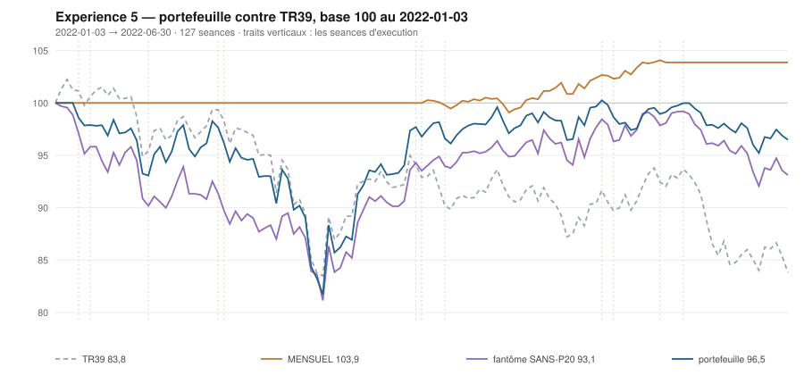

| | |
|---|---|
| Dotation initiale | 10 000,00 € au 2022-01-03 |
| Titres au 2022-06-30 | 5 706,76 € |
| Espèces | 3 940,73 € |
| Lignes détenues | 3 |
| **Total** | **9 647,49 €** |
| Base 100 | **96,47** |
| Fantôme `SANS-P20`, même base | 93,10 |
| Portefeuille fictif `MENSUEL`, même base | 103,87 |
| TR39, même base | 83,80 |
| Écart depuis janvier | **+12,67 pt** |

### Toutes les positions depuis le début de l'expérience

> Closes comme ouvertes. Aucune séance postérieure au 2022-06-30 n'entre dans ce tableau.

| Société | Prix d'achat | Date d'achat | Prix de vente | Date de vente |
|---|---|---|---|---|
| `CAP.PA` Capgemini | 182,86 € | 2022-01-07 | 181,51 € | 2022-03-30 |
| `EL.PA` EssilorLuxottica | 162,03 € | 2022-01-07 | 153,11 € | 2022-03-30 |
| `RI.PA` Pernod Ricard | 173,52 € | 2022-01-07 | 164,76 € | 2022-03-31 |
| `STMPA.PA` STMicroelectronics | 41,80 € | 2022-01-11 | 39,65 € | 2022-03-30 |
| `BNP.PA` BNP Paribas | 43,84 € | 2022-01-25 | 48,20 € | 2022-02-10 |
| `MC.PA` LVMH | 633,54 € | 2022-02-11 | 558,12 € | 2022-05-31 |
| `SAN.PA` Sanofi | 74,66 € | 2022-03-30 | 77,80 € | 2022-04-06 |
| `TTE.PA` TotalEnergies | 36,38 € | 2022-03-30 | 40,80 € | 2022-05-17 |
| `DG.PA` Vinci | 73,34 € | 2022-04-06 |  |  |
| `CA.PA` Carrefour | 15,17 € | 2022-05-19 |  |  |
| `HO.PA` Thales | 105,72 € | 2022-06-06 |  |  |

*11 positions depuis le début, dont 3 encore ouvertes : les deux dernières colonnes restent vides.*

## 4. L'étude chartiste au 2022-06-30

> Une entrée par société de l'univers, sous la figure de canal lue à la clôture du 2022-06-30. La ligne en retrait est **calculée** ; la note qui suit est celle de l'agent `chartiste`, rédigée sans aucune séance postérieure.

### 1. `HO.PA` — Thales

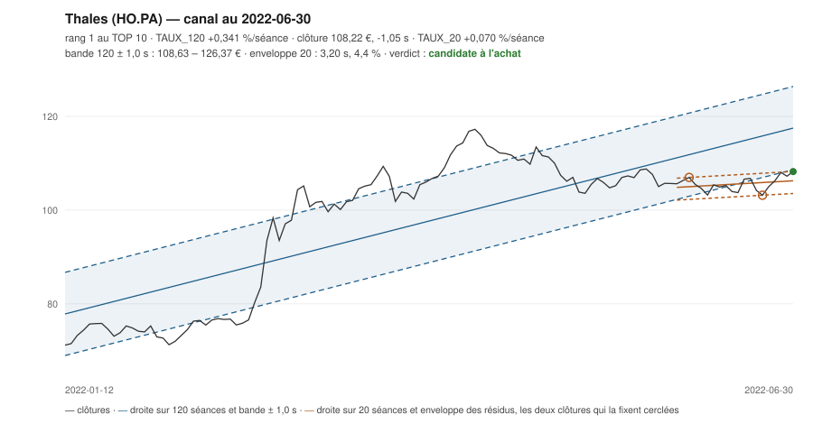

> Rang 1 · TAUX_120 +0,341 %/séance · clôture 108,22 € · bande 108,63 – 126,37 € · écart -1,05 s · TAUX_20 +0,070 %/séance · enveloppe 20 : 3,20 s, 4,4 % · **candidate à l'achat**

- Clôture 108,22 €, −1,05 s, à 0,41 € sous le bord bas d'une bande de 108,63 à 126,37 €.
- Pentes concordantes à la hausse : TAUX_120 +0,341 %/séance, rang 1, comme vingt séances plus tôt ; TAUX_20 +0,070 %/séance, redevenu positif depuis 2 séances.
- Enveloppe de 3,20 s (4,4 % de E_20). Haut le 7 juin (106,97 €), bas le 23 juin (103,18 €).
- Sous le bord bas de son canal du jour depuis 39 séances, jusqu'à −2,01 s le 10 juin. Déjà candidate du 3 au 9 juin, puis de nouveau les 29 et 30 juin. L'écart du jour est le plus haut des 20 séances.
- Verdict : candidate à l'achat.

### 2. `SAN.PA` — Sanofi

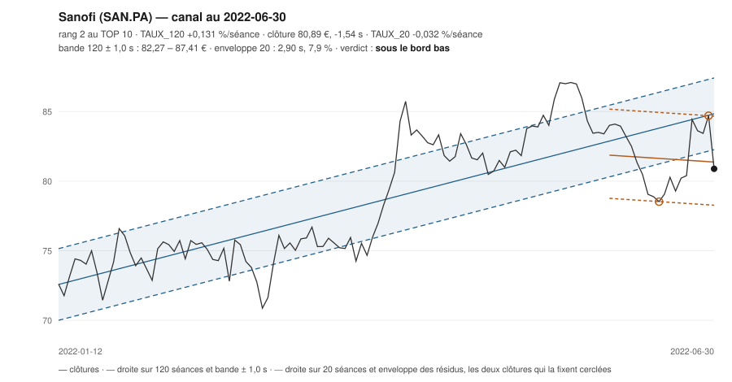

> Rang 2 · TAUX_120 +0,131 %/séance · clôture 80,89 € · bande 82,27 – 87,41 € · écart -1,54 s · TAUX_20 -0,032 %/séance · enveloppe 20 : 2,90 s, 7,9 % · **sous le bord bas**

- Clôture 80,89 €, −1,54 s, sous une bande de 82,27 à 87,41 €.
- Pentes discordantes. TAUX_120 est à +0,131 %/séance, rang 2, alors que la valeur était au rang 4 vingt séances plus tôt. TAUX_20 est à −0,032 %/séance, négatif depuis 17 séances.
- Enveloppe de 2,90 s. Bas le 16 juin (78,53 €), haut la veille, le 29 juin (84,70 €).
- Douze clôtures sous le bord bas en 20 séances, jusqu'à −2,69 s le 14 juin, sans aucune séance candidate. L'écart était remonté à −0,07 s hier, avant de replonger aujourd'hui.
- Verdict : sous le bord bas, sans être candidate. La valeur est au TOP 10, mais la pente courte est négative.

### 3. `ORA.PA` — Orange

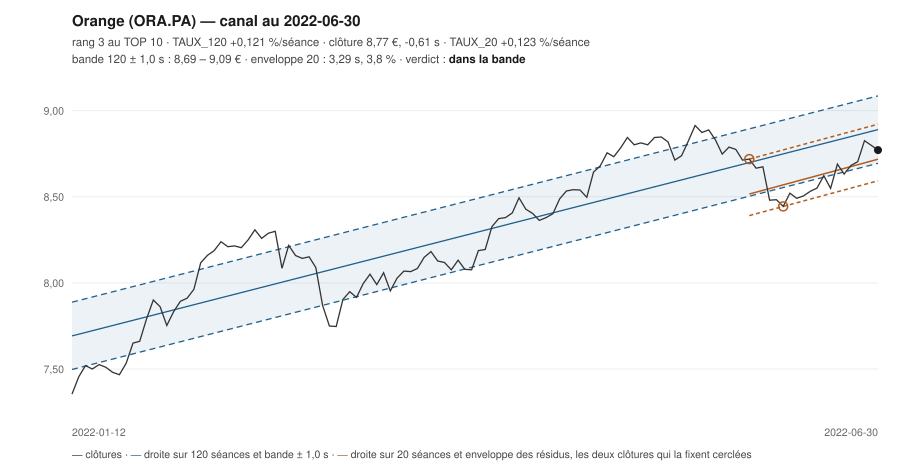

> Rang 3 · TAUX_120 +0,121 %/séance · clôture 8,77 € · bande 8,69 – 9,09 € · écart -0,61 s · TAUX_20 +0,123 %/séance · enveloppe 20 : 3,29 s, 3,8 % · **dans la bande**

- Clôture 8,77 € à −0,61 s, bande étroite de 8,69 à 9,09 €.
- Pentes concordantes à la hausse : TAUX_120 +0,121 %/séance, rang 3, stable ; TAUX_20 +0,123 %/séance, positif depuis 3 séances.
- Enveloppe de 3,29 s. Deux bornes anciennes : haut à la première séance, le 3 juin (8,72 €), bas le 10 juin (8,44 €).
- Quinze des 20 dernières clôtures étaient sous le bord bas, jusqu'à −2,36 s le 10 juin, sans aucune séance candidate. Dans la bande depuis 4 séances.
- Verdict : dans la bande.

### 4. `CA.PA` — Carrefour

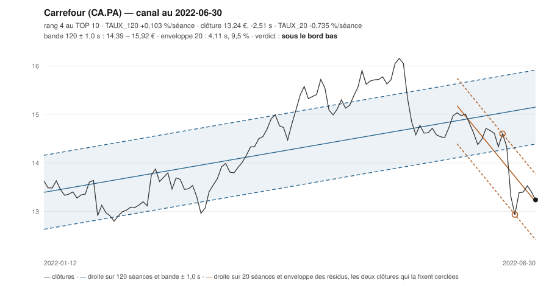

> Rang 4 · TAUX_120 +0,103 %/séance · clôture 13,24 € · bande 14,39 – 15,92 € · écart -2,51 s · TAUX_20 -0,735 %/séance · enveloppe 20 : 4,11 s, 9,5 % · **sous le bord bas**

- Clôture 13,24 €, −2,51 s, sous une bande de 14,39 à 15,92 €.
- Pentes discordantes. TAUX_120 est à +0,103 %/séance, rang 4, alors que la valeur était au rang 2 vingt séances plus tôt. TAUX_20 est à −0,735 %/séance depuis 10 séances.
- Enveloppe de 4,11 s, plus large que l'attendu. Ses deux bornes sont récentes, à trois séances d'écart : 14,60 € le 20 juin, 12,94 € le 23 juin.
- Sous le bord bas de son canal du jour depuis 32 séances : les 20 dernières y sont toutes, jusqu'à −3,62 s le 23 juin. Sur cette période, la valeur a été candidate les 18, 19 et 20 mai et le 16 juin.
- Verdict : sous le bord bas, sans être candidate. La valeur est au TOP 10, mais la pente courte est négative.

### 5. `TTE.PA` — TotalEnergies

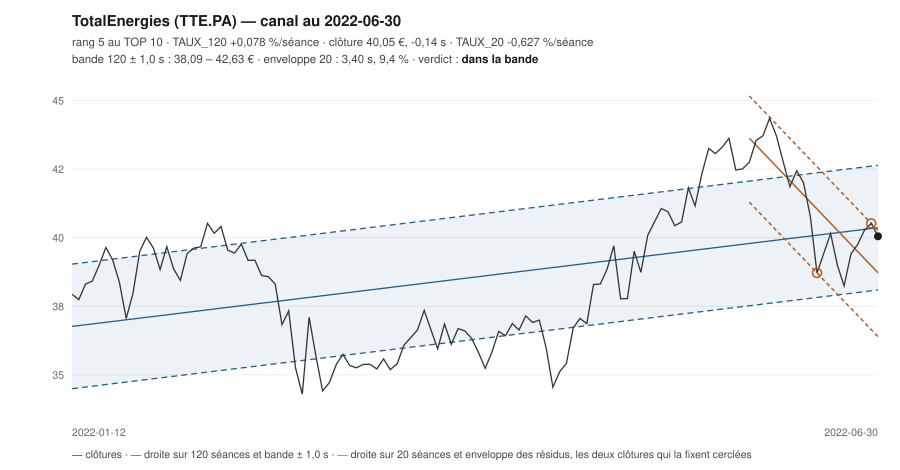

> Rang 5 · TAUX_120 +0,078 %/séance · clôture 40,05 € · bande 38,09 – 42,63 € · écart -0,14 s · TAUX_20 -0,627 %/séance · enveloppe 20 : 3,40 s, 9,4 % · **dans la bande**

- Clôture 40,05 € à −0,14 s, bande de 38,09 à 42,63 €.
- Pentes discordantes : TAUX_120 +0,078 %/séance, rang 5, comme vingt séances plus tôt ; TAUX_20 −0,627 %/séance, négatif depuis 10 séances.
- Enveloppe de 3,40 s. Bas le 17 juin (38,71 €), haut récent le 29 juin (40,52 €).
- Six clôtures au-dessus du bord haut, jusqu'à +1,91 s le 8 juin. Dans la bande depuis 14 séances.
- Verdict : dans la bande.

### 6. `AI.PA` — Air Liquide

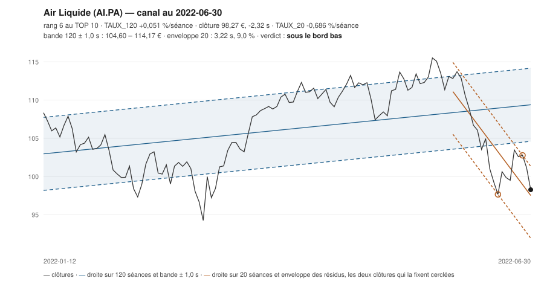

> Rang 6 · TAUX_120 +0,051 %/séance · clôture 98,27 € · bande 104,60 – 114,17 € · écart -2,32 s · TAUX_20 -0,686 %/séance · enveloppe 20 : 3,22 s, 9,0 % · **sous le bord bas**

- Clôture 98,27 €, −2,32 s, sous une bande de 104,60 à 114,17 €.
- Pentes discordantes : TAUX_120 +0,051 %/séance, rang 6 d'un TOP 10 réduit à 8 valeurs ; TAUX_20 −0,686 %/séance, négatif depuis 16 séances.
- Enveloppe de 3,22 s, fixée par deux clôtures récentes : bas le 20 juin (97,66 €), haut le 28 juin (102,76 €).
- La bande a été traversée de haut en bas en 9 séances : +1,18 s le 30 mai, sous le bord bas depuis le 10 juin. Écart jusqu'à −3,03 s le 20 juin. La pente courte était négative à chacune de ces 15 séances.
- Verdict : sous le bord bas, sans être candidate. La valeur est au TOP 10, mais la pente courte est négative.

### 7. `EN.PA` — Bouygues

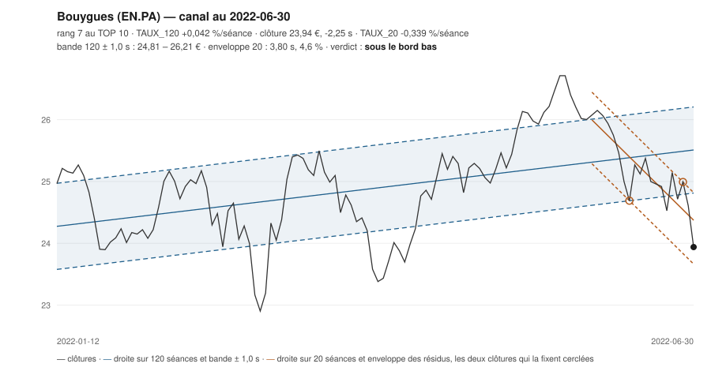

> Rang 7 · TAUX_120 +0,042 %/séance · clôture 23,94 € · bande 24,81 – 26,21 € · écart -2,25 s · TAUX_20 -0,339 %/séance · enveloppe 20 : 3,80 s, 4,6 % · **sous le bord bas**

- Clôture 23,94 €, −2,25 s, sous une bande étroite de 24,81 à 26,21 €.
- Pentes discordantes : TAUX_120 +0,042 %/séance, rang 7, comme vingt séances plus tôt ; TAUX_20 −0,339 %/séance, négatif depuis 15 séances.
- Enveloppe de 3,80 s (4,6 % de E_20). Bas le 14 juin (24,69 €), haut le 28 juin (24,99 €).
- Cinq clôtures sous le bord bas en 20 séances, toutes avec une pente courte négative. Sous le bord bas depuis 2 séances, avec l'écart du jour au plus bas de la période.
- Verdict : sous le bord bas, sans être candidate. La valeur est au TOP 10, mais la pente courte est négative.

### 8. `BN.PA` — Danone

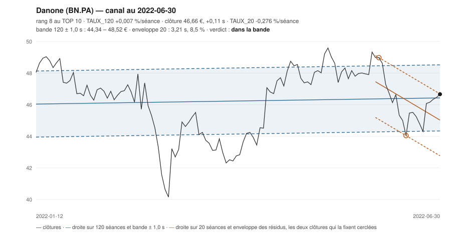

> Rang 8 · TAUX_120 +0,007 %/séance · clôture 46,66 € · bande 44,34 – 48,52 € · écart +0,11 s · TAUX_20 -0,276 %/séance · enveloppe 20 : 3,21 s, 8,5 % · **dans la bande**

- Clôture 46,66 € à +0,11 s, bande de 44,34 à 48,52 €.
- Pentes discordantes. TAUX_120 est à +0,007 %/séance, rang 8 et dernier du TOP 10 : la valeur y est revenue depuis 5 séances et occupait le même rang vingt séances plus tôt. TAUX_20 est à −0,276 %/séance depuis 17 séances.
- Enveloppe de 3,21 s. Haut le 6 juin (48,98 €), bas le 16 juin (44,04 €).
- Écart entre −1,15 s (16 juin, seule clôture sous le bord bas) et +1,18 s (3 juin) sur 20 séances. Dans la bande depuis 10 séances.
- Verdict : dans la bande.

### `VIV.PA` — Vivendi

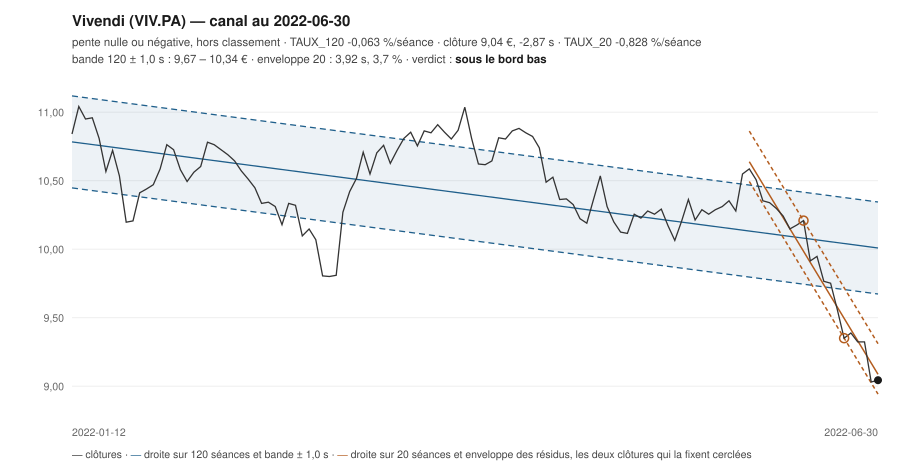

> Hors classement · TAUX_120 -0,063 %/séance · clôture 9,04 € · bande 9,67 – 10,34 € · écart -2,87 s · TAUX_20 -0,828 %/séance · enveloppe 20 : 3,92 s, 3,7 % · **sous le bord bas**

- Clôture 9,04 €, −2,87 s, sous une bande étroite de 9,67 à 10,34 €.
- Deux pentes négatives. TAUX_120 est à −0,063 %/séance : la valeur est hors du TOP 10 depuis 36 séances. TAUX_20 est à −0,828 %/séance.
- Enveloppe de 3,92 s, plus large que l'attendu. Haut le 15 juin (10,21 €), bas le 23 juin (9,35 €).
- Sous le bord bas depuis 11 séances. La veille de l'entrée, le 15 juin, l'écart n'était que de −0,30 s ; il a atteint −3,14 s le 29 juin.
- Verdict : sous le bord bas, sans être candidate. Les deux pentes sont négatives : la valeur est hors TOP 10 et sa pente courte ne monte pas.

### `ENGI.PA` — Engie

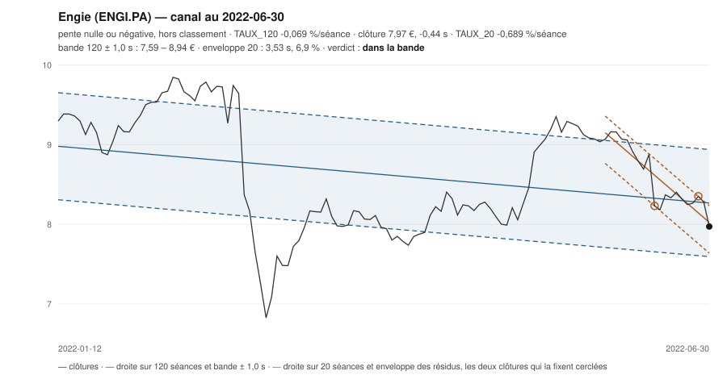

> Hors classement · TAUX_120 -0,069 %/séance · clôture 7,97 € · bande 7,59 – 8,94 € · écart -0,44 s · TAUX_20 -0,689 %/séance · enveloppe 20 : 3,53 s, 6,9 % · **dans la bande**

- Clôture 7,97 € à −0,44 s, bande de 7,59 à 8,94 €.
- Deux pentes négatives : TAUX_120 −0,069 %/séance, hors classement, TAUX_20 −0,689 %/séance depuis 14 séances.
- Enveloppe de 3,53 s. Deux bornes récentes : bas le 16 juin (8,23 €), haut le 28 juin (8,35 €).
- Cinq clôtures au-dessus du bord haut, jusqu'à +1,32 s le 6 juin. Dans la bande depuis 15 séances, avec l'écart du jour au plus bas de la période.
- Verdict : dans la bande.

### `MT.AS` — ArcelorMittal

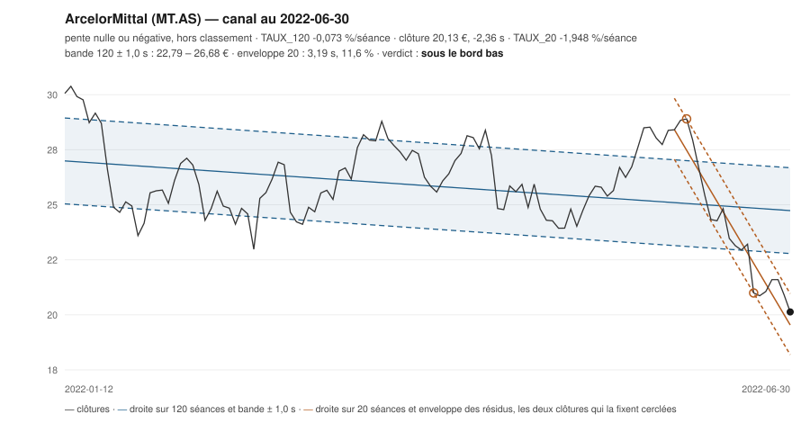

> Hors classement · TAUX_120 -0,073 %/séance · clôture 20,13 € · bande 22,79 – 26,68 € · écart -2,36 s · TAUX_20 -1,948 %/séance · enveloppe 20 : 3,19 s, 11,6 % · **sous le bord bas**

- Clôture 20,13 €, −2,36 s, sous une bande de 22,79 à 26,68 €.
- Deux pentes négatives. TAUX_120 est à −0,073 %/séance : la valeur est hors du TOP 10 depuis 29 séances. TAUX_20 est à −1,948 %/séance, la plus forte baisse courte de l'univers ce jour.
- Enveloppe de 3,19 s (11,6 % de E_20). Haut le 7 juin (28,90 €), bas le 22 juin (20,99 €).
- La bande a été traversée de haut en bas en 6 séances : +1,01 s le 8 juin, sous le bord bas depuis le 16 juin, jusqu'à −2,66 s le 22 juin.
- Verdict : sous le bord bas, sans être candidate. Les deux pentes sont négatives : la valeur est hors TOP 10 et sa pente courte ne monte pas.

### `DG.PA` — Vinci

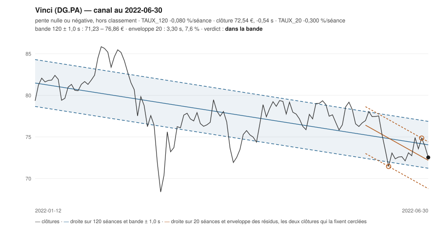

> Hors classement · TAUX_120 -0,080 %/séance · clôture 72,54 € · bande 71,23 – 76,86 € · écart -0,54 s · TAUX_20 -0,300 %/séance · enveloppe 20 : 3,30 s, 7,6 % · **dans la bande**

- Clôture 72,54 € à −0,54 s, bande de 71,23 à 76,86 €.
- Deux pentes négatives. TAUX_120 est à −0,080 %/séance : la valeur est hors du TOP 10 depuis 24 séances. TAUX_20 est à −0,300 %/séance depuis 22 séances.
- Enveloppe de 3,30 s. Bas le 14 juin (71,45 €), haut le 28 juin (74,85 €).
- Deux clôtures sous le bord bas, jusqu'à −1,54 s le 14 juin. Dans la bande depuis 10 séances.
- Verdict : dans la bande.

### `RI.PA` — Pernod Ricard

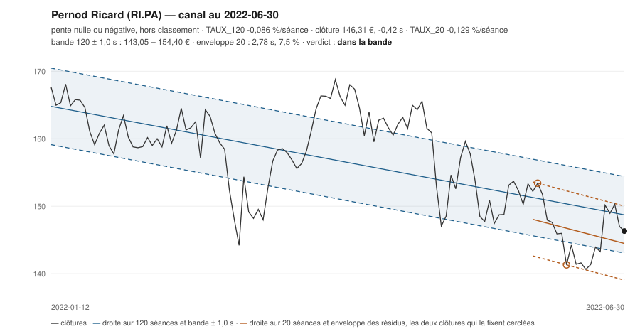

> Hors classement · TAUX_120 -0,086 %/séance · clôture 146,31 € · bande 143,05 – 154,40 € · écart -0,42 s · TAUX_20 -0,129 %/séance · enveloppe 20 : 2,78 s, 7,5 % · **dans la bande**

- Clôture 146,31 € à −0,42 s, bande de 143,05 à 154,40 €.
- Pentes concordantes à la baisse : TAUX_120 −0,086 %/séance, hors classement, TAUX_20 −0,129 %/séance, négatif depuis 49 séances.
- Enveloppe étroite, 2,78 s. Deux bornes anciennes : haut le 6 juin (153,41 €), bas le 14 juin (141,31 €).
- Six clôtures sous le bord bas, jusqu'à −1,54 s le 14 juin. Dans la bande depuis 7 séances.
- Verdict : dans la bande.

### `CAP.PA` — Capgemini

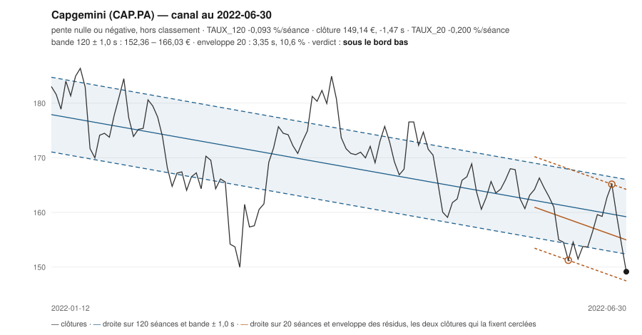

> Hors classement · TAUX_120 -0,093 %/séance · clôture 149,14 € · bande 152,36 – 166,03 € · écart -1,47 s · TAUX_20 -0,200 %/séance · enveloppe 20 : 3,35 s, 10,6 % · **sous le bord bas**

- Clôture 149,14 €, −1,47 s, sous une bande de 152,36 à 166,03 €.
- Deux pentes négatives : TAUX_120 −0,093 %/séance, hors classement, TAUX_20 −0,200 %/séance depuis 17 séances.
- Enveloppe de 3,35 s. Bas le 14 juin (151,24 €), haut récent le 27 juin (165,16 €).
- L'écart est tombé de +0,74 s le 27 juin à −1,47 s en trois séances. C'est la troisième clôture sous le bord bas en 20 séances, après celles du 14 juin (−1,28 s) et du 16 juin (−1,20 s).
- Verdict : sous le bord bas, sans être candidate. Les deux pentes sont négatives : la valeur est hors TOP 10 et sa pente courte ne monte pas.

### `ERF.PA` — Eurofins Scientific

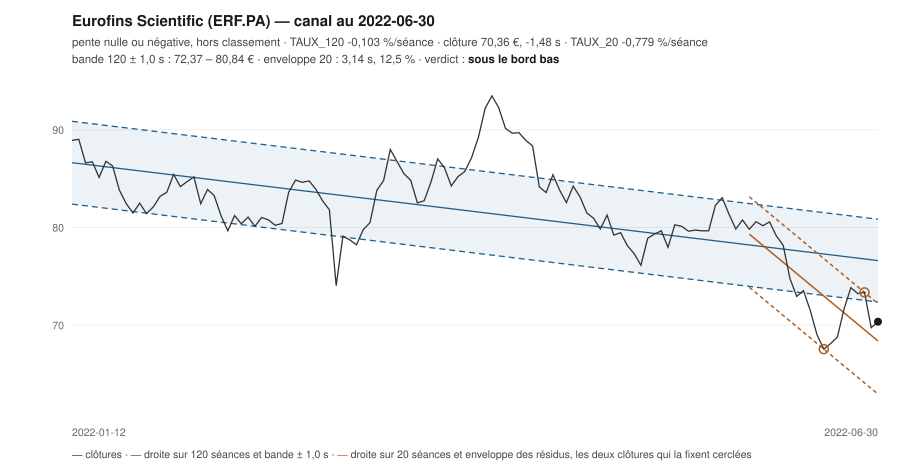

> Hors classement · TAUX_120 -0,103 %/séance · clôture 70,36 € · bande 72,37 – 80,84 € · écart -1,48 s · TAUX_20 -0,779 %/séance · enveloppe 20 : 3,14 s, 12,5 % · **sous le bord bas**

- Clôture 70,36 €, −1,48 s, sous une bande de 72,37 à 80,84 €.
- Pentes concordantes à la baisse : TAUX_120 −0,103 %/séance, hors classement, TAUX_20 −0,779 %/séance.
- Enveloppe de 3,14 s (12,5 % de E_20), fixée par deux clôtures récentes : 67,55 € le 20 juin, 73,36 € le 28 juin.
- La moitié des 20 dernières clôtures était sous le bord bas, jusqu'à −2,37 s le 20 juin. Sous le bord bas de nouveau depuis 2 séances.
- Verdict : sous le bord bas, sans être candidate. Les deux pentes sont négatives : la valeur est hors TOP 10 et sa pente courte ne monte pas.

### `AIR.PA` — Airbus

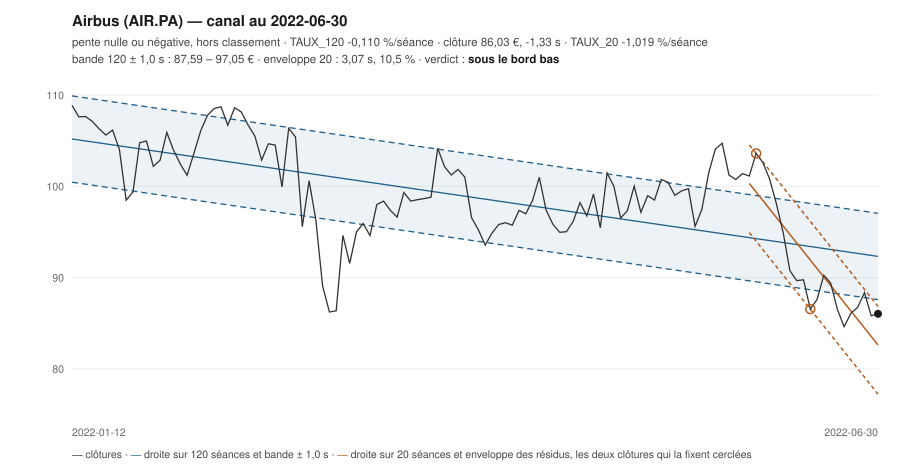

> Hors classement · TAUX_120 -0,110 %/séance · clôture 86,03 € · bande 87,59 – 97,05 € · écart -1,33 s · TAUX_20 -1,019 %/séance · enveloppe 20 : 3,07 s, 10,5 % · **sous le bord bas**

- Clôture 86,03 €, −1,33 s, sous une bande de 87,59 à 97,05 €.
- Pentes concordantes à la baisse : TAUX_120 −0,110 %/séance, hors classement, et TAUX_20 −1,019 %/séance depuis 14 séances.
- Enveloppe de 3,07 s (10,5 % de E_20). Haut le 6 juin (103,61 €), bas le 16 juin (86,54 €).
- Au-dessus du bord haut les 6 et 7 juin, puis douze clôtures sous le bord bas, jusqu'à −1,98 s le 16 juin. Sous le bord bas de nouveau depuis 2 séances.
- Verdict : sous le bord bas, sans être candidate. Les deux pentes sont négatives : la valeur est hors TOP 10 et sa pente courte ne monte pas.

### `TEP.PA` — Teleperformance

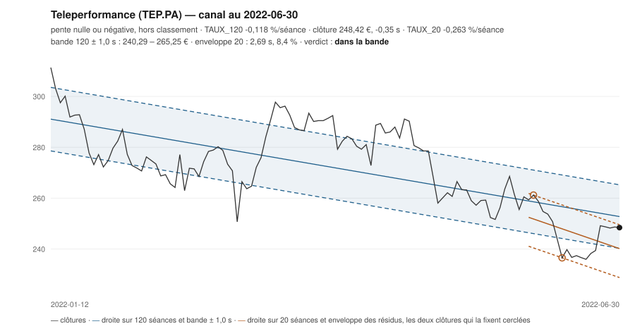

> Hors classement · TAUX_120 -0,118 %/séance · clôture 248,42 € · bande 240,29 – 265,25 € · écart -0,35 s · TAUX_20 -0,263 %/séance · enveloppe 20 : 2,69 s, 8,4 % · **dans la bande**

- Clôture 248,42 € à −0,35 s, bande de 240,29 à 265,25 €.
- Pentes concordantes à la baisse : TAUX_120 −0,118 %/séance, hors classement, TAUX_20 −0,263 %/séance, négatif depuis 40 séances.
- Enveloppe étroite, 2,69 s. Deux bornes anciennes : haut le 6 juin (261,21 €), bas le 14 juin (236,56 €).
- Huit clôtures sous le bord bas, jusqu'à −1,38 s le 14 juin. Dans la bande depuis 5 séances.
- Verdict : dans la bande.

### `CS.PA` — AXA

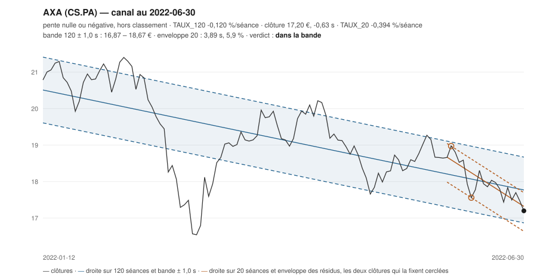

> Hors classement · TAUX_120 -0,120 %/séance · clôture 17,20 € · bande 16,87 – 18,67 € · écart -0,63 s · TAUX_20 -0,394 %/séance · enveloppe 20 : 3,89 s, 5,9 % · **dans la bande**

- Clôture 17,20 € à −0,63 s, bande de 16,87 à 18,67 €.
- Pentes concordantes à la baisse : TAUX_120 −0,120 %/séance, hors classement, TAUX_20 −0,394 %/séance.
- Enveloppe de 3,89 s. Haut le 6 juin (18,97 €), bas le 13 juin (17,56 €).
- Dans la bande depuis 35 séances ; sur les 20 dernières, l'écart est resté entre −0,78 et +0,47 s.
- Verdict : dans la bande.

### `OR.PA` — L'Oréal

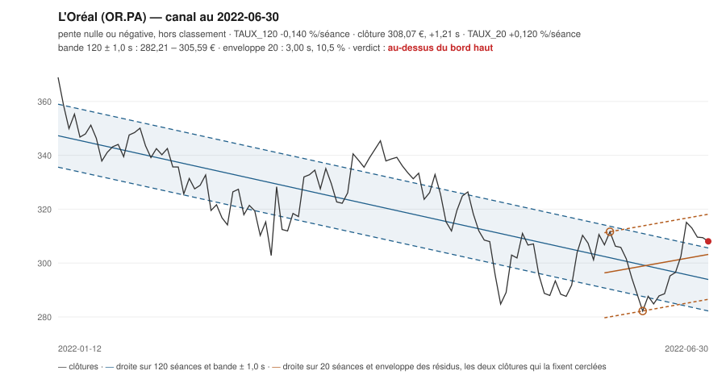

> Hors classement · TAUX_120 -0,140 %/séance · clôture 308,07 € · bande 282,21 – 305,59 € · écart +1,21 s · TAUX_20 +0,120 %/séance · enveloppe 20 : 3,00 s, 10,5 % · **au-dessus du bord haut**

- Clôture 308,07 €, +1,21 s, au-dessus d'une bande de 282,21 à 305,59 €.
- Pentes discordantes : TAUX_120 −0,140 %/séance, hors classement ; TAUX_20 +0,120 %/séance, positif depuis 2 séances.
- Enveloppe de 3,00 s. Deux bornes anciennes : haut le 6 juin (311,62 €), bas le 14 juin (282,20 €).
- L'écart est passé de −0,69 s le 14 juin à +1,92 s le 24 juin. La valeur est au-dessus du bord haut depuis 5 séances.
- Verdict : au-dessus du bord haut.

### `EL.PA` — EssilorLuxottica

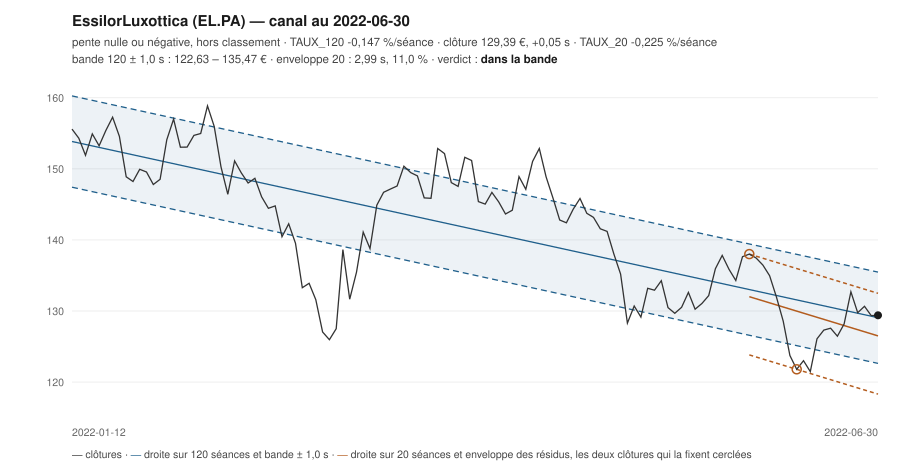

> Hors classement · TAUX_120 -0,147 %/séance · clôture 129,39 € · bande 122,63 – 135,47 € · écart +0,05 s · TAUX_20 -0,225 %/séance · enveloppe 20 : 2,99 s, 11,0 % · **dans la bande**

- Clôture 129,39 € sur la droite longue (+0,05 s), bande de 122,63 à 135,47 €.
- Deux pentes négatives : TAUX_120 −0,147 %/séance, hors classement, et TAUX_20 −0,225 %/séance.
- Enveloppe étroite, 2,99 s. Haut à la première séance, le 3 juin (138,00 €), bas le 14 juin (121,79 €).
- Quatre clôtures sous le bord bas, jusqu'à −1,34 s le 14 juin. Dans la bande depuis 10 séances.
- Verdict : dans la bande.

### `SAF.PA` — Safran

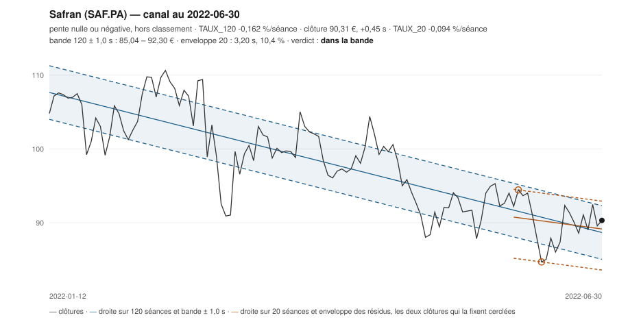

> Hors classement · TAUX_120 -0,162 %/séance · clôture 90,31 € · bande 85,04 – 92,30 € · écart +0,45 s · TAUX_20 -0,094 %/séance · enveloppe 20 : 3,20 s, 10,4 % · **dans la bande**

- Clôture 90,31 € à +0,45 s, bande de 85,04 à 92,30 €.
- Deux pentes négatives. TAUX_120 est à −0,162 %/séance : la valeur est hors du TOP 10 depuis 355 séances. TAUX_20 est à −0,094 %/séance.
- Enveloppe de 3,20 s. Deux bornes anciennes : haut le 6 juin (94,44 €), bas le 13 juin (84,69 €).
- Quatre clôtures sous le bord bas, jusqu'à −1,83 s le 13 juin. Dans la bande depuis 10 séances.
- Verdict : dans la bande.

### `DSY.PA` — Dassault Systèmes

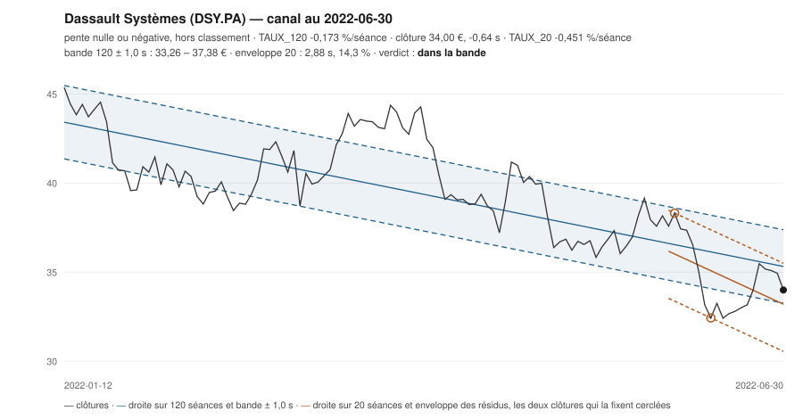

> Hors classement · TAUX_120 -0,173 %/séance · clôture 34,00 € · bande 33,26 – 37,38 € · écart -0,64 s · TAUX_20 -0,451 %/séance · enveloppe 20 : 2,88 s, 14,3 % · **dans la bande**

- Clôture 34,00 € à −0,64 s, bande de 33,26 à 37,38 €.
- Pentes concordantes à la baisse : TAUX_120 −0,173 %/séance, hors classement, TAUX_20 −0,451 %/séance.
- Enveloppe de 2,88 s, étroite en unités de s, mais 14,3 % de E_20. Haut le 6 juin (38,31 €), bas le 14 juin (32,43 €).
- Huit clôtures sous le bord bas en 20 séances, jusqu'à −1,48 s le 14 juin. Dans la bande depuis 6 séances.
- Verdict : dans la bande.

### `STMPA.PA` — STMicroelectronics

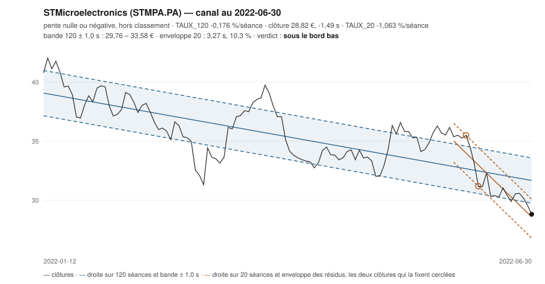

> Hors classement · TAUX_120 -0,176 %/séance · clôture 28,82 € · bande 29,76 – 33,58 € · écart -1,49 s · TAUX_20 -1,063 %/séance · enveloppe 20 : 3,27 s, 10,3 % · **sous le bord bas**

- Clôture 28,82 €, −1,49 s, sous une bande de 29,76 à 33,58 €.
- Pentes concordantes à la baisse : TAUX_120 −0,176 %/séance, hors classement, TAUX_20 −1,063 %/séance depuis 16 séances.
- Enveloppe de 3,27 s, fixée tôt : haut le 8 juin (35,49 €), bas le 13 juin (31,19 €).
- Quatre clôtures au-dessus du bord haut en début de fenêtre, puis six sous le bord bas. La valeur y est depuis 2 séances, avec l'écart du jour au plus bas de la période.
- Verdict : sous le bord bas, sans être candidate. Les deux pentes sont négatives : la valeur est hors TOP 10 et sa pente courte ne monte pas.

### `ALO.PA` — Alstom

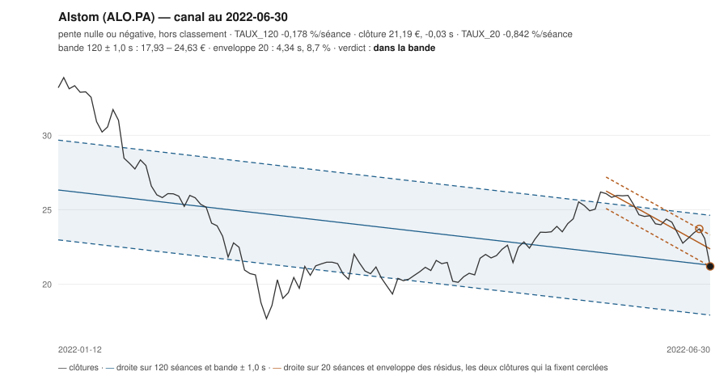

> Hors classement · TAUX_120 -0,178 %/séance · clôture 21,19 € · bande 17,93 – 24,63 € · écart -0,03 s · TAUX_20 -0,842 %/séance · enveloppe 20 : 4,34 s, 8,7 % · **dans la bande**

- Clôture 21,19 € sur la droite longue (−0,03 s), bande large de 17,93 à 24,63 €.
- Deux pentes négatives. TAUX_120 est à −0,178 %/séance : la valeur n'a été classée à aucune des 386 séances évaluées. TAUX_20 est à −0,842 %/séance depuis 9 séances.
- Enveloppe de 4,34 s, plus large que l'attendu, fixée par deux clôtures des trois dernières séances : 23,72 € le 28 juin (haut), 21,19 € aujourd'hui (bas).
- Treize clôtures au-dessus du bord haut en 20 séances, au plus +2,09 s le 3 juin. Dans la bande depuis 7 séances, avec l'écart du jour au plus bas de la période.
- Verdict : dans la bande.

### `LR.PA` — Legrand

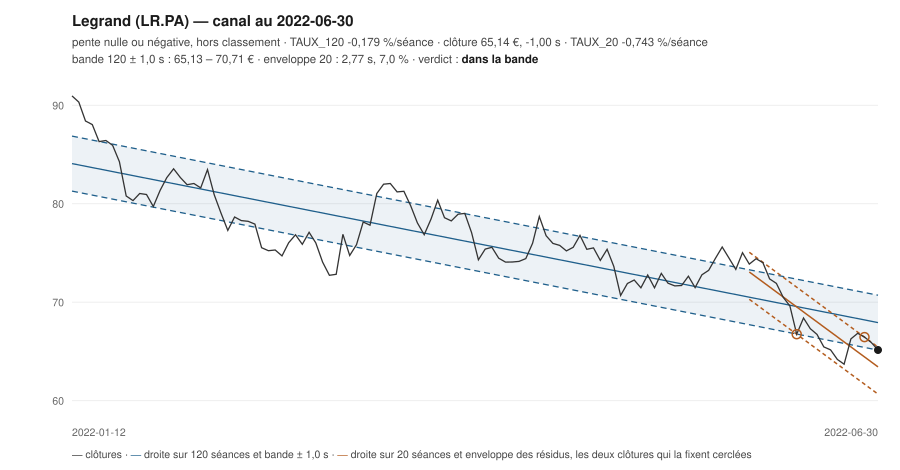

> Hors classement · TAUX_120 -0,179 %/séance · clôture 65,14 € · bande 65,13 – 70,71 € · écart -1,00 s · TAUX_20 -0,743 %/séance · enveloppe 20 : 2,77 s, 7,0 % · **dans la bande**

- Clôture 65,14 € à −1,00 s, soit 0,01 € au-dessus du bord bas d'une bande de 65,13 à 70,71 €.
- Pentes concordantes à la baisse : TAUX_120 −0,179 %/séance, hors classement, TAUX_20 −0,743 %/séance depuis 14 séances.
- Enveloppe étroite, 2,77 s. Bas le 14 juin (66,74 €), haut le 28 juin (66,45 €).
- Sur 20 séances, trois clôtures au-dessus du bord haut (au plus +1,33 s le 6 juin) et quatre sous le bord bas (au plus −1,52 s le 23 juin). Dans la bande depuis 5 séances.
- Verdict : dans la bande.

### `MC.PA` — LVMH

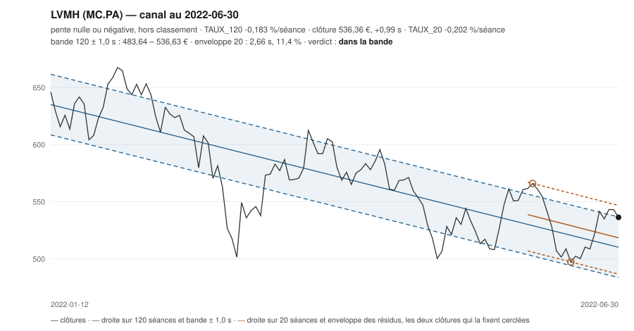

> Hors classement · TAUX_120 -0,183 %/séance · clôture 536,36 € · bande 483,64 – 536,63 € · écart +0,99 s · TAUX_20 -0,202 %/séance · enveloppe 20 : 2,66 s, 11,4 % · **dans la bande**

- Clôture 536,36 € à +0,99 s, à 0,27 € sous le bord haut d'une bande de 483,64 à 536,63 €.
- Pentes concordantes à la baisse : TAUX_120 −0,183 %/séance, hors classement, TAUX_20 −0,202 %/séance.
- Enveloppe étroite, 2,66 s pour ~3,7 s attendues. Haut le 6 juin (565,96 €), bas le 16 juin (497,36 €).
- Sept clôtures au-dessus du bord haut en 20 séances, jusqu'à +1,66 s le 6 juin. Encore à +1,25 s hier, la clôture du jour repasse juste dans la bande.
- Verdict : dans la bande.

### `BNP.PA` — BNP Paribas

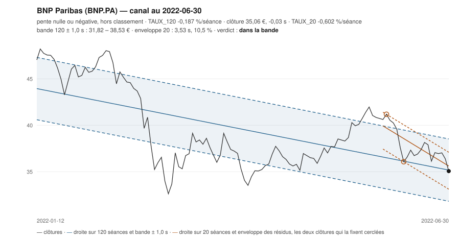

> Hors classement · TAUX_120 -0,187 %/séance · clôture 35,06 € · bande 31,82 – 38,53 € · écart -0,03 s · TAUX_20 -0,602 %/séance · enveloppe 20 : 3,53 s, 10,5 % · **dans la bande**

- Clôture 35,06 € sur la droite longue (−0,03 s), bande de 31,82 à 38,53 €.
- Pentes concordantes à la baisse : TAUX_120 −0,187 %/séance, hors classement, et TAUX_20 −0,602 %/séance.
- Enveloppe de 3,53 s. Deux bornes anciennes : haut le 6 juin (41,18 €), bas le 13 juin (36,07 €).
- Cinq clôtures au-dessus du bord haut, jusqu'à +1,64 s le 6 juin. Dans la bande depuis 15 séances, avec l'écart du jour au plus bas de la période.
- Verdict : dans la bande.

### `SGO.PA` — Saint-Gobain

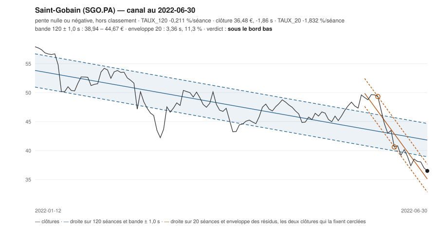

> Hors classement · TAUX_120 -0,211 %/séance · clôture 36,48 € · bande 38,94 – 44,67 € · écart -1,86 s · TAUX_20 -1,832 %/séance · enveloppe 20 : 3,36 s, 11,3 % · **sous le bord bas**

- Clôture 36,48 €, −1,86 s, sous une bande de 38,94 à 44,67 €.
- Deux pentes négatives, la courte très marquée : TAUX_120 −0,211 %/séance, hors classement, TAUX_20 −1,832 %/séance.
- Enveloppe de 3,36 s. Haut le 9 juin (49,33 €), bas le 16 juin (40,62 €).
- La bande a été traversée de haut en bas en 5 séances : +1,78 s le 9 juin, sous le bord bas depuis le 16 juin, soit 11 séances.
- Verdict : sous le bord bas, sans être candidate. Les deux pentes sont négatives : la valeur est hors TOP 10 et sa pente courte ne monte pas.

### `RMS.PA` — Hermès International

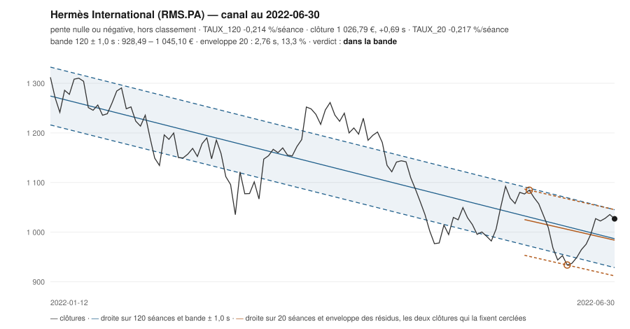

> Hors classement · TAUX_120 -0,214 %/séance · clôture 1 026,79 € · bande 928,49 – 1 045,10 € · écart +0,69 s · TAUX_20 -0,217 %/séance · enveloppe 20 : 2,76 s, 13,3 % · **dans la bande**

- Clôture 1 026,79 € à +0,69 s, bande de 928,49 à 1 045,10 €.
- Deux pentes négatives, au même rythme : TAUX_120 −0,214 %/séance, hors classement, TAUX_20 −0,217 %/séance.
- Enveloppe étroite, 2,76 s, mais 13,3 % de E_20. Haut le 6 juin (1 084,53 €), bas le 16 juin (933,64 €).
- Dans la bande depuis 18 séances. L'écart est remonté de −0,80 s le 16 juin à +0,69 s.
- Verdict : dans la bande.

### `SU.PA` — Schneider Electric

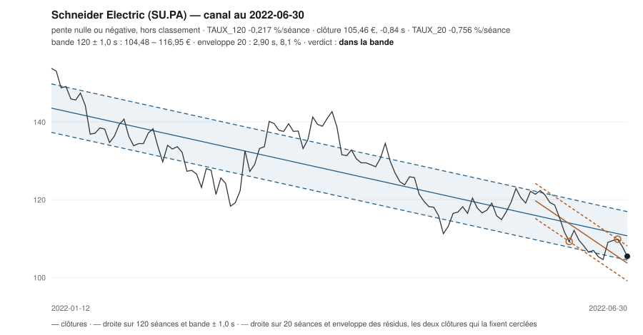

> Hors classement · TAUX_120 -0,217 %/séance · clôture 105,46 € · bande 104,48 – 116,95 € · écart -0,84 s · TAUX_20 -0,756 %/séance · enveloppe 20 : 2,90 s, 8,1 % · **dans la bande**

- Clôture 105,46 € à −0,84 s, bande de 104,48 à 116,95 €.
- Deux pentes négatives : TAUX_120 −0,217 %/séance, hors classement, TAUX_20 −0,756 %/séance.
- Enveloppe de 2,90 s. Bas le 14 juin (109,27 €), haut le 28 juin (109,85 €).
- Deux clôtures sous le bord bas, jusqu'à −1,10 s le 23 juin, et une au-dessus du bord haut, le 6 juin. Dans la bande depuis 5 séances.
- Verdict : dans la bande.

### `PUB.PA` — Publicis

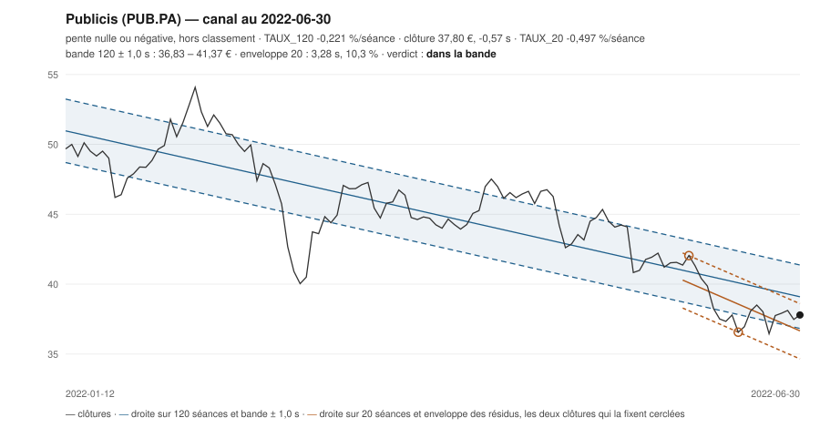

> Hors classement · TAUX_120 -0,221 %/séance · clôture 37,80 € · bande 36,83 – 41,37 € · écart -0,57 s · TAUX_20 -0,497 %/séance · enveloppe 20 : 3,28 s, 10,3 % · **dans la bande**

- Clôture 37,80 € à −0,57 s, bande de 36,83 à 41,37 €.
- Deux pentes négatives : TAUX_120 −0,221 %/séance, hors classement, et TAUX_20 −0,497 %/séance, depuis 38 séances.
- Enveloppe de 3,28 s. Haut le 6 juin (42,04 €), bas le 16 juin (36,57 €).
- La moitié des 20 dernières clôtures était sous le bord bas, jusqu'à −2,04 s le 16 juin, et aucune n'a dépassé −0,48 s. Dans la bande depuis 5 séances.
- Verdict : dans la bande.

### `ML.PA` — Michelin

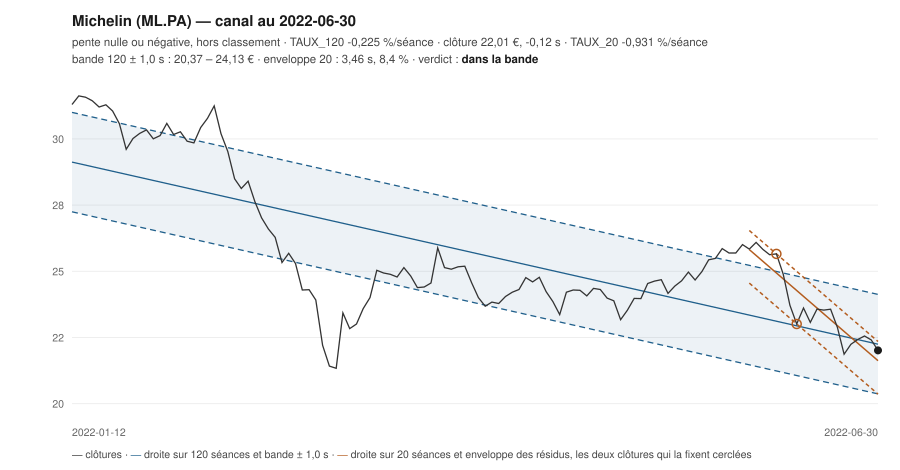

> Hors classement · TAUX_120 -0,225 %/séance · clôture 22,01 € · bande 20,37 – 24,13 € · écart -0,12 s · TAUX_20 -0,931 %/séance · enveloppe 20 : 3,46 s, 8,4 % · **dans la bande**

- Clôture 22,01 € à −0,12 s, bande de 20,37 à 24,13 €.
- Deux pentes négatives : TAUX_120 −0,225 %/séance, hors classement, TAUX_20 −0,931 %/séance.
- Enveloppe de 3,46 s, fixée tôt : haut le 9 juin (25,66 €), bas le 14 juin (23,01 €).
- Six clôtures au-dessus du bord haut, jusqu'à +1,72 s le 6 juin. Dans la bande depuis 14 séances.
- Verdict : dans la bande.

### `WLN.PA` — Worldline

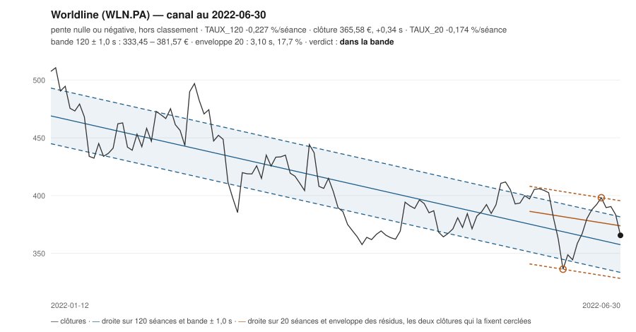

> Hors classement · TAUX_120 -0,227 %/séance · clôture 365,58 € · bande 333,45 – 381,57 € · écart +0,34 s · TAUX_20 -0,174 %/séance · enveloppe 20 : 3,10 s, 17,7 % · **dans la bande**

- Clôture 365,58 € à +0,34 s, bande de 333,45 à 381,57 €.
- Deux pentes négatives : TAUX_120 −0,227 %/séance, hors classement, et TAUX_20 −0,174 %/séance.
- Enveloppe de 3,10 s, soit 17,7 % de E_20. Bas le 14 juin (336,23 €), haut le 24 juin (398,13 €).
- Douze clôtures au-dessus du bord haut en 20 séances, jusqu'à +1,92 s le 6 juin. L'écart est tombé de +1,07 s hier à +0,34 s aujourd'hui.
- Verdict : dans la bande.

### `STLAP.PA` — Stellantis

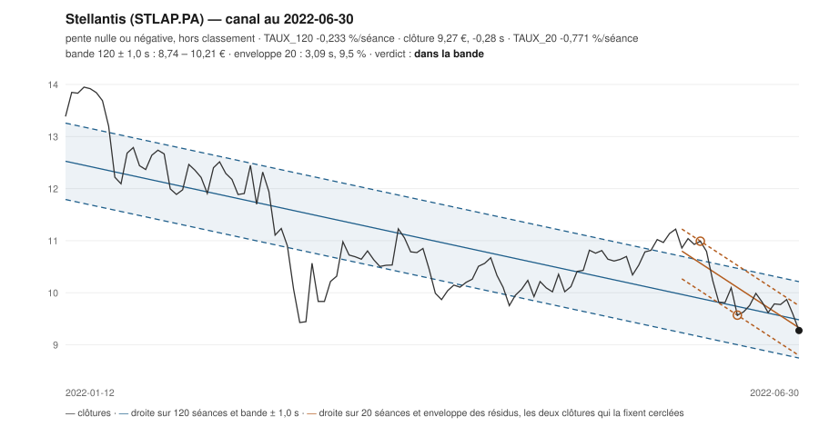

> Hors classement · TAUX_120 -0,233 %/séance · clôture 9,27 € · bande 8,74 – 10,21 € · écart -0,28 s · TAUX_20 -0,771 %/séance · enveloppe 20 : 3,09 s, 9,5 % · **dans la bande**

- Clôture 9,27 € à −0,28 s, bande de 8,74 à 10,21 €.
- Deux pentes négatives : TAUX_120 −0,233 %/séance, hors classement, TAUX_20 −0,771 %/séance.
- Enveloppe de 3,09 s. Haut le 8 juin (10,99 €), bas le 16 juin (9,57 €).
- Cinq clôtures au-dessus du bord haut, jusqu'à +1,53 s le 6 juin. Dans la bande depuis 15 séances, avec l'écart du jour au plus bas de la période.
- Verdict : dans la bande.

### `VIE.PA` — Veolia

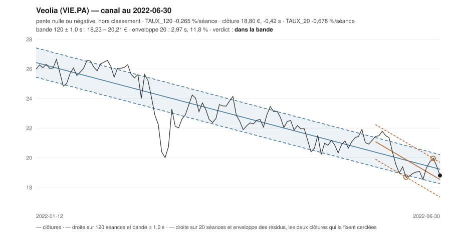

> Hors classement · TAUX_120 -0,265 %/séance · clôture 18,80 € · bande 18,23 – 20,21 € · écart -0,42 s · TAUX_20 -0,678 %/séance · enveloppe 20 : 2,97 s, 11,8 % · **dans la bande**

- Clôture 18,80 € à −0,42 s, bande de 18,23 à 20,21 €.
- Deux pentes négatives : TAUX_120 −0,265 %/séance, hors classement, TAUX_20 −0,678 %/séance.
- Enveloppe de 2,97 s. Bas le 16 juin (18,69 €), haut le 28 juin (19,96 €).
- Sur 20 séances, quatre clôtures sous le bord bas (au plus −1,36 s le 16 juin) et une au-dessus du bord haut (le 7 juin). Dans la bande depuis 5 séances.
- Verdict : dans la bande.

### `ACA.PA` — Crédit Agricole

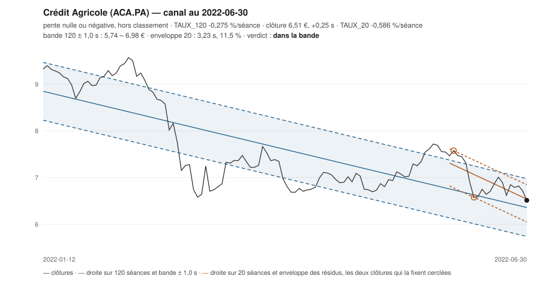

> Hors classement · TAUX_120 -0,275 %/séance · clôture 6,51 € · bande 5,74 – 6,98 € · écart +0,25 s · TAUX_20 -0,586 %/séance · enveloppe 20 : 3,23 s, 11,5 % · **dans la bande**

- Clôture 6,51 € à +0,25 s, bande de 5,74 à 6,98 €.
- Pentes concordantes à la baisse : TAUX_120 −0,275 %/séance, hors classement, TAUX_20 −0,586 %/séance depuis 13 séances.
- Enveloppe de 3,23 s (11,5 % de E_20), fixée en début de fenêtre : haut le 6 juin (7,58 €), bas le 13 juin (6,58 €).
- Aucune des 20 dernières clôtures sous la droite de son canal du jour : écart minimal +0,03 s le 13 juin, maximal +1,46 s le 6 juin. Dans la bande depuis 15 séances.
- Verdict : dans la bande.

### `GLE.PA` — Société Générale

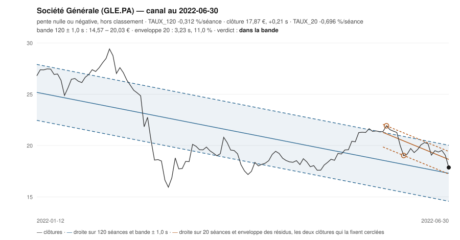

> Hors classement · TAUX_120 -0,312 %/séance · clôture 17,87 € · bande 14,57 – 20,03 € · écart +0,21 s · TAUX_20 -0,696 %/séance · enveloppe 20 : 3,23 s, 11,0 % · **dans la bande**

- Clôture 17,87 € à +0,21 s, bande large de 14,57 à 20,03 €.
- Deux pentes négatives : TAUX_120 −0,312 %/séance, hors classement, TAUX_20 −0,696 %/séance.
- Enveloppe de 3,23 s, fixée en début de fenêtre : haut le 6 juin (21,93 €), bas le 13 juin (19,04 €).
- Huit clôtures au-dessus du bord haut, jusqu'à +1,63 s le 6 juin. Les 20 dernières restent au-dessus de la droite de leur canal du jour, et celle d'aujourd'hui est la plus basse.
- Verdict : dans la bande.

### `KER.PA` — Kering

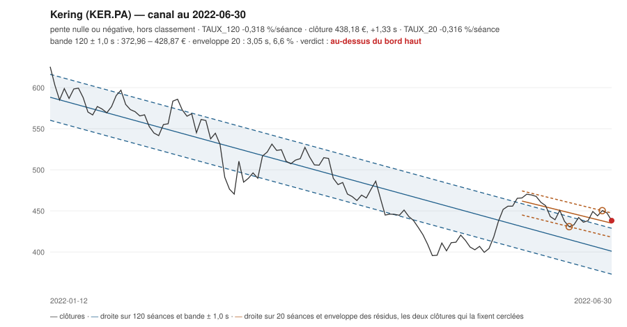

> Hors classement · TAUX_120 -0,318 %/séance · clôture 438,18 € · bande 372,96 – 428,87 € · écart +1,33 s · TAUX_20 -0,316 %/séance · enveloppe 20 : 3,05 s, 6,6 % · **au-dessus du bord haut**

- Clôture 438,18 €, +1,33 s, au-dessus d'une bande de 372,96 à 428,87 €.
- Deux pentes négatives, au même rythme : TAUX_120 −0,318 %/séance, hors classement, TAUX_20 −0,316 %/séance.
- Enveloppe de 3,05 s. Bas le 17 juin (430,81 €), haut le 28 juin (450,25 €).
- Au-dessus du bord haut de son canal du jour depuis 25 séances. Les 20 dernières clôtures sont entre +1,16 et +2,76 s.
- Verdict : au-dessus du bord haut.

### `RNO.PA` — Renault

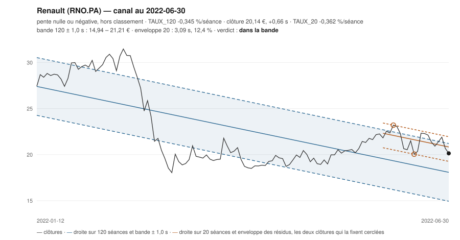

> Hors classement · TAUX_120 -0,345 %/séance · clôture 20,14 € · bande 14,94 – 21,21 € · écart +0,66 s · TAUX_20 -0,362 %/séance · enveloppe 20 : 3,09 s, 12,4 % · **dans la bande**

- Clôture 20,14 € à +0,66 s, bande très large de 14,94 à 21,21 €.
- Deux pentes négatives : TAUX_120 −0,345 %/séance, hors classement, et TAUX_20 −0,362 %/séance.
- Enveloppe de 3,09 s (12,4 % de E_20). Haut le 8 juin (23,19 €), bas le 16 juin (20,05 €).
- Treize des 20 dernières clôtures étaient au-dessus du bord haut, jusqu'à +1,68 s le 8 juin. Dans la bande depuis 2 séances, avec l'écart du jour au plus bas de la période.
- Verdict : dans la bande.

### Les figures des ordres du mois

#### 2022-06-06 — Achat `HO.PA` Thales, décision au 2022-06-03

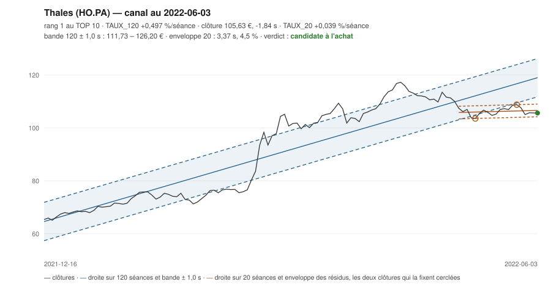

> Rang 1 · TAUX_120 +0,497 %/séance · clôture 105,63 € · bande 111,73 – 126,20 € · écart -1,84 s · TAUX_20 +0,039 %/séance · enveloppe 20 : 3,37 s, 4,5 % · **candidate à l'achat**

## 5. Le TOP 10 au 2022-06-30

| Rang | Valeur | TAUX_120 | Écart | TAUX_20 | Verdict |
|---|---|---|---|---|---|
| 1 | `HO.PA` Thales | +0,341 %/séance | -1,05 s | +0,070 %/séance | candidate à l'achat |
| 2 | `SAN.PA` Sanofi | +0,131 %/séance | -1,54 s | -0,032 %/séance | sous le bord bas |
| 3 | `ORA.PA` Orange | +0,121 %/séance | -0,61 s | +0,123 %/séance | dans la bande |
| 4 | `CA.PA` Carrefour | +0,103 %/séance | -2,51 s | -0,735 %/séance | sous le bord bas |
| 5 | `TTE.PA` TotalEnergies | +0,078 %/séance | -0,14 s | -0,627 %/séance | dans la bande |
| 6 | `AI.PA` Air Liquide | +0,051 %/séance | -2,32 s | -0,686 %/séance | sous le bord bas |
| 7 | `EN.PA` Bouygues | +0,042 %/séance | -2,25 s | -0,339 %/séance | sous le bord bas |
| 8 | `BN.PA` Danone | +0,007 %/séance | +0,11 s | -0,276 %/séance | dans la bande |

*Le TOP ne compte que 8 valeurs : moins de 10 pentes sont strictement positives ce jour-là.*

**Entrées et sorties du TOP 10 au fil du mois**

| Séance | Entrées | Sorties |
|---|---|---|
| 2022-06-22 | — | `BN.PA` |
| 2022-06-24 | `BN.PA` | — |

## 6. Les ordres exécutés

> À l'**ouverture** de la séance qui suit la décision, jamais à la clôture qui l'a déclenchée. L'écart d'ouverture est subi, et publié.

| Exécution | Sens | Valeur | Quantité | Prix | Brut | Frais | Écart d'ouverture | Motif |
|---|---|---|---|---|---|---|---|---|
| 2022-06-06 | **Achat** | `HO.PA` Thales | 18 | 105,72 € | 1 902,98 € | 7,90 € | +0,09 % | décision au 2022-06-03 : clôture 105,63 € sous le bord bas 111,73 € (-1,84 s), rang 1, TAUX_120 +0,497 %/séance, TAUX_20 +0,039 %/séance |

## 7. Les signaux non exécutés

*Aucun : chaque candidat du mois a été acheté.*

## 8. La lecture du mois

Sur le mois, la meilleure contribution vient de `HO.PA` (Thales) pour **+37,04 €**, la moins bonne de `CA.PA` (Carrefour) pour **-174,93 €**. Les 1 ordres du mois ont coûté **7,90 €** de frais, soit 0,079 % de la dotation. Le portefeuille termine le mois **devant TR39** de 6,85 point.

---

[← Mai](2022-05.md) · [Protocole](../README.md) · [Juillet →](2022-07.md)
