# Août 2022

> Journal de l'[expérience 5](../README.md) · exécutions du 2022-08-01 au 2022-08-31 · **2 ordres**
> Portefeuille au 2022-08-31 : **9 560,62 €** (base 95,61) · TR39 86,74 · alpha du mois **+4,05 pt** · depuis janvier **+8,87 pt**

---

## 1. Les actualités du mois précédent

**Juillet 2022.** Rebond net des indices, le meilleur mois de l'année à ce stade.
Le marché commence à anticiper que le ralentissement forcera les banques
centrales à ralentir, et les taux longs reculent depuis leurs sommets de juin.

La BCE relève pourtant ses taux d'un demi-point le 21 juillet — première hausse
depuis 2011 — et met fin à huit ans de taux négatifs. Le même jour, Gazprom
réduit les flux de Nord Stream à 20 % de leur capacité. L'euro touche la parité
avec le dollar pour la première fois depuis 2002. En France, la crise politique
italienne et la démission de Mario Draghi ajoutent à la tension sur les taux du
sud de la zone.

## 2. L'exposition héritée au 2022-07-29

| Valeur | Achetée le | Prix d'achat | Cours | +/− value | Alpha depuis l'achat |
|---|---|---|---|---|---|
| `CA.PA` Carrefour | 2022-05-19 | 15,17 € | 13,05 € | **-13,98 %** | -15,01 pt |
| `HO.PA` Thales | 2022-06-06 | 105,72 € | 112,19 € | **+6,12 %** | +9,36 pt |
| `SAN.PA` Sanofi | 2022-07-04 | 82,42 € | 81,62 € | **-0,98 %** | -8,87 pt |
| `ORA.PA` Orange | 2022-07-07 | 8,65 € | 7,81 € | **-9,64 %** | -16,78 pt |

## 3. Le portefeuille depuis le 2022-01-03

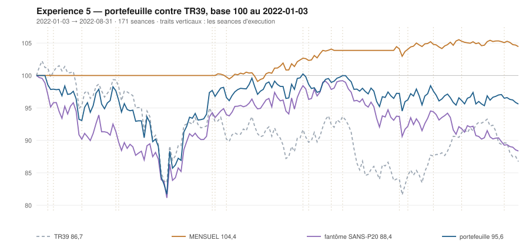

| | |
|---|---|
| Dotation initiale | 10 000,00 € au 2022-01-03 |
| Titres au 2022-08-31 | 7 207,80 € |
| Espèces | 2 352,82 € |
| Lignes détenues | 4 |
| **Total** | **9 560,62 €** |
| Base 100 | **95,61** |
| Fantôme `SANS-P20`, même base | 88,36 |
| Portefeuille fictif `MENSUEL`, même base | 104,45 |
| TR39, même base | 86,74 |
| Écart depuis janvier | **+8,87 pt** |

### Toutes les positions depuis le début de l'expérience

> Closes comme ouvertes. Aucune séance postérieure au 2022-08-31 n'entre dans ce tableau.

| Société | Prix d'achat | Date d'achat | Prix de vente | Date de vente |
|---|---|---|---|---|
| `CAP.PA` Capgemini | 182,86 € | 2022-01-07 | 181,51 € | 2022-03-30 |
| `EL.PA` EssilorLuxottica | 162,03 € | 2022-01-07 | 153,11 € | 2022-03-30 |
| `RI.PA` Pernod Ricard | 173,52 € | 2022-01-07 | 164,76 € | 2022-03-31 |
| `STMPA.PA` STMicroelectronics | 41,80 € | 2022-01-11 | 39,65 € | 2022-03-30 |
| `BNP.PA` BNP Paribas | 43,84 € | 2022-01-25 | 48,20 € | 2022-02-10 |
| `MC.PA` LVMH | 633,54 € | 2022-02-11 | 558,12 € | 2022-05-31 |
| `SAN.PA` Sanofi | 74,66 € | 2022-03-30 | 77,80 € | 2022-04-06 |
| `TTE.PA` TotalEnergies | 36,38 € | 2022-03-30 | 40,80 € | 2022-05-17 |
| `DG.PA` Vinci | 73,34 € | 2022-04-06 | 77,14 € | 2022-07-20 |
| `CA.PA` Carrefour | 15,17 € | 2022-05-19 |  |  |
| `HO.PA` Thales | 105,72 € | 2022-06-06 |  |  |
| `SAN.PA` Sanofi | 82,42 € | 2022-07-04 |  |  |
| `ORA.PA` Orange | 8,65 € | 2022-07-07 |  |  |
| `TTE.PA` TotalEnergies | 38,39 € | 2022-08-03 | 43,55 € | 2022-08-24 |

*14 positions depuis le début, dont 4 encore ouvertes : les deux dernières colonnes restent vides.*

## 4. L'étude chartiste au 2022-08-31

> Une entrée par société de l'univers, sous la figure de canal lue à la clôture du 2022-08-31. La ligne en retrait est **calculée** ; la note qui suit est celle de l'agent `chartiste`, rédigée sans aucune séance postérieure.

### 1. `RNO.PA` — Renault

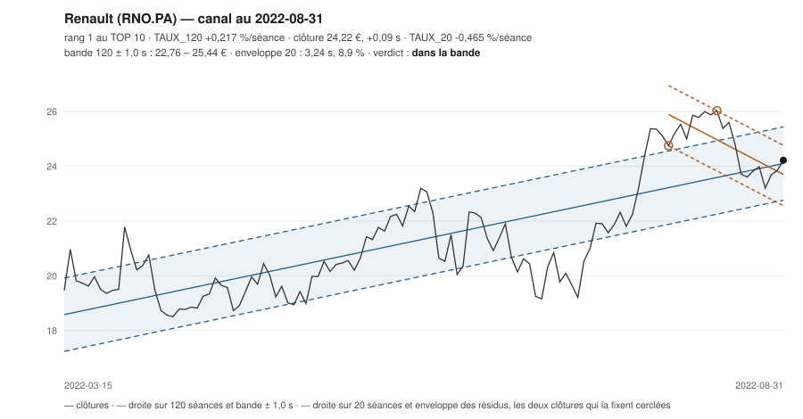

> Rang 1 · TAUX_120 +0,217 %/séance · clôture 24,22 € · bande 22,76 – 25,44 € · écart +0,09 s · TAUX_20 -0,465 %/séance · enveloppe 20 : 3,24 s, 8,9 % · **dans la bande**

- Clôture 24,22 €, à +0,09 s, dans la bande de 22,76 à 25,44 € depuis 9 séances ; 11 séances de la fenêtre au-dessus du bord haut (+1,99 s le 2022-08-12), puis un creux à −0,56 s le 2022-08-26.
- Rang 1 du TOP 10, pente longue +0,217 %/séance, au TOP 10 depuis 19 séances ; pente courte −0,465 %/séance depuis 6 séances : désaccord franc.
- Enveloppe de 3,24 s (8,9 % du niveau moyen) ; résidu bas à la 1re séance (2022-08-04), résidu haut le 2022-08-16.
- Verdict : dans la bande.

### 2. `TTE.PA` — TotalEnergies

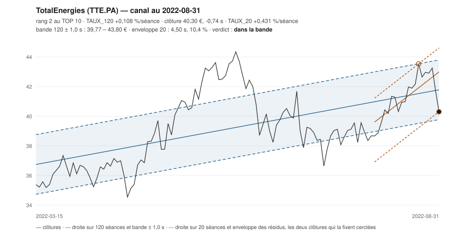

> Rang 2 · TAUX_120 +0,108 %/séance · clôture 40,30 € · bande 39,77 – 43,80 € · écart -0,74 s · TAUX_20 +0,431 %/séance · enveloppe 20 : 4,50 s, 10,4 % · **dans la bande**

- Clôture 40,30 €, à −0,74 s, dans la bande de 39,77 à 43,80 € ; l'écart a parcouru toute la bande sur 20 séances, de −1,00 s le 2022-08-04 à +1,00 s le 2022-08-23.
- Rang 2 du TOP 10, pente longue +0,108 %/séance, au TOP 10 depuis 219 séances ; pente courte +0,431 %/séance, la plus forte de l'univers, positive depuis 23 séances : concordance.
- Enveloppe de 4,50 s (10,4 % du niveau moyen), la plus large de l'univers en unités de s ; résidu haut le 2022-08-23, résidu bas à la clôture du jour.
- Verdict : dans la bande — au TOP 10 avec une pente courte positive, mais la clôture reste au-dessus du bord bas de 39,77 €.

### 3. `ENGI.PA` — Engie

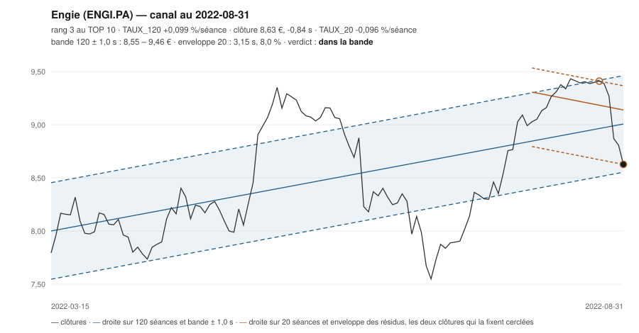

> Rang 3 · TAUX_120 +0,099 %/séance · clôture 8,63 € · bande 8,55 – 9,46 € · écart -0,84 s · TAUX_20 -0,096 %/séance · enveloppe 20 : 3,15 s, 8,0 % · **dans la bande**

- Clôture 8,63 €, à −0,84 s, dans la bande de 8,55 à 9,46 € ; écart le plus bas des 20 séances.
- Rentrée par le haut le 2022-08-18 après 8 séances au-dessus du bord haut (+1,20 s le 2022-08-12), puis descente jusqu'au voisinage du bord bas.
- Rang 3 du TOP 10, pente longue +0,099 %/séance, au TOP 10 depuis 21 séances ; la pente courte a basculé ce jour à −0,096 %/séance : désaccord.
- Enveloppe de 3,15 s (8,0 % du niveau moyen) ; bornes récentes, 2022-08-24 (haut) et clôture du jour (bas).
- Verdict : dans la bande.

### 4. `RMS.PA` — Hermès International

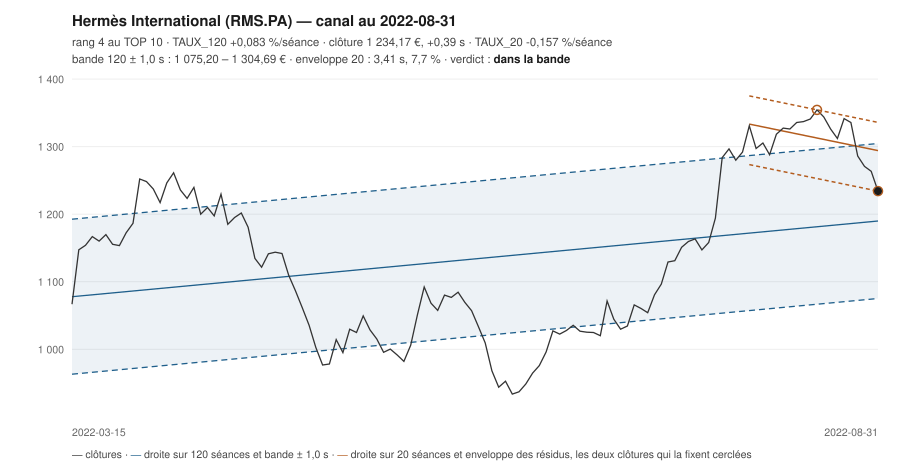

> Rang 4 · TAUX_120 +0,083 %/séance · clôture 1 234,17 € · bande 1 075,20 – 1 304,69 € · écart +0,39 s · TAUX_20 -0,157 %/séance · enveloppe 20 : 3,41 s, 7,7 % · **dans la bande**

- Clôture 1 234,17 €, à +0,39 s, dans la bande de 1 075,20 à 1 304,69 €, rentrée le 2022-08-26.
- De +3,05 s au 2022-08-04 à +0,39 s ce jour, écart le plus bas de la fenêtre ; 16 des 20 séances au-dessus du bord haut.
- Rang 4 du TOP 10, pente longue +0,083 %/séance, au TOP 10 depuis 12 séances ; pente courte −0,157 %/séance depuis 2 séances : désaccord.
- Enveloppe de 3,41 s (7,7 % du niveau moyen) ; résidu haut le 2022-08-18, résidu bas à la clôture du jour.
- Verdict : dans la bande.

### 5. `MC.PA` — LVMH

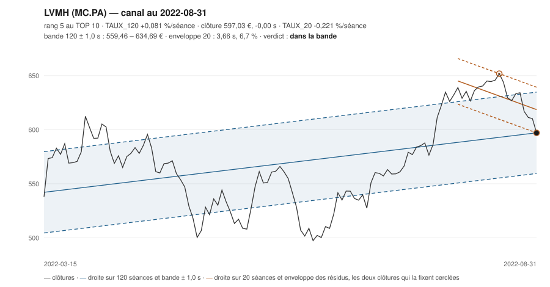

> Rang 5 · TAUX_120 +0,081 %/séance · clôture 597,03 € · bande 559,46 – 634,69 € · écart -0,00 s · TAUX_20 -0,221 %/séance · enveloppe 20 : 3,66 s, 6,7 % · **dans la bande**

- Clôture 597,03 €, sur la droite à −0,00 s, dans la bande de 559,46 à 634,69 €.
- Rentrée par le haut le 2022-08-26, il y a 4 séances : 15 des 20 dernières séances ont clos au-dessus du bord haut, et l'écart du jour est le plus bas de la fenêtre.
- Rang 5 du TOP 10, pente longue +0,081 %/séance, au TOP 10 depuis 17 séances ; pente courte −0,221 %/séance depuis 4 séances : désaccord.
- Enveloppe de 3,66 s (6,7 % du niveau moyen) ; résidu haut le 2022-08-18, résidu bas à la clôture du jour.
- Verdict : dans la bande.

### 6. `ALO.PA` — Alstom

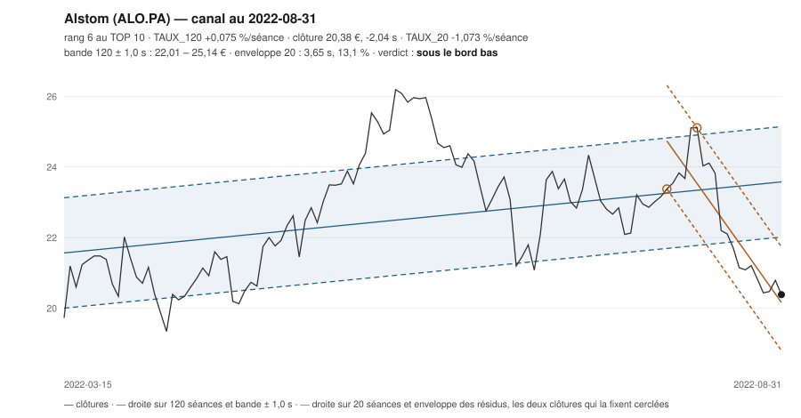

> Rang 6 · TAUX_120 +0,075 %/séance · clôture 20,38 € · bande 22,01 – 25,14 € · écart -2,04 s · TAUX_20 -1,073 %/séance · enveloppe 20 : 3,65 s, 13,1 % · **sous le bord bas**

- Clôture 20,38 €, à −2,04 s, sous le bord bas de 22,01 € (bande 22,01 à 25,14 €) ; c'est l'écart le plus bas de l'univers ce jour.
- Sous le bord bas depuis 11 séances, depuis le 2022-08-17 ; la fenêtre était encore à +0,58 s le 2022-08-10, et le creux, −2,32 s, date du 2022-08-26.
- Rang 6 du TOP 10, pente longue +0,075 %/séance, au TOP 10 depuis 33 séances ; pente courte −1,073 %/séance, la plus négative de l'univers, depuis 8 séances : désaccord.
- Enveloppe de 3,65 s, soit 13,1 % du niveau moyen, la plus large de l'univers en valeur relative ; ses bornes sont anciennes, 2022-08-04 (bas) et 2022-08-11 (haut).
- Verdict : sous le bord bas, non candidate — la pente courte est négative.

### 7. `WLN.PA` — Worldline

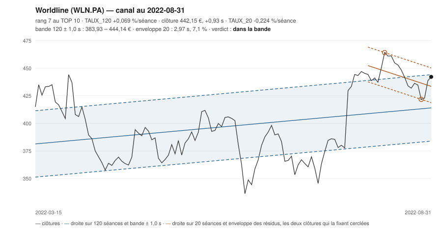

> Rang 7 · TAUX_120 +0,069 %/séance · clôture 442,15 € · bande 383,93 – 444,14 € · écart +0,93 s · TAUX_20 -0,224 %/séance · enveloppe 20 : 2,97 s, 7,1 % · **dans la bande**

- Clôture 442,15 €, à +0,93 s, dans la bande de 383,93 à 444,14 €, à 1,99 € du bord haut.
- Rentrée par le haut le 2022-08-22 ; 12 séances de la fenêtre au-dessus du bord haut (+2,53 s le 2022-08-11), et aucune sous +0,41 s.
- Rang 7 du TOP 10, pente longue +0,069 %/séance, au TOP 10 depuis 9 séances ; pente courte −0,224 %/séance depuis 5 séances : désaccord.
- Enveloppe de 2,97 s (7,1 % du niveau moyen), sous les ~3,7 s ; résidu haut le 2022-08-11, résidu bas le 2022-08-26.
- Verdict : dans la bande.

### 8. `HO.PA` — Thales

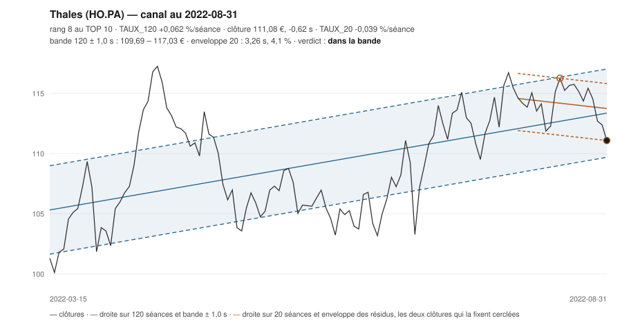

> Rang 8 · TAUX_120 +0,062 %/séance · clôture 111,08 € · bande 109,69 – 117,03 € · écart -0,62 s · TAUX_20 -0,039 %/séance · enveloppe 20 : 3,26 s, 4,1 % · **dans la bande**

- Clôture 111,08 €, à −0,62 s, dans la bande de 109,69 à 117,03 € depuis 40 séances ; écart le plus bas des 20 séances, le plus haut étant +0,82 s le 2022-08-17.
- Rang 8 du TOP 10, pente longue +0,062 %/séance, au TOP 10 depuis 126 séances ; pente courte −0,039 %/séance depuis 4 séances : désaccord.
- Enveloppe de 3,26 s (4,1 % du niveau moyen) ; résidu haut le 2022-08-17, résidu bas à la clôture du jour.
- Verdict : dans la bande.

### 9. `BN.PA` — Danone

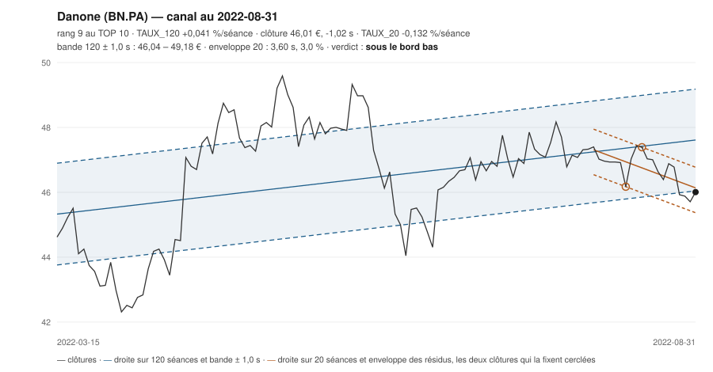

> Rang 9 · TAUX_120 +0,041 %/séance · clôture 46,01 € · bande 46,04 – 49,18 € · écart -1,02 s · TAUX_20 -0,132 %/séance · enveloppe 20 : 3,60 s, 3,0 % · **sous le bord bas**

- Clôture 46,01 €, à −1,02 s, juste sous le bord bas de 46,04 € (bande 46,04 à 49,18 €).
- Sous le bord bas depuis 4 séances ; le creux de la fenêtre est à −1,25 s le 2022-08-30, et aucune des 20 séances n'a dépassé −0,23 s.
- Rang 9 du TOP 10, pente longue +0,041 %/séance, au TOP 10 depuis 49 séances ; pente courte −0,132 %/séance, négative depuis 16 séances.
- Enveloppe de 3,60 s pour 3,0 % du niveau moyen ; bornes au milieu de la fenêtre, 2022-08-12 (bas) et 2022-08-17 (haut).
- Verdict : sous le bord bas, non candidate — la pente courte est négative.

### 10. `SAF.PA` — Safran

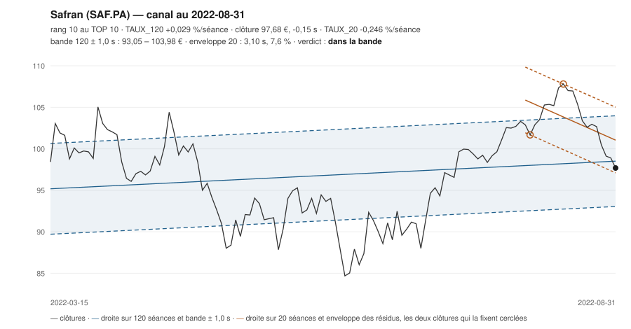

> Rang 10 · TAUX_120 +0,029 %/séance · clôture 97,68 € · bande 93,05 – 103,98 € · écart -0,15 s · TAUX_20 -0,246 %/séance · enveloppe 20 : 3,10 s, 7,6 % · **dans la bande**

- Clôture 97,68 €, à −0,15 s, dans la bande de 93,05 à 103,98 € ; écart le plus bas des 20 séances.
- Rentrée par le haut le 2022-08-23 après 13 séances au-dessus du bord haut, au plus haut à +2,17 s le 2022-08-15.
- Rang 10 du TOP 10, pente longue +0,029 %/séance, entrée au TOP 10 il y a 2 séances ; pente courte −0,246 %/séance depuis 3 séances : désaccord.
- Enveloppe de 3,10 s (7,6 % du niveau moyen) ; bornes au 2022-08-05 (bas) et au 2022-08-16 (haut).
- Verdict : dans la bande.

### 11. `STLAP.PA` — Stellantis

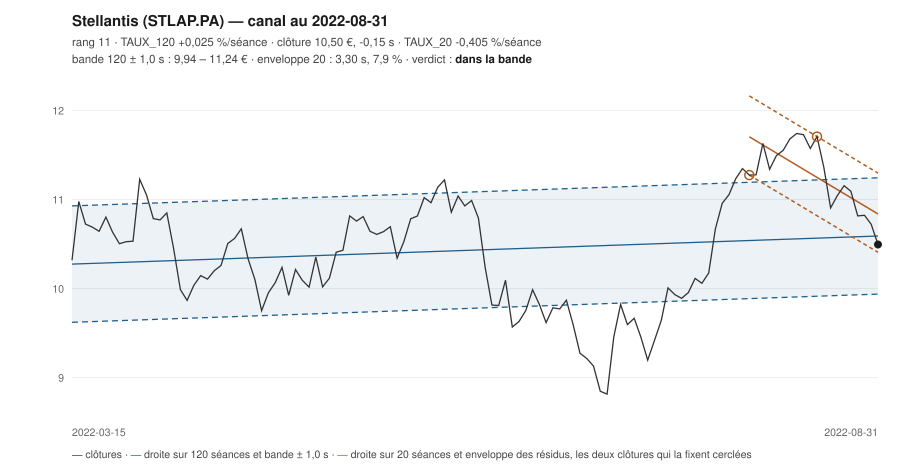

> Rang 11 · TAUX_120 +0,025 %/séance · clôture 10,50 € · bande 9,94 – 11,24 € · écart -0,15 s · TAUX_20 -0,405 %/séance · enveloppe 20 : 3,30 s, 7,9 % · **dans la bande**

- Clôture 10,50 €, à −0,15 s, dans la bande de 9,94 à 11,24 €, écart le plus bas des 20 séances.
- Rentrée par le haut le 2022-08-22 ; 12 séances au-dessus du bord haut dans la fenêtre, au plus haut à +2,55 s le 2022-08-08.
- Pente longue +0,025 %/séance, rang 11, sortie du TOP 10 il y a 2 séances ; pente courte −0,405 %/séance depuis 4 séances.
- Enveloppe de 3,30 s (7,9 % du niveau moyen) ; résidu bas le 2022-08-04, résidu haut le 2022-08-18.
- Verdict : dans la bande.

### 12. `OR.PA` — L'Oréal

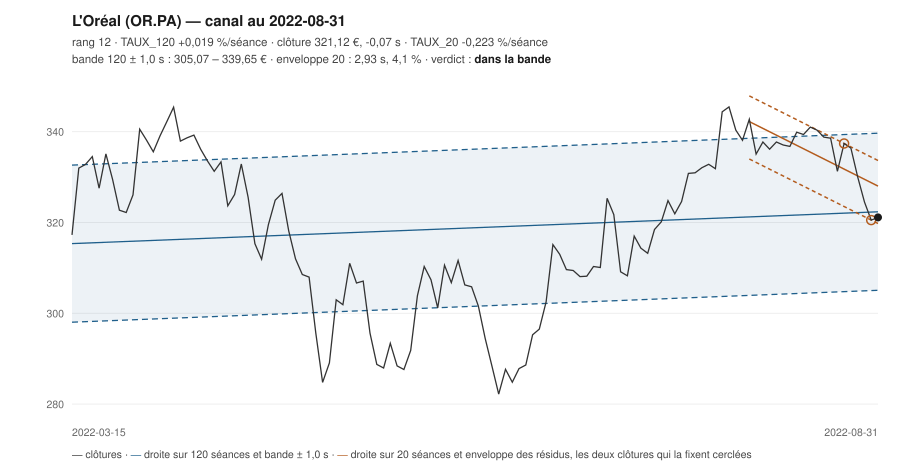

> Rang 12 · TAUX_120 +0,019 %/séance · clôture 321,12 € · bande 305,07 – 339,65 € · écart -0,07 s · TAUX_20 -0,223 %/séance · enveloppe 20 : 2,93 s, 4,1 % · **dans la bande**

- Clôture 321,12 €, à −0,07 s, dans la bande de 305,07 à 339,65 €, rentrée par le haut le 2022-08-23 ; 13 séances de la fenêtre au-dessus du bord haut, depuis +2,01 s le 2022-08-04.
- Pente longue positive, +0,019 %/séance, au rang 12, hors TOP 10 ; pente courte −0,223 %/séance depuis 7 séances.
- Enveloppe de 2,93 s (4,1 % du niveau moyen), sous les ~3,7 s ; bornes récentes, 2022-08-24 (haut) et 2022-08-30 (bas).
- Verdict : dans la bande.

### 13. `DG.PA` — Vinci

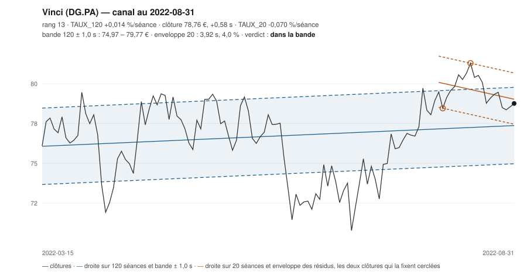

> Rang 13 · TAUX_120 +0,014 %/séance · clôture 78,76 € · bande 74,97 – 79,77 € · écart +0,58 s · TAUX_20 -0,070 %/séance · enveloppe 20 : 3,92 s, 4,0 % · **dans la bande**

- Clôture 78,76 €, à +0,58 s, dans la bande de 74,97 à 79,77 € depuis 8 séances ; les 20 séances sont restées au-dessus de la droite, entre +0,44 s et +1,80 s, dont 12 au-dessus du bord haut.
- Pente longue positive, +0,014 %/séance, mais rang 13, hors TOP 10 depuis 9 séances ; pente courte −0,070 %/séance depuis 2 séances : désaccord.
- Enveloppe de 3,92 s (4,0 % du niveau moyen), un peu au-dessus des ~3,7 s ; bornes au 2022-08-05 (bas) et au 2022-08-16 (haut).
- Verdict : dans la bande.

### `KER.PA` — Kering

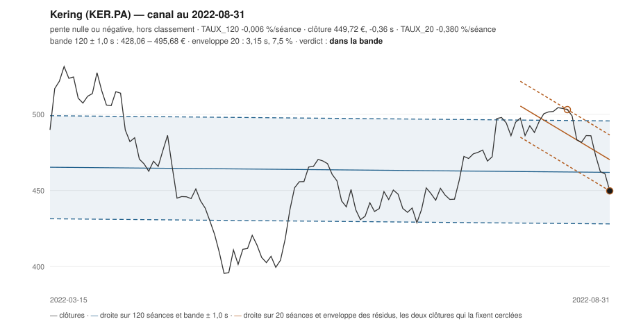

> Hors classement · TAUX_120 -0,006 %/séance · clôture 449,72 € · bande 428,06 – 495,68 € · écart -0,36 s · TAUX_20 -0,380 %/séance · enveloppe 20 : 3,15 s, 7,5 % · **dans la bande**

- Clôture 449,72 €, à −0,36 s, dans la bande de 428,06 à 495,68 € ; écart le plus bas des 20 séances.
- Le chemin est une descente à travers la moitié haute : +1,92 s le 2022-08-04, 12 séances au-dessus du bord haut, rentrée le 2022-08-22.
- Pente longue −0,006 %/séance, négative de justesse et hors classement ; pente courte −0,380 %/séance depuis 6 séances.
- Enveloppe de 3,15 s (7,5 % du niveau moyen) ; résidu haut le 2022-08-18, résidu bas à la clôture du jour.
- Verdict : dans la bande.

### `RI.PA` — Pernod Ricard

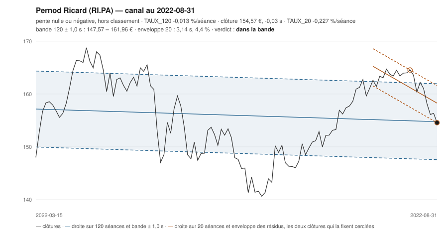

> Hors classement · TAUX_120 -0,013 %/séance · clôture 154,57 € · bande 147,57 – 161,96 € · écart -0,03 s · TAUX_20 -0,227 %/séance · enveloppe 20 : 3,14 s, 4,4 % · **dans la bande**

- Clôture 154,57 €, à −0,03 s, dans la bande de 147,57 à 161,96 € ; écart le plus bas des 20 séances.
- Rentrée par le haut le 2022-08-23 après 13 séances au-dessus du bord haut, depuis +1,86 s au 2022-08-04.
- Pente longue −0,013 %/séance et pente courte −0,227 %/séance depuis 4 séances : concordance.
- Enveloppe de 3,14 s (4,4 % du niveau moyen) ; résidu haut le 2022-08-19, résidu bas à la clôture du jour.
- Verdict : dans la bande.

### `GLE.PA` — Société Générale

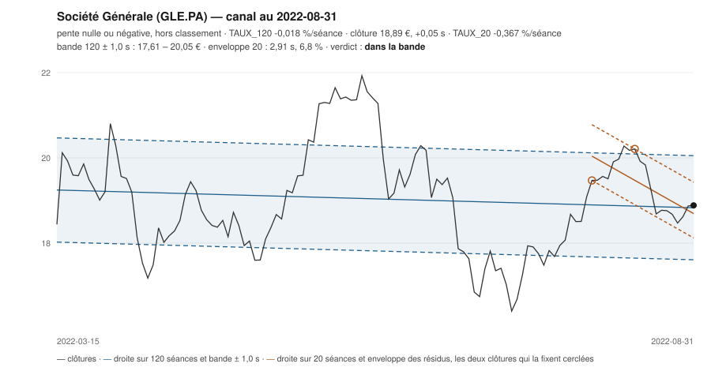

> Hors classement · TAUX_120 -0,018 %/séance · clôture 18,89 € · bande 17,61 – 20,05 € · écart +0,05 s · TAUX_20 -0,367 %/séance · enveloppe 20 : 2,91 s, 6,8 % · **dans la bande**

- Clôture 18,89 €, à +0,05 s, dans la bande de 17,61 à 20,05 € depuis 13 séances ; une seule clôture au-dessus du bord haut dans la fenêtre, +1,07 s le 2022-08-12.
- Pente longue −0,018 %/séance, pente courte −0,367 %/séance depuis 4 séances : les deux sont négatives.
- Enveloppe étroite, 2,91 s (6,8 % du niveau moyen) ; résidu bas le 2022-08-04, résidu haut le 2022-08-16.
- Verdict : dans la bande.

### `AIR.PA` — Airbus

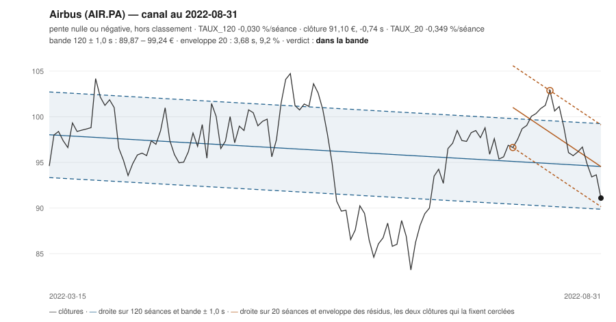

> Hors classement · TAUX_120 -0,030 %/séance · clôture 91,10 € · bande 89,87 – 99,24 € · écart -0,74 s · TAUX_20 -0,349 %/séance · enveloppe 20 : 3,68 s, 9,2 % · **dans la bande**

- Clôture 91,10 €, à −0,74 s, dans la bande de 89,87 à 99,24 €, écart le plus bas des 20 séances.
- Rentrée dans la bande par le haut le 2022-08-19 ; auparavant 9 séances au-dessus du bord haut, au plus haut à +1,59 s le 2022-08-16.
- Pente longue −0,030 %/séance, pente courte −0,349 %/séance depuis 4 séances : les deux sont négatives.
- Enveloppe de 3,68 s (9,2 % du niveau moyen), au niveau attendu ; bornes au 2022-08-04 (bas, 1re séance) et au 2022-08-16 (haut).
- Verdict : dans la bande.

### `BNP.PA` — BNP Paribas

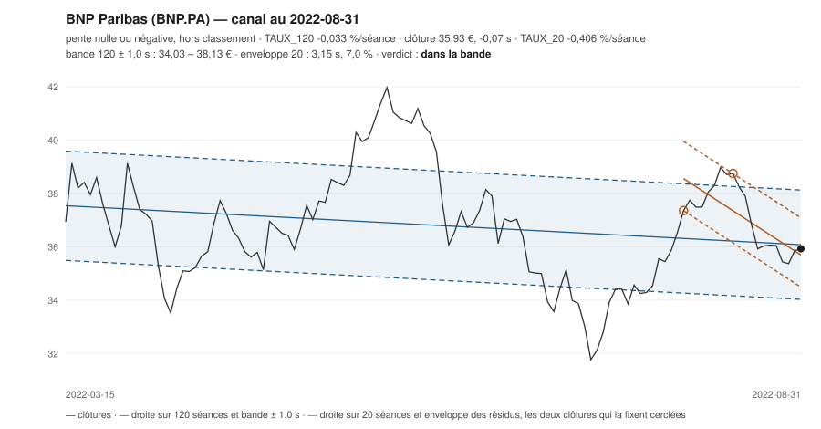

> Hors classement · TAUX_120 -0,033 %/séance · clôture 35,93 € · bande 34,03 – 38,13 € · écart -0,07 s · TAUX_20 -0,406 %/séance · enveloppe 20 : 3,15 s, 7,0 % · **dans la bande**

- Clôture 35,93 €, à −0,07 s, dans la bande de 34,03 à 38,13 €, revenue par le haut le 2022-08-17 après 4 séances au-dessus du bord haut (+1,27 s le 2022-08-12).
- Pente longue −0,033 %/séance ; pente courte −0,406 %/séance, négative depuis 4 séances : concordance.
- Enveloppe de 3,15 s (7,0 % du niveau moyen), sous les ~3,7 s ; bornes au 2022-08-04 (bas) et au 2022-08-16 (haut).
- Verdict : dans la bande.

### `ORA.PA` — Orange

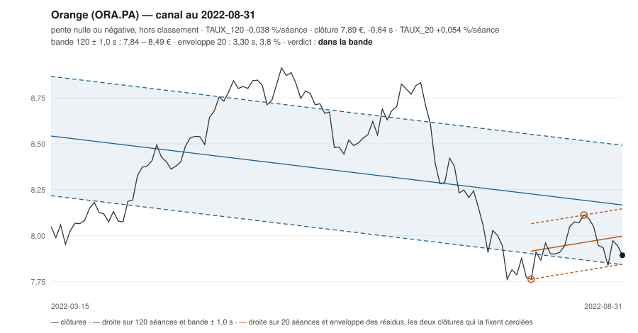

> Hors classement · TAUX_120 -0,038 %/séance · clôture 7,89 € · bande 7,84 – 8,49 € · écart -0,84 s · TAUX_20 +0,054 %/séance · enveloppe 20 : 3,30 s, 3,8 % · **dans la bande**

- Clôture 7,89 €, à −0,84 s, dans la bande de 7,84 à 8,49 €, rentrée le 2022-08-29 ; 9 des 20 séances étaient sous le bord bas, depuis −2,28 s au 2022-08-04.
- Pente longue −0,038 %/séance, hors TOP 10 depuis 12 séances ; pente courte +0,054 %/séance, positive depuis 11 séances : désaccord.
- Enveloppe de 3,30 s (3,8 % du niveau moyen) ; résidu bas à la 1re séance (2022-08-04), résidu haut le 2022-08-19.
- Verdict : dans la bande.

### `EN.PA` — Bouygues

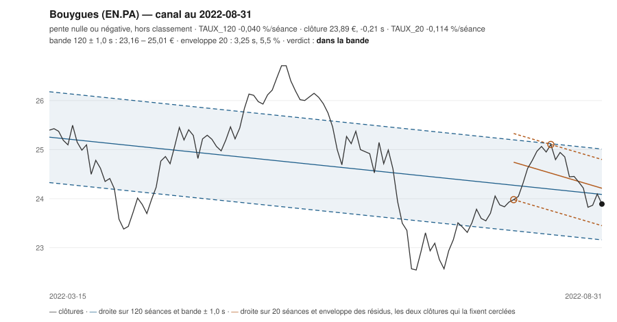

> Hors classement · TAUX_120 -0,040 %/séance · clôture 23,89 € · bande 23,16 – 25,01 € · écart -0,21 s · TAUX_20 -0,114 %/séance · enveloppe 20 : 3,25 s, 5,5 % · **dans la bande**

- Clôture 23,89 €, à −0,21 s, dans la bande de 23,16 à 25,01 € depuis 28 séances ; sur 20 séances l'écart est resté entre −0,37 s et +0,78 s.
- Pente longue −0,040 %/séance, pente courte −0,114 %/séance depuis 2 séances : même signe.
- Enveloppe de 3,25 s (5,5 % du niveau moyen) ; résidu bas à la 1re séance (2022-08-04), résidu haut le 2022-08-16.
- Verdict : dans la bande.

### `ACA.PA` — Crédit Agricole

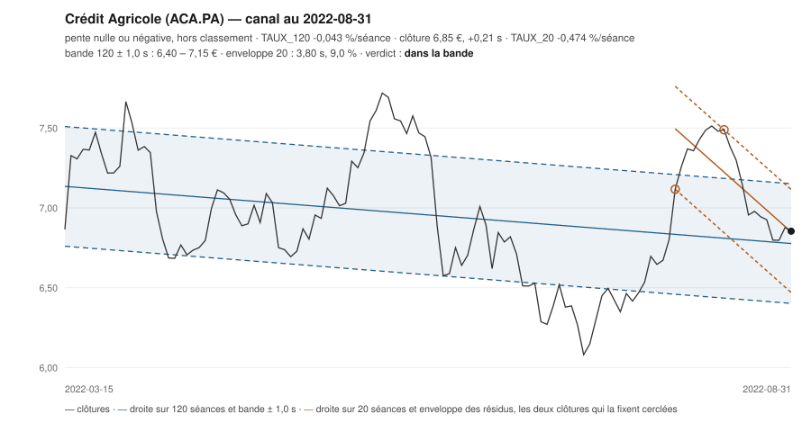

> Hors classement · TAUX_120 -0,043 %/séance · clôture 6,85 € · bande 6,40 – 7,15 € · écart +0,21 s · TAUX_20 -0,474 %/séance · enveloppe 20 : 3,80 s, 9,0 % · **dans la bande**

- Clôture 6,85 €, à +0,21 s, dans la bande de 6,40 à 7,15 €, revenue par le haut le 2022-08-19 ; 11 des 20 dernières séances avaient clos au-dessus du bord haut, jusqu'à +2,15 s le 2022-08-12.
- Pente longue −0,043 %/séance, hors classement ; pente courte −0,474 %/séance, négative depuis 3 séances : les deux descendent.
- Enveloppe de 3,80 s (9,0 % du niveau moyen), proche des ~3,7 s ; le résidu bas est la plus ancienne clôture de la fenêtre (2022-08-04), le résidu haut celle du 2022-08-16.
- Verdict : dans la bande.

### `EL.PA` — EssilorLuxottica

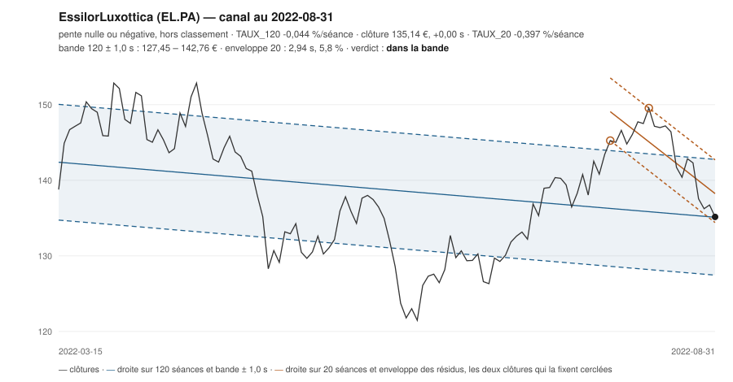

> Hors classement · TAUX_120 -0,044 %/séance · clôture 135,14 € · bande 127,45 – 142,76 € · écart +0,00 s · TAUX_20 -0,397 %/séance · enveloppe 20 : 2,94 s, 5,8 % · **dans la bande**

- Clôture 135,14 €, exactement sur la droite à 0,00 s, dans la bande de 127,45 à 142,76 €.
- Rentrée par le haut le 2022-08-22 ; 12 des 20 séances au-dessus du bord haut, au plus haut à +1,91 s le 2022-08-08.
- Pente longue −0,044 %/séance et pente courte −0,397 %/séance depuis 4 séances : concordance à la baisse.
- Enveloppe étroite, 2,94 s (5,8 % du niveau moyen) ; bornes anciennes, 2022-08-04 (bas) et 2022-08-15 (haut).
- Verdict : dans la bande.

### `SAN.PA` — Sanofi

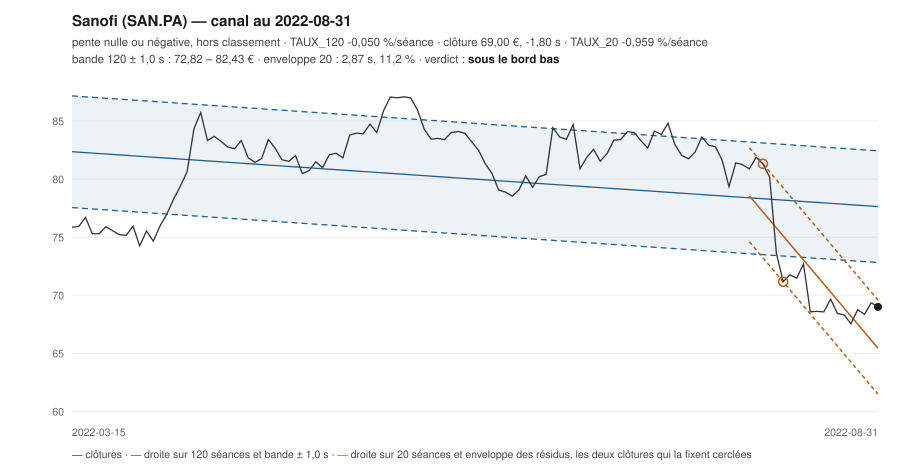

> Hors classement · TAUX_120 -0,050 %/séance · clôture 69,00 € · bande 72,82 – 82,43 € · écart -1,80 s · TAUX_20 -0,959 %/séance · enveloppe 20 : 2,87 s, 11,2 % · **sous le bord bas**

- Clôture 69,00 €, à −1,80 s, sous le bord bas de 72,82 € (bande 72,82 à 82,43 €).
- Sous le bord bas depuis 24 séances, depuis le 2022-07-29 : les 20 dernières clôtures y sont toutes, avec un creux à −3,91 s le 2022-08-11.
- Pente longue devenue négative, −0,050 %/séance, hors TOP 10 depuis 8 séances ; pente courte −0,959 %/séance, négative depuis 24 séances : concordance à la baisse.
- Enveloppe de 2,87 s (11,2 % du niveau moyen), sous les ~3,7 s ; bornes anciennes, 2022-08-08 (haut) et 2022-08-11 (bas).
- Verdict : sous le bord bas, non candidate — hors TOP 10 et pente courte négative.

### `CS.PA` — AXA

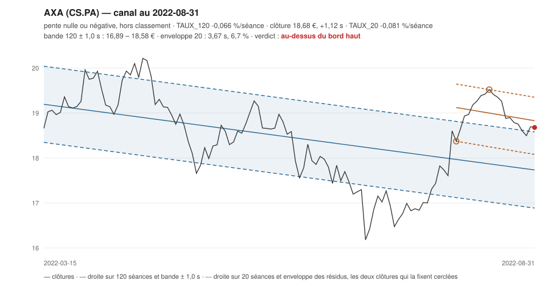

> Hors classement · TAUX_120 -0,066 %/séance · clôture 18,68 € · bande 16,89 – 18,58 € · écart +1,12 s · TAUX_20 -0,081 %/séance · enveloppe 20 : 3,67 s, 6,7 % · **au-dessus du bord haut**

- Clôture 18,68 €, à +1,12 s, au-dessus du bord haut de 18,58 € (bande 16,89 à 18,58 €) : la seule valeur de l'univers au-dessus du bord haut ce jour.
- 19 des 20 dernières séances ont clos au-dessus du bord haut, au plus haut à +1,94 s le 2022-08-16 ; seule exception, +0,91 s le 2022-08-29.
- Pente longue −0,066 %/séance, pente courte −0,081 %/séance depuis 2 séances : même signe, négatif.
- Enveloppe de 3,67 s (6,7 % du niveau moyen) ; résidu bas le 2022-08-04, résidu haut le 2022-08-16.
- Verdict : au-dessus du bord haut.

### `STMPA.PA` — STMicroelectronics

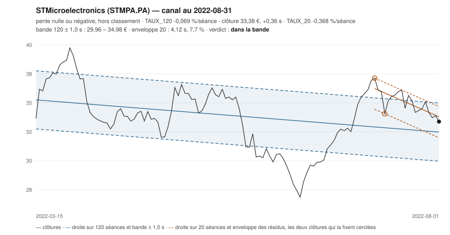

> Hors classement · TAUX_120 -0,069 %/séance · clôture 33,38 € · bande 29,96 – 34,98 € · écart +0,36 s · TAUX_20 -0,368 %/séance · enveloppe 20 : 4,12 s, 7,7 % · **dans la bande**

- Clôture 33,38 €, à +0,36 s, dans la bande de 29,96 à 34,98 €, rentrée le 2022-08-26 ; de +2,46 s au 2022-08-04 à l'écart du jour, le plus bas de la fenêtre.
- Pente longue −0,069 %/séance, pente courte −0,368 %/séance depuis 7 séances : les deux descendent.
- Enveloppe de 4,12 s (7,7 % du niveau moyen), au-dessus des ~3,7 s ; bornes anciennes, 2022-08-04 (haut) et 2022-08-09 (bas).
- Verdict : dans la bande.

### `DSY.PA` — Dassault Systèmes

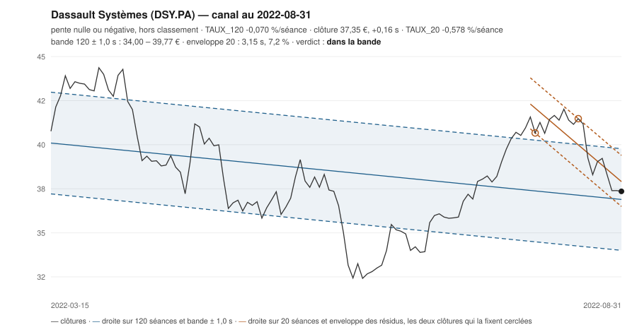

> Hors classement · TAUX_120 -0,070 %/séance · clôture 37,35 € · bande 34,00 – 39,77 € · écart +0,16 s · TAUX_20 -0,578 %/séance · enveloppe 20 : 3,15 s, 7,2 % · **dans la bande**

- Clôture 37,35 €, à +0,16 s, dans la bande de 34,00 à 39,77 €, écart le plus bas de la fenêtre.
- Parti de +2,51 s le 2022-08-04, l'écart est resté 12 séances au-dessus du bord haut avant de rentrer le 2022-08-22.
- Pente longue −0,070 %/séance, pente courte −0,578 %/séance depuis 6 séances : les deux descendent.
- Enveloppe de 3,15 s (7,2 % du niveau moyen) ; résidu bas le 2022-08-05, résidu haut le 2022-08-18.
- Verdict : dans la bande.

### `CAP.PA` — Capgemini

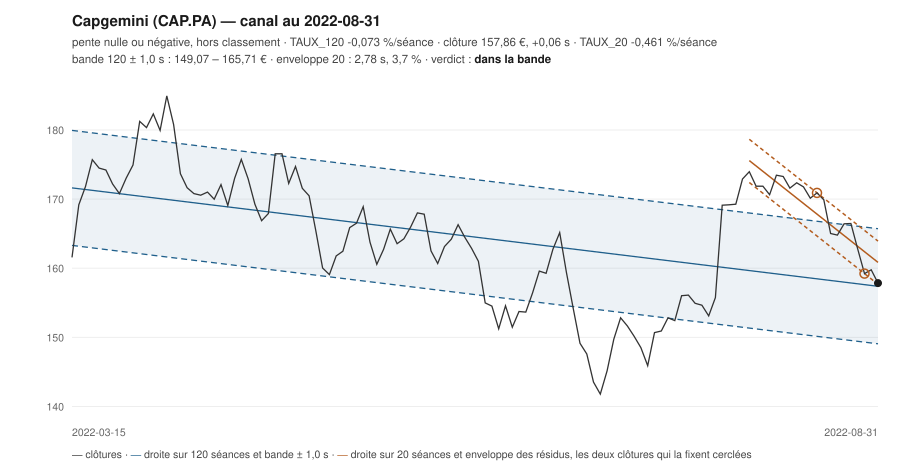

> Hors classement · TAUX_120 -0,073 %/séance · clôture 157,86 € · bande 149,07 – 165,71 € · écart +0,06 s · TAUX_20 -0,461 %/séance · enveloppe 20 : 2,78 s, 3,7 % · **dans la bande**

- Clôture 157,86 €, à +0,06 s, dans la bande de 149,07 à 165,71 €.
- Descente continue depuis le haut de la fenêtre : +2,34 s le 2022-08-04, 12 séances au-dessus du bord haut, retour dans la bande le 2022-08-22, et l'écart du jour est le plus bas des 20.
- Pente longue −0,073 %/séance et pente courte −0,461 %/séance depuis 5 séances : les deux baissent.
- Enveloppe de 2,78 s (3,7 % du niveau moyen), la plus étroite de l'univers en unités de s, bien sous les ~3,7 s ; bornes au 2022-08-18 (haut) et au 2022-08-29 (bas).
- Verdict : dans la bande.

### `AI.PA` — Air Liquide

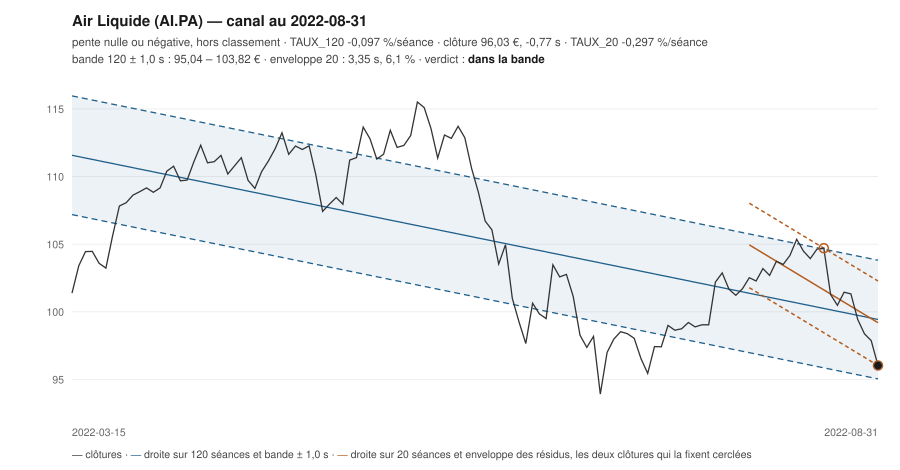

> Hors classement · TAUX_120 -0,097 %/séance · clôture 96,03 € · bande 95,04 – 103,82 € · écart -0,77 s · TAUX_20 -0,297 %/séance · enveloppe 20 : 3,35 s, 6,1 % · **dans la bande**

- Clôture 96,03 €, à −0,77 s, dans la bande de 95,04 à 103,82 € depuis 27 séances ; l'écart du jour est le plus bas des 20 séances, dont le plus haut était +0,55 s le 2022-08-15.
- Pente longue −0,097 %/séance et pente courte −0,297 %/séance, négative depuis 4 séances : concordance à la baisse.
- Enveloppe de 3,35 s (6,1 % du niveau moyen), sous les ~3,7 s ; la clôture du jour fixe le résidu bas, celle du 2022-08-19 le résidu haut.
- Verdict : dans la bande.

### `TEP.PA` — Teleperformance

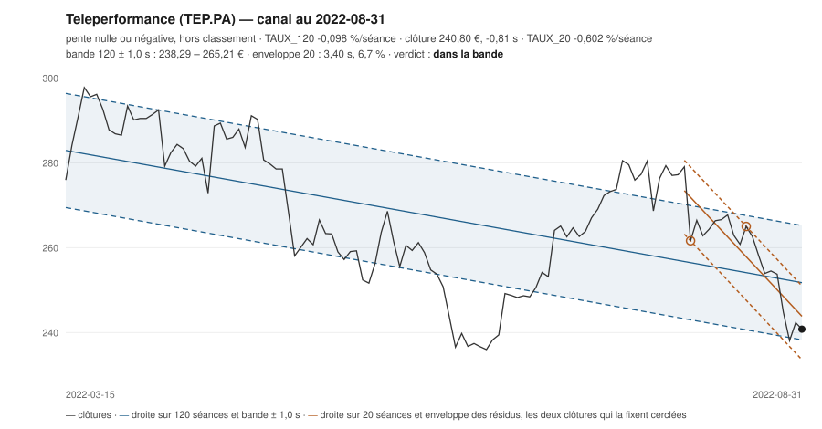

> Hors classement · TAUX_120 -0,098 %/séance · clôture 240,80 € · bande 238,29 – 265,21 € · écart -0,81 s · TAUX_20 -0,602 %/séance · enveloppe 20 : 3,40 s, 6,7 % · **dans la bande**

- Clôture 240,80 €, à −0,81 s, dans la bande de 238,29 à 265,21 €.
- Traversée de haut en bas : +1,48 s le 2022-08-04, une clôture sous le bord bas le 2022-08-29 (−1,14 s), retour dans la bande le 2022-08-30.
- Pente longue −0,098 %/séance ; pente courte −0,602 %/séance, négative depuis 17 séances : concordance.
- Enveloppe de 3,40 s (6,7 % du niveau moyen) ; bornes au 2022-08-05 (bas) et au 2022-08-18 (haut).
- Verdict : dans la bande.

### `LR.PA` — Legrand

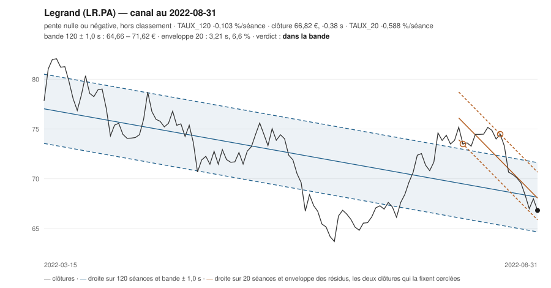

> Hors classement · TAUX_120 -0,103 %/séance · clôture 66,82 € · bande 64,66 – 71,62 € · écart -0,38 s · TAUX_20 -0,588 %/séance · enveloppe 20 : 3,21 s, 6,6 % · **dans la bande**

- Clôture 66,82 €, à −0,38 s, dans la bande de 64,66 à 71,62 €, rentrée par le haut le 2022-08-22.
- La fenêtre partait de +2,35 s ; 12 séances au-dessus du bord haut, puis un creux à −0,39 s le 2022-08-29.
- Pente longue −0,103 %/séance, pente courte −0,588 %/séance depuis 7 séances : concordance.
- Enveloppe de 3,21 s (6,6 % du niveau moyen) ; bornes au 2022-08-05 (bas) et au 2022-08-18 (haut).
- Verdict : dans la bande.

### `PUB.PA` — Publicis

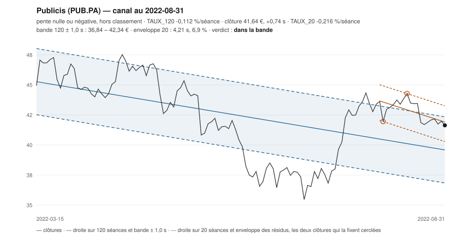

> Hors classement · TAUX_120 -0,112 %/séance · clôture 41,64 € · bande 36,84 – 42,34 € · écart +0,74 s · TAUX_20 -0,216 %/séance · enveloppe 20 : 4,21 s, 6,9 % · **dans la bande**

- Clôture 41,64 €, à +0,74 s, dans la bande de 36,84 à 42,34 €, rentrée par le haut le 2022-08-22 ; les 20 séances sont restées au-dessus de +0,73 s.
- Pente longue −0,112 %/séance, pente courte −0,216 %/séance depuis 7 séances : les deux négatives.
- Enveloppe de 4,21 s (6,9 % du niveau moyen), au-dessus des ~3,7 s ; bornes au 2022-08-05 (bas) et au 2022-08-16 (haut).
- Verdict : dans la bande.

### `ML.PA` — Michelin

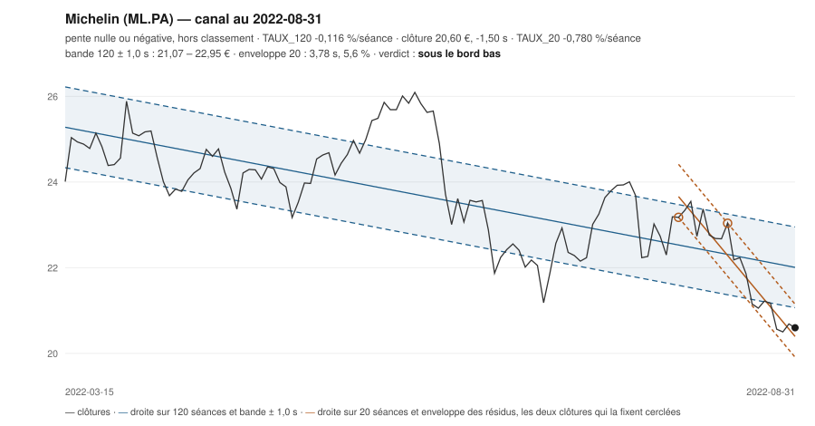

> Hors classement · TAUX_120 -0,116 %/séance · clôture 20,60 € · bande 21,07 – 22,95 € · écart -1,50 s · TAUX_20 -0,780 %/séance · enveloppe 20 : 3,78 s, 5,6 % · **sous le bord bas**

- Clôture 20,60 €, à −1,50 s, sous le bord bas de 21,07 € (bande 21,07 à 22,95 €) depuis 8 séances.
- Encore à +0,51 s le 2022-08-08, l'écart a atteint −1,84 s le 2022-08-26.
- Pente longue −0,116 %/séance, hors classement ; pente courte −0,780 %/séance, négative depuis 17 séances : les deux baissent.
- Enveloppe de 3,78 s (5,6 % du niveau moyen) ; résidu bas à la 1re séance (2022-08-04), résidu haut le 2022-08-16.
- Verdict : sous le bord bas, non candidate — hors TOP 10 et pente courte négative.

### `SU.PA` — Schneider Electric

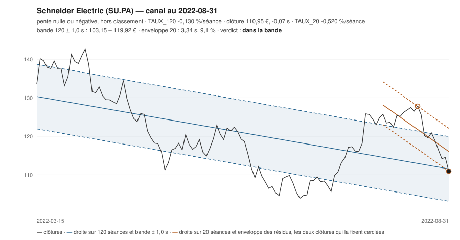

> Hors classement · TAUX_120 -0,130 %/séance · clôture 110,95 € · bande 103,15 – 119,92 € · écart -0,07 s · TAUX_20 -0,520 %/séance · enveloppe 20 : 3,34 s, 9,1 % · **dans la bande**

- Clôture 110,95 €, à −0,07 s, dans la bande de 103,15 à 119,92 €, rentrée par le haut le 2022-08-25 ; 13 séances au-dessus du bord haut dans la fenêtre.
- Pente longue −0,130 %/séance et pente courte −0,520 %/séance depuis 6 séances : concordance.
- Enveloppe de 3,34 s (9,1 % du niveau moyen) ; résidu haut le 2022-08-18, résidu bas à la clôture du jour.
- Verdict : dans la bande.

### `CA.PA` — Carrefour

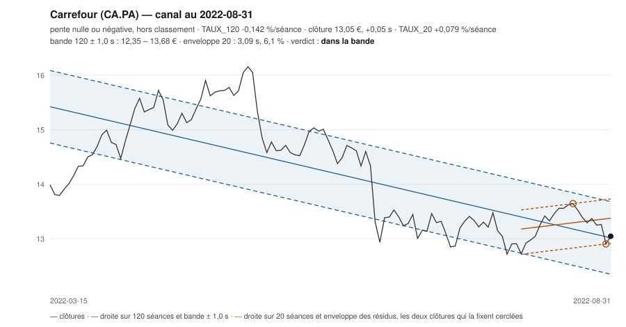

> Hors classement · TAUX_120 -0,142 %/séance · clôture 13,05 € · bande 12,35 – 13,68 € · écart +0,05 s · TAUX_20 +0,079 %/séance · enveloppe 20 : 3,09 s, 6,1 % · **dans la bande**

- Clôture 13,05 €, à +0,05 s, presque sur la droite, dans la bande de 12,35 à 13,68 € depuis 19 séances ; la fenêtre commençait sous le bord bas, à −1,21 s le 2022-08-04.
- Pente longue −0,142 %/séance, hors classement ; pente courte +0,079 %/séance, positive depuis 12 séances : désaccord.
- Enveloppe de 3,09 s (6,1 % du niveau moyen), sous les ~3,7 s ; résidu haut le 2022-08-19, résidu bas le 2022-08-30, avant-dernière séance.
- Verdict : dans la bande.

### `VIE.PA` — Veolia

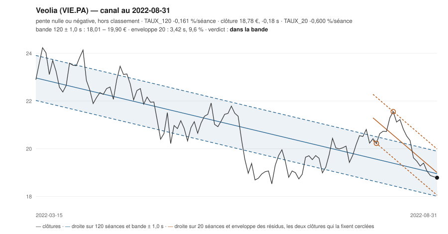

> Hors classement · TAUX_120 -0,161 %/séance · clôture 18,78 € · bande 18,01 – 19,90 € · écart -0,18 s · TAUX_20 -0,600 %/séance · enveloppe 20 : 3,42 s, 9,6 % · **dans la bande**

- Clôture 18,78 €, à −0,18 s, dans la bande de 18,01 à 19,90 €, rentrée par le haut le 2022-08-19 ; 11 séances au-dessus du bord haut dans la fenêtre, jusqu'à +2,30 s le 2022-08-12.
- Pente longue −0,161 %/séance, pente courte −0,600 %/séance depuis 6 séances : les deux sont négatives.
- Enveloppe de 3,42 s (9,6 % du niveau moyen) ; bornes anciennes, 2022-08-05 (bas) et 2022-08-12 (haut).
- Verdict : dans la bande.

### `ERF.PA` — Eurofins Scientific

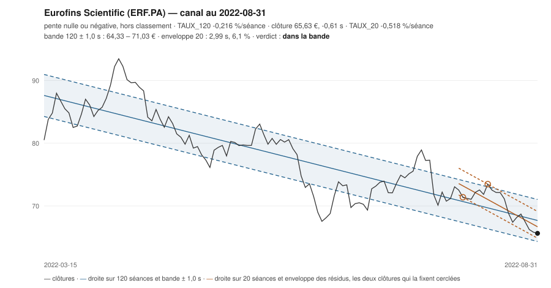

> Hors classement · TAUX_120 -0,216 %/séance · clôture 65,63 € · bande 64,33 – 71,03 € · écart -0,61 s · TAUX_20 -0,518 %/séance · enveloppe 20 : 2,99 s, 6,1 % · **dans la bande**

- Clôture 65,63 €, à −0,61 s, dans la bande de 64,33 à 71,03 € depuis 28 séances ; écart compris entre −0,65 s et +0,68 s sur la fenêtre.
- Pente longue −0,216 %/séance ; pente courte −0,518 %/séance, négative depuis 22 séances : concordance durable à la baisse.
- Enveloppe de 2,99 s (6,1 % du niveau moyen), sous les ~3,7 s ; bornes au 2022-08-05 (bas) et au 2022-08-15 (haut).
- Verdict : dans la bande.

### `VIV.PA` — Vivendi

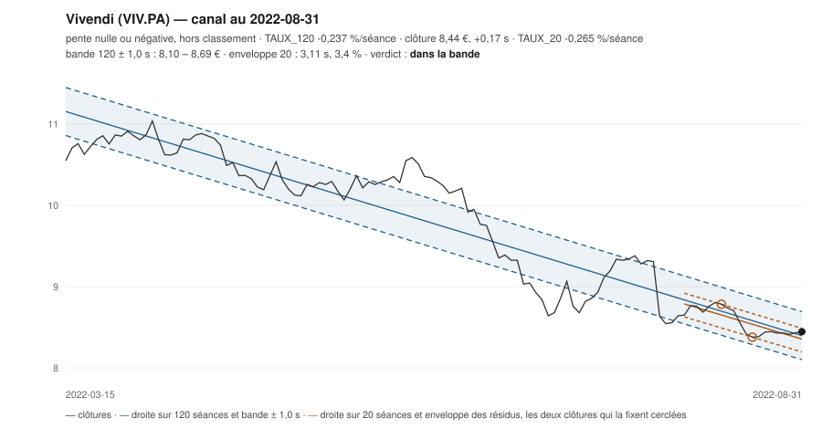

> Hors classement · TAUX_120 -0,237 %/séance · clôture 8,44 € · bande 8,10 – 8,69 € · écart +0,17 s · TAUX_20 -0,265 %/séance · enveloppe 20 : 3,11 s, 3,4 % · **dans la bande**

- Clôture 8,44 €, à +0,17 s, dans la bande de 8,10 à 8,69 € depuis 19 séances ; l'écart du jour est le plus haut de la fenêtre, qui partait de −1,10 s.
- Pente longue −0,237 %/séance ; pente courte −0,265 %/séance, négative depuis 21 séances : concordance.
- Enveloppe de 3,11 s (3,4 % du niveau moyen) ; résidu haut le 2022-08-12, résidu bas le 2022-08-19.
- Verdict : dans la bande.

### `MT.AS` — ArcelorMittal

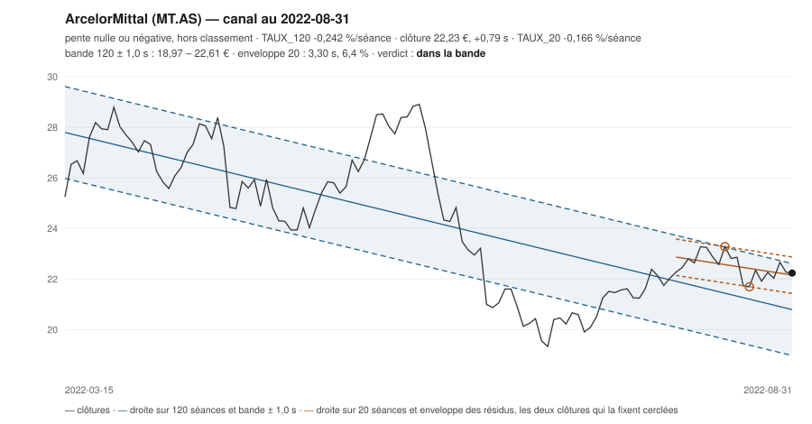

> Hors classement · TAUX_120 -0,242 %/séance · clôture 22,23 € · bande 18,97 – 22,61 € · écart +0,79 s · TAUX_20 -0,166 %/séance · enveloppe 20 : 3,30 s, 6,4 % · **dans la bande**

- Clôture 22,23 €, à +0,79 s, dans la bande de 18,97 à 22,61 € depuis 32 séances ; les 20 séances ont clos entre +0,20 s et +0,97 s, toutes dans la moitié haute.
- Pente longue −0,242 %/séance et pente courte −0,166 %/séance depuis 5 séances : concordance à la baisse.
- Enveloppe de 3,30 s (6,4 % du niveau moyen) ; résidu haut le 2022-08-16, résidu bas le 2022-08-22.
- Verdict : dans la bande.

### `SGO.PA` — Saint-Gobain

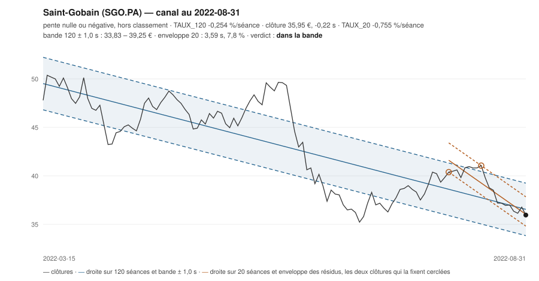

> Hors classement · TAUX_120 -0,254 %/séance · clôture 35,95 € · bande 33,83 – 39,25 € · écart -0,22 s · TAUX_20 -0,755 %/séance · enveloppe 20 : 3,59 s, 7,8 % · **dans la bande**

- Clôture 35,95 €, à −0,22 s, dans la bande de 33,83 à 39,25 € depuis 34 séances ; écart entre −0,26 s et +0,94 s sur la fenêtre.
- Pente longue −0,254 %/séance, la plus négative de l'univers ; pente courte −0,755 %/séance depuis 7 séances : concordance.
- Enveloppe de 3,59 s (7,8 % du niveau moyen) ; résidu bas le 2022-08-04, résidu haut le 2022-08-16.
- Verdict : dans la bande.

### Les figures des ordres du mois

#### 2022-08-03 — Achat `TTE.PA` TotalEnergies, décision au 2022-08-02

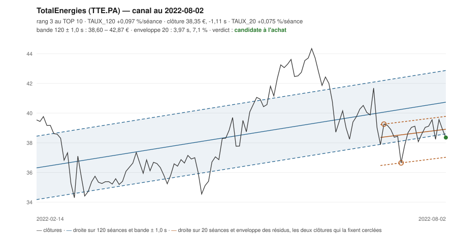

> Rang 3 · TAUX_120 +0,097 %/séance · clôture 38,35 € · bande 38,60 – 42,87 € · écart -1,11 s · TAUX_20 +0,075 %/séance · enveloppe 20 : 3,97 s, 7,1 % · **candidate à l'achat**

#### 2022-08-24 — Vente `TTE.PA` TotalEnergies, décision au 2022-08-23

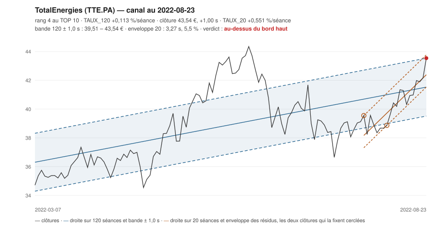

> Rang 4 · TAUX_120 +0,113 %/séance · clôture 43,54 € · bande 39,51 – 43,54 € · écart +1,00 s · TAUX_20 +0,551 %/séance · enveloppe 20 : 3,27 s, 5,5 % · **au-dessus du bord haut**

## 5. Le TOP 10 au 2022-08-31

| Rang | Valeur | TAUX_120 | Écart | TAUX_20 | Verdict |
|---|---|---|---|---|---|
| 1 | `RNO.PA` Renault | +0,217 %/séance | +0,09 s | -0,465 %/séance | dans la bande |
| 2 | `TTE.PA` TotalEnergies | +0,108 %/séance | -0,74 s | +0,431 %/séance | dans la bande |
| 3 | `ENGI.PA` Engie | +0,099 %/séance | -0,84 s | -0,096 %/séance | dans la bande |
| 4 | `RMS.PA` Hermès International | +0,083 %/séance | +0,39 s | -0,157 %/séance | dans la bande |
| 5 | `MC.PA` LVMH | +0,081 %/séance | -0,00 s | -0,221 %/séance | dans la bande |
| 6 | `ALO.PA` Alstom | +0,075 %/séance | -2,04 s | -1,073 %/séance | sous le bord bas |
| 7 | `WLN.PA` Worldline | +0,069 %/séance | +0,93 s | -0,224 %/séance | dans la bande |
| 8 | `HO.PA` Thales | +0,062 %/séance | -0,62 s | -0,039 %/séance | dans la bande |
| 9 | `BN.PA` Danone | +0,041 %/séance | -1,02 s | -0,132 %/séance | sous le bord bas |
| 10 | `SAF.PA` Safran | +0,029 %/séance | -0,15 s | -0,246 %/séance | dans la bande |

**Entrées et sorties du TOP 10 au fil du mois**

| Séance | Entrées | Sorties |
|---|---|---|
| 2022-08-03 | `ENGI.PA` | — |
| 2022-08-05 | `RNO.PA` | — |
| 2022-08-09 | `MC.PA` | — |
| 2022-08-12 | `DG.PA` | — |
| 2022-08-16 | `RMS.PA` | `ORA.PA` |
| 2022-08-19 | `WLN.PA` | `DG.PA` |
| 2022-08-22 | `STLAP.PA` | `SAN.PA` |
| 2022-08-30 | `SAF.PA` | `STLAP.PA` |

## 6. Les ordres exécutés

> À l'**ouverture** de la séance qui suit la décision, jamais à la clôture qui l'a déclenchée. L'écart d'ouverture est subi, et publié.

| Exécution | Sens | Valeur | Quantité | Prix | Brut | Frais | Écart d'ouverture | Motif |
|---|---|---|---|---|---|---|---|---|
| 2022-08-03 | **Achat** | `TTE.PA` TotalEnergies | 54 | 38,39 € | 2 073,08 € | 8,60 € | +0,09 % | décision au 2022-08-02 : clôture 38,35 € sous le bord bas 38,60 € (-1,11 s), rang 3, TAUX_120 +0,097 %/séance, TAUX_20 +0,075 %/séance |
| 2022-08-24 | **Vente** | `TTE.PA` TotalEnergies | 54 | 43,55 € | 2 351,94 € | 2,70 € | +0,04 % | décision au 2022-08-23 : clôture 43,54 € au-dessus du bord haut 43,54 € (+1,00 s) |

## 7. Les signaux non exécutés

| Décision | Valeur | Rang | Écart | TAUX_20 | Sort |
|---|---|---|---|---|---|
| 2022-08-17 | `ALO.PA` Alstom | 2 | -1,72 s | +0,368 %/séance | FAUTE DE CRENEAU |
| 2022-08-18 | `ALO.PA` Alstom | 2 | -1,74 s | +0,258 %/séance | FAUTE DE CRENEAU |
| 2022-08-19 | `ALO.PA` Alstom | 2 | -1,95 s | +0,119 %/séance | FAUTE DE CRENEAU |

## 8. La lecture du mois

Sur le mois, la meilleure contribution vient de `TTE.PA` (TotalEnergies) pour **+267,55 €**, la moins bonne de `SAN.PA` (Sanofi) pour **-290,24 €**. Les 2 ordres du mois ont coûté **11,31 €** de frais, soit 0,113 % de la dotation. Le portefeuille termine le mois **devant TR39** de 4,05 point. Sur 3 séances de décision, un candidat n'a pas pu être acheté faute de créneau.

---

[← Juillet](2022-07.md) · [Protocole](../README.md) · [Septembre →](2022-09.md)
