# Février 2022

> Journal de l'[expérience 6](../README.md) · exécutions du 2022-02-01 au 2022-02-28 · **4 ordres**
> Portefeuille au 2022-02-28 : **9 295,40 €** (base 92,95) · TR39 93,67 · alpha du mois **-2,26 pt** · depuis janvier **-0,71 pt**

---

## 1. Les actualités du mois précédent

**Janvier 2022.** Le mois de la bascule. Les rendements obligataires montent
brutalement, le dix ans américain passant de 1,5 % à plus de 1,8 %, et les
valeurs de croissance décrochent : le Nasdaq abandonne près de 9 %, sa pire
entrée en matière depuis 2008. En Europe, la rotation vers les banques et
l'énergie est nette, les bancaires françaises signant l'un des meilleurs mois
d'un secteur depuis des années.

Aux frontières de l'Ukraine, la concentration de troupes russes devient le
principal sujet des chancelleries. Le gaz européen, déjà tendu depuis l'automne,
s'installe sur des niveaux inconnus avant 2021.

## 2. L'exposition héritée au 2022-01-31

| Valeur | Achetée le | Prix d'achat | Cours | +/− value | Alpha depuis l'achat |
|---|---|---|---|---|---|
| `CAP.PA` Capgemini | 2022-01-10 | 180,43 € | 177,77 € | **-1,47 %** | +1,40 pt |
| `EL.PA` EssilorLuxottica | 2022-01-10 | 159,47 € | 148,52 € | **-6,87 %** | -3,99 pt |
| `RI.PA` Pernod Ricard | 2022-01-10 | 170,35 € | 157,75 € | **-7,40 %** | -4,52 pt |

## 3. Le portefeuille depuis le 2022-01-03

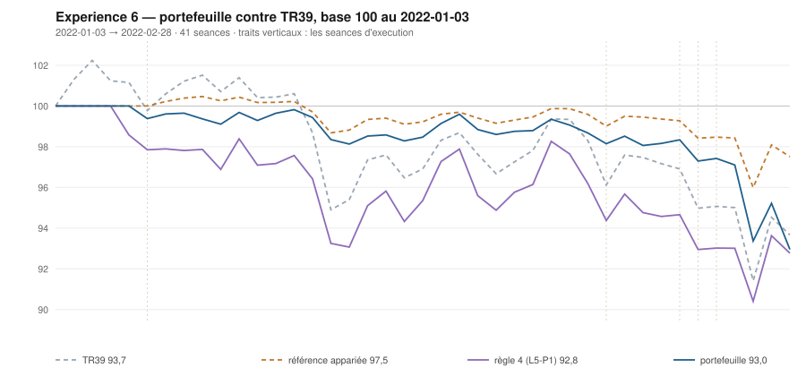

| | |
|---|---|
| Dotation initiale | 10 000,00 € au 2022-01-03 |
| Titres au 2022-02-28 | 5 927,19 € |
| Espèces | 3 368,21 € |
| Lignes détenues | 7 |
| **Total** | **9 295,40 €** |
| Base 100 | **92,95** |
| Référence à exposition appariée, même base | 97,51 |
| **Alpha officiel depuis janvier** | **-4,56 pt** |
| Règle de l'expérience 4 (`L5-P1`), même base | 92,77 |
| TR39, même base | 93,67 |
| Écart depuis janvier | **-0,71 pt** |

### Toutes les positions depuis le début de l'expérience

> Closes comme ouvertes. Aucune séance postérieure au 2022-02-28 n'entre dans ce tableau.

| Société | Prix d'achat | Date d'achat | Prix de vente | Date de vente |
|---|---|---|---|---|
| `CAP.PA` Capgemini | 180,43 € | 2022-01-10 |  |  |
| `EL.PA` EssilorLuxottica | 159,47 € | 2022-01-10 |  |  |
| `RI.PA` Pernod Ricard | 170,35 € | 2022-01-10 |  |  |
| `MC.PA` LVMH | 613,30 € | 2022-02-14 |  |  |
| `BNP.PA` BNP Paribas | 44,65 € | 2022-02-18 |  |  |
| `CS.PA` AXA | 20,20 € | 2022-02-21 |  |  |
| `GLE.PA` Société Générale | 24,40 € | 2022-02-22 |  |  |

*7 positions depuis le début, dont 7 encore ouvertes : les deux dernières colonnes restent vides.*

## 4. L'étude chartiste au 2022-02-28

> Une entrée par société de l'univers, sous la figure de canal lue à la clôture du 2022-02-28. La ligne en retrait est **calculée** ; la note qui suit est celle de l'agent `chartiste`, rédigée sans aucune séance postérieure.

### 1. `TTE.PA` — TotalEnergies

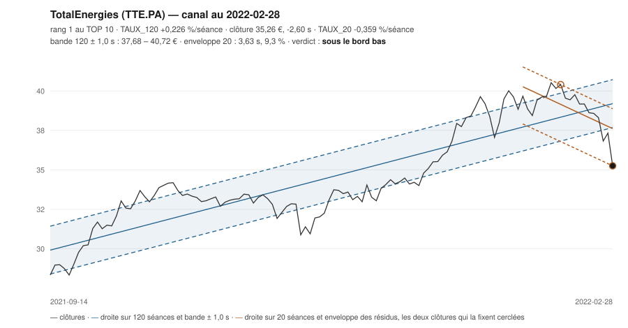

> Rang 1 · TAUX_120 +0,226 %/séance · clôture 35,26 € · bande 37,68 – 40,72 € · écart -2,60 s · TAUX_20 -0,359 %/séance · enveloppe 20 : 3,63 s, 9,3 % · **sous le bord bas**

- Clôture 35,26 € à −2,60 s, sous une bande 37,68 – 40,72 €.
- 1re pente longue de l'univers (0,226 %/séance) sur tout le mois ; pente courte négative (−0,359 %/séance) depuis le 22 février.
- Enveloppe de 3,63 s (9,3 %) ; bord bas sur la clôture du jour, bord haut au 11 février (40,41 €).
- Au-dessus du bord haut le 1er puis du 9 au 11 février, sous le bord bas depuis le 24 (3 séances) ; l'écart du jour est le plus bas des 20 séances.
- Verdict : sous le bord bas, non candidate — 1re du TOP 10, mais pente courte négative.

### 2. `GLE.PA` — Société Générale

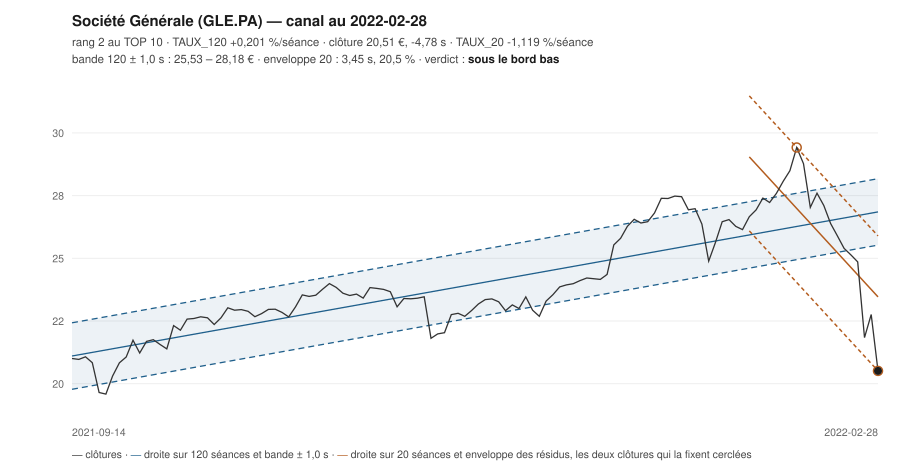

> Rang 2 · TAUX_120 +0,201 %/séance · clôture 20,51 € · bande 25,53 – 28,18 € · écart -4,78 s · TAUX_20 -1,119 %/séance · enveloppe 20 : 3,45 s, 20,5 % · **sous le bord bas**

- Clôture 20,51 € à −4,78 s, loin sous une bande 25,53 – 28,18 €.
- 2e pente longue (0,201 %/séance, TOP 10), pente courte négative (−1,119 %/séance) depuis le 22 février.
- Enveloppe de 3,45 s mais 20,5 % de la moyenne en niveau ; bord bas sur la clôture du jour, bord haut au 10 février (29,42 €).
- De +2,78 s le 10 février à −4,78 s ; sous le bord bas depuis le 18 (7 séances), candidate les 18 et 21 février.
- Verdict : sous le bord bas, non candidate — dans le TOP 10, mais pente courte négative.

### 3. `VIE.PA` — Veolia

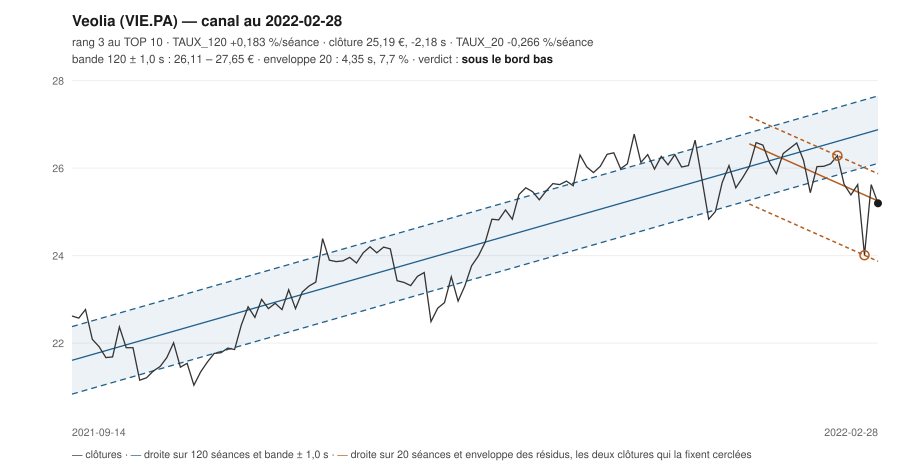

> Rang 3 · TAUX_120 +0,183 %/séance · clôture 25,19 € · bande 26,11 – 27,65 € · écart -2,18 s · TAUX_20 -0,266 %/séance · enveloppe 20 : 4,35 s, 7,7 % · **sous le bord bas**

- Clôture 25,19 € à −2,18 s, sous une bande 26,11 – 27,65 €.
- 3e pente longue (0,183 %/séance, TOP 10) et pente courte négative (−0,266 %/séance) depuis le 22 février.
- Enveloppe de 4,35 s (7,7 %), au-dessus de la référence, élargie par la clôture du 24 février (24,01 €) ; bord haut au 18 (26,28 €).
- Sous le bord bas le 14 février puis depuis le 21 (6 séances), à −3,77 s le 24 ; candidate les 14 et 21 février.
- Verdict : sous le bord bas, non candidate — dans le TOP 10, mais pente courte négative.

### 4. `ENGI.PA` — Engie

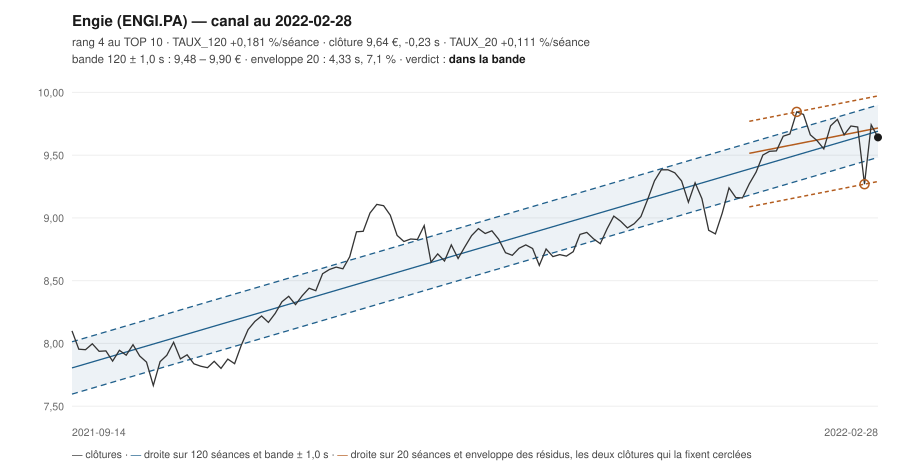

> Rang 4 · TAUX_120 +0,181 %/séance · clôture 9,64 € · bande 9,48 – 9,90 € · écart -0,23 s · TAUX_20 +0,111 %/séance · enveloppe 20 : 4,33 s, 7,1 % · **dans la bande**

- Clôture 9,64 € à −0,23 s, bande 9,48 – 9,90 €.
- 4e pente longue (0,181 %/séance, TOP 10), pente courte positive (0,111 %/séance) sur toutes les séances de février.
- Enveloppe de 4,33 s (7,1 %), au-dessus des ~3,7 s, tirée vers le bas par la clôture du 24 février (9,27 €) ; bord haut au 10 février (9,84 €).
- Une seule séance sous le bord bas, le 24 février à −1,81 s, où la valeur était candidate ; la clôture est revenue dans la bande dès le 25.
- Verdict : dans la bande.

### 5. `ORA.PA` — Orange

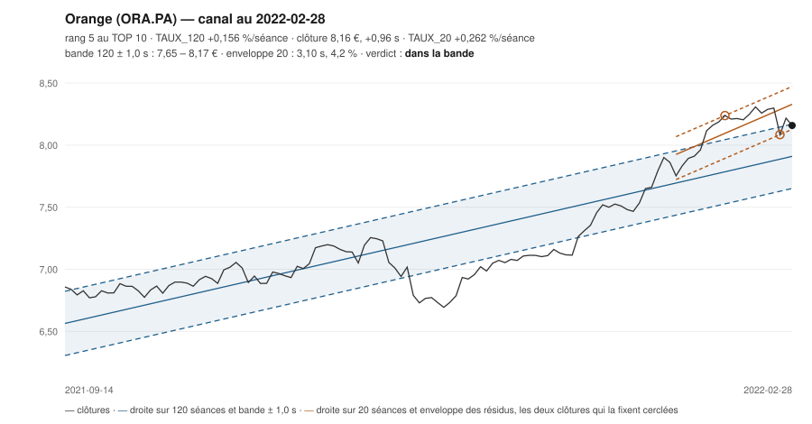

> Rang 5 · TAUX_120 +0,156 %/séance · clôture 8,16 € · bande 7,65 – 8,17 € · écart +0,96 s · TAUX_20 +0,262 %/séance · enveloppe 20 : 3,10 s, 4,2 % · **dans la bande**

- Clôture 8,16 € à +0,96 s, sous le bord haut de 8,17 € (bord bas 7,65 €).
- 5e pente longue (0,156 %/séance), entrée au TOP 10 le 14 février ; pente courte positive (0,262 %/séance) : concordance.
- Enveloppe de 3,10 s, 4,2 % de la moyenne, entre 8,24 € le 11 février et 8,08 € le 24.
- Au-dessus du bord haut du 10 janvier au 23 février puis le 25 ; dans la bande les 24 et 28 février.
- Verdict : dans la bande.

### 6. `CS.PA` — AXA

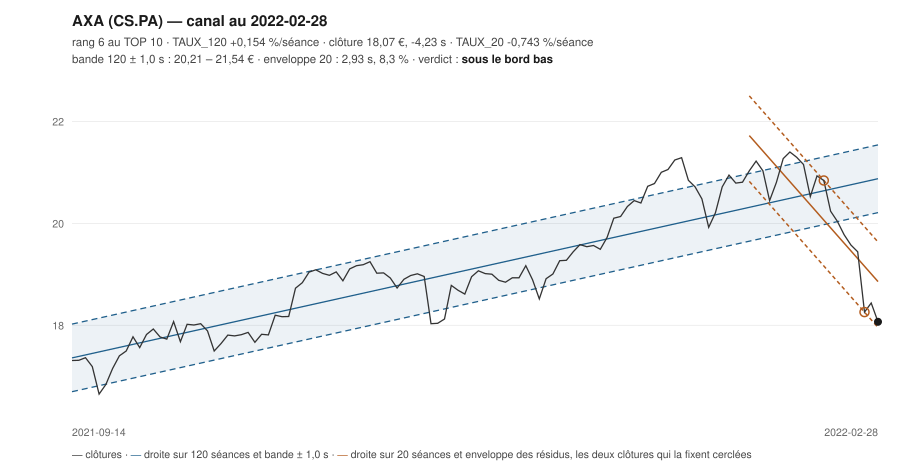

> Rang 6 · TAUX_120 +0,154 %/séance · clôture 18,07 € · bande 20,21 – 21,54 € · écart -4,23 s · TAUX_20 -0,743 %/séance · enveloppe 20 : 2,93 s, 8,3 % · **sous le bord bas**

- Clôture 18,07 € à −4,23 s, très loin du bord bas de 20,21 € (bord haut 21,54 €).
- 6e pente longue (0,154 %/séance, TOP 10), pente courte négative (−0,743 %/séance) depuis le 21 février.
- Enveloppe de 2,93 s (8,3 %), sous la référence, entre 20,84 € le 16 février et 18,26 € le 24.
- Au-dessus du bord haut les 1er et 2 puis les 8 et 9 février, sous le bord bas depuis le 17 (8 séances), jusqu'à −4,85 s le 24 ; candidate les 17 et 18 février.
- Verdict : sous le bord bas, non candidate — dans le TOP 10, mais pente courte négative.

### 7. `CA.PA` — Carrefour

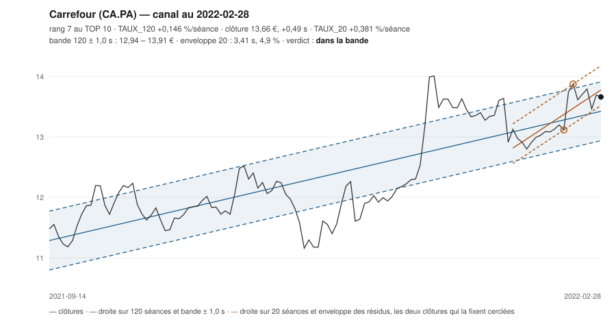

> Rang 7 · TAUX_120 +0,146 %/séance · clôture 13,66 € · bande 12,94 – 13,91 € · écart +0,49 s · TAUX_20 +0,381 %/séance · enveloppe 20 : 3,41 s, 4,9 % · **dans la bande**

- Clôture 13,66 € à +0,49 s, bande 12,94 – 13,91 €.
- 7e pente longue (0,146 %/séance), entrée au TOP 10 le 11 février ; pente courte positive (0,381 %/séance) : concordance.
- Enveloppe de 3,41 s (4,9 %), entre 13,12 € le 16 février et 13,88 € le 18, deux clôtures du milieu de fenêtre.
- Dans la bande tout le mois, hormis les 17 et 18 février au-dessus du bord haut.
- Verdict : dans la bande.

### 8. `BNP.PA` — BNP Paribas

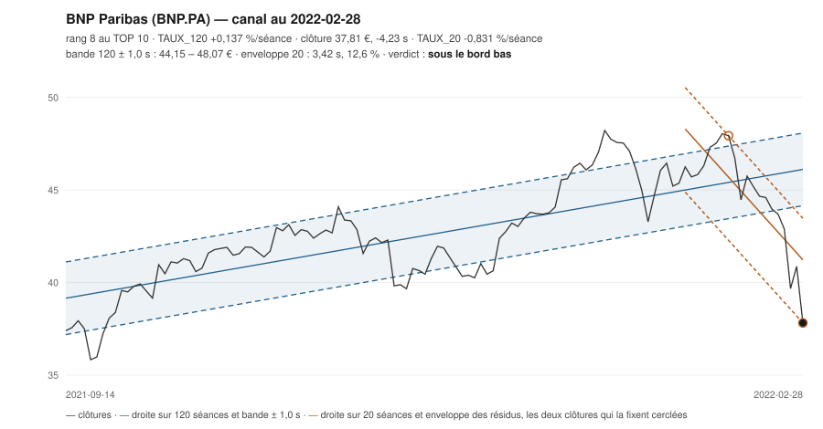

> Rang 8 · TAUX_120 +0,137 %/séance · clôture 37,81 € · bande 44,15 – 48,07 € · écart -4,23 s · TAUX_20 -0,831 %/séance · enveloppe 20 : 3,42 s, 12,6 % · **sous le bord bas**

- Clôture 37,81 € à −4,23 s ; le bord bas est à 44,15 €, le bord haut à 48,07 €.
- Pente longue de 0,137 %/séance, 8e et encore dans le TOP 10 (3e jusqu'au 11 février) ; pente courte négative (−0,831 %/séance) depuis le 21 février.
- Enveloppe de 3,42 s (12,6 %) ; bord bas fixé par la clôture du jour, bord haut par celle du 10 février (47,93 €).
- Au-dessus du bord haut le 9 février, sous le bord bas le 14 puis sans interruption depuis le 16 (9 séances) ; candidate les 14, 16, 17 et 18 février, avant le passage de la pente courte sous zéro.
- Verdict : sous le bord bas, non candidate — dans le TOP 10, mais pente courte négative.

### 9. `SAN.PA` — Sanofi

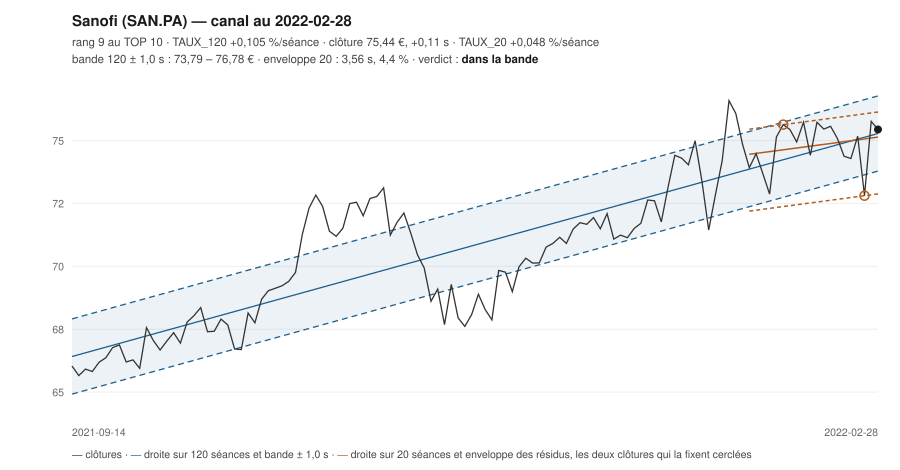

> Rang 9 · TAUX_120 +0,105 %/séance · clôture 75,44 € · bande 73,79 – 76,78 € · écart +0,11 s · TAUX_20 +0,048 %/séance · enveloppe 20 : 3,56 s, 4,4 % · **dans la bande**

- Clôture 75,44 € à +0,11 s, bande 73,79 – 76,78 €.
- Pente longue de 0,105 %/séance, 9e, entrée au TOP 10 le 23 février ; pente courte positive (0,048 %/séance).
- Enveloppe de 3,56 s (4,4 %), entre 75,63 € le 8 février et 72,81 € le 24.
- Sous le bord bas le seul 24 février (−1,55 s), séance où la pente courte était négative, donc sans candidature ; dans la bande depuis le 25.
- Verdict : dans la bande.

### 10. `DG.PA` — Vinci

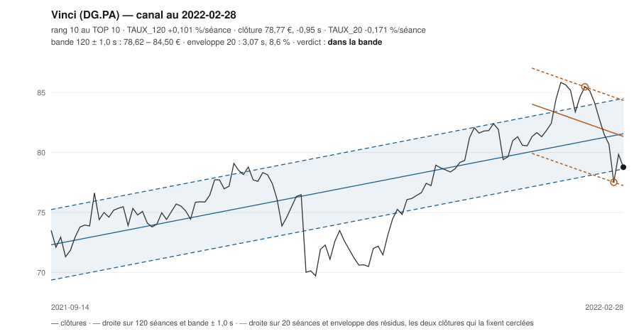

> Rang 10 · TAUX_120 +0,101 %/séance · clôture 78,77 € · bande 78,62 – 84,50 € · écart -0,95 s · TAUX_20 -0,171 %/séance · enveloppe 20 : 3,07 s, 8,6 % · **dans la bande**

- Clôture 78,77 € à −0,95 s, juste au-dessus du bord bas de 78,62 € (bord haut 84,50 €).
- Pente longue de 0,101 %/séance, entrée au TOP 10 ce 28 février (rang 10) ; pente courte négative (−0,171 %/séance).
- Enveloppe de 3,07 s (8,6 %), entre 85,47 € le 16 février et 77,52 € le 24.
- Au-dessus du bord haut du 1er au 18 février (+2,32 s le 9), la clôture a traversé la bande jusqu'à −1,37 s le 24, puis est remontée dans la bande le 25.
- Verdict : dans la bande.

### 11. `RNO.PA` — Renault

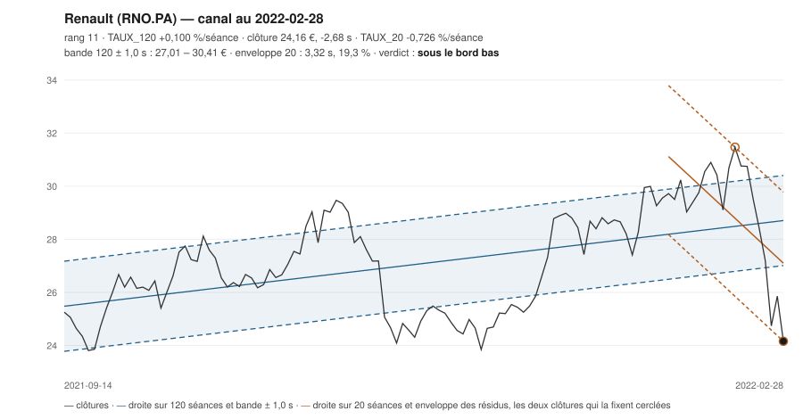

> Rang 11 · TAUX_120 +0,100 %/séance · clôture 24,16 € · bande 27,01 – 30,41 € · écart -2,68 s · TAUX_20 -0,726 %/séance · enveloppe 20 : 3,32 s, 19,3 % · **sous le bord bas**

- Clôture 24,16 € à −2,68 s, sous une bande 27,01 – 30,41 €.
- Pente longue de 0,100 %/séance, 11e, sortie du TOP 10 ce 28 février après avoir été 9e du 17 au 25 ; pente courte négative (−0,726 %/séance).
- Enveloppe de 3,32 s pour 19,3 % de la moyenne ; bord bas sur la clôture du jour, bord haut au 16 février (31,47 €).
- Au-dessus du bord haut le 18 février, sous le bord bas le 23 : la bande a été traversée en trois séances, et la clôture y reste dessous depuis 4 séances.
- Verdict : sous le bord bas, non candidate — hors TOP 10 (rang 11) et pente courte négative.

### 12. `ML.PA` — Michelin

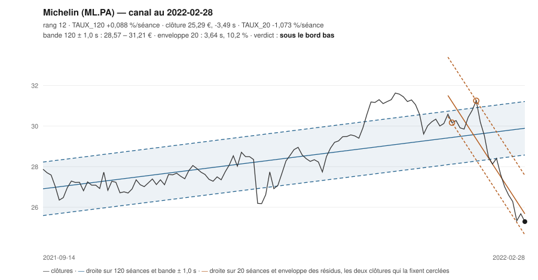

> Rang 12 · TAUX_120 +0,088 %/séance · clôture 25,29 € · bande 28,57 – 31,21 € · écart -3,49 s · TAUX_20 -1,073 %/séance · enveloppe 20 : 3,64 s, 10,2 % · **sous le bord bas**

- Clôture 25,29 € à −3,49 s ; la bande va de 28,57 à 31,21 €.
- Pente longue de 0,088 %/séance, 12e, dans le TOP 10 du 4 au 22 février ; pente courte négative (−1,073 %/séance) sur toutes les séances du mois.
- Enveloppe de 3,64 s (10,2 %), fixée par deux clôtures anciennes, 30,17 € le 2 février et 31,25 € le 10.
- Sous le bord bas depuis le 14 février (11 séances), jusqu'à −4,02 s le 24.
- Verdict : sous le bord bas, non candidate — hors TOP 10 (rang 12) et pente courte négative.

### 13. `MC.PA` — LVMH

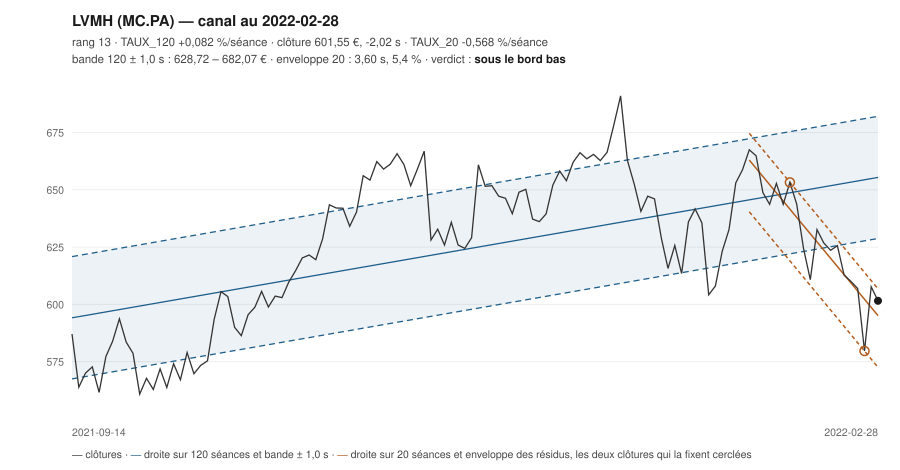

> Rang 13 · TAUX_120 +0,082 %/séance · clôture 601,55 € · bande 628,72 – 682,07 € · écart -2,02 s · TAUX_20 -0,568 %/séance · enveloppe 20 : 3,60 s, 5,4 % · **sous le bord bas**

- Clôture 601,55 € à −2,02 s, bande 628,72 – 682,07 €.
- Pente longue de 0,082 %/séance, 13e, sortie du TOP 10 le 16 février ; pente courte négative (−0,568 %/séance) depuis le 17.
- Enveloppe de 3,60 s (5,4 %), entre 653,23 € le 9 février et 579,67 € le 24.
- Sous le bord bas depuis le 10 février (13 séances), creux à −3,02 s le 24 ; candidate les 4, 8, 10, 11, 14 et 15 février.
- Verdict : sous le bord bas, non candidate — hors TOP 10 (rang 13) et pente courte négative.

### 14. `ACA.PA` — Crédit Agricole

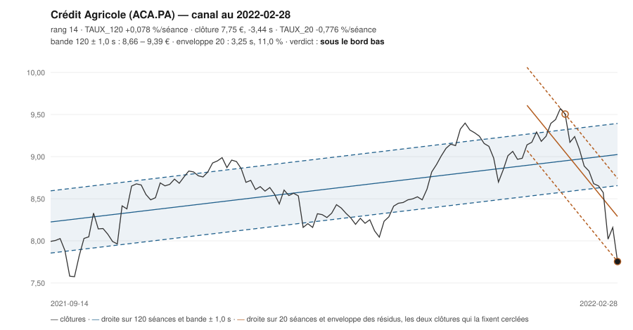

> Rang 14 · TAUX_120 +0,078 %/séance · clôture 7,75 € · bande 8,66 – 9,39 € · écart -3,44 s · TAUX_20 -0,776 %/séance · enveloppe 20 : 3,25 s, 11,0 % · **sous le bord bas**

- Clôture 7,75 € à −3,44 s, bien sous une bande 8,66 – 9,39 €.
- Pente longue positive (0,078 %/séance) mais 14e ; pente courte négative (−0,776 %/séance) depuis le 22 février.
- Enveloppe de 3,25 s (11,0 %), sous la référence ; la clôture du jour en fixe le bord bas, celle du 11 février (9,51 €) le bord haut.
- Au-dessus du bord haut du 8 au 11 février, puis sous le bord bas dès le 21, soit six séances plus tard ; l'écart du jour est le plus bas des 20 séances.
- Verdict : sous le bord bas, non candidate — hors TOP 10 (rang 14) et pente courte négative.

### 15. `PUB.PA` — Publicis

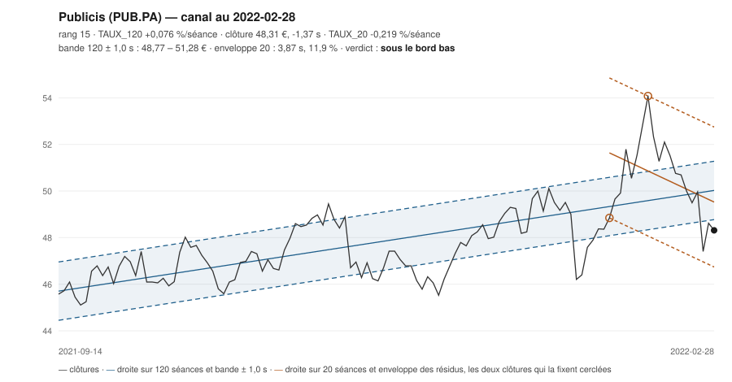

> Rang 15 · TAUX_120 +0,076 %/séance · clôture 48,31 € · bande 48,77 – 51,28 € · écart -1,37 s · TAUX_20 -0,219 %/séance · enveloppe 20 : 3,87 s, 11,9 % · **sous le bord bas**

- Clôture 48,31 € à −1,37 s, sous le bord bas de 48,77 € (bord haut 51,28 €).
- Pente longue de 0,076 %/séance (15e), pente courte négative (−0,219 %/séance) depuis le 25 février.
- Enveloppe de 3,87 s (11,9 %), fixée par deux clôtures du début de fenêtre, 48,85 € le 1er février et 54,08 € le 10.
- Au-dessus du bord haut du 3 au 16 février (+4,06 s le 10), sous le bord bas dès le 24, six séances plus tard ; dessous depuis 3 séances.
- Verdict : sous le bord bas, non candidate — hors TOP 10 (rang 15) et pente courte négative.

### 16. `MT.AS` — ArcelorMittal

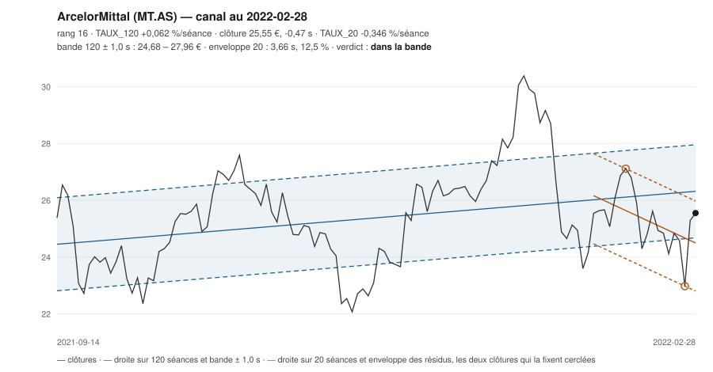

> Rang 16 · TAUX_120 +0,062 %/séance · clôture 25,55 € · bande 24,68 – 27,96 € · écart -0,47 s · TAUX_20 -0,346 %/séance · enveloppe 20 : 3,66 s, 12,5 % · **dans la bande**

- Clôture 25,55 € à −0,47 s, bande 24,68 – 27,96 €.
- Pente longue de 0,062 %/séance (16e), pente courte négative (−0,346 %/séance).
- Enveloppe de 3,66 s (12,5 %), entre 27,12 € le 9 février et 22,98 € le 24.
- Trois passages sous le bord bas en février (le 14, le 21, puis les 23 et 24), le plus profond à −2,02 s le 24 ; dans la bande depuis le 25.
- Verdict : dans la bande.

### 17. `AI.PA` — Air Liquide

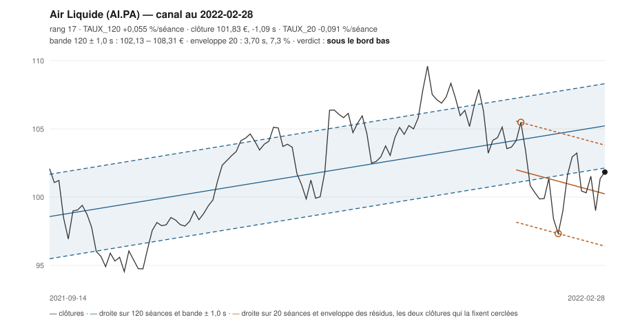

> Rang 17 · TAUX_120 +0,055 %/séance · clôture 101,83 € · bande 102,13 – 108,31 € · écart -1,09 s · TAUX_20 -0,091 %/séance · enveloppe 20 : 3,70 s, 7,3 % · **sous le bord bas**

- Clôture 101,83 € à −1,09 s, juste sous le bord bas de 102,13 € (bord haut 108,31 €).
- Pente longue de 0,055 %/séance (17e, hors TOP 10), pente courte négative (−0,091 %/séance) sur chacune des 20 dernières séances.
- Enveloppe de 3,70 s (7,3 %), au niveau exact de la référence ; bornes au 2 février (105,48 €) et au 14 (97,33 €).
- Sous le bord bas du 4 au 16 février (−2,53 s le 14), dans la bande les 17 et 18, dessous à nouveau depuis le 21 (6 séances).
- Verdict : sous le bord bas, non candidate — hors TOP 10 (rang 17) et pente courte négative.

### 18. `STMPA.PA` — STMicroelectronics

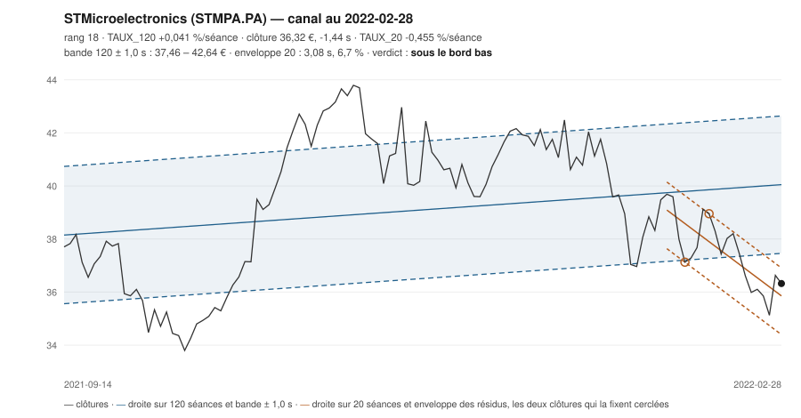

> Rang 18 · TAUX_120 +0,041 %/séance · clôture 36,32 € · bande 37,46 – 42,64 € · écart -1,44 s · TAUX_20 -0,455 %/séance · enveloppe 20 : 3,08 s, 6,7 % · **sous le bord bas**

- Clôture 36,32 € à −1,44 s, sous le bord bas de 37,46 € (bord haut 42,64 €).
- Pente longue de 0,041 %/séance, 18e, sortie du TOP 10 le 11 février ; pente courte négative (−0,455 %/séance) sur toutes les séances de février.
- Enveloppe de 3,08 s (6,7 %), bornée par deux clôtures anciennes, 37,12 € le 4 février et 38,95 € le 10.
- Sous le bord bas sans interruption depuis le 18 janvier.
- Verdict : sous le bord bas, non candidate — hors TOP 10 (rang 18) et pente courte négative.

### 19. `SU.PA` — Schneider Electric

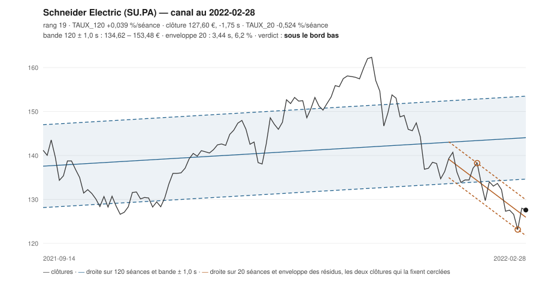

> Rang 19 · TAUX_120 +0,039 %/séance · clôture 127,60 € · bande 134,62 – 153,48 € · écart -1,75 s · TAUX_20 -0,524 %/séance · enveloppe 20 : 3,44 s, 6,2 % · **sous le bord bas**

- Clôture 127,60 € à −1,75 s ; bande 134,62 – 153,48 €.
- Pente longue de 0,039 %/séance (19e), pente courte négative (−0,524 %/séance) sur chaque séance du mois.
- Enveloppe de 3,44 s (6,2 %), entre 138,26 € le 10 février et 123,16 € le 24.
- Sous le bord bas sans interruption depuis le 21 janvier, avec un plus bas de −2,37 s le 24 février.
- Verdict : sous le bord bas, non candidate — hors TOP 10 (rang 19) et pente courte négative.

### 20. `KER.PA` — Kering

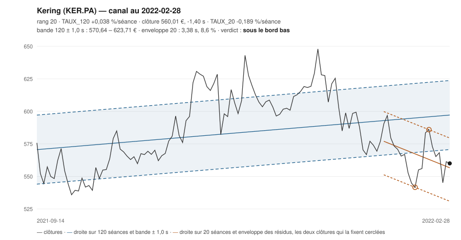

> Rang 20 · TAUX_120 +0,038 %/séance · clôture 560,01 € · bande 570,64 – 623,71 € · écart -1,40 s · TAUX_20 -0,189 %/séance · enveloppe 20 : 3,38 s, 8,6 % · **sous le bord bas**

- Clôture 560,01 € à −1,40 s, sous le bord bas de 570,64 € (bord haut 623,71 €).
- Pente longue de 0,038 %/séance (20e), pente courte négative (−0,189 %/séance) sur chacune des 20 séances.
- Enveloppe de 3,38 s (8,6 %), entre 541,64 € le 14 février et 585,94 € le 18.
- Sous le bord bas du 3 au 16 février (−2,26 s le 14), dans la bande les 17 et 18, dessous depuis le 21 (6 séances).
- Verdict : sous le bord bas, non candidate — hors TOP 10 (rang 20) et pente courte négative.

### 21. `VIV.PA` — Vivendi

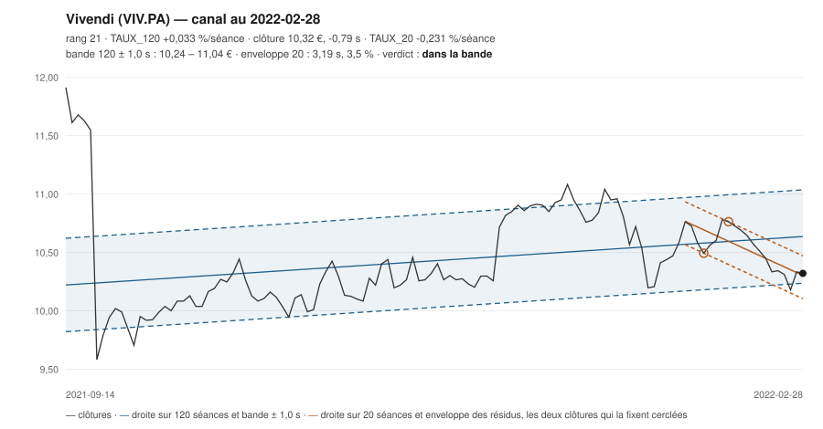

> Rang 21 · TAUX_120 +0,033 %/séance · clôture 10,32 € · bande 10,24 – 11,04 € · écart -0,79 s · TAUX_20 -0,231 %/séance · enveloppe 20 : 3,19 s, 3,5 % · **dans la bande**

- Clôture 10,32 € à −0,79 s, bande 10,24 – 11,04 €.
- Pente longue redevenue positive (0,033 %/séance, 21e), de retour au classement le 21 février ; pente courte négative (−0,231 %/séance).
- Enveloppe de 3,19 s (3,5 %), fixée par deux clôtures anciennes, 10,49 € le 4 février et 10,76 € le 10.
- Dans la bande sur les 21 dernières séances ; l'écart a glissé de +0,80 s le 1er février à −0,91 s le 24.
- Verdict : dans la bande.

### 22. `CAP.PA` — Capgemini

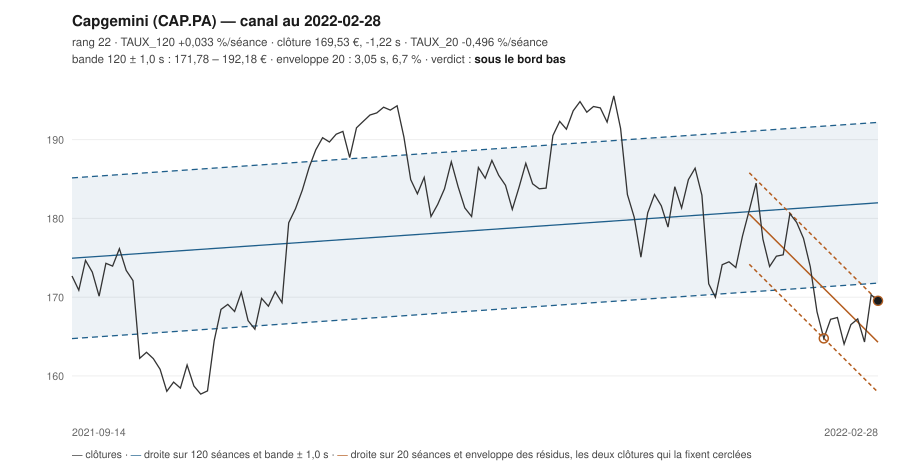

> Rang 22 · TAUX_120 +0,033 %/séance · clôture 169,53 € · bande 171,78 – 192,18 € · écart -1,22 s · TAUX_20 -0,496 %/séance · enveloppe 20 : 3,05 s, 6,7 % · **sous le bord bas**

- Clôture 169,53 € à −1,22 s, sous le bord bas de 171,78 € (bord haut 192,18 €).
- Pente longue affaiblie à 0,033 %/séance (22e, contre 12e le 1er février), pente courte négative sur 20 séances (−0,496 %/séance).
- Enveloppe de 3,05 s (6,7 %), sous la référence ; bord bas au 16 février (164,76 €), bord haut sur la clôture du jour.
- Sous le bord bas depuis le 11 février (12 séances), avec −2,30 s le 16.
- Verdict : sous le bord bas, non candidate — hors TOP 10 (rang 22) et pente courte négative.

### 23. `SGO.PA` — Saint-Gobain

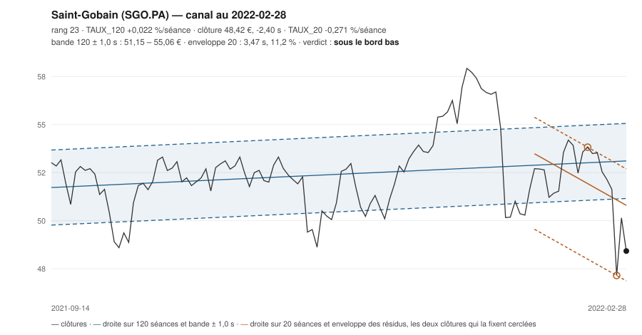

> Rang 23 · TAUX_120 +0,022 %/séance · clôture 48,42 € · bande 51,15 – 55,06 € · écart -2,40 s · TAUX_20 -0,271 %/séance · enveloppe 20 : 3,47 s, 11,2 % · **sous le bord bas**

- Clôture 48,42 € à −2,40 s, sous une bande 51,15 – 55,06 €.
- Pente longue faible (0,022 %/séance, 23e), pente courte négative (−0,271 %/séance).
- Enveloppe de 3,47 s (11,2 %), entre 53,82 € le 16 février et 47,15 € le 24.
- Dans la bande du 7 au 22 février, sous le bord bas depuis le 23 (4 séances), avec −3,25 s le 24.
- Verdict : sous le bord bas, non candidate — hors TOP 10 (rang 23) et pente courte négative.

### 24. `STLAP.PA` — Stellantis

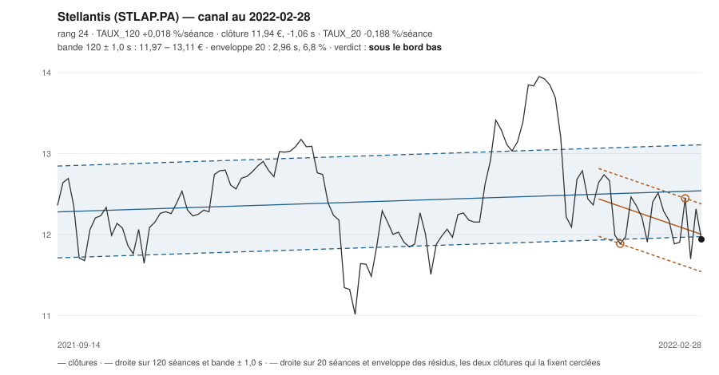

> Rang 24 · TAUX_120 +0,018 %/séance · clôture 11,94 € · bande 11,97 – 13,11 € · écart -1,06 s · TAUX_20 -0,188 %/séance · enveloppe 20 : 2,96 s, 6,8 % · **sous le bord bas**

- Clôture 11,94 € contre un bord bas de 11,97 € : −1,06 s (bord haut 13,11 €).
- Pente longue de 0,018 %/séance (24e), pente courte négative (−0,188 %/séance) sur les 20 séances.
- Enveloppe de 2,96 s (6,8 %), sous la référence, entre 11,89 € le 7 février et 12,45 € le 23.
- Cinquième passage sous le bord bas du mois ; aucun des précédents n'a duré plus de trois séances.
- Verdict : sous le bord bas, non candidate — hors TOP 10 (rang 24) et pente courte négative.

### 25. `RI.PA` — Pernod Ricard

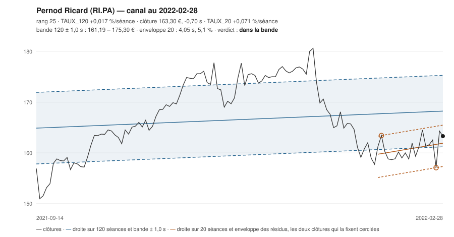

> Rang 25 · TAUX_120 +0,017 %/séance · clôture 163,30 € · bande 161,19 – 175,30 € · écart -0,70 s · TAUX_20 +0,071 %/séance · enveloppe 20 : 4,05 s, 5,1 % · **dans la bande**

- Clôture 163,30 € à −0,70 s, bande 161,19 – 175,30 €.
- Pente longue réduite à 0,017 %/séance (25e), sortie du TOP 10 le 4 février ; pente courte positive (0,071 %/séance) depuis le 18 février.
- Enveloppe de 4,05 s (5,1 %), entre 163,43 € le 2 février et 157,08 € le 24.
- Sous le bord bas du 6 janvier au 17 février, puis deux nouveaux passages dessous (21-22 et 24 février) ; dans la bande depuis le 25.
- Verdict : dans la bande.

### 26. `AIR.PA` — Airbus

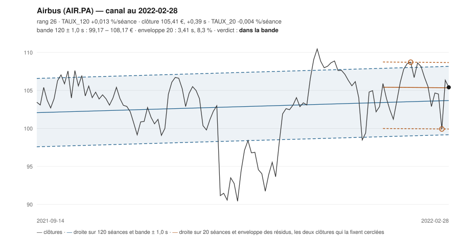

> Rang 26 · TAUX_120 +0,013 %/séance · clôture 105,41 € · bande 99,17 – 108,17 € · écart +0,39 s · TAUX_20 -0,004 %/séance · enveloppe 20 : 3,41 s, 8,3 % · **dans la bande**

- Clôture 105,41 € à +0,39 s, bande 99,17 – 108,17 €.
- Pente longue redevenue légèrement positive (0,013 %/séance, 26e) le 17 février ; pente courte quasi nulle et négative (−0,004 %/séance).
- Enveloppe de 3,41 s (8,3 %), entre 108,72 € le 11 février et 99,93 € le 24.
- Plusieurs passages au-dessus du bord haut (1er, 8 au 11, 15 et 16 février), puis 8 séances dans la bande, avec un minimum de −0,77 s le 24.
- Verdict : dans la bande.

### 27. `RMS.PA` — Hermès International

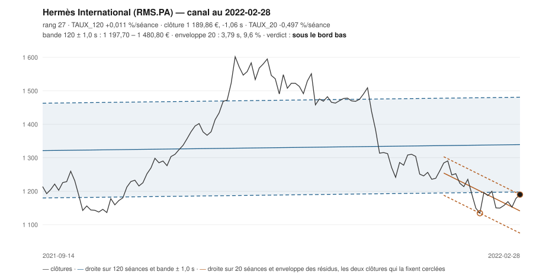

> Rang 27 · TAUX_120 +0,011 %/séance · clôture 1 189,86 € · bande 1 197,70 – 1 480,80 € · écart -1,06 s · TAUX_20 -0,497 %/séance · enveloppe 20 : 3,79 s, 9,6 % · **sous le bord bas**

- Clôture 1 189,86 € à −1,06 s, sous le bord bas de 1 197,70 € (bord haut 1 480,80 €).
- Pente longue tombée à 0,011 %/séance (27e), sortie du TOP 10 le 14 février ; pente courte négative (−0,497 %/séance) sur toutes les séances de février.
- Enveloppe de 3,79 s (9,6 %) ; bord bas au 14 février (1 134,33 €), bord haut sur la clôture du jour.
- Sous le bord bas sans interruption depuis le 7 janvier ; l'écart est remonté de −2,12 s le 14 à −1,06 s.
- Verdict : sous le bord bas, non candidate — hors TOP 10 (rang 27) et pente courte négative.

### 28. `HO.PA` — Thales

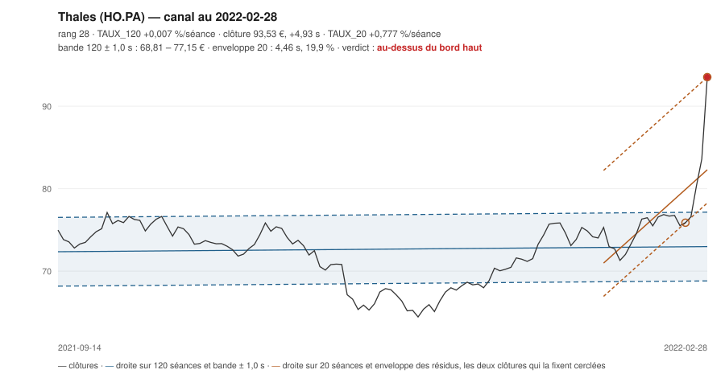

> Rang 28 · TAUX_120 +0,007 %/séance · clôture 93,53 € · bande 68,81 – 77,15 € · écart +4,93 s · TAUX_20 +0,777 %/séance · enveloppe 20 : 4,46 s, 19,9 % · **au-dessus du bord haut**

- Clôture 93,53 € à +4,93 s, très au-dessus du bord haut de 77,15 € (bord bas 68,81 €).
- Pente longue redevenue positive ce 28 février, à peine (0,007 %/séance, 28e) ; pente courte forte (0,777 %/séance).
- Enveloppe de 4,46 s pour 19,9 % de la moyenne ; son bord haut passe par la clôture du jour, son bord bas par celle du 22 février (75,88 €).
- Au-dessus du bord haut depuis le 8 février (15 séances), l'écart est passé de +2,38 s le 24 à +4,93 s deux séances plus tard.
- Verdict : au-dessus du bord haut.

### `EL.PA` — EssilorLuxottica

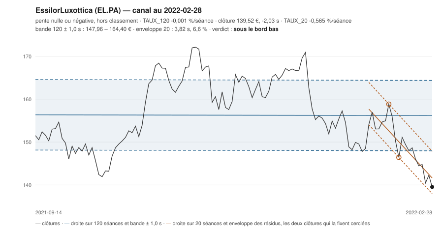

> Hors classement · TAUX_120 -0,001 %/séance · clôture 139,52 € · bande 147,96 – 164,40 € · écart -2,03 s · TAUX_20 -0,565 %/séance · enveloppe 20 : 3,82 s, 6,6 % · **sous le bord bas**

- Clôture 139,52 € à −2,03 s, sous une bande 147,96 – 164,40 €.
- Pente longue devenue tout juste négative (−0,001 %/séance), sortie du classement ce 28 février ; pente courte négative (−0,565 %/séance).
- Enveloppe de 3,82 s (6,6 %), entre 158,84 € le 9 février et 146,42 € le 14.
- Sous le bord bas depuis le 11 février (12 séances), après deux brèves remontées dans la bande, le 2 puis les 9 et 10 février.
- Verdict : sous le bord bas, non candidate — pente longue négative, donc hors TOP 10, et pente courte négative.

### `SAF.PA` — Safran

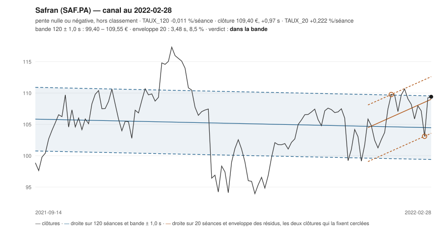

> Hors classement · TAUX_120 -0,011 %/séance · clôture 109,40 € · bande 99,40 – 109,55 € · écart +0,97 s · TAUX_20 +0,222 %/séance · enveloppe 20 : 3,48 s, 8,5 % · **dans la bande**

- Clôture 109,40 € à +0,97 s, sous le bord haut de 109,55 € (bord bas 99,40 €).
- Pente longue négative (−0,011 %/séance), hors classement depuis le 3 février ; pente courte positive (0,222 %/séance) : discordance.
- Enveloppe de 3,48 s (8,5 %), entre 109,77 € le 10 février et 103,11 € le 24.
- Au-dessus du bord haut les 10-11 et 15-16 février, dans la bande depuis le 17 (8 séances).
- Verdict : dans la bande.

### `OR.PA` — L'Oréal

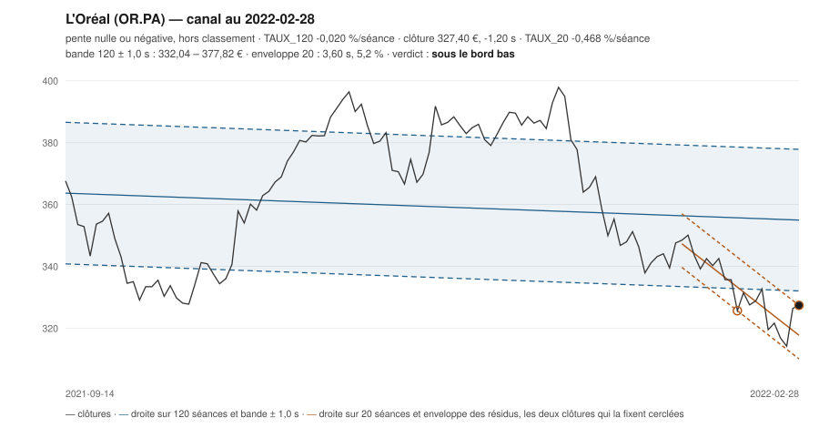

> Hors classement · TAUX_120 -0,020 %/séance · clôture 327,40 € · bande 332,04 – 377,82 € · écart -1,20 s · TAUX_20 -0,468 %/séance · enveloppe 20 : 3,60 s, 5,2 % · **sous le bord bas**

- Clôture 327,40 € à −1,20 s, sous le bord bas de 332,04 € (bord haut 377,82 €).
- Pente longue négative (−0,020 %/séance), hors classement depuis le 21 février ; pente courte négative (−0,468 %/séance).
- Enveloppe de 3,60 s (5,2 %) ; bord bas au 14 février (325,65 €), bord haut sur la clôture du jour.
- Sous le bord bas sans interruption depuis le 13 janvier ; l'écart est remonté de −1,99 s le 14 février à −1,20 s.
- Verdict : sous le bord bas, non candidate — pente longue négative, donc hors TOP 10, et pente courte négative.

### `LR.PA` — Legrand

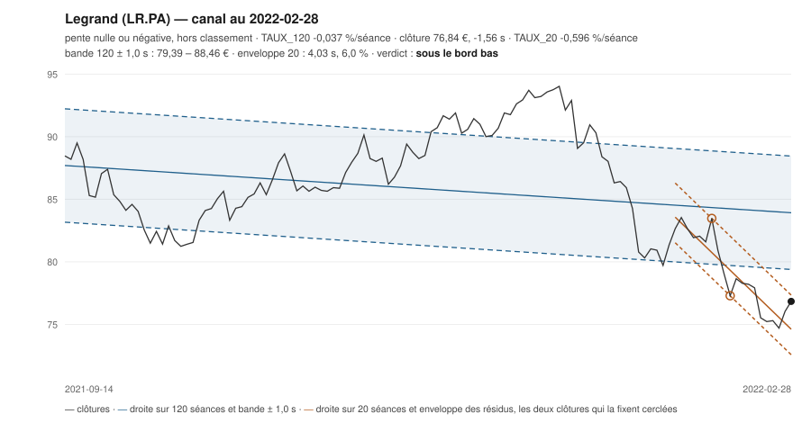

> Hors classement · TAUX_120 -0,037 %/séance · clôture 76,84 € · bande 79,39 – 88,46 € · écart -1,56 s · TAUX_20 -0,596 %/séance · enveloppe 20 : 4,03 s, 6,0 % · **sous le bord bas**

- Clôture 76,84 € à −1,56 s, sous une bande 79,39 – 88,46 €.
- Pente longue devenue négative (−0,037 %/séance), hors classement depuis le 15 février ; pente courte négative (−0,596 %/séance).
- Enveloppe de 4,03 s (6,0 %), au-dessus de la référence, entre 83,47 € le 9 février et 77,29 € le 14.
- Sous le bord bas sans interruption depuis le 18 janvier ; minimum de février à −2,54 s le 14.
- Verdict : sous le bord bas, non candidate — pente longue négative, donc hors TOP 10, et pente courte négative.

### `BN.PA` — Danone

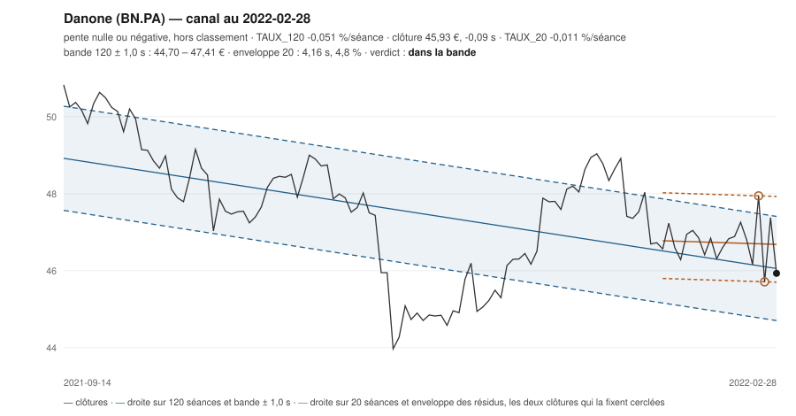

> Hors classement · TAUX_120 -0,051 %/séance · clôture 45,93 € · bande 44,70 – 47,41 € · écart -0,09 s · TAUX_20 -0,011 %/séance · enveloppe 20 : 4,16 s, 4,8 % · **dans la bande**

- Clôture 45,93 € à −0,09 s, au centre d'une bande 44,70 – 47,41 €.
- Deux pentes légèrement négatives, −0,051 %/séance sur 120 séances et −0,011 %/séance sur 20.
- Enveloppe de 4,16 s (4,8 %), au-dessus des ~3,7 s ; elle tient à deux séances consécutives, 47,94 € le 23 février et 45,71 € le 24.
- Dans la bande presque tout le mois, avec deux sorties d'une séance au-dessus du bord haut, les 2 et 23 février.
- Verdict : dans la bande.

### `TEP.PA` — Teleperformance

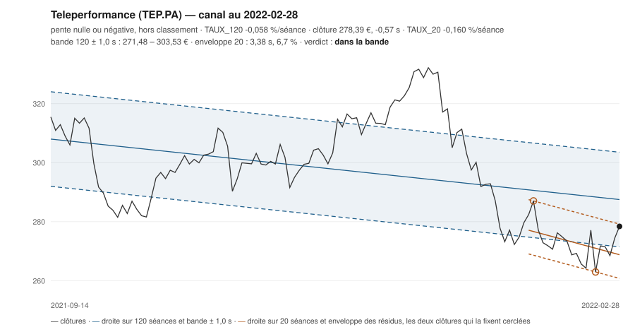

> Hors classement · TAUX_120 -0,058 %/séance · clôture 278,39 € · bande 271,48 – 303,53 € · écart -0,57 s · TAUX_20 -0,160 %/séance · enveloppe 20 : 3,38 s, 6,7 % · **dans la bande**

- Clôture 278,39 € à −0,57 s, bande 271,48 – 303,53 €.
- Pente longue négative (−0,058 %/séance) et pente courte négative (−0,160 %/séance) : concordance.
- Enveloppe de 3,38 s (6,7 %), entre 287,03 € le 2 février et 262,96 € le 21.
- Sous le bord bas du 18 janvier au 17 février, de nouveau du 21 au 24 février ; dans la bande depuis le 25.
- Verdict : dans la bande.

### `EN.PA` — Bouygues

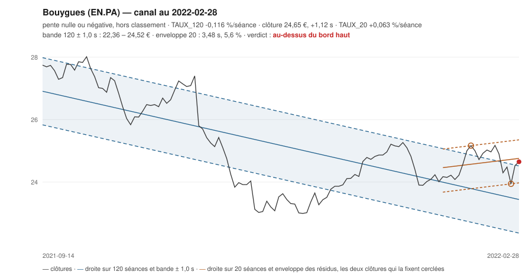

> Hors classement · TAUX_120 -0,116 %/séance · clôture 24,65 € · bande 22,36 – 24,52 € · écart +1,12 s · TAUX_20 +0,063 %/séance · enveloppe 20 : 3,48 s, 5,6 % · **au-dessus du bord haut**

- Clôture 24,65 € à +1,12 s, au-dessus du bord haut de 24,52 € (bord bas 22,36 €).
- Pente longue négative (−0,116 %/séance), pente courte positive (0,063 %/séance) : les fenêtres divergent.
- Enveloppe de 3,48 s (5,6 %), entre 25,17 € le 10 février et 23,94 € le 24.
- Au-dessus du bord haut sur la plupart des séances depuis le 7 février, avec des retours dans la bande les 22 et 24 ; dessus depuis le 25.
- Verdict : au-dessus du bord haut.

### `DSY.PA` — Dassault Systèmes

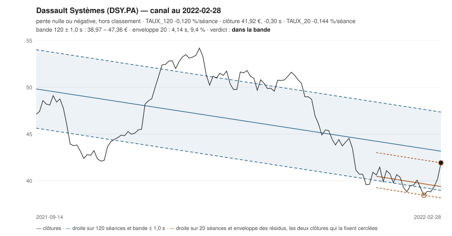

> Hors classement · TAUX_120 -0,120 %/séance · clôture 41,92 € · bande 38,97 – 47,36 € · écart -0,30 s · TAUX_20 -0,144 %/séance · enveloppe 20 : 4,14 s, 9,4 % · **dans la bande**

- Clôture 41,92 € à −0,30 s, bande 38,97 – 47,36 €.
- Pente longue négative (−0,120 %/séance), hors classement depuis le 2 février ; pente courte négative (−0,144 %/séance).
- Enveloppe de 4,14 s (9,4 %), au-dessus de la référence ; bord bas au 21 février (38,46 €), bord haut sur la clôture du jour.
- Sous le bord bas de début janvier au 23 février, la clôture est dans la bande depuis le 24, l'écart remontant de −1,40 s le 21 à −0,30 s.
- Verdict : dans la bande.

### `ALO.PA` — Alstom

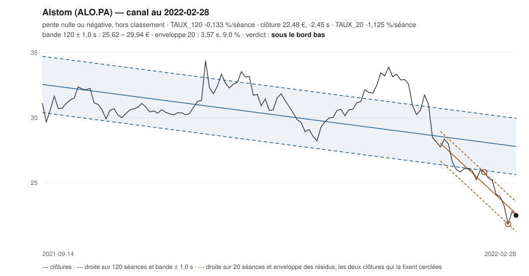

> Hors classement · TAUX_120 -0,133 %/séance · clôture 22,48 € · bande 25,62 – 29,94 € · écart -2,45 s · TAUX_20 -1,125 %/séance · enveloppe 20 : 3,57 s, 9,0 % · **sous le bord bas**

- Clôture 22,48 € à −2,45 s, sous une bande 25,62 – 29,94 €.
- Pente longue négative (−0,133 %/séance) et pente courte négative sur 20 séances (−1,125 %/séance) : la baisse se lit partout.
- Enveloppe de 3,57 s (9,0 %), entre 25,81 € le 16 février et 21,82 € le 24.
- Sous le bord bas sans interruption depuis le 28 janvier ; creux à −3,13 s le 24 février.
- Verdict : sous le bord bas, non candidate — pente longue négative, donc hors TOP 10, et pente courte négative.

### `ERF.PA` — Eurofins Scientific

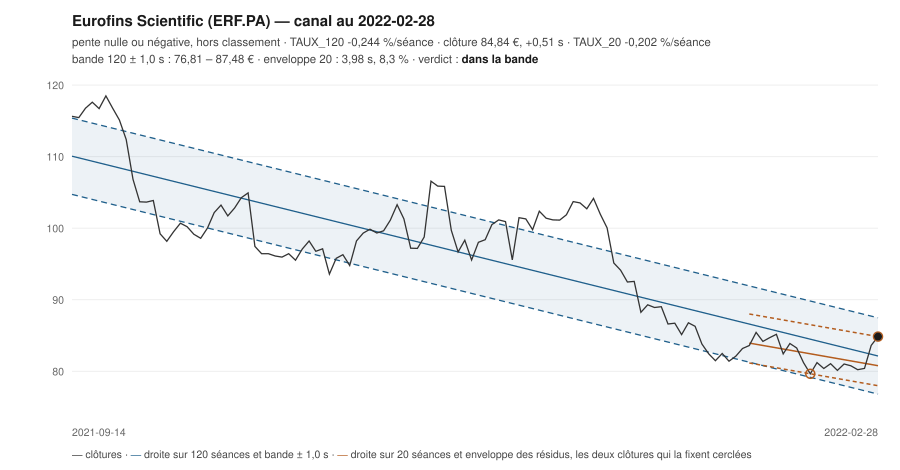

> Hors classement · TAUX_120 -0,244 %/séance · clôture 84,84 € · bande 76,81 – 87,48 € · écart +0,51 s · TAUX_20 -0,202 %/séance · enveloppe 20 : 3,98 s, 8,3 % · **dans la bande**

- Clôture 84,84 € à +0,51 s, bande 76,81 – 87,48 €.
- Pente longue négative (−0,244 %/séance), pente courte négative sur 20 séances (−0,202 %/séance).
- Enveloppe de 3,98 s (8,3 %), entre 79,65 € le 14 février et la clôture du jour qui en fixe le bord haut.
- Dans la bande sur les 21 dernières séances, l'écart passant de −0,90 s le 14 février à +0,51 s.
- Verdict : dans la bande.

### `WLN.PA` — Worldline

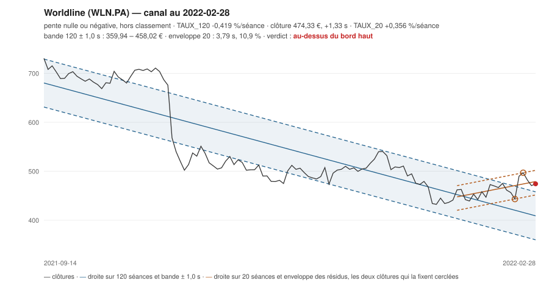

> Hors classement · TAUX_120 -0,419 %/séance · clôture 474,33 € · bande 359,94 – 458,02 € · écart +1,33 s · TAUX_20 +0,356 %/séance · enveloppe 20 : 3,79 s, 10,9 % · **au-dessus du bord haut**

- Clôture 474,33 € à +1,33 s, au-dessus du bord haut de 458,02 € (bord bas 359,94 €).
- Pente longue la plus négative de l'univers (−0,419 %/séance), pente courte positive (0,356 %/séance) depuis le 15 février : discordance franche.
- Enveloppe de 3,79 s (10,9 %), portée par deux clôtures récentes, 443,28 € le 21 février et 496,96 € le 23.
- La clôture a franchi le bord haut dans les deux sens à sept reprises en février ; dessus depuis le 22 (5 séances).
- Verdict : au-dessus du bord haut.

### Les figures des ordres du mois

#### 2022-02-14 — Achat `MC.PA` LVMH, décision au 2022-02-11

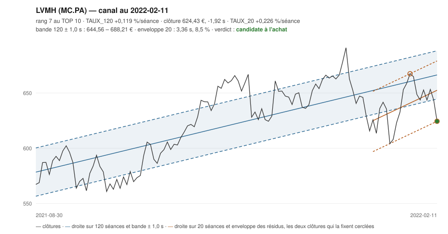

> Rang 7 · TAUX_120 +0,119 %/séance · clôture 624,43 € · bande 644,56 – 688,21 € · écart -1,92 s · TAUX_20 +0,226 %/séance · enveloppe 20 : 3,36 s, 8,5 % · **candidate à l'achat**

#### 2022-02-18 — Achat `BNP.PA` BNP Paribas, décision au 2022-02-17

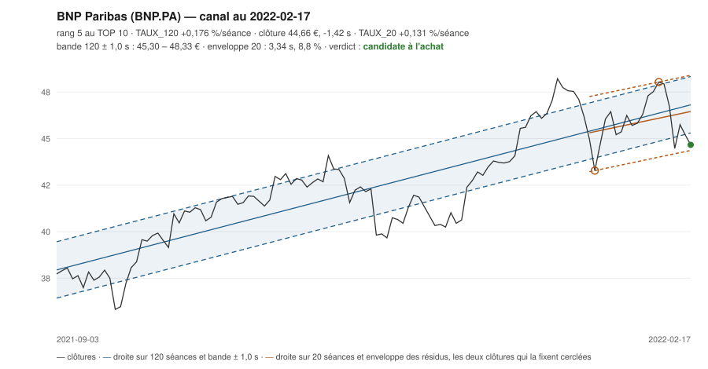

> Rang 5 · TAUX_120 +0,176 %/séance · clôture 44,66 € · bande 45,30 – 48,33 € · écart -1,42 s · TAUX_20 +0,131 %/séance · enveloppe 20 : 3,34 s, 8,8 % · **candidate à l'achat**

#### 2022-02-21 — Achat `CS.PA` AXA, décision au 2022-02-18

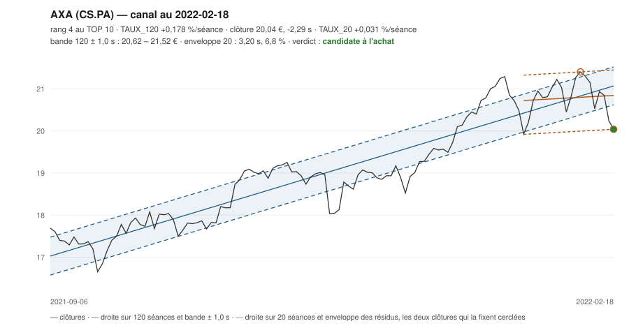

> Rang 4 · TAUX_120 +0,178 %/séance · clôture 20,04 € · bande 20,62 – 21,52 € · écart -2,29 s · TAUX_20 +0,031 %/séance · enveloppe 20 : 3,20 s, 6,8 % · **candidate à l'achat**

#### 2022-02-22 — Achat `GLE.PA` Société Générale, décision au 2022-02-21

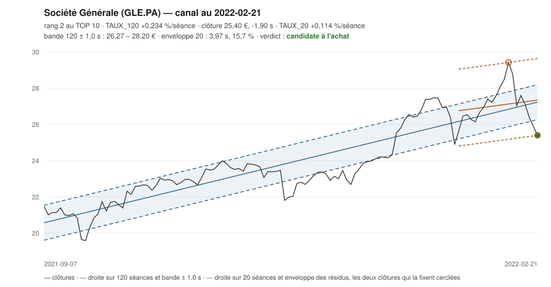

> Rang 2 · TAUX_120 +0,234 %/séance · clôture 25,40 € · bande 26,27 – 28,20 € · écart -1,90 s · TAUX_20 +0,114 %/séance · enveloppe 20 : 3,97 s, 15,7 % · **candidate à l'achat**

## 5. Le TOP 10 au 2022-02-28

| Rang | Valeur | TAUX_120 | Écart | TAUX_20 | Verdict |
|---|---|---|---|---|---|
| 1 | `TTE.PA` TotalEnergies | +0,226 %/séance | -2,60 s | -0,359 %/séance | sous le bord bas |
| 2 | `GLE.PA` Société Générale | +0,201 %/séance | -4,78 s | -1,119 %/séance | sous le bord bas |
| 3 | `VIE.PA` Veolia | +0,183 %/séance | -2,18 s | -0,266 %/séance | sous le bord bas |
| 4 | `ENGI.PA` Engie | +0,181 %/séance | -0,23 s | +0,111 %/séance | dans la bande |
| 5 | `ORA.PA` Orange | +0,156 %/séance | +0,96 s | +0,262 %/séance | dans la bande |
| 6 | `CS.PA` AXA | +0,154 %/séance | -4,23 s | -0,743 %/séance | sous le bord bas |
| 7 | `CA.PA` Carrefour | +0,146 %/séance | +0,49 s | +0,381 %/séance | dans la bande |
| 8 | `BNP.PA` BNP Paribas | +0,137 %/séance | -4,23 s | -0,831 %/séance | sous le bord bas |
| 9 | `SAN.PA` Sanofi | +0,105 %/séance | +0,11 s | +0,048 %/séance | dans la bande |
| 10 | `DG.PA` Vinci | +0,101 %/séance | -0,95 s | -0,171 %/séance | dans la bande |

**Entrées et sorties du TOP 10 au fil du mois**

| Séance | Entrées | Sorties |
|---|---|---|
| 2022-02-04 | `ML.PA` | `RI.PA` |
| 2022-02-11 | `CA.PA` | `STMPA.PA` |
| 2022-02-14 | `ORA.PA` | `RMS.PA` |
| 2022-02-16 | `RNO.PA` | `MC.PA` |
| 2022-02-23 | `SAN.PA` | `ML.PA` |
| 2022-02-28 | `DG.PA` | `RNO.PA` |

## 6. Les ordres exécutés

> À l'**ouverture** de la séance qui suit la décision, jamais à la clôture qui l'a déclenchée. L'écart d'ouverture est subi, et publié.

| Exécution | Sens | Valeur | Quantité | Prix | Brut | Frais | Écart d'ouverture | Motif |
|---|---|---|---|---|---|---|---|---|
| 2022-02-14 | **Achat** | `MC.PA` LVMH | 1 | 613,30 € | 613,30 € | 2,55 € | -1,78 % | décision au 2022-02-11 : clôture 624,43 € sous le bord bas 644,56 € (-1,92 s), rang 7, TAUX_120 +0,119 %/séance, TAUX_20 +0,226 %/séance |
| 2022-02-18 | **Achat** | `BNP.PA` BNP Paribas | 24 | 44,65 € | 1 071,50 € | 4,45 € | -0,03 % | décision au 2022-02-17 : clôture 44,66 € sous le bord bas 45,30 € (-1,42 s), rang 5, TAUX_120 +0,176 %/séance, TAUX_20 +0,131 %/séance |
| 2022-02-21 | **Achat** | `CS.PA` AXA | 55 | 20,20 € | 1 111,01 € | 4,61 € | +0,80 % | décision au 2022-02-18 : clôture 20,04 € sous le bord bas 20,62 € (-2,29 s), rang 4, TAUX_120 +0,178 %/séance, TAUX_20 +0,031 %/séance |
| 2022-02-22 | **Achat** | `GLE.PA` Société Générale | 45 | 24,40 € | 1 097,86 € | 4,56 € | -3,94 % | décision au 2022-02-21 : clôture 25,40 € sous le bord bas 26,27 € (-1,90 s), rang 2, TAUX_120 +0,234 %/séance, TAUX_20 +0,114 %/séance |

## 7. Les signaux non exécutés

*Aucun : chaque candidat du mois a été acheté.*

## 8. La lecture du mois

Sur le mois, la meilleure contribution vient de `RI.PA` (Pernod Ricard) pour **+27,75 €**, la moins bonne de `GLE.PA` (Société Générale) pour **-179,49 €**. Les 4 ordres du mois ont coûté **16,16 €** de frais, soit 0,162 % de la dotation. Le portefeuille termine le mois **derrière TR39** de 2,26 point.

---

[← Janvier](2022-01.md) · [Protocole](../README.md) · [Mars →](2022-03.md)
