# Mars 2022

> Journal de l'[expérience 6](../README.md) · exécutions du 2022-03-01 au 2022-03-31 · **4 ordres**
> Portefeuille au 2022-03-31 : **9 522,37 €** (base 95,22) · TR39 92,89 · alpha du mois **+3,27 pt** · depuis janvier **+2,33 pt**

---

## 1. Les actualités du mois précédent

**Février 2022.** L'invasion de l'Ukraine, le 24 février, coupe le mois en deux.
Les indices européens perdent en quelques séances ce qu'ils avaient mis des mois
à gagner ; le CAC 40 recule d'environ 5 % sur le mois après avoir touché
−10 % en séance. Les sanctions occidentales visent les banques russes, les
réserves de change et l'exclusion de plusieurs établissements de SWIFT.

Les matières premières s'envolent : le pétrole dépasse 100 dollars, le blé et le
nickel atteignent des sommets, le gaz européen double. Les valeurs exposées à la
Russie — énergie, automobile, banques — sont les plus frappées ; l'or et la
défense montent.

## 2. L'exposition héritée au 2022-02-28

| Valeur | Achetée le | Prix d'achat | Cours | +/− value | Alpha depuis l'achat |
|---|---|---|---|---|---|
| `CAP.PA` Capgemini | 2022-01-10 | 180,43 € | 169,53 € | **-6,04 %** | +0,08 pt |
| `EL.PA` EssilorLuxottica | 2022-01-10 | 159,47 € | 139,52 € | **-12,51 %** | -6,38 pt |
| `RI.PA` Pernod Ricard | 2022-01-10 | 170,35 € | 163,30 € | **-4,14 %** | +1,98 pt |
| `MC.PA` LVMH | 2022-02-14 | 613,30 € | 601,55 € | **-1,92 %** | +0,63 pt |
| `BNP.PA` BNP Paribas | 2022-02-18 | 44,65 € | 37,81 € | **-15,31 %** | -11,96 pt |
| `CS.PA` AXA | 2022-02-21 | 20,20 € | 18,07 € | **-10,54 %** | -9,16 pt |
| `GLE.PA` Société Générale | 2022-02-22 | 24,40 € | 20,51 € | **-15,93 %** | -14,46 pt |

## 3. Le portefeuille depuis le 2022-01-03

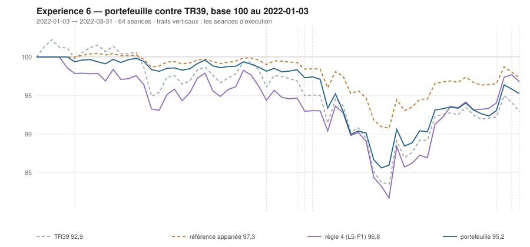

| | |
|---|---|
| Dotation initiale | 10 000,00 € au 2022-01-03 |
| Titres au 2022-03-31 | 4 608,26 € |
| Espèces | 4 914,11 € |
| Lignes détenues | 5 |
| **Total** | **9 522,37 €** |
| Base 100 | **95,22** |
| Référence à exposition appariée, même base | 97,31 |
| **Alpha officiel depuis janvier** | **-2,08 pt** |
| Règle de l'expérience 4 (`L5-P1`), même base | 96,77 |
| TR39, même base | 92,89 |
| Écart depuis janvier | **+2,33 pt** |

### Toutes les positions depuis le début de l'expérience

> Closes comme ouvertes. Aucune séance postérieure au 2022-03-31 n'entre dans ce tableau.

| Société | Prix d'achat | Date d'achat | Prix de vente | Date de vente |
|---|---|---|---|---|
| `CAP.PA` Capgemini | 180,43 € | 2022-01-10 | 181,51 € | 2022-03-30 |
| `EL.PA` EssilorLuxottica | 159,47 € | 2022-01-10 | 153,11 € | 2022-03-30 |
| `RI.PA` Pernod Ricard | 170,35 € | 2022-01-10 | 164,76 € | 2022-03-31 |
| `MC.PA` LVMH | 613,30 € | 2022-02-14 |  |  |
| `BNP.PA` BNP Paribas | 44,65 € | 2022-02-18 |  |  |
| `CS.PA` AXA | 20,20 € | 2022-02-21 |  |  |
| `GLE.PA` Société Générale | 24,40 € | 2022-02-22 |  |  |
| `VIE.PA` Veolia | 22,38 € | 2022-03-28 |  |  |

*8 positions depuis le début, dont 5 encore ouvertes : les deux dernières colonnes restent vides.*

## 4. L'étude chartiste au 2022-03-31

> Une entrée par société de l'univers, sous la figure de canal lue à la clôture du 2022-03-31. La ligne en retrait est **calculée** ; la note qui suit est celle de l'agent `chartiste`, rédigée sans aucune séance postérieure.

### 1. `HO.PA` — Thales

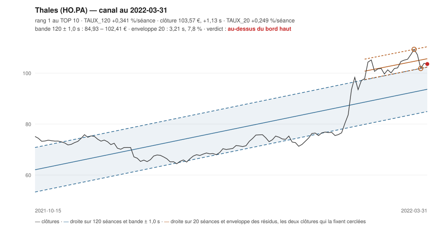

> Rang 1 · TAUX_120 +0,341 %/séance · clôture 103,57 € · bande 84,93 – 102,41 € · écart +1,13 s · TAUX_20 +0,249 %/séance · enveloppe 20 : 3,21 s, 7,8 % · **au-dessus du bord haut**

- Clôture 103,57 € à +1,13 s, au-dessus du bord haut de 102,41 € (bord bas 84,93 €).
- 1re pente longue de l'univers depuis le 15 mars (0,341 %/séance), pente courte positive (0,249 %/séance) : concordance.
- Enveloppe de 3,21 s (7,8 %), sous la référence, fixée par deux clôtures récentes, 109,34 € le 25 mars et 101,85 € le 29.
- Au-dessus du bord haut sans interruption depuis le 8 février ; l'écart est redescendu de +4,28 s le 7 mars à +1,13 s.
- Verdict : au-dessus du bord haut.

### 2. `CA.PA` — Carrefour

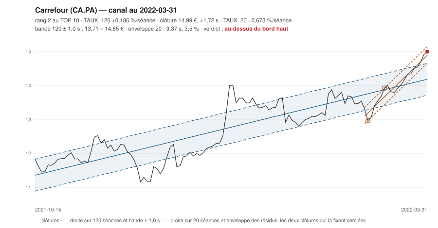

> Rang 2 · TAUX_120 +0,186 %/séance · clôture 14,99 € · bande 13,71 – 14,65 € · écart +1,72 s · TAUX_20 +0,673 %/séance · enveloppe 20 : 3,37 s, 3,5 % · **au-dessus du bord haut**

- Clôture 14,99 € à +1,72 s, au-dessus du bord haut de 14,65 € (bord bas 13,71 €).
- 2e pente longue (0,186 %/séance, TOP 10) et pente courte positive (0,673 %/séance) : concordance.
- Enveloppe de 3,37 s, 3,5 % seulement de la moyenne, bornée par deux clôtures anciennes, 12,96 € le 7 mars et 13,92 € le 14.
- Sous le bord bas le seul 7 mars (−1,09 s, candidate ce jour-là), puis montée presque continue de l'écart ; au-dessus du bord haut depuis le 25 (5 séances).
- Verdict : au-dessus du bord haut.

### 3. `ORA.PA` — Orange

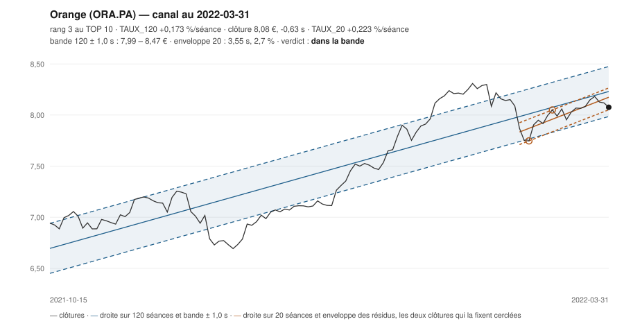

> Rang 3 · TAUX_120 +0,173 %/séance · clôture 8,08 € · bande 7,99 – 8,47 € · écart -0,63 s · TAUX_20 +0,223 %/séance · enveloppe 20 : 3,55 s, 2,7 % · **dans la bande**

- Clôture 8,08 € à −0,63 s, bande 7,99 – 8,47 €.
- 3e pente longue (0,173 %/séance, TOP 10), pente courte positive (0,223 %/séance) depuis le 25 mars.
- Enveloppe de 3,55 s pour 2,7 % de la moyenne, la plus étroite en niveau de l'univers à cette date, entre 7,75 € le 8 mars et 8,05 € le 15.
- Dans la bande sur les 21 dernières séances, sans franchir le bord bas, l'écart le plus bas étant −1,00 s arrondi le 8 mars.
- Verdict : dans la bande.

### 4. `TTE.PA` — TotalEnergies

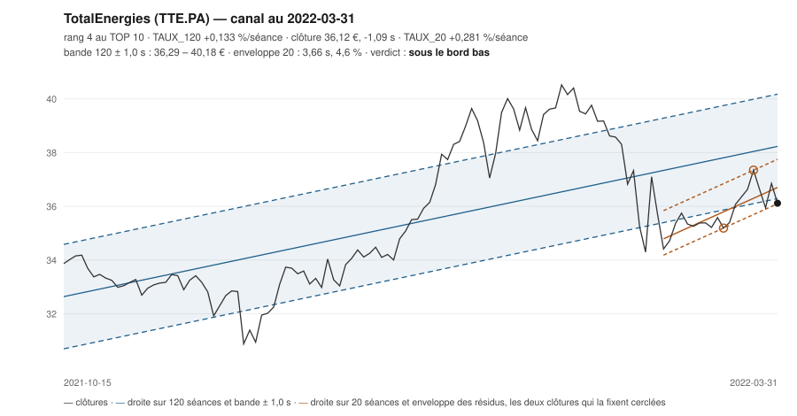

> Rang 4 · TAUX_120 +0,133 %/séance · clôture 36,12 € · bande 36,29 – 40,18 € · écart -1,09 s · TAUX_20 +0,281 %/séance · enveloppe 20 : 3,66 s, 4,6 % · **sous le bord bas**

- Clôture 36,12 € sous le bord bas de 36,29 €, à −1,09 s (bord haut 40,18 €).
- 4e pente longue (0,133 %/séance, TOP 10), 1re jusqu'au 11 mars ; pente courte positive (0,281 %/séance) depuis le 24 mars : les deux fenêtres montent.
- Enveloppe de 3,66 s (4,6 %), conforme à la référence, fixée par deux clôtures de la seconde moitié : 35,19 € le 18 mars et 37,35 € le 25.
- Sous le bord bas jusqu'au 22 mars (−2,71 s le 4), dans la bande du 23 au 28, puis sous le bord bas le 29 (déjà candidate), dans la bande le 30 et à nouveau dessous le 31.
- Verdict : sous le bord bas sans être candidate — rang 4 au TOP 10 et pente courte positive, mais la clôture de la veille, le 30 mars, était dans la bande : la persistance n'est pas remplie.

### 5. `SAN.PA` — Sanofi

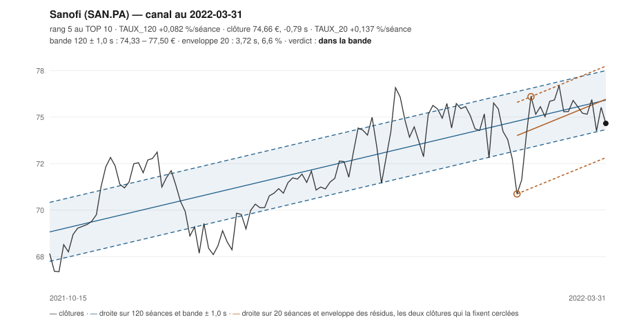

> Rang 5 · TAUX_120 +0,082 %/séance · clôture 74,66 € · bande 74,33 – 77,50 € · écart -0,79 s · TAUX_20 +0,137 %/séance · enveloppe 20 : 3,72 s, 6,6 % · **dans la bande**

- Clôture 74,66 € à −0,79 s, au-dessus du bord bas de 74,33 € (bord haut 77,50 €).
- 5e pente longue (0,082 %/séance, TOP 10), pente courte positive (0,137 %/séance) depuis le 16 mars : concordance.
- Enveloppe de 3,72 s (6,6 %), fixée par deux clôtures du début de fenêtre, 70,87 € le 4 mars et 76,10 € le 9.
- Sous le bord bas les 4 et 7 mars, puis le seul 29 mars (−1,03 s, candidate ce jour-là) ; dans la bande depuis le 30.
- Verdict : dans la bande.

### 6. `DG.PA` — Vinci

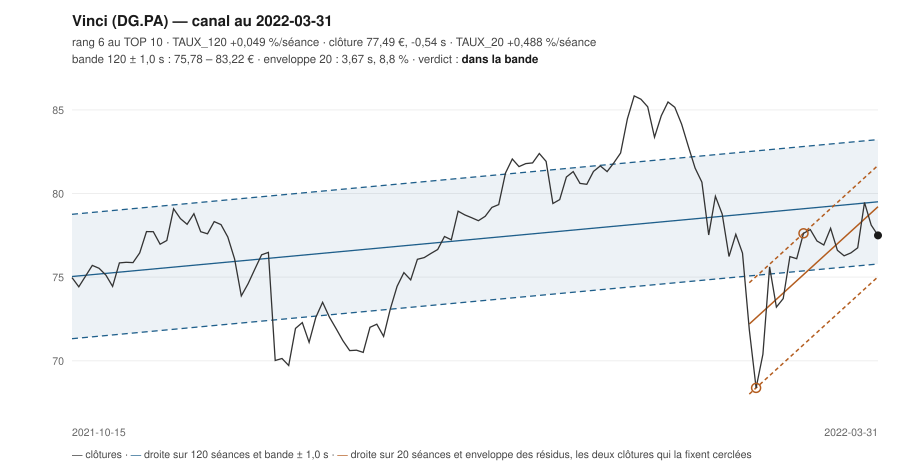

> Rang 6 · TAUX_120 +0,049 %/séance · clôture 77,49 € · bande 75,78 – 83,22 € · écart -0,54 s · TAUX_20 +0,488 %/séance · enveloppe 20 : 3,67 s, 8,8 % · **dans la bande**

- Clôture 77,49 € à −0,54 s, bande 75,78 – 83,22 €.
- 6e pente longue (0,049 %/séance, TOP 10), pente courte positive (0,488 %/séance) depuis le 23 mars.
- Enveloppe de 3,67 s (8,8 %), entre 68,38 € le 7 mars et 77,62 € le 16.
- Sous le bord bas jusqu'au 15 mars (−3,67 s le 7), dans la bande depuis le 16 (12 séances).
- Verdict : dans la bande.

### 7. `CS.PA` — AXA

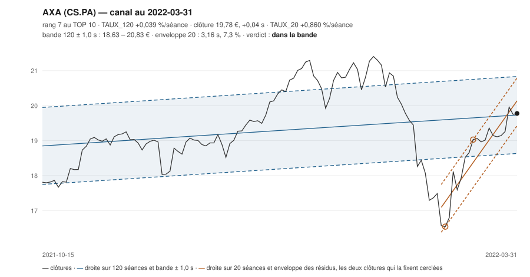

> Rang 7 · TAUX_120 +0,039 %/séance · clôture 19,78 € · bande 18,63 – 20,83 € · écart +0,04 s · TAUX_20 +0,860 %/séance · enveloppe 20 : 3,16 s, 7,3 % · **dans la bande**

- Clôture 19,78 € à +0,04 s, pratiquement sur la droite ajustée, bande 18,63 – 20,83 €.
- Pente longue de 0,039 %/séance (7e, TOP 10), pente courte de 0,860 %/séance : les deux fenêtres montent.
- Enveloppe de 3,16 s (7,3 %), sous la référence, entre 16,54 € le 7 mars et 19,03 € le 16.
- Sous le bord bas du 17 février au 15 mars (−4,23 s le 4 mars), dans la bande depuis le 16 (12 séances) ; la pente courte n'est redevenue positive que le 21, la clôture étant déjà dans la bande.
- Verdict : dans la bande.

### 8. `MT.AS` — ArcelorMittal

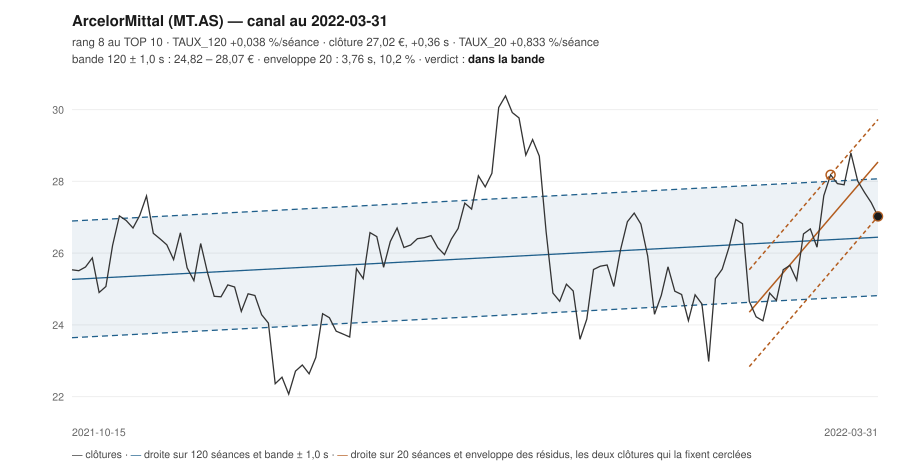

> Rang 8 · TAUX_120 +0,038 %/séance · clôture 27,02 € · bande 24,82 – 28,07 € · écart +0,36 s · TAUX_20 +0,833 %/séance · enveloppe 20 : 3,76 s, 10,2 % · **dans la bande**

- Clôture 27,02 € à +0,36 s, bande 24,82 – 28,07 €.
- Pente longue de 0,038 %/séance, 8e, au TOP 10 depuis le 14 mars (hormis le 23) ; pente courte positive (0,833 %/séance).
- Enveloppe de 3,76 s (10,2 %), portée par deux clôtures récentes : 28,18 € le 22 mars en haut, la clôture du jour en bas.
- Sous le bord bas du 4 au 8 mars, au-dessus du bord haut du 22 au 28 (+1,54 s le 25), dans la bande depuis le 29.
- Verdict : dans la bande.

### 9. `VIV.PA` — Vivendi

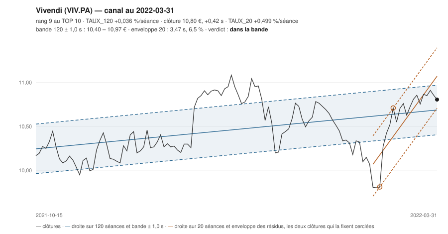

> Rang 9 · TAUX_120 +0,036 %/séance · clôture 10,80 € · bande 10,40 – 10,97 € · écart +0,42 s · TAUX_20 +0,499 %/séance · enveloppe 20 : 3,47 s, 6,5 % · **dans la bande**

- Clôture 10,80 € à +0,42 s, bande 10,40 – 10,97 €.
- Pente longue de 0,036 %/séance, 9e, au TOP 10 depuis le 23 mars ; pente courte positive (0,499 %/séance) : concordance.
- Enveloppe de 3,47 s (6,5 %), fixée par deux clôtures anciennes, 9,81 € le 8 mars et 10,71 € le 14.
- Sous le bord bas du 4 au 9 mars (−3,12 s le 7), dans la bande depuis le 10 (16 séances).
- Verdict : dans la bande.

### 10. `VIE.PA` — Veolia

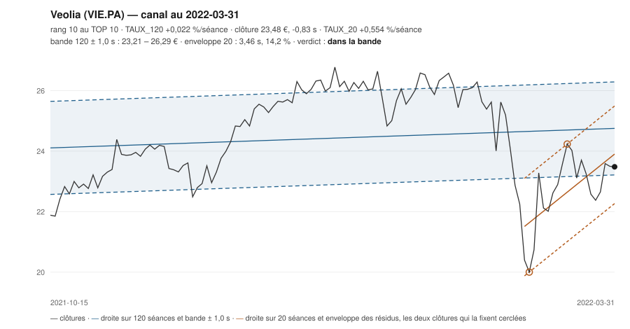

> Rang 10 · TAUX_120 +0,022 %/séance · clôture 23,48 € · bande 23,21 – 26,29 € · écart -0,83 s · TAUX_20 +0,554 %/séance · enveloppe 20 : 3,46 s, 14,2 % · **dans la bande**

- Clôture 23,48 € à −0,83 s, bande 23,21 – 26,29 €.
- Pente longue de 0,022 %/séance, 10e et dernière place du TOP 10 (3e le 4 mars) ; pente courte positive (0,554 %/séance) depuis le 25 mars.
- Enveloppe de 3,46 s pour 14,2 % de la moyenne, entre 20,00 € le 7 mars et 24,23 € le 17.
- Sous le bord bas jusqu'au 16 mars (−5,43 s le 4) puis du 21 au 28 ; candidate les 25 et 28 mars, dans la bande depuis le 29.
- Verdict : dans la bande.

### 11. `AI.PA` — Air Liquide

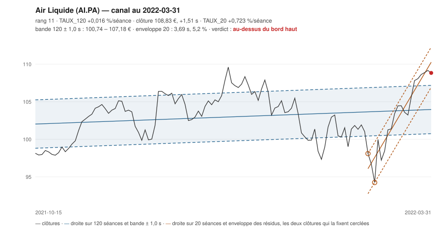

> Rang 11 · TAUX_120 +0,016 %/séance · clôture 108,83 € · bande 100,74 – 107,18 € · écart +1,51 s · TAUX_20 +0,723 %/séance · enveloppe 20 : 3,69 s, 5,2 % · **au-dessus du bord haut**

- Clôture 108,83 € à +1,51 s, au-dessus du bord haut de 107,18 € (bord bas 100,74 €).
- Pente longue de 0,016 %/séance, 11e et dernière pente positive de l'univers, donc juste hors TOP 10 ; pente courte positive (0,723 %/séance).
- Enveloppe de 3,69 s (5,2 %), conforme à la référence, fixée par deux clôtures du début de fenêtre : 98,10 € le 4 mars et 94,25 € le 8.
- Sous le bord bas jusqu'au 11 mars (−2,99 s le 8), au-dessus du bord haut depuis le 24 : la bande a été traversée de bas en haut en neuf séances.
- Verdict : au-dessus du bord haut.

### `ENGI.PA` — Engie

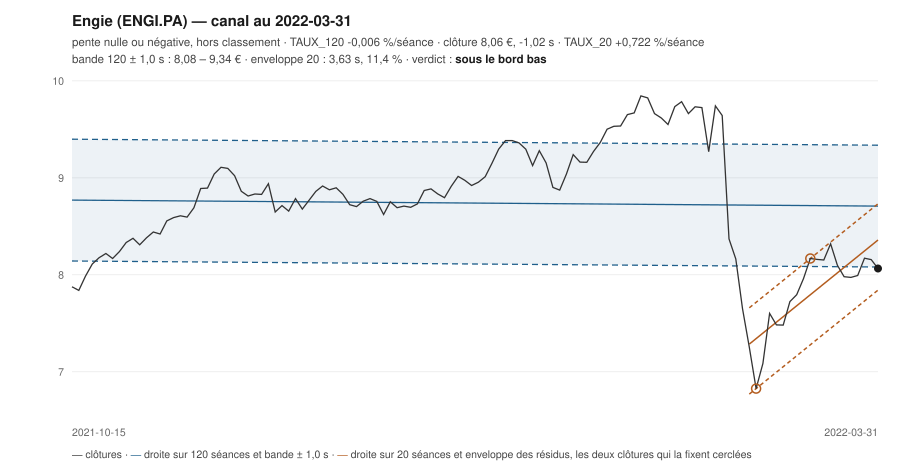

> Hors classement · TAUX_120 -0,006 %/séance · clôture 8,06 € · bande 8,08 – 9,34 € · écart -1,02 s · TAUX_20 +0,722 %/séance · enveloppe 20 : 3,63 s, 11,4 % · **sous le bord bas**

- Clôture 8,06 € à −1,02 s, sous le bord bas de 8,08 € (bord haut 9,34 €).
- Pente longue tout juste négative (−0,006 %/séance), sortie du classement ce 31 mars ; pente courte positive (0,722 %/séance) depuis le 25.
- Enveloppe de 3,63 s (11,4 %), entre 6,83 € le 7 mars et 8,17 € le 17.
- Sous le bord bas jusqu'au 28 mars (−5,78 s le 4), dans la bande les 29 et 30, dessous à nouveau le 31 ; tant qu'elle était au TOP 10, jusqu'au 23 mars, sa pente courte était négative.
- Verdict : sous le bord bas, non candidate — pente longue négative, donc hors TOP 10.

### `PUB.PA` — Publicis

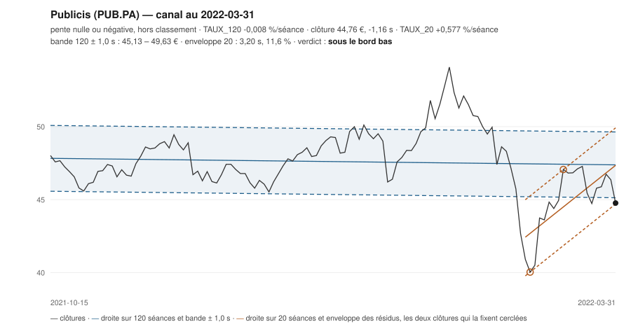

> Hors classement · TAUX_120 -0,008 %/séance · clôture 44,76 € · bande 45,13 – 49,63 € · écart -1,16 s · TAUX_20 +0,577 %/séance · enveloppe 20 : 3,20 s, 11,6 % · **sous le bord bas**

- Clôture 44,76 € à −1,16 s, sous le bord bas de 45,13 € (bord haut 49,63 €).
- Pente longue tout juste négative (−0,008 %/séance), sortie du classement le 28 mars ; pente courte positive (0,577 %/séance).
- Enveloppe de 3,20 s (11,6 %), entre 40,03 € le 7 mars et 47,06 € le 16.
- Sous le bord bas jusqu'au 15 mars (−5,03 s le 4), puis les 23 et 24, et de nouveau ce 31 mars.
- Verdict : sous le bord bas, non candidate — pente longue négative, donc hors TOP 10.

### `AIR.PA` — Airbus

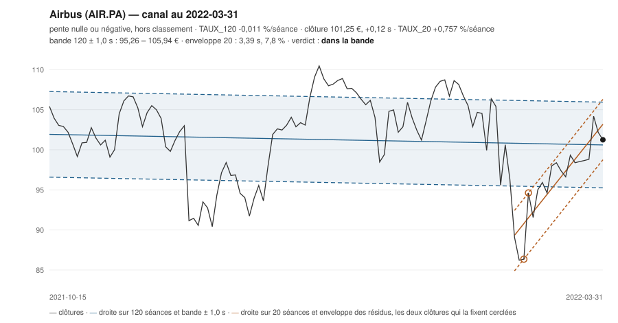

> Hors classement · TAUX_120 -0,011 %/séance · clôture 101,25 € · bande 95,26 – 105,94 € · écart +0,12 s · TAUX_20 +0,757 %/séance · enveloppe 20 : 3,39 s, 7,8 % · **dans la bande**

- Clôture 101,25 € à +0,12 s, bande 95,26 – 105,94 €.
- Pente longue négative (−0,011 %/séance), hors classement depuis le 7 mars ; pente courte positive (0,757 %/séance) : discordance.
- Enveloppe de 3,39 s (7,8 %), fixée par deux séances consécutives du début de fenêtre, 86,36 € le 8 mars et 94,62 € le 9.
- Sous le bord bas du 4 au 11 mars et le 15 (−3,20 s le 7), dans la bande depuis le 16 (12 séances).
- Verdict : dans la bande.

### `EN.PA` — Bouygues

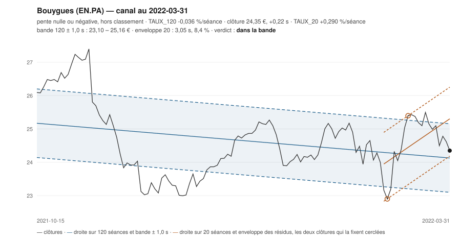

> Hors classement · TAUX_120 -0,036 %/séance · clôture 24,35 € · bande 23,10 – 25,16 € · écart +0,22 s · TAUX_20 +0,290 %/séance · enveloppe 20 : 3,05 s, 8,4 % · **dans la bande**

- Clôture 24,35 € à +0,22 s, bande 23,10 – 25,16 €.
- Pente longue négative (−0,036 %/séance), pente courte positive (0,290 %/séance).
- Enveloppe de 3,05 s (8,4 %), entre 22,90 € le 7 mars et 25,40 € le 15.
- Au-dessus du bord haut du 14 au 23 mars et le 25 (+1,71 s le 15), dans la bande depuis le 28 (4 séances).
- Verdict : dans la bande.

### `SAF.PA` — Safran

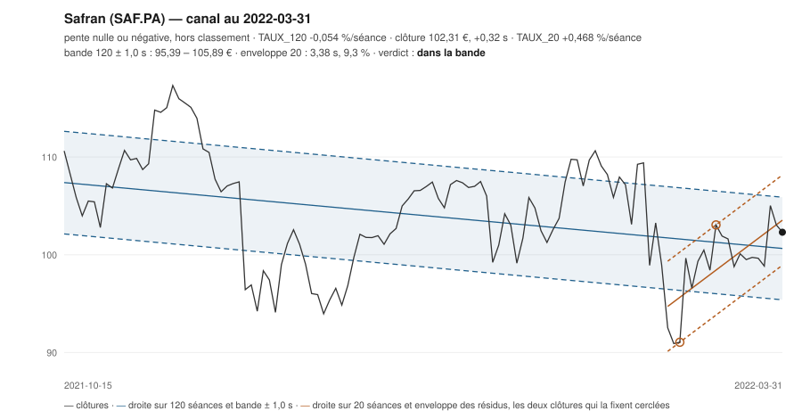

> Hors classement · TAUX_120 -0,054 %/séance · clôture 102,31 € · bande 95,39 – 105,89 € · écart +0,32 s · TAUX_20 +0,468 %/séance · enveloppe 20 : 3,38 s, 9,3 % · **dans la bande**

- Clôture 102,31 € à +0,32 s, bande 95,39 – 105,89 €.
- Pente longue négative (−0,054 %/séance), pente courte positive (0,468 %/séance).
- Enveloppe de 3,38 s (9,3 %), presque symétrique, entre 91,04 € le 8 mars et 103,05 € le 16.
- Sous le bord bas du 4 au 8 mars (−2,29 s le 7), dans la bande depuis le 9 (17 séances).
- Verdict : dans la bande.

### `SU.PA` — Schneider Electric

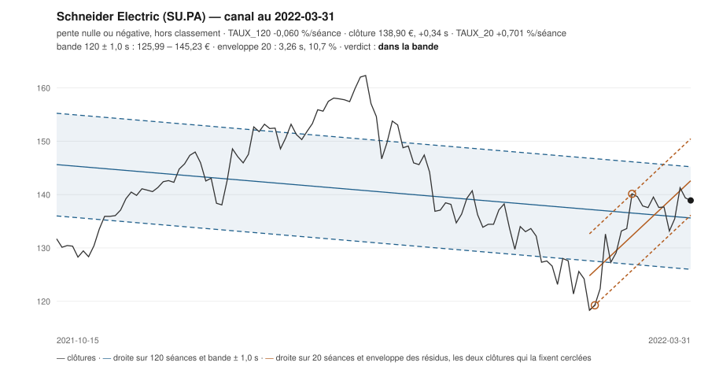

> Hors classement · TAUX_120 -0,060 %/séance · clôture 138,90 € · bande 125,99 – 145,23 € · écart +0,34 s · TAUX_20 +0,701 %/séance · enveloppe 20 : 3,26 s, 10,7 % · **dans la bande**

- Clôture 138,90 € à +0,34 s, bande 125,99 – 145,23 €.
- Pente longue négative (−0,060 %/séance), hors classement depuis le 10 mars ; pente courte positive (0,701 %/séance).
- Enveloppe de 3,26 s (10,7 %), entre 119,25 € le 7 mars et 140,14 € le 16.
- Sous le bord bas jusqu'au 8 mars puis le 10, dans la bande depuis le 11 (15 séances), l'écart restant entre −0,53 et +0,53 s depuis le 14.
- Verdict : dans la bande.

### `BNP.PA` — BNP Paribas

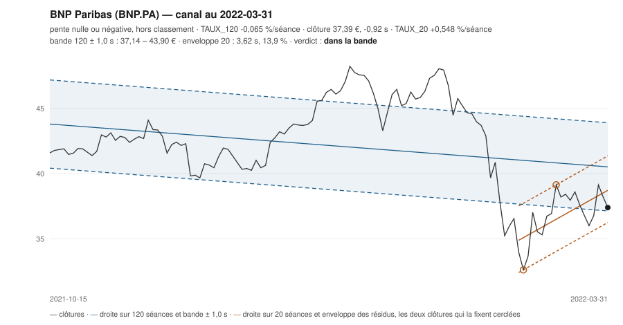

> Hors classement · TAUX_120 -0,065 %/séance · clôture 37,39 € · bande 37,14 – 43,90 € · écart -0,92 s · TAUX_20 +0,548 %/séance · enveloppe 20 : 3,62 s, 13,9 % · **dans la bande**

- Clôture 37,39 € à −0,92 s, juste au-dessus du bord bas de 37,14 € (bord haut 43,90 €).
- Pente longue devenue négative (−0,065 %/séance), hors classement depuis le 17 mars ; pente courte positive (0,548 %/séance).
- Enveloppe de 3,62 s pour 13,9 % de la moyenne, entre 32,62 € le 7 mars et 39,14 € le 16.
- Sous le bord bas du 16 février au 28 mars, à la seule exception du 22 mars ; dans la bande depuis le 29 (3 séances).
- Verdict : dans la bande.

### `SGO.PA` — Saint-Gobain

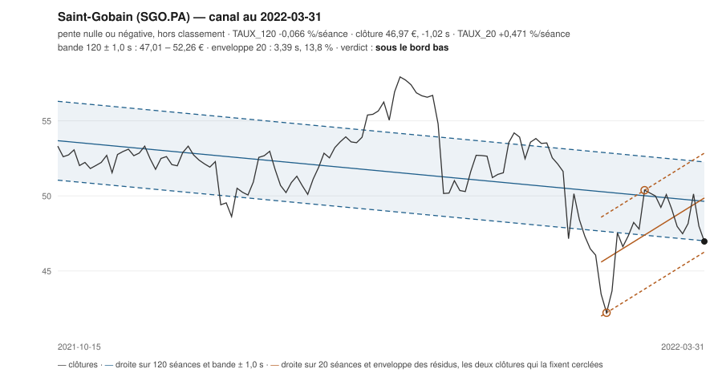

> Hors classement · TAUX_120 -0,066 %/séance · clôture 46,97 € · bande 47,01 – 52,26 € · écart -1,02 s · TAUX_20 +0,471 %/séance · enveloppe 20 : 3,39 s, 13,8 % · **sous le bord bas**

- Clôture 46,97 € contre un bord bas de 47,01 € : −1,02 s (bord haut 52,26 €).
- Pente longue négative (−0,066 %/séance), hors classement depuis le 7 mars ; pente courte positive (0,471 %/séance).
- Enveloppe de 3,39 s (13,8 %), entre 42,22 € le 7 mars et 50,38 € le 16.
- Sous le bord bas jusqu'au 15 mars (−3,88 s le 7), dans la bande du 16 au 30, repassée dessous ce 31 mars.
- Verdict : sous le bord bas, non candidate — pente longue négative, donc hors TOP 10.

### `BN.PA` — Danone

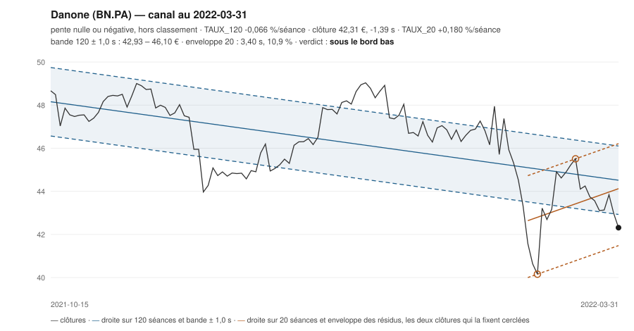

> Hors classement · TAUX_120 -0,066 %/séance · clôture 42,31 € · bande 42,93 – 46,10 € · écart -1,39 s · TAUX_20 +0,180 %/séance · enveloppe 20 : 3,40 s, 10,9 % · **sous le bord bas**

- Clôture 42,31 € à −1,39 s, sous le bord bas de 42,93 € (bord haut 46,10 €).
- Pente longue négative (−0,066 %/séance), pente courte positive (0,180 %/séance) depuis le 25 mars.
- Enveloppe de 3,40 s (10,9 %), entre 40,16 € le 8 mars et 45,51 € le 18.
- Sous le bord bas jusqu'au 11 mars (−3,39 s le 8), dans la bande du 14 au 24, puis de nouveau dessous les 25 et 28 et depuis le 30.
- Verdict : sous le bord bas, non candidate — pente longue négative, donc hors TOP 10, bien que la pente courte soit positive.

### `ML.PA` — Michelin

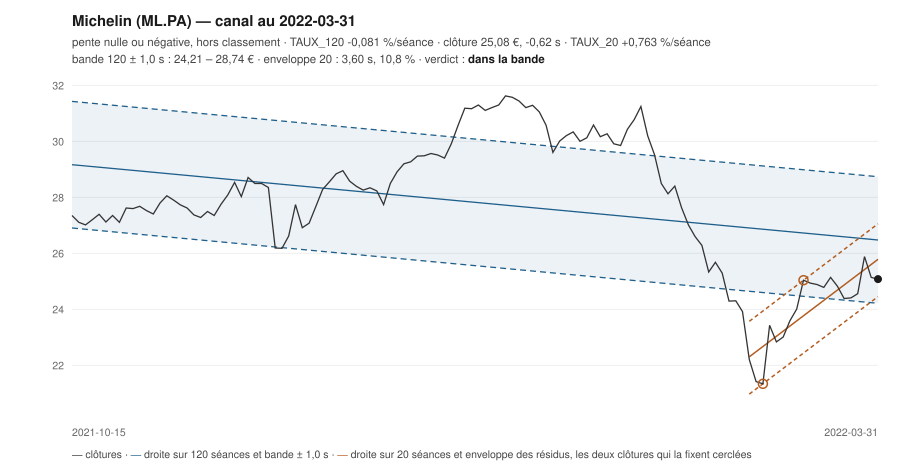

> Hors classement · TAUX_120 -0,081 %/séance · clôture 25,08 € · bande 24,21 – 28,74 € · écart -0,62 s · TAUX_20 +0,763 %/séance · enveloppe 20 : 3,60 s, 10,8 % · **dans la bande**

- Clôture 25,08 € à −0,62 s, bande 24,21 – 28,74 €.
- Pente longue négative (−0,081 %/séance), hors classement depuis le 14 mars ; pente courte positive (0,763 %/séance).
- Enveloppe de 3,60 s (10,8 %), entre 21,34 € le 8 mars et 25,04 € le 16.
- Sous le bord bas jusqu'au 21 mars puis du 23 au 25, dans la bande depuis le 28 (4 séances).
- Verdict : dans la bande.

### `MC.PA` — LVMH

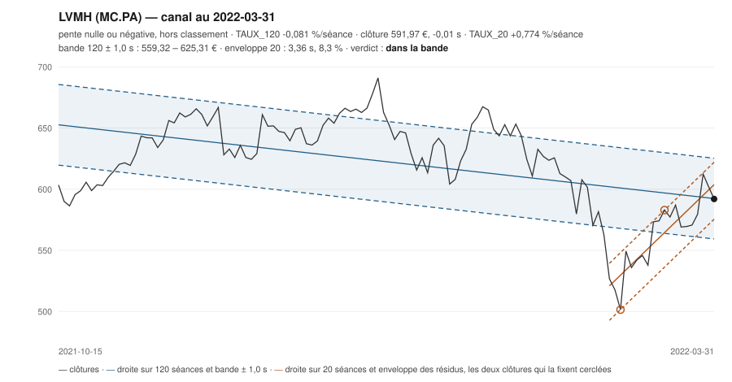

> Hors classement · TAUX_120 -0,081 %/séance · clôture 591,97 € · bande 559,32 – 625,31 € · écart -0,01 s · TAUX_20 +0,774 %/séance · enveloppe 20 : 3,36 s, 8,3 % · **dans la bande**

- Clôture 591,97 € à −0,01 s, sur la droite ajustée, bande 559,32 – 625,31 €.
- Pente longue devenue négative (−0,081 %/séance), hors classement depuis le 14 mars ; pente courte positive (0,774 %/séance).
- Enveloppe de 3,36 s (8,3 %), entre 501,46 € le 8 mars et 582,86 € le 18.
- Sous le bord bas jusqu'au 17 mars (−3,78 s le 8), dans la bande depuis le 18 (10 séances).
- Verdict : dans la bande.

### `GLE.PA` — Société Générale

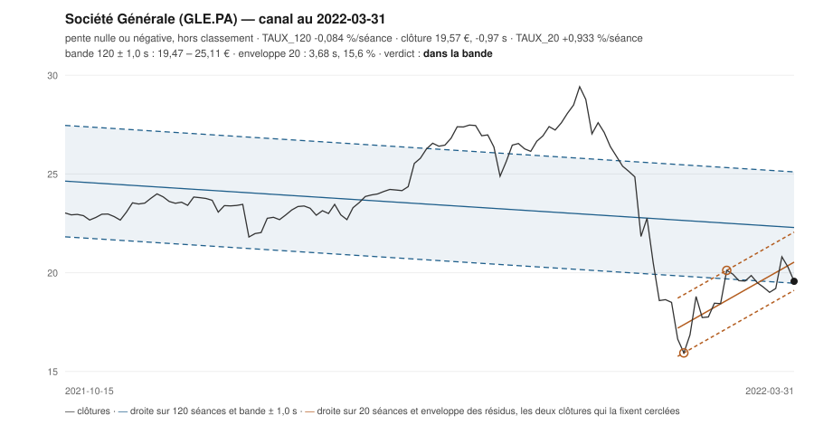

> Hors classement · TAUX_120 -0,084 %/séance · clôture 19,57 € · bande 19,47 – 25,11 € · écart -0,97 s · TAUX_20 +0,933 %/séance · enveloppe 20 : 3,68 s, 15,6 % · **dans la bande**

- Clôture 19,57 € à −0,97 s, juste au-dessus du bord bas de 19,47 € (bord haut 25,11 €).
- Pente longue devenue négative (−0,084 %/séance), hors classement depuis le 18 mars ; pente courte positive (0,933 %/séance) depuis le 24.
- Enveloppe de 3,68 s pour 15,6 % de la moyenne, entre 15,94 € le 7 mars et 20,12 € le 16.
- Sous le bord bas du 18 février au 28 mars (−4,56 s le 4 mars), dans la bande depuis le 29 (3 séances).
- Verdict : dans la bande.

### `CAP.PA` — Capgemini

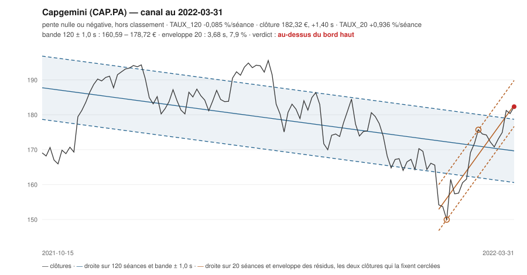

> Hors classement · TAUX_120 -0,085 %/séance · clôture 182,32 € · bande 160,59 – 178,72 € · écart +1,40 s · TAUX_20 +0,936 %/séance · enveloppe 20 : 3,68 s, 7,9 % · **au-dessus du bord haut**

- Clôture 182,32 € à +1,40 s, au-dessus du bord haut de 178,72 € (bord bas 160,59 €).
- Pente longue négative (−0,085 %/séance), hors classement depuis le 8 mars ; pente courte positive (0,936 %/séance) depuis le 21 mars : discordance.
- Enveloppe de 3,68 s (7,9 %), entre 149,95 € le 8 mars et 175,70 € le 18.
- Sous le bord bas jusqu'au 15 mars (−2,45 s le 8), au-dessus du bord haut depuis le 29 : la bande a été traversée de bas en haut en dix séances.
- Verdict : au-dessus du bord haut.

### `RI.PA` — Pernod Ricard

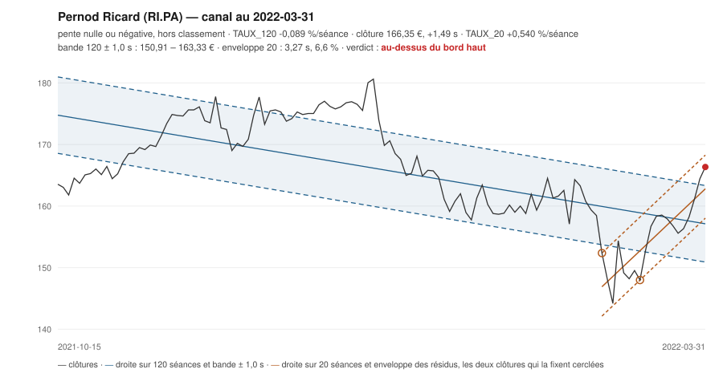

> Hors classement · TAUX_120 -0,089 %/séance · clôture 166,35 € · bande 150,91 – 163,33 € · écart +1,49 s · TAUX_20 +0,540 %/séance · enveloppe 20 : 3,27 s, 6,6 % · **au-dessus du bord haut**

- Clôture 166,35 € à +1,49 s, au-dessus du bord haut de 163,33 € (bord bas 150,91 €).
- Pente longue négative (−0,089 %/séance), pente courte positive (0,540 %/séance) depuis le 28 mars.
- Enveloppe de 3,27 s (6,6 %), fixée par deux clôtures anciennes, 152,37 € le 4 mars et 147,98 € le 15.
- Sous le bord bas jusqu'au 16 mars (−2,84 s le 8), au-dessus du bord haut depuis le 30 : traversée de la bande en dix séances.
- Verdict : au-dessus du bord haut.

### `TEP.PA` — Teleperformance

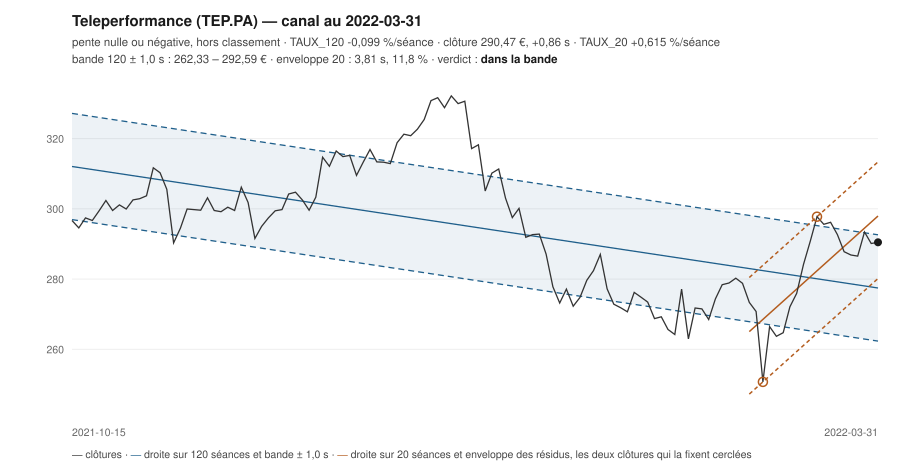

> Hors classement · TAUX_120 -0,099 %/séance · clôture 290,47 € · bande 262,33 – 292,59 € · écart +0,86 s · TAUX_20 +0,615 %/séance · enveloppe 20 : 3,81 s, 11,8 % · **dans la bande**

- Clôture 290,47 € à +0,86 s, bande 262,33 – 292,59 €.
- Pente longue négative (−0,099 %/séance), pente courte positive (0,615 %/séance).
- Enveloppe de 3,81 s (11,8 %), entre 250,71 € le 8 mars et 297,77 € le 18.
- Sous le bord bas du 8 au 11 mars, puis trois sorties d'une séance au-dessus du bord haut, les 18, 22 et 29 mars ; dans la bande depuis le 30.
- Verdict : dans la bande.

### `STMPA.PA` — STMicroelectronics

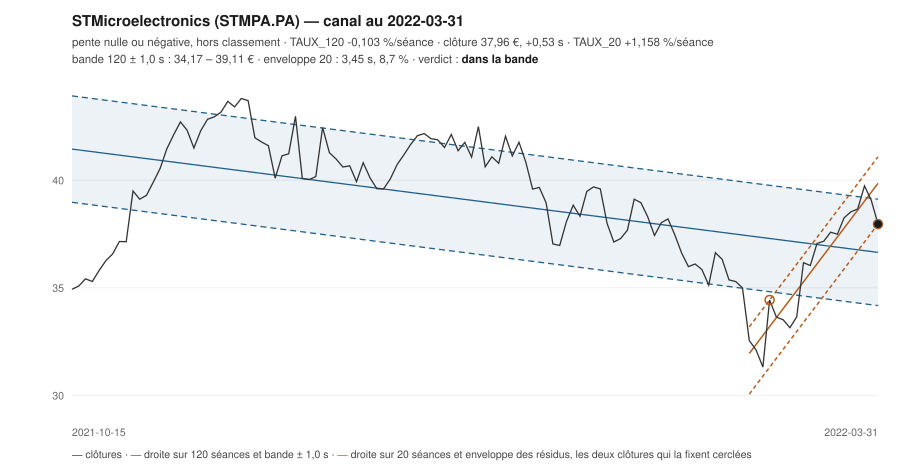

> Hors classement · TAUX_120 -0,103 %/séance · clôture 37,96 € · bande 34,17 – 39,11 € · écart +0,53 s · TAUX_20 +1,158 %/séance · enveloppe 20 : 3,45 s, 8,7 % · **dans la bande**

- Clôture 37,96 € à +0,53 s, bande 34,17 – 39,11 €.
- Pente longue négative (−0,103 %/séance), hors classement depuis le 8 mars ; pente courte de 1,158 %/séance, la plus forte des 39 valeurs à cette date.
- Enveloppe de 3,45 s (8,7 %) ; le bord bas passe par la clôture du jour, le bord haut par celle du 9 mars (34,43 €).
- Sous le bord bas jusqu'au 15 mars, au-dessus du bord haut le seul 29 mars (+1,11 s), dans la bande depuis le 30.
- Verdict : dans la bande.

### `ACA.PA` — Crédit Agricole

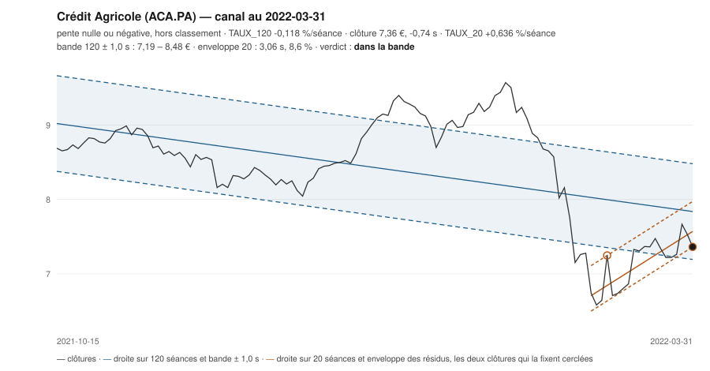

> Hors classement · TAUX_120 -0,118 %/séance · clôture 7,36 € · bande 7,19 – 8,48 € · écart -0,74 s · TAUX_20 +0,636 %/séance · enveloppe 20 : 3,06 s, 8,6 % · **dans la bande**

- Clôture 7,36 € à −0,74 s, bande 7,19 – 8,48 €.
- Pente longue devenue négative (−0,118 %/séance), hors classement depuis le 9 mars ; pente courte positive (0,636 %/séance) depuis le 25.
- Enveloppe de 3,06 s (8,6 %), sous la référence ; la clôture du jour en fixe le bord bas, celle du 9 mars (7,25 €) le bord haut.
- L'écart est remonté de −4,14 s le 4 mars à −0,36 s le 29 ; sous le bord bas jusqu'au 28 mars sauf le 22, dans la bande depuis 3 séances.
- Verdict : dans la bande.

### `KER.PA` — Kering

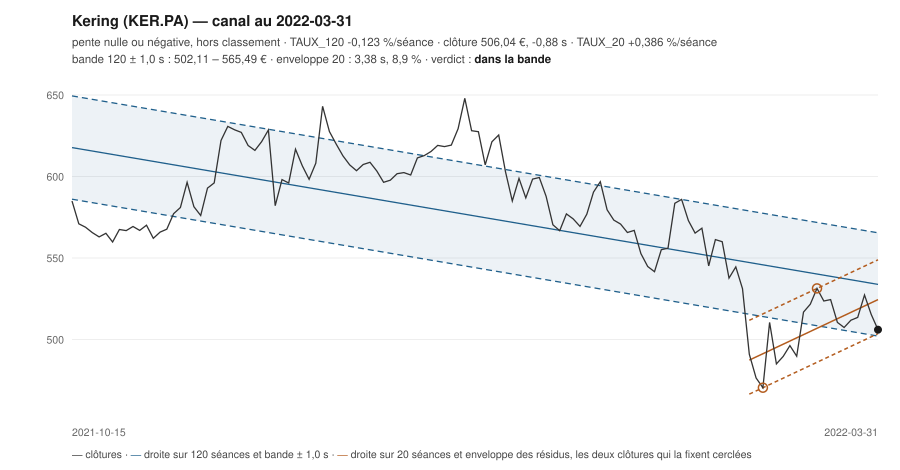

> Hors classement · TAUX_120 -0,123 %/séance · clôture 506,04 € · bande 502,11 – 565,49 € · écart -0,88 s · TAUX_20 +0,386 %/séance · enveloppe 20 : 3,38 s, 8,9 % · **dans la bande**

- Clôture 506,04 € à −0,88 s, bande 502,11 – 565,49 €.
- Pente longue négative (−0,123 %/séance), hors classement depuis le 8 mars ; pente courte positive (0,386 %/séance) depuis le 28.
- Enveloppe de 3,38 s (8,9 %), entre 470,44 € le 8 mars et 531,35 € le 18.
- Sous le bord bas jusqu'au 17 mars puis les 23 et 24, dans la bande depuis le 25 (5 séances).
- Verdict : dans la bande.

### `LR.PA` — Legrand

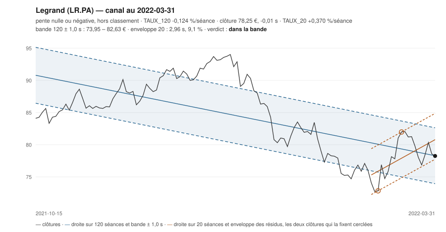

> Hors classement · TAUX_120 -0,124 %/séance · clôture 78,25 € · bande 73,95 – 82,63 € · écart -0,01 s · TAUX_20 +0,370 %/séance · enveloppe 20 : 2,96 s, 9,1 % · **dans la bande**

- Clôture 78,25 € à −0,01 s, sur la droite ajustée, bande 73,95 – 82,63 €.
- Pente longue négative (−0,124 %/séance), pente courte positive (0,370 %/séance) : discordance.
- Enveloppe de 2,96 s (9,1 %), sous la référence, entre 72,83 € le 8 mars et 81,98 € le 17.
- Sous le bord bas jusqu'au 11 mars, hors le 9 ; dans la bande depuis le 14 (14 séances), avec un écart compris entre −0,58 et +0,35 s.
- Verdict : dans la bande.

### `EL.PA` — EssilorLuxottica

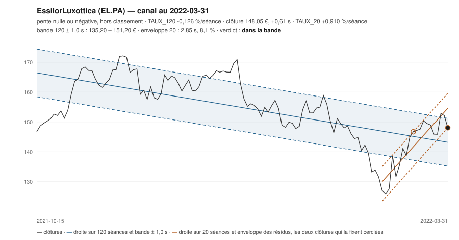

> Hors classement · TAUX_120 -0,126 %/séance · clôture 148,05 € · bande 135,20 – 151,20 € · écart +0,61 s · TAUX_20 +0,910 %/séance · enveloppe 20 : 2,85 s, 8,1 % · **dans la bande**

- Clôture 148,05 € à +0,61 s, bande 135,20 – 151,20 €.
- Pente longue négative (−0,126 %/séance), pente courte positive (0,910 %/séance) : discordance.
- Enveloppe de 2,85 s (8,1 %), sous la référence ; le bord bas passe par la clôture du jour, le bord haut par celle du 17 mars (146,70 €).
- Sous le bord bas jusqu'au 11 mars (−2,79 s le 4), au-dessus du bord haut les 29 et 30, dans la bande le 31.
- Verdict : dans la bande.

### `STLAP.PA` — Stellantis

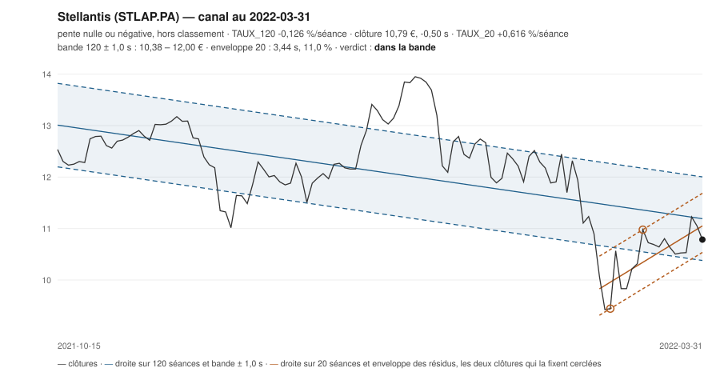

> Hors classement · TAUX_120 -0,126 %/séance · clôture 10,79 € · bande 10,38 – 12,00 € · écart -0,50 s · TAUX_20 +0,616 %/séance · enveloppe 20 : 3,44 s, 11,0 % · **dans la bande**

- Clôture 10,79 € à −0,50 s, bande 10,38 – 12,00 €.
- Pente longue négative (−0,126 %/séance), pente courte positive (0,616 %/séance).
- Enveloppe de 3,44 s (11,0 %), entre 9,44 € le 8 mars et 10,98 € le 16.
- Sous le bord bas jusqu'au 15 mars (−4,06 s le 7), puis cinq bascules autour de ce bord, la dernière le 25, qui l'a ramenée dans la bande (5 séances).
- Verdict : dans la bande.

### `OR.PA` — L'Oréal

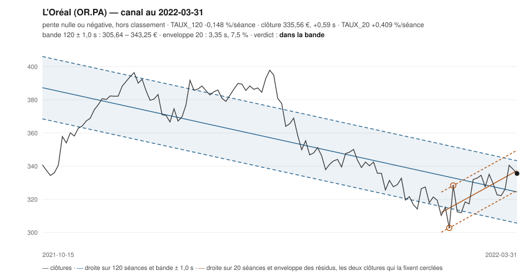

> Hors classement · TAUX_120 -0,148 %/séance · clôture 335,56 € · bande 305,64 – 343,25 € · écart +0,59 s · TAUX_20 +0,409 %/séance · enveloppe 20 : 3,35 s, 7,5 % · **dans la bande**

- Clôture 335,56 € à +0,59 s, bande 305,64 – 343,25 €.
- Pente longue négative (−0,148 %/séance), pente courte positive (0,409 %/séance).
- Enveloppe de 3,35 s (7,5 %), fixée par deux séances consécutives anciennes, 302,77 € le 8 mars et 328,32 € le 9.
- Sous le bord bas jusqu'au 8 mars puis les 10 et 11, dans la bande depuis le 14 (14 séances).
- Verdict : dans la bande.

### `RNO.PA` — Renault

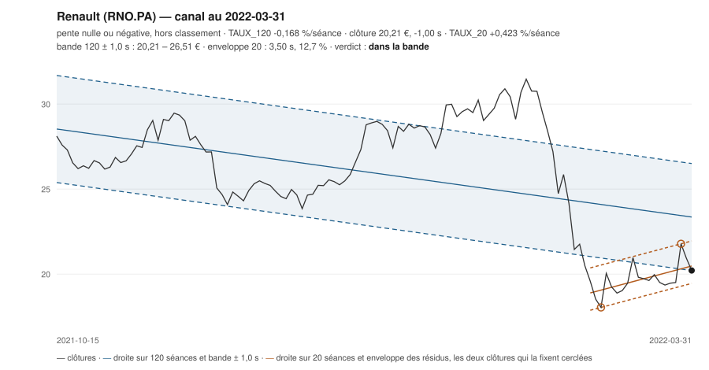

> Hors classement · TAUX_120 -0,168 %/séance · clôture 20,21 € · bande 20,21 – 26,51 € · écart -1,00 s · TAUX_20 +0,423 %/séance · enveloppe 20 : 3,50 s, 12,7 % · **dans la bande**

- Clôture 20,21 € à −0,999 s : elle dépasse le bord bas (20,207 €) de moins d'un centime ; bord haut 26,51 €.
- Pente longue négative (−0,168 %/séance), pente courte positive (0,423 %/séance) depuis le 29 mars.
- Enveloppe de 3,50 s (12,7 %), entre 18,04 € le 8 mars et 21,78 € le 29.
- Sous le bord bas du 23 février au 28 mars (−3,83 s le 7 mars), dans la bande depuis le 29 (3 séances).
- Verdict : dans la bande — et la pente longue négative l'exclurait du TOP 10 même sous le bord bas.

### `RMS.PA` — Hermès International

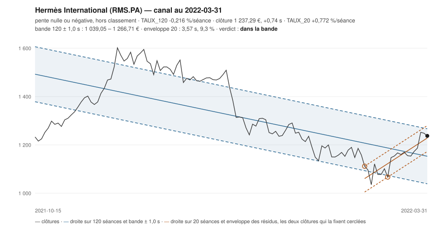

> Hors classement · TAUX_120 -0,216 %/séance · clôture 1 237,29 € · bande 1 039,05 – 1 266,71 € · écart +0,74 s · TAUX_20 +0,772 %/séance · enveloppe 20 : 3,57 s, 9,3 % · **dans la bande**

- Clôture 1 237,29 € à +0,74 s, bande 1 039,05 – 1 266,71 €.
- Pente longue négative (−0,216 %/séance), pente courte positive (0,772 %/séance) : discordance.
- Enveloppe de 3,57 s (9,3 %), bornée par deux clôtures de la première moitié, 1 111,78 € le 4 mars et 1 066,76 € le 15.
- Sous le bord bas jusqu'au 15 mars, dans la bande depuis le 16 (12 séances), l'écart montant jusqu'à +0,78 s le 30.
- Verdict : dans la bande.

### `ERF.PA` — Eurofins Scientific

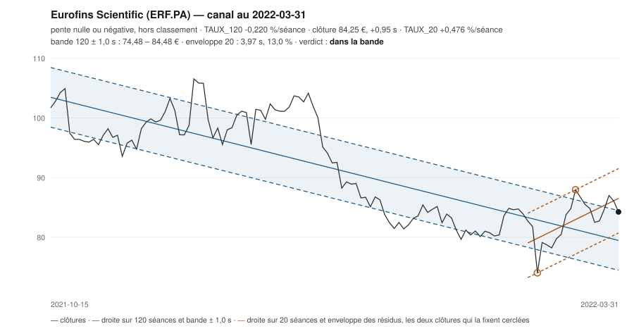

> Hors classement · TAUX_120 -0,220 %/séance · clôture 84,25 € · bande 74,48 – 84,48 € · écart +0,95 s · TAUX_20 +0,476 %/séance · enveloppe 20 : 3,97 s, 13,0 % · **dans la bande**

- Clôture 84,25 € à +0,95 s, sous le bord haut de 84,48 € (bord bas 74,48 €).
- Pente longue négative (−0,220 %/séance), pente courte positive (0,476 %/séance).
- Enveloppe de 3,97 s (13,0 %), entre 74,04 € le 8 mars et 87,97 € le 18.
- Sous le bord bas le seul 8 mars, au-dessus du bord haut du 18 au 22 puis du 28 au 30 mars ; dans la bande le 31.
- Verdict : dans la bande.

### `DSY.PA` — Dassault Systèmes

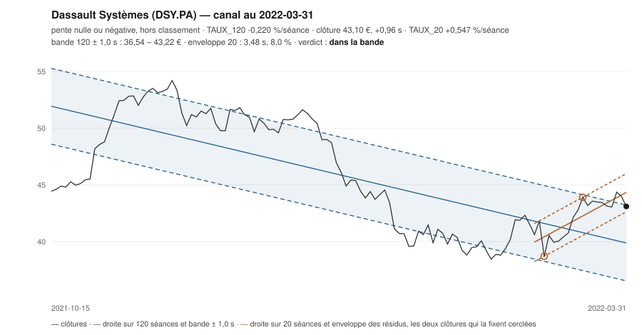

> Hors classement · TAUX_120 -0,220 %/séance · clôture 43,10 € · bande 36,54 – 43,22 € · écart +0,96 s · TAUX_20 +0,547 %/séance · enveloppe 20 : 3,48 s, 8,0 % · **dans la bande**

- Clôture 43,10 € à +0,96 s, contre un bord haut de 43,22 € (bord bas 36,54 €).
- Pente longue négative (−0,220 %/séance), pente courte positive sur les 20 séances (0,547 %/séance).
- Enveloppe de 3,48 s (8,0 %), entre 38,71 € le 8 mars et 43,91 € le 18.
- L'écart est passé de −0,86 s le 8 mars à +1,23 s le 29 ; au-dessus du bord haut les 29 et 30, la clôture est rentrée dans la bande le 31.
- Verdict : dans la bande.

### `WLN.PA` — Worldline

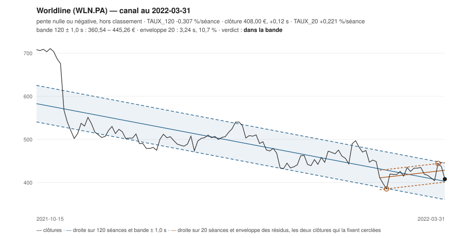

> Hors classement · TAUX_120 -0,307 %/séance · clôture 408,00 € · bande 360,54 – 445,26 € · écart +0,12 s · TAUX_20 +0,221 %/séance · enveloppe 20 : 3,24 s, 10,7 % · **dans la bande**

- Clôture 408,00 € à +0,12 s, bande 360,54 – 445,26 €.
- Pente longue négative (−0,307 %/séance), pente courte positive (0,221 %/séance) depuis le 29 mars.
- Enveloppe de 3,24 s (10,7 %), entre 385,32 € le 8 mars et 444,21 € le 29.
- Dans la bande sur les 21 dernières séances, l'écart restant entre −0,36 et +0,97 s.
- Verdict : dans la bande.

### `ALO.PA` — Alstom

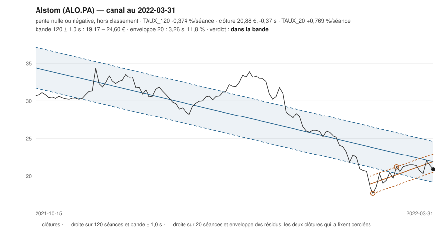

> Hors classement · TAUX_120 -0,374 %/séance · clôture 20,88 € · bande 19,17 – 24,60 € · écart -0,37 s · TAUX_20 +0,769 %/séance · enveloppe 20 : 3,26 s, 11,8 % · **dans la bande**

- Clôture 20,88 € à −0,37 s, bande 19,17 – 24,60 €.
- Pente longue la plus négative de l'univers (−0,374 %/séance), pente courte positive (0,769 %/séance) : les deux fenêtres s'opposent.
- Enveloppe de 3,26 s (11,8 %), entre 17,68 € le 7 mars et 21,19 € le 16.
- Sous le bord bas jusqu'au 17 mars (−3,27 s le 7), dans la bande depuis le 18 (10 séances).
- Verdict : dans la bande.

### Les figures des ordres du mois

#### 2022-03-28 — Achat `VIE.PA` Veolia, décision au 2022-03-25

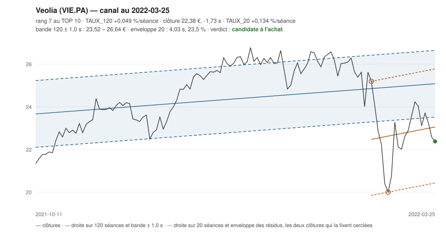

> Rang 7 · TAUX_120 +0,049 %/séance · clôture 22,38 € · bande 23,52 – 26,64 € · écart -1,73 s · TAUX_20 +0,134 %/séance · enveloppe 20 : 4,03 s, 23,5 % · **candidate à l'achat**

#### 2022-03-30 — Vente `CAP.PA` Capgemini, décision au 2022-03-29

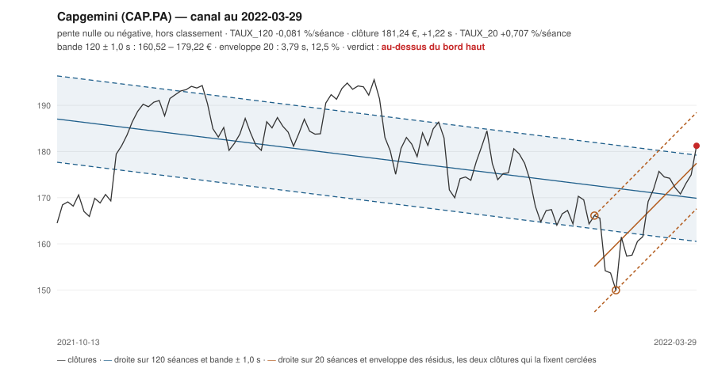

> Hors classement · TAUX_120 -0,081 %/séance · clôture 181,24 € · bande 160,52 – 179,22 € · écart +1,22 s · TAUX_20 +0,707 %/séance · enveloppe 20 : 3,79 s, 12,5 % · **au-dessus du bord haut**

#### 2022-03-30 — Vente `EL.PA` EssilorLuxottica, décision au 2022-03-29

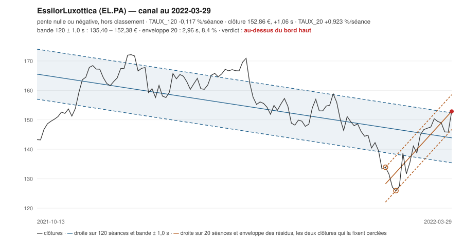

> Hors classement · TAUX_120 -0,117 %/séance · clôture 152,86 € · bande 135,40 – 152,38 € · écart +1,06 s · TAUX_20 +0,923 %/séance · enveloppe 20 : 2,96 s, 8,4 % · **au-dessus du bord haut**

#### 2022-03-31 — Vente `RI.PA` Pernod Ricard, décision au 2022-03-30

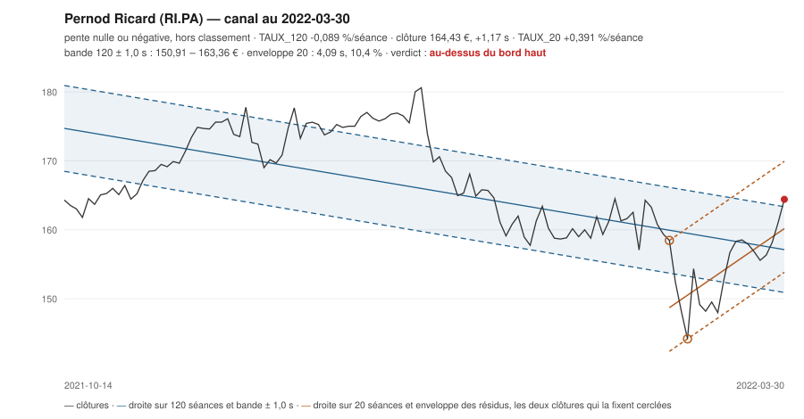

> Hors classement · TAUX_120 -0,089 %/séance · clôture 164,43 € · bande 150,91 – 163,36 € · écart +1,17 s · TAUX_20 +0,391 %/séance · enveloppe 20 : 4,09 s, 10,4 % · **au-dessus du bord haut**

## 5. Le TOP 10 au 2022-03-31

| Rang | Valeur | TAUX_120 | Écart | TAUX_20 | Verdict |
|---|---|---|---|---|---|
| 1 | `HO.PA` Thales | +0,341 %/séance | +1,13 s | +0,249 %/séance | au-dessus du bord haut |
| 2 | `CA.PA` Carrefour | +0,186 %/séance | +1,72 s | +0,673 %/séance | au-dessus du bord haut |
| 3 | `ORA.PA` Orange | +0,173 %/séance | -0,63 s | +0,223 %/séance | dans la bande |
| 4 | `TTE.PA` TotalEnergies | +0,133 %/séance | -1,09 s | +0,281 %/séance | sous le bord bas |
| 5 | `SAN.PA` Sanofi | +0,082 %/séance | -0,79 s | +0,137 %/séance | dans la bande |
| 6 | `DG.PA` Vinci | +0,049 %/séance | -0,54 s | +0,488 %/séance | dans la bande |
| 7 | `CS.PA` AXA | +0,039 %/séance | +0,04 s | +0,860 %/séance | dans la bande |
| 8 | `MT.AS` ArcelorMittal | +0,038 %/séance | +0,36 s | +0,833 %/séance | dans la bande |
| 9 | `VIV.PA` Vivendi | +0,036 %/séance | +0,42 s | +0,499 %/séance | dans la bande |
| 10 | `VIE.PA` Veolia | +0,022 %/séance | -0,83 s | +0,554 %/séance | dans la bande |

**Entrées et sorties du TOP 10 au fil du mois**

| Séance | Entrées | Sorties |
|---|---|---|
| 2022-03-07 | `HO.PA` | `BNP.PA` |
| 2022-03-14 | `MT.AS` | `GLE.PA` |
| 2022-03-23 | `VIV.PA` | `MT.AS` |
| 2022-03-24 | `MT.AS` | `ENGI.PA` |

## 6. Les ordres exécutés

> À l'**ouverture** de la séance qui suit la décision, jamais à la clôture qui l'a déclenchée. L'écart d'ouverture est subi, et publié.

| Exécution | Sens | Valeur | Quantité | Prix | Brut | Frais | Écart d'ouverture | Motif |
|---|---|---|---|---|---|---|---|---|
| 2022-03-28 | **Achat** | `VIE.PA` Veolia | 49 | 22,38 € | 1 096,50 € | 4,55 € | +0,00 % | décision au 2022-03-25 : clôture 22,38 € sous le bord bas 23,52 € (-1,73 s), rang 7, TAUX_120 +0,049 %/séance, TAUX_20 +0,134 %/séance |
| 2022-03-30 | **Vente** | `CAP.PA` Capgemini | 5 | 181,51 € | 907,53 € | 1,04 € | +0,15 % | décision au 2022-03-29 : clôture 181,24 € au-dessus du bord haut 179,22 € (+1,22 s) |
| 2022-03-30 | **Vente** | `EL.PA` EssilorLuxottica | 6 | 153,11 € | 918,66 € | 1,06 € | +0,16 % | décision au 2022-03-29 : clôture 152,86 € au-dessus du bord haut 152,38 € (+1,06 s) |
| 2022-03-31 | **Vente** | `RI.PA` Pernod Ricard | 5 | 164,76 € | 823,80 € | 0,95 € | +0,20 % | décision au 2022-03-30 : clôture 164,43 € au-dessus du bord haut 163,36 € (+1,17 s) |

## 7. Les signaux non exécutés

*Aucun : chaque candidat du mois a été acheté.*

## 8. La lecture du mois

Sur le mois, la meilleure contribution vient de `CS.PA` (AXA) pour **+93,76 €**, la moins bonne de `GLE.PA` (Société Générale) pour **-42,47 €**. Les 4 ordres du mois ont coûté **7,60 €** de frais, soit 0,076 % de la dotation. Le portefeuille termine le mois **devant TR39** de 3,27 point.

---

[← Février](2022-02.md) · [Protocole](../README.md) · [Avril →](2022-04.md)
