# Avril 2022

> Journal de l'[expérience 6](../README.md) · exécutions du 2022-04-01 au 2022-04-29 · **2 ordres**
> Portefeuille au 2022-04-29 : **9 439,43 €** (base 94,39) · TR39 92,09 · alpha du mois **-0,00 pt** · depuis janvier **+2,31 pt**

---

## 1. Les actualités du mois précédent

**Mars 2022.** Un mois de deux temps : chute jusqu'au 7 mars, où le pétrole
touche 139 dollars et les indices leurs plus bas, puis rebond marqué. Le CAC 40
termine le mois presque à l'équilibre malgré une amplitude de plus de 15 %.

La Réserve fédérale relève ses taux d'un quart de point, la première hausse
depuis 2018, et laisse entendre que le rythme s'accélérera. La courbe des taux
américaine s'inverse brièvement entre deux et dix ans, signal que les marchés
lisent comme une menace de récession. Renault annonce la suspension de ses
activités en Russie, Société Générale la cession de Rosbank.

## 2. L'exposition héritée au 2022-03-31

| Valeur | Achetée le | Prix d'achat | Cours | +/− value | Alpha depuis l'achat |
|---|---|---|---|---|---|
| `MC.PA` LVMH | 2022-02-14 | 613,30 € | 591,97 € | **-3,48 %** | -0,12 pt |
| `BNP.PA` BNP Paribas | 2022-02-18 | 44,65 € | 37,39 € | **-16,24 %** | -12,10 pt |
| `CS.PA` AXA | 2022-02-21 | 20,20 € | 19,78 € | **-2,10 %** | +0,09 pt |
| `GLE.PA` Société Générale | 2022-02-22 | 24,40 € | 19,57 € | **-19,80 %** | -17,51 pt |
| `VIE.PA` Veolia | 2022-03-28 | 22,38 € | 23,48 € | **+4,94 %** | +4,21 pt |

## 3. Le portefeuille depuis le 2022-01-03

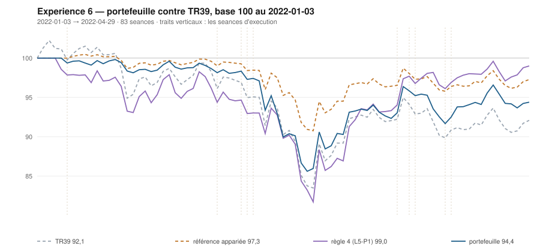

| | |
|---|---|
| Dotation initiale | 10 000,00 € au 2022-01-03 |
| Titres au 2022-04-29 | 6 441,20 € |
| Espèces | 2 998,23 € |
| Lignes détenues | 7 |
| **Total** | **9 439,43 €** |
| Base 100 | **94,39** |
| Référence à exposition appariée, même base | 97,27 |
| **Alpha officiel depuis janvier** | **-2,88 pt** |
| Règle de l'expérience 4 (`L5-P1`), même base | 99,01 |
| TR39, même base | 92,09 |
| Écart depuis janvier | **+2,31 pt** |

### Toutes les positions depuis le début de l'expérience

> Closes comme ouvertes. Aucune séance postérieure au 2022-04-29 n'entre dans ce tableau.

| Société | Prix d'achat | Date d'achat | Prix de vente | Date de vente |
|---|---|---|---|---|
| `CAP.PA` Capgemini | 180,43 € | 2022-01-10 | 181,51 € | 2022-03-30 |
| `EL.PA` EssilorLuxottica | 159,47 € | 2022-01-10 | 153,11 € | 2022-03-30 |
| `RI.PA` Pernod Ricard | 170,35 € | 2022-01-10 | 164,76 € | 2022-03-31 |
| `MC.PA` LVMH | 613,30 € | 2022-02-14 |  |  |
| `BNP.PA` BNP Paribas | 44,65 € | 2022-02-18 |  |  |
| `CS.PA` AXA | 20,20 € | 2022-02-21 |  |  |
| `GLE.PA` Société Générale | 24,40 € | 2022-02-22 |  |  |
| `VIE.PA` Veolia | 22,38 € | 2022-03-28 |  |  |
| `DG.PA` Vinci | 72,98 € | 2022-04-07 |  |  |
| `TTE.PA` TotalEnergies | 35,53 € | 2022-04-08 |  |  |

*10 positions depuis le début, dont 7 encore ouvertes : les deux dernières colonnes restent vides.*

## 4. L'étude chartiste au 2022-04-29

> Une entrée par société de l'univers, sous la figure de canal lue à la clôture du 2022-04-29. La ligne en retrait est **calculée** ; la note qui suit est celle de l'agent `chartiste`, rédigée sans aucune séance postérieure.

### 1. `HO.PA` — Thales

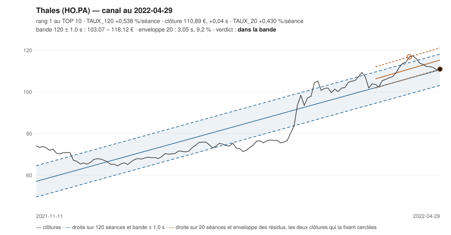

> Rang 1 · TAUX_120 +0,538 %/séance · clôture 110,89 € · bande 103,07 – 118,12 € · écart +0,04 s · TAUX_20 +0,430 %/séance · enveloppe 20 : 3,05 s, 9,2 % · **dans la bande**

- Clôture 110,89 €, exactement au niveau de la droite longue (+0,04 s), bande de 103,07 à 118,12 €.
- Pentes concordantes à la hausse : TAUX_120 +0,538 %/séance, rang 1, comme vingt séances plus tôt ; TAUX_20 +0,430 %/séance, positif depuis 52 séances.
- Enveloppe de 3,05 s, étroite. Son bord bas est la clôture du jour, son bord haut celle du 14 avril (116,80 €).
- L'écart a décru presque sans interruption, de +1,65 s le 14 avril à +0,04 s en neuf séances. Douze des 20 dernières clôtures étaient au-dessus du bord haut de leur canal du jour.
- Verdict : dans la bande.

### 2. `CA.PA` — Carrefour

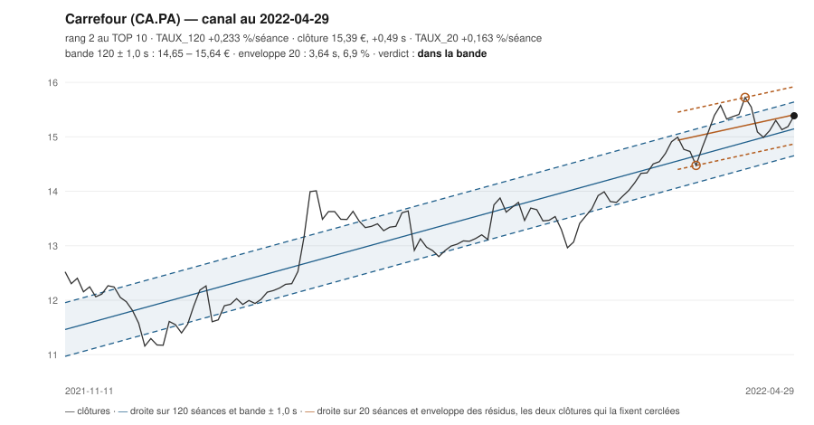

> Rang 2 · TAUX_120 +0,233 %/séance · clôture 15,39 € · bande 14,65 – 15,64 € · écart +0,49 s · TAUX_20 +0,163 %/séance · enveloppe 20 : 3,64 s, 6,9 % · **dans la bande**

- Clôture 15,39 € à +0,49 s, dans une bande étroite de 14,65 à 15,64 €.
- Pentes concordantes à la hausse : TAUX_120 +0,233 %/séance, rang 2, comme vingt séances plus tôt ; TAUX_20 +0,163 %/séance, positif depuis 30 séances.
- Enveloppe de 3,64 s, conforme à l'attendu. Bas le 5 avril (14,47 €), haut le 19 avril (15,72 €).
- La moitié des 20 dernières clôtures était au-dessus du bord haut de leur canal du jour, avec un maximum de +2,12 s le 11 avril. Retour dans la bande le 21 avril, il y a 7 séances.
- Verdict : dans la bande.

### 3. `ORA.PA` — Orange

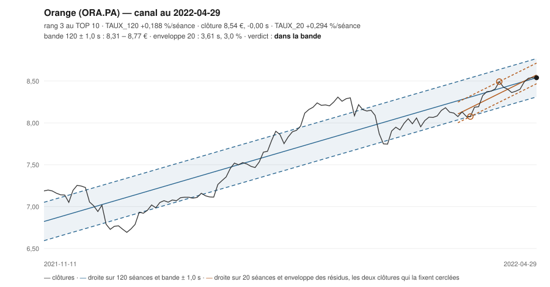

> Rang 3 · TAUX_120 +0,188 %/séance · clôture 8,54 € · bande 8,31 – 8,77 € · écart -0,00 s · TAUX_20 +0,294 %/séance · enveloppe 20 : 3,61 s, 3,0 % · **dans la bande**

- Clôture 8,54 €, sur la droite longue (0,00 s), dans une bande étroite de 8,31 à 8,77 €.
- Pentes concordantes à la hausse : TAUX_120 +0,188 %/séance, rang 3, stable sur vingt séances ; TAUX_20 +0,294 %/séance depuis 24 séances.
- Enveloppe de 3,61 s, soit 3,0 % de E_20 seulement. Bas le 5 avril (8,08 €), haut le 14 avril (8,49 €).
- Dans la bande depuis 43 séances, avec un écart entre −0,77 et +0,45 s sur les 20 dernières.
- Verdict : dans la bande.

### 4. `SAN.PA` — Sanofi

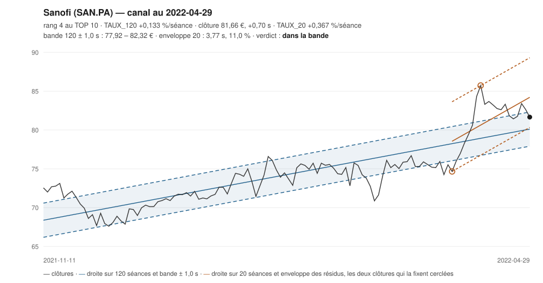

> Rang 4 · TAUX_120 +0,133 %/séance · clôture 81,66 € · bande 77,92 – 82,32 € · écart +0,70 s · TAUX_20 +0,367 %/séance · enveloppe 20 : 3,77 s, 11,0 % · **dans la bande**

- Clôture 81,66 € à +0,70 s, bande de 77,92 à 82,32 €.
- Pentes concordantes à la hausse : TAUX_120 +0,133 %/séance, rang 4 du TOP 10, et TAUX_20 +0,367 %/séance, positif depuis 31 séances.
- Enveloppe de 3,77 s (11,0 % de E_20). Bas à la première séance, le 31 mars (74,66 €), haut le 11 avril (85,73 €).
- Seize des 20 dernières clôtures étaient au-dessus du bord haut, avec un pic à +4,41 s le 11 avril. La clôture du jour revient dans la bande, après +1,23 s hier.
- Verdict : dans la bande.

### 5. `TTE.PA` — TotalEnergies

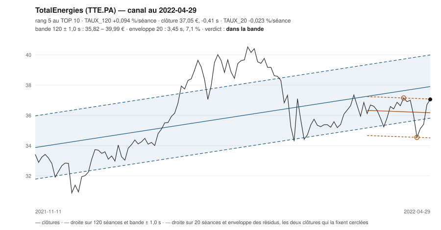

> Rang 5 · TAUX_120 +0,094 %/séance · clôture 37,05 € · bande 35,82 – 39,99 € · écart -0,41 s · TAUX_20 -0,023 %/séance · enveloppe 20 : 3,45 s, 7,1 % · **dans la bande**

- Clôture 37,05 € à −0,41 s, bande de 35,82 à 39,99 €.
- Pentes discordantes : TAUX_120 +0,094 %/séance, rang 5 du TOP 10 depuis 131 séances ; TAUX_20 −0,023 %/séance, négatif depuis 5 séances.
- Enveloppe de 3,45 s, fixée par deux clôtures récentes : 37,15 € le 19 avril, 34,55 € le 25 avril.
- Candidate à cinq séances de la fenêtre : 31 mars, 6, 7 et 8 avril, 22 avril. Huit clôtures sous le bord bas en 20 séances, jusqu'à −1,70 s le 25 avril. Revenue dans la bande depuis 2 séances.
- Verdict : dans la bande.

### 6. `MT.AS` — ArcelorMittal

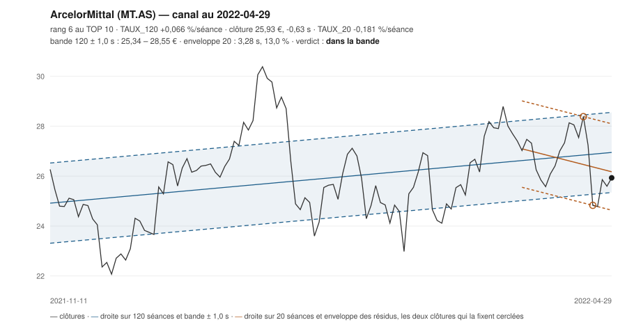

> Rang 6 · TAUX_120 +0,066 %/séance · clôture 25,93 € · bande 25,34 – 28,55 € · écart -0,63 s · TAUX_20 -0,181 %/séance · enveloppe 20 : 3,28 s, 13,0 % · **dans la bande**

- Clôture 25,93 € à −0,63 s, bande de 25,34 à 28,55 €.
- Pentes discordantes : TAUX_120 +0,066 %/séance, rang 6 du TOP 10 depuis 25 séances ; TAUX_20 −0,181 %/séance, négatif depuis 14 séances.
- Enveloppe de 3,28 s (13,0 % de E_20). Ses deux bornes sont récentes et à deux séances d'écart : 28,38 € le 21 avril, 24,83 € le 25 avril.
- Sous le bord bas les 25 et 26 avril, jusqu'à −1,37 s. Revenue dans la bande depuis 3 séances.
- Verdict : dans la bande.

### 7. `AI.PA` — Air Liquide

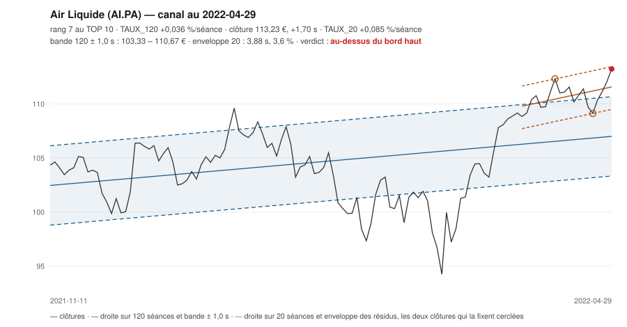

> Rang 7 · TAUX_120 +0,036 %/séance · clôture 113,23 € · bande 103,33 – 110,67 € · écart +1,70 s · TAUX_20 +0,085 %/séance · enveloppe 20 : 3,88 s, 3,6 % · **au-dessus du bord haut**

- Clôture 113,23 €, +1,70 s, au-dessus d'une bande de 103,33 à 110,67 €.
- Pentes concordantes à la hausse : TAUX_120 +0,036 %/séance, rang 7 du TOP 10, où la valeur figure depuis 18 séances (rang 11 vingt séances plus tôt), et TAUX_20 +0,085 %/séance, positif depuis 29 séances.
- Enveloppe de 3,88 s (3,6 % de E_20), à peine plus large que les ~3,7 s attendues. Le haut est fixé par la clôture du 11 avril (112,31 €), le bas par une clôture plus récente, celle du 25 avril (109,12 €).
- 19 des 20 dernières clôtures dépassaient le bord haut de leur canal du jour. Seule exception : le 25 avril, à +0,84 s. La valeur est de nouveau au-dessus depuis 4 séances.
- Verdict : au-dessus du bord haut.

### 8. `DG.PA` — Vinci

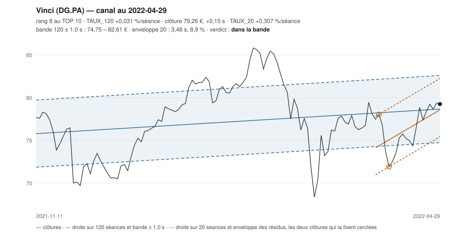

> Rang 8 · TAUX_120 +0,031 %/séance · clôture 79,26 € · bande 74,75 – 82,61 € · écart +0,15 s · TAUX_20 +0,307 %/séance · enveloppe 20 : 3,48 s, 8,9 % · **dans la bande**

- Clôture 79,26 € à +0,15 s, bande de 74,75 à 82,61 €.
- Pentes concordantes à la hausse : TAUX_120 +0,031 %/séance, rang 8 du TOP 10, où elle figure depuis 43 séances ; TAUX_20 +0,307 %/séance, positif depuis 4 séances.
- Enveloppe de 3,48 s. Ses deux bornes sont anciennes : 78,05 € le 1er avril pour le haut, 71,93 € le 6 avril pour le bas.
- Candidate les 5 et 6 avril, sous le bord bas jusqu'à −1,87 s. L'écart est remonté dans la bande dès le 11 avril et reste entre 0,0 et +0,2 s depuis cinq séances.
- Verdict : dans la bande.

### 9. `EN.PA` — Bouygues

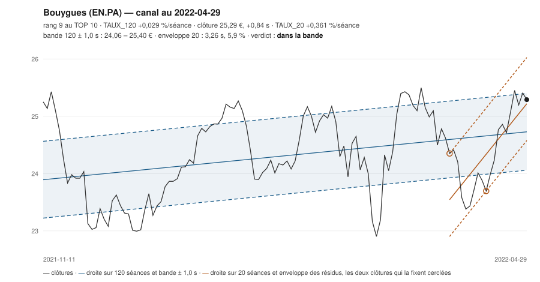

> Rang 9 · TAUX_120 +0,029 %/séance · clôture 25,29 € · bande 24,06 – 25,40 € · écart +0,84 s · TAUX_20 +0,361 %/séance · enveloppe 20 : 3,26 s, 5,9 % · **dans la bande**

- Clôture 25,29 € à +0,84 s, bande étroite de 24,06 à 25,40 €.
- Pentes concordantes à la hausse : TAUX_120 +0,029 %/séance, rang 9, entrée au TOP 10 il y a 4 séances ; TAUX_20 +0,361 %/séance depuis 5 séances.
- Enveloppe de 3,26 s. Son haut est à la première séance de la fenêtre, le 31 mars (24,35 €), son bas au 13 avril (23,70 €).
- Au-dessus du bord haut les 26 et 28 avril (+1,24 s au plus). La clôture du jour est revenue dans la bande.
- Verdict : dans la bande.

### 10. `VIV.PA` — Vivendi

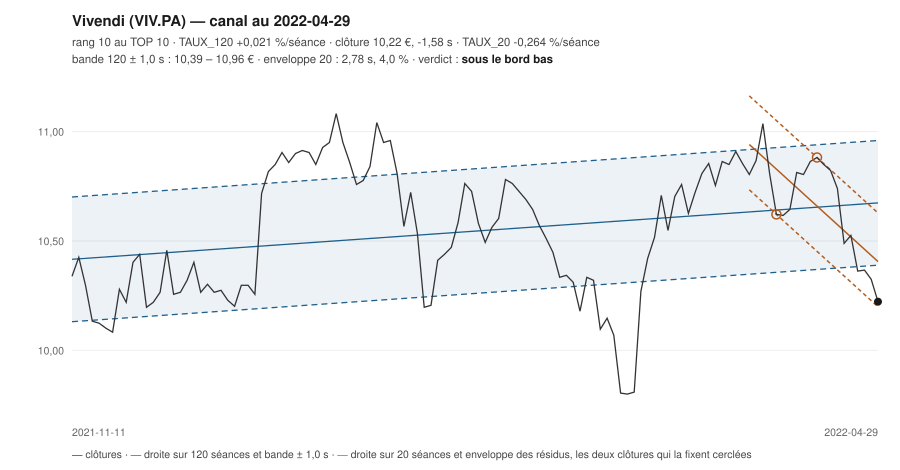

> Rang 10 · TAUX_120 +0,021 %/séance · clôture 10,22 € · bande 10,39 – 10,96 € · écart -1,58 s · TAUX_20 -0,264 %/séance · enveloppe 20 : 2,78 s, 4,0 % · **sous le bord bas**

- Clôture 10,22 €, −1,58 s, sous une bande étroite de 10,39 à 10,96 €.
- Pentes discordantes : TAUX_120 +0,021 %/séance, rang 10, dernière place du TOP 10 ; TAUX_20 −0,264 %/séance, négatif depuis 9 séances.
- Enveloppe étroite, 2,78 s pour ~3,7 s attendues. Bas le 6 avril (10,62 €), haut le 14 avril (10,88 €).
- La bande a été traversée de haut en bas en 14 séances. Clôture à +1,16 s le 4 avril, sous le bord bas depuis le 26 avril. L'écart du jour est le plus bas des 20 séances.
- Verdict : sous le bord bas, sans être candidate. La valeur est bien au TOP 10, mais la pente courte est négative.

### 11. `CS.PA` — AXA

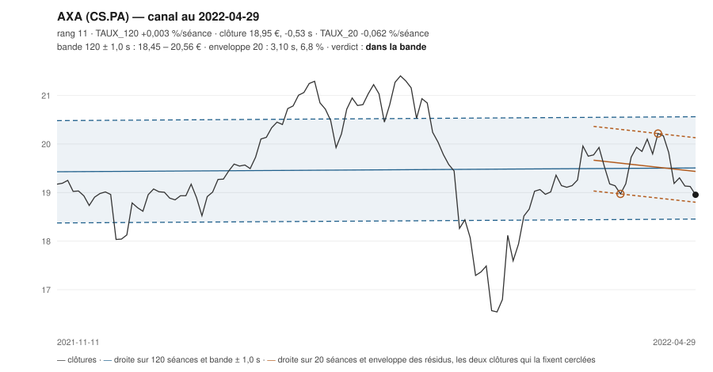

> Rang 11 · TAUX_120 +0,003 %/séance · clôture 18,95 € · bande 18,45 – 20,56 € · écart -0,53 s · TAUX_20 -0,062 %/séance · enveloppe 20 : 3,10 s, 6,8 % · **dans la bande**

- Clôture 18,95 € à −0,53 s, bande de 18,45 à 20,56 €.
- Pente longue à peine positive, TAUX_120 +0,003 %/séance : rang 11, premier hors du TOP 10, dont la valeur est sortie depuis 4 séances (rang 7 vingt séances plus tôt). Pente courte négative, TAUX_20 −0,062 %/séance.
- Enveloppe de 3,10 s, plus étroite que l'attendu. Bas le 7 avril (18,97 €), haut le 20 avril (20,22 €).
- Dans la bande depuis 31 séances. Sur les 20 dernières, l'écart est resté entre −0,59 et +0,61 s.
- Verdict : dans la bande.

### `AIR.PA` — Airbus

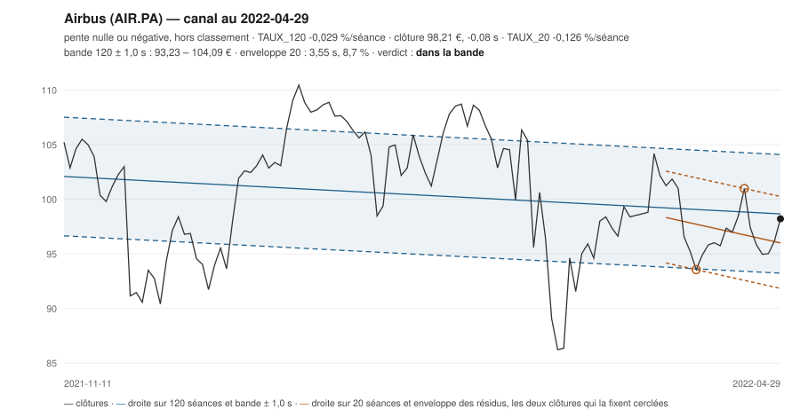

> Hors classement · TAUX_120 -0,029 %/séance · clôture 98,21 € · bande 93,23 – 104,09 € · écart -0,08 s · TAUX_20 -0,126 %/séance · enveloppe 20 : 3,55 s, 8,7 % · **dans la bande**

- Clôture 98,21 €, quasiment sur la droite longue (−0,08 s), bande de 93,23 à 104,09 €.
- Pente longue légèrement négative, TAUX_120 −0,029 %/séance, hors classement. La pente courte va dans le même sens, plus nettement : TAUX_20 −0,126 %/séance depuis 13 séances.
- Enveloppe de 3,55 s, conforme à l'ordre de grandeur attendu. Elle est fixée au milieu de la fenêtre : bas le 7 avril (93,56 €), haut le 21 avril (100,99 €).
- Une seule clôture sous le bord bas en 20 séances, le 7 avril à −1,23 s. Depuis 14 séances, l'écart oscille entre −0,7 et +0,3 s.
- Verdict : dans la bande.

### `SAF.PA` — Safran

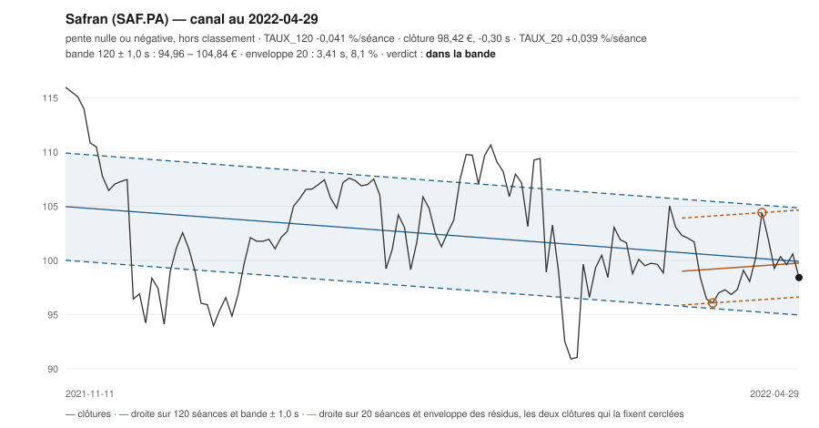

> Hors classement · TAUX_120 -0,041 %/séance · clôture 98,42 € · bande 94,96 – 104,84 € · écart -0,30 s · TAUX_20 +0,039 %/séance · enveloppe 20 : 3,41 s, 8,1 % · **dans la bande**

- Clôture 98,42 € à −0,30 s, bande de 94,96 à 104,84 €.
- Pente longue négative, TAUX_120 −0,041 %/séance : la valeur est hors du TOP 10 depuis 311 séances. Pente courte à peine positive, TAUX_20 +0,039 %/séance, depuis 2 séances.
- Enveloppe de 3,41 s. Bas le 7 avril (96,07 €), haut le 21 avril (104,41 €).
- Dans la bande depuis 36 séances, avec un écart entre −0,76 et +0,95 s sur les 20 dernières.
- Verdict : dans la bande.

### `BN.PA` — Danone

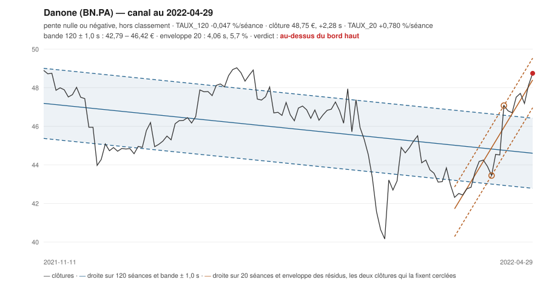

> Hors classement · TAUX_120 -0,047 %/séance · clôture 48,75 € · bande 42,79 – 46,42 € · écart +2,28 s · TAUX_20 +0,780 %/séance · enveloppe 20 : 4,06 s, 5,7 % · **au-dessus du bord haut**

- Clôture 48,75 €, +2,28 s, nettement au-dessus d'une bande de 42,79 à 46,42 €.
- Pentes discordantes : canal long en légère baisse, TAUX_120 −0,047 %/séance, jamais classé sur les 342 séances évaluées ; canal court en forte hausse, TAUX_20 +0,780 %/séance depuis 9 séances.
- Enveloppe de 4,06 s, plus large que les ~3,7 s attendues. Ses deux bornes sont à trois séances d'écart en milieu de fenêtre : 43,45 € le 13 avril, 47,07 € le 20 avril.
- La bande a été traversée de bas en haut en 10 séances. Dernière clôture sous le bord bas le 4 avril, première au-dessus du bord haut le 20 avril. L'écart du jour est le plus haut des 20 séances.
- Verdict : au-dessus du bord haut.

### `PUB.PA` — Publicis

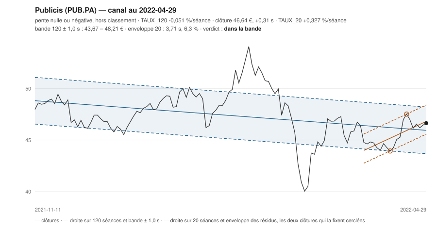

> Hors classement · TAUX_120 -0,051 %/séance · clôture 46,64 € · bande 43,67 – 48,21 € · écart +0,31 s · TAUX_20 +0,327 %/séance · enveloppe 20 : 3,71 s, 6,3 % · **dans la bande**

- Clôture 46,64 € à +0,31 s, bande de 43,67 à 48,21 €.
- Pentes discordantes : TAUX_120 −0,051 %/séance, hors classement ; TAUX_20 +0,327 %/séance, positif depuis 7 séances.
- Enveloppe de 3,71 s, au niveau attendu, fixée par le 12 avril (bas, 43,94 €) et le 21 avril (haut, 47,52 €).
- Huit clôtures sous le bord bas en 20 séances, jusqu'à −1,24 s le 7 avril. Dans la bande depuis 11 séances.
- Verdict : dans la bande.

### `VIE.PA` — Veolia

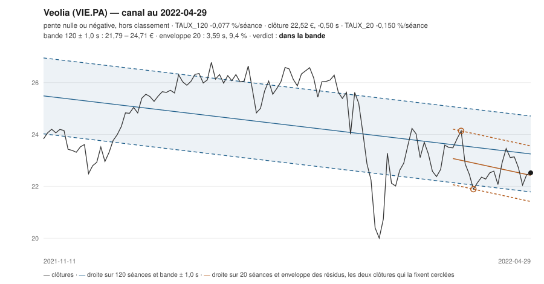

> Hors classement · TAUX_120 -0,077 %/séance · clôture 22,52 € · bande 21,79 – 24,71 € · écart -0,50 s · TAUX_20 -0,150 %/séance · enveloppe 20 : 3,59 s, 9,4 % · **dans la bande**

- Clôture 22,52 € à −0,50 s, bande de 21,79 à 24,71 €.
- Deux pentes négatives. TAUX_120 est à −0,077 %/séance : la valeur est hors du TOP 10 depuis 18 séances, alors qu'elle y était au rang 10 vingt séances plus tôt. TAUX_20 est à −0,150 %/séance.
- Enveloppe de 3,59 s, fixée tôt dans la fenêtre : haut le 4 avril (24,14 €), bas le 7 avril (21,89 €).
- Sept clôtures sous le bord bas en 20 séances, jusqu'à −1,61 s le 7 avril. Dans la bande depuis 8 séances.
- Verdict : dans la bande.

### `RI.PA` — Pernod Ricard

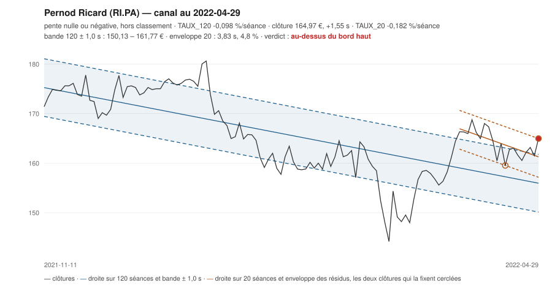

> Hors classement · TAUX_120 -0,098 %/séance · clôture 164,97 € · bande 150,13 – 161,77 € · écart +1,55 s · TAUX_20 -0,182 %/séance · enveloppe 20 : 3,83 s, 4,8 % · **au-dessus du bord haut**

- Clôture 164,97 €, +1,55 s, au-dessus d'une bande de 150,13 à 161,77 €.
- Deux pentes négatives : TAUX_120 −0,098 %/séance, hors classement, et TAUX_20 −0,182 %/séance.
- Enveloppe de 3,83 s. Son haut est la clôture du jour, son bas celle du 19 avril (159,54 €).
- Quinze des 20 dernières clôtures étaient au-dessus du bord haut de leur canal du jour. La valeur y repasse aujourd'hui, après +0,97 s hier.
- Verdict : au-dessus du bord haut.

### `TEP.PA` — Teleperformance

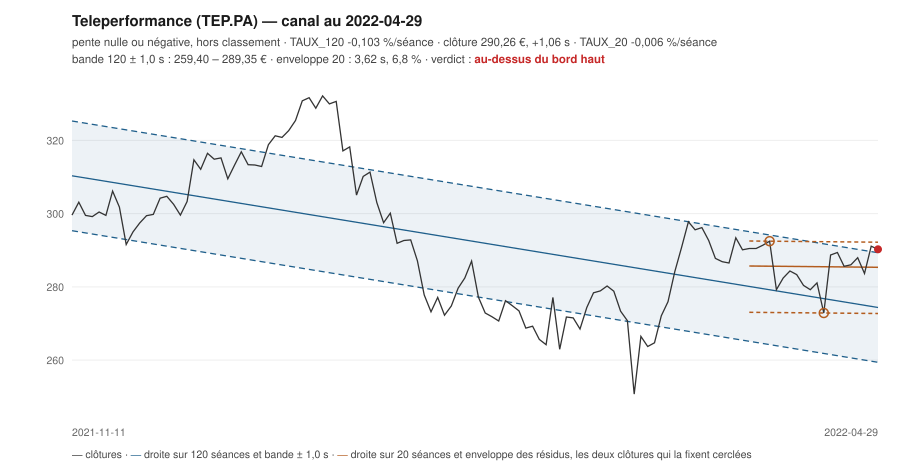

> Hors classement · TAUX_120 -0,103 %/séance · clôture 290,26 € · bande 259,40 – 289,35 € · écart +1,06 s · TAUX_20 -0,006 %/séance · enveloppe 20 : 3,62 s, 6,8 % · **au-dessus du bord haut**

- Clôture 290,26 €, +1,06 s, juste au-dessus d'une bande de 259,40 à 289,35 €.
- Pente longue négative, TAUX_120 −0,103 %/séance, hors classement. La pente courte est presque plate mais du même signe, TAUX_20 −0,006 %/séance.
- Enveloppe de 3,62 s, conforme à l'attendu. Haut le 5 avril (292,48 €), bas le 19 avril (272,86 €).
- Au-dessus du bord haut depuis 2 séances ; le 19 avril, l'écart était de −0,11 s.
- Verdict : au-dessus du bord haut.

### `ENGI.PA` — Engie

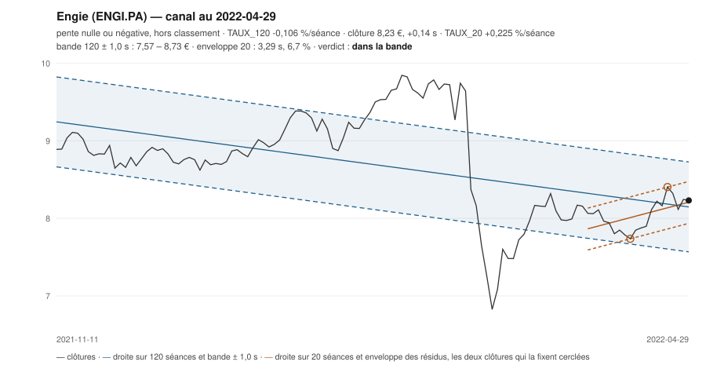

> Hors classement · TAUX_120 -0,106 %/séance · clôture 8,23 € · bande 7,57 – 8,73 € · écart +0,14 s · TAUX_20 +0,225 %/séance · enveloppe 20 : 3,29 s, 6,7 % · **dans la bande**

- Clôture 8,23 € à +0,14 s, bande de 7,57 à 8,73 €.
- Pentes discordantes. La pente longue est négative, TAUX_120 −0,106 %/séance ; dernière présence au TOP 10 il y a 25 séances. La pente courte est positive, TAUX_20 +0,225 %/séance, depuis 5 séances.
- Enveloppe de 3,29 s, un peu étroite. Bas le 12 avril (7,74 €), haut plus récent le 25 avril (8,40 €).
- Sept clôtures sous le bord bas en 20 séances, jusqu'à −1,17 s le 7 avril. Dans la bande depuis 11 séances.
- Verdict : dans la bande.

### `CAP.PA` — Capgemini

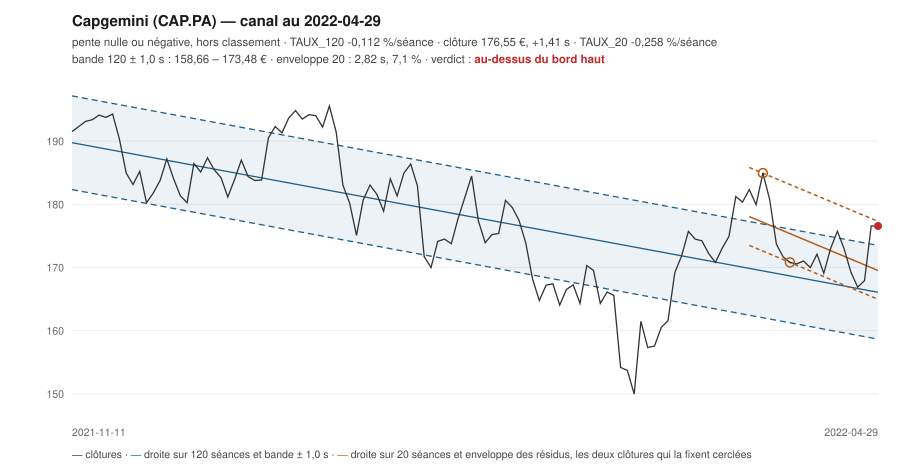

> Hors classement · TAUX_120 -0,112 %/séance · clôture 176,55 € · bande 158,66 – 173,48 € · écart +1,41 s · TAUX_20 -0,258 %/séance · enveloppe 20 : 2,82 s, 7,1 % · **au-dessus du bord haut**

- Clôture 176,55 €, +1,41 s, au-dessus d'une bande de 158,66 à 173,48 €.
- Deux pentes négatives, TAUX_120 −0,112 %/séance hors classement et TAUX_20 −0,258 %/séance depuis 11 séances. La clôture dépasse le bord haut d'un canal long qui descend.
- Enveloppe étroite, 2,82 s, fixée tout au début de la fenêtre : 184,93 € le 4 avril pour le haut, 170,79 € le 8 avril pour le bas.
- Au-dessus du bord haut depuis 2 séances, après un creux à +0,13 s le 26 avril.
- Verdict : au-dessus du bord haut.

### `SGO.PA` — Saint-Gobain

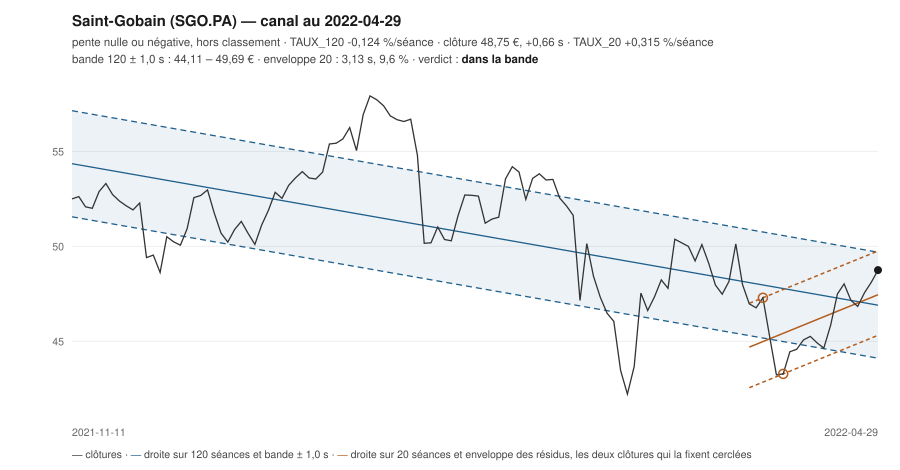

> Hors classement · TAUX_120 -0,124 %/séance · clôture 48,75 € · bande 44,11 – 49,69 € · écart +0,66 s · TAUX_20 +0,315 %/séance · enveloppe 20 : 3,13 s, 9,6 % · **dans la bande**

- Clôture 48,75 € à +0,66 s, bande de 44,11 à 49,69 €.
- Pentes discordantes : TAUX_120 −0,124 %/séance, hors classement ; TAUX_20 +0,315 %/séance, positif depuis 2 séances.
- Enveloppe de 3,13 s, fixée tôt dans la fenêtre : haut le 4 avril (47,29 €), bas le 7 avril (43,28 €).
- Neuf clôtures sous le bord bas en 20 séances, jusqu'à −2,10 s le 6 avril. Dans la bande depuis 8 séances, avec aujourd'hui l'écart le plus haut de la période.
- Verdict : dans la bande.

### `MC.PA` — LVMH

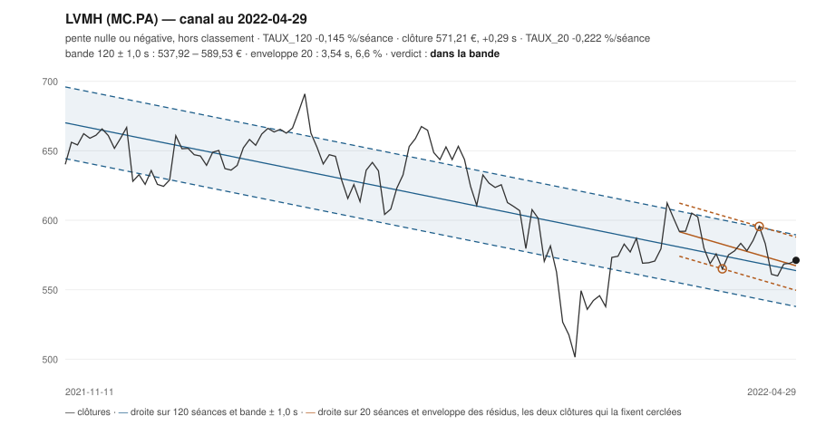

> Hors classement · TAUX_120 -0,145 %/séance · clôture 571,21 € · bande 537,92 – 589,53 € · écart +0,29 s · TAUX_20 -0,222 %/séance · enveloppe 20 : 3,54 s, 6,6 % · **dans la bande**

- Clôture 571,21 € à +0,29 s, bande de 537,92 à 589,53 €.
- Pentes concordantes à la baisse : TAUX_120 −0,145 %/séance, hors classement, et TAUX_20 −0,222 %/séance depuis 11 séances.
- Enveloppe de 3,54 s, proche de l'attendu. Bas le 11 avril (565,08 €), haut le 21 avril (595,62 €).
- Dans la bande depuis 29 séances ; sur 20 séances, l'écart n'est pas sorti de −0,52 à +0,87 s.
- Verdict : dans la bande.

### `EL.PA` — EssilorLuxottica

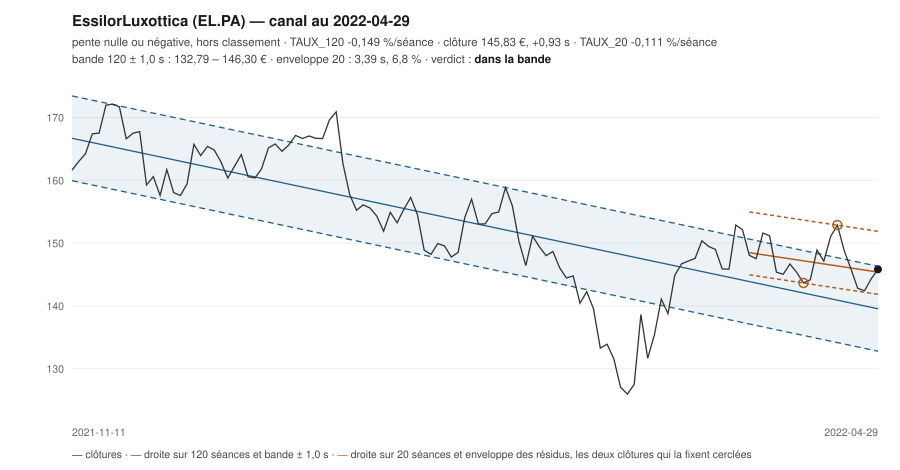

> Hors classement · TAUX_120 -0,149 %/séance · clôture 145,83 € · bande 132,79 – 146,30 € · écart +0,93 s · TAUX_20 -0,111 %/séance · enveloppe 20 : 3,39 s, 6,8 % · **dans la bande**

- Clôture 145,83 € à +0,93 s, à 0,47 € sous le bord haut d'une bande de 132,79 à 146,30 €.
- Pentes concordantes à la baisse : TAUX_120 −0,149 %/séance, hors classement, TAUX_20 −0,111 %/séance depuis 12 séances.
- Enveloppe de 3,39 s, fixée par le 12 avril (bas, 143,65 €) et le 21 avril (haut, 152,86 €).
- Sept clôtures au-dessus du bord haut en 20 séances, jusqu'à +1,93 s le 21 avril. Retour dans la bande le 25 avril, puis remontée de +0,39 à +0,93 s.
- Verdict : dans la bande.

### `SU.PA` — Schneider Electric

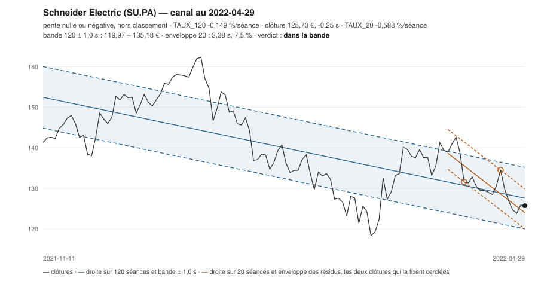

> Hors classement · TAUX_120 -0,149 %/séance · clôture 125,70 € · bande 119,97 – 135,18 € · écart -0,25 s · TAUX_20 -0,588 %/séance · enveloppe 20 : 3,38 s, 7,5 % · **dans la bande**

- Clôture 125,70 € à −0,25 s, bande de 119,97 à 135,18 €.
- Deux pentes négatives : TAUX_120 −0,149 %/séance, hors classement, et TAUX_20 −0,588 %/séance.
- Enveloppe de 3,38 s. Bas le 6 avril (131,58 €), haut le 21 avril (134,50 €).
- Dans la bande depuis 34 séances, avec un écart entre −0,60 et +0,77 s sur les 20 dernières.
- Verdict : dans la bande.

### `BNP.PA` — BNP Paribas

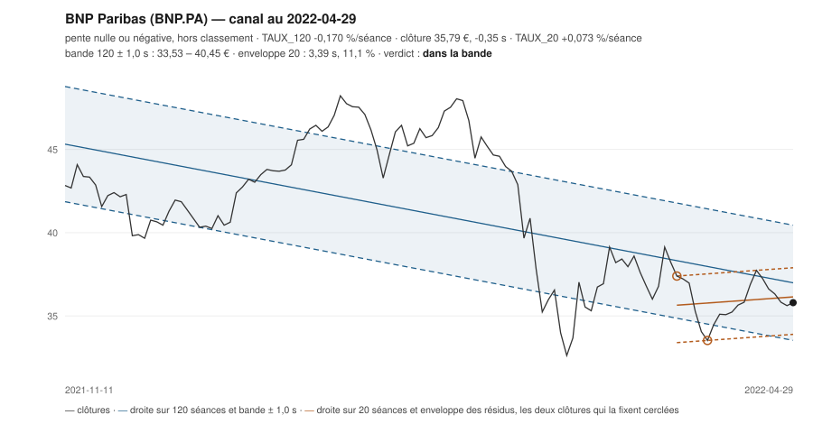

> Hors classement · TAUX_120 -0,170 %/séance · clôture 35,79 € · bande 33,53 – 40,45 € · écart -0,35 s · TAUX_20 +0,073 %/séance · enveloppe 20 : 3,39 s, 11,1 % · **dans la bande**

- Clôture 35,79 € à −0,35 s, bande de 33,53 à 40,45 €.
- Canal long en baisse, TAUX_120 −0,170 %/séance, hors classement. Le canal court vient de passer en positif, TAUX_20 +0,073 %/séance, ce jour seulement : discordance ténue.
- Enveloppe de 3,39 s, sous les ~3,7 s attendues. Ses deux bornes sont anciennes : haut à la première séance de la fenêtre, le 31 mars (37,39 €), bas le 7 avril (33,53 €).
- Six clôtures sous le bord bas en 20 séances, jusqu'à −1,68 s le 7 avril. Dans la bande depuis 11 séances.
- Verdict : dans la bande.

### `ML.PA` — Michelin

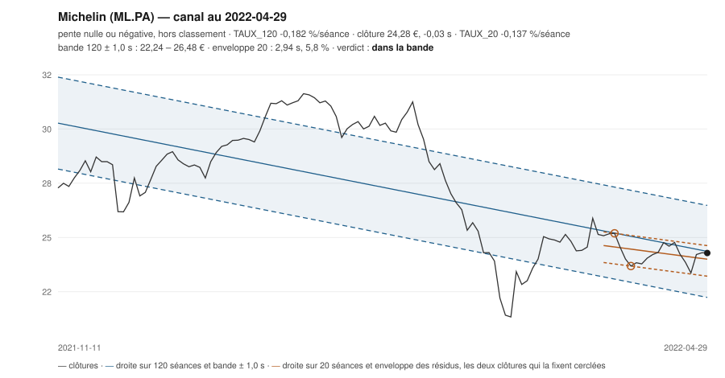

> Hors classement · TAUX_120 -0,182 %/séance · clôture 24,28 € · bande 22,24 – 26,48 € · écart -0,03 s · TAUX_20 -0,137 %/séance · enveloppe 20 : 2,94 s, 5,8 % · **dans la bande**

- Clôture 24,28 € sur la droite longue (−0,03 s), bande de 22,24 à 26,48 €.
- Deux pentes négatives, TAUX_120 −0,182 %/séance, hors classement, et TAUX_20 −0,137 %/séance depuis 14 séances.
- Enveloppe étroite, 2,94 s, fixée en début de fenêtre : haut le 4 avril (25,19 €), bas le 7 avril (23,68 €).
- Les 20 dernières clôtures sont toutes sous la droite de leur canal du jour, entre −0,98 et −0,03 s, sans atteindre le bord bas. L'écart du jour est le plus haut de la période.
- Verdict : dans la bande.

### `LR.PA` — Legrand

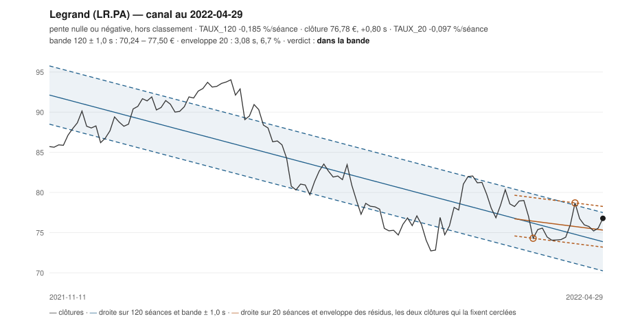

> Hors classement · TAUX_120 -0,185 %/séance · clôture 76,78 € · bande 70,24 – 77,50 € · écart +0,80 s · TAUX_20 -0,097 %/séance · enveloppe 20 : 3,08 s, 6,7 % · **dans la bande**

- Clôture 76,78 € à +0,80 s, bande de 70,24 à 77,50 €.
- Deux pentes négatives : TAUX_120 −0,185 %/séance, hors classement, TAUX_20 −0,097 %/séance depuis 16 séances.
- Enveloppe de 3,08 s, plus étroite que l'attendu. Bas le 6 avril (74,30 €), haut le 21 avril (78,70 €).
- Dans la bande depuis 33 séances, avec un écart compris entre −0,73 et +0,97 s sur les 20 dernières.
- Verdict : dans la bande.

### `OR.PA` — L'Oréal

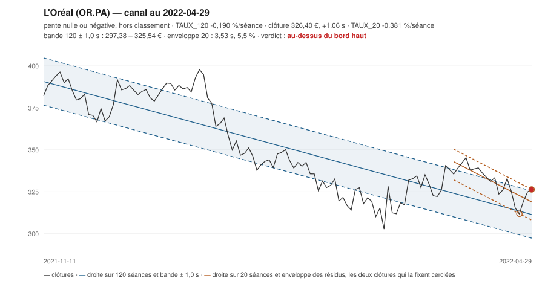

> Hors classement · TAUX_120 -0,190 %/séance · clôture 326,40 € · bande 297,38 – 325,54 € · écart +1,06 s · TAUX_20 -0,381 %/séance · enveloppe 20 : 3,53 s, 5,5 % · **au-dessus du bord haut**

- Clôture 326,40 €, +1,06 s, juste au-dessus d'une bande de 297,38 à 325,54 €.
- Pentes concordantes à la baisse : TAUX_120 −0,190 %/séance, hors classement, TAUX_20 −0,381 %/séance.
- Enveloppe de 3,53 s, fixée par deux clôtures récentes : le bas le 26 avril (311,90 €), le haut par la clôture du jour.
- L'écart est passé de −0,06 s le 26 avril à +1,06 s en trois séances. Neuf des 20 dernières clôtures dépassaient le bord haut de leur canal du jour, jusqu'à +1,35 s le 5 avril ; la précédente date du 21 avril.
- Verdict : au-dessus du bord haut.

### `ERF.PA` — Eurofins Scientific

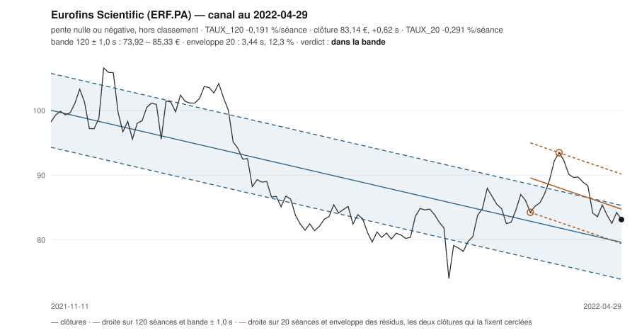

> Hors classement · TAUX_120 -0,191 %/séance · clôture 83,14 € · bande 73,92 – 85,33 € · écart +0,62 s · TAUX_20 -0,291 %/séance · enveloppe 20 : 3,44 s, 12,3 % · **dans la bande**

- Clôture 83,14 € à +0,62 s, bande large de 73,92 à 85,33 €.
- Pentes concordantes à la baisse : TAUX_120 −0,191 %/séance, hors classement, TAUX_20 −0,291 %/séance.
- Enveloppe de 3,44 s (12,3 % de E_20). Ses deux bornes sont anciennes : bas à la première séance, le 31 mars (84,25 €), haut le 8 avril (93,47 €).
- Douze clôtures au-dessus du bord haut en 20 séances, jusqu'à +2,48 s le 8 avril. Dans la bande depuis le 21 avril, soit 7 séances.
- Verdict : dans la bande.

### `STLAP.PA` — Stellantis

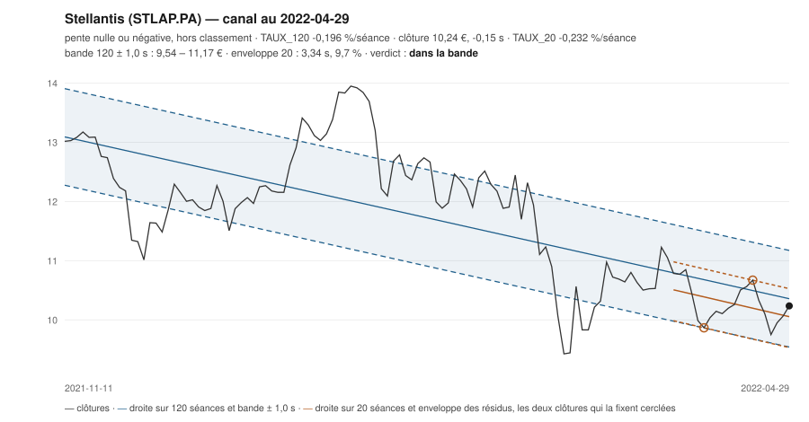

> Hors classement · TAUX_120 -0,196 %/séance · clôture 10,24 € · bande 9,54 – 11,17 € · écart -0,15 s · TAUX_20 -0,232 %/séance · enveloppe 20 : 3,34 s, 9,7 % · **dans la bande**

- Clôture 10,24 € à −0,15 s, bande de 9,54 à 11,17 €.
- Deux pentes négatives, TAUX_120 −0,196 %/séance, hors classement, et TAUX_20 −0,232 %/séance depuis 14 séances.
- Enveloppe de 3,34 s. Bas le 7 avril (9,87 €), haut le 21 avril (10,67 €).
- Trois clôtures sous le bord bas, jusqu'à −1,31 s le 7 avril. Dans la bande depuis 13 séances.
- Verdict : dans la bande.

### `ACA.PA` — Crédit Agricole

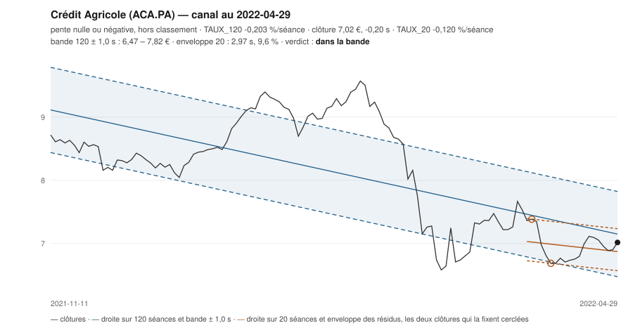

> Hors classement · TAUX_120 -0,203 %/séance · clôture 7,02 € · bande 6,47 – 7,82 € · écart -0,20 s · TAUX_20 -0,120 %/séance · enveloppe 20 : 2,97 s, 9,6 % · **dans la bande**

- Clôture 7,02 € à −0,20 s de la droite longue, dans une bande qui va de 6,47 à 7,82 €.
- Les deux pentes descendent ensemble : TAUX_120 −0,203 %/séance, hors classement, et TAUX_20 −0,120 %/séance, négatif depuis 14 séances.
- Enveloppe des 20 résidus étroite, 2,97 s pour ~3,7 s attendues. Ses deux bornes datent du début de fenêtre : le haut au 1er avril (7,38 €), le bas au 7 avril (6,69 €).
- Sept des vingt dernières clôtures étaient sous le bord bas de leur canal du jour, jusqu'à −1,45 s le 7 avril. Retour dans la bande le 14 avril, il y a 10 séances.
- Verdict : dans la bande.

### `STMPA.PA` — STMicroelectronics

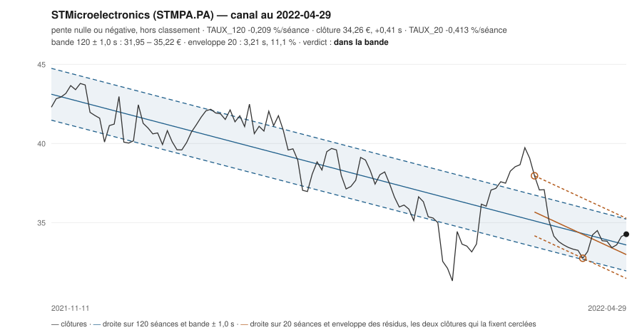

> Hors classement · TAUX_120 -0,209 %/séance · clôture 34,26 € · bande 31,95 – 35,22 € · écart +0,41 s · TAUX_20 -0,413 %/séance · enveloppe 20 : 3,21 s, 11,1 % · **dans la bande**

- Clôture 34,26 € à +0,41 s, bande de 31,95 à 35,22 €.
- Pentes concordantes à la baisse : TAUX_120 −0,209 %/séance, hors classement, TAUX_20 −0,413 %/séance depuis 14 séances.
- Enveloppe de 3,21 s (11,1 % de E_20). Haut à la première séance, le 31 mars (37,96 €), bas le 14 avril (32,75 €).
- Une seule clôture sous le bord bas en 20 séances, le 14 avril à −1,07 s. Dans la bande depuis 9 séances.
- Verdict : dans la bande.

### `GLE.PA` — Société Générale

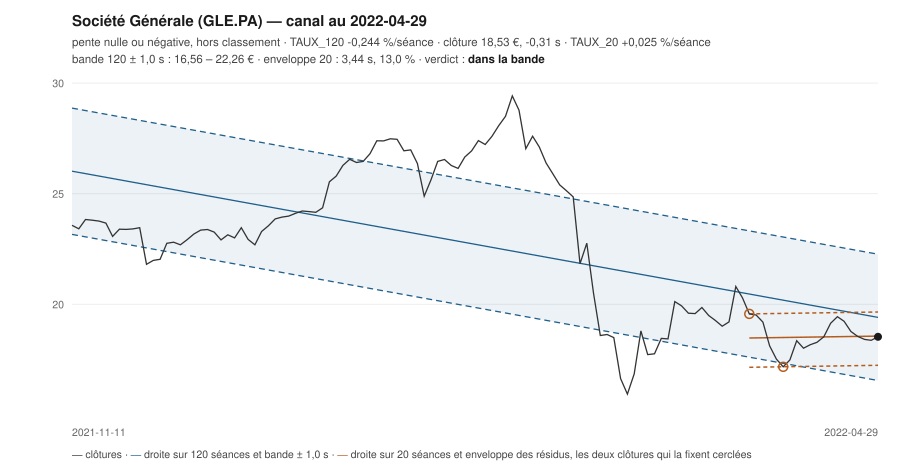

> Hors classement · TAUX_120 -0,244 %/séance · clôture 18,53 € · bande 16,56 – 22,26 € · écart -0,31 s · TAUX_20 +0,025 %/séance · enveloppe 20 : 3,44 s, 13,0 % · **dans la bande**

- Clôture 18,53 € à −0,31 s, bande de 16,56 à 22,26 €.
- Canal long en baisse, TAUX_120 −0,244 %/séance, hors classement. Le canal court passe tout juste en positif ce jour, TAUX_20 +0,025 %/séance.
- Enveloppe de 3,44 s, fixée en tout début de fenêtre : haut le 31 mars (19,57 €), bas le 7 avril (17,18 €).
- Quatre clôtures sous le bord bas, jusqu'à −1,47 s le 7 avril. Depuis 13 séances dans la bande, l'écart ne quitte pas l'intervalle de −0,4 à −0,2 s sur les huit dernières.
- Verdict : dans la bande.

### `KER.PA` — Kering

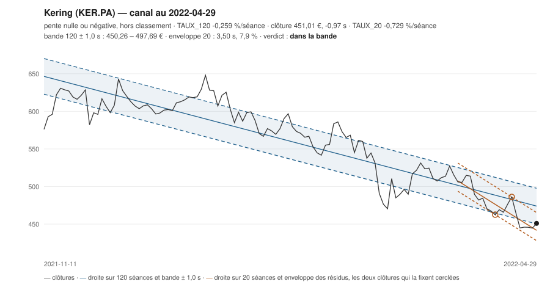

> Hors classement · TAUX_120 -0,259 %/séance · clôture 451,01 € · bande 450,26 – 497,69 € · écart -0,97 s · TAUX_20 -0,729 %/séance · enveloppe 20 : 3,50 s, 7,9 % · **dans la bande**

- Clôture 451,01 € à −0,97 s, à 0,75 € au-dessus du bord bas d'une bande de 450,26 à 497,69 €.
- Pentes concordantes à la baisse : TAUX_120 −0,259 %/séance, hors classement, et TAUX_20 −0,729 %/séance depuis 15 séances.
- Enveloppe de 3,50 s, fixée par le 13 avril (bas, 462,62 €) et le 21 avril (haut, 486,17 €).
- Treize des 20 dernières clôtures étaient sous le bord bas, jusqu'à −1,68 s le 25 avril. Encore à −1,34 s hier, la clôture du jour repasse juste dans la bande.
- Verdict : dans la bande.

### `WLN.PA` — Worldline

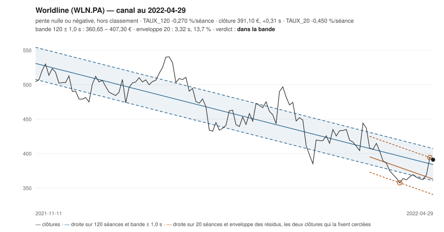

> Hors classement · TAUX_120 -0,270 %/séance · clôture 391,10 € · bande 360,65 – 407,30 € · écart +0,31 s · TAUX_20 -0,450 %/séance · enveloppe 20 : 3,32 s, 13,7 % · **dans la bande**

- Clôture 391,10 € à +0,31 s, bande de 360,65 à 407,30 €.
- Pentes concordantes à la baisse. TAUX_120 est à −0,270 %/séance : la valeur n'a été classée à aucune des 342 séances évaluées. TAUX_20 est à −0,450 %/séance depuis 17 séances.
- Enveloppe de 3,32 s (13,7 % de E_20). Bas le 13 avril (357,62 €), haut récent le 28 avril (394,31 €).
- Onze clôtures sous le bord bas en 20 séances, jusqu'à −2,08 s le 13 avril. En deux séances, l'écart est passé de −1,11 s le 26 avril à +0,38 s le 28 avril.
- Verdict : dans la bande.

### `DSY.PA` — Dassault Systèmes

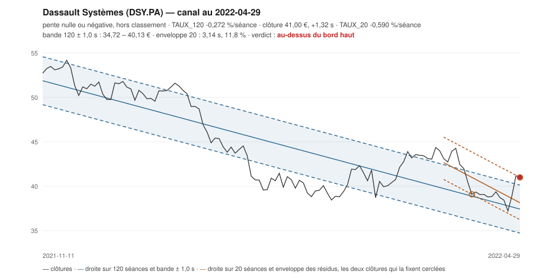

> Hors classement · TAUX_120 -0,272 %/séance · clôture 41,00 € · bande 34,72 – 40,13 € · écart +1,32 s · TAUX_20 -0,590 %/séance · enveloppe 20 : 3,14 s, 11,8 % · **au-dessus du bord haut**

- Clôture 41,00 €, +1,32 s, au-dessus d'une bande de 34,72 à 40,13 €.
- Deux pentes franchement négatives : TAUX_120 −0,272 %/séance, hors classement, et TAUX_20 −0,590 %/séance, depuis 13 séances.
- Enveloppe de 3,14 s, sous les ~3,7 s attendues. Son bord haut est fixé par la clôture du jour elle-même, son bord bas par le 11 avril (39,09 €).
- Au-dessus du bord haut depuis 2 séances. Le 26 avril, l'écart était encore de −0,10 s.
- Verdict : au-dessus du bord haut.

### `RMS.PA` — Hermès International

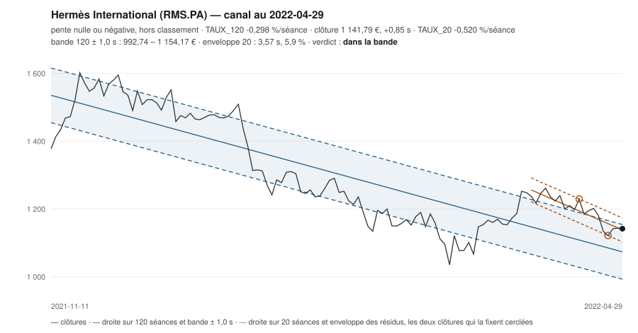

> Hors classement · TAUX_120 -0,298 %/séance · clôture 1 141,79 € · bande 992,74 – 1 154,17 € · écart +0,85 s · TAUX_20 -0,520 %/séance · enveloppe 20 : 3,57 s, 5,9 % · **dans la bande**

- Clôture 1 141,79 € à +0,85 s, bande de 992,74 à 1 154,17 €.
- Pentes concordantes à la baisse : TAUX_120 −0,298 %/séance, hors classement, et TAUX_20 −0,520 %/séance.
- Enveloppe de 3,57 s. Haut le 14 avril (1 229,62 €), bas plus récent le 26 avril (1 121,58 €).
- Cinq clôtures au-dessus du bord haut en 20 séances, au plus +1,28 s le 14 avril. Dans la bande depuis 6 séances.
- Verdict : dans la bande.

### `RNO.PA` — Renault

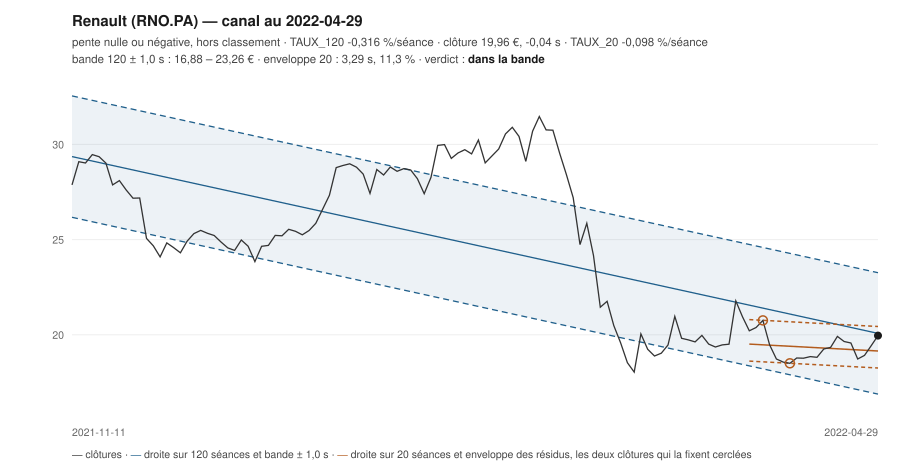

> Hors classement · TAUX_120 -0,316 %/séance · clôture 19,96 € · bande 16,88 – 23,26 € · écart -0,04 s · TAUX_20 -0,098 %/séance · enveloppe 20 : 3,29 s, 11,3 % · **dans la bande**

- Clôture 19,96 € sur la droite longue (−0,04 s), bande large de 16,88 à 23,26 €.
- Deux pentes négatives : TAUX_120 −0,316 %/séance, hors classement, et TAUX_20 −0,098 %/séance.
- Enveloppe de 3,29 s, fixée en début de fenêtre : haut le 4 avril (20,76 €), bas le 8 avril (18,50 €).
- Cinq clôtures sous le bord bas, jusqu'à −1,23 s le 6 avril. Depuis, l'écart est remonté de −0,8 à −0,04 s en dix séances, le plus haut de la période.
- Verdict : dans la bande.

### `ALO.PA` — Alstom

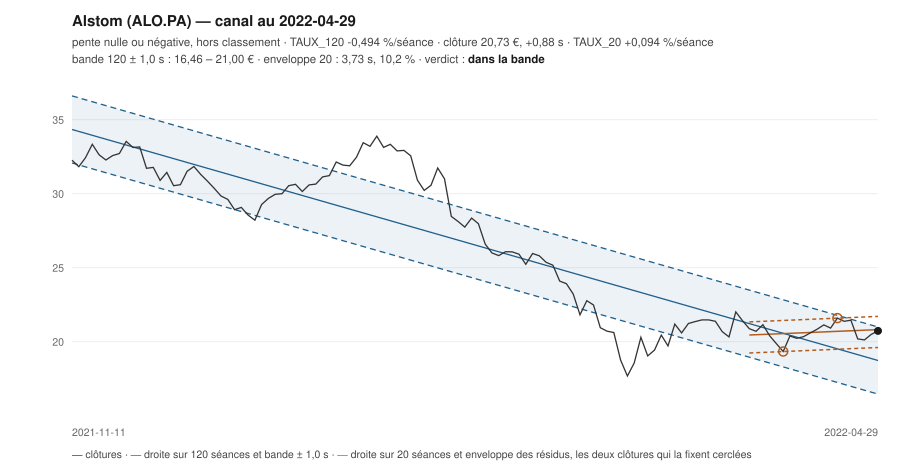

> Hors classement · TAUX_120 -0,494 %/séance · clôture 20,73 € · bande 16,46 – 21,00 € · écart +0,88 s · TAUX_20 +0,094 %/séance · enveloppe 20 : 3,73 s, 10,2 % · **dans la bande**

- Clôture 20,73 € à +0,88 s, dans le haut d'une bande de 16,46 à 21,00 €.
- Pentes discordantes. Le canal long descend nettement, TAUX_120 −0,494 %/séance : la valeur n'a été classée à aucune des 342 séances évaluées. Le canal court monte, TAUX_20 +0,094 %/séance, mais depuis 2 séances seulement.
- Enveloppe de 3,73 s, pile sur les ~3,7 s attendues, fixée par le 7 avril (bas, 19,34 €) et le 21 avril (haut, 21,60 €).
- Dans la bande depuis 29 séances. Sur les dix dernières, l'écart est monté de +0,4 à +0,96 s le 25 avril, sans franchir le bord haut.
- Verdict : dans la bande.

### Les figures des ordres du mois

#### 2022-04-07 — Achat `DG.PA` Vinci, décision au 2022-04-06

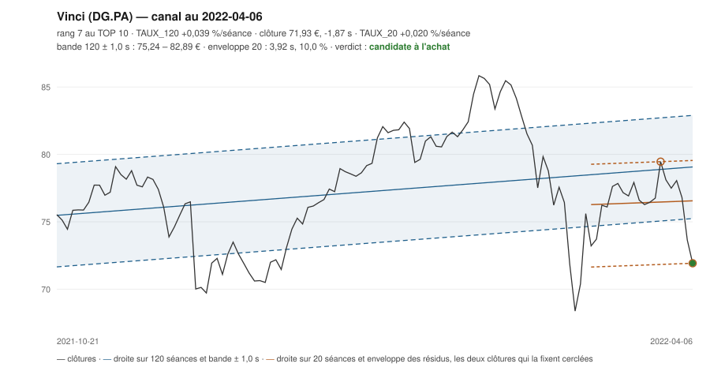

> Rang 7 · TAUX_120 +0,039 %/séance · clôture 71,93 € · bande 75,24 – 82,89 € · écart -1,87 s · TAUX_20 +0,020 %/séance · enveloppe 20 : 3,92 s, 10,0 % · **candidate à l'achat**

#### 2022-04-08 — Achat `TTE.PA` TotalEnergies, décision au 2022-04-07

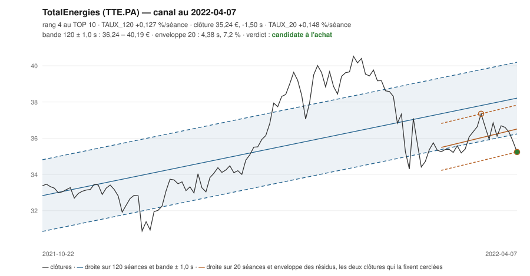

> Rang 4 · TAUX_120 +0,127 %/séance · clôture 35,24 € · bande 36,24 – 40,19 € · écart -1,50 s · TAUX_20 +0,148 %/séance · enveloppe 20 : 4,38 s, 7,2 % · **candidate à l'achat**

## 5. Le TOP 10 au 2022-04-29

| Rang | Valeur | TAUX_120 | Écart | TAUX_20 | Verdict |
|---|---|---|---|---|---|
| 1 | `HO.PA` Thales | +0,538 %/séance | +0,04 s | +0,430 %/séance | dans la bande |
| 2 | `CA.PA` Carrefour | +0,233 %/séance | +0,49 s | +0,163 %/séance | dans la bande |
| 3 | `ORA.PA` Orange | +0,188 %/séance | -0,00 s | +0,294 %/séance | dans la bande |
| 4 | `SAN.PA` Sanofi | +0,133 %/séance | +0,70 s | +0,367 %/séance | dans la bande |
| 5 | `TTE.PA` TotalEnergies | +0,094 %/séance | -0,41 s | -0,023 %/séance | dans la bande |
| 6 | `MT.AS` ArcelorMittal | +0,066 %/séance | -0,63 s | -0,181 %/séance | dans la bande |
| 7 | `AI.PA` Air Liquide | +0,036 %/séance | +1,70 s | +0,085 %/séance | au-dessus du bord haut |
| 8 | `DG.PA` Vinci | +0,031 %/séance | +0,15 s | +0,307 %/séance | dans la bande |
| 9 | `EN.PA` Bouygues | +0,029 %/séance | +0,84 s | +0,361 %/séance | dans la bande |
| 10 | `VIV.PA` Vivendi | +0,021 %/séance | -1,58 s | -0,264 %/séance | sous le bord bas |

**Entrées et sorties du TOP 10 au fil du mois**

| Séance | Entrées | Sorties |
|---|---|---|
| 2022-04-04 | `AI.PA` | `VIE.PA` |
| 2022-04-26 | `EN.PA` | `CS.PA` |

## 6. Les ordres exécutés

> À l'**ouverture** de la séance qui suit la décision, jamais à la clôture qui l'a déclenchée. L'écart d'ouverture est subi, et publié.

| Exécution | Sens | Valeur | Quantité | Prix | Brut | Frais | Écart d'ouverture | Motif |
|---|---|---|---|---|---|---|---|---|
| 2022-04-07 | **Achat** | `DG.PA` Vinci | 13 | 72,98 € | 948,70 € | 3,94 € | +1,46 % | décision au 2022-04-06 : clôture 71,93 € sous le bord bas 75,24 € (-1,87 s), rang 7, TAUX_120 +0,039 %/séance, TAUX_20 +0,020 %/séance |
| 2022-04-08 | **Achat** | `TTE.PA` TotalEnergies | 27 | 35,53 € | 959,27 € | 3,98 € | +0,82 % | décision au 2022-04-07 : clôture 35,24 € sous le bord bas 36,24 € (-1,50 s), rang 4, TAUX_120 +0,127 %/séance, TAUX_20 +0,148 %/séance |

## 7. Les signaux non exécutés

*Aucun : chaque candidat du mois a été acheté.*

## 8. La lecture du mois

Sur le mois, la meilleure contribution vient de `DG.PA` (Vinci) pour **+77,79 €**, la moins bonne de `VIE.PA` (Veolia) pour **-47,07 €**. Les 2 ordres du mois ont coûté **7,92 €** de frais, soit 0,079 % de la dotation. Le portefeuille termine le mois **derrière TR39** de 0,00 point.

---

[← Mars](2022-03.md) · [Protocole](../README.md) · [Mai →](2022-05.md)
