# Juillet 2022

> Journal de l'[expérience 6](../README.md) · exécutions du 2022-07-01 au 2022-07-29 · **3 ordres**
> Portefeuille au 2022-07-29 : **9 405,22 €** (base 94,05) · TR39 90,64 · alpha du mois **-7,81 pt** · depuis janvier **+3,41 pt**

---

## 1. Les actualités du mois précédent

**Juin 2022.** Le pire mois du premier semestre. L'inflation américaine de mai,
publiée le 10 juin à 8,6 %, prend le marché à contre-pied et déclenche une chute
générale ; la Réserve fédérale relève ses taux de trois quarts de point, la plus
forte hausse depuis 1994. Le CAC 40 perd près de 8 % sur le mois et clôt le
semestre sur un recul d'environ 17 %.

La BCE convoque une réunion d'urgence pour annoncer un instrument
anti-fragmentation, les écarts de taux italiens s'étant brutalement écartés.
Le mot « récession » devient le sujet dominant : le cuivre, le pétrole et les
cycliques reculent ensemble.

## 2. L'exposition héritée au 2022-06-30

| Valeur | Achetée le | Prix d'achat | Cours | +/− value | Alpha depuis l'achat |
|---|---|---|---|---|---|
| `CS.PA` AXA | 2022-02-21 | 20,20 € | 17,20 € | **-14,86 %** | -3,10 pt |
| `DG.PA` Vinci | 2022-04-07 | 72,98 € | 72,54 € | **-0,60 %** | +6,13 pt |
| `CA.PA` Carrefour | 2022-05-20 | 14,80 € | 13,24 € | **-10,57 %** | -3,70 pt |
| `HO.PA` Thales | 2022-06-06 | 105,72 € | 108,22 € | **+2,36 %** | +12,90 pt |

## 3. Le portefeuille depuis le 2022-01-03

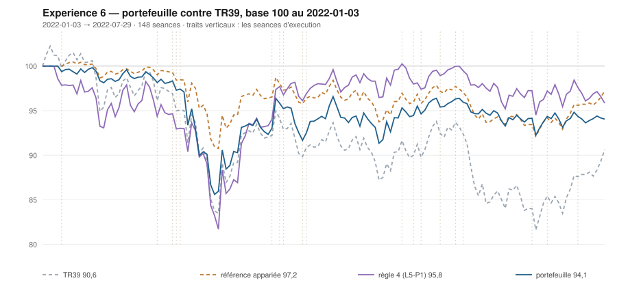

| | |
|---|---|
| Dotation initiale | 10 000,00 € au 2022-01-03 |
| Titres au 2022-07-29 | 4 553,70 € |
| Espèces | 4 851,52 € |
| Lignes détenues | 5 |
| **Total** | **9 405,22 €** |
| Base 100 | **94,05** |
| Référence à exposition appariée, même base | 97,20 |
| **Alpha officiel depuis janvier** | **-3,15 pt** |
| Règle de l'expérience 4 (`L5-P1`), même base | 95,85 |
| TR39, même base | 90,64 |
| Écart depuis janvier | **+3,41 pt** |

### Toutes les positions depuis le début de l'expérience

> Closes comme ouvertes. Aucune séance postérieure au 2022-07-29 n'entre dans ce tableau.

| Société | Prix d'achat | Date d'achat | Prix de vente | Date de vente |
|---|---|---|---|---|
| `CAP.PA` Capgemini | 180,43 € | 2022-01-10 | 181,51 € | 2022-03-30 |
| `EL.PA` EssilorLuxottica | 159,47 € | 2022-01-10 | 153,11 € | 2022-03-30 |
| `RI.PA` Pernod Ricard | 170,35 € | 2022-01-10 | 164,76 € | 2022-03-31 |
| `MC.PA` LVMH | 613,30 € | 2022-02-14 | 558,12 € | 2022-05-31 |
| `BNP.PA` BNP Paribas | 44,65 € | 2022-02-18 | 39,57 € | 2022-05-24 |
| `CS.PA` AXA | 20,20 € | 2022-02-21 |  |  |
| `GLE.PA` Société Générale | 24,40 € | 2022-02-22 | 20,19 € | 2022-05-24 |
| `VIE.PA` Veolia | 22,38 € | 2022-03-28 | 21,77 € | 2022-06-08 |
| `DG.PA` Vinci | 72,98 € | 2022-04-07 | 77,14 € | 2022-07-20 |
| `TTE.PA` TotalEnergies | 35,53 € | 2022-04-08 | 40,80 € | 2022-05-17 |
| `CA.PA` Carrefour | 14,80 € | 2022-05-20 |  |  |
| `HO.PA` Thales | 105,72 € | 2022-06-06 |  |  |
| `SAN.PA` Sanofi | 82,42 € | 2022-07-04 |  |  |
| `ORA.PA` Orange | 8,36 € | 2022-07-08 |  |  |

*14 positions depuis le début, dont 5 encore ouvertes : les deux dernières colonnes restent vides.*

## 4. L'étude chartiste au 2022-07-29

> Une entrée par société de l'univers, sous la figure de canal lue à la clôture du 2022-07-29. La ligne en retrait est **calculée** ; la note qui suit est celle de l'agent `chartiste`, rédigée sans aucune séance postérieure.

### 1. `HO.PA` — Thales

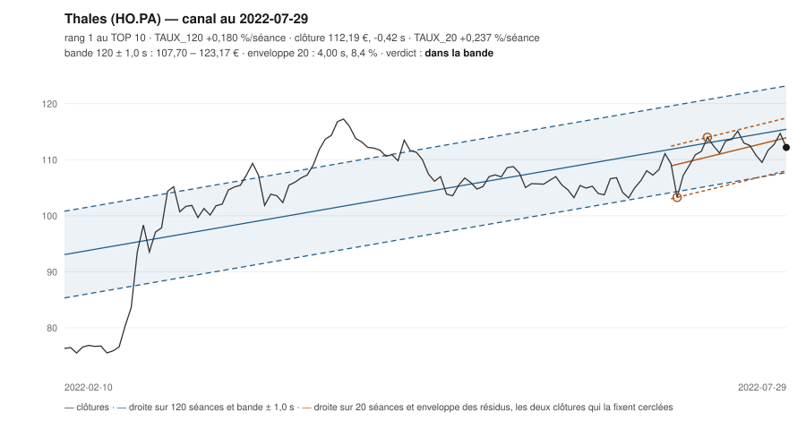

> Rang 1 · TAUX_120 +0,180 %/séance · clôture 112,19 € · bande 107,70 – 123,17 € · écart -0,42 s · TAUX_20 +0,237 %/séance · enveloppe 20 : 4,00 s, 8,4 % · **dans la bande**

- Clôture 112,19 €, à −0,42 s, dans la bande de 107,70 à 123,17 € depuis 17 séances, entrée par le bas le 2022-07-07 (−1,55 s le 2022-07-05).
- Rang 1 du TOP 10, avec +0,180 %/séance, et au TOP 10 depuis 103 séances ; pente courte +0,237 %/séance, positive depuis 23 séances : les deux concordent.
- Enveloppe de 4,00 s (8,4 % du niveau moyen), au-dessus des ~3,7 s ; bornes anciennes, 2022-07-05 (bas) et 2022-07-12 (haut).
- Verdict : dans la bande — premier du TOP 10, pente courte positive, mais clôture au-dessus du bord bas.

### 2. `SAN.PA` — Sanofi

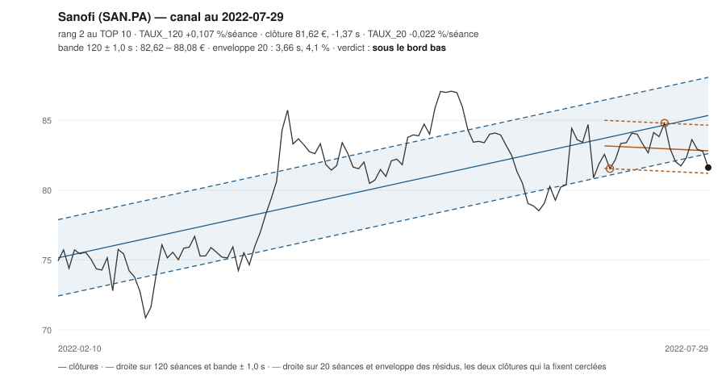

> Rang 2 · TAUX_120 +0,107 %/séance · clôture 81,62 € · bande 82,62 – 88,08 € · écart -1,37 s · TAUX_20 -0,022 %/séance · enveloppe 20 : 3,66 s, 4,1 % · **sous le bord bas**

- Clôture 81,62 €, à −1,37 s, sous le bord bas de 82,62 € (bande 82,62 à 88,08 €) ; écart le plus bas des 20 séances.
- Passée sous le bord bas ce jour ; 6 des 20 dernières séances y avaient déjà clos, dont le 2022-07-22 à −1,36 s.
- Rang 2 du TOP 10 (réduit à six), pente longue +0,107 %/séance, au TOP 10 depuis 111 séances ; la pente courte a basculé ce jour à −0,022 %/séance : désaccord de signe, de faible amplitude.
- Enveloppe de 3,66 s (4,1 % du niveau moyen) ; résidu bas le 2022-07-05, 2e séance, résidu haut le 2022-07-19.
- Verdict : sous le bord bas, non candidate — la pente courte est négative.

### 3. `TTE.PA` — TotalEnergies

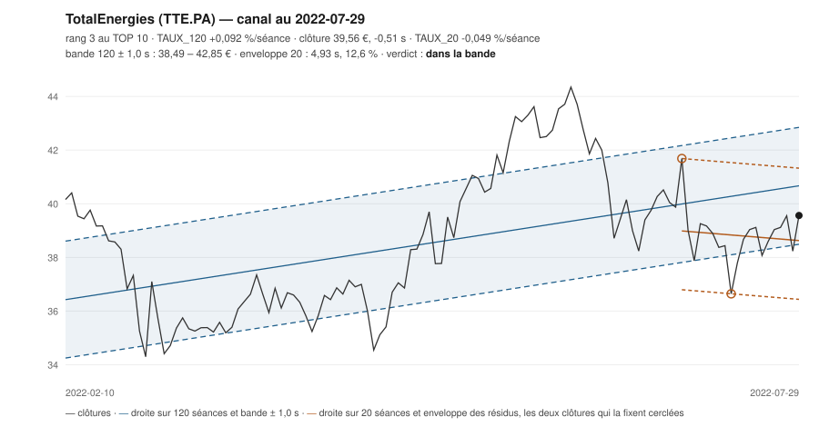

> Rang 3 · TAUX_120 +0,092 %/séance · clôture 39,56 € · bande 38,49 – 42,85 € · écart -0,51 s · TAUX_20 -0,049 %/séance · enveloppe 20 : 4,93 s, 12,6 % · **dans la bande**

- Clôture 39,56 €, à −0,51 s, dans la bande de 38,49 à 42,85 €, rentrée ce jour après 5 séances sous le bord bas dans la fenêtre (−1,65 s le 2022-07-14).
- Rang 3 du TOP 10 (réduit à six), pente longue +0,092 %/séance, au TOP 10 depuis 196 séances ; pente courte −0,049 %/séance, négative depuis 31 séances : désaccord.
- Enveloppe de 4,93 s (12,6 % du niveau moyen), nettement au-dessus des ~3,7 s ; résidu haut à la première séance (2022-07-04), résidu bas le 2022-07-14.
- Verdict : dans la bande.

### 4. `ALO.PA` — Alstom

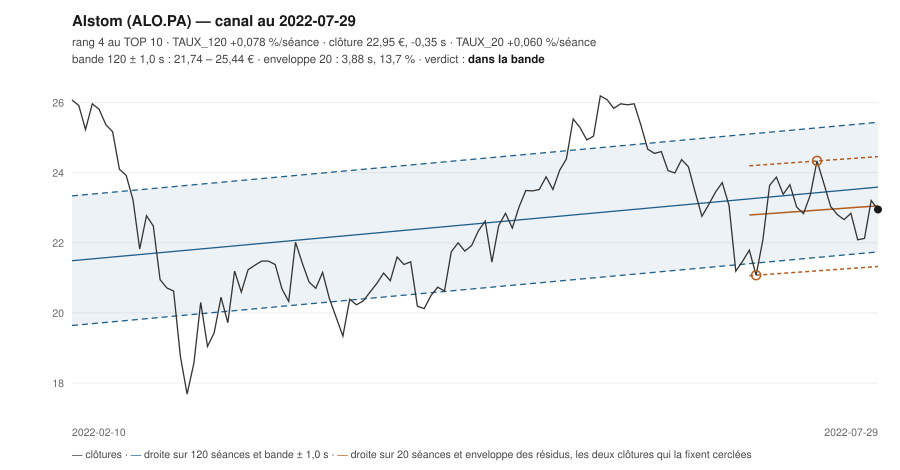

> Rang 4 · TAUX_120 +0,078 %/séance · clôture 22,95 € · bande 21,74 – 25,44 € · écart -0,35 s · TAUX_20 +0,060 %/séance · enveloppe 20 : 3,88 s, 13,7 % · **dans la bande**

- Clôture 22,95 €, à −0,35 s, dans la bande de 21,74 à 25,44 € ; les 20 dernières séances y sont toutes restées, entre −0,68 s (2022-07-27) et +0,65 s (2022-07-08).
- Pente longue positive, +0,078 %/séance, rang 4 d'un TOP 10 réduit ce jour à six pentes positives, et présente au TOP 10 depuis 10 séances ; pente courte positive elle aussi, +0,060 %/séance : les deux concordent.
- Enveloppe de 3,88 s, soit 13,7 % du niveau moyen ; ses deux clôtures sont en première moitié de fenêtre, le 2022-07-05 pour le bas et le 2022-07-18 pour le haut.
- Verdict : dans la bande — au TOP 10 avec une pente courte positive, mais la clôture n'est pas sous le bord bas.

### 5. `BN.PA` — Danone

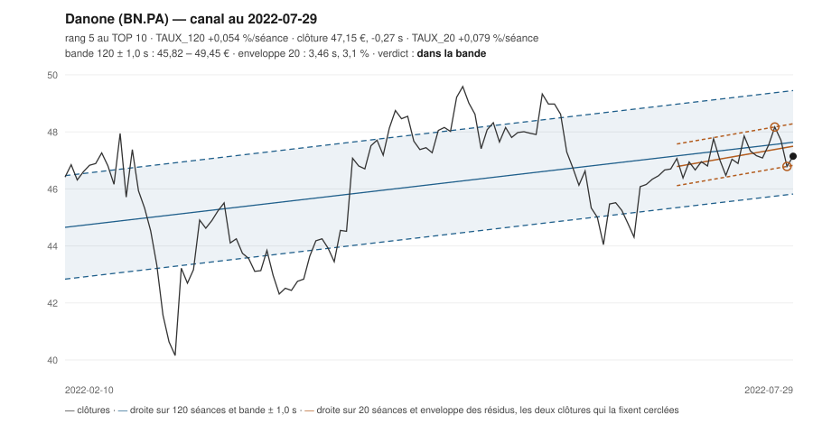

> Rang 5 · TAUX_120 +0,054 %/séance · clôture 47,15 € · bande 45,82 – 49,45 € · écart -0,27 s · TAUX_20 +0,079 %/séance · enveloppe 20 : 3,46 s, 3,1 % · **dans la bande**

- Clôture 47,15 €, à −0,27 s, dans la bande de 45,82 à 49,45 €, où elle se tient depuis 31 séances (entrée par le bas le 2022-06-17).
- Rang 5 au TOP 10, pente longue +0,054 %/séance ; pente courte +0,079 %/séance, positive depuis 19 séances : concordance.
- Enveloppe de 3,46 s, étroite en valeur relative (3,1 % du niveau moyen) ; ses deux bornes sont récentes : résidu haut le 2022-07-26, résidu bas le 2022-07-28.
- Verdict : dans la bande.

### 6. `ORA.PA` — Orange

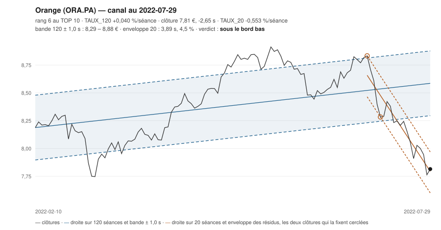

> Rang 6 · TAUX_120 +0,040 %/séance · clôture 7,81 € · bande 8,29 – 8,88 € · écart -2,65 s · TAUX_20 -0,553 %/séance · enveloppe 20 : 3,89 s, 4,5 % · **sous le bord bas**

- Clôture 7,81 €, à −2,65 s, sous le bord bas de 8,29 € (bande 8,29 à 8,88 €).
- Sous le bord bas depuis 18 séances, depuis le 2022-07-06 ; le point le plus bas de l'écart, −3,15 s, date du 2022-07-22.
- Rang 6 du TOP 10 — le dernier des six classés ce jour —, pente longue +0,040 %/séance ; pente courte −0,553 %/séance, négative depuis 15 séances : désaccord.
- Enveloppe de 3,89 s (4,5 % du niveau moyen), bornes anciennes : 2022-07-04 (haut) et 2022-07-08 (bas).
- Verdict : sous le bord bas, non candidate — la pente courte est négative.

### `AI.PA` — Air Liquide

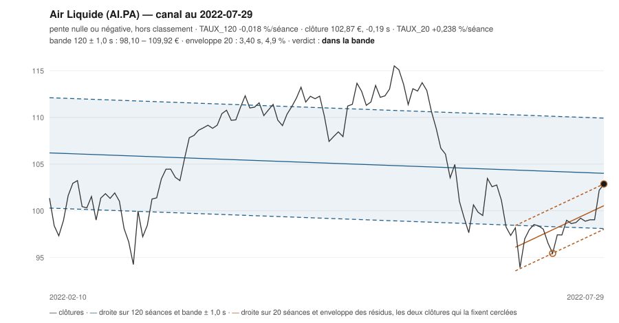

> Hors classement · TAUX_120 -0,018 %/séance · clôture 102,87 € · bande 98,10 – 109,92 € · écart -0,19 s · TAUX_20 +0,238 %/séance · enveloppe 20 : 3,40 s, 4,9 % · **dans la bande**

- Clôture 102,87 €, à −0,19 s, dans la bande de 98,10 à 109,92 €.
- Revenue dans la bande le 2022-07-26 : 16 des 20 dernières séances ont clos sous le bord bas de leur canal, au plus bas à −2,83 s le 2022-07-05.
- Pente longue à −0,018 %/séance, négative donc hors classement ; pente courte à +0,238 %/séance, positive depuis 4 séances : désaccord de signe.
- Enveloppe de 3,40 s (4,9 % du niveau moyen), sous les ~3,7 s ; elle est fixée en haut par la clôture du jour elle-même et en bas par celle du 2022-07-14.
- Verdict : dans la bande.

### `EN.PA` — Bouygues

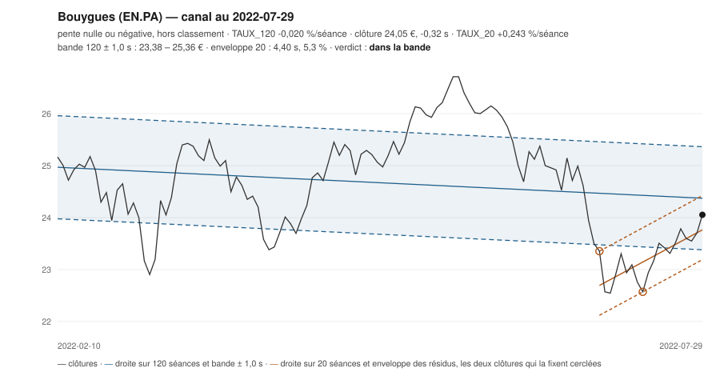

> Hors classement · TAUX_120 -0,020 %/séance · clôture 24,05 € · bande 23,38 – 25,36 € · écart -0,32 s · TAUX_20 +0,243 %/séance · enveloppe 20 : 4,40 s, 5,3 % · **dans la bande**

- Clôture 24,05 €, à −0,32 s, dans la bande de 23,38 à 25,36 €.
- Rentrée dans la bande le 2022-07-25, il y a 5 séances ; 15 des 20 dernières séances étaient sous le bord bas, jusqu'à −3,57 s le 2022-07-05.
- Pente longue −0,020 %/séance, hors classement ; pente courte +0,243 %/séance, positive depuis 3 séances : les deux divergent.
- Enveloppe large, 4,40 s (5,3 % du niveau moyen), au-dessus des ~3,7 s ; bornes anciennes, 2022-07-04 (haut) et 2022-07-14 (bas).
- Verdict : dans la bande.

### `CA.PA` — Carrefour

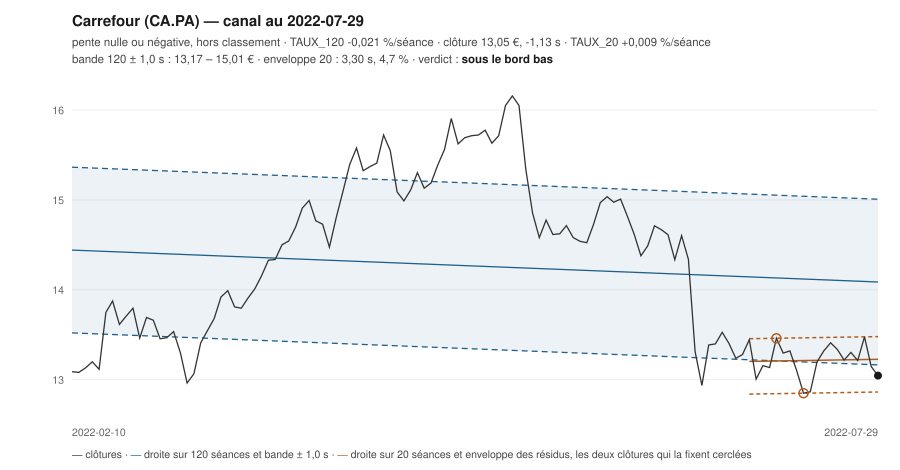

> Hors classement · TAUX_120 -0,021 %/séance · clôture 13,05 € · bande 13,17 – 15,01 € · écart -1,13 s · TAUX_20 +0,009 %/séance · enveloppe 20 : 3,30 s, 4,7 % · **sous le bord bas**

- Clôture 13,05 €, à −1,13 s, sous le bord bas de 13,17 € (bande 13,17 à 15,01 €).
- Sous le bord bas depuis 2 séances, après une seule clôture dans la bande (−0,78 s le 2022-07-27) : 19 des 20 dernières séances sont sous −1 s.
- Pente longue −0,021 %/séance, négative et hors classement ; pente courte à peine positive, +0,009 %/séance.
- Enveloppe de 3,30 s (4,7 % du niveau moyen), sous les ~3,7 s, fixée par des clôtures de première moitié de fenêtre : 2022-07-08 en haut, 2022-07-14 en bas.
- Verdict : sous le bord bas, non candidate — pente longue négative, hors TOP 10.

### `ENGI.PA` — Engie

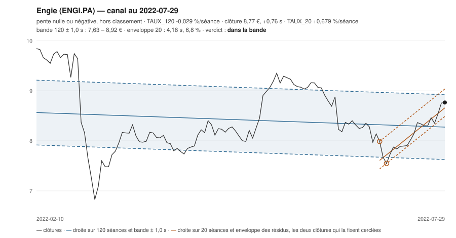

> Hors classement · TAUX_120 -0,029 %/séance · clôture 8,77 € · bande 7,63 – 8,92 € · écart +0,76 s · TAUX_20 +0,679 %/séance · enveloppe 20 : 4,18 s, 6,8 % · **dans la bande**

- Clôture 8,77 €, à +0,76 s, dans la bande de 7,63 à 8,92 € depuis 36 séances ; sur 20 séances l'écart est resté entre −0,99 s et +0,79 s.
- Pente longue légèrement négative, −0,029 %/séance, hors classement ; pente courte forte, +0,679 %/séance, positive depuis 7 séances.
- Enveloppe de 4,18 s (6,8 % du niveau moyen), au-dessus des ~3,7 s ; les deux bornes sont en tout début de fenêtre, 2022-07-04 (haut) et 2022-07-06 (bas).
- Verdict : dans la bande.

### `OR.PA` — L'Oréal

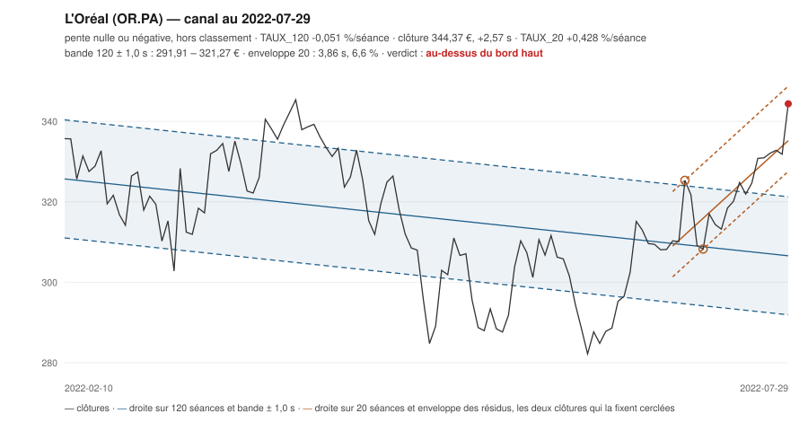

> Hors classement · TAUX_120 -0,051 %/séance · clôture 344,37 € · bande 291,91 – 321,27 € · écart +2,57 s · TAUX_20 +0,428 %/séance · enveloppe 20 : 3,86 s, 6,6 % · **au-dessus du bord haut**

- Clôture 344,37 €, à +2,57 s, au-dessus du bord haut de 321,27 € (bande 291,91 à 321,27 €), écart maximal des 20 séances.
- Au-dessus depuis 14 séances ; seule la clôture du 2022-07-11 (+0,96 s) est restée sous +1 s sur la fenêtre.
- Pente longue −0,051 %/séance, hors classement ; pente courte +0,428 %/séance, positive depuis 23 séances.
- Enveloppe de 3,86 s (6,6 % du niveau moyen) ; bornes toutes deux en début de fenêtre, 2022-07-06 (haut) et 2022-07-11 (bas).
- Verdict : au-dessus du bord haut.

### `DG.PA` — Vinci

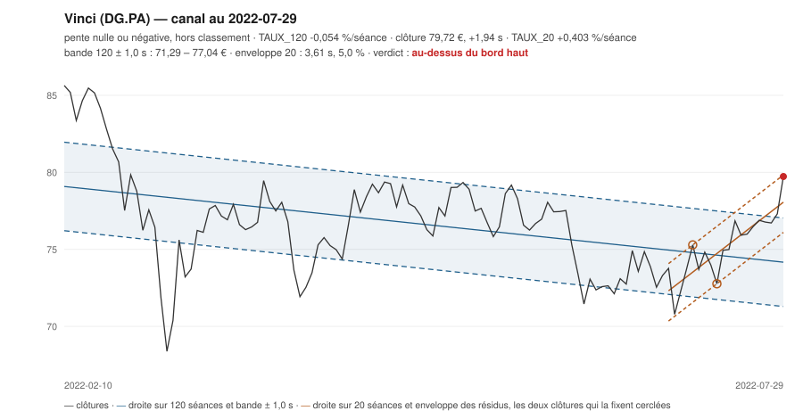

> Hors classement · TAUX_120 -0,054 %/séance · clôture 79,72 € · bande 71,29 – 77,04 € · écart +1,94 s · TAUX_20 +0,403 %/séance · enveloppe 20 : 3,61 s, 5,0 % · **au-dessus du bord haut**

- Clôture 79,72 €, à +1,94 s, au-dessus du bord haut de 77,04 € (bande 71,29 à 77,04 €).
- Au-dessus depuis 6 séances, depuis le 2022-07-22 ; la fenêtre avait commencé à −0,03 s le 2022-07-04, et 7 de ses 20 séances ont clos au-dessus du bord haut.
- Pente longue −0,054 %/séance, hors classement, contre une pente courte de +0,403 %/séance positive depuis 16 séances.
- Enveloppe de 3,61 s (5,0 % du niveau moyen), voisine des ~3,7 s ; bornes en première moitié de fenêtre, 2022-07-08 (haut) et 2022-07-14 (bas).
- Verdict : au-dessus du bord haut.

### `RI.PA` — Pernod Ricard

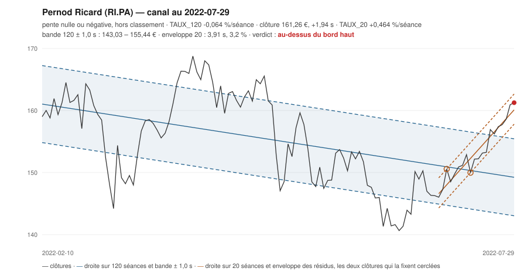

> Hors classement · TAUX_120 -0,064 %/séance · clôture 161,26 € · bande 143,03 – 155,44 € · écart +1,94 s · TAUX_20 +0,464 %/séance · enveloppe 20 : 3,91 s, 3,2 % · **au-dessus du bord haut**

- Clôture 161,26 €, à +1,94 s, au-dessus du bord haut de 155,44 € (bande 143,03 à 155,44 €) depuis 7 séances.
- Écart passé de −0,41 s le 2022-07-04 à +1,96 s le 2022-07-28.
- Pente longue −0,064 %/séance, hors classement ; pente courte +0,464 %/séance, positive sur les 20 dernières séances.
- Enveloppe de 3,91 s pour 3,2 % seulement du niveau moyen ; bornes en première moitié, 2022-07-06 (haut) et 2022-07-14 (bas).
- Verdict : au-dessus du bord haut.

### `MC.PA` — LVMH

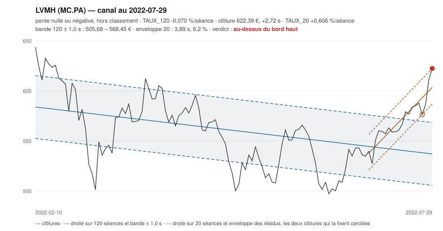

> Hors classement · TAUX_120 -0,070 %/séance · clôture 622,39 € · bande 505,68 – 568,45 € · écart +2,72 s · TAUX_20 +0,606 %/séance · enveloppe 20 : 3,89 s, 6,2 % · **au-dessus du bord haut**

- Clôture 622,39 €, à +2,72 s, au-dessus du bord haut de 568,45 € (bande 505,68 à 568,45 €) ; l'écart du jour est le plus haut des 20 séances.
- Au-dessus du bord haut depuis 18 séances, et 19 des 20 dernières.
- Pente longue −0,070 %/séance, hors classement ; pente courte +0,606 %/séance, positive sur les 20 dernières séances : discordance complète.
- Enveloppe de 3,89 s (6,2 % du niveau moyen) ; bornes récentes : résidu bas le 2022-07-26, résidu haut à la clôture du jour.
- Verdict : au-dessus du bord haut.

### `TEP.PA` — Teleperformance

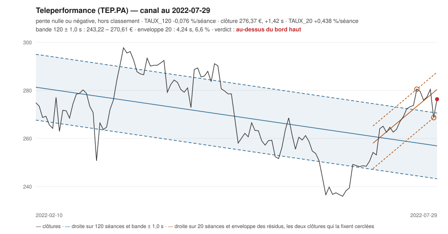

> Hors classement · TAUX_120 -0,076 %/séance · clôture 276,37 € · bande 243,22 – 270,61 € · écart +1,42 s · TAUX_20 +0,438 %/séance · enveloppe 20 : 4,24 s, 6,6 % · **au-dessus du bord haut**

- Clôture 276,37 €, à +1,42 s, au-dessus du bord haut de 270,61 € (bande 243,22 à 270,61 €), repassé ce jour.
- 11 des 20 dernières séances ont clos au-dessus du bord haut, au plus haut à +1,98 s le 2022-07-21 ; la veille était dans la bande.
- Pente longue −0,076 %/séance, hors classement ; pente courte +0,438 %/séance depuis 19 séances : désaccord.
- Enveloppe de 4,24 s (6,6 % du niveau moyen), au-dessus des ~3,7 s ; bornes récentes, 2022-07-21 (haut) et 2022-07-28 (bas).
- Verdict : au-dessus du bord haut.

### `AIR.PA` — Airbus

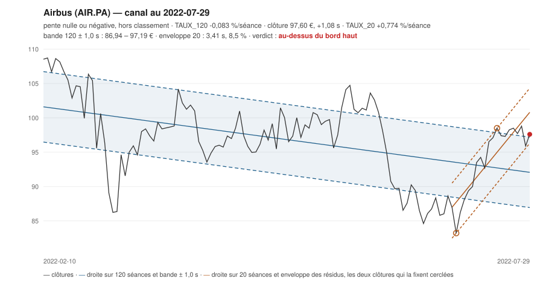

> Hors classement · TAUX_120 -0,083 %/séance · clôture 97,60 € · bande 86,94 – 97,19 € · écart +1,08 s · TAUX_20 +0,774 %/séance · enveloppe 20 : 3,41 s, 8,5 % · **au-dessus du bord haut**

- Clôture 97,60 €, à +1,08 s, juste au-dessus du bord haut de 97,19 € (bande 86,94 à 97,19 €) ; franchi ce jour, la veille était dans la bande.
- Le chemin est une traversée : −1,74 s le 2022-07-05, +1,53 s le 2022-07-19, et 10 des 20 dernières séances au-dessus du bord haut.
- Pente longue négative, −0,083 %/séance, hors classement ; pente courte nettement positive, +0,774 %/séance depuis 14 séances : les deux canaux s'opposent.
- Enveloppe de 3,41 s (8,5 % du niveau moyen), sous les ~3,7 s ; résidu bas au 2022-07-05, 2e séance de la fenêtre, résidu haut au 2022-07-19, 12e.
- Verdict : au-dessus du bord haut.

### `EL.PA` — EssilorLuxottica

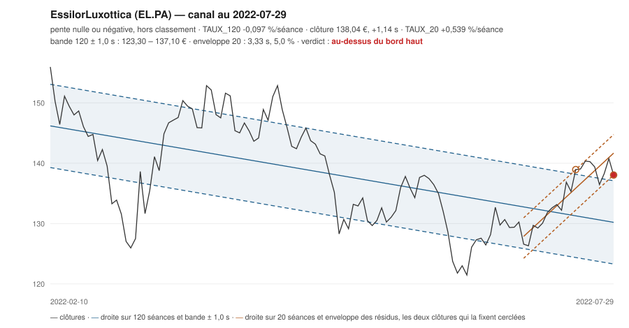

> Hors classement · TAUX_120 -0,097 %/séance · clôture 138,04 € · bande 123,30 – 137,10 € · écart +1,14 s · TAUX_20 +0,539 %/séance · enveloppe 20 : 3,33 s, 5,0 % · **au-dessus du bord haut**

- Clôture 138,04 €, à +1,14 s, au-dessus du bord haut de 137,10 € (bande 123,30 à 137,10 €), et cela depuis 11 séances ; l'écart culminait à +1,75 s le 2022-07-21.
- Pente longue −0,097 %/séance, hors classement ; pente courte +0,539 %/séance depuis 19 séances : désaccord.
- Enveloppe de 3,33 s (5,0 % du niveau moyen) ; le résidu bas est la clôture du jour, le résidu haut celle du 2022-07-19 : au-dessus du canal long, le cours est au plancher du canal court.
- Verdict : au-dessus du bord haut.

### `CAP.PA` — Capgemini

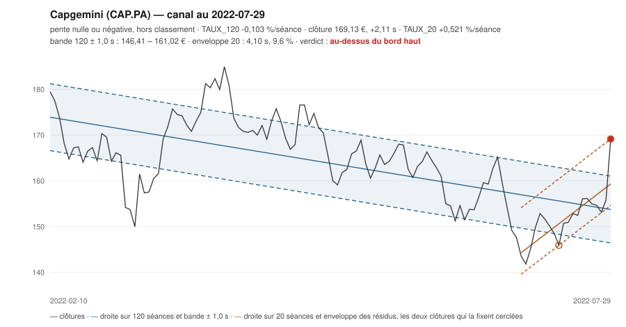

> Hors classement · TAUX_120 -0,103 %/séance · clôture 169,13 € · bande 146,41 – 161,02 € · écart +2,11 s · TAUX_20 +0,521 %/séance · enveloppe 20 : 4,10 s, 9,6 % · **au-dessus du bord haut**

- Clôture 169,13 €, à +2,11 s, au-dessus du bord haut de 161,02 € (bande 146,41 à 161,02 €), franchi ce jour.
- Traversée complète de la bande sur la fenêtre de 20 séances : −2,19 s le 2022-07-05, +0,32 s le 2022-07-22, puis +2,11 s ce jour, l'écart le plus haut de la période.
- Pente longue −0,103 %/séance, hors classement ; pente courte +0,521 %/séance : sens opposés.
- Enveloppe de 4,10 s (9,6 % du niveau moyen), au-dessus des ~3,7 s ; la clôture du jour fixe le bord haut, celle du 2022-07-14 le bord bas.
- Verdict : au-dessus du bord haut.

### `SAF.PA` — Safran

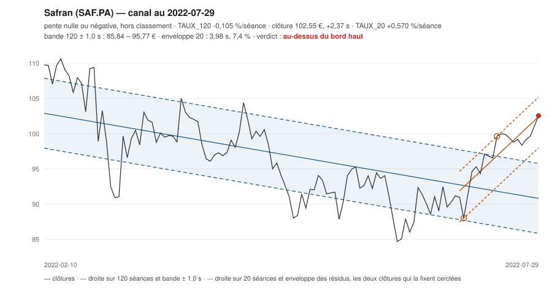

> Hors classement · TAUX_120 -0,105 %/séance · clôture 102,55 € · bande 85,84 – 95,77 € · écart +2,37 s · TAUX_20 +0,570 %/séance · enveloppe 20 : 3,98 s, 7,4 % · **au-dessus du bord haut**

- Clôture 102,55 €, à +2,37 s, au-dessus du bord haut de 95,77 € (bande 85,84 à 95,77 €) depuis 17 séances ; le maximum, +2,65 s, date du 2022-07-15.
- Pente longue −0,105 %/séance, hors classement ; pente courte +0,570 %/séance, positive sur les 20 dernières séances.
- Enveloppe de 3,98 s (7,4 % du niveau moyen), au-dessus des ~3,7 s ; résidu bas le 2022-07-05, résidu haut le 2022-07-15, tous deux en première moitié.
- Verdict : au-dessus du bord haut.

### `RMS.PA` — Hermès International

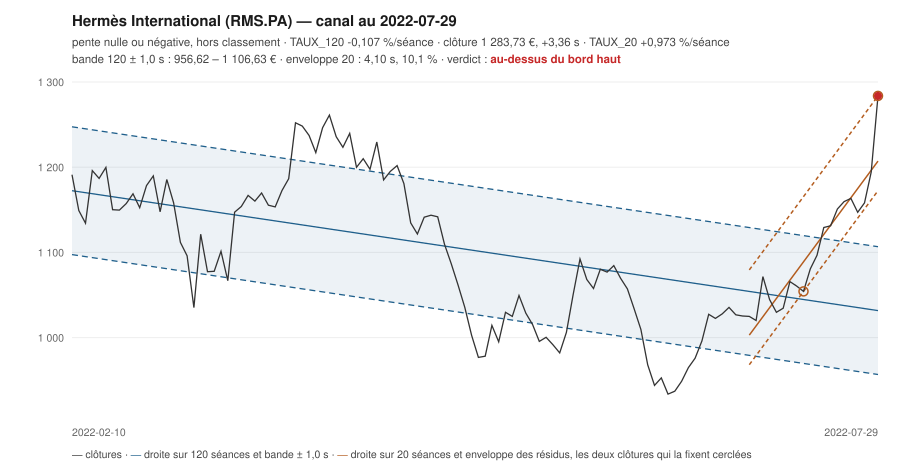

> Hors classement · TAUX_120 -0,107 %/séance · clôture 1 283,73 € · bande 956,62 – 1 106,63 € · écart +3,36 s · TAUX_20 +0,973 %/séance · enveloppe 20 : 4,10 s, 10,1 % · **au-dessus du bord haut**

- Clôture 1 283,73 €, à +3,36 s, très au-dessus du bord haut de 1 106,63 € (bande 956,62 à 1 106,63 €) ; c'est l'écart maximal des 20 séances.
- Au-dessus depuis 14 séances, et 16 des 20 dernières.
- Pente longue −0,107 %/séance, hors classement ; pente courte +0,973 %/séance, positive sur toute la fenêtre de 20 séances.
- Enveloppe de 4,10 s (10,1 % du niveau moyen), au-dessus des ~3,7 s ; la clôture du jour fixe le haut, celle du 2022-07-14 le bas.
- Verdict : au-dessus du bord haut.

### `ML.PA` — Michelin

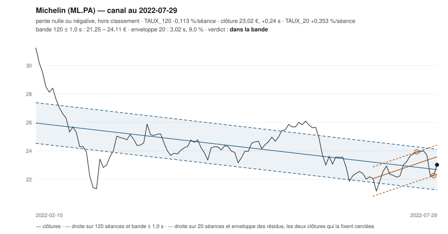

> Hors classement · TAUX_120 -0,113 %/séance · clôture 23,02 € · bande 21,25 – 24,11 € · écart +0,24 s · TAUX_20 +0,353 %/séance · enveloppe 20 : 3,02 s, 9,0 % · **dans la bande**

- Clôture 23,02 €, à +0,24 s, dans la bande de 21,25 à 24,11 € depuis 35 séances ; écart compris entre −0,54 s et +0,94 s sur 20 séances.
- Pente longue −0,113 %/séance, hors classement ; pente courte +0,353 %/séance depuis 10 séances : les deux s'opposent.
- Enveloppe de 3,02 s (9,0 % du niveau moyen), sous les ~3,7 s ; ses bornes sont récentes, 2022-07-21 (haut) et 2022-07-28 (bas).
- Verdict : dans la bande.

### `CS.PA` — AXA

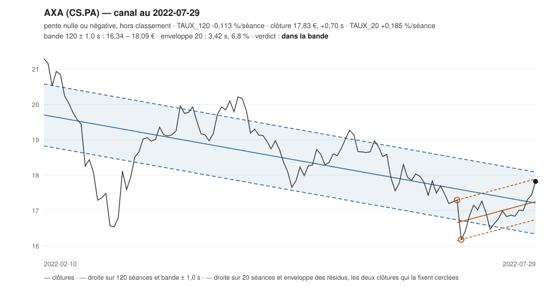

> Hors classement · TAUX_120 -0,113 %/séance · clôture 17,83 € · bande 16,34 – 18,09 € · écart +0,70 s · TAUX_20 +0,185 %/séance · enveloppe 20 : 3,42 s, 6,8 % · **dans la bande**

- Clôture 17,83 €, à +0,70 s, dans la bande de 16,34 à 18,09 € depuis 17 séances, entrée le 2022-07-07 depuis le dessous (−1,61 s le 2022-07-05).
- Pente longue −0,113 %/séance, hors classement ; pente courte +0,185 %/séance, positive depuis 3 séances : les deux ne concordent pas.
- Enveloppe de 3,42 s (6,8 % du niveau moyen) ; ses deux bornes sont les deux premières séances de la fenêtre, 2022-07-04 en haut et 2022-07-05 en bas.
- Verdict : dans la bande.

### `BNP.PA` — BNP Paribas

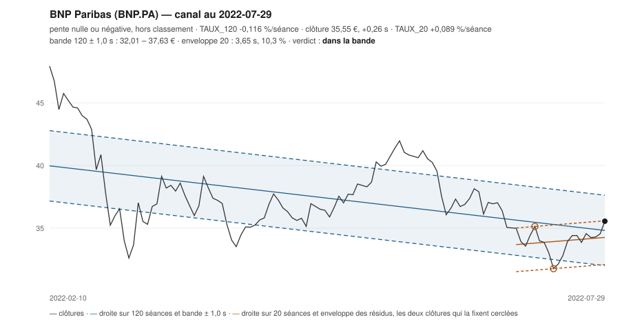

> Hors classement · TAUX_120 -0,116 %/séance · clôture 35,55 € · bande 32,01 – 37,63 € · écart +0,26 s · TAUX_20 +0,089 %/séance · enveloppe 20 : 3,65 s, 10,3 % · **dans la bande**

- Clôture 35,55 €, à +0,26 s, dans la bande de 32,01 à 37,63 € depuis 36 séances ; sur les 20 dernières, l'écart est resté entre −0,92 s (2022-07-14) et le +0,26 s du jour.
- Pente longue négative, −0,116 %/séance, hors classement ; la pente courte vient de repasser positive ce jour, à +0,089 %/séance : désaccord.
- Enveloppe de 3,65 s (10,3 % du niveau moyen), proche des ~3,7 s ; bornes anciennes, le 2022-07-08 (haut) et le 2022-07-14 (bas).
- Verdict : dans la bande.

### `RNO.PA` — Renault

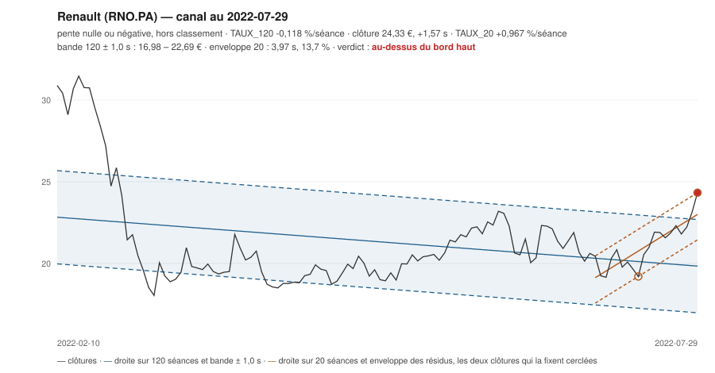

> Hors classement · TAUX_120 -0,118 %/séance · clôture 24,33 € · bande 16,98 – 22,69 € · écart +1,57 s · TAUX_20 +0,967 %/séance · enveloppe 20 : 3,97 s, 13,7 % · **au-dessus du bord haut**

- Clôture 24,33 €, à +1,57 s, au-dessus du bord haut de 22,69 € (bande 16,98 à 22,69 €) depuis 2 séances.
- Sur 20 séances l'écart est toujours resté positif, au plus bas à +0,31 s le 2022-07-14, et culmine ce jour.
- Pente longue −0,118 %/séance, hors classement ; pente courte +0,967 %/séance depuis 7 séances : désaccord.
- Enveloppe de 3,97 s (13,7 % du niveau moyen) ; résidu bas le 2022-07-14, résidu haut à la clôture du jour.
- Verdict : au-dessus du bord haut.

### `LR.PA` — Legrand

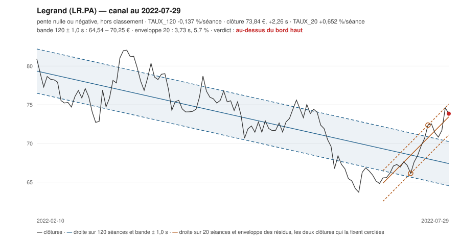

> Hors classement · TAUX_120 -0,137 %/séance · clôture 73,84 € · bande 64,54 – 70,25 € · écart +2,26 s · TAUX_20 +0,652 %/séance · enveloppe 20 : 3,73 s, 5,7 % · **au-dessus du bord haut**

- Clôture 73,84 €, à +2,26 s, au-dessus du bord haut de 70,25 € (bande 64,54 à 70,25 €) depuis 9 séances.
- Parti de −0,81 s le 2022-07-04, l'écart a franchi le bord haut le 2022-07-19 et atteint +2,63 s le 2022-07-28.
- Pente longue −0,137 %/séance, hors classement ; pente courte +0,652 %/séance, positive depuis 14 séances.
- Enveloppe de 3,73 s (5,7 % du niveau moyen), au niveau attendu ; résidu bas le 2022-07-14, résidu haut le 2022-07-21.
- Verdict : au-dessus du bord haut.

### `ERF.PA` — Eurofins Scientific

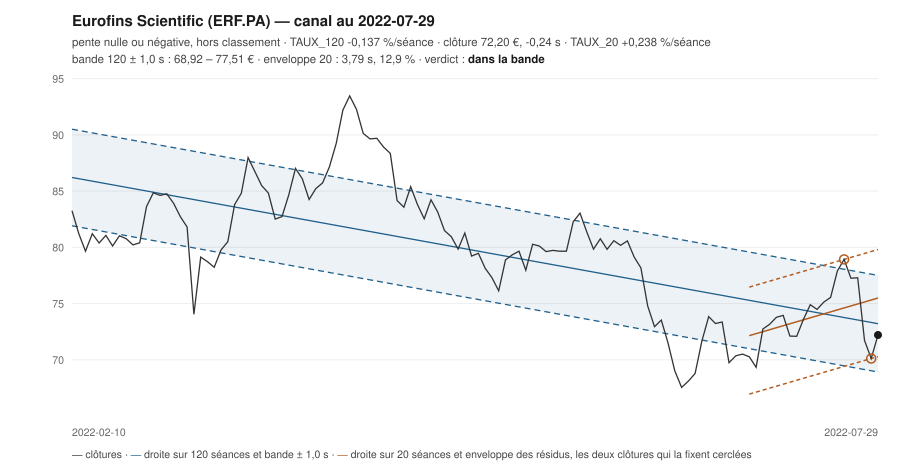

> Hors classement · TAUX_120 -0,137 %/séance · clôture 72,20 € · bande 68,92 – 77,51 € · écart -0,24 s · TAUX_20 +0,238 %/séance · enveloppe 20 : 3,79 s, 12,9 % · **dans la bande**

- Clôture 72,20 €, à −0,24 s, dans la bande de 68,92 à 77,51 €.
- Chemin agité : −1,49 s le 2022-07-05, une seule clôture au-dessus du bord haut à +1,17 s le 2022-07-22, puis retour dans la bande le 2022-07-25.
- Pente longue −0,137 %/séance, hors classement ; pente courte +0,238 %/séance depuis 16 séances : sens contraires.
- Enveloppe de 3,79 s, conforme aux ~3,7 s, mais 12,9 % du niveau moyen ; ses deux bornes sont récentes, 2022-07-22 (haut) et 2022-07-28 (bas).
- Verdict : dans la bande.

### `VIV.PA` — Vivendi

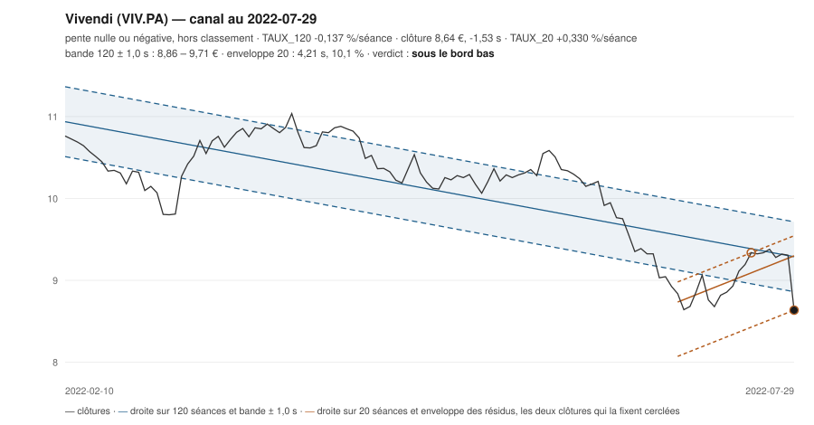

> Hors classement · TAUX_120 -0,137 %/séance · clôture 8,64 € · bande 8,86 – 9,71 € · écart -1,53 s · TAUX_20 +0,330 %/séance · enveloppe 20 : 4,21 s, 10,1 % · **sous le bord bas**

- Clôture 8,64 €, à −1,53 s, sous le bord bas de 8,86 € (bande 8,86 à 9,71 €), franchi ce jour.
- Retour sous le bord bas après une remontée : −3,00 s au 2022-07-04, 11 des 20 séances sous −1 s, puis −0,03 s le 2022-07-25.
- Pente longue −0,137 %/séance, hors classement ; pente courte +0,330 %/séance, positive depuis 6 séances.
- Enveloppe de 4,21 s (10,1 % du niveau moyen), au-dessus des ~3,7 s ; la clôture du jour fixe le résidu bas, celle du 2022-07-20 le résidu haut.
- Verdict : sous le bord bas, non candidate — pente longue négative, hors TOP 10.

### `STLAP.PA` — Stellantis

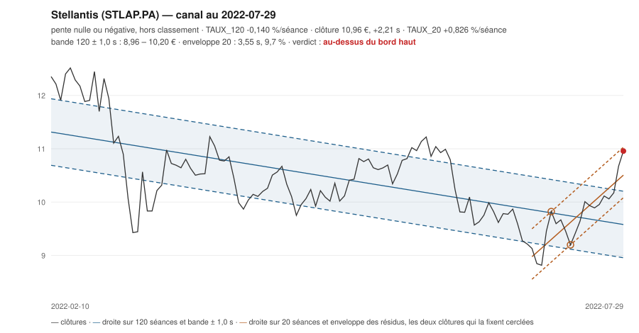

> Hors classement · TAUX_120 -0,140 %/séance · clôture 10,96 € · bande 8,96 – 10,20 € · écart +2,21 s · TAUX_20 +0,826 %/séance · enveloppe 20 : 3,55 s, 9,7 % · **au-dessus du bord haut**

- Clôture 10,96 €, à +2,21 s, au-dessus du bord haut de 10,20 € (bande 8,96 à 10,20 €) depuis 3 séances, écart maximal des 20 séances.
- Pente longue −0,140 %/séance, hors classement ; pente courte +0,826 %/séance, positive depuis 8 séances : discordance.
- Enveloppe de 3,55 s (9,7 % du niveau moyen), un peu sous les ~3,7 s ; bornes anciennes, 2022-07-08 (haut) et 2022-07-14 (bas).
- Verdict : au-dessus du bord haut.

### `DSY.PA` — Dassault Systèmes

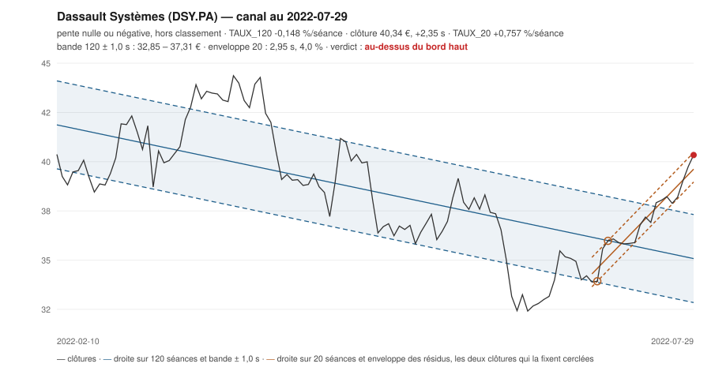

> Hors classement · TAUX_120 -0,148 %/séance · clôture 40,34 € · bande 32,85 – 37,31 € · écart +2,35 s · TAUX_20 +0,757 %/séance · enveloppe 20 : 2,95 s, 4,0 % · **au-dessus du bord haut**

- Clôture 40,34 €, à +2,35 s, au-dessus du bord haut de 37,31 € (bande 32,85 à 37,31 €) depuis 10 séances ; l'écart du jour est le maximum des 20 dernières séances.
- Pente longue −0,148 %/séance, hors classement ; pente courte +0,757 %/séance, positive depuis 18 séances : opposition nette.
- Enveloppe étroite, 2,95 s (4,0 % du niveau moyen), bien sous les ~3,7 s ; ses deux clôtures sont anciennes, 2022-07-05 (bas) et 2022-07-07 (haut).
- Verdict : au-dessus du bord haut.

### `STMPA.PA` — STMicroelectronics

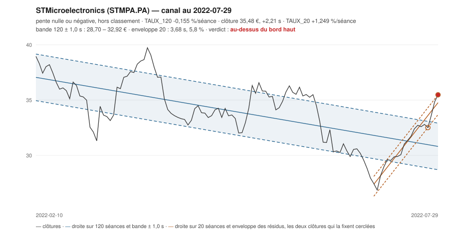

> Hors classement · TAUX_120 -0,155 %/séance · clôture 35,48 € · bande 28,70 – 32,92 € · écart +2,21 s · TAUX_20 +1,249 %/séance · enveloppe 20 : 3,68 s, 5,8 % · **au-dessus du bord haut**

- Clôture 35,48 €, à +2,21 s, au-dessus du bord haut de 32,92 € (bande 28,70 à 32,92 €), franchi le 2022-07-27.
- Traversée complète de la bande en 20 séances : −2,02 s le 2022-07-04, +1,04 s le 2022-07-22, +2,21 s ce jour.
- Pente longue −0,155 %/séance, hors classement ; pente courte +1,249 %/séance, positive depuis 9 séances : opposition nette.
- Enveloppe de 3,68 s (5,8 % du niveau moyen) ; bornes récentes, 2022-07-26 (bas) et clôture du jour (haut).
- Verdict : au-dessus du bord haut.

### `WLN.PA` — Worldline

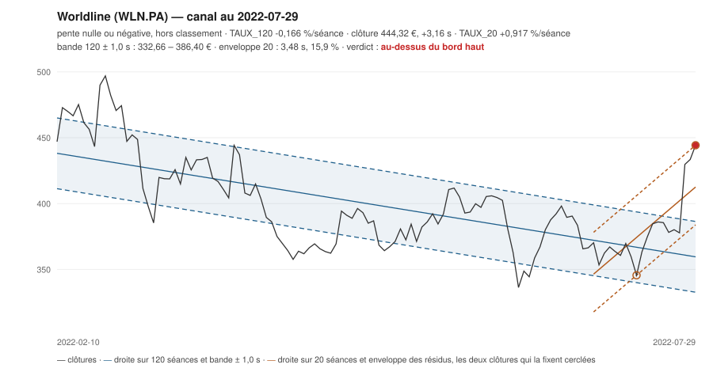

> Hors classement · TAUX_120 -0,166 %/séance · clôture 444,32 € · bande 332,66 – 386,40 € · écart +3,16 s · TAUX_20 +0,917 %/séance · enveloppe 20 : 3,48 s, 15,9 % · **au-dessus du bord haut**

- Clôture 444,32 €, à +3,16 s, au-dessus du bord haut de 386,40 € (bande 332,66 à 386,40 €) depuis 9 séances, écart maximal des 20 séances.
- Pente longue −0,166 %/séance, hors classement ; pente courte +0,917 %/séance, positive depuis 5 séances : opposition.
- Enveloppe de 3,48 s mais 15,9 % du niveau moyen, la plus large de l'univers en valeur relative ce jour ; résidu bas le 2022-07-14, résidu haut à la clôture du jour.
- Verdict : au-dessus du bord haut.

### `GLE.PA` — Société Générale

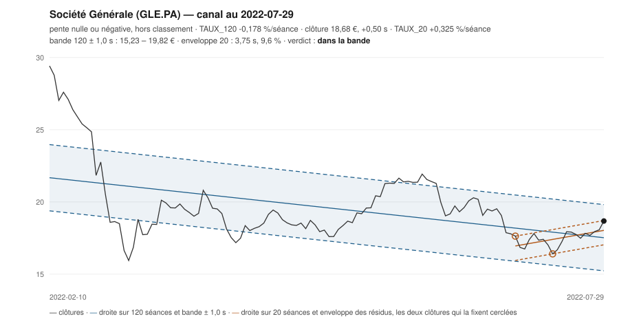

> Hors classement · TAUX_120 -0,178 %/séance · clôture 18,68 € · bande 15,23 – 19,82 € · écart +0,50 s · TAUX_20 +0,325 %/séance · enveloppe 20 : 3,75 s, 9,6 % · **dans la bande**

- Clôture 18,68 €, à +0,50 s, dans la bande de 15,23 à 19,82 € depuis 27 séances ; l'écart n'a pas quitté l'intervalle −0,26 s à +0,50 s sur 20 séances.
- Pente longue −0,178 %/séance, hors classement ; pente courte +0,325 %/séance, positive depuis 3 séances : désaccord.
- Enveloppe de 3,75 s (9,6 % du niveau moyen), au niveau attendu ; résidu haut à la première séance de la fenêtre (2022-07-04), résidu bas le 2022-07-14.
- Verdict : dans la bande.

### `MT.AS` — ArcelorMittal

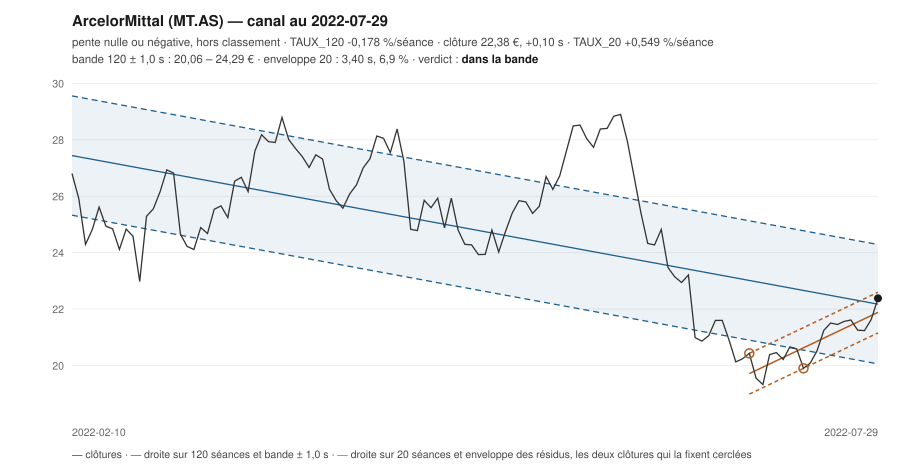

> Hors classement · TAUX_120 -0,178 %/séance · clôture 22,38 € · bande 20,06 – 24,29 € · écart +0,10 s · TAUX_20 +0,549 %/séance · enveloppe 20 : 3,40 s, 6,9 % · **dans la bande**

- Clôture 22,38 €, à +0,10 s, dans la bande de 20,06 à 24,29 €.
- Rentrée le 2022-07-19, il y a 9 séances, après 11 séances sous le bord bas en début de fenêtre (−2,41 s le 2022-07-06).
- Pente longue −0,178 %/séance, hors classement ; pente courte +0,549 %/séance, positive depuis 7 séances : discordance.
- Enveloppe de 3,40 s (6,9 % du niveau moyen), sous les ~3,7 s ; bornes anciennes, 2022-07-04 (haut) et 2022-07-14 (bas).
- Verdict : dans la bande.

### `SU.PA` — Schneider Electric

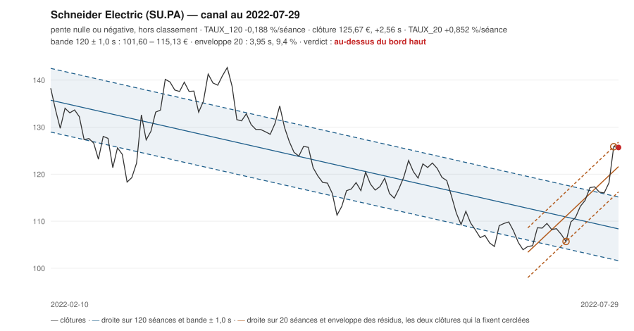

> Hors classement · TAUX_120 -0,188 %/séance · clôture 125,67 € · bande 101,60 – 115,13 € · écart +2,56 s · TAUX_20 +0,852 %/séance · enveloppe 20 : 3,95 s, 9,4 % · **au-dessus du bord haut**

- Clôture 125,67 €, à +2,56 s, au-dessus du bord haut de 115,13 € (bande 101,60 à 115,13 €) depuis 8 séances.
- L'écart est passé de −0,89 s le 2022-07-04 à +2,72 s le 2022-07-28.
- Pente longue −0,188 %/séance, hors classement ; pente courte +0,852 %/séance, positive depuis 13 séances.
- Enveloppe de 3,95 s (9,4 % du niveau moyen) ; résidu bas le 2022-07-14, résidu haut le 2022-07-28.
- Verdict : au-dessus du bord haut.

### `KER.PA` — Kering

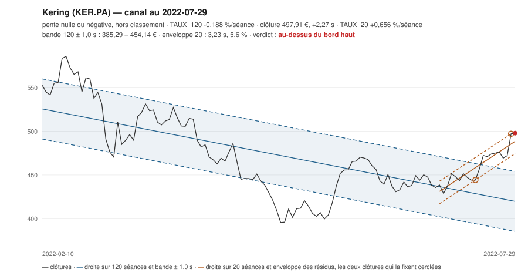

> Hors classement · TAUX_120 -0,188 %/séance · clôture 497,91 € · bande 385,29 – 454,14 € · écart +2,27 s · TAUX_20 +0,656 %/séance · enveloppe 20 : 3,23 s, 5,6 % · **au-dessus du bord haut**

- Clôture 497,91 €, à +2,27 s, au-dessus du bord haut de 454,14 € (bande 385,29 à 454,14 €).
- Au-dessus depuis 18 séances ; sur 20 séances, une seule clôture n'a pas dépassé +1 s, à +1,00 s le 2022-07-05.
- Pente longue −0,188 %/séance, hors classement ; pente courte +0,656 %/séance depuis 16 séances : opposition.
- Enveloppe de 3,23 s (5,6 % du niveau moyen), sous les ~3,7 s ; résidu bas le 2022-07-15 (10e séance), résidu haut le 2022-07-28 (19e).
- Verdict : au-dessus du bord haut.

### `ACA.PA` — Crédit Agricole

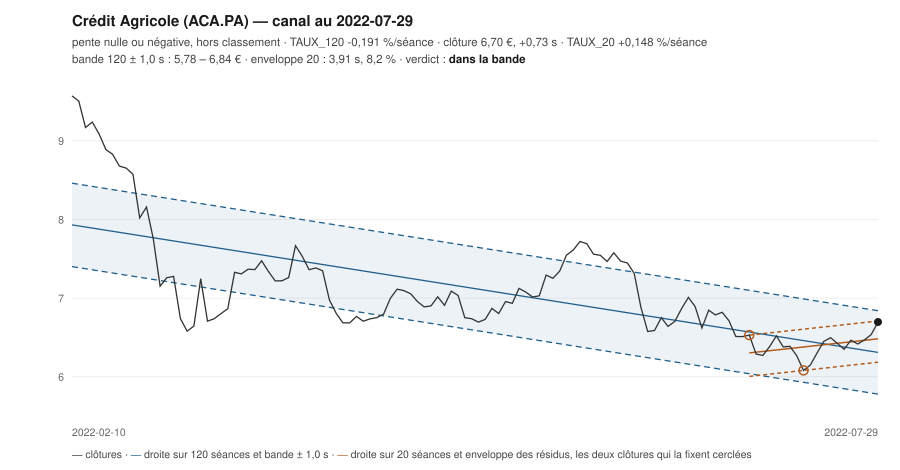

> Hors classement · TAUX_120 -0,191 %/séance · clôture 6,70 € · bande 5,78 – 6,84 € · écart +0,73 s · TAUX_20 +0,148 %/séance · enveloppe 20 : 3,91 s, 8,2 % · **dans la bande**

- Clôture 6,70 €, à +0,73 s, dans la bande de 5,78 à 6,84 € ; elle y est depuis 36 séances, entrée le 2022-06-10 par le haut, et l'écart du jour est le plus élevé des 20 dernières séances.
- Pente longue négative, −0,191 %/séance, hors classement ; pente courte positive, +0,148 %/séance, depuis 2 séances seulement : les deux canaux divergent.
- Enveloppe des 20 résidus de 3,91 s (8,2 % du niveau moyen), un peu au-dessus des ~3,7 s attendues ; le résidu haut est la plus ancienne clôture de la fenêtre (2022-07-04), le résidu bas celle du 2022-07-14.
- Verdict : dans la bande.

### `PUB.PA` — Publicis

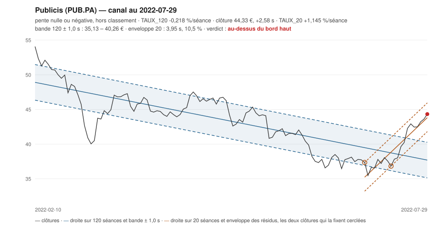

> Hors classement · TAUX_120 -0,218 %/séance · clôture 44,33 € · bande 35,13 – 40,26 € · écart +2,58 s · TAUX_20 +1,145 %/séance · enveloppe 20 : 3,95 s, 10,5 % · **au-dessus du bord haut**

- Clôture 44,33 €, à +2,58 s, au-dessus du bord haut de 40,26 € (bande 35,13 à 40,26 €), écart le plus haut des 20 séances.
- Au-dessus depuis 9 séances ; la fenêtre partait de −0,63 s et touchait −1,35 s le 2022-07-05.
- Pente longue −0,218 %/séance, hors classement ; pente courte +1,145 %/séance, positive depuis 9 séances : opposition marquée.
- Enveloppe de 3,95 s (10,5 % du niveau moyen) ; résidu haut à la première séance (2022-07-04), résidu bas le 2022-07-14.
- Verdict : au-dessus du bord haut.

### `VIE.PA` — Veolia

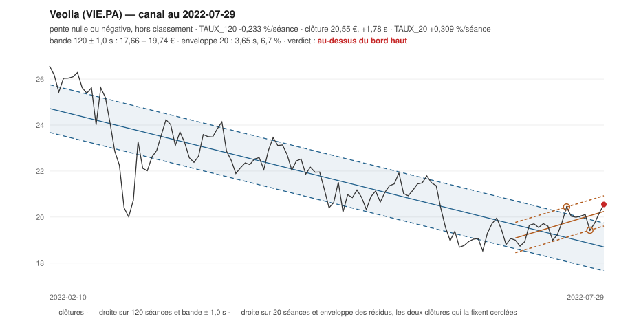

> Hors classement · TAUX_120 -0,233 %/séance · clôture 20,55 € · bande 17,66 – 19,74 € · écart +1,78 s · TAUX_20 +0,309 %/séance · enveloppe 20 : 3,65 s, 6,7 % · **au-dessus du bord haut**

- Clôture 20,55 €, à +1,78 s, au-dessus du bord haut de 19,74 € (bande 17,66 à 19,74 €) depuis 3 séances ; écart le plus haut des 20 séances.
- Deuxième passage au-dessus sur la fenêtre : 9 des 20 séances y ont clos, avec un retour dans la bande avant le 2022-07-27.
- Pente longue −0,233 %/séance, hors classement ; pente courte +0,309 %/séance, positive depuis 16 séances.
- Enveloppe de 3,65 s (6,7 % du niveau moyen) ; bornes en seconde moitié, 2022-07-19 (haut) et 2022-07-26 (bas).
- Verdict : au-dessus du bord haut.

### `SGO.PA` — Saint-Gobain

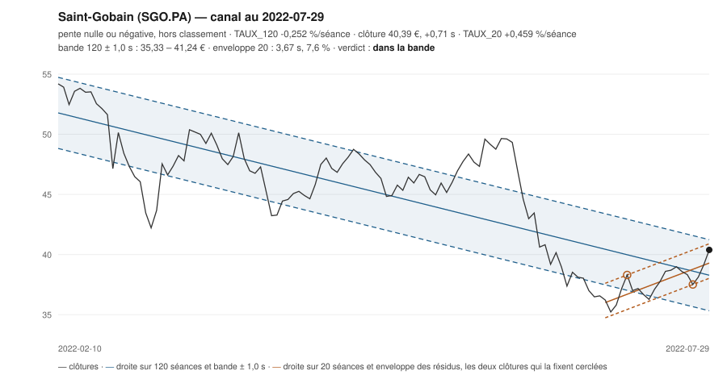

> Hors classement · TAUX_120 -0,252 %/séance · clôture 40,39 € · bande 35,33 – 41,24 € · écart +0,71 s · TAUX_20 +0,459 %/séance · enveloppe 20 : 3,67 s, 7,6 % · **dans la bande**

- Clôture 40,39 €, à +0,71 s, dans la bande de 35,33 à 41,24 € ; écart le plus haut des 20 séances.
- Traversée par le bas : −2,03 s le 2022-07-05, 8 séances sous le bord bas, retour dans la bande le 2022-07-15.
- Pente longue −0,252 %/séance, la plus négative de l'univers ce jour, hors classement ; pente courte +0,459 %/séance depuis 8 séances : sens opposés.
- Enveloppe de 3,67 s (7,6 % du niveau moyen) ; résidu haut le 2022-07-08, résidu bas le 2022-07-26.
- Verdict : dans la bande.

### Les figures des ordres du mois

#### 2022-07-04 — Achat `SAN.PA` Sanofi, décision au 2022-07-01

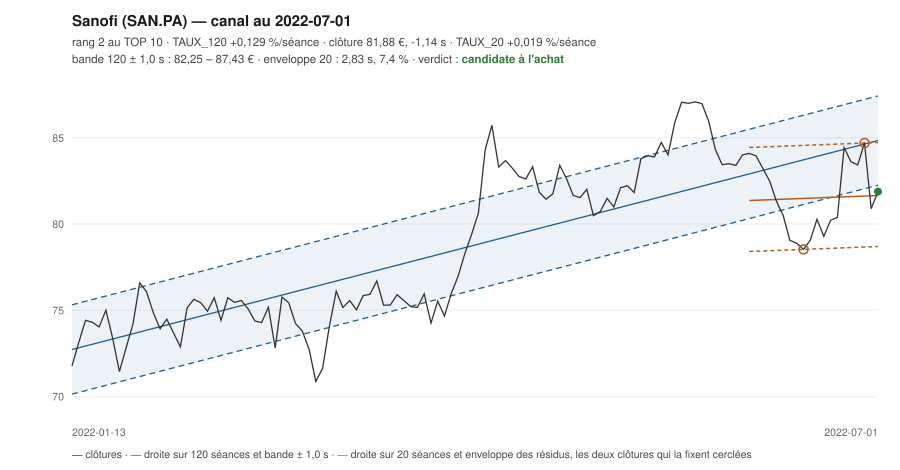

> Rang 2 · TAUX_120 +0,129 %/séance · clôture 81,88 € · bande 82,25 – 87,43 € · écart -1,14 s · TAUX_20 +0,019 %/séance · enveloppe 20 : 2,83 s, 7,4 % · **candidate à l'achat**

#### 2022-07-08 — Achat `ORA.PA` Orange, décision au 2022-07-07

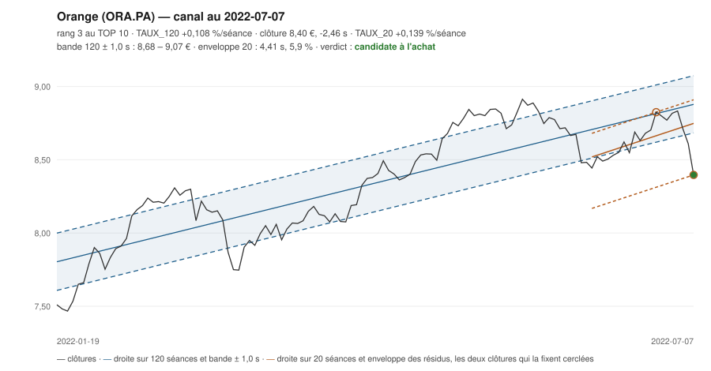

> Rang 3 · TAUX_120 +0,108 %/séance · clôture 8,40 € · bande 8,68 – 9,07 € · écart -2,46 s · TAUX_20 +0,139 %/séance · enveloppe 20 : 4,41 s, 5,9 % · **candidate à l'achat**

#### 2022-07-20 — Vente `DG.PA` Vinci, décision au 2022-07-19

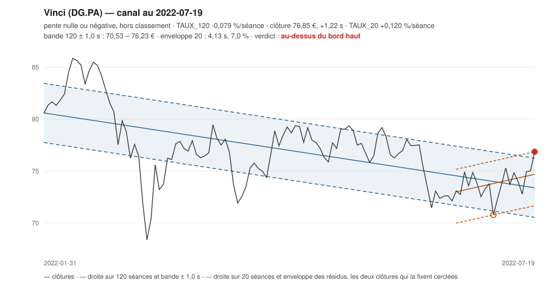

> Hors classement · TAUX_120 -0,079 %/séance · clôture 76,85 € · bande 70,53 – 76,23 € · écart +1,22 s · TAUX_20 +0,120 %/séance · enveloppe 20 : 4,13 s, 7,0 % · **au-dessus du bord haut**

## 5. Le TOP 10 au 2022-07-29

| Rang | Valeur | TAUX_120 | Écart | TAUX_20 | Verdict |
|---|---|---|---|---|---|
| 1 | `HO.PA` Thales | +0,180 %/séance | -0,42 s | +0,237 %/séance | dans la bande |
| 2 | `SAN.PA` Sanofi | +0,107 %/séance | -1,37 s | -0,022 %/séance | sous le bord bas |
| 3 | `TTE.PA` TotalEnergies | +0,092 %/séance | -0,51 s | -0,049 %/séance | dans la bande |
| 4 | `ALO.PA` Alstom | +0,078 %/séance | -0,35 s | +0,060 %/séance | dans la bande |
| 5 | `BN.PA` Danone | +0,054 %/séance | -0,27 s | +0,079 %/séance | dans la bande |
| 6 | `ORA.PA` Orange | +0,040 %/séance | -2,65 s | -0,553 %/séance | sous le bord bas |

*Le TOP ne compte que 6 valeurs : moins de 10 pentes sont strictement positives ce jour-là.*

**Entrées et sorties du TOP 10 au fil du mois**

| Séance | Entrées | Sorties |
|---|---|---|
| 2022-07-18 | `ALO.PA` | — |
| 2022-07-19 | — | `EN.PA` |
| 2022-07-25 | — | `AI.PA` |
| 2022-07-26 | — | `CA.PA` |

## 6. Les ordres exécutés

> À l'**ouverture** de la séance qui suit la décision, jamais à la clôture qui l'a déclenchée. L'écart d'ouverture est subi, et publié.

| Exécution | Sens | Valeur | Quantité | Prix | Brut | Frais | Écart d'ouverture | Motif |
|---|---|---|---|---|---|---|---|---|
| 2022-07-04 | **Achat** | `SAN.PA` Sanofi | 11 | 82,42 € | 906,67 € | 3,76 € | +0,67 % | décision au 2022-07-01 : clôture 81,88 € sous le bord bas 82,25 € (-1,14 s), rang 2, TAUX_120 +0,129 %/séance, TAUX_20 +0,019 %/séance |
| 2022-07-08 | **Achat** | `ORA.PA` Orange | 114 | 8,36 € | 953,50 € | 3,96 € | -0,39 % | décision au 2022-07-07 : clôture 8,40 € sous le bord bas 8,68 € (-2,46 s), rang 3, TAUX_120 +0,108 %/séance, TAUX_20 +0,139 %/séance |
| 2022-07-20 | **Vente** | `DG.PA` Vinci | 13 | 77,14 € | 1 002,79 € | 1,15 € | +0,38 % | décision au 2022-07-19 : clôture 76,85 € au-dessus du bord haut 76,23 € (+1,22 s) |

## 7. Les signaux non exécutés

*Aucun : chaque candidat du mois a été acheté.*

## 8. La lecture du mois

Sur le mois, la meilleure contribution vient de `DG.PA` (Vinci) pour **+58,67 €**, la moins bonne de `ORA.PA` (Orange) pour **-66,60 €**. Les 3 ordres du mois ont coûté **8,87 €** de frais, soit 0,089 % de la dotation. Le portefeuille termine le mois **derrière TR39** de 7,81 point.

---

[← Juin](2022-06.md) · [Protocole](../README.md) · [Août →](2022-08.md)
