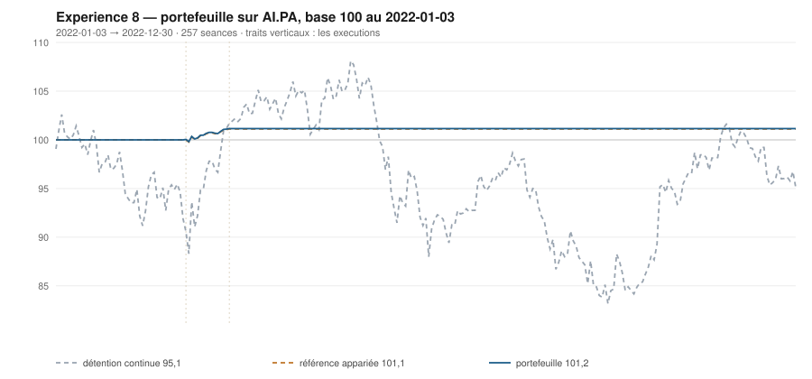

# 2022

> Journal de l'[expérience 8](../README.md) · 257 séances · **2 ordres**
> Portefeuille au 2022-12-30 : **10 115,59 €** (base 101,16) · appariée 101,11 · détention continue 95,10

---

## Le portefeuille depuis le 2022-01-03

| | |
|---|---|
| Valeur au 1er jour de l'année | 10 000,00 € |
| Valeur au 2022-12-30 | **10 115,59 €** |
| Variation de l'année | **+1,16 %** |
| Espèces · titres | 10 115,59 € · 0,00 € |
| Part investie moyenne de l'année | 0,55 % |

## Les ordres

| Exécution | Décision | Sens | Quantité | Prix réel | Frais | Motif |
|---|---|---|---|---|---|---|
| 2022-03-07 | 2022-03-04 | **ACHAT** | 7 | 127,61 € | 3,71 € | clôture 98,10 sous le bord bas 101,79 (-2,16 s), TAUX_20 +0,053 %/séance |
| 2022-03-28 | 2022-03-25 | **VENTE** | 7 | 144,82 € | 1,17 € | clôture 108,07 au-dessus du bord haut 106,89 (+1,36 s) |

## Les positions touchant l'année

| Premier achat | Sortie | Tranches | Titres | Prix moyen | Prix de sortie | +/− value | Repli max. | Contribution | Séances |
|---|---|---|---|---|---|---|---|---|---|
| 2022-03-07 | 2022-03-28 | 1 | 7 | 127,61 € | 144,82 € | **+13,49 %** | -1,70 % | +115,59 € | 16 |

## Les décisions de l'année

| Mesure | Valeur |
|---|---|
| Décisions hebdomadaires | 52 |
| Sous le bord bas | 12 |
| … dont `TAUX_20 ≥ 0`, donc achetables | **1** |
| Au-dessus du bord haut | 14 |

## La lecture de l'année

Le portefeuille termine l'année à 10 115,59 €, soit +1,16 % sur l'année. Les 2 ordres de l'année — 1 achat, 1 vente — ont coûté 4,87 € de frais. Depuis le début, le portefeuille est devant sa référence à exposition appariée de 0,05 point.

---

[Protocole](../README.md) · [2023 →](2023.md)
