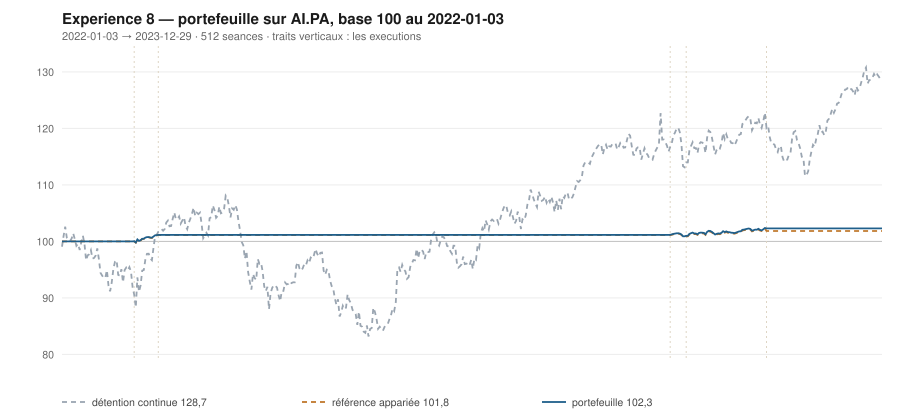

# 2023

> Journal de l'[expérience 8](../README.md) · 255 séances · **3 ordres**
> Portefeuille au 2023-12-29 : **10 229,99 €** (base 102,30) · appariée 101,84 · détention continue 128,66

---

## Le portefeuille depuis le 2022-01-03

| | |
|---|---|
| Valeur au 1er jour de l'année | 10 115,59 € |
| Valeur au 2023-12-29 | **10 229,99 €** |
| Variation de l'année | **+1,13 %** |
| Espèces · titres | 10 229,99 € · 0,00 € |
| Part investie moyenne de l'année | 3,90 % |

## Les ordres

| Exécution | Décision | Sens | Quantité | Prix réel | Frais | Motif |
|---|---|---|---|---|---|---|
| 2023-06-26 | 2023-06-23 | **ACHAT** | 6 | 150,01 € | 3,74 € | clôture 123,87 sous le bord bas 125,69 (-1,82 s), TAUX_20 +0,115 %/séance |
| 2023-07-10 | 2023-07-07 | **REGLE-4** | 6 | 146,17 € | 3,64 € | clôture 120,90 sous le seuil de la règle 4 (-3,09 s dans la bande) |
| 2023-09-18 | 2023-09-15 | **VENTE** | 12 | 158,42 € | 2,19 € | clôture 131,27 au-dessus du bord haut 130,46 (+1,39 s) |

## Les positions touchant l'année

| Premier achat | Sortie | Tranches | Titres | Prix moyen | Prix de sortie | +/− value | Repli max. | Contribution | Séances |
|---|---|---|---|---|---|---|---|---|---|
| 2023-06-26 | 2023-09-18 | 2 | 12 | 148,09 € | 158,42 € | **+6,98 %** | -1,22 % | +114,40 € | 61 |

## Les décisions de l'année

| Mesure | Valeur |
|---|---|
| Décisions hebdomadaires | 52 |
| Sous le bord bas | 13 |
| … dont `TAUX_20 ≥ 0`, donc achetables | **2** |
| Au-dessus du bord haut | 13 |

## La lecture de l'année

Le portefeuille termine l'année à 10 229,99 €, soit +1,13 % sur l'année. Les 3 ordres de l'année — 1 achat, 1 regle-4, 1 vente — ont coûté 9,56 € de frais. Depuis le début, le portefeuille est devant sa référence à exposition appariée de 0,46 point.

---

[← 2022](2022.md) · [Protocole](../README.md) · [2024 →](2024.md)
