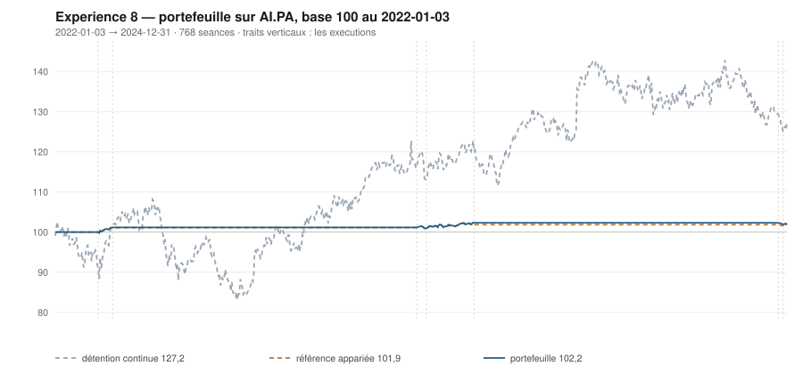

# 2024

> Journal de l'[expérience 8](../README.md) · 256 séances · **2 ordres**
> Portefeuille au 2024-12-31 : **10 221,55 €** (base 102,22) · appariée 101,86 · détention continue 127,25

---

## Le portefeuille depuis le 2022-01-03

| | |
|---|---|
| Valeur au 1er jour de l'année | 10 229,99 € |
| Valeur au 2024-12-31 | **10 221,55 €** |
| Variation de l'année | **-0,08 %** |
| Espèces · titres | 8 410,64 € · 1 810,91 € |
| Part investie moyenne de l'année | 0,52 % |

## Les ordres

| Exécution | Décision | Sens | Quantité | Prix réel | Frais | Motif |
|---|---|---|---|---|---|---|
| 2024-12-16 | 2024-12-13 | **ACHAT** | 6 | 153,22 € | 3,82 € | clôture 139,62 sous le bord bas 139,66 (-1,01 s), TAUX_20 +0,073 %/séance |
| 2024-12-23 | 2024-12-20 | **REGLE-4** | 6 | 148,76 € | 3,70 € | clôture 135,84 sous le seuil de la règle 4 (-1,65 s dans la bande) |

## Les positions touchant l'année

| Premier achat | Sortie | Tranches | Titres | Prix moyen | Prix de sortie | +/− value | Repli max. | Contribution | Séances |
|---|---|---|---|---|---|---|---|---|---|
| 2024-12-16 | 2025-01-27 | 2 | 12 | 150,99 € | 156,76 € | **+3,82 %** | -1,76 % | +59,56 € | 28 |

## Les décisions de l'année

| Mesure | Valeur |
|---|---|
| Décisions hebdomadaires | 52 |
| Sous le bord bas | 15 |
| … dont `TAUX_20 ≥ 0`, donc achetables | **1** |
| Au-dessus du bord haut | 10 |

## La lecture de l'année

Le portefeuille termine l'année à 10 221,55 €, soit -0,08 % sur l'année. Les 2 ordres de l'année — 1 achat, 1 regle-4 — ont coûté 7,52 € de frais. Depuis le début, le portefeuille est devant sa référence à exposition appariée de 0,36 point.

---

[← 2023](2023.md) · [Protocole](../README.md) · [2025 →](2025.md)
