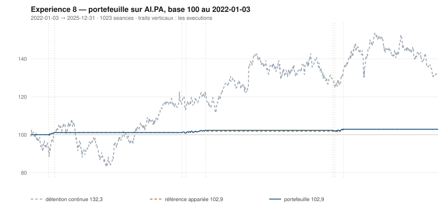

# 2025

> Journal de l'[expérience 8](../README.md) · 255 séances · **1 ordre**
> Portefeuille au 2025-12-31 : **10 289,55 €** (base 102,90) · appariée 102,89 · détention continue 132,28

---

## Le portefeuille depuis le 2022-01-03

| | |
|---|---|
| Valeur au 1er jour de l'année | 10 221,55 € |
| Valeur au 2025-12-31 | **10 289,55 €** |
| Variation de l'année | **+0,67 %** |
| Espèces · titres | 10 289,55 € · 0,00 € |
| Part investie moyenne de l'année | 1,19 % |

## Les ordres

| Exécution | Décision | Sens | Quantité | Prix réel | Frais | Motif |
|---|---|---|---|---|---|---|
| 2025-01-27 | 2025-01-24 | **VENTE** | 12 | 156,76 € | 2,16 € | clôture 143,17 au-dessus du bord haut 141,47 (+1,48 s) |

## Les positions touchant l'année

| Premier achat | Sortie | Tranches | Titres | Prix moyen | Prix de sortie | +/− value | Repli max. | Contribution | Séances |
|---|---|---|---|---|---|---|---|---|---|
| 2024-12-16 | 2025-01-27 | 2 | 12 | 150,99 € | 156,76 € | **+3,82 %** | -1,76 % | +59,56 € | 28 |

## Les décisions de l'année

| Mesure | Valeur |
|---|---|
| Décisions hebdomadaires | 52 |
| Sous le bord bas | 15 |
| … dont `TAUX_20 ≥ 0`, donc achetables | **0** |
| Au-dessus du bord haut | 9 |

## La lecture de l'année

Le portefeuille termine l'année à 10 289,55 €, soit +0,67 % sur l'année. Les 1 ordres de l'année — 1 vente — ont coûté 2,16 € de frais. Depuis le début, le portefeuille est devant sa référence à exposition appariée de 0,00 point.

---

[← 2024](2024.md) · [Protocole](../README.md) · [2026 →](2026.md)
