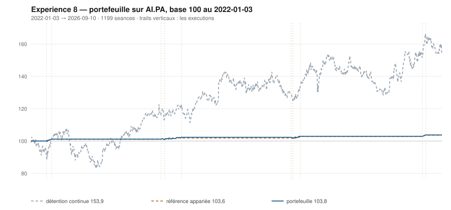

# 2026

> Journal de l'[expérience 8](../README.md) · 176 séances · **2 ordres**
> Portefeuille au 2026-09-10 : **10 377,30 €** (base 103,77) · appariée 103,60 · détention continue 153,92

---

## Le portefeuille depuis le 2022-01-03

| | |
|---|---|
| Valeur au 1er jour de l'année | 10 289,55 € |
| Valeur au 2026-09-10 | **10 377,30 €** |
| Variation de l'année | **+0,85 %** |
| Espèces · titres | 10 377,30 € · 0,00 € |
| Part investie moyenne de l'année | 0,57 % |

## Les ordres

| Exécution | Décision | Sens | Quantité | Prix réel | Frais | Motif |
|---|---|---|---|---|---|---|
| 2026-06-22 | 2026-06-19 | **ACHAT** | 6 | 165,48 € | 4,12 € | clôture 164,16 sous le bord bas 164,71 (-1,12 s), TAUX_20 +0,077 %/séance |
| 2026-07-06 | 2026-07-03 | **VENTE** | 6 | 181,00 € | 1,25 € | clôture 180,30 au-dessus du bord haut 176,82 (+1,75 s) |

## Les positions touchant l'année

| Premier achat | Sortie | Tranches | Titres | Prix moyen | Prix de sortie | +/− value | Repli max. | Contribution | Séances |
|---|---|---|---|---|---|---|---|---|---|
| 2026-06-22 | 2026-07-06 | 1 | 6 | 165,48 € | 181,00 € | **+9,38 %** | +0,13 % | +87,75 € | 11 |

## Les décisions de l'année

| Mesure | Valeur |
|---|---|
| Décisions hebdomadaires | 37 |
| Sous le bord bas | 8 |
| … dont `TAUX_20 ≥ 0`, donc achetables | **2** |
| Au-dessus du bord haut | 12 |

## La lecture de l'année

Le portefeuille termine l'année à 10 377,30 €, soit +0,85 % sur l'année. Les 2 ordres de l'année — 1 achat, 1 vente — ont coûté 5,37 € de frais. Depuis le début, le portefeuille est devant sa référence à exposition appariée de 0,17 point.

---

[← 2025](2025.md) · [Protocole](../README.md)
