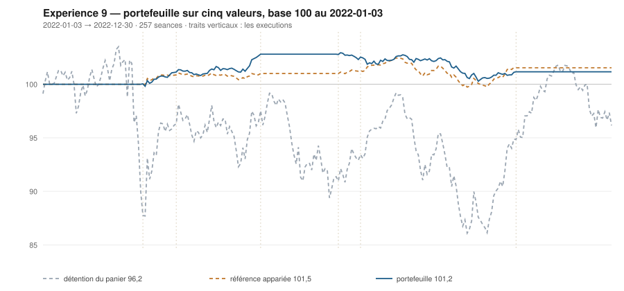

# 2022

> Journal de l'[expérience 9](../README.md) · 257 séances · **7 ordres** sur cinq valeurs
> Portefeuille au 2022-12-30 : **10 116,13 €** (base 101,16) · appariée 101,54 · détention du panier 96,16

---

## Le portefeuille depuis le 2022-01-03

| | |
|---|---|
| Valeur au 1er jour de l'année | 10 000,00 € |
| Valeur au 2022-12-30 | **10 116,13 €** |
| Variation de l'année | **+1,16 %** |
| Espèces · titres | 10 116,13 € · 0,00 € |
| Part investie moyenne de l'année | 7,61 % |
| Lignes ouvertes au 2022-12-30 | 0 sur 5 |

## Les ordres

| Exécution | Décision | Valeur | Sens | Rang | Quantité | Prix réel | Frais | Motif |
|---|---|---|---|---|---|---|---|---|
| 2022-03-07 | 2022-03-04 | `AI.PA` | **ACHAT** | 1 | 7 | 127,61 € | 3,71 € | AI.PA : clôture 98,10 sous le bord bas 101,79 (-2,16 s), TAUX_20 +0,053 %/séance |
| 2022-03-28 | 2022-03-25 | `AI.PA` | **VENTE** | 1 | 7 | 144,82 € | 1,17 € | AI.PA : clôture 108,07 au-dessus du bord haut 106,89 (+1,36 s) |
| 2022-03-28 | 2022-03-25 | `ENGI.PA` | **ACHAT** | 1 | 126 | 7,97 € | 4,17 € | ENGI.PA : clôture 7,97 sous le bord bas 8,22 (-1,38 s), TAUX_20 +0,017 %/séance |
| 2022-05-23 | 2022-05-20 | `ENGI.PA` | **VENTE** | 1 | 126 | 9,33 € | 1,35 € | ENGI.PA : clôture 9,19 au-dessus du bord haut 8,68 (+1,86 s) |
| 2022-07-11 | 2022-07-08 | `ORA.PA` | **ACHAT** | 1 | 123 | 8,28 € | 4,23 € | ORA.PA : clôture 8,28 sous le bord bas 8,66 (-2,89 s), TAUX_20 +0,047 %/séance |
| 2022-07-25 | 2022-07-22 | `ORA.PA` | **REGLE-4** | 1 | 128 | 7,93 € | 4,21 € | ORA.PA : clôture 7,91 sous le seuil de la règle 4 (-3,15 s dans la bande) |
| 2022-10-31 | 2022-10-28 | `ORA.PA` | **VENTE** | 1 | 251 | 7,49 € | 2,16 € | ORA.PA : clôture 7,46 au-dessus du bord haut 7,41 (+1,28 s) |

## Les positions touchant l'année

| Valeur | Premier achat | Sortie | Tranches | Titres | Prix moyen | Prix de sortie | +/− value | Repli max. | Contribution | Séances |
|---|---|---|---|---|---|---|---|---|---|---|
| `AI.PA` | 2022-03-07 | 2022-03-28 | 1 | 7 | 127,61 € | 144,82 € | **+13,49 %** | -1,70 % | +115,59 € | 16 |
| `ENGI.PA` | 2022-03-28 | 2022-05-23 | 1 | 126 | 7,97 € | 9,33 € | **+16,96 %** | -2,98 % | +164,88 € | 39 |
| `ORA.PA` | 2022-07-11 | 2022-10-31 | 2 | 251 | 8,10 € | 7,49 € | **-7,56 %** | -12,03 % | -164,35 € | 81 |

## Les décisions de l'année

| Mesure | Valeur |
|---|---|
| Décisions hebdomadaires | 52 |
| Évaluations, cinq valeurs | 260 |
| Sous le bord bas | 59 |
| … dont `TAUX_20 ≥ 0`, donc achetables | **4** |
| Au-dessus du bord haut | 67 |

## La lecture de l'année

Le portefeuille termine l'année à 10 116,13 €, soit +1,16 % sur l'année. Les 7 ordres de l'année ont porté sur 3 valeurs — AI.PA, ENGI.PA, ORA.PA — pour 21,00 € de frais. Depuis le début, le portefeuille est derrière sa référence à exposition appariée de 0,38 point.

---

[Protocole](../README.md) · [2023 →](2023.md)
