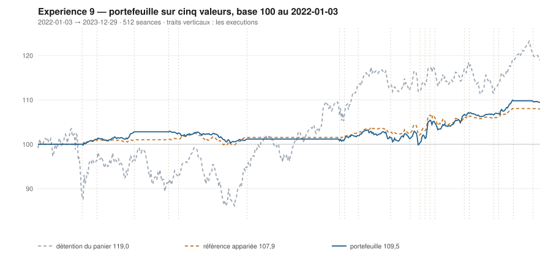

# 2023

> Journal de l'[expérience 9](../README.md) · 255 séances · **18 ordres** sur cinq valeurs
> Portefeuille au 2023-12-29 : **10 945,98 €** (base 109,46) · appariée 107,94 · détention du panier 119,00

---

## Le portefeuille depuis le 2022-01-03

| | |
|---|---|
| Valeur au 1er jour de l'année | 10 116,13 € |
| Valeur au 2023-12-29 | **10 945,98 €** |
| Variation de l'année | **+8,20 %** |
| Espèces · titres | 9 882,88 € · 1 063,10 € |
| Part investie moyenne de l'année | 26,19 % |
| Lignes ouvertes au 2023-12-29 | 1 sur 5 |

## Les ordres

| Exécution | Décision | Valeur | Sens | Rang | Quantité | Prix réel | Frais | Motif |
|---|---|---|---|---|---|---|---|---|
| 2023-03-13 | 2023-03-10 | `SAF.PA` | **ACHAT** | 1 | 7 | 128,13 € | 3,72 € | SAF.PA : clôture 127,92 sous le bord bas 129,80 (-1,62 s), TAUX_20 +0,090 %/séance |
| 2023-03-20 | 2023-03-17 | `SAF.PA` | **REGLE-4** | 1 | 8 | 122,51 € | 4,07 € | SAF.PA : clôture 123,07 sous le seuil de la règle 4 (-2,92 s dans la bande) |
| 2023-04-11 | 2023-04-06 | `KER.PA` | **ACHAT** | 1 | 2 | 503,90 € | 4,18 € | KER.PA : clôture 500,56 sous le bord bas 505,30 (-1,19 s), TAUX_20 +0,276 %/séance |
| 2023-05-29 | 2023-05-26 | `KER.PA` | **REGLE-4** | 1 | 2 | 477,11 € | 3,96 € | KER.PA : clôture 474,36 sous le seuil de la règle 4 (-2,05 s dans la bande) |
| 2023-06-26 | 2023-06-23 | `AI.PA` | **ACHAT** | 1 | 6 | 150,01 € | 3,74 € | AI.PA : clôture 123,87 sous le bord bas 125,69 (-1,82 s), TAUX_20 +0,115 %/séance |
| 2023-06-26 | 2023-06-23 | `ENGI.PA` | **ACHAT** | 2 | 88 | 11,36 € | 4,15 € | ENGI.PA : clôture 11,28 sous le bord bas 11,51 (-1,67 s), TAUX_20 +0,089 %/séance |
| 2023-07-10 | 2023-07-07 | `AI.PA` | **REGLE-4** | 1 | 6 | 146,17 € | 3,64 € | AI.PA : clôture 120,90 sous le seuil de la règle 4 (-3,09 s dans la bande) |
| 2023-07-10 | 2023-07-07 | `ORA.PA` | **ACHAT** | 2 | 115 | 8,66 € | 4,13 € | ORA.PA : clôture 8,65 sous le bord bas 8,91 (-1,67 s), TAUX_20 +0,156 %/séance |
| 2023-07-17 | 2023-07-14 | `ORA.PA` | **RENFORT** | 1 | 231 | 8,77 € | 8,40 € | ORA.PA : renforcement, clôture 8,78 encore sous le bord bas (-1,11 s), TAUX_20 +0,074 %/séance |
| 2023-07-24 | 2023-07-21 | `KER.PA` | **VENTE** | 1 | 4 | 493,97 € | 2,27 € | KER.PA : clôture 495,98 au-dessus du bord haut 474,60 (+2,32 s) |
| 2023-07-31 | 2023-07-28 | `SAF.PA` | **VENTE** | 1 | 15 | 145,80 € | 2,52 € | SAF.PA : clôture 145,65 au-dessus du bord haut 140,56 (+2,85 s) |
| 2023-09-11 | 2023-09-08 | `ORA.PA` | **VENTE** | 1 | 346 | 9,08 € | 3,61 € | ORA.PA : clôture 9,04 au-dessus du bord haut 8,83 (+1,89 s) |
| 2023-09-18 | 2023-09-15 | `AI.PA` | **VENTE** | 1 | 12 | 158,42 € | 2,19 € | AI.PA : clôture 131,27 au-dessus du bord haut 130,46 (+1,39 s) |
| 2023-10-23 | 2023-10-20 | `SAF.PA` | **ACHAT** | 1 | 7 | 140,69 € | 4,09 € | SAF.PA : clôture 140,31 sous le bord bas 142,97 (-1,94 s), TAUX_20 +0,086 %/séance |
| 2023-10-30 | 2023-10-27 | `SAF.PA` | **RENFORT** | 1 | 14 | 143,38 € | 8,33 € | SAF.PA : renforcement, clôture 141,97 encore sous le bord bas (-1,36 s), TAUX_20 +0,094 %/séance |
| 2023-11-20 | 2023-11-17 | `SAF.PA` | **VENTE** | 1 | 21 | 155,15 € | 3,75 € | SAF.PA : clôture 155,43 au-dessus du bord haut 151,45 (+2,34 s) |
| 2023-11-20 | 2023-11-17 | `ENGI.PA` | **VENTE** | 2 | 88 | 12,44 € | 1,26 € | ENGI.PA : clôture 12,47 au-dessus du bord haut 12,31 (+1,55 s) |
| 2023-12-18 | 2023-12-15 | `ORA.PA` | **ACHAT** | 1 | 120 | 9,10 € | 4,53 € | ORA.PA : clôture 9,08 sous le bord bas 9,27 (-2,02 s), TAUX_20 +0,041 %/séance |

## Les positions touchant l'année

| Valeur | Premier achat | Sortie | Tranches | Titres | Prix moyen | Prix de sortie | +/− value | Repli max. | Contribution | Séances |
|---|---|---|---|---|---|---|---|---|---|---|
| `SAF.PA` | 2023-03-13 | 2023-07-31 | 2 | 15 | 125,13 € | 145,80 € | **+16,52 %** | -2,60 % | +299,73 € | 98 |
| `KER.PA` | 2023-04-11 | 2023-07-24 | 2 | 4 | 490,50 € | 493,97 € | **+0,71 %** | -11,17 % | +3,44 € | 74 |
| `AI.PA` | 2023-06-26 | 2023-09-18 | 2 | 12 | 148,09 € | 158,42 € | **+6,98 %** | -1,22 % | +114,40 € | 61 |
| `ENGI.PA` | 2023-06-26 | 2023-11-20 | 1 | 88 | 11,36 € | 12,44 € | **+9,56 %** | -1,42 % | +90,15 € | 106 |
| `ORA.PA` | 2023-07-10 | 2023-09-11 | 2 | 346 | 8,73 € | 9,08 € | **+4,02 %** | -3,25 % | +105,27 € | 46 |
| `SAF.PA` | 2023-10-23 | 2023-11-20 | 2 | 21 | 142,49 € | 155,15 € | **+8,89 %** | -0,36 % | +249,87 € | 21 |
| `ORA.PA` | 2023-12-18 | 2024-04-22 | 2 | 242 | 9,01 € | 9,37 € | **+3,98 %** | -1,66 % | +75,07 € | 86 |

## Les décisions de l'année

| Mesure | Valeur |
|---|---|
| Décisions hebdomadaires | 52 |
| Évaluations, cinq valeurs | 260 |
| Sous le bord bas | 64 |
| … dont `TAUX_20 ≥ 0`, donc achetables | **15** |
| Au-dessus du bord haut | 60 |

## La lecture de l'année

Le portefeuille termine l'année à 10 945,98 €, soit +8,20 % sur l'année. Les 18 ordres de l'année ont porté sur 5 valeurs — AI.PA, ENGI.PA, KER.PA, ORA.PA, SAF.PA — pour 72,53 € de frais. Depuis le début, le portefeuille est devant sa référence à exposition appariée de 1,52 point.

---

[← 2022](2022.md) · [Protocole](../README.md) · [2024 →](2024.md)
