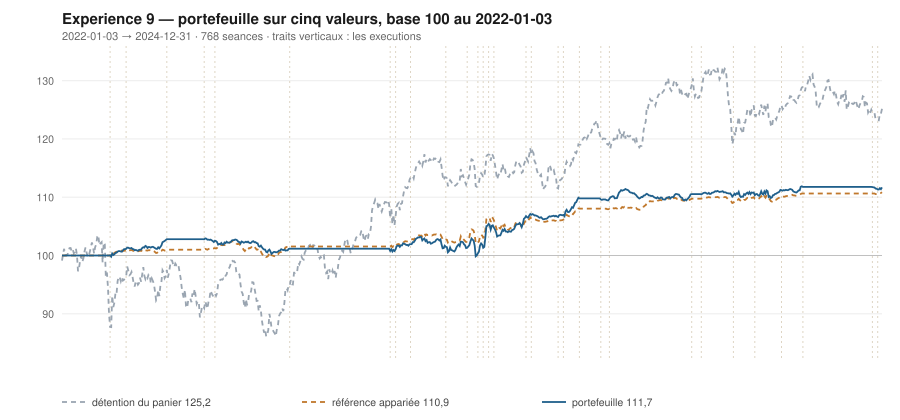

# 2024

> Journal de l'[expérience 9](../README.md) · 256 séances · **9 ordres** sur cinq valeurs
> Portefeuille au 2024-12-31 : **11 167,85 €** (base 111,68) · appariée 110,86 · détention du panier 125,17

---

## Le portefeuille depuis le 2022-01-03

| | |
|---|---|
| Valeur au 1er jour de l'année | 10 945,98 € |
| Valeur au 2024-12-31 | **11 167,85 €** |
| Variation de l'année | **+2,03 %** |
| Espèces · titres | 9 055,12 € · 2 112,73 € |
| Part investie moyenne de l'année | 13,20 % |
| Lignes ouvertes au 2024-12-31 | 1 sur 5 |

## Les ordres

| Exécution | Décision | Valeur | Sens | Rang | Quantité | Prix réel | Frais | Motif |
|---|---|---|---|---|---|---|---|---|
| 2024-01-02 | 2023-12-29 | `ORA.PA` | **REGLE-4** | 1 | 122 | 8,92 € | 4,52 € | ORA.PA : clôture 8,86 sous le seuil de la règle 4 (-2,43 s dans la bande) |
| 2024-04-22 | 2024-04-19 | `ORA.PA` | **VENTE** | 1 | 242 | 9,37 € | 2,61 € | ORA.PA : clôture 9,33 au-dessus du bord haut 9,33 (+1,02 s) |
| 2024-05-06 | 2024-05-03 | `SAF.PA` | **ACHAT** | 1 | 5 | 199,99 € | 4,15 € | SAF.PA : clôture 199,80 sous le bord bas 200,83 (-1,19 s), TAUX_20 +0,004 %/séance |
| 2024-06-17 | 2024-06-14 | `SAF.PA` | **REGLE-4** | 1 | 5 | 193,66 € | 4,02 € | SAF.PA : clôture 192,30 sous le seuil de la règle 4 (-3,64 s dans la bande) |
| 2024-07-15 | 2024-07-12 | `ENGI.PA` | **ACHAT** | 1 | 90 | 12,25 € | 4,57 € | ENGI.PA : clôture 12,31 sous le bord bas 12,37 (-1,08 s), TAUX_20 +0,371 %/séance |
| 2024-08-19 | 2024-08-16 | `ENGI.PA` | **VENTE** | 1 | 90 | 13,67 € | 1,41 € | ENGI.PA : clôture 13,64 au-dessus du bord haut 13,54 (+1,16 s) |
| 2024-09-16 | 2024-09-13 | `SAF.PA` | **VENTE** | 1 | 10 | 198,02 € | 2,28 € | SAF.PA : clôture 198,80 au-dessus du bord haut 195,92 (+1,62 s) |
| 2024-12-16 | 2024-12-13 | `AI.PA` | **ACHAT** | 1 | 7 | 153,22 € | 4,45 € | AI.PA : clôture 139,62 sous le bord bas 139,66 (-1,01 s), TAUX_20 +0,073 %/séance |
| 2024-12-23 | 2024-12-20 | `AI.PA` | **REGLE-4** | 1 | 7 | 148,76 € | 4,32 € | AI.PA : clôture 135,84 sous le seuil de la règle 4 (-1,65 s dans la bande) |

## Les positions touchant l'année

| Valeur | Premier achat | Sortie | Tranches | Titres | Prix moyen | Prix de sortie | +/− value | Repli max. | Contribution | Séances |
|---|---|---|---|---|---|---|---|---|---|---|
| `ORA.PA` | 2023-12-18 | 2024-04-22 | 2 | 242 | 9,01 € | 9,37 € | **+3,98 %** | -1,66 % | +75,07 € | 86 |
| `SAF.PA` | 2024-05-06 | 2024-09-16 | 2 | 10 | 196,83 € | 198,02 € | **+0,60 %** | -6,20 % | +1,43 € | 96 |
| `ENGI.PA` | 2024-07-15 | 2024-08-19 | 1 | 90 | 12,25 € | 13,67 € | **+11,63 %** | -0,50 % | +122,22 € | 26 |
| `AI.PA` | 2024-12-16 | 2025-01-27 | 2 | 14 | 150,99 € | 156,76 € | **+3,82 %** | -1,76 % | +69,49 € | 28 |

## Les décisions de l'année

| Mesure | Valeur |
|---|---|
| Décisions hebdomadaires | 52 |
| Évaluations, cinq valeurs | 260 |
| Sous le bord bas | 67 |
| … dont `TAUX_20 ≥ 0`, donc achetables | **8** |
| Au-dessus du bord haut | 68 |

## La lecture de l'année

Le portefeuille termine l'année à 11 167,85 €, soit +2,03 % sur l'année. Les 9 ordres de l'année ont porté sur 4 valeurs — AI.PA, ENGI.PA, ORA.PA, SAF.PA — pour 32,33 € de frais. Depuis le début, le portefeuille est devant sa référence à exposition appariée de 0,82 point.

---

[← 2023](2023.md) · [Protocole](../README.md) · [2025 →](2025.md)
