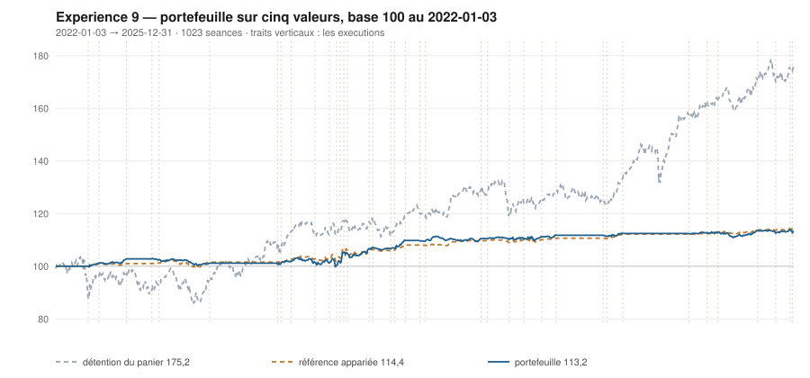

# 2025

> Journal de l'[expérience 9](../README.md) · 255 séances · **10 ordres** sur cinq valeurs
> Portefeuille au 2025-12-31 : **11 315,33 €** (base 113,15) · appariée 114,39 · détention du panier 175,23

---

## Le portefeuille depuis le 2022-01-03

| | |
|---|---|
| Valeur au 1er jour de l'année | 11 167,85 € |
| Valeur au 2025-12-31 | **11 315,33 €** |
| Variation de l'année | **+1,32 %** |
| Espèces · titres | 6 586,01 € · 4 729,32 € |
| Part investie moyenne de l'année | 10,24 % |
| Lignes ouvertes au 2025-12-31 | 2 sur 5 |

## Les ordres

| Exécution | Décision | Valeur | Sens | Rang | Quantité | Prix réel | Frais | Motif |
|---|---|---|---|---|---|---|---|---|
| 2025-01-27 | 2025-01-24 | `AI.PA` | **VENTE** | 1 | 14 | 156,76 € | 2,52 € | AI.PA : clôture 143,17 au-dessus du bord haut 141,47 (+1,48 s) |
| 2025-06-09 | 2025-06-06 | `ORA.PA` | **ACHAT** | 1 | 92 | 12,13 € | 4,63 € | ORA.PA : clôture 12,10 sous le bord bas 12,24 (-1,76 s), TAUX_20 +0,319 %/séance |
| 2025-07-14 | 2025-07-11 | `ENGI.PA` | **ACHAT** | 1 | 59 | 18,81 € | 4,61 € | ENGI.PA : clôture 18,73 sous le bord bas 19,09 (-2,16 s), TAUX_20 +0,015 %/séance |
| 2025-08-04 | 2025-08-01 | `ORA.PA` | **VENTE** | 1 | 92 | 13,16 € | 1,39 € | ORA.PA : clôture 13,19 au-dessus du bord haut 13,14 (+1,28 s) |
| 2025-08-04 | 2025-08-01 | `ENGI.PA` | **REGLE-4** | 1 | 61 | 18,22 € | 4,61 € | ENGI.PA : clôture 18,22 sous le seuil de la règle 4 (-3,11 s dans la bande) |
| 2025-10-20 | 2025-10-17 | `ENGI.PA` | **VENTE** | 1 | 120 | 18,66 € | 2,58 € | ENGI.PA : clôture 18,71 au-dessus du bord haut 18,28 (+1,66 s) |
| 2025-10-20 | 2025-10-17 | `SAF.PA` | **ACHAT** | 1 | 3 | 299,34 € | 3,73 € | SAF.PA : clôture 293,60 sous le bord bas 293,75 (-1,03 s), TAUX_20 +0,116 %/séance |
| 2025-11-24 | 2025-11-21 | `SAF.PA` | **REGLE-4** | 1 | 3 | 286,18 € | 3,56 € | SAF.PA : clôture 286,18 sous le seuil de la règle 4 (-3,29 s dans la bande) |
| 2025-12-22 | 2025-12-19 | `KER.PA` | **ACHAT** | 1 | 3 | 296,47 € | 3,69 € | KER.PA : clôture 298,00 sous le bord bas 307,84 (-1,50 s), TAUX_20 +0,188 %/séance |
| 2025-12-29 | 2025-12-24 | `KER.PA` | **RENFORT** | 1 | 7 | 298,69 € | 8,68 € | KER.PA : renforcement, clôture 299,04 encore sous le bord bas (-1,41 s), TAUX_20 +0,246 %/séance |

## Les positions touchant l'année

| Valeur | Premier achat | Sortie | Tranches | Titres | Prix moyen | Prix de sortie | +/− value | Repli max. | Contribution | Séances |
|---|---|---|---|---|---|---|---|---|---|---|
| `AI.PA` | 2024-12-16 | 2025-01-27 | 2 | 14 | 150,99 € | 156,76 € | **+3,82 %** | -1,76 % | +69,49 € | 28 |
| `ORA.PA` | 2025-06-09 | 2025-08-04 | 1 | 92 | 12,13 € | 13,16 € | **+8,50 %** | -1,34 % | +88,80 € | 41 |
| `ENGI.PA` | 2025-07-14 | 2025-10-20 | 2 | 120 | 18,51 € | 18,66 € | **+0,82 %** | -10,75 % | +6,50 € | 71 |
| `SAF.PA` | 2025-10-20 | 2026-01-12 | 2 | 6 | 292,76 € | 313,08 € | **+6,94 %** | -4,58 % | +112,48 € | 58 |
| `KER.PA` | 2025-12-22 | 2026-04-07 | 3 | 14 | 290,58 € | 263,34 € | **-9,37 %** | -20,84 % | -402,36 € | 72 |

## Les décisions de l'année

| Mesure | Valeur |
|---|---|
| Décisions hebdomadaires | 52 |
| Évaluations, cinq valeurs | 260 |
| Sous le bord bas | 64 |
| … dont `TAUX_20 ≥ 0`, donc achetables | **10** |
| Au-dessus du bord haut | 82 |

## La lecture de l'année

Le portefeuille termine l'année à 11 315,33 €, soit +1,32 % sur l'année. Les 10 ordres de l'année ont porté sur 5 valeurs — AI.PA, ENGI.PA, KER.PA, ORA.PA, SAF.PA — pour 40,00 € de frais. Depuis le début, le portefeuille est derrière sa référence à exposition appariée de 1,24 point.

---

[← 2024](2024.md) · [Protocole](../README.md) · [2026 →](2026.md)
