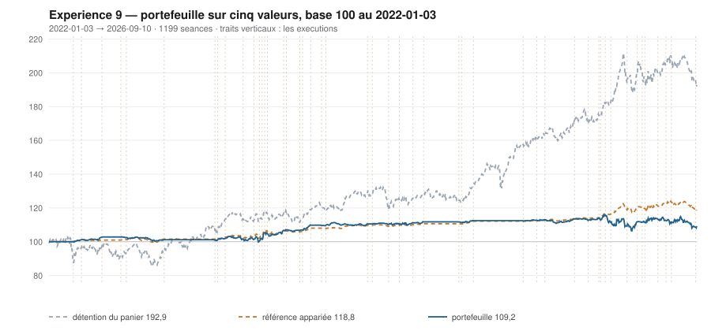

# 2026

> Journal de l'[expérience 9](../README.md) · 176 séances · **12 ordres** sur cinq valeurs
> Portefeuille au 2026-09-10 : **10 919,84 €** (base 109,20) · appariée 118,81 · détention du panier 192,87

---

## Le portefeuille depuis le 2022-01-03

| | |
|---|---|
| Valeur au 1er jour de l'année | 11 315,33 € |
| Valeur au 2026-09-10 | **10 919,84 €** |
| Variation de l'année | **-3,50 %** |
| Espèces · titres | 4 685,48 € · 6 234,36 € |
| Part investie moyenne de l'année | 40,80 % |
| Lignes ouvertes au 2026-09-10 | 2 sur 5 |

## Les ordres

| Exécution | Décision | Valeur | Sens | Rang | Quantité | Prix réel | Frais | Motif |
|---|---|---|---|---|---|---|---|---|
| 2026-01-12 | 2026-01-09 | `SAF.PA` | **VENTE** | 1 | 6 | 313,08 € | 2,16 € | SAF.PA : clôture 313,77 au-dessus du bord haut 309,73 (+1,53 s) |
| 2026-01-26 | 2026-01-23 | `KER.PA` | **REGLE-4** | 1 | 4 | 271,95 € | 4,51 € | KER.PA : clôture 271,90 sous le seuil de la règle 4 (-2,01 s dans la bande) |
| 2026-03-09 | 2026-03-06 | `ENGI.PA` | **ACHAT** | 1 | 44 | 24,49 € | 4,47 € | ENGI.PA : clôture 25,08 sous le bord bas 25,24 (-1,25 s), TAUX_20 +0,295 %/séance |
| 2026-04-07 | 2026-04-02 | `KER.PA` | **VENTE** | 1 | 14 | 263,34 € | 4,24 € | KER.PA : clôture 262,31 au-dessus du bord haut 261,86 (+1,04 s) |
| 2026-04-20 | 2026-04-17 | `ORA.PA` | **ACHAT** | 1 | 65 | 16,85 € | 4,54 € | ORA.PA : clôture 16,71 sous le bord bas 17,25 (-1,88 s), TAUX_20 +0,243 %/séance |
| 2026-04-27 | 2026-04-24 | `SAF.PA` | **ACHAT** | 1 | 4 | 268,88 € | 4,46 € | SAF.PA : clôture 267,00 sous le bord bas 287,26 (-2,20 s), TAUX_20 +0,070 %/séance |
| 2026-04-27 | 2026-04-24 | `ORA.PA` | **RENFORT** | 2 | 129 | 17,13 € | 9,17 € | ORA.PA : renforcement, clôture 17,21 encore sous le bord bas (-1,32 s), TAUX_20 +0,036 %/séance |
| 2026-06-01 | 2026-05-29 | `SAF.PA` | **VENTE** | 1 | 4 | 302,50 € | 1,39 € | SAF.PA : clôture 305,70 au-dessus du bord haut 304,95 (+1,04 s) |
| 2026-06-22 | 2026-06-19 | `AI.PA` | **ACHAT** | 1 | 6 | 165,48 € | 4,12 € | AI.PA : clôture 164,16 sous le bord bas 164,71 (-1,12 s), TAUX_20 +0,077 %/séance |
| 2026-07-06 | 2026-07-03 | `AI.PA` | **VENTE** | 1 | 6 | 181,00 € | 1,25 € | AI.PA : clôture 180,30 au-dessus du bord haut 176,82 (+1,75 s) |
| 2026-07-06 | 2026-07-03 | `ORA.PA` | **REGLE-4** | 1 | 70 | 15,86 € | 4,61 € | ORA.PA : clôture 15,86 sous le seuil de la règle 4 (-2,50 s dans la bande) |
| 2026-09-08 | 2026-09-04 | `ENGI.PA` | **REGLE-4** | 1 | 44 | 24,18 € | 4,42 € | ENGI.PA : clôture 24,01 sous le seuil de la règle 4 (-2,37 s dans la bande) |

## Les positions touchant l'année

| Valeur | Premier achat | Sortie | Tranches | Titres | Prix moyen | Prix de sortie | +/− value | Repli max. | Contribution | Séances |
|---|---|---|---|---|---|---|---|---|---|---|
| `SAF.PA` | 2025-10-20 | 2026-01-12 | 2 | 6 | 292,76 € | 313,08 € | **+6,94 %** | -4,58 % | +112,48 € | 58 |
| `KER.PA` | 2025-12-22 | 2026-04-07 | 3 | 14 | 290,58 € | 263,34 € | **-9,37 %** | -20,84 % | -402,36 € | 72 |
| `ENGI.PA` | 2026-03-09 | 2026-09-10 *(ouverte)* | 2 | 88 | 24,34 € | 24,30 € | **-0,15 %** | -2,25 % | -12,14 € | 130 |
| `ORA.PA` | 2026-04-20 | 2026-09-10 *(ouverte)* | 3 | 264 | 16,72 € | 15,52 € | **-7,22 %** | -9,70 % | -337,01 € | 102 |
| `SAF.PA` | 2026-04-27 | 2026-06-01 | 1 | 4 | 268,88 € | 302,50 € | **+12,50 %** | -2,46 % | +128,63 € | 25 |
| `AI.PA` | 2026-06-22 | 2026-07-06 | 1 | 6 | 165,48 € | 181,00 € | **+9,38 %** | +0,13 % | +87,75 € | 11 |

## Les décisions de l'année

| Mesure | Valeur |
|---|---|
| Décisions hebdomadaires | 37 |
| Évaluations, cinq valeurs | 185 |
| Sous le bord bas | 61 |
| … dont `TAUX_20 ≥ 0`, donc achetables | **19** |
| Au-dessus du bord haut | 47 |

## La lecture de l'année

Le portefeuille termine l'année à 10 919,84 €, soit -3,50 % sur l'année. Les 12 ordres de l'année ont porté sur 5 valeurs — AI.PA, ENGI.PA, KER.PA, ORA.PA, SAF.PA — pour 49,35 € de frais. 2 positions restent ouvertes au terme de l'année : ENGI.PA à 24,34 € (-0,15 %), ORA.PA à 16,72 € (-7,22 %). Depuis le début, le portefeuille est derrière sa référence à exposition appariée de 9,61 point.

---

[← 2025](2025.md) · [Protocole](../README.md)
