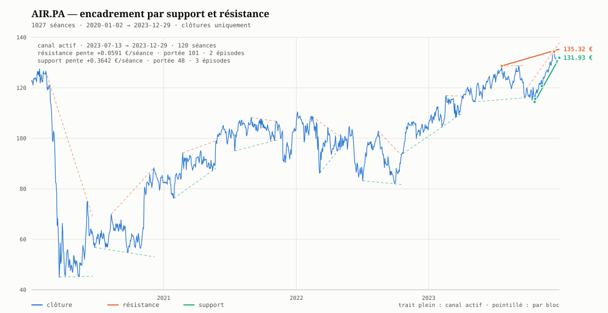

# Cours — Encadrement par droites de support et de résistance

Le [cours sur le canal de régression](../canal/README.md) encadre un cours par une
bande **calculée sur tous les points** : une droite des moindres carrés, translatée.
Ce cours-ci traite de l'autre famille, celle que trace l'analyse graphique
traditionnelle : deux droites qui passent **par des points réels** et n'en
traversent aucun.

Niveau bac+2. Prérequis : le [module 2 du cours canal](../canal/02-les-trois-largeurs.md),
qui pose la distinction entre les deux objets, et les
[étapes 6 et 7 du modèle](../../modele.md#plan-de-la-preuve) pour la droite ajustée
à laquelle on compare.

## Pourquoi ce cours

Parce que la version naïve de l'exercice — « je relie les sommets » — échoue de
quatre façons distinctes, et que chacune se corrige par un calcul précis :

| Ce qui rate | La correction | Module |
|---|---|---|
| La droite tracée à la main coupe des chandelles | **Enveloppe convexe** : chaque arête touche 2 points et n'en traverse aucun, par construction | [01](01-la-droite-qui-ne-coupe-rien.md) |
| La dernière arête n'enjambe que 2 séances et donne une pente aberrante | **Portée minimale** de $n/4$ séances | [02](02-portee-et-episodes-de-contact.md) |
| Quatre séances collées comptent pour « 4 touches » | **Épisodes de contact** : les jours voisins forment un seul contact | [02](02-portee-et-episodes-de-contact.md) |
| Sur 4 ans d'historique, une seule arête enjambe 1001 séances | **Segmentation** en blocs, et canal actif **ancré à droite** | [03](03-segmenter-un-historique-long.md) |

## Le fil directeur

> 🔑 **Une droite d'encadrement n'existe que sur la fenêtre qui l'a produite, et
> elle se cite toujours avec trois nombres : sa pente, sa portée, son nombre
> d'épisodes de contact.** Une droite sans ces trois nombres n'est pas une figure
> technique, c'est un trait.

## Plan

| # | Module | Ce qu'il établit |
|---|---|---|
| 1 | [La droite qui ne coupe rien](01-la-droite-qui-ne-coupe-rien.md) | Enveloppe convexe, chaînes inférieure et supérieure, balayage de Andrew, propriétés garanties |
| 2 | [Portée et épisodes de contact](02-portee-et-episodes-de-contact.md) ⭐ | La portée minimale ; la tolérance $\varepsilon$ ; pourquoi on compte des contacts et non des jours |
| 3 | [Segmenter un historique long](03-segmenter-un-historique-long.md) ⭐ | L'échec de l'enveloppe globale, mesuré ; blocs successifs ; canal actif ancré à droite |
| 4 | [Lire l'encadrement](04-lire-l-encadrement.md) | Position dans le canal, distances aux bornes, convergence et date de péremption, et ce que tout cela n'autorise pas |

## La figure du cours



Les quatre modules se lisent sur cette figure :

- le **cours** en bleu, sur 1027 séances ;
- les **droites par bloc** en pointillé, chacune tracée sur son seul bloc
  ([module 3](03-segmenter-un-historique-long.md)) — neuf paires, dont aucune ne
  traverse le cours ;
- le **canal actif** en trait plein, avec ses points de contact marqués
  ([module 2](02-portee-et-episodes-de-contact.md)) et ses valeurs au bord droit ;
- chaque droite part de son **ancre**, pas du bord de sa fenêtre : une arête qui
  n'enjambe que 48 séances sur 120 s'éloignerait très loin du cours si on la
  prolongeait vers la gauche.

Elle est produite par [`python/generer_graph_supp_resistance.py`](../../../../python/generer_graph_supp_resistance.md) :

```bash
python python/generer_graph_supp_resistance.py \
  --sortie docs/raw/concept/encadrement/figures/airbus-encadrement.svg \
  --titre "Airbus — encadrement par support et résistance"
```

> ⚠️ **La figure ne montre pas les mêmes droites que les tableaux du cours.** Le
> script n'utilise que les **clôtures** ; les modules 1 à 4 construisent leurs
> chaînes sur les **extrêmes de séance** (`High`, `Low`). Les deux méthodes sont
> légitimes et donnent des résultats voisins mais distincts :

| Canal actif au 2023-12-29 | Cours (`High`/`Low`) | Figure (`Close`) |
|---|---|---|
| Résistance : pente / portée / épisodes | $+0{,}0483$ / 102 / 2 | $+0{,}0591$ / 101 / 2 |
| Support : pente / portée / épisodes | $+0{,}3626$ / 43 / 4 | $+0{,}3642$ / 48 / 3 |
| Résistance / support en euros | 136,33 et 130,57 | 135,32 et 131,93 |
| Largeur | 5,76 € — 4,4 % | **3,39 € — 2,6 %** |

Les clôtures étant à l'intérieur de l'enveloppe haut/bas de chaque séance, le
canal sur clôtures est **systématiquement plus étroit** : ici d'un tiers. Et le
support y passe exactement par la dernière clôture, artefact décrit au
[§ 8 du miroir du script](../../../../python/generer_graph_supp_resistance.md).

## Le fil rouge chiffré

Tous les modules travaillent sur la même série : les **1027 clôtures d'Airbus**
de janvier 2020 à décembre 2023, `docs/raw/quotes/AIR_PA_2020-01-02_2023-12-29.csv`.
Contrairement au cours canal, on utilise ici `High` et `Low`, pas seulement `Close` :
une résistance se construit sur les plus-hauts de séance. La figure ci-dessus fait
exception — le script ne lit que les clôtures — d'où l'écart chiffré au § précédent.

Le canal actif au 29 décembre 2023, établi au [module 3](03-segmenter-un-historique-long.md)
et lu au [module 4](04-lire-l-encadrement.md), sert de résultat commun :

| | Ancre | Pente | Portée | Épisodes | Valeur au 2023-12-29 |
|---|---|---|---|---|---|
| Résistance | 2023-07-25, 130,97 € | $+0{,}0483$ €/séance | 102 | 2 | 136,33 € |
| Clôture | — | — | — | — | **131,93 €** |
| Support | 2023-10-23, 113,52 € | $+0{,}3626$ €/séance | 43 | 4 | 130,57 € |

## Ce que ce cours alimente

L'agent [`chartiste`](../../../../.claude/agents/chartiste.md) applique ces quatre
règles. Le module 3 comble ce qui lui manquait : sa méthode était écrite pour une
fenêtre unique et ne disait pas quoi faire d'un historique de plusieurs années.

---

➡️ Commencer par le [module 1 — La droite qui ne coupe rien](01-la-droite-qui-ne-coupe-rien.md) ·
🏠 [Sommaire du dépôt](../sommaire/README.md)
