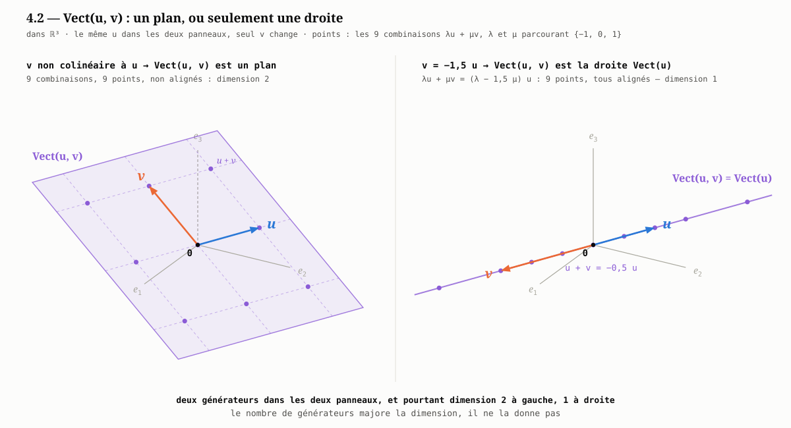

# Module 4 — Sous-espaces, $\text{Vect}$ et familles génératrices

**Durée : 45 min.** Prérequis : [module 1](01-espace-vectoriel.md), qu'il prolonge directement. **Ce module n'utilise pas le produit scalaire** : il est purement linéaire, et c'est précisément ce qui fait sa portée — tout ce qu'il établit reste vrai avant qu'on ait choisi une géométrie.

> **La question traitée.** Les modules qui suivent parlent sans cesse de « la droite $\text{Vect}(\mathbf 1)$ », du « plan $\text{Vect}(\mathbf 1,t)$ », d'« être orthogonal à un sous-espace ». Que sont exactement ces objets — et comment décrit-on un ensemble **infini** de vecteurs par une liste **finie** ?

**Ce qui est en jeu.** La droite des moindres carrés d'une série de clôtures est *l'élément de $\text{Vect}(\mathbf 1,t)$ le plus proche de cette série*. Tant que $\text{Vect}$ n'est pas défini, cette phrase — qui est l'énoncé du [module 6](06-projection-orthogonale.md) et le contenu de [`modele.md`](../../../modele.md) — n'a pas de sens. Ce module est court parce qu'il ne démontre presque rien ; il est placé avant les autres parce que sans lui, ils ne s'énoncent pas.

---

## 4.1 Sous-espace vectoriel

> **Définition (sous-espace vectoriel).** Une partie $F\subseteq\mathbb R^n$ est un **sous-espace vectoriel** si elle est non vide et **stable par combinaison linéaire** :
> $$F\neq\emptyset\qquad\text{et}\qquad\bigl(\,y,z\in F\ \text{ et }\ \alpha,\beta\in\mathbb R\quad\Longrightarrow\quad \alpha y+\beta z\in F\,\bigr)$$

**Ce que « stable » veut dire.** Une partie $F$ est dite **stable** par une opération lorsque cette opération, appliquée à des éléments de $F$, ne fait jamais sortir de $F$ : les données sont dans $F$, le résultat y est encore. Ici l'opération est la combinaison linéaire $(y,z,\alpha,\beta)\mapsto\alpha y+\beta z$, et la stabilité s'énonce donc : *toute combinaison linéaire d'éléments de $F$ est encore un élément de $F$*. Deux points à noter. C'est une propriété de $F$ **tout entier**, jamais d'un vecteur pris isolément — « ce vecteur est stable » n'a pas de sens. Et l'implication doit valoir pour **tous** les $y,z\in F$ et **tous** les $\alpha,\beta\in\mathbb R$ : un seul quadruplet qui en sort suffit à ruiner la stabilité, comme le montre la dernière ligne du tableau ci-dessous.

Prendre $\alpha=\beta=0$ montre qu'un sous-espace **contient toujours $0$** ; « non vide et stable » et « contient $0$ et stable » sont donc deux formulations de la même chose. Il n'y a rien d'autre à retenir : la stabilité est, à elle seule, tout ce que les modules suivants utiliseront de $F$ — au [§ 6.3](06-projection-orthogonale.md), c'est elle qui autorise à dire que $p(x)-y$ appartient encore à $F$.

Quelques exemples, et un contre-exemple, à garder en tête :

| Partie de $\mathbb R^n$                                                                        | Sous-espace ?                                                          |
| ---------------------------------------------------------------------------------------------- | ---------------------------------------------------------------------- |
| $\{0\}$ et $\mathbb R^n$ lui-même                                                              | Oui — les deux cas extrêmes, toujours licites                          |
| $\{u:\sum_i u_i=0\}$, les vecteurs de **somme nulle** — la somme de leurs composantes vaut $0$ | Oui — une somme de sommes nulles est nulle                             |
| $\{\lambda u:\lambda\in\mathbb R\}$ pour $u$ fixé                                              | Oui — c'est la droite dirigée par $u$                                  |
| $\{u:\sum_i u_i=1\}$, les vecteurs de **somme $1$**                                            | **Non** — il ne contient pas $0$, et la somme de deux éléments en sort |

> ⚠️ **« Sous-espace » n'est pas « sous-ensemble », et un sous-espace passe toujours par l'origine.** Une droite du plan qui ne passe pas par $0$ n'est pas un sous-espace. Cela n'a rien de contradictoire avec la régression : la droite d'équation $v=v_0+rt$ est **affine dans le plan $(t,v)$**, mais le vecteur $v_0\mathbf 1+r\,t$ qu'elle produit vit dans $\mathbb R^n$, où il appartient bel et bien au sous-espace $\text{Vect}(\mathbf 1,t)$. Le sous-espace n'est pas la droite qu'on dessine ; c'est l'ensemble des **séries de $n$ valeurs** qu'une telle droite peut engendrer.

---

## 4.2 Le sous-espace engendré : $\text{Vect}$

Un sous-espace est défini par une propriété — « stable » — qu'on ne peut pas vérifier vecteur par vecteur, puisqu'il y en a une infinité. La construction suivante renverse le problème : elle **fabrique** un sous-espace à partir d'une liste finie.

> **Définition (sous-espace engendré).** Pour $u_1,\dots,u_d\in\mathbb R^n$,
> $$\text{Vect}(u_1,\dots,u_d)=\bigl\{\lambda_1u_1+\dots+\lambda_du_d\ :\ \lambda_1,\dots,\lambda_d\in\mathbb R\bigr\}$$
> — l'ensemble de **toutes** leurs combinaisons linéaires.

**C'est bien un sous-espace.** Une combinaison linéaire de combinaisons linéaires des $u_j$ est encore une combinaison linéaire des $u_j$, en regroupant les coefficients :
$$\alpha\sum_{j=1}^d\lambda_ju_j+\beta\sum_{j=1}^d\mu_ju_j=\sum_{j=1}^d(\alpha\lambda_j+\beta\mu_j)\,u_j$$

**Et c'est le plus petit qui contienne les $u_j$.** Soit $G$ un sous-espace contenant $u_1,\dots,u_d$. Par stabilité, $G$ contient chacune de leurs combinaisons linéaires, donc $\text{Vect}(u_1,\dots,u_d)\subseteq G$. D'où le nom : le sous-espace **engendré** par $u_1,\dots,u_d$ est le plus économique de tous ceux qui les contiennent.

**Le cas $d=1$ — la droite.** $\text{Vect}(u)=\{\lambda u:\lambda\in\mathbb R\}$ est la **droite** passant par l'origine et dirigée par $u$. L'hypothèse $u\ne 0$ y est indispensable, et pour une raison de géométrie avant d'être de calcul : $\text{Vect}(0)=\{0\}$ est un sous-espace parfaitement légitime, mais réduit à un point — ce n'est pas une droite, et aucune direction n'y est en jeu.

**Le cas $d=2$ — le plan.** $\text{Vect}(u,v)$ est le plan contenant $u$, $v$ et l'origine — *pourvu que $u$ et $v$ ne soient pas colinéaires* (au sens du [§ 3.1](03-cauchy-schwarz-et-angle.md)). S'ils le sont, les deux vecteurs décrivent la même droite et $\text{Vect}(u,v)$ est cette droite. **Le nombre de générateurs ne dit donc pas la dimension : il la majore**, et le § 4.3 explique ce qui sépare les deux.



Les deux panneaux ont le **même** $u$ et tracent les **mêmes** neuf combinaisons $\lambda u+\mu v$, avec $\lambda,\mu\in\{-1,0,1\}$ ; seul $v$ change. À gauche, les neuf points sont les nœuds d'une grille qui couvre un plan : il y a deux directions indépendantes. À droite, $v=-1{,}5\,u$ ramène chaque combinaison à $(\lambda-1{,}5\,\mu)\,u$. Les neuf points restent distincts mais sont tous sur la droite : **c'est l'alignement qui fait perdre la dimension**, pas des points qui se confondraient. *(Le demi-axe $e_3$, passé derrière le plan, est en tirets. La figure est produite par [`figures/generer_figures.py`](figures/generer_figures.md).)*

---

## 4.3 Famille génératrice

> **Définition.** Une famille $g_1,\dots,g_m$ de vecteurs de $F$ est **génératrice** de $F$ si tout élément de $F$ est une combinaison linéaire des $g_i$ :
> $$F=\text{Vect}(g_1,\dots,g_m)$$

Une telle famille est un **jeu de paramètres** pour $F$ : elle le décrit tout entier par un nombre fini de vecteurs. C'est le seul moyen de manipuler un ensemble infini, et c'est ce qui rend calculables les énoncés des modules suivants — le [§ 5.1](05-orthogonalite-et-pythagore.md) ramènera « $u$ est orthogonal à tout $f\in F$ » à $m$ produits scalaires nuls, un par générateur.

**Ce qu'une famille génératrice garantit, et ce qu'elle ne garantit pas.** Elle garantit l'**existence** des coefficients $\lambda_i$ ; elle ne dit rien de leur **unicité**. Une famille génératrice n'est pas tenue d'être minimale : un $g_i$ redondant ne retire rien au caractère générateur, il rend seulement l'écriture non unique.

Ainsi, dans $\mathbb R^2$, $\text{Vect}\bigl((1,0),(0,1),(1,1)\bigr)=\mathbb R^2$ : la famille est génératrice, mais le troisième vecteur est de trop, et $(2,3)$ s'y écrit de deux façons —
$$(2,3)=2(1,0)+3(0,1)=1(1,0)+2(0,1)+1(1,1)$$
Retirer $(1,1)$ ne change rien à l'espace engendré et rend l'écriture unique.

> **Définition (rappel anticipé).** Une famille est **libre** lorsque la seule combinaison linéaire qui donne $0$ est celle à coefficients tous nuls ; une famille **libre et génératrice** est une **base**, et c'est exactement le cas où l'écriture de chaque élément est unique. Le [§ 5.3](05-orthogonalite-et-pythagore.md) reprend cette définition et en donne un critère commode : *une famille orthogonale de vecteurs non nuls est libre*.

**Dimension.** Le nombre $d$ de générateurs n'est pas la dimension de $\text{Vect}(u_1,\dots,u_d)$ : il la majore, et les deux coïncident exactement quand la famille est libre. La dimension elle-même est traitée au [module 7](07-supplementaire-orthogonal-et-dimension.md), où elle devient l'outil de comptage des degrés de liberté.

> 🔑 **Générateur et libre sont deux qualités indépendantes, et opposées.** Ajouter un vecteur ne peut qu'aider à engendrer et que nuire à la liberté ; en retirer un fait l'inverse. Une base est le point d'équilibre — assez de vecteurs pour tout atteindre, pas un de trop.

---

## 4.4 Les sous-espaces de tout le cours

Ils sont peu nombreux, et ce sont toujours les mêmes. Dans $\mathbb R^n$ — l'espace d'une série de $n$ observations —, avec $\mathbf 1=(1,1,\dots,1)$ et $t=(1,2,\dots,n)$ :

| Sous-espace                         | Ce qu'il contient                                                                           | Où il sert                                                                                             |
| ----------------------------------- | ------------------------------------------------------------------------------------------- | ------------------------------------------------------------------------------------------------------ |
| $\text{Vect}(\mathbf 1)$            | $\{\lambda\mathbf 1\}$ — les séries **constantes**, une droite                              | la moyenne — [module 8](08-degres-de-liberte-et-centrage.md)                                           |
| $\text{Vect}(t)$                    | $\{\mu t\}$ — les séries **proportionnelles au temps**, une autre droite                    | rarement seule, mais elle éclaire la précédente                                                        |
| $\text{Vect}(\mathbf 1,t)$          | $\{a\mathbf 1+bt\}$ — les séries **affines** $(a+bi)_{i=1,\dots,n}$                         | la droite des moindres carrés — [`modele.md`](../../../modele.md)                                      |
| $\text{Vect}(\mathbf 1)^{\perp}$    | les vecteurs de **somme nulle** ($^{\perp}$ : [module 5](05-orthogonalite-et-pythagore.md)) | les écarts à la moyenne, les $n-1$ degrés de liberté — [module 8](08-degres-de-liberte-et-centrage.md) |
| $\text{Vect}(\text{colonnes de }A)$ | les ajustements atteignables                                                                | la régression multiple — [§ 6.6](06-projection-orthogonale.md)                                         |

**Un exemple, sur la première ligne du tableau.** Prenons $n=5$ clôtures :
$$x=(98,\;101,\;99,\;103,\;104)$$

$\text{Vect}(\mathbf 1)$ est l'ensemble des **séries constantes** $\lambda\mathbf 1=(\lambda,\lambda,\lambda,\lambda,\lambda)$ : il y en a une infinité — $(0,\dots,0)$, $(100,\dots,100)$, $(101,\dots,101)$… — mais **un seul nombre $\lambda$ suffit à les désigner toutes**, ce qui est exactement le § 4.3 : la famille $(\mathbf 1)$ est génératrice, et ici libre, donc une base ; l'écriture est unique.

« Ajuster une constante à $x$ », c'est choisir dans cet ensemble infini l'élément le plus proche de $x$. La réponse — démontrée au [module 6](06-projection-orthogonale.md), utilisée au [module 8](08-degres-de-liberte-et-centrage.md) — est $\lambda=\bar x=101$ :
$$\hat x=101\,\mathbf 1=(101,101,101,101,101)\qquad\text{et}\qquad x-\hat x=(-3,\;0,\;-2,\;2,\;3)$$

Le résidu est de **somme nulle** : il appartient à $\text{Vect}(\mathbf 1)^{\perp}$, la quatrième ligne du tableau. Une série de $5$ nombres s'est ainsi scindée en **$1$ nombre** — le niveau — et **$4$ degrés de liberté** — les écarts ; c'est tout le [module 7](07-supplementaire-orthogonal-et-dimension.md) en un exemple.

**Pourquoi « $n-1$ degrés de liberté » sur la quatrième ligne du tableau.** Trois constats s'enchaînent ; le module les établit par un simple décompte, les modules 7 et 8 en donnent la version rigoureuse.

1. **Les écarts à la moyenne sont toujours de somme nulle.** Pour toute série $x$,
   $$\sum_{i=1}^n(x_i-\bar x)=\sum_{i=1}^n x_i-n\bar x=0,$$
   puisque $\bar x$ est défini par $n\bar x=\sum_i x_i$. Le vecteur des écarts $x-\bar x\,\mathbf 1$ appartient donc à $\{u:\sum_i u_i=0\}$ **quelle que soit la série** : ce n'est pas une propriété des données, c'est une conséquence de la définition de la moyenne.
2. **Une seule contrainte laisse $n-1$ composantes libres.** Dans cet ensemble, on choisit $u_1,\dots,u_{n-1}$ à sa guise, et la dernière est imposée :
   $$u_n=-(u_1+\dots+u_{n-1})$$
   Sur l'exemple, les quatre premiers écarts $(-3,\;0,\;-2,\;2)$ fixent le cinquième : il vaut $3$, et rien d'autre. Ce décompte deviendra un énoncé de **dimension** — les vecteurs de somme nulle forment un hyperplan, de dimension $n-1$ — au [§ 7.3](07-supplementaire-orthogonal-et-dimension.md).
3. **« Degrés de liberté » désigne exactement cette dimension.** Pas un nombre de paramètres qu'on retrancherait par convention, mais la dimension du sous-espace dans lequel le vecteur des écarts est contraint de vivre ([§ 8.2](08-degres-de-liberte-et-centrage.md)). La moyenne a consommé une dimension sur $n$ ; c'est ce qui justifie, au module 8, de diviser la somme des carrés des écarts par $n-1$ et non par $n$.

> ⚠️ **La contrainte vient de la moyenne, pas du marché.** Cinq clôtures sont cinq nombres libres ; leurs cinq écarts à la moyenne n'en sont que quatre. Ajuster une droite au lieu d'une constante — $\text{Vect}(\mathbf 1,t)$, deux dimensions — imposera deux contraintes aux écarts et en laissera $n-2$ : c'est le $n-2$ de la régression, au [§ 8.4](08-degres-de-liberte-et-centrage.md).

**Où cela se voit dans le dépôt.** Les colonnes `E_20` et `E_120` de [`import_societe.py`](../../../../../python/import_societe.md) ne sont rien d'autre que ce $\lambda$, recalculé sur chaque fenêtre glissante. Et le test de Student du même script oppose précisément deux sous-espaces de ce tableau : sous l'hypothèse nulle, la pente est nulle et la droite ajustée se réduit à un élément de $\text{Vect}(\mathbf 1)$ ; un verdict `TEND_n = 0` dit donc « rien ne prouve qu'il faille sortir de $\text{Vect}(\mathbf 1)$ », et un verdict $\pm1$ dit « le plan $\text{Vect}(\mathbf 1,t)$ apporte quelque chose que la constante seule n'a pas ».

Le troisième est **le** sous-espace du cours. Deux paramètres, $a$ et $b$, décrivent un plan de dimension $2$ logé dans un espace de dimension $n$ : c'est tout l'écart entre une série quelconque de $n$ clôtures et la droite qu'on lui ajuste.

> 🔑 **Choisir un modèle linéaire, c'est choisir un sous-espace — rien de plus.** « Ajuster une constante » est le choix de $\text{Vect}(\mathbf 1)$, « ajuster une droite » celui de $\text{Vect}(\mathbf 1,t)$, « ajuster $p$ variables explicatives » celui de $\text{Vect}(\text{colonnes de }A)$. La méthode qui suit — projeter — est la **même** dans les trois cas ; seul le sous-espace change. C'est ce qui explique qu'un seul module, le [module 6](06-projection-orthogonale.md), suffise à traiter toutes les régressions du dépôt.

---

## 4.5 Simulation

### S4.1 — Engendrer, appartenir, être redondant

```python
import numpy as np

n = 8
un = np.ones(n)
t = np.arange(1.0, n + 1)

G2 = np.column_stack([un, t])                    # deux générateurs
G3 = np.column_stack([un, t, 3 * un - 2 * t])    # le troisième est de trop

# « v appartient à Vect(G) » : l'ajouter aux générateurs n'augmente pas le rang
rang = np.linalg.matrix_rank
dans = lambda G, v: rang(np.column_stack([G, v])) == rang(G)

print("rangs :", rang(G2), rang(G3))             # 2 et 2 : le même plan

x = 9 * un + 2 * t                               # une série affine
y = np.array([12.0, 12, 14, 18, 13, 15, 20, 19]) # une série quelconque
print("x dans Vect(1,t) :", dans(G2, x))
print("y dans Vect(1,t) :", dans(G2, y))

# même espace engendré : chaque générateur de l'un est dans l'autre
print("Vect(G3) = Vect(G2) :", all(dans(G2, g) for g in G3.T))

# la redondance ne coûte que l'unicité de l'écriture
c1 = np.array([9.0, 2.0, 0.0])
c2 = np.array([12.0, 0.0, -1.0])
print("deux écritures de x :", np.allclose(G3 @ c1, x), np.allclose(G3 @ c2, x))
```

Les deux dernières lignes sont le § 4.3 en action : `G3` engendre exactement le même plan que `G2`, mais $x$ y admet **deux** jeux de coefficients. Rien n'est faux ; simplement, « les coefficients de $x$ » n'est plus une expression bien définie.

---

## 4.6 Exercices

**E4.1.** Montrer que l'intersection de deux sous-espaces est un sous-espace. *Puis montrer, par un contre-exemple dans $\mathbb R^2$, que leur réunion n'en est généralement pas un.*

**Preuve.** Soient $F$ et $G$ deux sous-espaces de $\mathbb R^n$.

*L'intersection.* Elle est non vide : $0\in F$ et $0\in G$ (§ 4.1), donc $0\in F\cap G$. Soient maintenant $x,y\in F\cap G$ et $\alpha,\beta\in\mathbb R$. De $x,y\in F$ et de la stabilité de $F$ vient $\alpha x+\beta y\in F$ ; de $x,y\in G$ et de la stabilité de $G$ vient $\alpha x+\beta y\in G$. Le vecteur $\alpha x+\beta y$ appartient donc aux deux, c'est-à-dire à $F\cap G$ : l'intersection est stable, c'est un sous-espace.

*La réunion.* Prenons dans $\mathbb R^2$ les deux axes, $F=\text{Vect}\bigl((1,0)\bigr)$ et $G=\text{Vect}\bigl((0,1)\bigr)$. On a $(1,0)\in F\cup G$ et $(0,1)\in F\cup G$, mais leur somme $(1,1)$ a ses deux coordonnées non nulles : elle n'est ni dans $F$ ni dans $G$, donc pas dans $F\cup G$. La réunion n'est pas stable.

> La différence tient à ceci : dans $F\cap G$, les deux hypothèses portent sur **le même** vecteur, et chaque sous-espace conclut de son côté ; dans $F\cup G$, chaque vecteur n'est garanti que dans **l'un des deux**, et aucun des deux ne sait quoi faire du couple. On montre d'ailleurs que $F\cup G$ est un sous-espace exactement lorsque $F\subseteq G$ ou $G\subseteq F$ — d'où le « généralement » de l'énoncé.

**E4.2.** Démontrer que $\text{Vect}(u_1,\dots,u_d)$ est le plus petit sous-espace contenant $u_1,\dots,u_d$, au sens de l'inclusion. *(La démonstration du § 4.2 tient en deux lignes : les réécrire sans les relire.)*

**Preuve.** Notons $V=\text{Vect}(u_1,\dots,u_d)=\bigl\{\lambda_1u_1+\dots+\lambda_du_d\ :\ \lambda_1,\dots,\lambda_d\in\mathbb R\bigr\}$. « Le plus petit sous-espace contenant les $u_j$ » demande deux choses, et il faut les établir toutes les deux.

*$V$ est un sous-espace, et il contient les $u_j$.* La stabilité est le calcul du § 4.2 : une combinaison de deux combinaisons des $u_j$ se regroupe en une combinaison des $u_j$. Et $u_k\in V$ en prenant $\lambda_k=1$, les autres coefficients nuls.

*Il est contenu dans tout sous-espace qui contient les $u_j$.* Soit $G$ un sous-espace tel que $u_1,\dots,u_d\in G$, et soit $x=\lambda_1u_1+\dots+\lambda_du_d$ un élément quelconque de $V$. Par stabilité, $G$ contient $\lambda_1u_1+\lambda_2u_2$ ; le combinant avec $\lambda_3u_3\in G$, il contient $\lambda_1u_1+\lambda_2u_2+\lambda_3u_3$ ; et ainsi de suite jusqu'à $x$. Donc $V\subseteq G$.

$V$ est ainsi un sous-espace contenant les $u_j$ et inclus dans tous ceux qui les contiennent : c'est le plus petit au sens de l'inclusion, et il est le seul à l'être — deux minimaux $V$ et $V'$ vérifieraient $V\subseteq V'$ et $V'\subseteq V$.

> Le second point est **tout** l'exercice : il fait intervenir un sous-espace $G$ *autre* que $V$. Une démonstration qui ne parle que de $V$ ne peut rien dire d'une minimalité, qui est une comparaison. Noter aussi que la stabilité est énoncée pour **deux** vecteurs : passer à $d$ termes est une récurrence, expédiée ci-dessus par « et ainsi de suite ».

**E4.3.** Soit $t=(1,\dots,n)$ et $\bar t$ sa moyenne. Montrer que $\text{Vect}(\mathbf 1,t)=\text{Vect}(\mathbf 1,\,t-\bar t\,\mathbf 1)$. *Les deux familles engendrent le même plan ; qu'est-ce que la seconde a de mieux ? (Piste : calculer $\langle\mathbf 1,\,t-\bar t\,\mathbf 1\rangle$ — la notion est au [§ 5.1](05-orthogonalite-et-pythagore.md), le bénéfice au [§ 6.4](06-projection-orthogonale.md).)*

**Preuve.** Posons $w=t-\bar t\,\mathbf 1$, et rappelons que $\bar t=\frac1n\sum_{i=1}^n i=\frac{n+1}{2}$.

*Les deux plans sont le même.* On passe d'une famille à l'autre dans les deux sens, ce qui donne les deux inclusions :
$$a\mathbf 1+b\,t=(a+b\bar t)\,\mathbf 1+b\,w\qquad\text{et}\qquad a\mathbf 1+b\,w=(a-b\bar t)\,\mathbf 1+b\,t$$
La première égalité met tout élément de $\text{Vect}(\mathbf 1,t)$ dans $\text{Vect}(\mathbf 1,w)$, la seconde fait l'inverse ; les deux ensembles sont donc égaux. Le fait général est celui-ci : **retrancher à un générateur un multiple d'un autre ne change pas l'espace engendré**, parce que l'opération se défait — c'est un simple changement de paramètres $(a,b)$, pas un changement de plan.

*Ce que la seconde famille a de mieux.* Le calcul de la piste :
$$\langle\mathbf 1,\,t-\bar t\,\mathbf 1\rangle=\sum_{i=1}^n(i-\bar t)=\sum_{i=1}^n i-n\bar t=n\bar t-n\bar t=0$$
Les deux générateurs sont **orthogonaux**, alors que les premiers ne l'étaient pas : $\langle\mathbf 1,t\rangle=\sum_i i=n(n+1)/2\neq 0$. Le bénéfice est au [§ 6.4](06-projection-orthogonale.md) : sur une famille orthogonale, la projection sur le plan se scinde en deux projections indépendantes sur des droites. Les deux coefficients cessent de s'influencer — le niveau ajusté vaut $\bar x$ quelle que soit la pente — et il n'y a plus de système $2\times2$ à résoudre.

> ⚠️ $\sum_i(i-\bar t)=\sum_i i-n\bar t$, et non $n\sum_i i-n\bar t$ : c'est $\bar t$ qui est retranché $n$ fois, pas $\sum_i i$ qui est multiplié par $n$. La nullité vient ensuite de la définition même de la moyenne, $\sum_i i=n\bar t$ — elle vaut donc pour n'importe quel vecteur centré, et pas seulement pour $t=(1,\dots,n)$.

**E4.4.** Déterminer $\text{Vect}(\mathbf 1)\cap\{u\in\mathbb R^n:\sum_i u_i=0\}$. *(Réponse : $\{0\}$.) En déduire qu'aucun vecteur constant non nul n'est de somme nulle — l'énoncé sera réutilisé tel quel au [module 7](07-supplementaire-orthogonal-et-dimension.md).*
**Preuve.** Rappelons que $\text{Vect}(\mathbf 1)=\{\lambda\mathbf 1:\lambda\in\mathbb R\}$, et ajoutons la contrainte. La somme des composantes de $\lambda\mathbf 1$ vaut $\sum_{i=1}^n\lambda=n\lambda$, si bien qu'un élément de l'intersection est un $\lambda\mathbf 1$ vérifiant $n\lambda=0$. Comme $n\geq 1$, cette équation ne laisse que $\lambda=0$, donc le vecteur nul — qui, lui, appartient bien aux deux ensembles, puisque tout sous-espace contient $0$. D'où
$$\text{Vect}(\mathbf 1)\cap\Bigl\{u\in\mathbb R^n:\sum_i u_i=0\Bigr\}=\{0\}$$

*La conséquence demandée.* Soit $u$ un vecteur constant et de somme nulle : il est dans les deux ensembles, donc dans leur intersection, donc $u=0$. Par contraposée, **aucun vecteur constant non nul n'est de somme nulle**.

> Le seul fait utilisé sur $\mathbf 1$ est que la somme de ses composantes, $n$, n'est pas nulle — pour un $v$ quelconque, $\text{Vect}(v)$ rencontre les vecteurs de somme nulle en $\{0\}$ seul si $\sum_i v_i\neq 0$. Et c'est cette intersection réduite à $\{0\}$ qui fera de $\text{Vect}(\mathbf 1)$ et $\text{Vect}(\mathbf 1)^{\perp}$ des supplémentaires au [module 7](07-supplementaire-orthogonal-et-dimension.md) : deux sous-espaces qui se recoupent ailleurs qu'en l'origine ne peuvent pas décomposer un vecteur de façon unique.

**E4.5.** Les colonnes d'une matrice $A$ de taille $n\times p$ engendrent $\text{Vect}(\text{colonnes de }A)\subseteq\mathbb R^n$. *Que vaut ce sous-espace si deux colonnes de $A$ sont identiques ? Et si $p>n$ ?*
**Solution.** Notons $c_1,\dots,c_p$ les colonnes de $A$, vecteurs de $\mathbb R^n$.

*Deux colonnes identiques.* Le sous-espace **ne change pas** : si $c_j=c_k$ avec $j\neq k$, alors
$$\text{Vect}(c_1,\dots,c_p)=\text{Vect}(c_1,\dots,c_p\ \text{privé de}\ c_k)$$
car toute combinaison où figure $\lambda_kc_k$ se réécrit avec $(\lambda_j+\lambda_k)c_j$ et sans $c_k$. C'est le § 4.3 : un générateur redondant n'ajoute rien à l'espace engendré. Ce qu'il coûte, c'est l'**unicité de l'écriture** — de $\lambda_jc_j+\lambda_kc_k=(\lambda_j+\mu)c_j+(\lambda_k-\mu)c_k$ pour tout $\mu\in\mathbb R$, il suit que chaque élément admet une infinité de jeux de coefficients.

La famille est bien **liée**, comme tu l'écris : $1\cdot c_j+(-1)\cdot c_k=0$ est une combinaison nulle à coefficients non tous nuls. Mais ce constat porte sur la *famille*, quand la question porte sur l'*espace* — et c'est justement le point du § 4.3 : générateur et libre sont deux qualités indépendantes. La liberté se perd, l'espace engendré est intact.

*Le cas $p>n$.* Chaque colonne vit dans $\mathbb R^n$, donc toutes leurs combinaisons aussi : $\text{Vect}(\text{colonnes de }A)\subseteq\mathbb R^n$, quel que soit $p$. Deux conséquences.

- La famille ne peut plus être libre : plus de $n$ vecteurs de $\mathbb R^n$ sont toujours liés — c'est un comptage de dimension, établi au [module 7](07-supplementaire-orthogonal-et-dimension.md). L'écriture est donc, là encore, non unique.
- **Mais $p>n$ ne donne pas $\mathbb R^n$.** Le nombre de générateurs majore la dimension sans jamais la garantir (§ 4.2) : une matrice dont les $p$ colonnes valent toutes $\mathbf 1$ engendre une droite, que $p$ vaille $2$ ou $1000$. Ajouter des colonnes ne remplit rien.

> C'est la colinéarité de la régression multiple ([§ 6.6](06-projection-orthogonale.md)) vue depuis l'algèbre : deux variables explicatives identiques — ou combinaison l'une de l'autre — laissent l'ajustement **exactement inchangé**, puisque le sous-espace sur lequel on projette est le même. Seuls les coefficients cessent d'être définis. Un modèle qui « ajoute une variable » sans agrandir $\text{Vect}(\text{colonnes de }A)$ n'a rien ajouté du tout.

**E4.6 — orientée finance.** Prendre 20 clôtures consécutives dans un CSV de `docs/raw/data/quotes/`, poser $t=(1,\dots,20)$ et calculer la droite des moindres carrés $\hat x=a\mathbf 1+b\,t$. *Vérifier avec le critère de rang du § 4.5 que $\hat x$ appartient à $\text{Vect}(\mathbf 1,t)$ et que le résidu $x-\hat x$ n'y appartient pas — sauf si le résidu est nul. Que signifierait un résidu nul sur des cours de bourse ?*
**Solution.**

*Pourquoi $\hat x$ appartient au plan — sans rien calculer.* $\hat x=a\mathbf 1+b\,t$ **est** une combinaison linéaire de $\mathbf 1$ et $t$ : l'appartenance est acquise par construction, quels que soient $a$ et $b$, donc même pour une droite mal ajustée. Ce n'est pas un résultat sur les moindres carrés, c'est la définition du § 4.2 ; le critère de rang ne fait que confirmer une ligne d'algèbre.

*Pourquoi le résidu n'y appartient pas, sauf s'il est nul.* Supposons $r=x-\hat x\in\text{Vect}(\mathbf 1,t)$. Comme $\hat x$ y est aussi, la **stabilité** du § 4.1 donne $x=\hat x+r\in\text{Vect}(\mathbf 1,t)$. Or $\hat x$ réalise le minimum de $\|x-y\|$ quand $y$ parcourt le plan : ce minimum vaut alors $0$, atteint en $y=x$. Donc $\|r\|=\|x-\hat x\|=0$, c'est-à-dire $r=0$. Toute la démonstration tient dans la stabilité — aucune propriété fine de l'ajustement n'est utilisée.

```python
import csv
import numpy as np

# un CSV produit par : python python/import_societe.py AIR.PA --periode 1y
CHEMIN = "docs/raw/data/quotes/AIR_PA_2023-01-03_2023-12-29.csv"

with open(CHEMIN, newline="", encoding="utf-8") as f:
    closes = [float(r["Close"]) for r in csv.DictReader(f) if r["Close"]]

x = np.array(closes[:20])                        # 20 clôtures consécutives
t = np.arange(1.0, 21.0)
un = np.ones(20)
G = np.column_stack([un, t])                     # les générateurs du plan

b = np.cov(t, x, ddof=0)[0, 1] / np.var(t)       # la droite des moindres carrés
a = x.mean() - b * t.mean()
xchap = a * un + b * t
r = x - xchap

rang = np.linalg.matrix_rank
dans = lambda G, v: rang(np.column_stack([G, v])) == rang(G)

print("x̂ dans Vect(1,t) :", dans(G, xchap))      # True — par construction
print("r  dans Vect(1,t) :", dans(G, r))          # False — sauf résidu nul
print("norme du résidu   :", np.linalg.norm(r))
print("⟨1,r⟩ et ⟨t,r⟩    :", un @ r, t @ r)       # nuls : le § 6.4 en avance
```

Les deux dernières lignes disent plus que le critère de rang : le résidu est orthogonal à **chacun** des deux générateurs. C'est ce qui définit l'ajustement, et c'est le [§ 6.4](06-projection-orthogonale.md).

*Ce que signifierait un résidu nul.* Que les vingt clôtures soient **exactement alignées** — $x_i=a+b\,i$ au centime près, la même variation absolue à chaque séance, vingt fois de suite. Deux lectures, et c'est la seconde qui sert.

- **Marché** : cela n'arrive pas. Un cours porte du bruit à chaque séance ; un alignement parfait sur vingt séances serait une trajectoire déterministe, donc une machine à prédire, et un tel titre serait arbitré avant la fin de la fenêtre. Le résidu **est** l'information : c'est ce que la droite ne dit pas, et tout le semestre 3 consiste à mesurer sa taille.
- **Données** : si on l'observe, c'est un défaut de données bien avant un phénomène de marché — cotation suspendue et cours reporté à l'identique (le cas $b=0$, la série constante), remplissage en avant d'un jour non coté, série synthétique.

Le dépôt le signale à sa façon : un résidu nul sur la fenêtre de 20 signifie $\texttt{CORR\_20}=\pm1$, cas que [`import_societe.md`](../../../../../python/import_societe.md) prévoit explicitement — $\texttt{T\_20}$ vaut alors $\pm\infty$ et $\texttt{P\_20}$ vaut $0$. Une $p$-valeur nulle sur des cours de bourse ne se lit pas comme une tendance parfaitement établie, mais comme une fenêtre à inspecter.

---

## 4.7 À retenir

- **Sous-espace = non vide et stable par combinaison linéaire** — *stable* : appliquée à des éléments de $F$, l'opération ne fait pas sortir de $F$. Il contient donc $0$ : un sous-espace passe toujours par l'origine, un sous-ensemble quelconque non.
- **$\text{Vect}(u_1,\dots,u_d)$ est l'ensemble de toutes les combinaisons linéaires** des $u_j$ — le plus petit sous-espace qui les contienne.
- **Une famille génératrice décrit un ensemble infini par une liste finie**, et c'est le seul point qui compte : elle garantit l'**existence** des coefficients, jamais leur unicité.
- **Le nombre de générateurs majore la dimension** ; les deux coïncident quand la famille est libre — une famille libre et génératrice est une **base**.
- **Choisir un modèle linéaire, c'est choisir un sous-espace.** $\text{Vect}(\mathbf 1)$ pour la moyenne, $\text{Vect}(\mathbf 1,t)$ pour la droite ajustée, les colonnes de $A$ pour la régression multiple.

---

⬅️ [Module 3 — Cauchy–Schwarz et l'angle](03-cauchy-schwarz-et-angle.md) ·
➡️ [Module 4 bis — Les matrices](04bis-matrices.md) ·
🏠 [Sommaire](README.md)
