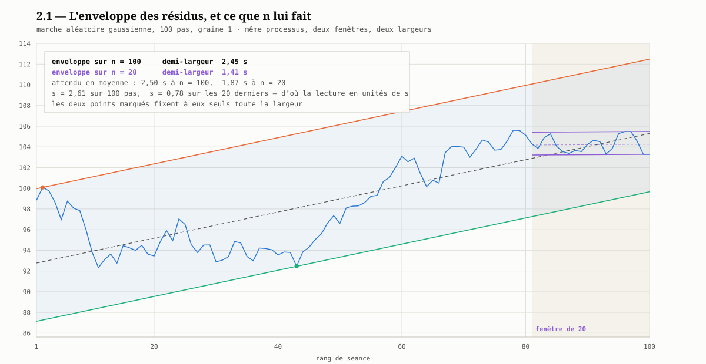
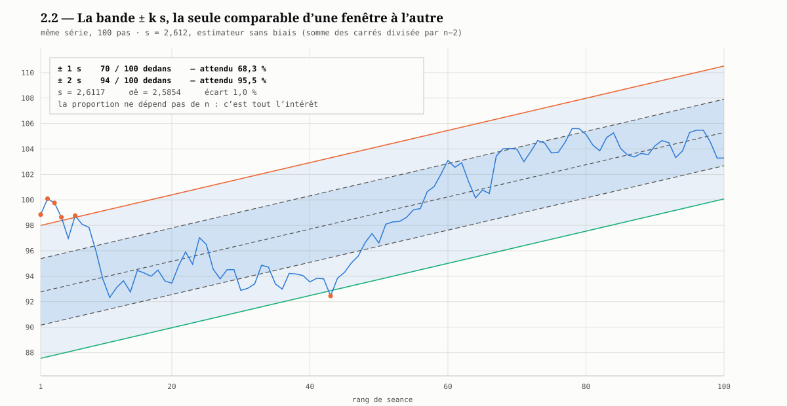
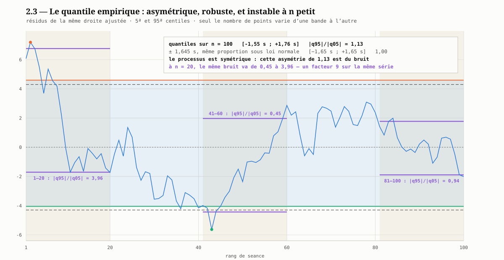

# Module 2 — Les trois largeurs

**Prérequis :** [module 1](01-du-point-a-la-bande.md).
**Ce qu'on établit ici :** les trois conventions de demi-largeur, ce que chacune garantit, et pourquoi l'une d'elles interdit toute comparaison entre fenêtres.

---

Trois conventions coexistent. Elles produisent des dessins voisins et des
affirmations très différentes.

## 2.0 — La série qui sert aux trois figures

Les trois illustrations de ce module portent sur **la même série** : une marche
aléatoire gaussienne de **100 pas** partant de 100, $V_i = V_{i-1} + z_i$ avec
$z_i \sim \mathcal N(0,1)$. Le cas d'école — un processus où **aucune tendance
n'existe** —, choisi pour que tout ce qu'on lit sur les figures soit, par
construction, un artefact de la mesure et non une propriété du monde.

Elle se reproduit sans dépendance, générateur compris :

```python
import math

def uniformes(graine, combien):        # congruentiel lineaire (Numerical Recipes)
    x = graine
    for _ in range(combien):
        x = (1664525 * x + 1013904223) % 2**32
        yield (x + 0.5) / 2**32

u = list(uniformes(1, 100))            # graine 1, declaree
v, valeurs = 100.0, []
for i in range(0, 100, 2):             # Box-Muller : deux normales par paire
    r = math.sqrt(-2 * math.log(u[i]))
    for z in (r * math.cos(2 * math.pi * u[i + 1]),
              r * math.sin(2 * math.pi * u[i + 1])):
        v += z
        valeurs.append(v)
```

Repères de contrôle : $V_1 = 98{,}8432$, $V_{50} = 96{,}6119$,
$V_{100} = 103{,}2872$.

Les trois figures elles-mêmes se refont d'un appel, sans dépendance :

```bash
python docs/raw/concept/semestre3/canal/figures/generer_figures.py
python docs/raw/concept/semestre3/canal/figures/generer_figures.py --stats
```

Le second appel imprime tous les nombres cités dans ce module — ce sont eux qu'il
faut revérifier, pas les dessins. Le script est décrit par son miroir
[`generer_figures.md`](figures/generer_figures.md).

La droite ajustée sur ces 100 points a une pente de $+0{,}1265$ par pas et laisse
$s = 2{,}612$. **Cette pente n'existe pas** — le processus n'en a aucune. Les
figures la tracent quand même, parce que c'est ce que fait un canal ; savoir
combien de tendance apparaît sur du bruit pur est le sujet du
[module 4](04-sorties-de-canal.md).

> ⚠️ **Une marche aléatoire n'a pas des résidus i.i.d.** Ils sont fortement
> autocorrélés, ce qui viole l'hypothèse de l'[étape 8](../modele/08-test-de-tendance.md).
> Les figures illustrent donc la **géométrie** des trois conventions, pas la
> validité de leurs garanties probabilistes — laquelle est traitée au module 4.

## 2.1 — L'enveloppe des résidus

Le canal le plus étroit qui contienne **tous** les points de la fenêtre, à pente
fixée. Connu sous le nom de *canal de Raff*.

**Ce qu'il garantit :** exactement ce qu'on lui a demandé — les $n$ points sont
dedans, par construction. C'est une propriété descriptive, pas probabiliste.

**Le piège, et il est sévère.** Sa largeur est l'**étendue** des résidus, une
statistique d'extrême : elle croît mécaniquement avec le nombre de points, même
si le processus est rigoureusement inchangé. Pour $n$ tirages gaussiens
d'écart-type $\sigma$ :

| $n$ | $\mathbb E[\text{étendue}]$ | Demi-largeur |
|---|---|---|
| 10 | $3{,}08\,\sigma$ | $1{,}54\,\sigma$ |
| 20 | $3{,}74\,\sigma$ | $1{,}87\,\sigma$ |
| 60 | $4{,}64\,\sigma$ | $2{,}32\,\sigma$ |
| 120 | $5{,}14\,\sigma$ | $2{,}57\,\sigma$ |
| 250 | $5{,}64\,\sigma$ | $2{,}82\,\sigma$ |

*(valeurs Monte-Carlo, 200 000 tirages ; la table classique donne $3{,}735$ pour
$n=20$)*

La croissance est en $2\sqrt{2\ln n}$ — lente, mais suffisante pour tout fausser :

> ⚠️ **Un canal-enveloppe sur 120 séances est ~37 % plus large qu'un canal-enveloppe
> sur 20 séances tirées du même processus.** Conclure « le titre est devenu plus
> volatil » de cette comparaison est une erreur de lecture, pas une observation.
> **Les largeurs d'enveloppe ne se comparent qu'à $n$ égal.**



Sur la série du § 2.0, l'enveloppe des 100 points donne une demi-largeur de
**2,45 s**, celle des 20 derniers **1,41 s**. Les valeurs attendues, obtenues par
Monte-Carlo sur les résidus d'une régression — 40 000 tirages — valent :

| $n$ | Demi-largeur moyenne | Écart-type d'un tirage |
|---|---|---|
| 20 | $1{,}84\,s$ | $\pm 0{,}19$ |
| 60 | $2{,}31\,s$ | $\pm 0{,}24$ |
| 100 | $2{,}50\,s$ | $\pm 0{,}24$ |
| 120 | $2{,}57\,s$ | $\pm 0{,}25$ |

La réalisation à $n = 100$ tombe sur la moyenne ; celle à $n = 20$ est à
**2,2 écarts-types en dessous**. C'est le second défaut de la convention, distinct
du premier : non seulement l'étendue **croît** avec $n$, mais elle est elle-même
très **dispersée** d'un tirage à l'autre — un canal-enveloppe sur 20 points est
un nombre qu'on ne peut ni comparer, ni prendre au pied de la lettre.

Deux lectures à ne pas confondre :

- **la largeur brute a changé pour deux raisons**, le nombre de points et
  l'agitation propre du segment ($s = 2{,}61$ sur 100 pas, $s = 0{,}78$ sur les
  20 derniers). C'est pourquoi la figure et les tables sont **en unités de $s$** :
  seule cette normalisation isole l'effet de $n$ ;
- **les deux points marqués fixent à eux seuls toute la largeur.** Retirez-en un,
  le canal se referme. Aucune autre convention n'a cette propriété, et c'est la
  ligne « sensibilité à un point extrême : maximale » du récapitulatif.

## 2.2 — L'écart-type

La convention probabiliste. $s$ est l'estimateur sans biais de l'écart-type du
bruit ([README](README.md#notations)), $k$ est choisi — $1$, $2$, parfois $2{,}5$.

**Ce qu'elle garantit :** sous les hypothèses de l'[étape 8](../modele/08-test-de-tendance.md)
— erreurs i.i.d. gaussiennes — une proportion attendue de points à l'intérieur,
indépendante de $n$ :

| $k$ | Points attendus dedans | Points attendus dehors sur 20 |
|---|---|---|
| 1 | 68,3 % | 6,3 |
| 2 | 95,5 % | 0,9 |
| 2,5 | 98,8 % | 0,25 |
| 3 | 99,7 % | 0,05 |

**C'est la seule des trois conventions comparable d'une fenêtre à l'autre**, et
c'est la raison de la préférer par défaut. Son coût : elle n'a de sens que sous
des hypothèses que le [module 4](04-sorties-de-canal.md) montre fragiles sur un
cours de bourse.



Sur la même série : **70 points sur 100** dans $\pm 1\,s$ pour 68,3 % attendus, et
**94 sur 100** dans $\pm 2\,s$ pour 95,5 %. La concordance est bonne, et elle ne
prouve pourtant presque rien — c'est le point à retenir :

> ⚠️ **Compter les points de la fenêtre qui a servi à l'ajuster n'est pas un
> test.** La droite est calée *sur* ces points ; ils sont dedans un peu par
> construction. La question qui décide, « le **prochain** point sera-t-il
> dedans ? », appelle la bande de prédiction du
> [module 3](03-epaisseur-variable-et-levier.md) et le comptage du
> [module 4](04-sorties-de-canal.md), et sur une série autocorrélée comme
> celle-ci la réponse est bien moins flatteuse.

L'écart entre les deux dénominateurs se lit aussi : $s = 2{,}6117$ contre
$\sigma_{\hat e} = 2{,}5854$, soit **1,0 %** à $n = 100$ — conforme au
$\sqrt{n/(n-2)}$ annoncé ci-dessous.

> **Attention à $\sigma_{\hat e}$ contre $s$.** Utiliser
> $\sigma_{\hat e} = \sqrt{\operatorname{Var}(\hat e)_{\min}}$ au lieu de $s$
> rétrécit le canal du facteur $\sqrt{(n-2)/n}$ : $-5{,}1\,\%$ à $n=20$,
> $-0{,}8\,\%$ à $n=120$. Négligeable sur fenêtre longue, à ne pas ignorer sur
> fenêtre courte.

## 2.3 — Le quantile empirique

$a$ et $b$ sont les quantiles empiriques des résidus à $\alpha/2$ et
$1-\alpha/2$ — par exemple les 5ᵉ et 95ᵉ centiles.

**Ce qu'il garantit :** la proportion voulue de points dedans, **sans hypothèse
de loi**. C'est l'option robuste, et elle capture les canaux asymétriques, chose
que $\pm ks$ ne peut pas faire par construction.

**Sa limite est le nombre de points.** Un 5ᵉ centile sur 20 observations est
déterminé par un seul point : il est aussi instable que l'enveloppe. Cette
convention ne devient raisonnable qu'à partir de 60 à 100 séances.



La figure trace les **résidus** de la droite ajustée — les bandes y sont
horizontales, ce qui rend l'asymétrie lisible — et ne fait varier qu'une chose
d'une bande à l'autre : **le nombre de points sur lequel le quantile est
calculé**. Même série, même droite, mêmes résidus.

| Fenêtre | $q_{05}$ | $q_{95}$ | $\lvert q_{95}\rvert / \lvert q_{05}\rvert$ |
|---|---|---|---|
| les 100 points | $-1{,}55\,s$ | $+1{,}76\,s$ | 1,13 |
| rangs 1–20 | $-0{,}65\,s$ | $+2{,}59\,s$ | **3,96** |
| rangs 41–60 | $-1{,}70\,s$ | $+0{,}75\,s$ | **0,45** |
| rangs 81–100 | $-0{,}72\,s$ | $+0{,}68\,s$ | 0,94 |
| $\pm 1{,}645\,s$, même proportion sous loi normale | $-1{,}65\,s$ | $+1{,}65\,s$ | 1,00 |

> ⚠️ **Le processus est parfaitement symétrique.** Toute l'asymétrie de ce tableau
> est du bruit d'échantillonnage — et à $n = 20$ ce bruit fait varier le rapport
> **d'un facteur 9**, de 0,45 à 3,96, sur la même série et sans que rien ait
> changé. Une fenêtre « creuse en bas », la suivante « creuse en haut » : lire un
> caractère du titre dans cette asymétrie serait lire le tirage.

C'est là toute l'ambivalence de la convention. Elle est **la seule capable de
capter une asymétrie réelle**, ce que $\pm k\,s$ ne peut pas faire par
construction ; mais elle en fabrique aussi quand il n'y en a pas, et d'autant
plus que $n$ est petit. Sur 100 points le rapport tombe à 1,13, proche du 1,00
attendu : c'est la fourchette de 60 à 100 séances qu'annonce le paragraphe
ci-dessus, retrouvée sur la figure.

## 2.4 — Récapitulatif

| | Enveloppe | $\pm k\,s$ | Quantile |
|---|---|---|---|
| Garantit | 100 % des points dedans | une proportion, **sous hypothèse gaussienne** | une proportion, sans hypothèse |
| Comparable entre fenêtres | ❌ croît en $\sqrt{2\ln n}$ | ✅ | ✅ si $n$ suffisant |
| Asymétrie du canal | ✅ capturée | ❌ symétrique par construction | ✅ capturée |
| Sensibilité à un point extrême | maximale | modérée | faible |
| $n$ minimum utile | 10 | 15–20 | 60 |
| Usage recommandé | illustration, jamais comparaison | **par défaut** | fenêtres longues, résidus asymétriques |

## 2.5 — L'autre canal : l'enveloppe convexe

L'analyse graphique traditionnelle ne trace pas un canal de régression. Elle fait
passer une droite **par les plus-bas** et une autre **par les plus-hauts** — un
objet différent, qu'il faut savoir construire proprement pour le comparer.

La construction rigoureuse est l'**enveloppe convexe** :

- **support** : chaîne inférieure de l'enveloppe convexe des points $(i, \text{Low}_i)$ ;
- **résistance** : chaîne supérieure de celle des $(i, \text{High}_i)$.

Chaque arête d'une chaîne est une droite qui touche exactement deux points sans
en traverser aucun — c'est précisément ce qu'un chartiste cherche à tracer à la
main. Le balayage de Andrew la donne en $O(n\log n)$.

**Ce qui distingue les deux objets :**

| | Canal de régression | Enveloppe convexe |
|---|---|---|
| Bords | parallèles (une seule pente) | **deux pentes indépendantes** — le canal peut converger ou diverger |
| Basé sur | les clôtures | les extrêmes de séance (`Low`, `High`) |
| Sensibilité | tous les points comptent | seuls les points extrêmes comptent |
| Prolongeable | oui, avec une incertitude calculable | oui, mais sans échelle d'incertitude |

> ⚠️ **Le piège de la dernière arête.** La chaîne se termine souvent par une
> arête très courte, de pente aberrante. Sur les 20 premières séances 2020
> d'Airbus, la dernière arête haute n'enjambe que 3 séances et donne $-0{,}74$
> €/séance, soit $-0{,}6\,\%$ par jour extrapolé sur rien. **Exiger une portée
> d'au moins $n/4$ séances, et toujours citer la portée retenue.**

Les deux canaux **doivent** être produits ensemble : leur désaccord — pentes très
différentes, ou enveloppe convexe qui diverge quand la régression reste
parallèle — signale un canal mal défini ou un retournement en cours. Leur accord
est la seule situation où un canal mérite qu'on s'y fie.

---

⬅️ [Module 1 — Du point à la bande](01-du-point-a-la-bande.md) ·
➡️ [Module 3 — Épaisseur variable et levier](03-epaisseur-variable-et-levier.md)
