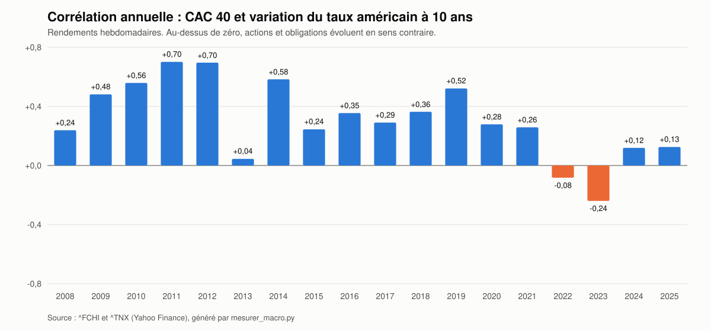

# Module 9 — La corrélation actions-obligations ⭐

**Prérequis :** [module 1](01-le-taux-d-actualisation.md), [module 3](03-l-inflation.md).
**Ce qu'on établit ici :** que le signe du lien entre actions et taux n'est pas une propriété des marchés mais d'un **régime d'inflation**, qu'il s'est renversé en 2022, et qu'une sensibilité estimée dans un régime ne dit rien de la suivante.

---

## 9.1 — Deux façons de dire la même chose

Le prix d'une obligation baisse quand son taux monte. Donc :

$$\operatorname{corr}(r^{\text{actions}}, \Delta y) > 0 \iff \operatorname{corr}(r^{\text{actions}}, r^{\text{obligations}}) < 0$$

Une corrélation **positive** entre actions et variation de taux veut dire
qu'actions et obligations évoluent **en sens contraire**. C'est la situation où
les obligations **protègent** un portefeuille d'actions : quand les actions
baissent, les taux baissent aussi, et les obligations montent.

## 9.2 — Ce qu'on attend, et ce qu'on mesure

Le [module 1](01-le-taux-d-actualisation.md) prédit : taux en hausse → actions en
baisse, soit une corrélation **négative** avec $\Delta y$. Voici ce qu'on mesure
sur le CAC 40 (relevé C) :

| Période | Corrélation annuelle |
|---|---|
| 2008-2021 | **positive les quatorze années**, de +0,045 (2013) à **+0,701** (2011) |
| 2022 | **−0,083** |
| 2023 | **−0,240** |
| 2024-2025 | +0,119, +0,125 |
| 2008-2025 | +0,298 |

Pendant quatorze ans, le signe est **l'inverse** de celui que prédit
l'actualisation. Les semaines où les taux montaient étaient celles où les actions
montaient.

## 9.3 — L'explication : quel choc domine

Le taux long bouge pour deux raisons :

| Choc dominant | Taux | Actions | Corrélation avec $\Delta y$ |
|---|---|---|---|
| **Croissance** : bonne nouvelle sur l'activité | ↑ (on attend des taux courts plus hauts) | ↑ (bénéfices attendus plus hauts) | **positive** |
| **Inflation** : mauvaise nouvelle sur les prix | ↑ (prime d'inflation) | ↓ (actualisation, [module 3](03-l-inflation.md)) | **négative** |

De 2000 à 2021, avec une inflation basse et ancrée, les taux ont surtout bougé au
rythme des nouvelles de croissance : la corrélation était positive. En 2022,
l'inflation est revenue au premier plan, les taux sont montés **à cause** d'elle,
et le signe s'est renversé.

Campbell, Sunderam & Viceira (2017) documentent ce mécanisme sur un siècle de
données américaines : la corrélation actions-obligations était **positive** (au
sens des prix) avant 2000, en régime d'inflation élevée, négative de 2000 à 2020.
L'épisode 2022-2023 du CAC 40 est un retour, bref ou non, à l'ancien régime.

> 🔑 **Le signe du lien entre actions et taux n'est pas une loi, c'est un
> régime.** Il dépend de ce qui fait bouger les taux, et cela change sur des
> décennies. Aucune estimation faite pendant un régime ne dit quand il finira.

## 9.4 — Ce que cela coûte

Une couverture actions-obligations, estimée sur 2010-2021, promettait que les
obligations monteraient quand les actions baissent. En 2022, les deux ont baissé
ensemble. La couverture n'était pas mal calculée : elle était calculée **dans un
autre régime**.

Même chose, valeur par valeur, pour la sensibilité propre au taux (relevé B,
marché compris) :

| Valeur | 2008-2012 | 2013-2021 | 2022-2025 |
|---|---|---|---|
| Klépierre | −0,010 ($t$ −0,47) | −0,000 ($t$ −0,01) | **−0,044** ($t$ **−3,05**) |
| Engie | −0,029 ($t$ −1,68) | **−0,045** ($t$ **−3,66**) | −0,001 ($t$ −0,05) |
| Airbus | −0,037 ($t$ −1,71) | **+0,041** ($t$ **+2,44**) | −0,010 ($t$ −0,69) |

Klépierre, la foncière, n'a de sensibilité mesurable au taux qu'**après** 2022.
Engie en avait une **avant**, et l'a perdue. Airbus change de signe. Un
$b_{\text{TAUX}}$ publié sur toute la période masque ces trois histoires.

> ⚠️ **Le relevé B ne teste rien.** Trois sous-périodes pour huit valeurs font
> vingt-quatre coefficients, et aucune correction de multiplicité n'y est
> appliquée. Il **montre** une instabilité ; il ne prouve pas que chaque
> coefficient isolé est réel. Le découpage lui-même (2022 comme charnière) a été
> choisi en connaissant l'histoire, ce qui en fait, au sens du dépôt, une lecture
> de **catégorie B**.

## Ce qu'il faut retenir

1. Corrélation positive avec la variation du taux ⇔ actions et obligations en
   sens contraire.
2. Sur le CAC 40, cette corrélation est **positive de 2008 à 2021**, négative en
   2022-2023.
3. Son signe dépend du choc dominant : croissance (positif) ou inflation
   (négatif).
4. Une sensibilité ou une couverture estimée dans un régime ne vaut pas dans le
   suivant.

---

⬅️ [Module 8 — Le crédit](08-le-credit.md) ·
➡️ [Module 10 — Des facteurs à la prévision](10-des-facteurs-a-la-prevision.md) ·
🏠 [Sommaire du dépôt](../../sommaire/README.md)
