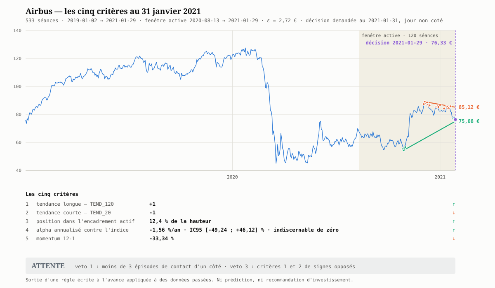
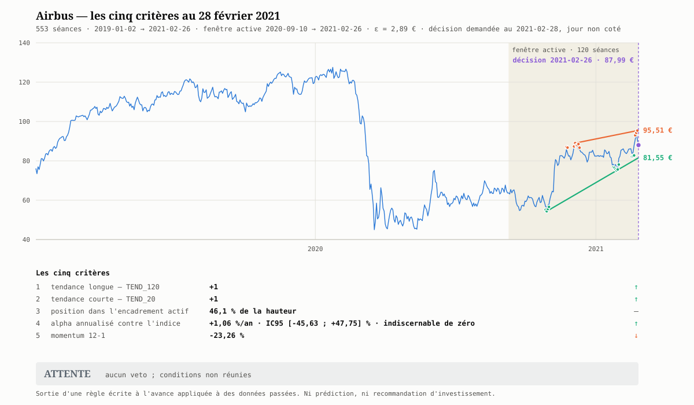

# Module 5 — Exemple daté du 1er janvier 2021, puis six mois de rejeu ⭐

**Prérequis :** modules [1](01-ce-que-le-chartiste-produit.md) à [4](04-les-pieges-du-passage-a-l-acte.md).
**Ce qu'on établit ici :** la règle du module 3 exécutée de bout en bout sur Airbus contre le CAC 40 au 1er janvier 2021, sans une seule donnée postérieure au 31 décembre 2020 (§§ 5.0 à 5.6) — puis **rejouée aux sept fins de mois du premier semestre 2021** (§ 5.8). Sept exécutions, sept fois `ATTENTE`, jamais tout à fait pour la même raison. Et deux `ACHAT` que cette cadence rate.

---

## 5.0 — La date, avant tout

**On se place le 1er janvier 2021.** Ce jour est férié : Euronext Paris est fermé,
il n'existe pas de cotation. La dernière séance disponible est le **jeudi
31 décembre 2020**, et c'est elle qui porte le verdict
([module 4 § 4.1a](04-les-pieges-du-passage-a-l-acte.md#a-la-date-demandée-nest-pas-une-séance)).

Les données, et rien d'autre :

```bash
python python/import_societe.py AIR.PA  --debut 2019-01-02 --fin 2021-01-01
python python/import_societe.py '^FCHI' --debut 2019-01-02 --fin 2021-01-01
```

| Fichier produit | Séances | Dernière |
|---|---|---|
| `docs/raw/quotes/AIR_PA_2019-01-02_2020-12-31.csv` | 513 | 2020-12-31 |
| `docs/raw/quotes/^FCHI_2019-01-02_2020-12-31.csv` | 512 | 2020-12-31 |
| Dates communes | **512** → **511 rendements** | — |

`--fin 2021-01-01` et non `--fin 2020-12-31` : la borne est exclusive, et la
seconde forme aurait amputé la séance du 31 décembre
([§ 4.1b](04-les-pieges-du-passage-a-l-acte.md#b---fin-est-exclusif)).

## 5.1 — La règle, recopiée avant tout chiffre

> **Critères.** 1 : `TEND_120`. 2 : `TEND_20`. 3 : position dans l'encadrement
> actif, en % de la hauteur. 4 : alpha annualisé et son IC95 contre l'indice.
> 5 : momentum 12-1.
>
> **ACHAT** — critères 1 et 2 à $+1$, position $< 35\,\%$, momentum 12-1 positif,
> et borne haute de l'IC de l'alpha $> 0$.
>
> **VENTE** — critères 1 et 2 à $-1$, position $> 65\,\%$, momentum 12-1 négatif.
>
> **ATTENTE** — dans tous les autres cas, et **obligatoirement** si : moins de
> 3 épisodes de contact d'un côté de l'encadrement actif ; ou canal se refermant
> en moins de 20 séances ; ou critères 1 et 2 de signes opposés ; ou historique de
> moins de 120 séances.

Indice de référence : CAC 40 (`^FCHI`). Taux sans risque : $r_f = 0$.

## 5.2 — Le décor, sans l'édulcorer

2019-2020 sur Airbus n'est pas un échantillon confortable, et le dire fait partie
du résultat.

| Période | Airbus | CAC 40 |
|---|---|---|
| 2019 | $+57{,}21\,\%$ | $+27{,}48\,\%$ |
| 2020 | $-32{,}76\,\%$ | $-8{,}11\,\%$ |
| **2019-2020 cumulé** | **$+8{,}17\,\%$** | **$+18{,}38\,\%$** |
| Volatilité annualisée | $54{,}27\,\%$ | $24{,}75\,\%$ |
| Repli maximal | $-64{,}70\,\%$ le **2020-03-18** | $-38{,}56\,\%$ le 2020-03-18 |
| Creux 2020 | **45,01 €** le 2020-03-18 | 3754,84 le 2020-03-18 |
| Du creux au 31/12/2020 | **$+82{,}98\,\%$** | $+47{,}85\,\%$ |
| Séances positives | 51,6 % | 55,0 % |

Le titre a perdu près des deux tiers de sa valeur en sept semaines, en a repris
83 % depuis le creux, et reste à $-33\,\%$ sur l'année. **Toute lecture qui ne
mentionne pas ces trois faits ensemble est une lecture partielle.**

## 5.3 — Les cinq critères mesurés au 31 décembre 2020

### Critères 1 et 2 — les deux tendances

Lues directement dans le CSV, dernière ligne, séance $n = 513$ :

| Critère | Colonne | $\rho$ | $t$ | $p$ | Verdict | Droite en $t = n$ |
|---|---|---|---|---|---|---|
| 1 — long terme | `TEND_120` | $+0{,}7361$ | $+11{,}814$ | $9{,}8\cdot 10^{-22}$ | **$+1$** | `VAL_120` $= 81{,}61$ € |
| 2 — court terme | `TEND_20` | $-0{,}6272$ | $-3{,}416$ | $0{,}00308$ | **$-1$** | `VAL_20` $= 82{,}06$ € |

Deux tests, tous deux significatifs, de **signes opposés**. Ce n'est pas une
anomalie : `TEND_120` mesure le rebond post-krach de juillet à décembre,
`TEND_20` mesure le repli de décembre. Datations utiles :

- `TEND_120` est à $+1$ **sans interruption depuis le 2020-11-18** (31 séances) ;
- `TEND_20` vient de basculer à $-1$ le **2020-12-30**, il y a **2 séances**.

Clôture du 31/12/2020 : **82,37 €**.

### Critère 3 — position dans l'encadrement actif

Fenêtre ancrée à droite, 120 séances : **2020-07-16 → 2020-12-31**
([encadrement 03](../../semestre3/encadrement/03-segmenter-un-historique-long.md)). Tolérance
de contact $\varepsilon = 0{,}25\,\sigma_{\text{Close}} = 0{,}25\times 10{,}49 =
\mathbf{2{,}62}$ €. Seuil de portée $n/4 = 30$ séances.

| | Résistance (sur `High`) | Support (sur `Low`) |
|---|---|---|
| Ancre | 2020-08-11, 69,89 € | 2020-10-29, 54,39 € |
| Pente | $+0{,}2306$ €/séance ($+0{,}28\,\%$/séance) | $+0{,}5820$ €/séance ($+0{,}71\,\%$/séance) |
| Portée | **83** séances (seuil 30) | **37** séances (seuil 30) |
| Épisodes de contact | **6** — structure installée | **3** — crédible |
| Détail des épisodes | `07-16` · `08-11…13` · `11-09` · `11-16` · `11-24…25` · `12-03…09` | `10-28…11-04` · `12-21…22` · `12-31` |
| Valeur au 2020-12-31 | **93,18 €** | **79,99 €** |

Les quatre lectures du [§ 4.1 du cours encadrement](../../semestre3/encadrement/04-lire-l-encadrement.md#41--les-quatre-grandeurs) :

| Grandeur | Valeur |
|---|---|
| Largeur | $13{,}19$ € soit **16,0 %** du cours |
| **Position dans le canal** | **18,0 %** de la hauteur |
| Distance au plafond | $+13{,}13\,\%$ |
| Distance au plancher | $-2{,}88\,\%$ |
| Convergence $\text{pente}_{\inf} - \text{pente}_{\sup}$ | $+0{,}3514$ €/séance |
| **Date de péremption $\tau$** | $13{,}19/0{,}3514 = \mathbf{37{,}5}$ séances |

Le cours vient de toucher son support le jour même (`2020-12-31` est le troisième
épisode). Le canal se **referme** : le support monte 2,5 fois plus vite que la
résistance et le canal aura disparu vers la fin février 2021.

> ⚠️ **Ce que l'arête retenue a coûté.** La dernière arête de la chaîne supérieure
> enjambe **une** séance (2020-12-30 → 2020-12-31) et vaut $-1{,}53$ €/séance ; la
> dernière arête de la chaîne inférieure enjambe 7 séances et vaut $+0{,}92$. La
> règle de portée $n/4$ les élimine toutes les deux
> ([§ 1.3](01-ce-que-le-chartiste-produit.md#13--les-trois-nombres-qui-accompagnent-chaque-droite)).
> Sans elle, on aurait mesuré une position de canal sur un biseau se refermant en
> trois séances.

### Critère 4 — alpha et bêta contre le CAC 40

Régression sur les **511 rendements** des 512 dates communes, $r_f = 0$ :

$$r_{\text{AIR},t} = \alpha + \beta\,r_{\text{CAC},t} + \varepsilon_t$$

| Grandeur | Valeur | Erreur type | $t$ | $p$ | IC95 |
|---|---|---|---|---|---|
| $\beta$ | **1,6592** | 0,0637 | $+10{,}35$ *(contre 1)* | $7\cdot10^{-23}$ | $[1{,}534\ ;\ 1{,}784]$ |
| $\alpha$ annualisé | $-0{,}29\,\%$ | **25,01 %** | $-0{,}012$ | **0,991** | $\mathbf{[-49{,}44\ ;\ +48{,}85]\,\%}$ |

Compléments : $R^2 = 0{,}571$ ; volatilité résiduelle $\sigma_\varepsilon =
35{,}60\,\%$/an ; tracking error $39{,}13\,\%$/an ; ratio d'information $+0{,}185$.

**Lecture obligatoire, dans cet ordre :**

1. **Le bêta se mesure.** $1{,}66$ avec un intervalle de 25 centièmes, $t = +10{,}3$
   contre 1 : Airbus amplifie son indice sans ambiguïté possible.
2. **L'alpha ne se mesure pas.** L'intervalle est large de **98 points**.
   Contrôle par la formule du [cours alpha § 3.1](../alpha/03-l-horizon-necessaire.md) :
   $\sigma_\varepsilon/\sqrt Y = 35{,}60/\sqrt{2{,}028} = 25{,}00\,\%$, soit
   exactement l'erreur type obtenue. Le plus petit alpha détectable ici vaut
   $1{,}96 \times 25{,}0 = \mathbf{49{,}0\,\%}$ par an. **Aucun alpha réaliste ne
   pouvait être établi sur deux ans** — *sur un titre isolé*. La sortie existe et
   elle est constructive : mesurer l'alpha d'un **panier** au lieu d'un titre fait
   tomber $\sigma_\varepsilon$ de $35{,}6\,\%$ à $1{,}6\,\%$/an
   ([`evaluer_portefeuille.py`](../../../../../python/evaluer_portefeuille.md)).
   Ce n'est pas un changement d'outillage, c'est un changement de question.
3. Le critère 4 se réduit donc à sa forme utilisable : **borne haute de l'IC
   $= +48{,}85\,\% > 0$** — condition satisfaite, et qui l'aurait été pour presque
   n'importe quel titre.

> ⚠️ **Cet alpha est biaisé, et le mesurer ne change rien — ce qui est
> l'enseignement.** `Close` est ajustée des dividendes, `^FCHI` est un indice
> **nu**. Le biais vaut ici
> $\text{rdt}_{\text{AIR}} - \beta\,\text{rdt}_{\text{indice}}$. Airbus n'a versé
> qu'**un seul dividende dans la fenêtre** — 1,65 € le 15 avril 2019, celui de
> 2020 ayant été annulé pour cause de Covid — soit $0{,}89\,\%$/an sur un cours
> moyen de 91,36 €. Avec $\beta = 1{,}66$ et un indice rendant 2 à 3 %/an, le
> biais vaut **$-2{,}4$ à $-4{,}1$ points** : l'alpha est **sous-estimé**, et
> vaudrait entre $+2{,}1$ et $+3{,}8\,\%$/an une fois corrigé.
>
> Déplacer un point de 3 points dans un intervalle large de **98** ne modifie ni
> la condition retenue, ni le verdict, ni la conclusion du § 2. C'est la
> démonstration la plus parlante de ce que « l'alpha ne se mesure pas » veut
> dire : **un biais de plusieurs points est ici invisible.** Sur un panier, où
> l'intervalle se resserre, le même biais deviendrait décisif — d'où
> [`construire_indice_total.py`](../../../../../python/construire_indice_total.md).

### Critère 5 — momentum 12-1

| Fenêtre | Bornes | Clôtures | Valeur |
|---|---|---|---|
| 12-1 | 2020-01-08 → 2020-12-01 | 123,28 → 82,02 € | **$-33{,}47\,\%$** |
| *(mois exclu)* | 2020-12-01 → 2020-12-31 | 82,02 → 82,37 € | $+0{,}43\,\%$ |

Le même critère sur le CAC 40 vaut $-7{,}45\,\%$ : le titre a fait 26 points de moins
que son indice sur la fenêtre de mesure.

## 5.4 — Les vetos, évalués avant les critères

| # | Veto | Mesure | Mord ? |
|---|---|---|---|
| 1 | moins de 3 épisodes d'un côté | résistance 6, support 3 → $\min = 3$ | non |
| 2 | fermeture en $< 20$ séances | $\tau = 37{,}5$ séances | non |
| 3 | critères 1 et 2 de signes opposés | `TEND_120` $= +1$, `TEND_20` $= -1$ | **OUI** |
| 4 | historique $< 120$ séances | 513 séances | non |

## 5.5 — Le verdict


La figure porte les cinq critères et le verdict, tous deux **calculés** par
[`python/generer_graph_decision.py`](../../../../../python/generer_graph_decision.md)
sur les seules séances antérieures ou égales au 31 décembre 2020 ; la commande
qui la produit est dans le [README du cours](README.md#la-figure-du-cours).

> ## `ATTENTE`
>
> **Condition déclenchante : veto 3** — `TEND_120 = +1` et `TEND_20 = −1` sont de
> signes opposés. Deux tests significatifs qui pointent dans des directions
> contraires sur deux échelles de temps ; la règle refuse d'arbitrer entre elles.

Le verdict est **confirmé deux fois de façon indépendante**, ce qui est utile à
publier :

| Verdict testé | Conditions | Résultat |
|---|---|---|
| **ACHAT** | 1 et 2 à $+1$ · position $< 35\,\%$ · momentum $> 0$ · borne haute IC $> 0$ | échoue sur `TEND_20` $=-1$ **et** sur le momentum $-33{,}5\,\%$ (position 18,0 % ✓, borne haute $+48{,}9\,\%$ ✓) |
| **VENTE** | 1 et 2 à $-1$ · position $> 65\,\%$ · momentum $< 0$ | échoue sur `TEND_120` $=+1$ **et** sur la position 18,0 % (momentum $<0$ ✓) |

Autrement dit, **deux critères sur cinq plaidaient l'achat, deux plaidaient la
vente, et le cinquième était muet.** C'est exactement la situation qu'`ATTENTE`
est faite pour couvrir.

## 5.6 — Ce que ce verdict ne couvre pas

- **Frais et exécution** : absents du CSV, mais **désormais chiffrables**
  ([`couts_transaction.py`](../../../../../python/couts_transaction.md)). Airbus
  SE étant de droit néerlandais, elle échappe à la taxe sur les transactions
  financières : l'aller-retour lui coûte $0{,}268\,\%$ contre $0{,}530\,\%$ pour
  une société française de plus d'un milliard. Le chiffre **renforce** le verdict
  plutôt qu'il ne le nuance : une règle qui basculerait au gré de `TEND_20`
  paierait ce péage à chaque bascule, et une rotation mensuelle coûte
  $6{,}4\,\%$/an — davantage que tout alpha mesurable ici.
- **Fiscalité et enveloppe** : PEA, CTO, durée de détention, prélèvements —
  totalement hors champ.
- **Liquidité** : le volume moyen n'a pas été utilisé comme contrainte.
- **Taille de position, levier, stop** : hors champ par construction ; ces
  questions relèvent du [cours finance](../finance/README.md), et une règle de
  verdict ne les remplace pas.
- **Horizon** : le verdict n'a pas de durée de validité. Le canal actif, lui, a
  une date de péremption calculée — **37,5 séances**, soit fin février 2021.
- **Une valeur, une période.** La règle a été appliquée à un seul titre sur une
  seule fenêtre. Rien ici ne dit ce qu'elle vaut ailleurs.

Et trois réserves statistiques nommées :

1. **$\varepsilon = 2{,}62$ € vaut $3{,}2\,\%$ du cours** parce que la fenêtre
   active couvre un régime très agité ($\sigma_{\text{Close}} = 10{,}49$ €, cours
   de 54,73 à 88,29 €). Les 6 épisodes de la résistance sont donc comptés avec une
   tolérance généreuse ; en régime calme, le même titre en aurait affiché moins.
2. **Le support n'a que 3 épisodes, et le troisième est la séance courante
   elle-même.** Il franchit le seuil du veto 1 de justesse. Une séance de moins et
   le verdict aurait été `ATTENTE` par le veto 1 au lieu du veto 3.
3. **Les erreurs ne sont pas i.i.d.** La volatilité est en grappes, et 2020 en est
   l'illustration extrême. Les $p$-valeurs de `TEND_20`, `TEND_120` et de la
   régression sont donc **optimistes** : le seuil nominal de 5 % est dépassé bien
   plus souvent que 5 % du temps ([canal 04](../../semestre3/canal/04-sorties-de-canal.md),
   [alpha 04](../alpha/04-cinq-pieges.md)).

> *Ceci est la sortie d'une règle écrite appliquée à des données passées, pas une
> recommandation.*

---

## 5.7 — Contrepoint : ce qui s'est passé ensuite

> ⚠️ **Cette section n'a joué aucun rôle dans le verdict.** Elle utilise des
> données de 2021, postérieures à la date de décision, et n'est là que pour
> montrer ce qu'une règle est et n'est pas. **Aucun seuil du module 3 n'a été, ni
> ne sera, ajusté au vu de ce qui suit.**

```bash
python python/import_societe.py AIR.PA  --debut 2021-01-01 --fin 2022-01-01
python python/import_societe.py '^FCHI' --debut 2021-01-01 --fin 2022-01-01
```

| | Airbus | CAC 40 |
|---|---|---|
| Du 2020-12-31 au 2021-12-31 | $82{,}37 \to 103{,}08$ €, **$+25{,}15\,\%$** | **$+28{,}85\,\%$** |
| Plus bas 2021 | 76,25 € le 2021-02-01 ($-7{,}4\,\%$) | — |
| Plus haut 2021 | 108,26 € le 2021-09-01 ($+31{,}4\,\%$) | — |

Trois observations, et trois seulement :

1. **Le titre a monté de 25 %.** Un `ACHAT` aurait « eu raison » en absolu. Cela
   ne valide rien : une observation ne teste pas une règle, et le
   [§ 9.10 de l'étape 9](../../semestre3/modele/09-exemple-complet.md) rappelle le cas
   symétrique — tendance haussière significative en janvier 2020, $-64\,\%$ sept
   semaines plus tard.
2. **Il a monté moins que son indice** ($+25{,}2$ contre $+28{,}9\,\%$), avec un
   bêta de 1,66. Rapporté au risque pris, l'année 2021 est en retrait, pas en
   avance — ce que la performance absolue seule ne montre jamais
   ([§ 4.3](04-les-pieges-du-passage-a-l-acte.md#43--le-drag-de-volatilité-sur-le-fil-rouge)).
3. **La géométrie sur laquelle un achat se serait appuyé a été détruite en quatre
   séances.** Le support actif, prolongé, valait 82,32 € le 2021-01-07 ; la clôture
   ce jour-là fut 82,22 €. Et à la séance $+38$ — la date de péremption calculée,
   soit le **2021-02-24** — le cours valait 94,24 € pendant que les deux droites
   prolongées se croisaient vers 102 €. **Le canal du 31 décembre n'existait déjà
   plus.** C'est exactement ce que $\tau$ annonçait, et c'est la seule prédiction
   qu'un biseau convergent autorise : sa propre disparition.

Enfin, pour situer : appliquée à chacune des 515 séances de 2020 et 2021, la même
règle rend `ATTENTE` **512 fois**, `ACHAT` 3 fois (2021-03-05, 2021-04-20,
2021-11-19) et `VENTE` jamais
([module 3 § 3.6](03-la-regle-ecrite-a-l-avance.md#36--ce-que-la-règle-donne-appliquée-tous-les-jours)).
Le verdict du 1er janvier 2021 n'a donc rien d'exceptionnel : c'est le verdict
ordinaire d'une règle qui exige beaucoup avant de parler.


---

## 5.8 — La même règle, rejouée pendant six mois

> ℹ️ **Chacune des sept dates est une décision à part entière.** Le § 5.7 était un
> contrepoint, qui regardait l'avenir depuis le 31 décembre. Ici, rien de tel :
> chaque analyse s'arrête à sa propre séance et n'utilise aucune donnée
> postérieure. Ce sont sept exécutions légitimes de la règle, séparées d'un mois.

```bash
python python/import_societe.py AIR.PA  --debut 2019-01-02 --fin 2021-07-01
python python/import_societe.py '^FCHI' --debut 2019-01-02 --fin 2021-07-01
python python/generer_graph_decision.py --date 2021-01-31 ...   # puis 02-28, 03-31…
```

**Les trois premières dates sont des jours non cotés** — le 1ᵉʳ janvier férié,
les 31 janvier et 28 février dimanches — et les quatre suivantes sont des
séances. La règle du
[§ 4.1a](04-les-pieges-du-passage-a-l-acte.md#a-la-date-demandée-nest-pas-une-séance)
s'applique donc trois fois sur sept : **une date de décision choisie par le
calendrier tombe hors séance près d'une fois sur deux.**

### 5.8.1 — Les sept analyses côte à côte

| | 1ᵉʳ janv. | 31 janv. | 28 févr. | 31 mars | 30 avr. | 31 mai | 30 juin |
|---|---|---|---|---|---|---|---|
| **Séance retenue** | 12-31 | 01-29 | 02-26 | 03-31 | 04-30 | 05-31 | 06-30 |
| Clôture | 82,37 | 76,33 | 87,99 | 88,57 | 91,69 | 97,85 | 99,49 |
| **1 — `TEND_120`** | $+1$ | $+1$ | $+1$ | $+1$ | $+1$ | $+1$ | $+1$ |
| **2 — `TEND_20`** | $-1$ | $-1$ | $+1$ | $-1$ | $0$ | $+1$ | $0$ |
| **3 — position** | 18,0 | 12,4 | 46,1 | 14,4 | 31,8 | **79,1** | 28,2 |
| **4 — alpha** | $-0{,}29$ | $-1{,}56$ | $+1{,}06$ | $-3{,}09$ | $-3{,}75$ | $-2{,}68$ | $-2{,}46$ |
| **5 — momentum** | $-33{,}5$ | $-33{,}3$ | $-23{,}3$ | **$+85{,}1$** | $+75{,}3$ | $+23{,}4$ | $+61{,}6$ |
| Pente résistance | $+0{,}231$ | **$-0{,}103$** | $+0{,}112$ | $+0{,}112$ | $+0{,}015$ | $+0{,}082$ | $+0{,}142$ |
| Pente support | $+0{,}582$ | $+0{,}323$ | $+0{,}323$ | $+0{,}305$ | $+0{,}231$ | $+0{,}142$ | $+0{,}347$ |
| Épisodes rés./sup. | 6/3 | 4/**2** | 3/3 | 4/3 | 4/**2** | **2**/3 | **2**/3 |
| Largeur | 16,0 % | 13,1 % | 15,9 % | 12,5 % | **7,0 %** | 14,1 % | 11,6 % |
| **$\tau$** | 37,5 | **23,5** | 65,9 | 57,6 | **29,7** | **231,3** | 56,1 |
| **Vetos** | 3 | 1 et 3 | — | 3 | **1** | **1** | **1** |
| **VERDICT** | `ATTENTE` | `ATTENTE` | `ATTENTE` | `ATTENTE` | `ATTENTE` | `ATTENTE` | `ATTENTE` |

*Alpha et momentum en % annualisés ; pentes en €/séance ; position en % de la
hauteur du canal ; $\tau$ en séances. Toutes les dates sont de 2021 sauf la
première.*

### 5.8.2 — Sept fois `ATTENTE`, jamais tout à fait pour la même raison

C'est le point du module, et il n'apparaît qu'en rejouant la règle.

| Date | Ce qui bloque |
|---|---|
| 31 déc. | **veto 3** — les deux tendances se contredisent |
| 29 janv. | **vetos 1 et 3** — le support tombe à 2 épisodes, et la contradiction demeure |
| 26 févr. | **aucun veto** — échec des conditions : position 46,1 % et momentum négatif |
| 31 mars | **veto 3** — `TEND_20` est repassé à $-1$ |
| 30 avr. | **veto 1** — le support retombe à 2 épisodes |
| 31 mai | **veto 1** — c'est la résistance, cette fois, qui n'a plus que 2 épisodes |
| 30 juin | **veto 1** — la résistance reste à 2 épisodes |

Le **veto 1 mord quatre fois sur sept**, et devient de loin le plus fréquent. Il
ne dit rien du marché : il dit que la droite d'encadrement **n'est pas
confirmée**, faute d'assez d'épisodes de contact dans la fenêtre glissante.

> 🔑 **Un verdict identique n'est pas une analyse identique.** Sept `ATTENTE`
> d'affilée masquent quatre situations sans rapport : contradiction des tendances,
> droite non confirmée d'un côté puis de l'autre, et simple insuffisance des
> critères. **Publier le verdict seul, sans la condition qui l'a déclenché, perd
> toute l'information** — c'est pourquoi le
> [§ 3 du module 3](03-la-regle-ecrite-a-l-avance.md) l'interdit.

### 5.8.3 — La géométrie se repeint en permanence

La pente de la résistance parcourt $+0{,}231 \to -0{,}103 \to +0{,}112 \to +0{,}112
\to +0{,}015 \to +0{,}082 \to +0{,}142$. Elle **change de signe**, s'aplatit
presque à zéro fin avril, puis remonte.

$\tau$, la date de péremption du canal, est encore plus instable : **23,5** séances
fin janvier — à trois séances et demie du veto 2 — puis **231,3** fin mai, un
canal devenu quasi parallèle, puis 56,1 un mois plus tard.

Et la largeur du canal tombe à **7,0 %** fin avril contre 16,0 % au départ.

Rien de tout cela n'est un événement de marché : la fenêtre ancrée à droite glisse
de 20 séances chaque mois, les arêtes de l'enveloppe convexe changent, et la
droite retenue avec elles. **C'est la repeinture du canal**, décrite en théorie au
[module 5 du cours canal](../../semestre3/canal/05-canal-glissant.md) et mesurée
ici sur sept relevés.

Le § 5.7 annonçait la disparition du canal du 31 décembre vers le **2021-02-24**,
d'après $\tau = 37{,}5$. La mesure du 26 février le confirme sans l'avoir
cherché : ancres, pentes et portées sont **toutes différentes**. Ce n'est pas le
même canal élargi, c'en est un autre.

### 5.8.4 — `TEND_20` bascule six fois en trois mois

| Date | Bascule |
|---|---|
| 2020-12-16 | $+1 \to 0$ |
| 2020-12-30 | $0 \to -1$ |
| 2021-01-07 | $-1 \to 0$ |
| 2021-01-27 | $0 \to -1$ |
| 2021-02-04 | $-1 \to 0$ |
| 2021-02-15 | $0 \to +1$ |

> ⚠️ **Six changements d'état en 55 séances**, et le critère prend les trois
> valeurs $-1$, $0$ et $+1$ aux sept relevés. `TEND_120`, lui, vaut $+1$ **aux
> sept dates sans exception**. Une règle qui déclencherait sur `TEND_20` seul
> négocierait plus souvent que l'hebdomadaire : **plus de 27 % par an de frais**
> ([`couts_transaction.py`](../../../../../python/couts_transaction.md)). Le
> veto 3, qui exige l'accord des deux tendances, n'est pas une prudence
> esthétique : c'est ce qui empêche la règle de payer ce prix.

### 5.8.5 — Le momentum passe de $-33\,\%$ à $+85\,\%$ sans que rien n'arrive

C'est l'observation la plus contre-intuitive des sept relevés.

| Date de décision | Fenêtre 12-1 | Clôtures | Momentum |
|---|---|---|---|
| 2020-12-31 | 2020-01-08 → 2020-12-01 | 123,28 → 82,02 € | $\mathbf{-33{,}47\,\%}$ |
| **2021-03-31** | **2020-04-06** → 2021-03-02 | **49,11** → 90,92 € | $\mathbf{+85{,}13\,\%}$ |
| 2021-06-30 | 2020-07-07 → 2021-06-01 | 61,74 → 99,78 € | $+61{,}60\,\%$ |

Le momentum gagne **118 points en trois mois** alors que le titre n'a progressé
que de $+7{,}5\,\%$ sur la période. L'explication tient entièrement au
**dénominateur** : au 31 mars, la fenêtre 12-1 démarre le **6 avril 2020**, trois
semaines après le creux du krach, à **49,11 €**. Le momentum ne mesure pas la
force du titre, il mesure **ce qui vient de sortir de la fenêtre par la gauche**.

> ⚠️ **Un critère peut tripler de valeur sans qu'aucune information nouvelle
> n'apparaisse.** C'est un artefact de calendrier, pas un signal. Toute règle qui
> emploie une fenêtre glissante hérite de ce défaut, et il faut le nommer chaque
> fois qu'on publie un momentum au voisinage d'un krach.

### 5.8.6 — Ce que la cadence mensuelle a raté

Les sept relevés donnent sept `ATTENTE`. Pourtant, le
[§ 3.6 du module 3](03-la-regle-ecrite-a-l-avance.md#36--ce-que-la-règle-donne-appliquée-tous-les-jours)
établit que la règle rend `ACHAT` trois fois en 2020-2021. Deux de ces trois
signaux tombent **dans la période couverte ici** :

| Date | Verdict | Position de la date |
|---|---|---|
| **2021-03-05** | **`ACHAT`** | entre les relevés du 26 février et du 31 mars |
| **2021-04-20** | **`ACHAT`** | entre les relevés du 31 mars et du 30 avril |

Vérification au 5 mars : `TEND_120` $= +1$, `TEND_20` $= +1$, position
$33{,}9\,\%$ — sous le seuil de 35 —, momentum $+8{,}63\,\%$, borne haute de l'IC
$+46{,}29\,\%$. Aucun veto. **Les cinq conditions d'`ACHAT` sont réunies**, pour
la seule et unique fois de tout le cours.


> 🔑 **La cadence d'échantillonnage change le résultat.** Un lecteur qui
> n'interrogerait la règle qu'en fin de mois n'aurait vu que des `ATTENTE` et
> conclu qu'elle ne parle jamais. Elle a parlé deux fois, entre ses relevés.
> **La fréquence d'application fait partie de la règle** et doit être écrite avec
> elle — le [module 3](03-la-regle-ecrite-a-l-avance.md) l'omettait, et ces sept
> relevés le rendent visible.

Noter au passage que la position à $33{,}9\,\%$ passe le seuil de $35\,\%$ **de
1,1 point**. Le signal le plus rare du cours tient à un dixième de la hauteur du
canal.

### 5.8.7 — Et le cours, pendant ce temps

| Période | Variation |
|---|---|
| 2020-12-31 → 2021-01-29 | $82{,}37 \to 76{,}33$ €, **$-7{,}33\,\%$** |
| 2021-01-29 → 2021-02-26 | $76{,}33 \to 87{,}99$ €, **$+15{,}28\,\%$** |
| 2021-02-26 → 2021-06-30 | $87{,}99 \to 99{,}49$ €, $+13{,}07\,\%$ |
| **2020-12-31 → 2021-06-30** | $82{,}37 \to 99{,}49$ €, **$+20{,}78\,\%$** |

Le titre a gagné 20,8 % en six mois, et la règle a rendu `ATTENTE` à chacune des
sept fins de mois. Ce n'est **pas** un défaut à corriger : c'est ce que fait une
règle qui exige beaucoup avant de parler, et le
[module 3](03-la-regle-ecrite-a-l-avance.md) mesure qu'elle rend `ATTENTE`
512 fois sur 515. Corriger les seuils au vu de ces six mois serait exactement
l'ajustement après coup que le
[§ 3.5](03-la-regle-ecrite-a-l-avance.md) interdit.





Les deux figures se lisent contre celle du § 5.5 : l'aplat de la fenêtre active se
déplace vers la droite, et les deux droites sont **retracées** à chaque fois —
mêmes données à gauche, géométrie différente.

---

⬅️ [Module 4 — Les pièges du passage à l'acte](04-les-pieges-du-passage-a-l-acte.md) ·
🏠 [README du cours](README.md)
