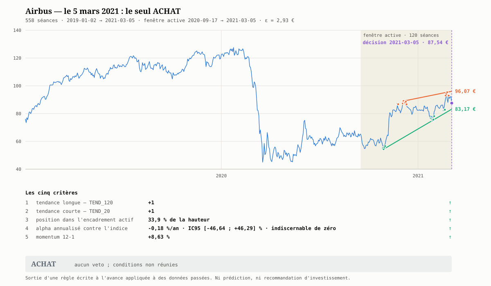
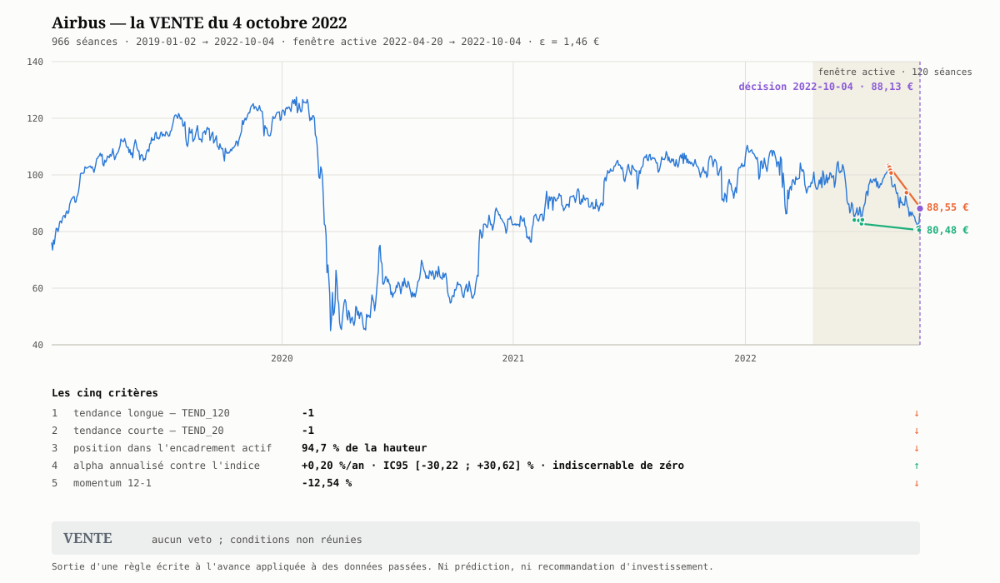

# Module 6 — Cas pratique : un cycle `ACHAT` → `VENTE`, 2021-2025 ⭐

**Prérequis :** modules [1](01-ce-que-le-chartiste-produit.md) à [5](05-la-cadence-fait-partie-de-la-regle.md).
**Ce qu'on établit ici :** la règle du [module 3](03-la-regle-ecrite-a-l-avance.md) exécutée aux **1 281 séances** de 2021 à 2025 sur Airbus contre le CAC 40, et le **seul cycle complet** qu'elle produit sur ces cinq ans — `ACHAT` le 5 mars 2021 à 87,54 €, `VENTE` le 4 octobre 2022 à 88,13 €. Dix-neuf mois de détention, un repli de $-25{,}8\,\%$ traversé sans broncher, **$+0{,}67\,\%$** brut et **$+0{,}42\,\%$** net — pendant que le même titre, conservé de bout en bout, gagnait **$+136\,\%$**. Et une hypothèse d'exécution décalée d'une seule séance qui **change le signe** du résultat.

---

## 6.0 — Les données, et rien d'autre

```bash
python python/import_societe.py AIR.PA  --debut 2019-01-02 --fin 2026-01-01
python python/import_societe.py '^FCHI' --debut 2019-01-02 --fin 2026-01-01
python python/construire_indice_total.py AIR.PA MC.PA OR.PA SAN.PA TTE.PA \
                                         BNP.PA SU.PA ORA.PA AI.PA DG.PA \
                                         --debut 2019-01-02 --fin 2025-12-31 --telecharger
```

| Fichier produit | Séances | Plage |
|---|---|---|
| `docs/raw/data/quotes/AIR_PA_2019-01-02_2025-12-31.csv` | 1794 | 2019-01-02 → 2025-12-31 |
| `docs/raw/data/quotes/^FCHI_2019-01-02_2025-12-31.csv` | 1793 | idem |
| `docs/raw/data/quotes/TR10_2019-01-02_2025-12-30.csv` | 1792 | 2019-01-02 → 2025-12-30 |

**L'historique démarre en 2019 alors que la période de décision démarre en 2021**,
et ce n'est pas un excès de zèle : le premier verdict du 4 janvier 2021 a besoin de
120 séances pour son encadrement et de 253 pour son momentum 12-1
([module 2 § 2.4](02-d-un-objet-a-un-critere.md#24--le-momentum-12-1-et-le-trou-du-dernier-mois)).
Sans ces deux années d'amorce, le veto 4 mordrait pendant un an.

`--fin 2026-01-01` et non `--fin 2025-12-31` : la borne est exclusive, et la
seconde forme aurait amputé la séance du 31 décembre
([§ 4.1b](04-les-pieges-du-passage-a-l-acte.md#b---fin-est-exclusif)).

**Période de décision : du 2021-01-04 au 2025-12-31, soit 1 281 séances** — la
première et la dernière séance cotées de la fenêtre demandée.

## 6.1 — Ce qui est écrit avant tout chiffre

### 6.1.1 — La règle, recopiée sans modification

> **Critères.** 1 : `TEND_120`. 2 : `TEND_20`. 3 : position dans l'encadrement
> actif, en % de la hauteur. 4 : alpha annualisé et son IC95 contre l'indice.
> 5 : momentum 12-1.
>
> **ACHAT** — critères 1 et 2 à $+1$, position $< 35\,\%$, momentum 12-1 positif,
> et borne haute de l'IC de l'alpha $> 0$.
>
> **VENTE** — critères 1 et 2 à $-1$, position $> 65\,\%$, momentum 12-1 négatif.
>
> **ATTENTE** — dans tous les autres cas, et **obligatoirement** si : moins de
> 3 épisodes de contact d'un côté de l'encadrement actif ; ou canal se refermant
> en moins de 20 séances ; ou critères 1 et 2 de signes opposés ; ou historique de
> moins de 120 séances.

Indice de référence du critère 4 : CAC 40 (`^FCHI`). Taux sans risque : $r_f = 0$.

### 6.1.2 — La convention de cycle, qui n'est pas dans la règle

> 🔑 **La règle du module 3 rend un verdict par séance, pas une position.** Passer
> de l'un à l'autre demande une convention supplémentaire — et cette convention
> pèse sur le résultat autant que la règle elle-même. Elle se publie donc au même
> endroit et dans les mêmes termes : **avant tout chiffre**.

**La cadence d'abord** : la règle est évaluée **à chaque séance cotée** de la
période, et rien ne se passe entre deux séances. C'est le premier paramètre à
déclarer, et le [module 5](05-la-cadence-fait-partie-de-la-regle.md) montre ce
que d'autres choix auraient donné. Viennent ensuite les sept conventions qui
font le passage du verdict à la position :

| # | Convention déclarée |
|---|---|
| 1 | **Une seule ligne, tout ou rien.** Aucun dimensionnement, aucun fractionnement. |
| 2 | **Entrée** à la première séance `ACHAT` de la période. |
| 3 | **Sortie** à la première séance `VENTE` postérieure à l'entrée. |
| 4 | **Un seul aller-retour.** Tout signal postérieur à la sortie est ignoré — c'est ce que « un cycle » veut dire, et rien d'autre. |
| 5 | **Exécution à la clôture de la séance de décision.** La variante réaliste — l'ouverture de la séance suivante — est chiffrée au [§ 6.6](#66--le-compte-du-cycle). |
| 6 | **Ni vente à découvert, ni levier, ni stop.** La `VENTE` s'entend comme sortie d'une position existante ([§ 3.4](03-la-regle-ecrite-a-l-avance.md#34--lasymétrie-achat--vente-est-délibérée)). |
| 7 | **Frais déclarés** au § 6.6 ; fiscalité, enveloppe et liquidité hors champ. |

## 6.2 — Ce que la règle dit des cinq années

Le verdict est calculé à chacune des 1 281 séances, chaque fois avec les seules
données disponibles ce jour-là — c'est exactement ce que fait
[`generer_graph_decision.py`](../../../../../python/generer_graph_decision.md) à
une date donnée, répété séance par séance :

```bash
python python/generer_graph_decision.py \
  --csv docs/raw/data/quotes/AIR_PA_2019-01-02_2025-12-31.csv \
  --indice 'docs/raw/data/quotes/^FCHI_2019-01-02_2025-12-31.csv' \
  --date 2021-03-05
```

| Verdict | Occurrences | Part | Épisodes |
|---|---|---|---|
| **ATTENTE** | **1254** | **97,9 %** | — |
| ACHAT | 25 | 2,0 % | 12 |
| **VENTE** | **2** | **0,2 %** | **1** |

Deux séances de `VENTE` en cinq ans, consécutives, donc **une seule fenêtre de
sortie, large de deux séances**. C'est elle qui referme le cycle du § 6.5.

### La ventilation des `ATTENTE`, par le premier veto qui mord

| Motif | Occurrences | Part des 1 281 séances |
|---|---|---|
| **Veto 1** — moins de 3 épisodes de contact d'un côté | **551** | **43,0 %** |
| Aucun jeu complet de conditions `ACHAT` ou `VENTE` | 475 | 37,1 % |
| Veto 3 — `TEND_20` et `TEND_120` de signes opposés | 131 | 10,2 % |
| Veto 2 — canal se refermant en moins de 20 séances | 97 | 7,6 % |

### Par année

| | 2021 | 2022 | 2023 | 2024 | 2025 |
|---|---|---|---|---|---|
| ACHAT | 3 | 0 | 8 | 2 | 12 |
| **VENTE** | 0 | **2** | 0 | 0 | 0 |
| ATTENTE | 255 | 255 | 247 | 254 | 243 |

> 🔑 **Le comptage du [module 3](03-la-regle-ecrite-a-l-avance.md#36--ce-que-la-règle-donne-appliquée-tous-les-jours) tient sur cinq ans.**
> Il annonçait 99,4 % d'`ATTENTE` sur 2020-2021 ; sur 2021-2025 la règle en rend
> **97,9 %**, avec le veto 1 toujours en tête. Une règle honnête reste presque
> toujours silencieuse, et le peu qu'elle dit est **asymétrique** : douze épisodes
> d'achat contre un seul de vente.

## 6.3 — L'entrée : vendredi 5 mars 2021

```
Valeur           : AIR.PA (558 séances, 2019-01-02 → 2021-03-05)
Décision         : 2021-03-05
Fenêtre active   : 2020-09-17 → 2021-03-05 (120 séances, ε = 2,93 €)
Résistance       : pente +0,1117 €/séance · portée 57 · 3 épisodes · 96,07 €
Support          : pente +0,3234 €/séance · portée 64 · 3 épisodes · 83,17 €
Largeur          : 12,90 € (14,7 %) · τ = 60,9 séances

Critère 1  tendance longue — TEND_120        : +1
Critère 2  tendance courte — TEND_20         : +1
Critère 3  position dans l'encadrement actif : 33,9 % de la hauteur
Critère 4  alpha annualisé contre l'indice   : -0,18 %/an · IC95 [-46,64 ; +46,29] % · indiscernable de zéro
Critère 5  momentum 12-1                     : +8,63 %

Vetos            : aucun
VERDICT          : ACHAT
```



Les cinq conditions d'`ACHAT` sont réunies, aucun veto ne mord. **C'est le premier
`ACHAT` de la période, il ouvre le cycle.** Clôture retenue : **87,54 €**.

Trois remarques, et elles comptent toutes les trois pour la suite :

1. **Le signal tombe un jour de baisse de $-4{,}87\,\%$** (92,02 → 87,54 €, l'indice
   à $-0{,}82\,\%$). Ce n'est pas une coïncidence mais une **conséquence mécanique**
   du critère 3 : exiger une position basse dans le canal, c'est exiger une baisse
   récente. La règle achète structurellement des séances rouges.
2. **La position passe le seuil de 1,1 point** — $33{,}9\,\%$ contre $35\,\%$ — et
   la fenêtre d'achat est large d'**une seule séance** : la veille, à 92,02 €, la
   position valait $70{,}0\,\%$ ; le lundi suivant, à 92,22 €, $68{,}8\,\%$. Les deux
   jours rendent `ATTENTE` avec les quatre autres critères déjà satisfaits.
3. **Les deux côtés de l'encadrement comptent exactement 3 épisodes**, soit le
   strict minimum du veto 1. Un épisode de moins d'un côté, et il n'y avait pas de
   cycle du tout.

> ⚠️ **Le critère 4 est satisfait sans rien affirmer.** L'IC95 de l'alpha est large
> de **93 points** ; la règle n'en retient que la borne haute, $+46{,}29\,\% > 0$ —
> condition que remplirait à peu près n'importe quel titre. C'est le
> [cours alpha § 3.1](../alpha/03-l-horizon-necessaire.md) : sur deux ans et un
> seul titre, **aucun alpha réaliste n'est détectable**, et le critère 4 ne fait
> ici que ne pas s'opposer.

## 6.4 — Dix-neuf mois de détention, et le silence de la règle

**408 séances**, du 2021-03-05 au 2022-10-04, soit 578 jours calendaires, **1,58 an**.

| | Valeur | Écart au prix d'entrée |
|---|---|---|
| Entrée | 87,54 € le 2021-03-05 | — |
| Plus haute clôture | **110,46 €** le 2022-01-05 | $+26{,}18\,\%$ |
| Plus basse clôture | **81,98 €** le 2022-09-29 | $-6{,}36\,\%$ |
| **Repli maximal depuis le sommet** | — | **$-25{,}79\,\%$** |
| Volatilité annualisée sur la détention | $35{,}31\,\%$ | — |
| Sortie | 88,13 € le 2022-10-04 | $+0{,}67\,\%$ |

Ce que la règle a dit pendant ces 408 séances :

| Date | Verdict | Ce que la convention en fait |
|---|---|---|
| 2021-04-20 | `ACHAT` | **ignoré** — déjà en position (convention 1) |
| 2021-11-19 | `ACHAT` | **ignoré** — idem |
| 2021-11-22 → 2022-10-03 | `ATTENTE` **224 séances d'affilée** | rien |
| 2022-10-04 | `VENTE` | sortie |

> ⚠️ **La règle n'a pas de stop, et cela se voit ici en grandeur réelle.** Entre le
> sommet du 5 janvier 2022 et le creux du 29 septembre, la position perd
> $25{,}8\,\%$ **sans qu'un seul verdict soit rendu** : 224 séances de silence
> couvrant toute la baisse. Le dimensionnement et le stop relèvent du
> [cours finance](../finance/README.md) ; une règle de verdict ne les remplace
> pas, et croire le contraire est exactement le piège du
> [§ 3.7](03-la-regle-ecrite-a-l-avance.md#37--ce-quun-verdict-nest-pas). **Ce que ce silence
> aurait coûté, ou rapporté, si un stop l'avait interrompu est mesuré au
> [module 7](07-le-stop-une-sortie-sans-verdict.md).**

## 6.5 — La sortie : mardi 4 octobre 2022

```
Valeur           : AIR.PA (966 séances, 2019-01-02 → 2022-10-04)
Décision         : 2022-10-04
Fenêtre active   : 2022-04-20 → 2022-10-04 (120 séances, ε = 1,46 €)
Résistance       : pente -0,4222 €/séance · portée 35 · 3 épisodes · 88,55 €
Support          : pente -0,0348 €/séance · portée 64 · 4 épisodes · 80,48 €
Largeur          : 8,08 € (9,2 %) · τ = 20,8 séances

Critère 1  tendance longue — TEND_120        : -1
Critère 2  tendance courte — TEND_20         : -1
Critère 3  position dans l'encadrement actif : 94,7 % de la hauteur
Critère 4  alpha annualisé contre l'indice   : +0,20 %/an · IC95 [-30,22 ; +30,62] % · indiscernable de zéro
Critère 5  momentum 12-1                     : -12,54 %

Vetos            : aucun
VERDICT          : VENTE
```



### La `VENTE` tombe un jour de **hausse** de $+6{,}15\,\%$

C'est l'observation la plus contre-intuitive du module, et elle est entièrement
géométrique. Les deux séances qui se suivent :

| | 2022-10-03 | 2022-10-04 |
|---|---|---|
| Clôture Airbus | 83,02 € ($+0{,}36\,\%$) | **88,13 € ($+6{,}15\,\%$)** |
| CAC 40 | $+0{,}55\,\%$ | **$+4{,}24\,\%$** |
| Pente de la résistance | $-0{,}0352$ €/séance | **$-0{,}4222$ €/séance** |
| Pente du support | $-0{,}0348$ €/séance | $-0{,}0348$ €/séance |
| Largeur du canal | 26,0 % du cours | **9,2 %** |
| $\tau$ | 45 269 séances | **20,8 séances** |
| **Position** | **11,6 %** | **94,7 %** |
| Verdict | `ATTENTE` | **`VENTE`** |

En une séance, la position passe de $11{,}6\,\%$ à $94{,}7\,\%$ **sans que le
support bouge d'un centime**. Ce qui a changé, c'est l'**arête retenue** de la
chaîne supérieure : le nouveau plus haut du 4 octobre a modifié l'enveloppe
convexe, et la droite de résistance est passée d'une pente quasi nulle à
$-0{,}42$ €/séance. Le canal ne s'est pas déplacé, il a été **repeint** — le
phénomène décrit en théorie au
[module 5 du cours canal](../../semestre3/canal/05-canal-glissant.md) et au
[§ 4.2](04-les-pieges-du-passage-a-l-acte.md#42--le-canal-se-repeint), ici
observé sur la séance unique qui décide du cycle.

> ⚠️ **Le seul `VENTE` de cinq ans passe le veto 2 de 0,8 séance.** $\tau = 20{,}8$
> contre un seuil de 20. Une convergence à peine plus rapide, et le veto 2
> interdisait la sortie ; la position serait restée ouverte. Deux séances plus
> tard, le 6 octobre, la résistance retombe à 2 épisodes et **le veto 1 referme la
> fenêtre de sortie**. Elle aura été large de deux séances sur 1 281.

## 6.6 — Le compte du cycle

### Les coûts, déclarés et non estimés

```bash
python python/couts_transaction.py AIR.PA --montant 10000
```

| Terme | Taux | Nature |
|---|---|---|
| TTF | **0,000 %** | Airbus SE est de **droit néerlandais** : exemptée |
| Courtage, 2 sens | 0,200 % | clause de contrat |
| Spread, 1 spread complet | 0,030 % | observable |
| Impact de marché, 2 sens | 0,013 % | **le seul terme estimé** — 0,0064 % par sens pour 10 000 € |
| **Aller-retour** | **0,243 %** | contre 0,530 % pour une société française de plus d'un milliard |

### Le résultat, sous les deux hypothèses d'exécution

| Hypothèse | Achat | Vente | Brut | Net des 0,243 % | Annualisé net |
|---|---|---|---|---|---|
| **Clôture de la séance de décision** (convention 5) | 87,54 € | 88,13 € | **$+0{,}67\,\%$** | **$+0{,}42\,\%$** | $+0{,}27\,\%$/an |
| **Ouverture de la séance suivante** | 88,87 € | 87,75 € | **$-1{,}26\,\%$** | **$-1{,}50\,\%$** | $-0{,}95\,\%$/an |

> ⚠️ **Le signe du résultat tient à une hypothèse d'exécution, pas à la règle.**
> Le verdict se calcule *sur* la clôture de la séance de décision : à l'instant où
> on le connaît, cette clôture est passée. La seule exécution réellement possible
> est l'ouverture suivante — et elle transforme $+0{,}67\,\%$ en $-1{,}26\,\%$.
> Le décalage joue ici **deux fois contre** : à l'achat parce que le signal naît
> d'une séance de baisse suivie d'un rebond, à la vente parce qu'il naît d'une
> séance de hausse suivie d'un repli. **Ce n'est pas une malchance, c'est la
> contrepartie mécanique du critère 3.**

Les deux chiffres sont publiés parce qu'aucun des deux n'est faux : le premier
mesure la règle, le second mesure ce qu'on peut en faire. **Publier le premier
seul serait un regard en avant d'une demi-séance**, la forme la plus discrète de
celles qu'énumère le [module 4](04-les-pieges-du-passage-a-l-acte.md).

## 6.7 — Contre quoi comparer ce $+0{,}67\,\%$

### Sur la fenêtre de détention (2021-03-05 → 2022-10-04)

| | Variation |
|---|---|
| Airbus — la position elle-même | $+0{,}67\,\%$ |
| `^FCHI`, indice **nu** | $+4{,}45\,\%$ |
| **`TR10`, en rendement total** | **$+12{,}71\,\%$** |

### Sur les cinq années (2021-01-04 → 2025-12-31)

| | Cumulé | Annualisé |
|---|---|---|
| **La règle, un cycle, net de frais** | **$+0{,}42\,\%$** | **$+0{,}08\,\%$/an** |
| Airbus conservé de bout en bout | $+136{,}21\,\%$ | $+18{,}79\,\%$/an |
| `TR10`, en rendement total | $+89{,}11\,\%$ | $+13{,}62\,\%$/an |
| `^FCHI`, nu | $+45{,}81\,\%$ | $+7{,}85\,\%$/an |

La position n'a existé que **31,9 %** du temps (408 séances sur 1 281), et pendant
ces 31,9 % le titre n'a rien fait. **La quasi-totalité des $+136\,\%$ s'est
produite pendant que la règle était hors du marché.**

### L'alpha de la position, et le piège de l'indice

Régression des 408 rendements quotidiens de la détention sur ceux de l'indice,
$r_f = 0$ :

| Indice de référence | $\beta$ | $\alpha$ annualisé | IC95 | Lecture |
|---|---|---|---|---|
| `^FCHI`, **nu** | 1,4230 | $+0{,}13\,\%$ | $[-33{,}68\ ;\ +33{,}94]\,\%$ | indiscernable de zéro |
| **`TR10`, rendement total** | 1,6114 | **$-7{,}86\,\%$** | $[-39{,}08\ ;\ +23{,}35]\,\%$ | indiscernable de zéro |

> ⚠️ **Huit points d'alpha séparent les deux lignes, et rien d'autre qu'une
> convention ne les sépare.** `Close` est ajustée des dividendes, `^FCHI` ne l'est
> pas : comparer les deux fabrique de l'alpha à partir de rien. Contre un indice
> de **même convention**, l'alpha de la position passe de $+0{,}13$ à
> $-7{,}86\,\%$/an. Les deux intervalles contiennent zéro — donc **aucune des deux
> lignes ne démontre quoi que ce soit** —, mais un lecteur pressé qui n'aurait lu
> que la première aurait retenu un alpha positif.
> [`construire_indice_total.py`](../../../../../python/construire_indice_total.md)
> existe exactement pour cette ligne-là.

> ℹ️ **`TR10` n'est pas le CAC 40.** C'est un panier de **dix valeurs déclarées**
> — AIR.PA, MC.PA, OR.PA, SAN.PA, TTE.PA, BNP.PA, SU.PA, ORA.PA, AI.PA, DG.PA —,
> équipondéré, rebalancé annuellement, constitué **aujourd'hui** : le biais du
> survivant est entier, et Airbus y pèse un dixième. Il sert ici à une seule
> chose : donner un point de comparaison **de même convention** que la série du
> titre. Sur 2019-2025, il rend $13{,}96\,\%$/an contre $8{,}12\,\%$ pour `^FCHI`,
> soit **5,85 points d'écart annuel** qui mélangent dividendes, composition et
> pondération.

## 6.8 — Ce que ce cycle ne prouve pas

- **Un cycle, un titre, une période.** $n = 1$. Aucun test, aucune significativité,
  aucune généralisation — le [§ 3.6](03-la-regle-ecrite-a-l-avance.md#36--ce-que-la-règle-donne-appliquée-tous-les-jours)
  posait déjà la réserve pour un simple dénombrement ; elle vaut *a fortiori* ici.
- **Ce n'est pas un backtest de la règle, c'est l'exécution d'une convention.**
  La règle a rendu **22 autres `ACHAT` après la sortie** ; s'arrêter au premier
  aller-retour est une décision du § 6.1.2, pas de la règle. Pour situer : la
  réentrée au signal suivant, le **2023-01-27**, se serait faite à 108,53 €, soit
  **$+23{,}1\,\%$ au-dessus du prix de sortie**.
- **Aucun regard en avant sur les verdicts** — le script tronque tout ce qui suit
  la séance de décision, échelles de graphique comprises. Mais l'exécution à la
  clôture de cette même séance est, elle, une hypothèse optimiste, et le § 6.6 la
  chiffre plutôt que de la mentionner.
- **Les coûts sont déclarés**, l'impact de marché est estimé sur le volume du jour
  de l'appel et non sur celui de 2021 ou 2022.
- **Fiscalité, enveloppe, liquidité, taille de position et levier** : hors champ, comme au
  [§ 3.7](03-la-regle-ecrite-a-l-avance.md#37--ce-quun-verdict-nest-pas). Le **stop**, lui, sort
  du hors-champ au [module 7](07-le-stop-une-sortie-sans-verdict.md).
- **Les erreurs ne sont pas i.i.d.** La volatilité est en grappes ; les $p$-valeurs
  de `TEND_20`, `TEND_120` et des régressions sont **optimistes**
  ([alpha 04](../alpha/04-cinq-pieges.md)).

## 6.9 — Ce qu'il faut retenir

| | |
|---|---|
| Séances examinées | 1 281 |
| Verdicts non-`ATTENTE` | 27, soit $2{,}1\,\%$ |
| Cycles complets | **1** |
| Durée du cycle | 408 séances, 1,58 an |
| Résultat brut / net | $+0{,}67\,\%$ / $+0{,}42\,\%$ |
| Sous exécution réaliste | $-1{,}26\,\%$ / $-1{,}50\,\%$ |
| Repli traversé | $-25{,}8\,\%$ |
| Le titre, conservé | $+136{,}21\,\%$ |

> 🔑 **Cinq ans de données, une règle rigoureuse, un seul cycle, et un résultat
> nul dont le signe dépend d'une demi-séance d'exécution.** Aucun des chiffres
> ci-dessus n'est un accident : le silence vient des vetos, le résultat nul vient
> de ce que la règle achète bas dans le canal et vend haut dans un canal repeint,
> et l'écart avec les $+136\,\%$ vient de ce qu'elle a passé $68\,\%$ du temps hors
> du marché. **Une règle correcte, exécutée sans tricher, peut ne rien produire —
> et c'est un résultat, pas un échec de méthode.**

> *Ceci est la sortie d'une règle écrite appliquée à des données passées, pas une
> recommandation.*

---

⬅️ [Module 5 — La cadence d'application fait partie de la règle](05-la-cadence-fait-partie-de-la-regle.md) ·
➡️ [Module 7 — Le stop, une sortie qui n'attend pas de verdict](07-le-stop-une-sortie-sans-verdict.md) ·
🏠 [README du cours](README.md)
