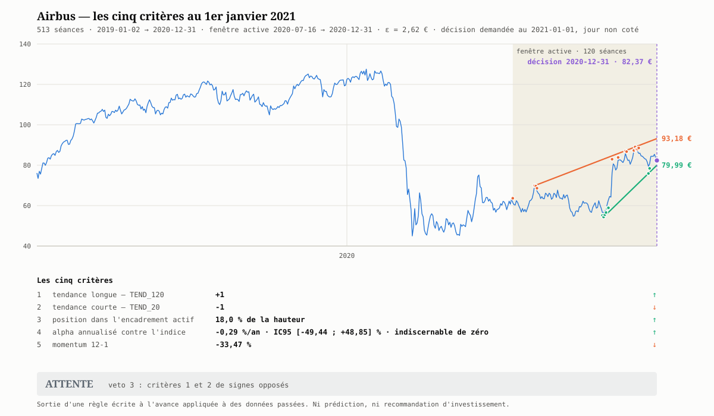

# Cours — De la figure à la décision

Le [chartiste](../../../../../.claude/agents/chartiste.md) sait produire une droite
ajustée, un canal, un support, une résistance, une portée, un nombre d'épisodes
de contact. L'agent [`trading`](../../../../../.claude/agents/trading.md) sait
produire un alpha, un bêta, un momentum. **Aucun des deux ne dit quoi en faire.**
Ce cours-ci est le pont : comment un ensemble de figures géométriques devient une
**règle écrite à l'avance** dont on publie le verdict — et pourquoi ce verdict est
« attendre » dans 99 cas sur 100.

Niveau bac+2. Prérequis : le [cours canal](../../semestre3/canal/README.md) (modules 1 à 5), le
[cours encadrement](../../semestre3/encadrement/README.md) (modules 1 à 4) et le
[cours alpha](../alpha/README.md) (modules 2 à 4). Ce cours n'introduit aucune
mathématique nouvelle : il **assemble**.

## Pourquoi ce cours

Parce que le passage de la figure à la décision est l'endroit où toute la rigueur
accumulée par les quatre cours précédents se perd habituellement en une phrase.

| Ce qu'on croit | Ce qu'il en est | Module |
|---|---|---|
| « Le cours est en bas de son canal, c'est le moment. » | Un critère isolé ne décide de rien ; au 31/12/2020 Airbus est à **18 %** de la hauteur de son canal **et** son momentum 12-1 vaut **$-33{,}5\,\%$** | [02](02-d-un-objet-a-un-critere.md) |
| « Je décide au vu du graphique. » | Décider *après* avoir vu, c'est choisir ses seuils sur le résultat : le [piège des tests multiples](../alpha/04-cinq-pieges.md) appliqué à sa propre main | [03](03-la-regle-ecrite-a-l-avance.md) |
| « Une bonne règle donne souvent un signal. » | Appliquée jour après jour à Airbus sur 2020-2021, la règle de ce cours rend **ATTENTE 512 fois sur 515** | [03](03-la-regle-ecrite-a-l-avance.md) |
| « Son excès de rendement est positif, donc elle a battu l'indice. » | Sur 2019-2020, Airbus affiche $+7{,}2\,\%$ d'excès arithmétique annuel, un ratio d'information de $+0{,}19$ — et $+8{,}2\,\%$ contre $+18{,}4\,\%$ en cumulé | [04](04-les-pieges-du-passage-a-l-acte.md) |
| « Le 1er janvier, je regarde les cours du 1er janvier. » | Le 1er janvier est férié, `--fin` est **exclusif**, et les deux séries n'ont pas le même calendrier — trois façons de fabriquer un regard en avant sans le vouloir | [04](04-les-pieges-du-passage-a-l-acte.md) |
| « Une règle correcte finit par payer. » | Sur 2021-2025, elle produit **un seul cycle complet** : $+0{,}67\,\%$ brut en dix-neuf mois, $-1{,}26\,\%$ à l'exécution réaliste, contre $+136\,\%$ pour le titre conservé | [06](06-cas-pratique.md) |

## Le fil directeur

> 🔑 **Une décision n'est pas une lecture de graphique, c'est l'exécution d'une
> règle publiée avant d'avoir vu les données.** Tout ce cours consiste à rendre
> cette phrase opérationnelle : nommer les objets (module 1), les transformer en
> critères sans dimension et datés (module 2), figer la règle et ses vetos
> (module 3), énumérer ce qui la corrompt (module 4), puis l'exécuter de bout en
> bout sur cinq années jusqu'au compte final d'un aller-retour (module 6). Le
> verdict lui-même n'occupe qu'une ligne — et il ne vaut que par les modules qui
> le précèdent.

## Plan

| # | Module | Ce qu'il établit |
|---|---|---|
| 1 | [Ce que le chartiste produit](01-ce-que-le-chartiste-produit.md) | L'inventaire des dix objets graphiques, leur module d'origine, et lesquels portent une incertitude |
| 2 | [D'un objet à un critère](02-d-un-objet-a-un-critere.md) ⭐ | Rendre un objet décidable : sans dimension, daté, borné ; la généalogie des cinq critères |
| 3 | [La règle écrite à l'avance](03-la-regle-ecrite-a-l-avance.md) ⭐ | Verdict ternaire, asymétrie achat/vente, les quatre vetos, `ATTENTE` par défaut ; le comptage 2020-2021 |
| 4 | [Les pièges du passage à l'acte](04-les-pieges-du-passage-a-l-acte.md) | Regard en avant, repeinture, tests multiples, drag de volatilité, coûts, périmètre du verdict |
| 6 | [Cas pratique : un cycle `ACHAT` → `VENTE`, 2021-2025](06-cas-pratique.md) ⭐ | La règle exécutée aux **1 281 séances** de cinq années, la convention de cycle déclarée avant tout chiffre, et le **seul aller-retour complet** qu'elle produit — coûts, alpha de même convention, et l'hypothèse d'exécution qui change le signe du résultat |

## Le fil rouge chiffré

**Airbus contre le CAC 40, du 2 janvier 2019 au 31 décembre 2020**, soit
513 séances pour le titre, 512 pour l'indice, **512 dates communes**. Deux ans
qui contiennent une année de hausse franche, un krach et un rebond partiel — le
contraire d'un échantillon confortable, et c'est voulu.

```bash
python python/import_societe.py AIR.PA  --debut 2019-01-02 --fin 2021-01-01
python python/import_societe.py '^FCHI' --debut 2019-01-02 --fin 2021-01-01
```

Les cinq critères mesurés à la dernière séance disponible, le **31 décembre 2020** :

| # | Critère | Valeur | Source |
|---|---|---|---|
| 1 | `TEND_120` | **$+1$** ($p = 9{,}8\cdot 10^{-22}$) | [`import_societe.py`](../../../../../python/import_societe.md) |
| 2 | `TEND_20` | **$-1$** ($p = 0{,}0031$) | idem |
| 3 | Position dans l'encadrement actif | **18,0 %** de la hauteur | [encadrement 04](../../semestre3/encadrement/04-lire-l-encadrement.md) |
| 4 | Alpha annualisé contre le CAC 40 | $-0{,}29\,\%$, **IC95 $[-49{,}4\ ;\ +48{,}9]\,\%$** | [alpha 02](../alpha/02-le-calcul-et-ses-erreurs-types.md) |
| 5 | Momentum 12-1 | **$-33{,}5\,\%$** | [module 2](02-d-un-objet-a-un-critere.md) |

> **Verdict : `ATTENTE`**, déclenché par le veto « critères 1 et 2 de signes
> opposés » — et confirmé indépendamment par l'échec des conditions d'`ACHAT`
> (momentum négatif) comme de `VENTE` (position à 18 %). Le
> [module 2](02-d-un-objet-a-un-critere.md) construit ces cinq critères et le
> [module 3](03-la-regle-ecrite-a-l-avance.md) en tire le verdict. Ce que la même
> règle donne sur les **cinq années suivantes** — 1 281 séances, un seul cycle
> complet — est l'objet du [module 6](06-cas-pratique.md).

## La figure du cours



Les cinq modules se lisent sur cette figure :

- l'**aplat** délimite la fenêtre active de 120 séances — tout ce qui est à sa
  gauche existe, mais la règle ne le regarde pas ([module 2](02-d-un-objet-a-un-critere.md)) ;
- le **trait vertical** marque la séance de décision, le 31 décembre 2020 : le
  1er janvier étant férié, c'est la dernière clôture connue, et rien à sa droite
  n'entre dans un calcul ([module 4](04-les-pieges-du-passage-a-l-acte.md)) ;
- **support** et **résistance** sont les arêtes d'enveloppe convexe du
  [cours encadrement](../../semestre3/encadrement/README.md), avec un disque sur chaque séance
  de contact — 6 épisodes en haut, 3 en bas, tout juste le minimum du veto 1 ;
- l'**encart** donne les cinq critères et le sens dans lequel chacun pousse ;
- le **bandeau** donne le verdict et la condition qui l'a déclenché.

Elle est produite par [`python/generer_graph_decision.py`](../../../../../python/generer_graph_decision.md) :

```bash
python python/generer_graph_decision.py \
  --csv docs/raw/quotes/AIR_PA_2019-01-02_2020-12-31.csv \
  --indice 'docs/raw/quotes/^FCHI_2019-01-02_2020-12-31.csv' \
  --date 2021-01-01 \
  --sortie docs/raw/concept/semestre4/trading/figures/airbus-decision-2021-01-01.svg \
  --titre "Airbus — les cinq critères au 1er janvier 2021"
```

> 🔑 **Le verdict inscrit sur la figure est calculé, jamais saisi.** Le script
> applique la règle du [module 3](03-la-regle-ecrite-a-l-avance.md) et écrit ce
> qu'elle rend. On ne peut donc pas lui faire dire autre chose qu'en changeant la
> règle — ce qui, alors, se voit dans le dépôt.

> ⚠️ Contrairement à la [figure du cours encadrement](../../semestre3/encadrement/README.md),
> produite par un script qui ne lit que les clôtures, celle-ci construit ses
> chaînes sur `High` et `Low`. Ses droites sont donc **celles des tableaux de ce
> cours**, et non celles de l'autre figure.

## Ce que ce cours alimente

- Le **§ 4 de l'agent [`trading`](../../../../../.claude/agents/trading.md)** est
  exactement la règle du [module 3](03-la-regle-ecrite-a-l-avance.md) ; ce cours
  en est la justification et le mode d'emploi.
- L'agent [`chartiste`](../../../../../.claude/agents/chartiste.md) fournit les
  objets du [module 1](01-ce-que-le-chartiste-produit.md) ; ce cours lui dit ce
  qu'il n'a **pas** le droit d'en conclure seul.

> ⚠️ **Ce cours ne donne aucun conseil en investissement.** Il décrit comment
> construire une règle et publier son verdict. Un verdict de règle n'est pas une
> recommandation : il ignore les frais, la fiscalité, la liquidité, la taille de
> position, l'horizon et la situation de celui qui lit. Le
> [§ 4.4 du cours encadrement](../../semestre3/encadrement/04-lire-l-encadrement.md) et les
> limites de l'agent `trading` posent la même frontière.

---

➡️ Commencer par le [module 1 — Ce que le chartiste produit](01-ce-que-le-chartiste-produit.md) ·
🏠 [Sommaire du dépôt](../../sommaire/README.md)
