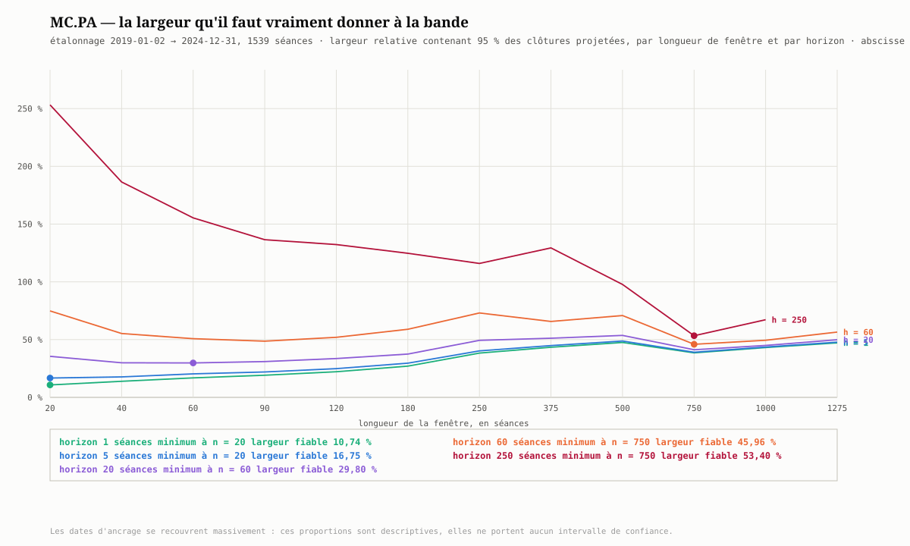
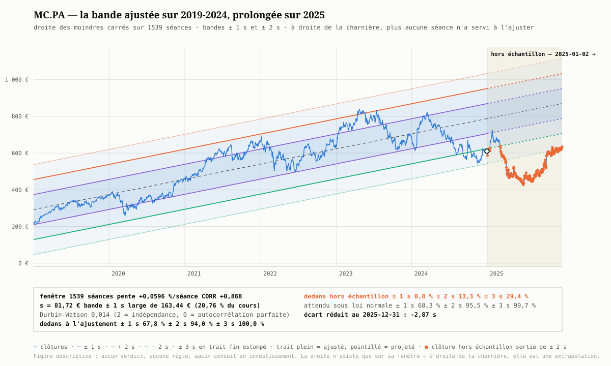
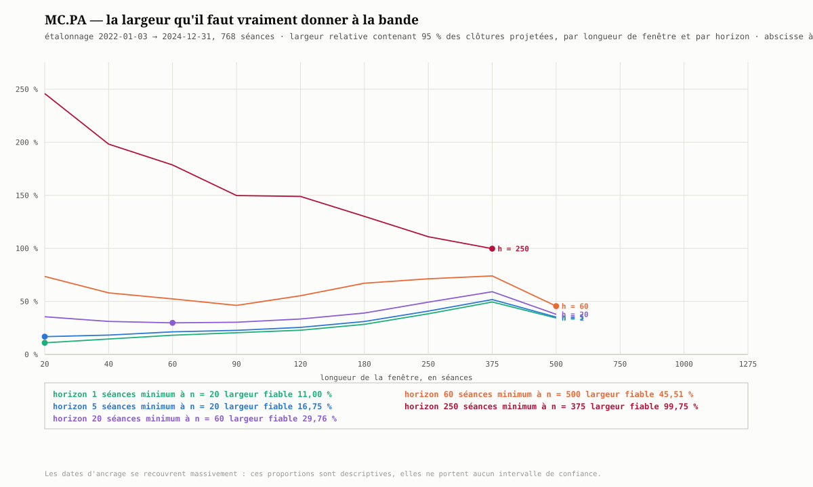
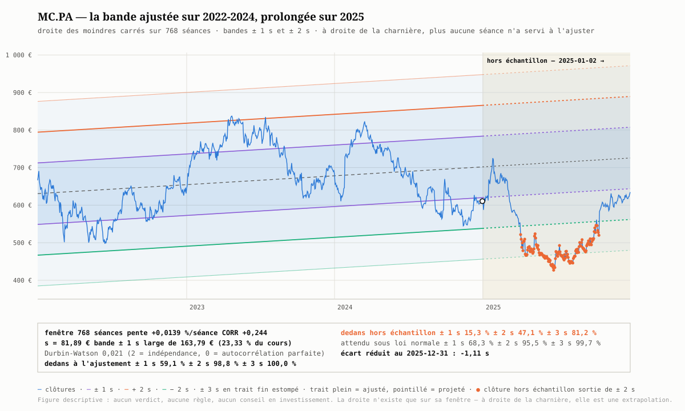
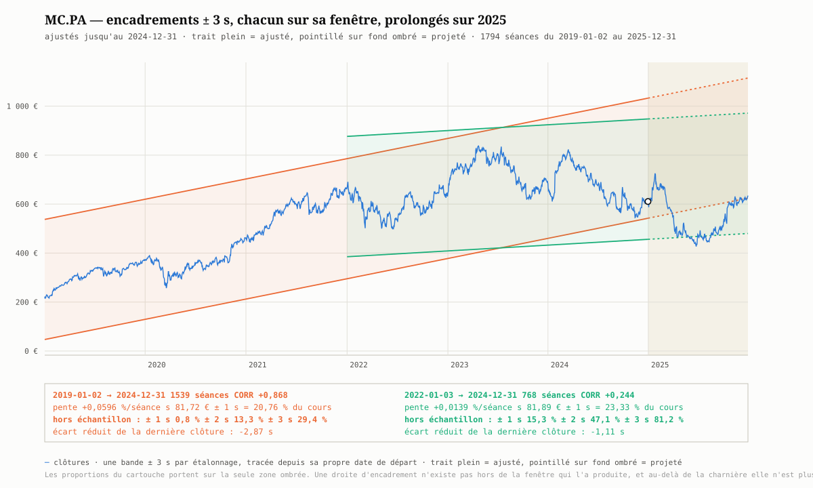

# La largeur de bande la plus étroite qui encadre encore

**La question.** Une bande d'encadrement se veut à la fois **étroite** — sans quoi
elle ne dit rien — et **fiable** — sans quoi elle ment. Les deux exigences
s'opposent. À quelle longueur de fenêtre faut-il ajuster la droite des moindres
carrés pour que la bande qui l'entoure soit la plus étroite possible *tout en
encadrant encore* les clôtures à venir ? Et une fois cette bande trouvée,
**aide-t-elle à anticiper ?**

Mesuré sur **LVMH (MC.PA)**, avec **deux étalonnages** et la même année de
vérité :

| Étalonnage              | Séances ajustées | Hors échantillon  |
| ----------------------- | ---------------- | ----------------- |
| 2019-01-02 → 2024-12-31 | 1 539            | 2025, 255 séances |
| 2022-01-03 → 2024-12-31 | 768              | 2025, 255 séances |

Le second n'est pas une illustration de plus : il sert de **reproduction**, et
c'est lui qui sépare, dans ce qui suit, ce qui tient de ce qui n'est qu'une
coïncidence de fenêtre. Le générateur est
[`figures/generer_largeur_fiable.py`](figures/generer_largeur_fiable.md), et il
refait tous les nombres de ce document en deux appels.

---

## La réponse, en tête

**Un optimum existe, il se déplace avec l'horizon, il se reproduit aux horizons
courts — et il est trop large pour servir.**

| Horizon | \[2019-2024\] fenêtre · largeur | \[2022-2024\] fenêtre · largeur | autour du cours |
|---|---|---|---|
| **1 séance** | 20 · **10,74 %** | 20 · **11,00 %** | ± 5,4 % |
| **5 séances** | 20 · **16,75 %** | 20 · **16,75 %** | ± 8,4 % |
| **20 séances** | 60 · **29,80 %** | 60 · **29,76 %** | ± 14,9 % |
| **60 séances** | 750 · 45,96 % | 500 · 45,51 % | ± 23 % |
| **250 séances** | 750 · 53,40 % | 375 · 99,75 % | *ne se reproduit pas* |

Pour encadrer honnêtement la clôture de **demain** — une seule séance —, il faut
déjà une bande large de **11 % du cours**. Un encadrement à un mois en demande
**30 %**. Aucune de ces bandes n'est assez étroite pour porter une décision.

Et les deux figures le montrent d'un seul regard : la bande ajustée sur six ans
contenait **67,8 %** des séances de son propre ajustement — le chiffre de manuel,
68,3 % attendus. Elle contient **0,8 %** des séances de l'année suivante.

---

## 1. Ce qui est optimisé, et à quel étage

L'optimisation par moindres carrés intervient à **deux étages**, et il faut les
séparer pour que la question ait un sens.

**Premier étage — à fenêtre donnée, il n'y a rien à chercher.** Parmi toutes les
droites possibles, celle des moindres carrés est *par construction* celle qui
minimise $\sum \varepsilon_i^2$, donc l'écart-type résiduel
$s = \sqrt{\sum \varepsilon_i^2/(n-2)}$, donc la largeur $2ks$ de la bande à $k$
fixé. La largeur la plus étroite **à $n$ fixé** est acquise dès qu'on ajuste par
moindres carrés. C'est une propriété de l'estimateur, pas un résultat de mesure.

**Second étage — le choix de $n$, et c'est là que le piège est.** Minimiser $s$
en balayant $n$ a une réponse triviale, et fausse :

| $n$ | largeur nominale $2s/\mathrm{VAL}$ |
|---|---|
| 20 | **3,53 %** |
| 60 | 6,03 % |
| 120 | 7,95 % |
| 250 | 13,67 % |
| 500 | 17,20 % |
| 1 275 | 16,04 % |

Plus la fenêtre est courte, plus la bande est étroite — jusqu'à 3,53 % du cours
sur 20 séances. Une bande de 3,5 % serait un instrument remarquable **si elle
tenait**. Elle ne tient pas, et c'est tout l'objet de ce document : **une largeur
ne se juge pas sans le taux de couverture qui va avec.**

## 2. Le critère de fiabilité, déclaré avant de mesurer

Une bande ajustée sur les séances qu'on lui fait ensuite contenir ne prouve rien :
la droite a été tirée *vers* ces points. C'est l'avertissement du
[module 2](../concept/semestre3/canal/02-les-trois-largeurs.md#22--lécart-type),
et il commande tout le protocole. La fiabilité se mesure donc **devant**, jamais
dedans.

Pour une longueur de fenêtre $n$ et un horizon $h$, et pour **chaque date
d'ancrage** $t$ de l'étalonnage disposant de $n$ séances derrière elle et de $h$
devant :

$$\widehat C_{t+j} = \mathrm{VAL}_t + r_t\,j, \qquad
z_{t,j} = \frac{C_{t+j} - \widehat C_{t+j}}{s_t}, \qquad j = 1 \dots h$$

De l'ensemble des $|z|$ ainsi rassemblés sortent les deux grandeurs qui décident :

- $\tau_2$, la proportion de clôtures futures réellement contenues dans
  $\pm 2\,s$ — à comparer aux **95,5 %** annoncés par la convention ;
- $k_{95}$, le 95ᵉ centile des $|z|$ : **le multiple qu'il aurait fallu** pour en
  contenir 95 %.

D'où le critère minimisé, la **largeur fiable** :

$$L(n,h) = k_{95}(n,h) \times \operatorname{méd}_t\!\left(\frac{2\,s_t}{\mathrm{VAL}_t}\right)$$

C'est la largeur relative que la bande doit atteindre pour encadrer vraiment 95 %
des clôtures à l'horizon $h$. **Le $n$ retenu est celui qui la minimise.**

## 3. Le témoin : dans sa propre fenêtre, tout va bien

| $n$ | dedans ± 1 s | dedans ± 2 s |
|---|---|---|
| 20 | 68,9 % | 97,2 % |
| 60 | 67,0 % | 96,6 % |
| 120 | 66,0 % | 96,8 % |
| 250 | 64,6 % | 97,5 % |
| 750 | 61,1 % | 98,3 % |
| 1 275 | 60,2 % | 97,4 % |
| *attendu* | *68,3 %* | *95,5 %* |

La concordance est bonne, et **elle ne prouve rien** : ces séances ont servi à
poser la droite. On note seulement une dérive lente — à 1 275 séances, $\pm 1\,s$
ne contient plus que 60,2 % au lieu de 68,3 %, pendant que $\pm 2\,s$ en contient
un peu trop : les résidus d'une fenêtre longue ont les queues épaisses et le
centre creux d'une marche aléatoire, pas la forme d'une gaussienne.

## 4. Le balayage : ce que la bande contient devant elle

**Proportion de clôtures futures dans $\pm 2\,s$**, pour 95,5 % annoncés
(étalonnage 2019-2024) :

| $n$ | ajustement | $h=1$ | $h=5$ | $h=20$ | $h=60$ | $h=250$ |
|---|---|---|---|---|---|---|
| 20 | 97,2 % | 80,3 % | 67,7 % | 42,2 % | 24,8 % | 10,0 % |
| 60 | 96,6 % | 84,8 % | 78,5 % | 62,9 % | 40,2 % | 18,2 % |
| 120 | 96,8 % | 82,9 % | 79,8 % | 68,8 % | 50,0 % | 25,4 % |
| 250 | 97,5 % | 81,5 % | 79,2 % | 71,7 % | 55,7 % | 28,9 % |
| 750 | 98,3 % | 88,5 % | 87,9 % | 85,1 % | 78,5 % | 70,2 % |
| 1 275 | 97,4 % | 51,9 % | 50,2 % | 44,9 % | 45,3 % | — |

> 🔑 **La chute est immédiate.** Dès la **séance suivante** — une seule —, la bande
> à $\pm 2\,s$ qui contenait 97 % de sa fenêtre n'en contient plus que 76 à 88 %.
> Il ne s'agit pas d'une dégradation progressive qu'on pourrait borner : le saut
> se fait entre le dernier point ajusté et le premier point projeté.

**Largeur fiable $L(n,h)$, en % du cours** — c'est la grandeur minimisée, et les
minimums sont en gras :

| $n$ | $h=1$ | $h=5$ | $h=20$ | $h=60$ | $h=250$ |
|---|---|---|---|---|---|
| 20 | **10,74** | **16,75** | 35,54 | 74,87 | 253,21 |
| 40 | 13,92 | 17,73 | 29,96 | 55,31 | 186,43 |
| 60 | 16,86 | 20,34 | **29,80** | 50,84 | 155,41 |
| 90 | 19,20 | 21,97 | 30,95 | 48,63 | 136,46 |
| 120 | 22,19 | 24,85 | 33,63 | 52,00 | 132,25 |
| 180 | 27,05 | 29,63 | 37,48 | 58,98 | 124,73 |
| 250 | 38,34 | 40,27 | 49,36 | 73,04 | 115,95 |
| 375 | 43,41 | 44,87 | 51,22 | 65,71 | 129,38 |
| 500 | 47,52 | 48,76 | 53,64 | 70,85 | 97,72 |
| 750 | 38,57 | 39,05 | 41,22 | **45,96** | **53,40** |
| 1 000 | 43,10 | 43,61 | 44,98 | 49,42 | 67,25 |
| 1 275 | 47,18 | 47,78 | 49,89 | 56,53 | — |



Trois lectures, dans l'ordre d'importance.

**a. L'optimum se déplace vers les fenêtres longues à mesure que l'horizon
s'allonge** — 20 séances pour la séance du lendemain, 60 pour un mois, davantage
au-delà. Le mécanisme est lisible : une fenêtre courte donne un $s$ minuscule mais
une **pente presque entièrement faite de bruit**, qu'extrapoler déplace la droite
bien plus vite que la largeur de la bande ne le tolère. À $n = 20$ et $h = 250$,
il faut $k_{95} = 72$ : la droite de vingt séances, prolongée d'un an, se trompe
de soixante-douze écarts-types.

**b. Même le cas le plus favorable est décevant.** $k_{95}$ vaut **2,8 à 3,0
quel que soit $n$ à l'horizon d'une séance**. Autrement dit, la convention
$\pm 2\,s$ — celle que tout le dépôt emploie — est **insuffisante dès le
lendemain**, et il faudrait la porter à $\pm 3\,s$ pour tenir sa promesse de
95 %.

**c. L'anomalie de $n = 750$ n'est pas un résultat.** Cette ligne est
systématiquement meilleure que ses deux voisines, 500 et 1 000, ce qu'aucun
mécanisme ne justifie. Ses 730 à 790 ancrages tombent tous dans une portion
limitée du calendrier, où la droite de trois ans s'est trouvée bien orientée.
C'est une **coïncidence de fenêtre** — et le § 6 le confirmera, puisqu'elle ne se
reproduit pas.

> ⚠️ **La fenêtre de 5 ans — 1 275 séances — est le pire cas du tableau, et c'est
> un artefact.** Sur 1 539 séances d'étalonnage, elle ne laisse que **264 dates
> d'ancrage, toutes situées en 2024**. Ses proportions ne décrivent pas « la
> fenêtre de cinq ans », elles décrivent le repli de LVMH en 2024 vu par une
> droite calée sur la montée qui l'a précédé. Aux horizons longs, elle est écartée
> faute d'ancrages : à $h = 250$, l'étalonnage n'en laisserait que quinze.

## 5. La bande de six ans : 2019-2024 ajustée, 2025 jugée



La bande est ajustée sur **toute la plage déclarée**, du 2019-01-02 au
2024-12-31 — 1 539 séances, six années civiles. À gauche de la charnière, trait
plein : c'est un ajustement. À droite, en pointillé sur fond ombré : c'est une
**extrapolation**, et aucune séance de 2025 n'a servi à la produire.

| | |
|---|---|
| Pente | **+0,0596 %/séance**, `CORR` = **+0,868** |
| Écart-type résiduel | $s$ = **81,72 €** — bande $\pm 1\,s$ large de 163,44 €, soit **20,76 %** du cours |
| Dedans, à l'ajustement | **67,8 %** dans $\pm 1\,s$, **94,0 %** dans $\pm 2\,s$, **100,0 %** dans $\pm 3\,s$ |
| Dedans, sur 2025 | **0,8 %** dans $\pm 1\,s$, **13,3 %** dans $\pm 2\,s$, **29,4 %** dans $\pm 3\,s$ |
| Écart réduit au 2025-12-31 | **−2,87 s** |

La corrélation est forte, la droite n'est pas une dispersion, et l'ajustement est
d'une conformité exemplaire : 67,8 % pour 68,3 % attendus, 94,0 % pour 95,5 %.
**C'est exactement le genre de bande qu'on serait tenté de prolonger.**

Sur l'année suivante, elle contient **deux séances sur 255** dans $\pm 1\,s$, et
34 dans $\pm 2\,s$. Les 221 autres sont marquées d'un point sur la figure. Il ne
s'agit pas d'un débordement de fin d'année qu'on pourrait dater : le cours passe
sous la bande et n'y revient pas.

## 6. La même mesure sur trois ans : 2022-2024 ajustée, 2025 jugée

Le raisonnement ne change pas d'une ligne, seule la charnière gauche recule :
étalonnage du **2022-01-03 au 2024-12-31** — 768 séances —, et la même année 2025
laissée hors échantillon. La fenêtre de **deux ans**, soit 500 séances, est l'une
des longueurs balayées.

```bash
python docs/raw/lab/figures/generer_largeur_fiable.py \
    --debut 2022-01-01 --charniere 2024-12-31 --fin 2025-12-31
```

### a. Le balayage se reproduit — aux horizons courts

| Horizon | 2019-2024 (1 539 séances) | 2022-2024 (768 séances) |
|---|---|---|
| 1 séance | $n$ = 20, **10,74 %** | $n$ = 20, **11,00 %** |
| 5 séances | $n$ = 20, **16,75 %** | $n$ = 20, **16,75 %** |
| 20 séances | $n$ = 60, **29,80 %** | $n$ = 60, **29,76 %** |
| 60 séances | $n$ = 750, 45,96 % | $n$ = 500, 45,51 % |
| 250 séances | $n$ = 750, 53,40 % | $n$ = 375, **99,75 %** |

> 🔑 **Les trois premiers optimums se retrouvent à l'identique** — même fenêtre
> retenue, et des largeurs qui concordent à moins de 0,3 point — sur un étalonnage
> **deux fois plus court**, commencé trois ans plus tard, et dont la fenêtre de
> 2020-2021 est entièrement absente. Ce n'est plus une réalisation, c'est une
> **reproduction** : les niveaux de 11 %, 16,75 % et 29,8 % ne sont pas un accident
> de la série choisie.

> ⚠️ **Les deux derniers ne se reproduisent pas.** À un an, 53,40 % contre
> 99,75 % — presque le double. C'était le cas signalé au § 4.c, et le second
> étalonnage tranche : **le minimum des horizons longs n'est pas un résultat**, il
> suit les quelques ancrages que l'étalonnage laisse disponibles. Sur 768 séances,
> l'horizon d'un an ne laisse plus aucune fenêtre au-delà de 375.



### b. La bande de trois ans, prolongée sur 2025



| | 2019-2024 | 2022-2024 |
|---|---|---|
| Séances ajustées | 1 539 | 768 |
| Pente | +0,0596 %/séance | **+0,0139 %/séance** |
| `CORR` | **+0,868** | **+0,244** |
| $s$ | 81,72 € | 81,89 € |
| Largeur $\pm 1\,s$ | 20,76 % du cours | 23,33 % |
| Dedans à l'ajustement, $\pm 1/2/3\,s$ | 67,8 % / 94,0 % / 100,0 % | **59,1 % / 98,8 % / 100,0 %** |
| Dedans sur 2025, $\pm 1/2/3\,s$ | **0,8 % / 13,3 % / 29,4 %** | **15,3 % / 47,1 % / 81,2 %** |
| Écart réduit au 2025-12-31 | −2,87 s | −1,11 s |
| Durbin-Watson | 0,014 | 0,021 |

> 🔑 **La bande qui paraissait la meilleure a projeté la pire.** Sur son propre
> ajustement, celle de six ans est irréprochable : `CORR` = +0,868, une vraie
> tendance, et 67,8 % / 94,0 % pour 68,3 % / 95,5 % attendus. Celle de trois ans
> est douteuse : `CORR` = +0,244, à peine au-dessus du seuil de 0,20 en deçà duquel
> ce dépôt refuse de parler de canal, et 59,1 % / 98,8 % — une distribution
> visiblement creuse au centre et courte en queues, qui ne ressemble à aucune
> gaussienne. **Hors échantillon, la douteuse contient dix-neuf fois plus de
> séances dans $\pm 1\,s$** — 15,3 % contre 0,8 % — et trois fois et demie plus
> dans $\pm 2\,s$.

**Ce qui les sépare n'est pas la largeur, c'est la pente.** Les deux bandes ont le
même écart-type résiduel, à 0,2 % près : 81,72 € contre 81,89 €. Toute la
différence tient dans ce qu'elles extrapolent. La droite de six ans porte la
montée de 2019-2021 dans sa pente et la projette sur 2025 — **+15,2 % sur
l'année**, que LVMH n'a pas délivrés. Celle de trois ans est presque plate :
**+3,5 %** projetés, et elle se trompe d'autant moins.

> ⚠️ **Un `CORR` élevé n'est pas un permis d'extrapoler.** Il mesure à quel point
> une droite résume **le passé** de sa fenêtre, et rien d'autre. Les deux figures
> côte à côte en sont le contre-exemple : la corrélation la plus forte a produit la
> projection la plus fausse, précisément parce qu'elle a fidèlement prolongé une
> tendance qui avait cessé. Le seuil `CORR_FAIBLE` de ce dépôt écarte les droites
> qui n'expliquent rien ; **il ne promeut pas celles qui expliquent beaucoup.**

## 7. Les deux prolongements, dans la zone qu'ils prétendaient encadrer

Les deux étalonnages produisent chacun une largeur — l'une bâtie sur six ans,
l'autre sur trois — et toutes deux **s'arrêtent à la même charnière**. Leurs
prolongements vivent donc dans la même zone, et c'est là qu'il faut les regarder
ensemble.

```bash
python docs/raw/lab/figures/generer_largeur_fiable.py --prolonger 2022-01-01
```



**La figure affiche tout l'historique, du 2019-01-02 au 2025-12-31**, et la
charnière le coupe en deux. À gauche, chaque bande est **ajustée** : elle court en
trait plein depuis **sa propre date de départ** — celle de six ans dès 2019, celle
de trois ans seulement à partir de 2022, parce qu'**une droite d'encadrement
n'existe pas hors de la fenêtre qui l'a produite**. À droite, sur fond ombré, les
255 séances de 2025 : les quatre droites y passent en pointillé et ne sont plus
que des **extrapolations**, qu'aucune clôture visible n'a servi à poser.

La figure ne trace **que les $\pm 3\,s$**. C'est le niveau que le § 4.b désigne
comme honnête — $k_{95} \simeq 2{,}9$ dès l'horizon d'une séance — et cette figure
ne pose qu'une question : *même celui-là tient-il ?* Les $\pm 1\,s$ et
$\pm 2\,s$ restent chiffrés dans le tableau ci-dessous et dans le cartouche, dont
les proportions portent sur la **seule zone ombrée**.

| Prolongement | $\pm 1\,s$ | $\pm 2\,s$ | $\pm 3\,s$ | écart réduit final |
|---|---|---|---|---|
| étalonné 2019-2024, $s$ = 81,72 € | **0,8 %** | **13,3 %** | **29,4 %** | −2,87 s |
| étalonné 2022-2024, $s$ = 81,89 € | **15,3 %** | **47,1 %** | **81,2 %** | −1,11 s |
| *attendu sous loi normale* | *68,3 %* | *95,5 %* | *99,7 %* | |

> 🔑 **Même $\pm 3\,s$ ne rattrape rien.** C'est pourtant la largeur que le § 4.b
> désigne comme honnête — $k_{95} \simeq 2{,}9$ dès l'horizon d'**une** séance —, et
> dans leur propre fenêtre d'ajustement les deux bandes y enferment **100,0 %** des
> séances, mieux que les 99,7 % attendus. Prolongée d'un an, celle de six ans n'en
> contient plus que **29,4 %**, celle de trois ans **81,2 %**. **Tripler la largeur
> d'un encadrement ne le rend pas fiable : cela déplace seulement le seuil où il
> échoue** — et le § 4 disait déjà pourquoi, puisqu'à l'horizon de 250 séances il
> faudrait non pas 3 mais $k_{95}$ = 3,2 à 72 selon la fenêtre.

> 🔑 **Les deux bandes ont la même largeur et ne disent pas la même chose.** Leurs
> écarts-types résiduels sont jumeaux — 81,72 € contre 81,89 €, 0,2 % d'écart — de
> sorte que les deux couloirs tracés sur la figure ont la **même épaisseur**. Mais
> leurs droites centrales divergent tout au long de l'année : au 2025-12-31, l'une
> annonce **869,51 €**, l'autre **725,64 €**, et le cours cote **634,65 €**. Les
> deux prolongements du même titre finissent séparés de **143,87 €** — 88,0 % de la
> largeur $\pm 1\,s$, presque une bande entière — et **tous deux au-dessus du
> cours**, de 235 € et de 91 €.

C'est le constat le plus dur de ce document, et il ne tient pas à la qualité de
l'ajustement : **déplacer la seule date de début, de 2019 à 2022, suffit à
déplacer la prévision de presque une largeur de bande.** Un encadrement dont la
position dépend à ce point d'un choix arbitraire — quand commencer à regarder —
n'encadre pas : il enregistre la pente du morceau de passé qu'on lui a donné.

> **Contrôle de reproduction.** La bande 2022-2024 calculée ici, à l'intérieur du
> même appel que celle de 2019, est **identique au chiffre près** à celle du § 6.b,
> qui sort d'un appel séparé lisant un CSV tronqué différemment : pente
> +0,0139 %/séance, `CORR` +0,244, $s$ = 81,89 €, 15,3 % / 47,1 %, écart final
> −1,11 s. Les deux chemins de calcul ne partagent que la formule.

> ⚠️ **L'échelle verticale de cette figure contient les clôtures de 2025**, puisque
> ce sont elles qu'on affiche. Aucune borne de bande n'en dépend : les quatre
> droites sont entièrement déterminées par des séances antérieures au 2025-01-02, et
> l'invariant du dépôt — aucune quantité datée du jour $d$ ne dépend d'une séance
> postérieure, échelles comprises — porte sur les **quantités calculées**, pas sur
> le cadrage de ce qu'on donne à voir.

## 8. Pourquoi : Durbin-Watson = 0,014 et 0,021

$$\mathrm{DW} = \frac{\sum (\varepsilon_i - \varepsilon_{i-1})^2}{\sum \varepsilon_i^2}$$

Pour 2 sous indépendance. Les deux bandes rendent **0,014** et **0,021**. Leurs
résidus ne sont pas un bruit : ils sont une **marche aléatoire**, dont chaque terme
est à quelques dixièmes d'euro du précédent. C'est la réserve du
[module 4](../concept/semestre3/canal/04-sorties-de-canal.md#c-lautocorrélation-encore),
rencontrée ici à son degré extrême, et elle explique **tout** ce qui précède :

- $s$ ne mesure pas l'erreur d'une prévision, il mesure l'**amplitude des
  excursions** de la série autour de sa droite. Les deux n'ont aucune raison de
  coïncider, et l'erreur de prévision croît avec l'horizon quand $s$ reste fixe ;
- la garantie « 68,3 % et 95,5 % » suppose des erreurs i.i.d. gaussiennes. Sur des
  résidus à DW = 0,014, cette hypothèse n'est pas approximativement vraie : elle
  est **fausse d'un ordre de grandeur**, et les proportions du § 4 le mesurent ;
- une bande honnête devrait s'**élargir avec l'horizon** — c'est la bande de
  prédiction du [module 3](../concept/semestre3/canal/03-epaisseur-variable-et-levier.md).
  Une bande d'épaisseur constante prolongée dans le futur promet une précision
  qu'elle n'a pas.

## 9. Ce que ce document n'établit pas

**Une valeur, deux étalonnages.** Tout ce qui précède porte sur LVMH. Le second
étalonnage a fait son office — il a **confirmé** les optimums de court horizon et
**réfuté** ceux de long horizon —, mais deux fenêtres de la même valeur ne font
pas un échantillon de valeurs. Que $L(20, 1) \simeq 11\ \%$ vaille aussi pour
Airbus ou TotalEnergies reste à mesurer, et la mesure est un appel de plus.

**Les dates d'ancrage se recouvrent massivement.** Deux ancrages voisins partagent
$n-1$ clôtures, et les $h$ projections d'un même ancrage ne sont pas indépendantes
entre elles. Les proportions publiées sont **descriptives** ; aucun intervalle de
confiance ne les accompagne, et ce serait une faute d'en calculer un sur le nombre
de points. C'est la leçon des grappes de dates de
[l'expérience 5](../../done/experimentation/experience_5/README.md), appliquée
ici.

**Le témoin qui manque.** Ce document compare la bande de régression à
elle-même, jamais à une référence plus simple : une bande de largeur
$\pm 1{,}96\,\sigma_{\text{journalier}}\sqrt h$ autour de la **dernière clôture**,
sans droite ni pente. Tant que cette comparaison n'est pas faite, on sait que
l'encadrement par régression est insuffisant, mais pas s'il fait **mieux ou pire
que ne rien modéliser du tout**. Le § 6.b en donne d'ailleurs un avant-goût
inquiétant : la bande dont la pente était la plus faible est celle qui s'est le
moins trompée.

**Le signe n'a pas été testé.** Ce document juge la bande comme un
**intervalle** — « le cours sera-t-il dedans ? ». Il ne dit rien de l'usage qu'en
font les expériences 4 à 12, qui ne lisent pas l'intervalle mais l'**écart réduit
signé**, comme un classement entre valeurs à une même date. Les deux questions
sont distinctes, et l'échec de la première n'emporte pas celui de la seconde.

## 10. La réponse à la question posée

**Comme instrument d'anticipation, non.** Le critère « la bande la plus étroite
qui encadre encore » a bien un optimum, et cet optimum est **reproductible aux
horizons courts** : 20 séances à un jour et à une semaine, 60 séances à un mois,
retrouvés à l'identique sur deux étalonnages qui ne partagent que trois années.
Mais la largeur qu'il faut payer pour que l'encadrement soit vrai — **11 % du
cours pour la seule séance du lendemain, 30 % à un mois** — est sans commune
mesure avec ce qu'une décision pourrait exploiter. Une bande qui ne se trompe pas
est une bande qui ne dit rien.

**Deux choses, en revanche, sont utilisables tout de suite.**

1. **La convention $\pm 2\,s$ n'a pas le taux de couverture qu'elle annonce, dès
   la séance suivante** — 76 à 88 % des clôtures au lieu de 95,5 %, sur les deux
   étalonnages, et $k_{95} \simeq 2{,}9$. Un seuil de décision posé à $\pm 2\,s$ ne
   sélectionne donc pas un événement à 4,5 %, mais un événement à 12 ou 20 %. Ce
   n'est pas un argument contre les règles des expériences 4 à 12 — c'est la
   correction de ce qu'on croit mesurer en les appliquant.

2. **Un `CORR` élevé ne justifie pas d'extrapoler plus loin.** La droite la mieux
   ajustée des deux a produit la projection la plus fausse, d'un facteur vingt sur
   la couverture à $\pm 1\,s$. Entre deux fenêtres, la moins pentue s'est trompée
   le moins — ce qui, sur une série à DW = 0,02, est exactement ce qu'il fallait
   attendre.

---

> Ce document ne rend aucun verdict d'achat ou de vente, ne dimensionne aucune
> position et ne prédit aucun cours. Il mesure la couverture d'un encadrement, et
> il la publie.
